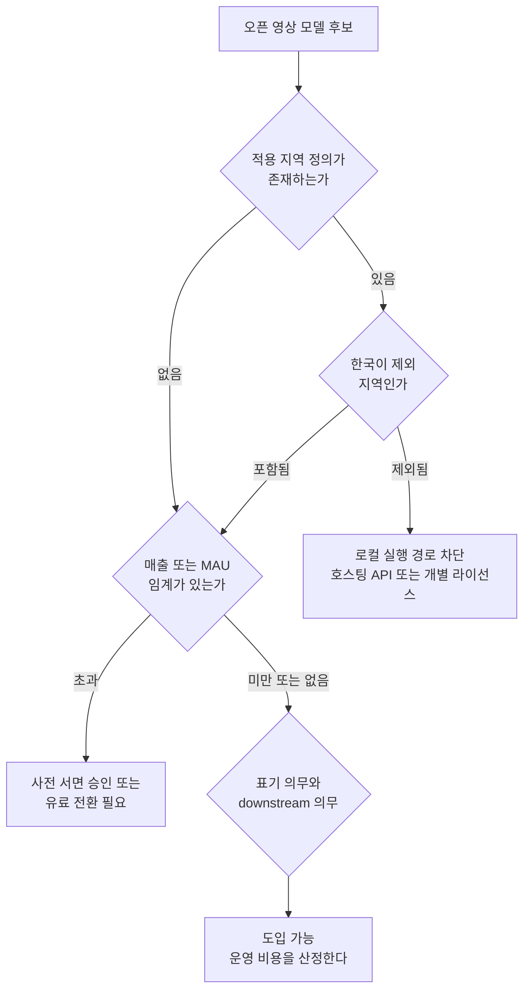

국내에서 영상 생성 모델을 제품에 넣을지 판단해야 하는 엔지니어링 리드와 기술 의사결정자를 위한 글입니다. 이 글을 읽고 나면 오픈 웨이트 영상 모델을 고를 때 벤치마크 점수보다 라이선스 조항을 먼저 읽어야 하는 이유와, 그 조항을 어떤 순서로 확인해야 하는지를 알게 됩니다.

결론부터 말하겠습니다. 적용 지역에서 한국을 빼는 관행은 최근에 시작된 것이 아니라 2024년 12월부터 이어져 온 흐름입니다. 그리고 오늘 기준으로 널리 쓰이는 오픈 영상 모델 가운데 지역 제한과 규모 제한을 모두 피해 가는 것은 손에 꼽습니다. 아래에서는 라이선스 원문 여섯 개를 직접 열어 확인한 내용을 근거로 이 주장을 논증하고 다음 모델을 고를 때 그대로 쓸 수 있는 일곱 문항의 점검 순서를 정리합니다.

*모델을 받을 수 있다는 것과 쓸 수 있다는 것은 다른 문제가 됐습니다.*

## 텐센트는 2024년 12월부터 한국을 빼고 있었습니다

HunyuanVideo의 라이선스 파일은 첫 화면에서 적용 범위를 못 박습니다. 유럽연합과 영국, 그리고 한국에서는 이 계약이 적용되지 않으며 권리 범위가 아래에 정의된 지역으로 한정된다는 문장이 본문이 시작되기도 전에 대문자로 적혀 있습니다. 이 문장이 붙은 릴리스 날짜는 2024년 12월 3일입니다.

같은 문장은 그 뒤로도 그대로 이어집니다. 2025년 3월에 나온 이미지 투 비디오 버전에도, 2025년 11월에 나온 1.5 버전에도 토씨 하나 다르지 않은 같은 문단이 들어 있습니다. 세 번의 릴리스, 약 1년에 걸쳐 같은 제외 조항이 유지된 것입니다.

그동안 국내 커뮤니티에서 이 조항이 화제가 된 기억은 거의 없습니다. 모델 카드에는 라이선스 이름만 표기되고, 실제 문장은 별도 파일 안에 있으며, 대부분의 사용자는 그 파일을 열지 않기 때문입니다. 다운로드 버튼이 눌리는 것과 계약서가 읽히는 것 사이에는 상당한 거리가 있습니다.

## MiniMax H3가 새로 더한 것은 미국과 출력물 조항입니다

2026년 8월 2일자로 발효된 MiniMax H3 커뮤니티 라이선스는 제외 지역을 유럽연합, 영국, 한국, 그리고 미국으로 정의합니다. 앞선 텐센트 조항과 비교하면 달라진 것은 미국이 추가됐다는 점입니다. 화제가 크게 된 이유도 여기에 있다고 봅니다. 한국이 빠진 것은 새로운 일이 아니었지만, 미국이 빠진 것은 새로운 일이었습니다.

조항 자체는 앞선 사례보다 촘촘합니다. 사용 제한 절은 가중치뿐 아니라 그 출력물까지 적용 지역 밖에서 사용하거나 배포하거나 전시할 수 없다고 규정합니다. 연매출 2천만 달러를 넘는 조직은 별도의 사전 서면 승인을 받아야 하고 이 모델을 쓴 상업 제품은 사용자 화면에 모델 이름을 눈에 띄게 표시해야 합니다. 출력물로 다른 인공지능 모델을 개선하는 행위는 지역과 무관하게 전역에서 금지됩니다. 호스팅 서비스를 제공한다면 downstream 사용자에 대한 기술적 안전장치를 구축하고 유지하고 주기적으로 점검할 의무까지 따라붙습니다. 분쟁이 생기면 홍콩 법원이 전속 관할입니다.

여기서 눈여겨볼 것은 조항의 강도가 아니라 방향입니다. 오픈 웨이트라는 표현이 처음 퍼질 때 사람들이 떠올린 것은 받으면 쓸 수 있다는 상태였습니다. 지금 배포되는 문서들은 받는 것과 쓰는 것을 분리하고, 쓰는 조건을 지역과 매출과 용도로 나누어 걸고 있습니다.

## 라이선스는 정작 당신이 어디에 있는지를 정의하지 않습니다

실무에서 가장 먼저 나오는 질문은 이것입니다. 우리 법인은 한국에 있는데 GPU가 해외 리전에 있으면 어떻게 되는가. 싱가포르 자회사 명의로 받으면 되는가. 개발자가 출장 중이면 기준이 달라지는가.

H3 라이선스 원문에서 이 질문에 답할 만한 표현을 찾아봤습니다. 소재지나 거주지, 설립지, 주된 사업장 같은 판정 기준을 뜻하는 단어는 문서 전체에 한 번도 등장하지 않습니다. 제외 지역이 무엇인지는 정의돼 있지만, 어떤 주체가 그 지역에 속하는지를 판정하는 규칙은 비어 있습니다.

이 공백은 사소하지 않습니다. 계약 해석이 갈릴 수 있는 지점이 정확히 실무자가 가장 먼저 부딪히는 지점이기 때문입니다. 게다가 준거법과 관할이 홍콩으로 지정돼 있어서, 이 공백을 국내 법원이 우리에게 익숙한 방식으로 메워 줄 것이라고 가정하기도 어렵습니다.

하나 더 덧붙이면, 출력물의 정의에는 호스팅 서비스를 통해 얻은 결과까지 포함돼 있습니다. 업계에서는 호스팅 API가 제외 지역의 정식 경로라고 보고 있고 그 해석이 통용되고 있지만, 문언만 놓고 보면 두 조항이 매끄럽게 맞물리지는 않습니다. 저희는 이 지점을 모호성이 남아 있다고만 말하고 결론은 내리지 않겠습니다. 이 글은 조항을 읽은 기록이지 법률 자문이 아니며, 실제 판단은 각 사 법무 검토를 거쳐야 합니다.

## 여섯 개 모델을 같은 일곱 문항으로 읽었습니다

라이선스마다 문서 구조와 용어가 달라서 그대로 비교하면 인상 비평이 됩니다. 그래서 같은 일곱 개 질문을 던지고 답만 모았습니다. 아래는 2026년 8월 9일에 각 저장소의 라이선스 파일을 직접 내려받아 대조한 결과입니다.

| 모델 | 라이선스 날짜 | 지역 제외 | 규모 게이트 | 출력물 제약 | 증류 금지 | 준거법 |
|---|---|---|---|---|---|---|
| Wan 2.2 (Alibaba) | Apache 2.0 | 없음 | 없음 | 없음 | 없음 | Apache 2.0 |
| HunyuanVideo (Tencent) | 2024-12-03 | EU, 영국, 한국 | MAU 1억 | 있음 | 있음 | 별도 지정 |
| HunyuanVideo-I2V | 2025-03-05 | EU, 영국, 한국 | MAU 1억 | 있음 | 있음 | 별도 지정 |
| HunyuanVideo 1.5 | 2025-11-21 | EU, 영국, 한국 | MAU 1억 | 있음 | 있음 | 별도 지정 |
| LTX-2.3 (Lightricks) | 2026-01-05 | 없음 | 연매출 1천만 달러 | 있음 | 있음 | 뉴욕주법 |
| MiniMax H3 | 2026-08-02 | EU, 영국, 한국, 미국 | 연매출 2천만 달러 | 있음 | 있음 | 홍콩 |

다음 모델을 검토할 때는 같은 순서로 확인하시면 됩니다. 적용 지역 정의가 있는가, 그 제한이 출력물에도 걸리는가, 매출이나 사용자 수 임계가 있는가, 화면 표기나 고지 의무가 있는가, 출력물로 다른 모델을 학습하는 것이 금지되는가, 서비스로 제공할 때 downstream 의무가 생기는가, 분쟁 관할이 어디인가. 일곱 문항 중 앞의 세 개는 도입 가능 여부를 가르고, 뒤의 네 개는 운영 비용을 가릅니다.

*앞의 세 문항이 도입 가능 여부를, 뒤의 문항이 운영 비용을 결정합니다.*

*왼쪽은 한국을 적용 지역에서 제외한 시점이고, 오른쪽은 유료 전환이나 사전 승인이 걸리는 임계입니다.*

## 지역 제한이 없다고 해서 자유로운 것도 아닙니다

여기서 통념 하나를 짚고 가야 합니다. 지역 제외 조항이 중국 연구소 쪽에서 주로 나오다 보니 서구 모델은 상대적으로 관대하다는 인상이 생기기 쉽습니다. 숫자만 놓고 보면 그렇지 않습니다.

이스라엘과 미국 기반의 Lightricks가 배포하는 LTX-2.3은 지역 제한이 없는 대신 연매출 1천만 달러 이상인 조직에 유료 상업 라이선스를 요구합니다. MiniMax H3의 임계인 2천만 달러보다 오히려 낮습니다. 중견 규모 이상의 국내 기업이라면 LTX 쪽에서 먼저 비용이 발생할 수 있다는 뜻입니다. Zhipu의 CogVideoX도 학술 연구는 자유롭지만 상업적 사용은 등록 절차를 거쳐야 하고 월 방문자 100만이라는 별도 상한이 붙습니다.

그러니까 축이 두 개입니다. 하나는 지역이고 다른 하나는 규모입니다. 어느 한 축만 보고 안전하다고 판단하면 다른 축에서 걸립니다. 두 축을 모두 통과하는 것은 표준 오픈소스 라이선스로 나온 모델들이고, 실사용 규모까지 갖춘 것으로 좁히면 Apache 2.0으로 배포되는 Wan 2.2 계열이 현재 가장 현실적인 선택지입니다. 지역 조항도, 매출이나 사용자 수 임계도, 출력물이나 증류에 대한 별도 제약도 없습니다. Open-Sora v2처럼 같은 Apache 2.0을 쓰는 모델이 더 있으니 조건만 놓고 보면 유일한 선택은 아닙니다. 다만 다운로드 수와 생태계 지원의 차이가 커서, 실제로 제품에 얹을 때 감당해야 할 통합 비용이 다릅니다.

## 그래서 국내 팀은 무엇을 골라야 하는가

가중치를 받아 사내에서 서빙하는 경로를 전제한다면 Wan 2.2를 기본값으로 두는 편이 합리적입니다. 품질이 모든 항목에서 최고라서가 아니라, 도입 이후에 라이선스가 문제를 일으킬 확률이 가장 낮기 때문입니다. 모델 품질은 다음 릴리스에서 뒤집히지만 계약 조항은 그렇게 빨리 바뀌지 않습니다.

제외 지역에 속하면서도 특정 모델이 꼭 필요하다면 두 갈래가 남습니다. 하나는 공급자의 호스팅 API를 쓰는 것이고, 이 경우 적용되는 문서는 오픈 웨이트 라이선스가 아니라 별도의 API 이용약관입니다. 다른 하나는 개별 라이선스를 문의하는 것입니다. MiniMax와 텐센트 모두 제외 지역 사용자가 별도 계약을 요청할 수 있는 경로를 문서에 남겨 두었고, MiniMax는 통제 장치와 가드레일을 조건으로 검토하겠다고 명시하고 있습니다. 규모가 있는 조직이라면 이 경로를 실제로 두드려 볼 가치가 있습니다.

반대로 권하지 않는 것은 우회입니다. 해외 법인 명의나 리전 변경으로 조항을 피해 가는 접근은 판정 기준이 문서에 없다는 점 때문에 오히려 위험합니다. 기준이 없다는 것은 우리에게 유리하게 해석될 여지가 있다는 뜻이기도 하지만, 동시에 상대방에게 유리하게 해석될 여지도 똑같이 있다는 뜻입니다.

## 카탈로그가 라이선스를 알아야 합니다

저희가 이 실사에서 얻은 실무적 교훈은 조항 내용 자체보다 관리 방식에 있습니다. 라이선스는 지금까지 모델 카드의 표시 항목이었지 운영 데이터가 아니었습니다. 그런데 지역과 매출과 용도로 조건이 갈리기 시작하면, 어떤 모델을 어떤 테넌트가 어떤 리전에서 서빙해도 되는지가 런타임 판단의 문제가 됩니다.

그래서 Metis의 모델 카탈로그에서는 라이선스를 표시용 문자열이 아니라 일급 메타데이터로 다루는 방향이 맞다고 보고 있습니다. 적용 지역, 규모 임계, 출력물 제약, 표기 의무를 구조화된 필드로 들고 있어야 배포 시점에 자동으로 걸러낼 수 있습니다. 사람이 매번 라이선스 파일을 여는 방식은 모델 수가 늘어나는 속도를 따라가지 못합니다.

폐쇄망과 데이터 주권 요건이 강한 고객에게는 이 문제가 한 단계 더 앞으로 나옵니다. Aegis처럼 온프레미스로 들어가는 환경에서는 어떤 가중치를 반입할 수 있는지가 아키텍처 결정이 아니라 조달 요건이 됩니다. 모델 목록을 제안서에 적기 전에 라이선스를 먼저 통과시켜야 한다는 뜻입니다.

## 정리하면

받을 수 있다는 것과 쓸 수 있다는 것이 갈라졌습니다. 텐센트가 2024년 12월에 시작했고, MiniMax가 2026년 8월에 미국을 더하면서 널리 알려졌을 뿐입니다. 이 흐름이 되돌아갈 것 같지는 않습니다. 생성형 영상에 걸리는 초상권과 저작권과 콘텐츠 안전 규제가 지역마다 다른 속도로 강해지고 있고, 공급자 입장에서 가장 값싼 대응은 규제가 무거운 시장을 라이선스 범위에서 빼는 것이기 때문입니다.

그렇다면 모델을 고르는 순서도 바뀌어야 합니다. 벤치마크로 후보를 좁힌 다음 라이선스를 확인하는 순서로는 좋은 후보를 다 검토한 뒤에 전부 못 쓴다는 결론에 도달합니다. 라이선스로 먼저 거르고 남은 것들 사이에서 품질을 비교하는 편이 시간을 아낍니다.

이 글의 표와 조항 인용은 2026년 8월 9일에 각 모델 저장소의 라이선스 파일을 직접 내려받아 대조한 결과이며, 조항 해석이 필요한 부분은 해석 대신 문언을 그대로 옮겼습니다.
