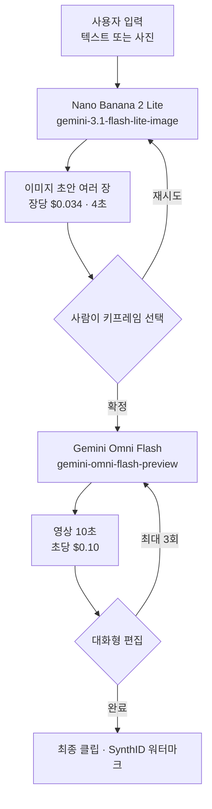

## 왜 읽어야 하나

생성형 미디어를 제품 기능으로 넣으려는 프로덕트 엔지니어와, 그 기능의 원가표를 만들어야 하는 플랫폼 담당자를 위한 글입니다. 결론을 먼저 말씀드리면, 이 파이프라인에서 이미지 생성은 사실상 공짜에 가깝고 비용은 영상 초 단위에 몰려 있습니다. 10초 클립 한 개가 이미지 초안 29장과 같은 값이라 반복을 아끼는 최적화는 대부분 헛수고이며, 아껴야 하는 것은 완성해서 내보내는 영상의 초 수입니다. 이 글을 읽고 나면 돈이 어느 구간에서 나가는지와 어느 지점부터 자체 서빙을 검토할 근거가 생기는지를 알게 됩니다.

## 개요

구글은 2026년 6월 30일 두 모델을 개발자에게 함께 열었습니다. 하나는 Nano Banana 2 Lite로 모델 ID는 `gemini-3.1-flash-lite-image`이고, 나노 바나나 계열에서 가장 빠르고 저렴한 이미지 모델입니다. 다른 하나는 Gemini Omni Flash로 모델 ID는 `gemini-omni-flash-preview`이며, 영상 생성과 대화형 편집을 담당합니다. 두 모델 모두 Google AI Studio와 Gemini API, 그리고 Gemini Enterprise Agent Platform에서 접근할 수 있습니다.

발표에서 눈여겨볼 대목은 개별 모델 소개가 아니라 마지막 문단입니다. 진짜 쓸모는 두 모델을 이어 붙일 때 나온다고 명시하면서, Nano Banana 2 Lite로 빠르게 이미지를 만들고 그 이미지를 참조로 넘겨 Omni Flash가 영상으로 살려 내는 흐름을 권장합니다. 구글이 함께 공개한 데모 앱 세 개도 전부 같은 모양입니다. 사진을 명소로 옮겨 놓고 클릭하면 그 장면이 움직이는 앱, 방 사진을 여러 인테리어 컨셉으로 바꾼 뒤 마음에 드는 것을 영상으로 만드는 앱, 정지 이미지를 이커머스용 시네마틱 영상으로 바꾸는 앱입니다.

이 패턴이 흥미로운 이유는 두 모델의 가격 구조가 완전히 다르기 때문입니다. 한쪽은 장당 과금이고 다른 쪽은 초당 과금입니다. 그리고 그 차이가 워크플로 설계를 어디에 힘줘야 하는지까지 결정합니다.

생성형 미디어를 다루는 팀이 늘 부딪히는 문제도 여기서 나옵니다. 이 작업은 본질적으로 반복입니다. 한 번에 원하는 그림이 나오는 경우는 드물고, 여러 후보를 놓고 고르는 과정이 결과물의 품질을 만듭니다. 문제는 반복이 어느 단계에서 일어나느냐에 따라 청구서의 모양이 완전히 달라진다는 점입니다. 값싼 단계에서 반복하면 탐색이 되고 비싼 단계에서 반복하면 낭비가 됩니다. 두 모델을 잇는 설계가 권장되는 진짜 이유는 화질 조합이 아니라 반복을 싼 쪽으로 밀어 넣을 수 있기 때문입니다.

## 이 기술은 무엇인가

Nano Banana 2 Lite는 속도와 비용이 우선인 자리에 놓으라고 만든 모델입니다. 구글이 제시한 수치는 텍스트에서 이미지까지 4초, 1K 해상도 이미지 한 장에 0.034달러입니다. 기존 나노 바나나 1세대인 `gemini-2.5-flash-image`를 쓰고 있다면 지금 바로 갈아 끼우라고 권합니다. 계열 안에서 위치를 정리하면 Lite가 속도, `gemini-3.1-flash-image`인 Nano Banana 2가 균형 잡힌 범용, `gemini-3-pro-image`인 Nano Banana Pro가 정확도가 속도보다 중요한 전문 작업을 맡습니다.

Gemini Omni Flash는 영상 쪽입니다. 텍스트와 이미지, 영상을 섞어 입력으로 받고 자연어로 결과를 고칠 수 있습니다. 가격은 출력 영상 1초당 0.10달러로, 구글은 이 값이 Veo 3.1 Fast와 같다고 밝혔습니다. 현재 한 번에 만들 수 있는 길이는 10초이고 더 긴 길이는 준비 중이라고 되어 있습니다.

구글이 이 모델의 강점으로 꼽은 네 가지는 자연어로 고치는 대화형 편집, 이미지와 텍스트와 영상을 함께 참조해 장면의 일관성을 유지하는 멀티모달 참조, 역사나 생물학 같은 실세계 지식을 끌어와 장면을 구성하는 능력, 그리고 텍스트와 그래픽을 영상 속 동작에 맞춰 붙이는 동기화입니다. 앞의 두 가지는 워크플로에 직접 영향을 줍니다. 대화형 편집이 된다는 것은 결과가 마음에 들지 않을 때 처음부터 다시 만들지 않아도 된다는 뜻이고, 멀티모달 참조가 된다는 것은 앞 단계에서 고른 이미지를 그대로 기준으로 삼을 수 있다는 뜻입니다. 체이닝이 성립하는 근거가 바로 이 두 번째 항목입니다.

체이닝을 실제로 굴러가게 만드는 부품은 Interactions API입니다. 세션 히스토리와 문맥을 유지해 주기 때문에 사용자가 연속으로 고쳐 나갈 수 있는데, 쌓을 수 있는 편집은 최대 세 번입니다. 이 세 번이라는 숫자는 제약처럼 보이지만 워크플로 설계에는 오히려 도움이 됩니다. 무한정 고칠 수 있는 인터페이스는 사용자가 언제 멈춰야 할지 모르게 만들고, 초당 과금에서 멈추지 못하는 인터페이스는 그대로 비용이 됩니다.

## 파이프라인 단가 산술

밝혀 둘 것이 있습니다. 이 글은 두 모델을 직접 호출해 보지 않았습니다. 지연이나 화질에 대한 주장은 하나도 하지 않으며, 구글이 발표에서 공개한 두 개의 가격만 가져와 나눗셈과 곱셈을 했습니다. 계산 스크립트와 결과 JSON은 저장소에 남겨 두었습니다.

가장 먼저 보이는 것은 두 단가의 비율입니다. 영상 1초가 0.10달러이고 이미지 한 장이 0.034달러이므로, 10초 클립 한 개는 이미지 초안 29.4장과 같은 값입니다. 이 한 문장이 이 파이프라인의 최적화 우선순위를 거의 다 정합니다.

초안 장수를 바꿔 가며 완성 클립 한 개의 원가를 보면 이렇습니다. 초안 한 장만 뽑고 바로 영상으로 넘기면 1.034달러이고 이 중 이미지가 차지하는 비중은 3.3퍼센트입니다. 다섯 장을 뽑아 고르면 1.17달러에 이미지 비중 14.5퍼센트가 됩니다. 스무 장이면 1.68달러에 40.5퍼센트, 쉰 장까지 태우면 2.70달러에 63.0퍼센트로 그제서야 이미지가 영상을 넘어섭니다.

여기서 실무적인 결론이 하나 나옵니다. 이미지 초안을 아끼는 최적화는 대부분 의미가 없습니다. 초안을 다섯 장에서 한 장으로 줄여 봐야 클립당 13.6센트를 아끼는데, 그 대가로 마음에 드는 키프레임을 못 골라 영상을 한 번 더 만들면 1달러를 더 씁니다. 오히려 반대로 설계하는 편이 낫습니다. 이미지 단계에서는 넉넉히 뽑아 사람이 확실하게 고르게 하고, 영상 호출은 확정된 키프레임에서만 한 번 나가게 막는 것입니다. 4초라는 이미지 생성 시간은 이 넉넉함을 사용자 경험 안에서 감당할 수 있게 해 줍니다.

규모로 옮기면 숫자가 더 분명해집니다. 클립 1000개를 만들 때 초안 한 장 기준으로 1034달러, 다섯 장 기준으로 1170달러, 쉰 장까지 태우면 2700달러입니다. 초안 정책을 다섯 장에서 쉰 장으로 열 배 늘려도 총액은 두 배 남짓 늘어납니다. 반면 클립 길이를 10초에서 20초로 늘리면 영상 비용만 정확히 두 배가 됩니다.

여기서 반드시 확인하고 넘어가셔야 할 항목이 하나 있습니다. 대화형 편집 세 번이 어떻게 과금되는지입니다. 구글 발표문은 편집을 세 번까지 쌓을 수 있다고만 밝히고 그 편집이 새 출력으로 과금되는지는 말하지 않습니다. 만약 편집마다 10초짜리 결과가 새로 나오고 그것이 출력으로 계산된다면, 사용자가 세 번을 다 쓴 클립 하나는 영상 비용만 4달러가 되어 처음 계산의 네 배가 됩니다. 클립당 1달러로 세운 원가표와 4달러로 세운 원가표는 완전히 다른 사업이므로, 실제 요금 명세를 확인하기 전까지는 편집 횟수를 사용자에게 무제한으로 열어 두지 않으시는 편이 안전합니다.

길이를 늘릴 때의 셈도 단순합니다. 영상은 초당 과금이므로 클립을 10초에서 20초로 늘리면 영상 비용이 정확히 두 배인 2달러가 되고, 이미지 초안을 몇 장 뽑았든 그 증가분은 그대로 남습니다. 반대로 말하면 초를 줄이는 것이 이 파이프라인에서 유일하게 확실한 절감입니다. 8초로 충분한 소재를 10초로 만들고 있다면 그 2초가 전체 비용의 5분의 1입니다.

자체 서빙과 비교할 기준선도 같은 나눗셈에서 나옵니다. 시간당 단가가 얼마인 카드를 빌리든, 그 한 시간 값과 같아지는 Omni 출력 길이는 시간당 단가를 0.10으로 나눈 값입니다. 시간당 1달러면 10초, 2달러면 20초, 5달러면 50초, 10달러면 100초, 20달러면 200초입니다. 여기 적은 시간당 단가는 예시일 뿐이고 실제 값은 각자의 계약서에서 가져와야 합니다. 다만 방향은 분명합니다. 한 시간 동안 카드가 200초 넘는 영상을 뽑아낼 수 있다면 자체 서빙이 이기기 시작하고, 그렇지 못하면 호스티드가 더 쌉니다. 그리고 이 비교에는 모델을 올리고 유지하는 사람의 시간이 아직 들어가 있지 않습니다.

## ThakiCloud 제품 적용 시사점

Paxis는 ThakiCloud의 Enterprise Agent Platform으로 스킬을 검색해 격리 샌드박스에서 실행하고 모든 행동을 정책 게이트와 감사 로그로 통과시킵니다. 생성형 미디어를 업무 자동화에 넣을 때 이 구조가 필요한 이유는 품질 때문이 아니라 초당 과금 때문입니다. 문서를 만드는 스킬은 잘못 돌아도 토큰 몇 개가 낭비되지만, 영상 스킬이 루프에 빠지면 분당 6달러가 나갑니다. 에이전트가 부르는 미디어 호출에는 예산 상한과 호출 횟수 상한이 스킬 계약 안에 박혀 있어야 하고, 확정 전 단계에서 사람이 한 번 승인하는 지점이 필요합니다. Omni Flash가 편집을 세 번으로 묶어 둔 것은 같은 문제에 대한 제공자 쪽 답이며, 우리가 워크플로에 넣을 상한도 그보다 느슨해서는 안 됩니다.

상한을 거는 것만으로는 부족하고 실제로 얼마가 나갔는지 되짚을 수 있어야 합니다. 초당 과금에서는 어느 워크플로가 비용을 만들었는지를 사후에 특정하지 못하면 다음 달 청구서를 줄일 방법이 없습니다. Paxis가 남기는 실행 Trace와 비용 측정이 이 자리에 필요하고, 미디어 호출은 특히 클립 하나 단위로 어떤 스킬이 몇 초를 만들었는지까지 붙여 두는 편이 좋습니다.

Metis는 이 계산의 반대편을 맡습니다. 위에서 구한 손익분기는 결국 우리 토큰 팩토리가 같은 작업을 초당 얼마에 해내느냐의 문제로 환원됩니다. 개방형 영상 모델을 Dedicated Endpoint로 붙잡아 둘지, Serverless와 Scale-to-Zero로 흘려보낼지에 따라 실효 초당 단가가 달라지고, 그 값이 0.10달러보다 낮아지는 순간부터 워크로드를 안으로 가져올 이유가 생깁니다. 같은 날 함께 정리한 [Wan-Animate-2 분석](/ko/llmops/wan-animate-2-onprem-avatar-serving/)에서 본 것처럼 개방형 모델 하나가 가중치만 46.29GiB를 쓰기 때문에, 이 비교는 초당 단가와 상주량을 같은 표에 놓고 해야 합니다.

자산의 성격도 갈림길입니다. 사람 얼굴이 들어간 사진이나 미공개 제품 이미지를 외부 API로 보내는 것이 곤란한 조직에서는 단가 비교가 시작되기도 전에 결론이 정해집니다. Aegis 온프레미스 사설 클라우드가 답하는 자리가 여기이고, 실무에서는 두 경로를 섞는 형태가 흔합니다. 공개 가능한 소재는 호스티드로 빠르게 돌리고, 반출이 막힌 소재만 안에서 처리하는 방식입니다. 이때 두 경로가 같은 스킬 인터페이스를 쓰도록 묶어 두는 것이 Paxis가 하는 일입니다.

## 한계 및 반론

가격만으로 결정하지 말아야 할 이유가 발표문 안에 이미 적혀 있습니다. Omni Flash는 공개 프리뷰이고 제약 목록이 짧지 않습니다. 오디오 참조 업로드와 장면 확장은 Gemini API에서 아직 지원되지 않습니다. 3초 이하 영상 참조는 API 스키마가 받아 주기는 하지만 모델이 제대로 처리하지 못한다고 명시되어 있는데, 스키마가 통과시키는 입력이 실제로는 동작하지 않는다는 뜻이라 이런 항목은 통합 과정에서 조용한 버그가 되기 쉽습니다. 장면이 바뀌거나 카메라가 크게 움직일 때 캐릭터 일관성이 떨어지는 문제도 개선 중이라고 되어 있습니다.

이 글의 계산에도 빠진 것이 있습니다. 재시도와 실패한 호출, 안전 필터에 걸려 결과를 받지 못한 요청은 원가표에 넣지 않았습니다. 실제 서비스에서는 이 몫이 작지 않을 수 있고, 특히 초당 과금에서는 실패한 영상 호출 하나가 이미지 초안 서른 장을 날린 것과 같습니다. 지역별 제약과 프리뷰 기간 중의 가격 변동 가능성도 그대로 남아 있습니다.

손익분기 계산 자체도 한쪽으로 기울어 있다는 점을 인정해야 합니다. 시간당 단가를 0.10으로 나눈 값은 카드가 그 한 시간을 쉬지 않고 쓴다는 가정 위에 서 있습니다. 실제 사내 클러스터의 가동률은 그보다 낮고, 모델 로딩과 대기 시간, 운영 인력의 시간은 어느 쪽 계산에도 들어가 있지 않습니다. 자체 서빙이 이기는 지점은 이 글의 숫자가 말하는 것보다 오른쪽에 있다고 보는 편이 안전합니다.

비교 대상이 좁다는 지적도 정당합니다. 이 글은 구글이 같은 발표에서 함께 연 두 모델만 놓고 계산했을 뿐, 다른 제공자의 이미지와 영상 모델을 같은 표에 넣지 않았습니다. 초당 0.10달러라는 값이 시장에서 어느 위치인지는 이 글이 답하지 않으며, 구글이 Veo 3.1 Fast와 같은 가격이라고 밝힌 것도 자사 제품 안에서의 비교입니다. 실제 선택 앞에서는 최소한 두세 곳의 초당 단가와 최대 길이, 편집 방식, 워터마크 정책을 같은 축에 놓고 재 보셔야 합니다.

마지막으로 SynthID 워터마킹은 양쪽으로 읽힙니다. 출처 표시가 기본으로 붙는다는 점은 기업 도입에서 분명한 장점이지만, 워터마크를 제공자가 소유한다는 뜻이기도 합니다. 자체 서빙으로 옮기는 조직은 이 통제를 스스로 만들어야 하고, 그 비용은 초당 단가 비교에 나타나지 않습니다.

## 정리

이 파이프라인의 돈은 초 단위에 있습니다. 이미지 한 장이 0.034달러이고 영상 1초가 0.10달러라서, 10초 클립 한 개가 초안 29장과 맞먹습니다. 초안을 쉰 장까지 태워도 클립당 2.70달러이고, 다섯 장으로 아끼면 1.17달러입니다. 아껴서 얻는 것보다 잘못 골라 영상을 다시 만들 때 잃는 것이 큽니다.

그래서 워크플로는 이렇게 잡으시면 됩니다. 이미지 단계는 넉넉하게 열어 두고 사람이 확실히 고르게 한 다음, 영상 호출은 확정된 키프레임에서만 한 번 나가도록 막습니다. 에이전트가 이 호출을 부른다면 예산 상한과 횟수 상한을 스킬 계약에 박아 둡니다.

자체 서빙으로 가져올지는 시간당 단가를 0.10으로 나눈 값 하나로 시작할 수 있습니다. 그 시간 동안 카드가 그만큼의 영상을 뽑아내는지 재 보시고, 재 본 숫자에 운영 인력의 시간과 가동률을 얹으시기 바랍니다. 그 표가 나오기 전까지는 호스티드가 기본값이라고 보는 편이 정확합니다.

## 출처

- [Start building with Nano Banana 2 Lite and Gemini Omni Flash (Google 공식 발표)](https://blog.google/innovation-and-ai/models-and-research/gemini-models/gemini-omni-flash-nano-banana-2-lite/)
- [Gemini API 이미지 생성 문서](https://ai.google.dev/gemini-api/docs/image-generation)
- [Gemini 3.1 Flash Image, Google DeepMind](https://deepmind.google/models/gemini-image/flash/)
