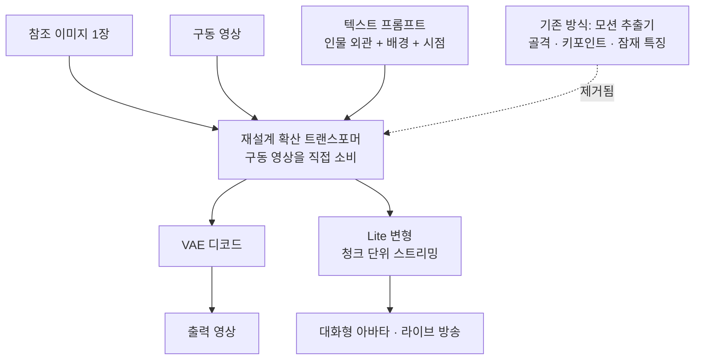

## 왜 읽어야 하나

디지털 휴먼이나 라이브 아바타를 사내 GPU에 올릴지 검토 중인 플랫폼 엔지니어와 미디어 서비스 아키텍트를 위한 글입니다. 결론을 먼저 말씀드리면, Wan-Animate-2의 진짜 성과는 화질이 아니라 파이프라인에서 단계를 하나 지운 것이고 그 덕에 캐릭터 애니메이션이 오프라인 렌더링에서 스트리밍 워크로드로 넘어왔습니다. 다만 가중치만으로 46.29GiB를 먹기 때문에 실시간이라는 말과 카드 한 장이라는 말은 아직 같은 뜻이 아니며, 이 글을 읽고 나면 그 차이를 동시 세션 수로 환산해 판단하실 수 있습니다.

## 개요

알리바바 Wan 팀은 2026년 8월 7일 Wan-Animate-2의 추론 스크립트와 Base 가중치, 그리고 증류 가중치를 같은 날 한꺼번에 공개했습니다. 논문은 하루 앞선 8월 6일 arXiv에 올라왔습니다. 라이선스는 Apache 2.0이라 상용 배포에 걸리는 조항이 없고, 이 점은 최근 영상 모델들이 자체 라이선스에 지역 제한이나 용도 제한을 붙이는 흐름과 비교하면 드문 선택입니다.

캐릭터 애니메이션은 참조 이미지 한 장과 구동 영상 한 편을 받아, 이미지 속 인물이 영상 속 동작을 그대로 하도록 만드는 작업입니다. 광고 소재 제작, 가상 쇼호스트, 사내 교육 영상, 고객 응대 아바타가 모두 이 한 가지 기능 위에 서 있습니다. 문제는 지금까지 이 작업이 전부 오프라인이었다는 점입니다. 요청을 받고 몇 분에서 몇십 분을 기다려 결과를 받는 구조로는 대화하는 아바타를 만들 수 없습니다.

같은 팀의 직전 세대와 비교하면 방향이 분명해집니다. 2025년 9월에 공개된 Wan2.2-Animate는 Animate Anyone 계열 위에서 동작을 옮기는 모드와 인물을 바꿔 끼우는 모드를 갖춘 모델이었고, 초점이 무엇을 할 수 있는가에 있었습니다. 1년이 채 지나지 않아 나온 이번 세대는 할 수 있는 일의 목록을 늘리는 대신 그 일을 언제 끝낼 수 있는가를 바꿨습니다. 논문 제목이 응용의 경계를 넓힌다고 말하는 이유도 여기 있습니다. 성능 경쟁이 화질에서 배포 형태로 옮겨 간 신호로 읽는 편이 정확합니다.

## 이 기술은 무엇인가

논문은 기존 접근을 세 갈래로 정리하고 각각이 어디서 무너지는지 지적합니다. 첫째는 골격이나 키포인트 같은 명시적 모션 표현을 뽑아 쓰는 방식인데, 추출 단계에서 생긴 오차가 그대로 결과로 흘러들고 인물의 정체성이 프레임을 지나며 조금씩 어긋납니다. 둘째는 모션을 압축된 잠재 특징으로 다루는 방식으로, 압축 과정에서 손끝이나 표정 같은 미세한 움직임이 사라집니다. 셋째는 중간 표현 없이 문맥 학습으로 푸는 방식인데 계산 비용이 감당하기 어려운 수준으로 올라갑니다.

세 갈래 모두가 같은 자리에서 걸린다는 점을 짚어 둘 만합니다. 문제는 표현 방식의 우열이 아니라 중간 단계의 존재 자체입니다. 골격을 뽑는 순간 원본 영상이 가진 정보 중 골격으로 표현되지 않는 것은 버려집니다. 버려진 정보에는 옷이 흔들리는 방식이나 시선이 미세하게 흔들리는 습관처럼 그 인물을 그 인물로 만드는 신호가 섞여 있고, 생성 단계는 없는 정보를 복원할 수 없으니 그럴듯한 값으로 채웁니다. 프레임마다 조금씩 다르게 채워진 값이 쌓이면 몇 초 뒤 인물이 서서히 다른 사람이 됩니다. 정체성 표류라고 부르는 현상은 대개 이렇게 생깁니다.


Wan-Animate-2가 택한 길은 중간 표현을 개선하는 대신 아예 없애는 것입니다. 재설계한 확산 트랜스포머가 구동 영상을 직접 입력으로 받습니다. 모션 추출기라는 부품이 사라지면 그 부품이 만들던 오차도 함께 사라진다는 발상이고, 논문은 이 구조로 동작 충실도와 정체성 보존을 동시에 끌어올렸다고 설명합니다. 대신 부담은 모델 안으로 옮겨 옵니다. 압축된 골격 몇 개가 아니라 영상 프레임 전체를 트랜스포머가 받아야 하므로, 뒤에서 볼 상주량과 카드 요구 조건은 이 선택의 청구서에 해당합니다.

여기에 텍스트 기반 시점 제어가 붙습니다. 기존 방식은 명시적 모션 표현에 카메라 정보가 얽혀 있어서 출력 시점이 구동 영상의 시점에 묶였습니다. Wan-Animate-2는 이 둘을 분리했기 때문에, 정면에서 찍은 구동 영상으로 측면 시점의 결과를 만들 수 있습니다. 구동 영상을 다시 촬영하지 않고도 카메라 워크를 바꿀 수 있다는 뜻이라, 제작 현장에서는 이쪽이 더 크게 체감될 수 있습니다.

실시간을 담당하는 것은 Wan-Animate-2-Lite입니다. 세 단계 학습으로 지연을 실시간 임계까지 내렸는데, 오차 버퍼를 둔 teacher forcing 사전학습과 청크 단위 역전파를 쓰는 Self-Forcing 증류가 핵심입니다. 청크 단위로 끊어 학습하기 때문에 추론에서도 청크 단위로 흘려보낼 수 있고, 이것이 스트리밍 캐릭터 애니메이션을 가능하게 합니다.




## 설치 및 통합

저장소는 서브모듈을 포함하므로 재귀 클론이 필요하고, 환경은 파이썬 3.11에 CUDA 12.6 빌드의 파이토치 2.7.0을 맞춥니다. 어텐션은 flash-attn을 빌드 격리 없이 설치합니다.

```bash
git clone --recursive https://github.com/Wan-Video/Wan-Animate-2.git
conda create -n wan_animate_2 python==3.11 -y
pip install torch==2.7.0 torchvision==0.22.0 torchaudio==2.7.0 \
  --index-url https://download.pytorch.org/whl/cu126
pip install -r requirements.txt
pip install flash-attn --no-build-isolation
pip install -e .
```

가중치는 허깅페이스나 모델스코프에서 통째로 받습니다.

```bash
pip install "huggingface_hub[cli]"
huggingface-cli download Wan-AI/Wan2.2-Animate-2-14B --local-dir ./ckpts/
```

추론에서 한 가지 걸리는 관례가 있습니다. 프롬프트를 사람이 쓰는 대신 별도 LLM으로 참조 이미지를 캡션해서 넣으라고 안내합니다. 캡션 규격도 못박혀 있는데, 인물 외관과 배경만 서술하고 동작이나 감정 추측은 넣지 말라는 것입니다. 동작은 구동 영상이 이미 가지고 있으니 프롬프트가 그 역할을 중복해서 맡으면 충돌한다는 뜻으로 읽힙니다. 저장소 예시는 중국어 캡션을 사용합니다.

증류 모델은 스텝 수와 가이던스 설정이 다릅니다. Base가 기본 설정을 따르는 반면 증류본은 10스텝에 classifier-free guidance를 끄고 돌립니다.

```bash
export PYTHONPATH="$(pwd)"
cd infer
python wan_animate_2_demo.py \
  --prompt "<이미지 캡션>" \
  --refer-img-file ../examples/demo1/reference.png \
  --refer-video-file ../examples/demo1/template.mp4 \
  --config ./wan_animate_2_distillation.yaml \
  --sample_guide_scale 1.0 \
  --step 10
```

한 가지 더 확인하실 것은 병렬 설정입니다. 저장소의 기본 YAML은 A800 8장을 전제로 잡혀 있어서 카드 수나 종류가 다르면 그대로 돌지 않습니다. 문서도 하드웨어가 다르면 YAML의 병렬 설정을 맞추라고 명시합니다. 사내 클러스터에 올릴 때 처음 부딪히는 벽이 모델이 아니라 이 설정 파일인 경우가 많으니, 도입 검토의 첫 항목으로 두시는 편이 좋습니다. 가중치를 받기 전에 결과부터 보고 싶다면 ModelScope에 올라온 스튜디오 데모에서 같은 모델을 만져 볼 수 있습니다.

기존 파이프라인에 얹을 생각이라면 저장소를 직접 쓰지 않아도 됩니다. diffusers가 `WanAnimate2Pipeline`으로 흡수했고, DiffSynth-Studio와 ComfyUI 통합도 공개 시점에 함께 체크되었습니다. diffusers 경로에서는 증류본을 쓸 때 스텝 10, 가이던스 1.0, euler 솔버를 지정합니다.

```python
from diffusers import WanAnimate2Pipeline

pipe = WanAnimate2Pipeline.from_pretrained(
    "Wan-AI/Wan2.2-Animate-2-14B-Distilled-Diffusers",
    torch_dtype=torch.bfloat16,
).to("cuda")
output = pipe(
    image=load_image("reference.png"),
    driving_video="template.mp4",
    prompt="<이미지 캡션>",
    num_inference_steps=10,
    guidance_scale=1.0,
    flow_solver="euler",
)
```

## 실제 실험 결과

먼저 정직하게 밝히겠습니다. 이 모델을 직접 돌려 보지는 못했습니다. 저장소가 밝힌 기본 설정은 720P 생성 기준 A800 8장이고 480P도 A800 2장에서 검증했다고 되어 있어서, 맥북에서 재현할 수 있는 규모가 아닙니다. 그래서 대신 확실하게 잴 수 있는 것을 쟀습니다. 허깅페이스 API가 보고하는 실제 파일 크기를 받아 체크포인트를 부품별로 분해하고, 그것을 카드 용량으로 나눴습니다. 아래 숫자는 전부 그 계산에서 나온 값이며 속도나 화질에 대한 주장은 하나도 들어 있지 않습니다.


DiT 본체가 30.54GiB입니다. 여기에 umT5-XXL 텍스트 인코더 10.58GiB, CLIP 비전 인코더 4.44GiB, VAE 0.73GiB가 따라붙어 한 번 돌리는 데 필요한 가중치 합계는 46.29GiB가 됩니다. 인코더 세 개가 15.76GiB로 전체의 3분의 1을 차지한다는 점이 눈에 띕니다. 여러 인스턴스를 띄울 계획이라면 인코더를 공유하는 구조가 곧바로 이득이 되는 크기입니다.

디스크 기준으로는 더 큽니다. Base와 증류본이 각각 30.54GiB로 같은 크기이고 둘 다 받으면 인코더까지 76.83GiB를 쓰기 때문에, 노드 이미지에 가중치를 굽는 방식이라면 이 숫자를 먼저 확인하셔야 합니다.

카드에 앉히면 이렇게 됩니다. H200 NVL 한 장에서는 가중치가 32.8%를 쓰고 94.7GiB가 남습니다. H100이나 A800 80GB에서는 57.9%를 쓰고 33.7GiB가 남습니다. L40S 48GB에서는 96.4%가 차서 1.7GiB만 남는데, 이 여유로는 활성값과 프레임 버퍼를 감당할 수 없으므로 사실상 들어가지 않는다고 보는 편이 맞습니다. 저장소가 480P에도 A800 두 장을 쓴 이유가 이 숫자에서 설명됩니다. 가중치가 절반을 먹고 나면 영상 생성이 실제로 쓰는 메모리를 남은 절반에 넣어야 하기 때문입니다.

인코더가 차지하는 3분의 1은 동시 세션을 생각하면 곧바로 설계 변수가 됩니다. 텍스트 인코더와 비전 인코더, VAE는 읽기만 하는 부품이라 세션마다 따로 들고 있을 이유가 없습니다. 세션 두 개를 순진하게 띄우면 92.59GiB가 들지만 인코더를 공유하면 76.83GiB로 15.76GiB를 아낍니다. 네 개면 185.18GiB가 137.91GiB로 줄어 47.27GiB를 아끼고, 이 값은 H200 한 장의 141GiB 안에 겨우 들어옵니다. 다만 겨우 들어온다는 말은 가중치만 그렇다는 뜻이고 생성이 쓸 자리는 남지 않으므로, 카드 한 장에서 현실적으로 노려 볼 만한 동시 세션은 두 개 남짓입니다. 여덟 개까지 가면 공유를 해도 260.06GiB라 카드 한 장의 문제가 아니게 됩니다.

여기서 실시간이라는 표현을 다시 읽어야 합니다. Lite가 낮춘 것은 지연이지 상주량이 아닙니다. 스트리밍이 가능해졌다는 말은 동시 세션 하나당 이만한 카드를 붙여야 한다는 뜻이기도 해서, 아바타 서비스의 원가는 화질이 아니라 동시 접속 수에서 결정됩니다.

## ThakiCloud 제품 적용 시사점

이 모델이 흥미로운 이유는 영상 기술이어서가 아니라, 업무 자동화가 다루는 산출물의 종류를 하나 늘리기 때문입니다. Paxis는 ThakiCloud의 Enterprise Agent Platform으로 스킬을 검색해 격리 샌드박스에서 실행하고 모든 행동을 정책 게이트와 감사 로그로 통과시킵니다. 지금까지 에이전트가 만들어 내던 결과물은 문서와 표와 코드였습니다. 캐릭터 애니메이션이 스트리밍 가능한 워크로드가 되면 여기에 사람 얼굴이 붙은 영상이 들어옵니다. 사내 공지를 아바타가 읽는 영상으로 바꾸거나, 상담 이력을 받아 응대 클립을 만드는 워크플로는 오프라인 렌더링 시절에는 배치 작업이었지만 이제는 대화 안에서 돌 수 있습니다.

워크플로 모양도 달라집니다. 오프라인 렌더링에서는 사람이 결과를 받아 보고 다시 요청하는 반복이 자연스러웠지만, 스트리밍에서는 생성이 시작된 뒤에 되돌릴 수 없습니다. 그래서 승인 지점이 결과물 뒤가 아니라 입력 앞으로 옮겨 옵니다. 어떤 얼굴을 쓸 수 있는지, 그 자산에 동의가 붙어 있는지, 어떤 문구까지 말하게 할 수 있는지를 렌더 전에 정책 게이트가 판정해야 합니다. Paxis가 스킬 실행 앞뒤로 두는 휴먼 승인과 감사 로그가 이 자리에 그대로 들어맞습니다.


실행 경제성은 Metis가 답합니다. 46.29GiB짜리 상주량을 가진 모델은 상시 켜 두기에는 비싸고, 요청이 올 때만 깨우기에는 로딩이 깁니다. Dedicated Endpoint로 붙잡아 둘지 Serverless와 Scale-to-Zero로 흘릴지가 그대로 원가가 되는 구간이고, 인코더 15.76GiB를 여러 세션이 공유하도록 배치하는 것도 같은 층에서 결정됩니다. 실행 인프라는 필요에 따라 Telox GPU 클러스터로 버스트하거나 Velox 베어메탈에서 가상화 오버헤드를 걷어내고 돌립니다.

다만 이 워크로드에서 가장 크게 갈리는 지점은 성능이 아니라 데이터입니다. 참조 이미지는 대개 실존 인물의 얼굴이고 구동 영상에는 목소리와 동작이 함께 담깁니다. 초상권과 개인정보가 얽힌 자산을 외부 API로 내보내는 것이 곤란한 조직이 많고, 금융과 공공, 국방, 제조에서는 사실상 불가능합니다. Aegis는 이 요구를 정면으로 받는 온프레미스 사설 클라우드이고, Apache 2.0 가중치는 폐쇄망 안에서 같은 모델을 돌릴 수 있게 해 주는 전제 조건입니다. 라이선스가 깨끗한 개방형 가중치가 온프레미스 제안에서 갖는 무게는 벤치마크 점수보다 큽니다.

## 한계 및 반론

가장 먼저 짚어야 할 것은 이 글이 인용한 성능 주장의 성격입니다. 논문은 정성 평가와 사용자 연구로 결과를 뒷받침한다고 밝히고 있고, 널리 쓰이는 캐릭터 애니메이션 벤치마크의 정량 수치를 표로 제시하지는 않습니다. 동작 충실도와 정체성 보존이 개선되었다는 서술은 저자들의 평가 방식 안에서 읽어야 하며, 다른 모델과 나란히 놓고 비교하려면 각자의 자산으로 직접 재 보는 수밖에 없습니다.

실시간이라는 표현도 조건부입니다. 논문은 Lite가 지연을 실시간 임계까지 낮췄다고 말하지만 이 글은 그 지연을 재지 못했고, 어떤 해상도와 어떤 하드웨어에서의 실시간인지는 저장소 문서만으로 확정하기 어렵습니다. 위에서 본 상주량을 감안하면 그 임계는 A800 여러 장을 전제로 한 수치일 가능성이 큽니다.

운영 쪽 마찰도 있습니다. 프롬프트를 별도 LLM으로 캡션해서 넣으라는 안내는 파이프라인에 모델을 하나 더 얹으라는 뜻이고, 저장소 예시가 중국어 캡션이라 다른 언어에서 같은 품질이 나오는지는 확인이 필요합니다. 캡션 규격에서 동작 서술을 금지한 것도 자동화 관점에서는 검증 단계를 하나 요구합니다.

마지막으로 생성 자체의 위험이 있습니다. 실존 인물의 얼굴에 임의의 동작을 입히는 기능은 그대로 사칭 도구가 됩니다. 개방형 가중치는 워터마크 같은 통제를 모델 바깥에 두기 때문에, 이런 모델을 서비스에 넣는 조직은 동의 관리와 출처 표시, 감사 추적을 플랫폼 층에서 직접 책임져야 합니다. Signum이 감당하는 신원과 감사 이벤트가 선택 사항이 아니라 전제 조건이 되는 영역입니다.

## 정리

Wan-Animate-2는 캐릭터 애니메이션에서 중간 모션 추출기를 걷어냈고, 그 구조 변경이 화질 개선보다 배포 형태의 변화를 먼저 가져왔습니다. 오프라인 배치였던 작업이 스트리밍 워크로드가 되면서 대화형 아바타와 라이브 진행이라는 새 쓰임이 열렸습니다.

동시에 이 글에서 실제로 잰 숫자는 그 가능성에 가격표를 붙입니다. 가중치만 46.29GiB이고 H200 한 장의 32.8%, 80GB 카드의 57.9%를 이미 차지합니다. 48GB 카드에는 들어가지 않습니다. 실시간이라는 단어를 서비스 설계에 옮길 때는 지연이 아니라 동시 세션당 카드 수로 환산해서 읽으셔야 합니다.

지금 하실 일은 두 가지입니다. 아바타나 영상 응대를 검토 중이라면 Apache 2.0 가중치를 먼저 받아 자신의 참조 이미지와 구동 영상으로 480P부터 재 보시고, 그 결과를 동시 세션 수로 곱해 원가표를 만들어 보시기 바랍니다. 그 표가 외부 API를 쓸지 온프레미스로 가져올지를 취향이 아니라 산술로 결정해 줍니다.

## 출처

- [Wan-Animate-2 GitHub 저장소](https://github.com/Wan-Video/Wan-Animate-2)
- [Wan-AI/Wan2.2-Animate-2-14B 모델 카드](https://huggingface.co/Wan-AI/Wan2.2-Animate-2-14B)
- [Wan-Animate-2: Pushing the Application Boundaries of Character Animation (arXiv:2608.06009)](https://arxiv.org/abs/2608.06009)
- [프로젝트 페이지](https://humanaigc.github.io/wan-animate-2)
