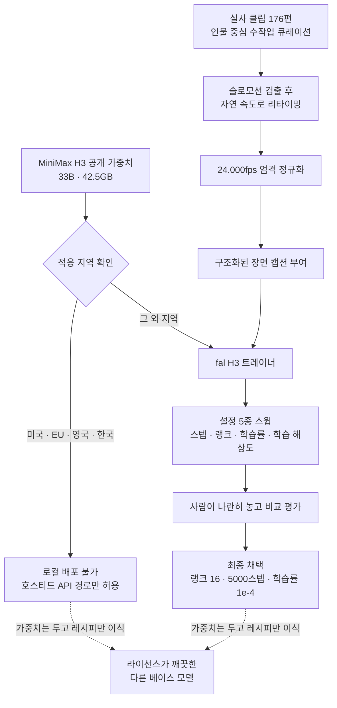

*받을 수 있는 것과 배울 수 있는 것이 갈라지는 지점이 생겼습니다.*

## 왜 읽어야 하나

영상 생성 모델을 자사 도메인에 맞게 미세조정할지 검토하고 있는 국내 ML 엔지니어와 기술 리드를 위한 글입니다. 결론부터 말씀드리면, 이번 주 공개된 H3 LoRA에서 국내 팀이 실제로 가져갈 수 있는 자산은 가중치가 아니라 학습 레시피이고, 그 레시피는 베이스 모델을 바꿔도 그대로 성립합니다.

미세조정 논의는 보통 어떤 베이스를 고를지에서 시작합니다. 그런데 이번 사례는 순서를 뒤집어 볼 근거를 줍니다. 공개된 것은 어댑터 가중치와 함께 데이터를 어떻게 모았고 설정을 어떻게 골랐는지에 대한 기록이었고, 후자는 라이선스의 지배를 받지 않습니다. 아래에서는 그 기록을 항목별로 뜯어본 뒤, 적용 지역 밖에 있는 국내 팀이 이 기록을 어떤 순서로 자기 스택에 옮겨 심을 수 있는지 정리합니다.

## 개요

MiniMax는 7월 31일 H3를 출시하고 8월 3일에 베이스 가중치를 공개했습니다. 33B 규모의 트랜스포머이고 허깅페이스와 모델스코프에 올라왔으며, 최소 다운로드 용량은 42.5GB입니다. 텍스트와 이미지, 영상, 오디오를 한 컨텍스트에서 함께 이해하고 스테레오 오디오를 같은 전방 연산에서 생성한다는 점이 이 모델의 구조적 특징입니다. 한 번의 생성에 참조 이미지를 최대 9장, 참조 영상 클립을 3개, 참조 오디오를 3개까지 넣을 수 있습니다.

주목할 부분은 그다음에 벌어진 일입니다. 가중치가 공개된 뒤 일주일도 지나지 않아 어댑터 학습 스택이 갖춰졌습니다. fal이 H3 전용 트레이너를 내놓았고, ostris의 AI-Toolkit으로도 H3 LoRA를 학습할 수 있게 되면서 pinokio를 통한 원클릭 실행 경로까지 붙었습니다. 24GB 카드 한 장으로 H3 LoRA를 학습하는 안내도 나왔습니다. 베이스 모델 공개와 어댑터 생태계 형성 사이의 간격이 이 정도로 짧았던 사례는 영상 모델 쪽에서 흔하지 않았습니다.

*가중치 공개와 학습 스택 형성 사이의 간격이 며칠에 불과했습니다.*

그 흐름의 결과물 가운데 하나가 `fal/MiniMax-H3-Realism-People-LoRA`입니다. 인물 중심 실사 표현에 특화된 어댑터인데, 이 모델 카드가 특이한 것은 결과물만 올려놓지 않고 어떻게 만들었는지를 상당히 구체적으로 적어 두었다는 점입니다.

## 무엇이 공개됐는가

이 어댑터가 노리는 지점은 명확합니다. 클로즈업에서 무너지지 않는 얼굴, 뭉개지지 않고 질감을 유지하는 피부, 어색하지 않은 표정과 손동작입니다. 여기에 영화 세트장 조명처럼 동작하는 빛과 다큐멘터리 촬영 특유의 손각대 느낌이 얹힙니다. H3가 원래 가지고 있던 동기화 오디오 생성 능력은 어댑터를 얹어도 유지됩니다.

이름에서 짐작할 수 있듯이 이 어댑터는 처음 나온 것이 아닙니다. 앞서 나온 `MiniMax-H3-Realism-LoRA`의 후속이고, 인물에 초점을 맞춰 더 큰 데이터셋으로 다시 학습한 결과입니다. 같은 팀이 같은 베이스 위에서 한 번 더 돌면서 무엇을 바꿨는지가 기록으로 남았다는 뜻이기도 합니다.

## 학습 레시피를 뜯어봅니다

공개된 내용에서 가장 값이 나가는 부분은 최종 설정값이 아니라 데이터를 다룬 방식입니다.

학습에 쓰인 것은 실사 클립 176편입니다. 수만 편을 긁어모은 것이 아니라 손으로 고른 176편이고, 대상은 인물입니다. 인물 사진과 얼굴, 일하는 사람, 운동선수, 일상 속 인물들이 들어갔습니다. 영상 미세조정에서 데이터 규모가 곧 품질이라는 통념이 있는데, 이 사례는 반대 방향의 근거를 제시합니다. 목표 표현이 좁게 정의되어 있으면 176편으로도 원하는 것이 나온다는 이야기입니다.

전처리 두 가지가 특히 눈에 띕니다. 첫째는 슬로모션 처리입니다. 데이터셋에 섞여 들어온 슬로모션 영상을 검출해서 자연스러운 속도로 되돌렸습니다. 이 단계를 건너뛰면 모델은 느린 움직임을 인물 영상의 기본값으로 학습해 버립니다. 둘째는 프레임레이트 정규화인데, 단순히 24fps가 아니라 정확히 24.000fps로 맞췄다고 적혀 있습니다. 소수점까지 명시한 것은 23.976과 24를 섞어 넣었을 때 생기는 시간축 왜곡을 알고 있었다는 뜻으로 읽힙니다. 여기에 각 클립에 구조화된 장면 캡션을 붙였습니다.

*세 단계 모두 모델이 아니라 데이터 쪽에서 이뤄지는 작업입니다.*

설정 선택 과정도 기록돼 있습니다. 스텝 수와 랭크, 학습률, 학습 해상도를 바꿔 가며 다섯 가지 구성을 학습했고, 그 결과를 사람이 나란히 놓고 비교해서 최종안을 골랐습니다. 채택된 설정은 랭크 16에 5000스텝, 학습률 1e-4입니다.

*지표를 만드는 대신 후보를 좁혀 사람이 고르는 쪽을 택했습니다.*

이 숫자 자체보다 중요한 것은 선택 방식입니다. 자동화된 지표가 아니라 사람의 비교 평가가 최종 판정자였습니다. 인물 실사에서 무엇이 좋은 결과인지를 수치로 정의하기 어렵다는 현실을 인정한 설계이고, 다섯 개라는 스윕 폭도 현실적입니다. 미세조정 프로젝트가 흔히 빠지는 함정이 지표를 먼저 만들려다 시간을 다 쓰는 것인데, 여기서는 소수의 후보를 만들고 사람이 고르는 쪽을 택했습니다.

## 그런데 국내에서는 이 가중치를 돌릴 수 없습니다

여기까지가 좋은 소식이고, 이제 국내 팀에게 해당하는 조건을 짚어야 합니다.

MiniMax H3 커뮤니티 라이선스는 8월 2일자로 효력이 발생했고, 적용 지역 정의에서 미국과 유럽연합, 영국, 그리고 한국을 제외합니다. 제외의 범위가 좁지 않습니다. 해당 지역에서는 로컬로 구동한 H3 가중치를 사용하거나 실행하거나 수정하거나 배포하는 것은 물론이고 그 산출물을 배포하는 것까지 허락되지 않습니다. 반면 호스티드 API는 전 세계에서 그대로 쓸 수 있습니다. 즉 제한의 대상은 모델 접근 자체가 아니라 로컬 공개 가중치 경로입니다.

*막힌 것은 모델 접근이 아니라 로컬 구동 경로입니다.*

MiniMax 측이 밝힌 배경은 지역마다 다릅니다. 미국에 대한 제한은 할리우드 스튜디오들과 진행 중인 저작권 소송에서 비롯됐다고 개발자 관계 책임자가 확인했습니다. 유럽연합과 영국, 한국에 대해서는 합성 영상과 인물 유사성 생성, 저작권, 콘텐츠 안전, 책임 있는 배포를 둘러싼 규제 환경 변화를 이유로 들었습니다. 미국 개발자의 경우 개별 승인을 신청할 수 있는 경로가 열려 있고, 미국 법 요건을 충족하는 콘텐츠 규정 준수 장치를 갖추겠다고 약속하면 라이선스를 발급하겠다는 입장입니다. 한국에 대해서는 그런 개별 신청 경로가 같은 방식으로 안내되지 않았습니다.

지난주 저희가 오픈 영상 모델 라이선스 원문을 여섯 개 열어 대조했을 때 확인한 것처럼, 적용 지역에서 한국을 빼는 관행은 이번에 처음 생긴 것이 아닙니다. 자세한 내용은 [오픈 영상 모델 라이선스 지역 제한 실사](/ko/llmops/open-video-model-license-territory-audit/)에 정리해 두었습니다. 이번 H3 사례가 그 흐름에 하나 더 얹힌 것에 가깝습니다.

이 조건이 위 레시피와 만나면 결론이 갈립니다. 어댑터 가중치는 베이스 위에서만 의미가 있고, 그 베이스를 국내에서 로컬로 돌릴 수 없다면 어댑터도 같은 자리에 묶입니다. 하지만 176편이라는 규모 감각, 슬로모션 리타이밍과 24.000fps 정규화라는 전처리 순서, 다섯 개 후보를 사람이 비교해서 고른다는 절차, 랭크 16이라는 출발점은 어느 것도 특정 가중치에 종속되지 않습니다.

*왼쪽은 두고 가야 하지만 오른쪽은 그대로 가져올 수 있습니다.*

## 실제로 확인한 것과 확인하지 못한 것

이 글에서 가중치를 내려받아 재현하지 않았다는 점을 분명히 밝힙니다. 저희는 한국에서 운영하는 회사이고, 적용 지역 밖에서 로컬로 H3를 구동하는 것은 라이선스가 허락하지 않는 행위입니다. 재현할 수 없어서 하지 않은 것이 아니라 하지 않는 것이 맞아서 하지 않았습니다.

그래서 이 글에 나오는 수치는 전부 공개 문서에서 확인한 값이고, 저희가 측정한 값은 없습니다. 176편이라는 데이터셋 규모, 랭크 16과 5000스텝, 학습률 1e-4, 33B와 42.5GB, 8월 2일이라는 라이선스 효력 시점이 여기에 해당합니다. 이 어댑터의 결과 품질이 실제로 얼마나 좋은지, 24GB 카드 한 장에서 학습이 얼마나 걸리는지는 저희가 재 보지 않았으므로 이 글에서 주장하지 않습니다.

한 가지 더 열어 둘 것은 이 레시피가 다른 베이스로 옮겨졌을 때 그대로 통하는지 여부입니다. 176편이라는 숫자는 H3의 사전학습 분포를 전제로 나온 값일 가능성이 큽니다. 베이스가 바뀌면 필요한 데이터 규모도 바뀔 수 있고, 이것은 옮겨 심어 본 뒤에야 알 수 있습니다.

## ThakiCloud 제품 적용 시사점

이 사례는 Paxis 관점에서 읽을 때 가장 크게 보입니다. Paxis는 스킬을 검색해 격리된 샌드박스에서 실행하고 모든 행동을 정책 게이트와 감사 로그에 통과시키는 엔터프라이즈 에이전트 플랫폼입니다. 영상 자산 생성이 업무 워크플로 안으로 들어오는 순간, 어떤 모델을 어느 지역에서 어떤 라이선스로 돌리고 있는지가 실행 정책의 문제가 됩니다. 모델 선택이 개발자 취향의 영역에 머무를 때는 라이선스 조항이 문서로 남지만, 그 모델이 자동화된 워크플로 안에서 매일 수백 번 호출되기 시작하면 조항 위반도 같은 빈도로 반복됩니다. 적용 지역과 산출물 조항을 정책 게이트에서 코드로 강제하고 그 판정을 감사 로그에 남기는 일이 Signum이 감당하는 영역이며, 이런 라이선스가 늘어날수록 선택 사항이 아니라 전제 조건에 가까워집니다.

학습 쪽에서는 Maxis가 이 레시피를 그대로 받습니다. 176편 큐레이션과 프레임레이트 정규화, 구조화 캡션, 소수 후보 스윕과 사람의 비교 평가로 이어지는 절차는 베이스 모델과 무관하게 성립하는 파이프라인 형태입니다. Maxis는 실행 결과를 학습 데이터로 되먹여 고객 특화 모델을 만드는 층이고, 이때 필요한 것은 남의 어댑터 가중치가 아니라 자기 자산으로 같은 절차를 돌릴 수 있는 능력입니다. 이번 공개에서 가져올 것이 정확히 그 절차입니다.

실행 경제성은 Metis와 Telox가 나눠 답합니다. 랭크 16짜리 어댑터를 여러 개 붙였다 뗐다 하는 워크로드는 베이스 가중치를 상주시키고 어댑터만 교체하는 형태가 되고, 이것은 Dedicated Endpoint로 붙잡을지 Serverless로 흘릴지가 그대로 원가가 되는 구간입니다. 학습 자체는 상시 부하가 아니므로 Telox GPU 클러스터로 버스트해서 처리하는 편이 자연스럽습니다.

그리고 라이선스가 깨끗한 베이스를 확보하는 일 자체가 온프레미스 제안에서 자산이 됩니다. Aegis 위에서 고객 폐쇄망에 영상 생성을 넣으려면 모델이 그 망 안에서 합법적으로 돌아야 하는데, 이번 사례는 그 조건을 만족하지 못하는 베이스가 실제로 존재한다는 것을 보여 줍니다. 지난주 저희가 확인한 것처럼 Apache 2.0으로 풀린 선택지들이 남아 있고, 이번 레시피는 그쪽으로 옮겨 심을 수 있습니다.

*정책과 데이터, 실행 경제성, 배포 환경이 각각 다른 층에서 답합니다.*

## 한계 및 반론

가장 강한 반론부터 적겠습니다. 레시피만 가져가는 것이 실제로는 별 의미가 없다는 주장이 가능합니다. 미세조정의 어려움은 설정값을 모르는 데 있지 않고 데이터를 모으고 정제하는 데 있으며, 176편을 손으로 고르는 노동은 랭크 16이라는 숫자를 안다고 줄어들지 않습니다. 이 지적은 맞습니다. 다만 이번 공개가 알려 준 것이 설정값만은 아닙니다. 176편이면 된다는 규모 감각은 프로젝트를 시작할지 말지를 가르는 정보이고, 수만 편이 필요하다고 가정하던 팀에게는 이쪽이 설정값보다 값이 나갑니다.

두 번째로, 이 어댑터의 품질이 실제로 좋은지에 대한 독립적인 근거가 이 글에는 없습니다. 모델 카드가 서술하는 특성은 만든 쪽의 주장이고, 다섯 개 후보를 비교한 사람도 같은 팀입니다. 인물 실사 품질처럼 주관이 개입하는 영역에서 자체 평가만 있는 상태는 신중하게 읽어야 합니다.

세 번째로, 라이선스 상황은 고정된 것이 아닙니다. 미국에 개별 승인 경로가 열린 것처럼 다른 지역에도 조건이 붙은 경로가 생길 수 있고, 반대로 규제 환경이 더 조여서 제한이 넓어질 수도 있습니다. 이 글의 판단은 8월 2일자로 효력이 발생한 문서를 기준으로 한 것이며, 국내 팀이 실제로 도입을 결정하는 시점에는 원문을 다시 확인하셔야 합니다.

마지막으로 이 모델이 하는 일 자체의 위험이 있습니다. 실존 인물의 얼굴과 표정을 사실적으로 생성하는 능력은 사칭 도구와 구분되지 않습니다. 적용 지역 제한의 근거로 규제 환경이 언급된 것도 이 지점과 무관하지 않을 것입니다. 이런 표현력을 제품에 넣는 조직은 동의 관리와 출처 표시를 모델 바깥에서 직접 책임져야 합니다.

## 정리

H3 어댑터 생태계가 한 주 만에 자리를 잡았고, 그 과정에서 데이터를 어떻게 모으고 설정을 어떻게 고르는지가 함께 공개됐습니다. 인물 실사 어댑터 하나를 만드는 데 손으로 고른 176편과 다섯 번의 스윕, 사람의 비교 평가가 들어갔다는 사실이 이번 공개의 핵심입니다.

국내 팀에게 이 소식은 절반만 도착합니다. 적용 지역에서 한국이 빠져 있어 가중치는 그대로 두고 가야 합니다. 하지만 남는 절반이 작지 않습니다. 규모 감각과 전처리 순서, 후보를 좁혀 사람이 고르는 절차는 라이선스와 무관하게 옮겨 심을 수 있고, 그것이 미세조정 프로젝트에서 실제로 시간을 잡아먹는 부분입니다.

지금 하실 일은 두 가지입니다. 영상 미세조정을 검토 중이시라면 베이스 후보의 라이선스 원문에서 적용 지역과 산출물 조항을 먼저 열어 보시고, 통과한 베이스 위에서 이번 레시피의 순서를 그대로 한 번 돌려 보시기 바랍니다. 176편을 모으는 데 걸린 시간이 곧 이 프로젝트의 실제 난이도이며, 그 숫자를 먼저 아는 편이 설정값을 먼저 아는 것보다 판단에 도움이 됩니다.

## 출처

- [fal/MiniMax-H3-Realism-People-LoRA 모델 카드](https://huggingface.co/fal/MiniMax-H3-Realism-People-LoRA)
- [MiniMaxAI/MiniMax-H3 공개 가중치](https://huggingface.co/MiniMaxAI/MiniMax-H3)
- [MiniMax-AI/MiniMax-H3 공식 저장소](https://github.com/MiniMax-AI/MiniMax-H3)
- [MiniMax H3 개방형 가중치의 적용 지역 제한 보도](https://www.techtimes.com/articles/322904/20260804/minimax-h3-open-weights-exclude-us-eu-uk-korea-local-deployment.htm)
- [MiniMax H3 라이선스 제한 배경](https://www.kucoin.com/news/flash/minimax-restricts-h3-license-in-u-s-eu-uk-and-south-korea-due-to-hollywood-copyright-lawsuit)
- [MiniMax H3 개방형 가중치 개요](https://huggingface.co/blog/ResterChed/minimax-h3-hailuo-3-0)
- [awesome-minimax-H3 커뮤니티 자료 모음](https://github.com/wildminder/awesome-minimax-H3)
