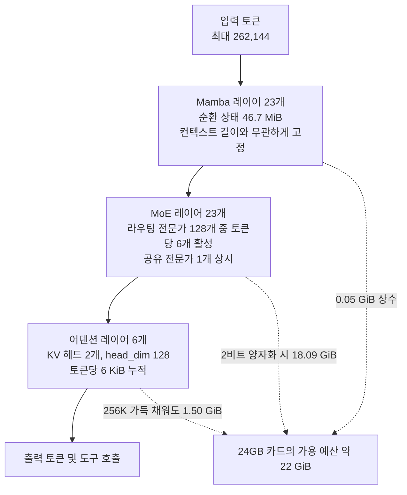

*무엇을 압축했느냐보다, 압축하고 남은 자리에 무엇을 두느냐가 문제였습니다.*

## 왜 읽어야 하나

GPU 한 장짜리 예산으로 장시간 도구 호출 에이전트를 자체 호스팅할지 검토 중인 ML 엔지니어와 인프라 담당자를 위한 글입니다. 결론을 먼저 말씀드리면, Nemotron 3.5 Lightning을 24GB 카드에 올릴 때 발목을 잡는 것은 긴 컨텍스트가 아니라 가중치이고, 그래서 양자화 티어 선택이 곧 이 모델의 배치 가능 여부를 결정합니다.

보통 긴 컨텍스트 에이전트를 논의하면 KV 캐시 걱정부터 나옵니다. 도구를 수십 번 호출하고 웹페이지를 수십 개 읽어들이면 컨텍스트가 금방 불어나니까요. 그런데 이 모델은 그 상식이 뒤집힙니다. 아래에서는 공개된 양자화 파일 17개의 크기를 전부 재고 upstream 설정을 뜯어, 왜 뒤집히는지와 그래서 어느 티어를 골라야 하는지를 숫자로 정리합니다.

## 개요

Unsloth가 8월 12일 2비트로 양자화한 NVIDIA Nemotron 3.5 Lightning이 22GB VRAM만으로 10분 동안 쉬지 않고 도구를 호출했다고 밝혔습니다. 웹사이트를 80곳 넘게 인용하고 코드를 실행했으며 실제 장소 10곳을 검색했다는 내용입니다. 이 보고 자체는 Unsloth가 공개한 데모 결과이고, 저희가 재현한 수치가 아니라는 점을 먼저 밝혀둡니다.

흥미로운 것은 이 주장이 성립하려면 어떤 조건이 필요한가입니다. 30B 규모 모델을 22GB에 밀어넣는 것까지는 공격적인 양자화로 설명이 됩니다. 그런데 10분 동안 도구를 호출하며 80개 출처를 인용하려면 컨텍스트가 상당히 길어야 하고, 긴 컨텍스트는 보통 KV 캐시로 VRAM을 잡아먹습니다. 가중치를 22GB에 겨우 맞춰놓고 나면 캐시를 둘 자리가 없어야 정상입니다.

그래서 실제로 재봤습니다. 로컬에 GPU 런타임이 없어 모델을 직접 구동하지는 못했지만, 대신 공개된 GGUF 파일 크기와 upstream 설정값을 전부 수집해 메모리 예산을 계산했습니다. 결과는 예상과 달랐고, 그 차이가 이 모델의 설계 의도를 그대로 드러냈습니다.

## 이 모델은 무엇인가

Nemotron 3.5 Lightning 30B-A3B는 이름 그대로 총 30B 파라미터 중 3B만 활성화되는 Mixture-of-Experts 모델입니다. 다만 일반적인 MoE 트랜스포머가 아닙니다. 모델 카드는 구조를 "Mixture-of-Experts Hybrid (Mamba + Transformer)"라고 명시하고 있고, upstream `config.json`을 열어보면 이 표현이 정확히 무엇을 뜻하는지 나옵니다.

52개 레이어의 구성은 이렇습니다. Mamba 레이어 23개, MoE 레이어 23개, 그리고 어텐션 레이어는 **6개뿐**입니다. 라우팅 전문가는 128개이고 토큰당 6개가 선택되며, 공유 전문가가 1개 따로 있습니다. 어텐션 쪽은 KV 헤드가 2개, head_dim이 128인 강한 GQA 구성입니다.

이 배치가 메모리 성격을 완전히 바꿉니다. 어텐션 레이어만 토큰 수에 비례하는 KV 캐시를 쌓고, Mamba 레이어는 컨텍스트 길이와 무관하게 크기가 고정된 순환 상태만 들고 있습니다. 52개 레이어가 전부 어텐션인 모델과 비교하면 토큰당 캐시 부담이 근본적으로 다른 등급이 됩니다.


*52개 중 메모리가 토큰 수에 비례해 늘어나는 구간은 오른쪽 끝의 여섯 개뿐입니다.*



사전학습은 20조 토큰 이상으로 진행됐고 NVFP4 레시피가 쓰였습니다. 여러 토큰을 동시에 예측하는 MTP 레이어도 포함되어 있고, DSpark와 DFlash라는 별도 초안 모델이 추측 디코딩용으로 함께 배포됩니다. 모델 카드 기준 컨텍스트는 최대 100만 토큰까지 지원하되 H100 한 장 배포에서는 256K를 쓴다고 안내하고 있으며, `config.json`의 `max_position_embeddings`는 262,144입니다. 아래 계산은 이 262,144를 상한으로 잡았습니다.

## 설치 및 통합

Unsloth의 GGUF 저장소는 8월 13일 기준 GGUF 파일 19개를 담고 있습니다. 필요한 티어만 골라 받는 것이 좋습니다. 전부 받으면 400GB가 넘습니다.

```bash
# 2비트 티어 하나만 선택적으로 내려받기
hf download unsloth/NVIDIA-Nemotron-3.5-Lightning-30B-A3B-GGUF \
  --include "*UD-IQ2_XXS*" \
  --local-dir nemotron-lightning
```

구동은 llama.cpp 계열 서버로 합니다. 도구 호출을 쓰려면 채팅 템플릿을 적용하는 `--jinja` 플래그가 필요합니다.

```bash
llama-server \
  -m nemotron-lightning/NVIDIA-Nemotron-3.5-Lightning-30B-A3B-UD-IQ2_XXS.gguf \
  --ctx-size 262144 \
  --jinja \
  --host 0.0.0.0 --port 8080
```

한 가지 주의할 점이 있습니다. 이 모델의 `model_type`은 `nemotron_h`이고 Mamba 하이브리드 구조를 쓰기 때문에, 해당 아키텍처를 지원하는 최신 빌드가 필요합니다. 오래된 llama.cpp 바이너리에서는 로드 단계에서 실패합니다. 샘플링은 모델 카드 권장값인 temperature 1.0, top_p 0.95를 기준으로 잡으시면 됩니다.

저희가 이번에 실제로 실행한 것은 모델 구동이 아니라 측정 스크립트입니다. HuggingFace 트리 API로 파일 크기를 받아 티어별로 합산하고, upstream 설정에서 레이어 구성을 읽어 KV 캐시를 계산했습니다.

```python
# 어텐션 레이어에만 KV 캐시가 쌓입니다
blocks = Counter(config["layers_block_type"])
# {'mamba': 23, 'moe': 23, 'attention': 6}

kv_per_token = 2 * blocks["attention"] * config["num_key_value_heads"] \
                 * config["head_dim"] * 2   # K와 V, fp16
# 2 * 6 * 2 * 128 * 2 = 6,144 바이트

# Mamba 순환 상태는 시퀀스당 상수입니다
ssm = config["mamba_num_heads"] * config["mamba_head_dim"] \
        * config["ssm_state_size"] * 4
```

## 실제 실험 결과

먼저 파일 크기입니다. 17개 티어를 크기순으로 정렬하자 예상하지 못한 구간이 나왔습니다.

| 티어 | 가중치 | 티어 | 가중치 |
|---|---|---|---|
| UD-IQ1_M | 18.09 GiB | UD-Q4_K_M | 23.53 GiB |
| UD-IQ2_XXS | 18.09 GiB | UD-Q5_K_S | 24.42 GiB |
| UD-IQ2_M | 18.10 GiB | UD-Q5_K_M | 28.14 GiB |
| UD-IQ3_XXS | 18.40 GiB | Q8_0 | 32.60 GiB |
| UD-IQ3_S | 19.70 GiB | UD-Q8_K_XL | 35.96 GiB |
| UD-Q3_K_XL | 19.78 GiB | BF16 | 61.33 GiB |

1비트 티어인 UD-IQ1_M과 2비트 티어인 UD-IQ2_XXS가 **둘 다 18.09 GiB**입니다. 소수점 둘째 자리까지 같습니다. 파일명을 직접 확인해도 두 파일은 분명히 별개로 존재합니다. Unsloth의 Dynamic 방식이 품질에 민감한 레이어를 높은 정밀도로 남기기 때문에, 라우팅 전문가를 아무리 더 눌러도 내려가지 않는 바닥이 18GB 부근에 있다는 뜻입니다. 실무적으로는 **1비트를 고를 이유가 없습니다.** 같은 용량에 품질만 잃습니다.


*더 눌러도 내려가지 않는 바닥이 존재합니다.*

두 번째는 KV 캐시입니다. 52개 레이어가 전부 어텐션이라고 가정하면 토큰당 52.0 KiB가 나옵니다. 실제 하이브리드 구조로 계산하면 토큰당 6.0 KiB입니다. **8.7배 차이**입니다. 262,144 토큰을 가득 채워도 KV 캐시는 1.50 GiB에 그치고, Mamba 순환 상태는 23개 레이어를 모두 합쳐 46.7 MiB로 컨텍스트 길이와 무관하게 고정입니다.


*왼쪽은 티어별 총 VRAM, 오른쪽은 하이브리드 구조가 만드는 토큰당 KV 캐시 차이입니다.*

이 둘을 합치면 24GB 카드의 현실적 가용치인 22 GiB 기준으로 이런 표가 나옵니다.

| 티어 | 가중치 | 256K KV | Mamba 상태 | 합계 | 판정 |
|---|---|---|---|---|---|
| UD-IQ2_XXS | 18.09 | 1.50 | 0.05 | 19.64 GiB | 여유 있음 |
| UD-IQ3_XXS | 18.40 | 1.50 | 0.05 | 19.95 GiB | 여유 있음 |
| UD-IQ3_S | 19.70 | 1.50 | 0.05 | 21.25 GiB | 들어감 |
| UD-Q3_K_XL | 19.78 | 1.50 | 0.05 | 21.33 GiB | 들어감 |
| UD-Q4_K_S | 22.79 | 1.50 | 0.05 | 24.34 GiB | 초과 |
| UD-Q4_K_M | 23.53 | 1.50 | 0.05 | 25.08 GiB | 초과 |


*경계는 컨텍스트가 아니라 티어에서 갈립니다.*

핵심은 여기입니다. 22 GiB 안에 들어가는 7개 티어는 **전부 모델 최대치인 262,144 토큰을 그대로 쓸 수 있습니다.** 컨텍스트를 줄여서 자리를 만들 필요가 없습니다. 반대로 4비트 이상 티어는 컨텍스트를 0으로 줄여도 가중치만으로 예산을 넘깁니다. 즉 이 카드에서 조절 가능한 변수는 컨텍스트 길이가 아니라 양자화 티어 하나뿐입니다.

Unsloth가 보고한 22GB에서의 10분 연속 도구 호출은 이 구조로 설명이 됩니다. 2비트 가중치를 올리고도 2 GiB 이상이 남고, 그 여유로 십수만 토큰의 대화 이력과 웹페이지 본문을 계속 누적할 수 있습니다. 80개 출처를 인용하려면 그 본문들이 컨텍스트에 살아 있어야 하는데, 토큰당 6 KiB라면 감당 가능한 부담입니다.

다만 저희가 측정하지 못한 것도 분명히 적어둡니다. **처리량과 품질은 재현하지 못했습니다.** 로컬에 GPU 런타임이 없어 tok/s를 측정할 수 없었고, 2비트 양자화가 도구 호출 정확도를 얼마나 떨어뜨리는지도 이번 측정 범위 밖입니다. 위 숫자는 전부 파일 크기와 설정값에서 나온 메모리 산술이며, 실제 추론 속도와 정확도는 별도 검증이 필요합니다.

## ThakiCloud 제품 적용 시사점

이 측정은 저희가 Metis와 Paxis를 함께 운용하면서 반복적으로 마주치는 문제와 정확히 겹칩니다.

**Metis 관점**에서 보면, 모델을 어느 하드웨어에 배치할지 판단할 때 파라미터 수만 보는 습관이 위험하다는 점이 드러납니다. 같은 30B라도 하이브리드 구조냐 순수 트랜스포머냐에 따라 긴 컨텍스트에서의 VRAM 곡선이 8배 넘게 갈립니다. Metis의 서빙 계층이 모델을 등록할 때 파라미터 수와 양자화 티어만이 아니라 레이어 구성까지 읽어 컨텍스트별 메모리 곡선을 계산해두면, 엔드포인트 배치 단계에서 "이 카드에 올라가는가"를 실행 전에 답할 수 있습니다. 저희가 이번에 쓴 계산식이 그대로 그 용도입니다. 온프레미스 고객처럼 GPU를 증설하기 어려운 환경일수록 이 판단이 초기에 정확해야 합니다.

**Paxis 관점**에서는 다른 각도가 보입니다. Paxis는 스킬과 도구, 정책, 감사 로그를 일급 리소스로 다루는 Agent-Native Cloud 제어 평면이고, 에이전트가 도구를 길게 호출할수록 컨텍스트가 누적됩니다. 그런데 에이전트 작업의 상당 부분은 프론티어급 추론이 필요 없는 반복 작업입니다. 도구 호출, 결과 검증, 형식 정리, 분류 같은 일들이죠. 이런 계층을 카드 한 장에 올라가는 모델로 내리면 토큰 비용 구조가 바뀝니다. 이번 측정이 말해주는 것은 그 선택지가 이제 24GB 한 장 예산 안에 들어왔다는 사실입니다. 물론 어느 스킬을 저비용 모델로 내릴지는 정확도 검증을 통과한 뒤에 결정할 문제이고, Paxis의 정책 게이트가 그 경계를 강제하는 자리입니다.

두 관점은 이어집니다. 서빙 비용이 내려가야 에이전트를 오래 돌릴 수 있고, 에이전트를 오래 돌려야 자동화가 실제 업무를 덮습니다.

## 한계 및 반론

먼저 22 GiB이라는 예산 자체가 가정입니다. 실제 가용 VRAM은 드라이버와 런타임, 디스플레이 출력 여부에 따라 달라지고, 런타임이 잡는 활성화 버퍼와 단편화도 계산에 넣지 않았습니다. 실무에서는 여기서 1~2 GiB 정도 더 빠진다고 보는 편이 안전합니다.

KV 캐시를 fp16으로 계산한 것도 보수적인 쪽입니다. 캐시를 8비트로 양자화하면 절반으로 줄지만, 이 모델에서는 그렇게 아낀 자리가 큰 의미가 없습니다. 어차피 컨텍스트가 병목이 아니기 때문입니다. 아낀 0.75 GiB로는 한 티어 위로 올라가지도 못합니다.

가장 큰 미검증 영역은 품질입니다. 18.09 GiB라는 바닥이 존재한다는 사실은 Unsloth가 중요한 레이어를 지켰다는 뜻이지만, 그렇다고 2비트 모델이 4비트와 동등하다는 보장은 아닙니다. 특히 도구 호출은 구조화된 출력이라 양자화 손상에 민감할 수 있고, 인자 이름 하나가 틀어지면 호출 전체가 실패합니다. 실제 도입 전에는 자사 도구 스키마로 호출 성공률을 측정하는 단계가 반드시 필요합니다.

마지막으로 이 계산은 동시 요청 1건 기준입니다. 여러 세션을 동시에 받으면 KV 캐시와 Mamba 상태가 세션 수만큼 늘어납니다. 다만 세션당 부담이 작다는 점은 그대로 유효해서, 동시성 확보 측면에서도 이 구조가 유리합니다.

## 정리

Nemotron 3.5 Lightning을 24GB 카드에 올릴 때 조절할 변수는 하나뿐입니다. 양자화 티어입니다. 컨텍스트는 최대치를 그대로 써도 1.50 GiB밖에 들지 않고, 52개 레이어 중 어텐션이 6개뿐인 하이브리드 구조가 그 이유입니다. 긴 컨텍스트를 걱정하며 티어를 올렸다가 아예 못 올리는 실수를 피하시면 됩니다.

당장 해보실 일은 두 가지입니다. 하나, 1비트 티어는 후보에서 빼십시오. 2비트와 용량이 같고 품질만 손해입니다. 둘, UD-IQ2_XXS 또는 UD-Q3_K_XL을 받아 자사 도구 스키마로 호출 성공률부터 재보십시오. 메모리가 들어간다는 것은 이 글에서 확인했으니, 남은 질문은 품질 하나입니다.

그리고 모델을 도입 검토하실 때 파라미터 수 옆에 레이어 구성을 함께 적어두시길 권합니다. 이번처럼 8.7배가 갈리는 경우가 앞으로 더 늘어납니다.

## 출처

- [Unsloth AI 원 게시물 (X)](https://x.com/UnslothAI/status/2087598047589196052)
- [unsloth/NVIDIA-Nemotron-3.5-Lightning-30B-A3B-GGUF (HuggingFace)](https://huggingface.co/unsloth/NVIDIA-Nemotron-3.5-Lightning-30B-A3B-GGUF)
- [NVIDIA Nemotron 3.5 Lightning 실행 가이드 (Unsloth Docs)](https://unsloth.ai/docs/models/nemotron-3.5)
- [ggml-org/NVIDIA-Nemotron-3.5-Lightning-30B-A3B-GGUF (HuggingFace)](https://huggingface.co/ggml-org/NVIDIA-Nemotron-3.5-Lightning-30B-A3B-GGUF)

측정은 2026년 8월 13일 HuggingFace 트리 API와 upstream `config.json`을 대상으로 수행했으며, 파일 크기와 설정값은 모두 API 응답에서 직접 읽은 값입니다.
