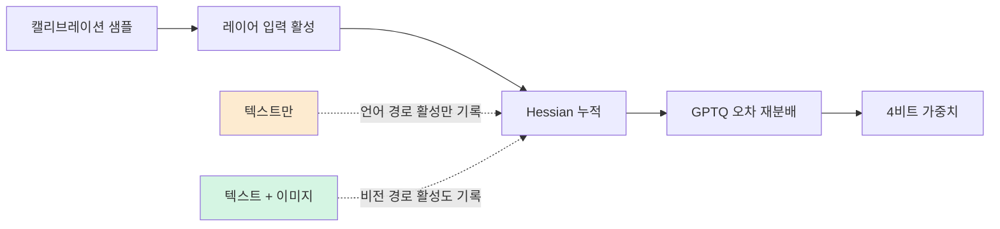
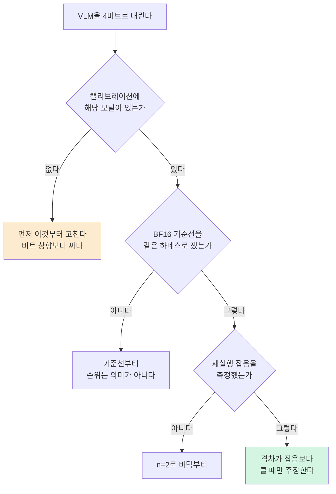

비전 언어 모델을 4비트로 내려 온프렘에 서빙하시는 분이라면, 비트 폭을 고민하기 전에 캘리브레이션 셋부터 확인하셔야 합니다. 저희가 같은 양자화 레시피를 같은 모델에 두 번 적용하고 캘리브레이션 데이터만 바꿨더니 MMMU 점수가 1.89포인트 움직였습니다. 이 폭은 저희가 측정한 재실행 잡음의 다섯 배가 넘습니다.

*글의 핵심 개념을 형상화했습니다.*

## 캘리브레이션 셋만 바꾼 결과

대상은 Muse-Glimmer-30B입니다. dense 30B 규모의 이미지 텍스트 모델이고, 공개 NVFP4 변형이 이미 있어서 비교 대상이 명확합니다. 저희는 GPTQ 기반 NVFP4 레시피를 고정한 채 캘리브레이션 셋만 두 가지로 갈랐습니다. 하나는 텍스트 채팅 코퍼스 1,024개, 다른 하나는 같은 1,024개 중 512개를 이미지가 붙은 VQA 샘플로 교체한 것입니다.

| 빌드 | 캘리브레이션 | MMMU-val | 크기 |
|---|---|---|---|
| BF16 원본 | 해당 없음 | 0.4922 | 55.49 GB |
| 이미지 혼합 캘리브 | 텍스트 + 이미지 | 0.4878 | 23.41 GB |
| 공개 NVFP4 기준선 | 텍스트 전용 | 0.4800 | 21.80 GB |
| 텍스트 전용 캘리브 | 텍스트 | 0.4689 | 23.41 GB |

단일 B200에서 후보마다 두 번씩 돌렸고, MMMU-val 900문항을 전수 평가했습니다. 재실행 사이의 편차는 0.36포인트에 그쳤습니다.

읽는 방법은 이렇습니다. 같은 레시피인데 텍스트로만 캘리브레이션한 빌드는 공개 기준선보다 1.11포인트 낮고, 이미지를 섞은 빌드는 0.78포인트 높습니다. 그리고 이미지를 섞은 빌드는 BF16 원본과 0.44포인트 차이입니다. 가중치를 2.37배 줄이고도 시각 추론이 사실상 남아 있다는 뜻인데, 그 조건이 바로 캘리브레이션에 이미지를 넣는 것입니다.

## 왜 캘리브레이션 데이터가 여기까지 영향을 주는가

이 결과가 처음에는 의아하실 수 있습니다. NVFP4에서 활성값 스케일은 런타임에 그룹 단위로 동적으로 정해지기 때문입니다. 즉 캘리브레이션 데이터가 활성 스케일을 결정하지는 않습니다.

캘리브레이션이 실제로 작용하는 지점은 가중치 쪽입니다. GPTQ는 캘리브레이션 샘플을 흘려보내며 각 레이어 입력의 2차 통계, 곧 Hessian을 쌓고, 그 정보를 써서 어떤 가중치를 반올림할 때 생기는 오차를 남은 가중치로 재분배합니다. 그러니까 캘리브레이션 데이터가 하는 일은 "어느 방향의 오차가 실제로 아프다"를 모델에 알려주는 것입니다.

여기서 텍스트 전용 캘리브레이션의 문제가 드러납니다. 이미지 토큰이 언어탑을 통과할 때 만드는 활성 패턴이 Hessian에 한 번도 등장하지 않습니다. 그 방향의 오차는 아프다고 신고된 적이 없으니 보정 대상에서 빠지고, 결국 비전 경로의 양자화 오차가 그대로 남습니다.

그림 1. 캘리브레이션 데이터는 활성 스케일이 아니라 Hessian을 거쳐 가중치 보정에 영향을 줍니다.

이 설명은 데이터와 들어맞지만 저희가 직접 증명한 것은 아닙니다. 비전 경로의 Hessian 기여만 따로 떼어 낸 대조군을 돌리지 않았기 때문에, 여기서는 관측과 정합하는 가설로만 적어 둡니다.

## 텍스트 축에서는 알고리즘이 값을 합니다

같은 캠페인에서 텍스트 전용 MoE 모델인 Qwen3-30B-A3B도 함께 다뤘습니다. 이번에는 캘리브레이션을 고정하고 가중치 갱신 알고리즘만 바꿨습니다. Hessian 보정을 하는 GPTQ와 관측만 하는 RTN 두 가지입니다.

BF16 원본의 MMLU가 77.79인데 GPTQ 빌드는 76.43, RTN 빌드는 76.19였습니다. GPTQ가 RTN보다 0.24포인트 앞서지만 둘 다 원본에서 1포인트 이상 내려옵니다. GPTQ가 더 쓴 5.4시간이 사는 것은 RTN 대비 그 0.24포인트입니다.

⚠️ **정정 (2026-08-13).** 이 자리에는 H200에서 잰 77.43 / 76.76이 실려 있었고, 그 근거로 "GPTQ는 BF16과 통계적으로 구분되지 않는다"고 적혀 있었습니다. 그런데 **Hopper에는 FP4 텐서코어가 없습니다.** 그 측정은 4비트 가중치를 풀어 고정밀로 계산한 경로의 값이지 NVFP4 연산의 값이 아니었습니다. 같은 파일을 네이티브 FP4가 도는 B200에서 다시 재니 BF16과의 격차가 0.36포인트에서 1.36포인트로 벌어졌고, 이는 하네스가 보고하는 표집 오차(±0.34포인트)의 네 배입니다. **"구분되지 않는다"는 NVFP4를 실제로 배포할 하드웨어에서는 성립하지 않습니다.** 4비트 모델의 점수를 볼 때 어느 GPU에서 쟀는지가 스펙의 일부인 이유가 이것입니다.

덤으로 확인된 것이 하나 더 있습니다. 저희 RTN 빌드는 공개 NVFP4 기준선을 0.01포인트 안에서 재현했습니다. 그쪽 체크포인트가 GPTQ가 아니라 RTN으로 만들어졌다는 앞선 확인과 맞아떨어지고, 남의 레시피를 그대로 복제할 수 있다는 점도 함께 보여 줍니다.

## 기준선 하나가 결론의 부호를 바꿨습니다

이 부분은 수치보다 더 오래 남을 교훈이라 따로 적습니다.

BF16 기준선 행이 비어 있던 동안, 위 표는 전혀 다르게 읽혔습니다. 후보끼리만 비교하면 GPTQ는 MMLU에서 이기고 gsm8k에서 지는 것처럼 보였고, 저희는 "어느 벤치마크를 고르느냐가 승자를 정한다"는 결론까지 적었습니다. 그런데 BF16 수치가 들어오자 구조가 달라졌습니다. gsm8k에서는 세 후보가 전부 원본보다 높았습니다. 부호는 일관됐지만 표집 잡음과 구분되지 않는 폭이었고, 결국 그 축에서는 아무도 아무것도 잃지 않았던 것입니다. 실제로 갈린 축은 MMLU 하나뿐이었습니다.

기준점이 없는 A/B는 순위는 줍니다. 그런데 그 순위가 무엇을 의미하는지는 알려 주지 않습니다. 양자화 비교를 계획하실 때 원본 측정을 후순위로 미루시면, 저희처럼 몇 시간 동안 틀린 문장을 붙잡고 계실 수 있습니다.

## 인용하시면 안 되는 숫자

같은 실행에서 ChartQA 지표가 세 갈래로 나왔습니다. exact_match가 0.053인데 relaxed는 0.405, anywhere는 0.414입니다. 한 지표만 8분의 1로 주저앉는 것은 모델 실력이 아니라 정답 추출이 실패했다는 신호입니다. 이 모델은 추론형이라 정답 주변에 사고 과정을 함께 뱉는데, exact_match가 그것을 벗겨 내지 못합니다.

relaxed와 anywhere가 0.9포인트 안에서 일치하므로 같은 하네스 위에서 후보를 비교하는 용도로는 쓸 수 있습니다. 다만 "이 모델의 ChartQA는 40점대"처럼 절대 성능으로 인용하시면 안 됩니다. 그 숫자는 하네스의 추출 한계를 함께 재고 있습니다.

## 실무로 옮기면

그림 2. 4비트 VLM 품질을 판정하는 순서입니다. 위쪽 두 갈래가 저희가 실제로 걸렸던 지점입니다.

정리하면 이렇습니다. 멀티모달 모델을 양자화하실 때 캘리브레이션 셋 구성은 배포마다의 재량이 아니라 준비 단계에서 고정해야 하는 항목입니다. 비트를 올리거나 알고리즘을 바꾸는 선택지는 그다음입니다. 캘리브레이션에 해당 모달을 넣는 것이 훨씬 싸고, 저희 측정에서는 그쪽이 더 많이 벌었습니다.

그리고 품질을 주장하실 때는 세 가지를 함께 두시기 바랍니다. 원본 기준선, 재실행으로 잰 잡음 바닥, 그리고 판정을 사람이 아니라 코드가 내리게 하는 게이트입니다. 저희는 마지막 항목 덕분에 텍스트 전용 빌드를 공개하지 않았습니다. 게이트가 실제로 무언가를 떨어뜨려야 게이트입니다.

## 공개한 것과 공개하지 않은 것

게이트를 통과한 이미지 혼합 캘리브레이션 빌드는 [ThakiCloud/Muse-Glimmer-30B-NVFP4-GPTQ-mm](https://huggingface.co/ThakiCloud/Muse-Glimmer-30B-NVFP4-GPTQ-mm)으로 공개했습니다. 원본 라이선스인 apache-2.0을 승계하고, 모델 카드에 레시피와 캘리브레이션 조성, 벤치마크 프로토콜, 잡음 바닥, 그리고 저희가 재지 않은 축까지 적어 두었습니다. 텍스트 전용 빌드는 게이트에서 탈락했으므로 공개하지 않았습니다.

한계도 함께 밝힙니다. 결론은 MMMU와 ChartQA 두 벤치마크, 그리고 단일 양자화 시드에서 나왔습니다. 평가 잡음은 재실행으로 쟀지만 캘리브레이션 표본을 다시 뽑았을 때의 변동은 재지 않았습니다. 안전성과 OCR, 장문맥, 다국어 축은 손대지 않았으므로 그 축들의 BF16 등가는 주장하지 않습니다.

위 수치는 시뮬레이션이나 벤더 인용이 아니라 저희 클러스터의 단일 B200에서 직접 측정한 값입니다.

## 참고

- [ThakiCloud/Muse-Glimmer-30B-NVFP4-GPTQ-mm (Hugging Face)](https://huggingface.co/ThakiCloud/Muse-Glimmer-30B-NVFP4-GPTQ-mm)
- [RedHatAI/Muse-Glimmer-30B-NVFP4 (Hugging Face)](https://huggingface.co/RedHatAI/Muse-Glimmer-30B-NVFP4)
- [llm-compressor (GitHub)](https://github.com/vllm-project/llm-compressor)
- [GPTQ: Accurate Post-Training Quantization for Generative Pre-trained Transformers (arXiv)](https://arxiv.org/abs/2210.17323)
- [MMMU: A Massive Multi-discipline Multimodal Understanding Benchmark (arXiv)](https://arxiv.org/abs/2311.16502)
