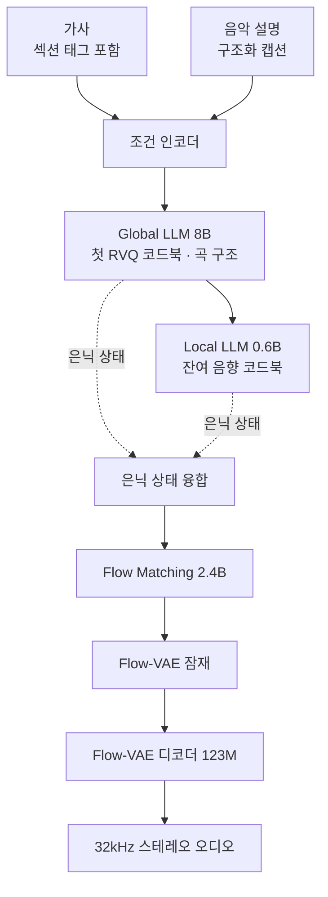

오픈 웨이트 음악 생성 모델을 사내 GPU나 고객 온프렘 환경에 올릴지 판단해야 하는 인프라 엔지니어와 기술 의사결정자를 위한 글입니다. 이 글을 읽고 나면 MiniMax Music 3를 실제로 서빙할 때 필요한 자원이 모델 카드에 적힌 VRAM 숫자와 어떻게 다른지, 그리고 계약서에서 무엇을 먼저 확인해야 하는지 알게 됩니다.

결론부터 말하겠습니다. 이 모델의 서빙 난이도를 결정하는 것은 VRAM이 아니라 저장소와 배포 파이프라인입니다. 모델 카드는 24GB VRAM 한 장이면 돌아간다고 안내하지만, 저장소를 그대로 받으면 가중치만 53.35GiB입니다. 아래에서는 Hugging Face 저장소 메타데이터를 직접 집계한 수치를 근거로 이 격차가 어디서 생기는지 설명하고, 온프렘 서빙 사업자가 준비해야 할 항목을 정리합니다.


*긴 구조를 담당하는 층과 세밀한 음향을 담당하는 층이 따로 움직이는 구조입니다.*

## 개요

MiniMax가 MiniMax Music 3의 가중치를 공개했습니다. 가사와 음악 설명을 입력하면 최대 5분 길이의 완성된 곡을 생성하며, 출력은 32kHz 16비트 스테레오 WAV입니다. 인트로와 벌스, 프리코러스, 코러스, 브리지, 간주, 아웃트로까지 이어지는 곡 구조를 유지하면서 보컬 정체성과 편곡 진행을 끝까지 끌고 가는 것이 이 모델이 내세우는 지점입니다.

음악 생성 모델은 그동안 상용 API 뒤에 숨어 있는 경우가 많았습니다. 짧은 클립을 만드는 오픈 모델은 있었지만 완곡 길이를 유지하면서 가사를 노래로 부르는 수준의 모델이 가중치째로 나온 적은 드뭅니다. 그래서 이 릴리스는 자체 GPU를 가진 조직에게 실질적인 선택지가 됩니다. 생성 요청 하나하나를 외부 API로 보내지 않아도 되고, 가사와 음원이 조직 밖으로 나가지 않는 구성을 만들 수 있습니다.

다만 선택지가 생겼다는 것과 운영할 수 있다는 것은 다른 문제입니다. 음악 모델은 텍스트 모델과 자원 프로파일이 다릅니다. 출력이 오디오라 생성 시간이 길고, 파이프라인이 언어 모델 하나로 끝나지 않으며, 저장해야 할 컴포넌트가 여럿입니다. 그래서 이 글은 벤치마크 점수가 아니라 서빙 원가를 구성하는 항목을 봅니다.

## 이 모델은 무엇인가

MiniMax Music 3는 계층형 자기회귀 구조를 씁니다. 긴 흐름을 담당하는 모델과 세밀한 음향을 담당하는 모델을 분리한 것이 핵심입니다.

Global LLM은 8B 규모이며 프레임 단위로 첫 번째 RVQ 코드북을 예측합니다. 곡의 장기적인 의미와 구조적 진행이 이 층의 책임입니다. Local LLM은 0.6B 규모로 각 프레임 안에서 나머지 음향 코드북을 예측해 세밀한 음향 정보를 복원합니다. 모델 카드에 따르면 Global LLM은 Qwen3-8B에서 초기화한 뒤 임베딩과 출력층을 음악 의미 토큰에 맞게 적응시켰고, 이후 두 모델을 함께 학습해 모든 RVQ 코드북을 모델링했습니다.

토크나이저는 8층 잔차 벡터 양자화를 씁니다. 첫 번째 의미 코드북이 16,384개 엔트리로 핵심 음악 의미와 구조를 담고, 나머지 일곱 개 음향 코드북이 각각 1,024개 엔트리로 잔차 음향 세부를 담습니다. 학습은 의미 코드북을 먼저 최적화한 뒤 여덟 개를 함께 훈련하는 순서로 진행됐습니다.

흥미로운 부분은 합성 경로입니다. 이산 RVQ 토큰만으로 디코딩하지 않고 Global과 Local LLM의 마지막 은닉 상태를 융합해 씁니다. 연속 표현이 보컬 발음과 악기 질감, 시간적 연속성에 필요한 음향 정보를 더 많이 보존한다는 설명입니다. 융합된 은닉 상태는 2.4B 규모의 Flow Matching을 거쳐 Flow-VAE 잠재 공간으로 가고, 123M 규모의 Flow-VAE 디코더가 최종 오디오를 만듭니다. 이 Flow-VAE는 MiniMax Speech에서 가져와 음악의 동적 범위와 스펙트럼 특성에 맞게 재학습한 것입니다. 추론 시점에는 이산 토크나이저 디코더가 필요하지 않습니다.




*긴 구조를 담당하는 8B와 세밀한 음향을 담당하는 0.6B가 코드북을 나눠 예측합니다.*

입력은 두 갈래입니다. 가사에는 `[Intro]`, `[Verse]`, `[Pre-Chorus]`, `[Chorus]`, `[Post-Chorus]`, `[Bridge]`, `[Instrumental]`, `[Solo]`, `[Outro]` 같은 섹션 태그를 명시할 수 있습니다. 음악 설명은 스타일과 감정 진행, 보컬 연기, 악기 편성, 편곡, 프로덕션 프로파일을 정의합니다. 모델 카드는 정밀한 제어를 위해 구조화 캡션을 권장하며, 전역 메타데이터와 보컬 세부, 편곡 세 부분으로 나눠 쓰라고 안내합니다. 전역 메타데이터에는 장르와 세부 장르, BPM, 조성, 음계, 감정 진행, 청취 상황, 프로덕션 프로파일이 들어갑니다.

## 설치 및 통합

모델 카드가 제시하는 서빙 경로는 SGLang-Omni입니다. 가중치를 받고 서비스를 띄우는 명령은 단순합니다.

```bash
hf download MiniMaxAI/MiniMax-Music3 --local-dir /path/to/minimax_ttm
sgl-omni serve --model-path MiniMaxAI/MiniMax-Music3 --port 8000
```

생성 요청은 음성 API 형식을 그대로 씁니다. 가사를 `input`에, 음악 설명을 `instructions`에 넣고 섹션 태그는 각각 별도 줄에 둡니다.

```bash
curl http://127.0.0.1:8000/v1/audio/speech \
  -H 'Content-Type: application/json' \
  -d '{
    "model": "MiniMaxAI/MiniMax-Music3",
    "input": "[Verse]\nMorning light filtering through the pine\n[Chorus]\nSoftly the world begins to breathe",
    "instructions": "A warm acoustic pop song with intimate female vocals, fingerpicked guitar, soft piano, and a gradual emotional build into a wide final chorus.",
    "response_format": "wav",
    "seed": 7,
    "max_new_tokens": 750,
    "stream": false
  }'
```

기존 음성 API 스키마를 재사용한 선택은 통합 관점에서 반갑습니다. 이미 OpenAI 호환 음성 엔드포인트를 다루는 게이트웨이가 있다면 라우팅 규칙만 추가하면 되고, 클라이언트 SDK를 새로 만들 필요가 없습니다.

diffusers 경로도 지원합니다. `ModularPipeline.from_pretrained`로 파이프라인을 만들고 bfloat16으로 컴포넌트를 로드한 뒤 가사와 프롬프트, 생성 길이를 넘기는 형태입니다. VRAM이 빠듯한 환경을 위한 안내도 함께 있습니다. 모델 카드는 전체 정밀도가 24GB VRAM 아래에 들어가고, 자동 CPU 오프로딩을 켜면 약 22GB에서 생성되며, 언어 모델을 층 단위로 스트리밍하면 8GB 카드에도 올라간다고 적고 있습니다.

프롬프트 품질을 올리는 도구도 함께 배포됐습니다. 짧은 자연어 설명을 구조화 캡션으로 확장해 주는 `music-caption-rewriter` 스킬을 `npx skills add MiniMax-AI/MiniMax-Music3 --skill music-caption-rewriter`로 받을 수 있습니다.

## 실제 실험 결과

먼저 정직하게 밝혀 둘 것이 있습니다. 이번 글에서는 실제 음악 생성 추론을 돌리지 못했습니다. 모델 카드가 명시하듯 추론에 CUDA가 필요한데 작업 환경에 로컬 GPU가 없었습니다. 그래서 생성 품질이나 지연 시간 수치는 이 글에 없습니다. 그 수치를 지어내는 대신, GPU 없이도 정확히 측정할 수 있고 서빙 원가에 직접 영향을 주는 항목을 측정했습니다. 저장소가 실제로 몇 바이트인지입니다.

Hugging Face 저장소 메타데이터 API는 파일별 실제 바이트 크기를 반환합니다. 이 값을 컴포넌트별로 집계했습니다.

```python
API = "https://huggingface.co/api/models/MiniMaxAI/MiniMax-Music3?blobs=true"
WEIGHT_SUFFIXES = (".safetensors", ".pth", ".bin")
```

측정 결과는 다음과 같습니다.

| 컴포넌트 | 용량 | 파일 수 | 서빙 레이아웃 |
|---|---|---|---|
| Qwen3-8B 캡션 인코더 | 17.19 GiB | 47 | 공통 |
| Hybrid-LM (Global 8B + Local 0.6B) | 15.99 GiB | 4 | 공통 |
| flowmatching_vae.pth | 9.15 GiB | 1 | raw |
| Flow Matching 트랜스포머 | 9.06 GiB | 2 | diffusers |
| RVQ depth 디코더 | 1.20 GiB | 1 | diffusers |
| dav.pth | 0.46 GiB | 1 | raw |
| 보코더 | 0.20 GiB | 1 | diffusers |
| 조건 인코더 | 0.09 GiB | 1 | diffusers |

가중치 파일 58개 합계가 53.35GiB이고, 설정과 자산 파일 30개를 더한 전체 저장소는 53.41GiB입니다.


*점선은 모델 카드가 제시한 24GB VRAM 상한입니다. 디스크 용량은 그 두 배를 넘습니다.*

여기서 두 가지가 드러납니다.

첫째, 저장소는 서로 다른 두 개의 서빙 레이아웃을 함께 담고 있습니다. diffusers 방식으로 쓰는 컴포넌트 디렉터리와 raw 체크포인트 파일이 공존합니다. 한 런타임은 공통 컴포넌트에 둘 중 하나만 있으면 됩니다. 계산해 보면 공통 컴포넌트에 diffusers 레이아웃을 더한 경우 43.74GiB, raw 레이아웃을 더한 경우 42.79GiB입니다. 즉 무엇을 쓸지 정하고 부분 다운로드를 하면 10GiB 안팎을 아낍니다.

둘째, 그렇게 줄여도 디스크 43GiB와 VRAM 24GB 사이에는 여전히 큰 격차가 남습니다. 이 격차의 상당 부분은 정밀도에서 옵니다. 저장소의 텐서 타입은 F32이고 카드가 제시하는 로딩 예제는 bfloat16입니다. 런타임 세트 43.74GiB를 절반으로 나누면 약 21.9GiB이고, raw 레이아웃 기준으로는 약 21.4GiB입니다. 카드가 말하는 22GB 안팎이라는 수치와 잘 맞습니다.

이것이 실무에 주는 규칙은 간단합니다. **디스크는 VRAM의 약 두 배로 잡고, 저장소 전체를 받으면 그보다 더 든다**고 계획하면 됩니다. 이 모델의 경우 노드당 60GiB 정도의 여유 공간을 확보해 두면 안전합니다.

## ThakiCloud 제품 적용 시사점

이 측정이 왜 중요한지는 GPU 클러스터를 운영해 보면 분명해집니다. ThakiCloud의 ai-platform은 Kubernetes와 Kueue 기반으로 GPU 워크로드를 다루는 AI/ML 인프라이며, 고객 온프렘과 소버린 환경에도 배포됩니다. 그 환경에서 53GiB짜리 모델은 VRAM 문제가 아니라 다음 세 가지 문제로 나타납니다.

먼저 이미지와 가중치 배포 경로입니다. 파드가 뜰 때마다 외부에서 53GiB를 받아 오면 노드 스토리지와 외부 대역폭이 함께 무너집니다. ai-platform이 내부 오브젝트 스토리지에 모델 레지스트리를 두고 가중치를 사내에서 공급하는 이유가 여기 있습니다. 폐쇄망 고객 환경에서는 이 경로가 선택이 아니라 전제입니다.

다음은 부분 동기화입니다. 앞의 측정은 서빙 레이아웃을 정하면 10GiB를 아낄 수 있다는 것을 보여 줍니다. 모델 하나로는 작아 보이지만, 여러 모델을 여러 노드에 올리는 멀티테넌트 환경에서는 노드마다 반복되는 비용입니다. 어떤 컴포넌트가 실제로 필요한지를 레지스트리 단계에서 정리해 두면 그만큼이 그대로 절약됩니다.

마지막은 스케줄링 프로파일입니다. 음악 생성은 요청당 수십 초에서 수 분이 걸리고, 카드에 따르면 현재는 비스트리밍 생성만 지원합니다. 즉 요청 하나가 GPU를 오래 점유하고 중간 응답이 없습니다. 대화형 텍스트 추론과 같은 큐에 넣으면 지연 시간 특성이 전혀 다른 두 워크로드가 서로를 밀어냅니다. 우선순위 클래스를 분리하고 배치 크기와 동시 실행 수를 따로 잡아야 합니다.

에이전트 관점에서도 볼 부분이 있습니다. Paxis는 ai-platform 위에서 도는 Agent-Native Cloud 제어 평면으로, 스킬과 도구, 정책, 감사 로그를 일급 리소스로 다룹니다. MiniMax가 프롬프트 재작성기를 별도 스킬로 배포한 방식은 이 구조와 그대로 맞물립니다. 음악 생성 요청을 에이전트 워크플로 안에 넣는다면 캡션 재작성은 스킬 레이어에서 처리하고, 생성 호출은 격리된 샌드박스에서 실행하며, 누가 어떤 가사로 무엇을 만들었는지는 감사 로그로 남기는 구성이 자연스럽습니다. 뒤에서 보겠지만 이 모델의 라이선스는 그 감사 기록을 사실상 요구합니다.


*캡션 재작성은 스킬 계층에, 긴 생성은 격리 샌드박스에, 생성 기록은 감사 로그에 둡니다.*

## 한계 및 반론

가장 먼저 짚어야 할 것은 라이선스입니다. 일부 2차 매체는 이 모델이 Apache 2.0으로 공개됐다고 전했지만, 저장소의 `LICENSE` 파일을 직접 열어 보면 다릅니다. 실제 이름은 MiniMax-Music3 커뮤니티 라이선스이며 표준 오픈소스 라이선스가 아닙니다.

조건은 세 가지가 눈에 띕니다. 상업적 제품이나 서비스에 쓰는 경우 사용자 인터페이스에 "MiniMax-Music3"를 눈에 띄게 표시해야 합니다. 본인과 계열사가 해당 제품과 서비스로 올리는 연간 총매출이 미화 2천만 달러를 넘으면 별도의 사전 서면 승인을 받아야 하며, 창구는 지정된 이메일 주소입니다. 그리고 제3자에게 이 모델로 생성할 수 있는 제품이나 호스팅 서비스를 제공한다면, 서비스 제공 전과 운영 기간 내내 침해나 오용을 막기 위한 합리적이고 비례적인 기술적 조직적 안전장치를 구현하고 유지하며 시험하고 주기적으로 검토해야 합니다. 그 안전장치를 고의로 비활성화하거나 우회를 허용해서도 안 되며, 다운스트림 수령자에 대해서까지 이 요건을 집행할 책임이 있습니다.

마지막 조항은 서빙 사업자에게 특히 무겁습니다. 모델을 올려 두고 API만 열어 주는 구성으로는 부족하며, 필터링과 모니터링, 기록, 주기적 검토가 계약상 의무가 됩니다. 저작권 민감도가 높은 음악 도메인이라 더 그렇습니다. 오픈 웨이트 모델의 지역 제한과 매출 게이트는 이 모델만의 이야기가 아니며, 이 문제는 [오픈 영상 모델 라이선스를 전수 확인한 이전 글](https://thakicloud.com/tech-blog/ko/llmops/open-video-model-license-territory-audit/)에서도 같은 패턴으로 확인됐습니다. 모델 카드의 라이선스 표기만 보고 넘어가면 놓치는 부분입니다.

기술적 제약도 분명합니다. 추론에 CUDA가 필요하므로 다른 가속기 환경은 현재 선택지가 아닙니다. 비스트리밍 생성만 지원해 사용자가 첫 소리를 듣기까지 전체 생성이 끝나야 합니다. 토큰화된 텍스트 프롬프트는 5,000토큰, 오디오 생성은 9,000 음향 프레임으로 제한됩니다. 그리고 모델 카드 스스로 밝히듯 섹션 태그와 음악 설명은 생성을 유도할 뿐 기호적 보장을 제공하지 않습니다. 요청한 템포와 조성, 악기 편성, 가사, 곡 구조가 항상 정확히 반영되지는 않습니다. 정확한 악보 수준의 제어가 필요한 용도라면 이 모델만으로는 부족합니다.

이 글의 한계도 밝혀 둡니다. 앞서 적었듯 실제 생성 품질과 지연 시간은 측정하지 못했습니다. 디스크와 VRAM에 관한 결론은 저장소 메타데이터와 모델 카드 문서를 근거로 한 것이며, 실제 처리량은 GPU에서 직접 재야 확정됩니다.

## 정리

MiniMax Music 3는 완곡 길이의 음악 생성을 자체 인프라에서 돌릴 수 있게 만든 의미 있는 릴리스입니다. 구조는 명확하고 서빙 경로도 잘 문서화돼 있습니다. 다만 이 모델을 실제로 운영하기로 했다면 GPU 사양표보다 먼저 볼 것이 두 가지 있습니다.

하나는 저장소입니다. 가중치 53.35GiB, 레이아웃을 정리해도 43GiB 안팎이며 VRAM 요구의 두 배가 넘습니다. 노드 스토리지와 내부 배포 경로를 먼저 준비하지 않으면 첫 파드부터 막힙니다. 다른 하나는 라이선스입니다. Apache 2.0이 아니라 커뮤니티 라이선스이고, 매출 게이트와 표기 의무, 그리고 호스팅 사업자에게 부과되는 안전장치 의무가 함께 붙어 있습니다.


*GPU 확보를 맨 앞에 두면 계약서와 스토리지에서 막힙니다.*

다음 행동은 순서가 정해져 있습니다. 서빙 레이아웃을 diffusers와 raw 중 하나로 먼저 고르고, 그에 맞춰 부분 다운로드 목록을 만들어 내부 레지스트리에 올린 뒤, 법무 검토로 매출 구간과 안전장치 요건을 확인하고, 그다음에 GPU를 잡으십시오. 반대 순서로 진행하면 GPU를 확보한 뒤에 계약서 때문에 멈추게 됩니다.

## 출처

- [MiniMaxAI/MiniMax-Music3 모델 카드](https://huggingface.co/MiniMaxAI/MiniMax-Music3)
- [MiniMax-Music3 커뮤니티 라이선스 원문](https://huggingface.co/MiniMaxAI/MiniMax-Music3/raw/main/LICENSE)
- [MiniMax 공식 블로그: MiniMax Music 3.0](https://www.minimax.io/blog/minimax-music-3-0-next-generation-open-weights-production-ready-versatile-music-model)
- 측정 스크립트와 로그: `scripts/experiments/minimax-music3-footprint/`, `outputs/blog-impl/minimax-music3-open-weights-serving/run-2.log`
