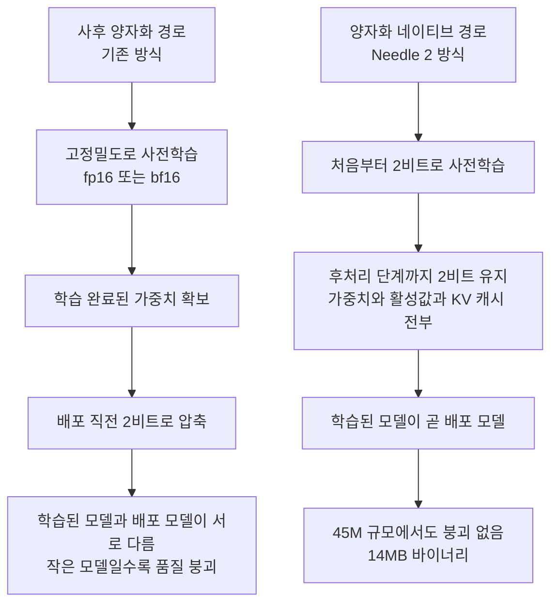

*압축의 성패는 얼마나 줄였느냐가 아니라 언제 줄이기 시작했느냐에서 갈렸습니다.*

## 왜 읽어야 하나

센서, 웨어러블, 로봇처럼 네트워크와 전력이 넉넉하지 않은 장치에서 도구 호출 에이전트를 굴릴지 검토 중인 엣지 담당 엔지니어와, 양자화 티어를 어느 단계에서 결정할지 고민하는 인프라 담당자를 위한 글입니다. 결론을 먼저 말씀드리면, 작은 모델에서 2비트가 무너지는 원인은 2비트라는 정밀도 자체가 아니라 그것을 학습이 끝난 다음에 덧씌운다는 순서에 있고, Needle 2는 그 순서를 바꿔서 45M 파라미터를 14MB 안에 밀어 넣었습니다.

이 구분이 실무에서 중요한 이유는 책임 소재가 옮겨가기 때문입니다. 양자화가 배포 직전의 후처리라면 그것은 서빙팀의 선택지입니다. 양자화가 사전학습의 전제라면 그것은 학습 파이프라인의 설계 사항이 되고, 배포 시점에는 이미 선택의 여지가 없습니다. 아래에서는 Needle 2가 공개한 구조와 수치를 정리하면서 이 이동이 무엇을 바꾸는지 짚어보겠습니다.

## 개요

Cactus Compute가 8월 11일 Needle 2를 공개했습니다. 45M 파라미터 규모의 도구 호출 전용 모델이고, 전체가 14MB 단일 바이너리로 배포되며, 세션 하나를 끝까지 돌리는 데 28MB RAM을 씁니다. 라즈베리파이 5에서 초당 500토큰이 넘는 디코딩 속도를 냈고, ESP32-S3 마이크로컨트롤러와 Meta Quest 3S, 그리고 200달러 이하 안드로이드 단말에서 동작한다고 밝혔습니다.

숫자만 보면 그저 아주 작은 모델 하나가 더 나온 것처럼 읽힙니다. 실제로 같은 팀이 앞서 내놓은 Needle 1세대는 26M 규모의 증류 모델이었으니 계보 자체도 낯설지 않습니다. 그런데 이번 발표에서 눈여겨볼 부분은 파라미터 수가 아니라 정밀도를 다루는 방식입니다.

바로 전날 저희는 Unsloth가 2비트로 양자화한 Nemotron 3.5 Lightning을 다뤘습니다. 30B 규모 MoE 모델을 24GB 카드 한 장에 올리는 이야기였고, 거기서 2비트는 학습이 다 끝난 가중치에 사후로 적용하는 압축이었습니다. 큰 모델에서는 이 방식이 잘 통합니다. 파라미터가 많으면 정밀도를 깎아도 표현력이 남아 있기 때문입니다. 문제는 모델이 작아질수록 이 여유가 사라진다는 점이고, 45M 규모에서 사후 2비트를 적용하면 품질이 그냥 무너집니다. Needle 2는 이 벽을 정면으로 넘지 않고 우회했습니다.

## 이 모델은 무엇인가

Needle 2는 범용 대화 모델이 아닙니다. 도구 호출과 장치 제어, 구조화된 정보 추출이라는 세 가지 작업에 초점을 맞춘 모델입니다. 이 범위 제한이 45M이라는 규모를 성립시키는 첫 번째 조건입니다. 자유로운 대화를 포기하는 대신, 정해진 스키마에 맞는 함수 호출을 안정적으로 만들어내는 데 용량을 집중했습니다.

구조는 Simple Attention Network 계열입니다. 일반적인 트랜스포머의 FFN 자리에 Hadamard MLP를 넣었고, 어텐션은 GQA를 씁니다. 여기에 engram이라 부르는 키값 메모리와 다중 레인 하이퍼 커넥션이 더해집니다. 어텐션과 MLP 양쪽 잔차에 샌드위치 정규화와 게이팅이 걸려 있고, engram 지점은 두 개 레이어에서 동작합니다.

이 구성 요소들이 낯설게 보이지만 방향은 하나로 모입니다. 파라미터를 늘리지 않고 표현력을 확보하는 것입니다. FFN은 트랜스포머에서 파라미터를 가장 많이 먹는 부분이라 45M 예산에서는 그대로 두기 어렵고, engram 같은 별도 키값 메모리는 사실 관계를 가중치 안에 분산해 외우는 대신 조회 가능한 형태로 빼둡니다. 잔차 경로마다 정규화와 게이팅을 두는 설계도 마찬가지 맥락인데, 낮은 정밀도에서 학습할 때 값의 크기가 튀는 것을 억제하는 방향으로 작동합니다. 2비트 학습을 성립시키려면 구조 자체가 안정적인 수치 범위 안에 머물러야 하고, 이 모델의 구조 선택은 그 제약과 떼어놓고 읽기 어렵습니다.

실무적으로 가장 중요한 설계는 디코딩 쪽에 있습니다. Needle 2는 선언된 스키마에서 컴파일한 바이트 단위 문법으로 디코딩을 제약합니다. 모델이 문법적으로 올바른 함수 호출만 생성할 수 있도록 출력 공간 자체를 좁혀버린 것입니다. 작은 모델이 구조화된 출력에서 흔히 겪는 실패는 의도는 맞는데 형식이 깨지는 경우인데, 이 제약을 런타임이 강제하면 그 실패 유형이 통째로 사라집니다. 모델이 감당해야 할 난이도가 그만큼 내려갑니다.

*네 가지 선택이 모두 같은 제약을 향합니다. 파라미터를 늘리지 않고 버티는 것입니다.*

## 왜 사후 양자화는 작은 모델에서 무너지나

Cactus Compute의 주장을 평가하려면 먼저 사후 양자화가 어디서 깨지는지를 짚어야 합니다. 이 부분은 특정 회사의 주장이 아니라 양자화 연구에서 널리 공유된 이해에 가깝습니다.

학습이 끝난 모델을 낮은 정밀도로 옮기는 작업은 본질적으로 근사입니다. 원래 가중치가 놓여 있던 연속적인 값 공간을 몇 개의 구간으로 나누고, 각 가중치를 가장 가까운 구간 대표값으로 옮깁니다. 이때 생기는 오차는 모델 입장에서 학습한 적 없는 교란입니다. 8비트나 4비트에서는 구간이 촘촘해 교란이 작고, 큰 모델은 파라미터 사이에 중복이 많아 일부가 흔들려도 다른 경로가 기능을 떠받칩니다. 어제 다룬 30B 규모 모델에서 2비트가 실용적으로 동작했던 배경이 이것입니다.

2비트는 사정이 다릅니다. 가중치 하나가 가질 수 있는 값이 네 개뿐이므로 근사 오차가 급격히 커집니다. 게다가 활성값 분포에는 소수의 극단값이 섞여 있는 경우가 많은데, 이 극단값을 담으려고 구간 범위를 넓히면 정작 대다수 값이 몰려 있는 구간의 해상도가 함께 무너집니다. 레이어를 통과할 때마다 이 오차가 누적되고, 파라미터가 적어 우회 경로가 없는 모델일수록 누적분을 흡수할 여력이 없습니다. 45M 규모에서 사후 2비트가 무너진다는 말은 이 여력이 바닥났다는 뜻입니다.

*세 단계는 순서대로 일어나고, 마지막 칸에서 여력이 바닥납니다.*

학습 단계에서 2비트를 전제로 두면 이 논리가 성립하지 않습니다. 모델이 애초에 네 개짜리 값 공간 위에서 손실을 낮추도록 학습되기 때문에, 그 값 공간에 맞는 표현을 스스로 찾아갑니다. 근사 오차라고 부를 대상 자체가 없습니다. 학습된 모델과 배포되는 모델이 물리적으로 같은 파일이라는 Cactus Compute의 설명은 이 지점을 가리킵니다.

낮은 정밀도를 학습에 반영하는 발상 자체는 새롭지 않습니다. 양자화 인식 학습은 오래된 기법입니다. 다만 관행적으로는 고정밀도로 사전학습을 마친 뒤 마지막 미세조정 구간에서만 양자화를 흉내 내는 방식이 일반적이었고, 그래서 사전학습의 대부분은 여전히 고정밀도 공간에서 일어났습니다. Needle 2가 내세우는 차이는 적용 시점을 사전학습의 시작으로 당기고, 대상 범위를 가중치뿐 아니라 활성값과 KV 캐시까지 넓혔다는 점입니다. KV 캐시가 포함됐다는 사실이 특히 실무적으로 중요합니다. 28MB RAM으로 세션 하나를 끝까지 돌린다는 수치는 가중치만 줄여서는 나오지 않고, 대화가 길어질수록 늘어나는 캐시까지 같은 정밀도로 눌러야 나옵니다.

## 설치 및 통합

Needle 2는 Hugging Face의 `Cactus-Compute/needle2` 저장소로 배포되고, 실행 엔진과 커널은 `cactus-compute/cactus` 저장소에 함께 공개돼 있습니다. 모델 자체 저장소는 `cactus-compute/needle`입니다. 배포 단위가 가중치 파일이 아니라 엔진에 구워진 단일 바이너리라는 점이 일반적인 GGUF 배포와 다른 부분입니다.

여기서 한 가지 미리 밝혀둘 것이 있습니다. 1세대 Needle은 MIT 라이선스로 공개됐지만, Needle 2 자체의 라이선스 표기는 이 글을 쓰는 시점에 저희가 확인하지 못했습니다. 상용 제품에 넣을 계획이라면 모델 카드를 직접 확인하시기 바랍니다. 컨텍스트 길이 역시 공개 자료에서 확인되지 않아 이 글에서는 다루지 않았습니다.

## 실제 실험 결과

먼저 재현 시도 결과를 정직하게 적겠습니다. 이번 작업 환경에서는 외부 네트워크로 나가는 패키지 설치와 모델 다운로드가 막혀 있어 Needle 2를 직접 내려받아 구동하지 못했습니다. 따라서 아래 수치는 저희가 측정한 값이 아니라 Cactus Compute가 공개한 값이며, 그 사실을 전제로 읽어주시기 바랍니다. 저희 손으로 잰 숫자를 섞지 않았습니다.

평가는 공개된 함수 호출 벤치마크 다섯 개에서 진행됐습니다. 구글의 Mobile Actions, DroidCall, Seal-Tools의 도메인 내 시험과 도메인 외 시험, 그리고 BFCL v4 단일 턴입니다. 이 조합은 도구 호출 모델을 평가할 때 흔히 쓰이는 묶음이고, 도메인 외 시험이 포함돼 있다는 점에서 학습 데이터에 맞춘 과적합을 어느 정도 걸러냅니다.

Mobile Actions 결과가 이 모델의 성격을 가장 잘 보여줍니다.

| 모델 | Mobile Actions 점수 |
|---|---|
| LFM2.5 | 69.1% |
| FunctionGemma | 64.0% |
| **Needle 2** | **63.7%** |

Needle 2는 이 항목에서 1등이 아닙니다. FunctionGemma에 0.3포인트 뒤지고 LFM2.5에는 5.4포인트 뒤집니다. 이 수치를 승리로 포장하면 글이 거짓말이 되므로 그대로 적었습니다. 다만 비교 대상들이 전부 f16 전정밀도로 도는 5배에서 70배 큰 모델이라는 조건을 함께 놓으면 해석이 달라집니다. Cactus Compute의 표현대로 Needle 2는 이 규모 차이를 두고 상대와 승패를 주고받는 위치에 있습니다. 0.3포인트를 지면서 용량을 수십 분의 일로 줄인 거래를 어떻게 평가할지는 배치 환경이 결정합니다.

나머지 네 개 항목의 개별 점수는 공개 자료에서 확인하지 못해 이 글에 옮기지 않았습니다. 다만 평가 묶음의 구성만으로도 읽어낼 것이 있습니다. Seal-Tools를 도메인 내와 도메인 외로 나눠 측정했다는 점입니다. 도구 호출 모델은 학습 때 본 도구 목록에 과적합되기 쉽고, 그렇게 되면 벤치마크 점수는 높은데 실제 제품에 붙이는 순간 처음 보는 함수 시그니처 앞에서 무너집니다. 도메인 외 시험을 따로 공개했다는 것은 이 실패 유형을 감추지 않았다는 신호로 읽힙니다. 도입을 검토하신다면 이 항목의 점수를 먼저 확인하시길 권합니다. 여러분의 도구 목록은 어차피 학습 데이터에 없기 때문입니다.

속도 쪽 수치는 조금 더 직관적입니다. 라즈베리파이 5에서 초당 500토큰이 넘는 디코딩이 나옵니다. 도구 호출 한 번이 만들어내는 토큰이 대개 수십 개 수준이라는 점을 감안하면, 이 속도는 사용자가 지연을 인지하지 못하는 구간에 들어갑니다. ESP32-S3처럼 RAM이 수백 KB 단위인 마이크로컨트롤러에서 동작한다는 부분은 더 극적입니다. 이 급의 장치는 지금까지 언어 모델의 대상이 아니라 언어 모델에 데이터를 올려 보내는 말단이었습니다.

## ThakiCloud 제품 적용 시사점

ThakiCloud는 Paxis를 중심에 두고 기업의 업무를 에이전트로 자동화하며, 그 실행을 떠받치는 추론과 학습과 인프라를 함께 제공합니다. Needle 2가 던지는 질문은 이 구조의 가장 아래쪽 경계선에 닿아 있습니다.

*같은 기술이 네 계층에 서로 다른 질문을 던집니다.*

Paxis 관점에서 보면 이 모델은 에이전트를 통째로 대체하는 후보가 아니라 에이전트의 말단을 옮기는 후보입니다. Paxis는 스킬과 도구와 정책을 일급 리소스로 다루고, 어떤 스킬을 고를지 판단한 뒤 격리된 실행 환경에서 돌리고 모든 행동을 정책 게이트와 감사 로그로 통과시킵니다. 이 흐름에서 판단과 정책은 중앙에 남아야 하지만, 스키마가 확정된 도구 호출을 문자열로 만들어내는 마지막 단계까지 중앙에 있을 이유는 약합니다. 장치에서 바로 호출을 만들어내면 왕복 지연과 네트워크 비용이 사라지고, 무엇보다 네트워크가 끊긴 상태에서도 동작이 유지됩니다. 현장 장비나 차량처럼 연결이 불안정한 환경에서 이 차이는 기능의 유무를 가릅니다.

Metis 관점에서는 서빙 사다리의 맨 아래 칸이 하나 더 생긴 셈입니다. Metis는 추론과 토큰 생산을 담당하면서 모델 라우팅과 양자화로 토큰 단가를 관리합니다. 지금까지 이 라우팅의 하한은 가장 작은 서버 모델이었습니다. Needle급 모델이 실용 영역에 들어오면, 스키마가 고정된 반복 호출처럼 난이도가 낮고 물량이 많은 트래픽은 아예 데이터센터 밖으로 내보낼 수 있습니다. 이런 트래픽은 보통 건당 가치가 낮고 건수는 많아서 토큰 비용에서 차지하는 비중이 생각보다 큽니다.

Maxis 관점의 함의가 가장 구조적입니다. 양자화가 사전학습 단계로 들어가면 배포 가능한 소형 모델을 만드는 일이 서빙 최적화가 아니라 학습 파이프라인의 산출물이 됩니다. Maxis는 파인튜닝과 증류를 담당하는 계층인데, Needle 2가 보여준 방향은 증류의 목표를 다시 정의합니다. 큰 모델을 작게 줄이는 것이 아니라 처음부터 목표 정밀도에서 학습해 배포 모델과 학습 모델을 일치시키는 쪽입니다. 고객사 도메인에 맞춘 소형 도구 호출 모델을 만들어 달라는 요구가 들어왔을 때, 이 차이가 결과물의 품질 상한을 정합니다.

Aegis 관점에서는 폐쇄망 조건이 훨씬 쉬워집니다. 14MB 바이너리는 외부 연결이 아예 없는 설비에도 부담 없이 들어가고, 갱신도 파일 하나를 교체하는 수준입니다. 데이터 반출이 금지된 환경에서 추론을 장치 안에 가두는 방법으로는 가장 단순한 축에 속합니다.

## 한계 및 반론

이 모델을 과대평가하기 쉬운 지점들을 짚겠습니다.

첫째, Needle 2는 도구 호출 전용입니다. 요약이나 추론이나 대화를 기대하면 안 됩니다. 45M이라는 규모는 범위를 좁혔기 때문에 성립하는 것이지 범용 성능이 압축된 결과가 아닙니다. 도구 호출 이외의 작업이 하나라도 섞이는 순간 별도 모델이 필요하고, 그러면 장치에 두 개를 올릴지 중앙으로 되돌릴지 다시 판단해야 합니다.

둘째, 벤치마크 성적이 1등이 아니라는 사실을 그대로 받아들여야 합니다. Mobile Actions에서 Needle 2는 세 모델 중 최하위입니다. 규모 대비 효율이라는 축을 빼고 절대 정확도만 보면 더 큰 모델이 낫습니다. 정확도가 조금이라도 더 중요한 용도라면 이 모델은 답이 아닙니다.

셋째, 저희가 직접 재현하지 못했습니다. 위 수치는 전부 개발사 발표값이고 독립 검증을 거치지 않았습니다. 특히 마이크로컨트롤러 동작과 라즈베리파이 처리량은 측정 조건에 따라 크게 달라지는 항목이라, 실제 도입 전에는 대상 하드웨어에서 직접 재보셔야 합니다.

넷째, 바이트 단위 문법 제약은 양날입니다. 형식 오류를 없애주지만 동시에 스키마를 벗어난 출력을 원천적으로 막습니다. 도구 목록이 자주 바뀌거나 런타임에 동적으로 구성되는 시스템이라면 문법 컴파일 비용과 갱신 절차를 함께 설계해야 합니다.

다섯째, 라이선스가 확인되지 않았습니다. 1세대가 MIT였다는 사실이 2세대를 보장하지 않습니다. 상용 배포를 전제로 검토 중이라면 이 항목부터 확인하시는 편이 안전합니다.

## 정리

Needle 2에서 가져갈 것은 14MB라는 숫자가 아니라 그 숫자를 만들어낸 순서입니다. 2비트가 작은 모델을 망가뜨린다는 통념은 사후 양자화를 전제로 할 때만 참이었고, 정밀도를 사전학습부터 붙들고 가면 45M 규모에서도 무너지지 않는다는 것이 이번 공개의 내용입니다. 학습된 모델과 배포되는 모델이 같아지면 그 사이에서 발생하던 품질 손실 구간 자체가 없어집니다.

그래서 이 글의 서두에서 말씀드린 책임 이동이 실제로 일어납니다. 양자화가 배포의 문제에서 학습의 문제로 옮겨가면, 소형 모델 전략은 서빙팀이 나중에 조정하는 변수가 아니라 학습 계획을 세울 때 미리 정해야 하는 상수가 됩니다.

다음 행동을 하나만 고르신다면, 지금 중앙 모델로 처리하고 있는 호출 중에서 스키마가 고정돼 있고 빈도가 높은 것들을 세어보시기 바랍니다. 그 목록이 길다면 그것이 엣지로 내려보낼 후보이고, Needle급 모델을 평가할 실질적인 근거가 됩니다. 목록이 짧다면 이 기술은 아직 여러분의 문제가 아니며, 그 판단도 숫자로 내리는 편이 낫습니다.

## 출처

- [Needle 2 공식 소개, Cactus Compute](https://cactuscompute.com/needle)
- [Cactus-Compute/needle2, Hugging Face](https://huggingface.co/Cactus-Compute/needle2)
- [cactus-compute/needle, GitHub](https://github.com/cactus-compute/needle)
- [cactus-compute/cactus 런타임 및 커널, GitHub](https://github.com/cactus-compute/cactus)
- [Show HN: Needle2 토론 스레드](https://news.ycombinator.com/item?id=49246804)
