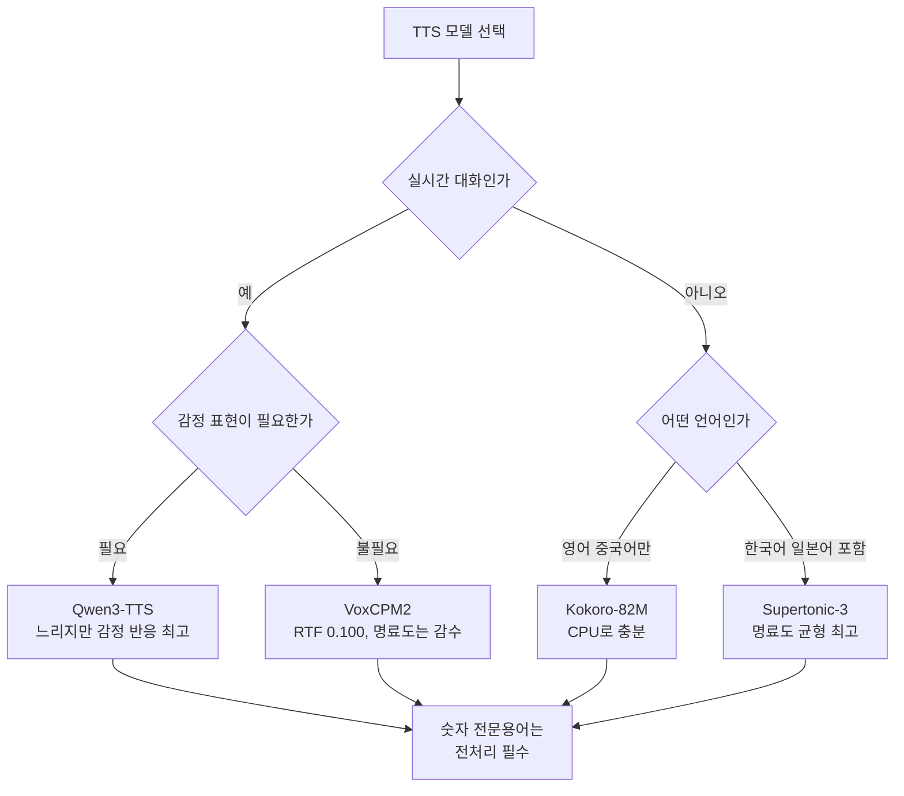

*네 개의 음성합성 모델을 같은 조건에서 재봤습니다*

음성 안내나 오디오북, 대화형 에이전트에 붙일 TTS를 고르실 때 가장 먼저 보시는 것이 보통 모델
카드의 자연성 점수입니다. 그런데 그 점수만으로는 서빙 단계에서 겪을 문제가 잘 드러나지 않습니다.
저희가 네 개 모델을 한국어와 영어, 중국어, 일본어에서 같은 하네스로 재봤더니, **가장 빠른 모델이
명료도에서는 가장 낮았습니다.** 12배라는 속도 차이가 공짜가 아니었던 셈입니다.

이 글은 그 측정 결과와 거기서 나온 언어별 선택 기준을 정리한 것입니다. 숫자만 보시는 것보다
직접 들어보시는 편이 빠르기 때문에 음성 샘플을 함께 붙였습니다.

## 먼저 들어보시죠

같은 한국어 문장을 세 모델이 읽습니다. 문장도 조건도 하네스도 같습니다.

> 오늘 회의는 오후에 삼층 회의실에서 시작합니다.

<strong>Qwen3-TTS</strong> 
<audio controls preload="none" src="/assets/audio/posts/tts-comparison-showcase/a-ko-qwen3-tts-1.7b.mp3"></audio>

<strong>VoxCPM2</strong> 
<audio controls preload="none" src="/assets/audio/posts/tts-comparison-showcase/a-ko-voxcpm2.mp3"></audio>

<strong>Supertonic-3</strong> 
<audio controls preload="none" src="/assets/audio/posts/tts-comparison-showcase/a-ko-supertonic-3.mp3"></audio>

세 음성의 인상이 서로 달랐다면 그 차이가 숫자로는 어떻게 나오는지 이어서 보시겠습니다.

## 무엇을 어떻게 쟀나

측정은 다섯 축으로 나눴습니다. 얼마나 빠른가(RTF), 오디오 1초를 만드는 데 전력을 얼마나 쓰는가,
합성한 음성을 다시 받아쓰면 원문과 얼마나 일치하는가, 사람이 듣기에 얼마나 자연스러운가,
그리고 감정을 지시했을 때 실제로 소리가 달라지는가입니다.

본문은 여섯 범주로 나눠 준비했습니다. 평문과 의문문, 복합문 같은 일반적인 문장에 더해 숫자와
외래어, 전문용어를 일부러 섞었습니다. 실제 서비스에서 깨지는 지점이 대개 그쪽이기 때문입니다.

자연성은 TTSDS2로 쟀습니다. 합성 음성 집합과 실제 사람 음성 집합의 분포를 비교하는 방식이라
발화 하나하나를 채점하는 MOS 예측기보다 언어를 덜 탑니다. 레퍼런스로는 구글 FLEURS의 검증
셋에서 언어당 120발화를 썼습니다.

### 자연성 점수를 하위 축으로 쪼개 보는 이유

TTSDS2는 종합 점수 하나만 주지 않고 네 개 하위 축을 함께 냅니다. 이 구분이 이번 측정에서
결정적이었습니다.

**화자(SPEAKER)** 축은 합성 음성의 음색이 사람 음성 분포에 얼마나 가까운지를 봅니다. 목소리
자체가 사람 같은가를 묻는 축입니다. **운율(PROSODY)** 축은 억양과 리듬, 강세의 분포를 봅니다.
문장을 읽는 방식이 자연스러운가를 묻습니다. **명료도(INTELLIGIBILITY)** 축은 음소가 또렷하게
구분되는지를 봅니다. 발음이 뭉개지지 않는가를 묻는 축입니다. 마지막 **일반(GENERIC)** 축은
음향 신호 자체의 통계적 특성을 봅니다.

서비스 성격에 따라 중요한 축이 다릅니다. 오디오북이나 내레이션이면 화자와 운율이 중요하고,
안내 음성이나 알림처럼 정보 전달이 목적이면 명료도가 우선입니다. 종합 점수 하나로 모델을
고르면 이 구분이 사라집니다.

## 속도와 명료도는 함께 오지 않습니다

이번 측정에서 가장 분명하게 드러난 것이 이 부분입니다.

*왼쪽은 언어별 자연성, 오른쪽은 속도와 명료도의 관계입니다*

| 모델 | 하드웨어 | 언어 | RTF | 자연성(영어) | 명료도(한국어) |
|---|---|---|---|---|---|
| VoxCPM2 | B200 | 4개 | 0.100 | 76.45 | 48.63 |
| Kokoro-82M | CPU 32코어 | 2개 | 0.640 | 73.87 | 해당없음 |
| Qwen3-TTS | B200 | 4개 | 1.196 | 75.76 | 61.46 |
| Supertonic-3 | CPU 32코어 | 3개 | 2.498 | 70.09 | 63.84 |

RTF는 낮을수록 빠릅니다. 1.0이면 1초짜리 음성을 만드는 데 1초가 걸린다는 뜻이라 실시간
대화형 서비스라면 그 아래여야 합니다. VoxCPM2는 0.100으로 B200 한 장에서 열 스트림을
감당하는 반면 Qwen3-TTS는 1.196이라 한 스트림도 실시간을 못 따라갑니다.

그런데 자연성 종합 점수만 보면 두 모델이 비슷합니다. 영어에서 VoxCPM2가 76.45, Qwen3-TTS가
75.76입니다. 여기서 멈추면 "빠른데 품질도 같다"는 결론이 나옵니다.

**하위 점수를 열어보면 이야기가 달라집니다.** TTSDS2는 종합 점수를 화자 유사도와 운율,
명료도 같은 축으로 쪼개는데, 명료도 축에서 VoxCPM2가 크게 밀립니다. 한국어에서 48.63,
일본어에서 44.48입니다. 같은 언어에서 Qwen3-TTS는 61.46과 51.57이니 차이가 작지 않습니다.

VoxCPM2는 목소리 자체는 그럴듯하게 만드는데 발음의 또렷함에서 손해를 보고 있습니다. 종합
점수가 비슷한 이유는 화자와 운율 축에서 벌어 놓기 때문입니다.

## ASR 게이트만 보면 이 차이를 못 잡습니다

저희도 처음에는 못 봤습니다. 합성한 음성을 Whisper로 받아쓰고 원문과 비교하는 게이트를
돌렸는데, 네 모델 모두 한국어와 영어에서 오류율 중앙값이 0이었습니다. 중앙값만 보면 전부
완벽합니다.

문제는 오류가 고르게 퍼져 있지 않다는 점입니다. 상위 10퍼센트 구간을 보면 일본어에서
Qwen3-TTS가 0.413, VoxCPM2가 0.438까지 올라갑니다. 범주별로 쪼개면 원인이 분명해집니다.
평문과 의문문, 복합문은 거의 완벽한데 **숫자와 전문용어에서만** 무너집니다.

실제로 틀린 발화입니다. 원문과 들리는 소리를 비교해 보시면 어디서 깨지는지 바로 잡히실 겁니다.

> 자세한 내용은 docs.thakicloud.net 문서를 참고해 주세요.

<strong>Qwen3-TTS (한국어, 전문용어)</strong> 
<audio controls preload="none" src="/assets/audio/posts/tts-comparison-showcase/b-ko-qwen3-tts-1.7b.mp3"></audio>

기사를 읽어주는 용도라면 무해합니다. 다만 금액이나 일시, 제품 코드를 읽어야 하는 서비스라면
바로 이 두 범주가 사고 지점입니다. 모델을 바꾸는 것보다 숫자를 미리 한글로 풀어 넣는 전처리를
붙이시는 편이 확실합니다.

## 감정 지시는 스위치가 아니라 손잡이입니다

같은 문장을 여섯 감정으로 합성해 조건마다 소리가 얼마나 달라지는지 쟀습니다. 아래는 감정
표현력이 가장 높았던 모델과 감정 조절 기능 자체가 없는 모델입니다.

> 그 사람이 방금 문을 열고 들어왔어요.

<strong>Qwen3-TTS · 중립</strong> 
<audio controls preload="none" src="/assets/audio/posts/tts-comparison-showcase/c-ko-qwen3-tts-1.7b-neutral.mp3"></audio>

<strong>Qwen3-TTS · 기쁨</strong> 
<audio controls preload="none" src="/assets/audio/posts/tts-comparison-showcase/c-ko-qwen3-tts-1.7b-happy.mp3"></audio>

<strong>Qwen3-TTS · 분노</strong> 
<audio controls preload="none" src="/assets/audio/posts/tts-comparison-showcase/c-ko-qwen3-tts-1.7b-angry.mp3"></audio>

Kokoro-82M 쪽은 여섯 조건이 사실상 같은 소리로 나옵니다. 이 모델에는 감정 조절 기능이 아예
없어서 여섯 번 모두 같은 입력이기 때문입니다. 그래서 이 모델이 **지표의 바닥** 역할을 합니다.
프로소디 분산을 재는 지표에서 0.024, 감정 분류기가 요청한 감정을 맞히는 비율에서 0.167이
나오는데, 뒤 숫자는 여섯 감정을 균등하게 찍었을 때의 우연 확률과 정확히 같습니다.

바닥을 알고 나면 나머지 숫자가 다르게 읽힙니다. Qwen3-TTS는 프로소디 분산이 바닥의 17배,
감정 분류 정확도가 우연의 2.4배입니다. 반응이 분명히 있습니다.

동시에 절대 수준은 낮게 보셔야 합니다. 가장 잘한 모델조차 요청한 감정이 분류기까지 전달되는
비율이 절반을 넘지 못합니다. 감정 지시는 켜면 그 감정이 되는 스위치가 아니라 그쪽으로 조금
기울이는 손잡이에 가깝습니다. 콜센터 안내처럼 톤이 중요한 서비스라면 이 점을 감안해 기대치를
잡으시는 편이 좋습니다.

감정 축은 두 가지 다른 질문을 나눠서 쟀습니다. 하나는 조건을 바꿨을 때 소리가 실제로
달라지는가이고, 다른 하나는 그 소리가 요청한 감정으로 들리는가입니다. 앞의 것은 프로소디 특징의
조건 간 분산으로, 뒤의 것은 감정 분류 모델로 쟀습니다.

두 지표가 같은 순위를 냈다는 점이 중요합니다. 서로 다른 방식으로 재는데 결론이 일치하면 그
결론을 조금 더 믿을 수 있습니다. 반대로 어긋났다면 둘 중 하나가 무언가를 잘못 재고 있다는
신호였을 겁니다.

## 언어별로는 이렇게 고르시면 됩니다

**한국어**는 실시간 여부로 갈립니다. 대화형이면 VoxCPM2의 RTF 0.100이 매력적이지만 명료도가
48.63으로 가장 낮으니 숫자 전처리를 반드시 붙이셔야 합니다. 미리 만들어 두는 안내 음성이라면
Supertonic-3이 명료도 63.84로 가장 안정적입니다. Kokoro-82M은 한국어를 지원하지 않습니다.

**영어**는 네 모델이 자연성 70에서 76 사이로 좁게 몰려 있어 품질로는 잘 안 갈립니다. 그렇다면
속도와 전력이 기준이 되는데, 이 축에서는 GPU면 VoxCPM2, CPU면 Kokoro-82M이 앞섭니다. 특히
Kokoro는 CPU 32코어에서 RTF 0.640으로 실시간보다 빠르니 **GPU를 아예 쓰지 않는 선택지**입니다.
영어와 중국어만 필요한 서비스라면 진지하게 검토할 만합니다.

**중국어**는 Qwen3-TTS가 안전합니다. 명료도 56.89로 VoxCPM2의 50.0보다 앞서고, 받아쓰기
상위 10퍼센트 오류도 0.289로 VoxCPM2의 0.435보다 꼬리가 짧습니다.

**일본어**는 어느 모델을 쓰시든 검수를 예산에 넣으시는 편이 안전합니다. 자연성 종합에서
Supertonic-3이 68.08로 가장 높고 명료도도 62.99로 가장 균형이 좋은데, 그마저도 다른 언어보다는
낮습니다. GPU 모델 둘은 명료도가 51.57과 44.48까지 떨어집니다.

### 레퍼런스 코퍼스를 무엇으로 잡느냐가 결과를 바꿉니다

TTSDS2는 합성 음성 집합과 실제 사람 음성 집합의 거리를 재는 방식이라 무엇을 사람 음성으로
놓느냐가 점수를 좌우합니다. 저희는 구글 FLEURS의 검증 셋을 썼습니다. 102개 언어를 같은 문장
집합으로 녹음한 데이터라 언어 간 조건이 비교적 고르고, CC BY 4.0이라 재현하실 때 걸림돌이
없습니다.

다만 FLEURS는 낭독체입니다. 문장을 또박또박 읽는 음성이라 대화체 특유의 머뭇거림이나 억양
변화가 적습니다. 그래서 이번 점수는 **낭독에 가까운 음성을 얼마나 잘 만드는가**로 읽으셔야
정확합니다. 대화형 에이전트가 목표라면 같은 하네스에 대화체 코퍼스를 물려 다시 재보시는 편이
낫습니다. 저희 하네스는 레퍼런스 디렉터리만 바꾸면 되도록 만들어 두었습니다.

레퍼런스를 언어당 120발화로 잡은 것도 선택입니다. 분포 비교라 표본이 너무 적으면 값이 흔들리고,
너무 많으면 계산 시간이 길어집니다. 120발화에서 합성 30발화와 비교했을 때 한 모델당 네 언어를
도는 데 한 시간 남짓 걸렸습니다.

### 언어별 하위 점수를 조금 더 자세히

한국어에서 화자 축을 보면 VoxCPM2가 71.79로 가장 높습니다. 목소리 자체는 가장 사람 같다는
뜻입니다. 그런데 같은 언어 명료도가 48.63으로 가장 낮습니다. 좋은 목소리로 뭉개서 읽는 셈이라
듣기에는 매끄러운데 정보 전달에는 불리한 조합입니다.

Qwen3-TTS는 반대 방향입니다. 한국어 화자 축이 64.43으로 VoxCPM2보다 낮지만 명료도가 61.46으로
앞섭니다. 목소리의 매력보다 또렷함을 택한 결과로 읽힙니다.

Supertonic-3은 세 언어에서 명료도가 62.99에서 70.24 사이로 가장 고르게 나왔습니다. 어느
언어에서도 크게 무너지지 않는다는 점이 이 모델의 장점인데, 대신 속도가 RTF 2.498로 가장
느립니다. 미리 만들어 두는 콘텐츠라면 이 조합이 유리합니다.

## 서빙 단계에서 고려하실 것

모델을 정하신 뒤에도 원가와 품질을 좌우하는 결정이 몇 개 더 남습니다.

**숫자와 단위는 전처리로 푸세요.** 이번 측정에서 오류가 몰린 두 범주가 숫자와 전문용어였습니다.
네 모델 모두 같은 경향을 보였으니 특정 모델의 결함이 아니라 이 세대 TTS의 공통 성질에 가깝습니다.
금액과 날짜, 전화번호, 제품 코드를 한글 표기로 바꿔 넣는 얇은 전처리 층이 모델 교체보다 확실하고
비용도 훨씬 쌉니다. 도메인 용어 사전을 함께 두시면 전문용어 구간도 같이 잡힙니다.

**동시 처리 설계가 원가를 정합니다.** 앞서 유휴 전력이 86.7퍼센트라고 말씀드렸는데, 이 숫자는
배치를 못 채웠을 때의 이야기입니다. 요청이 드문드문 들어오는 서비스라면 GPU 상주 엔드포인트보다
요청이 있을 때만 뜨는 구성이 유리합니다. 반대로 꾸준히 트래픽이 있다면 배치를 키워 유휴분을
희석하는 쪽이 맞습니다. 같은 모델이라도 이 설계에 따라 발화당 원가가 몇 배로 갈립니다.

**언어별로 다른 모델을 쓰는 것도 선택지입니다.** 이번 결과에서 모든 언어를 한 모델로 덮는 것이
최선인 경우는 없었습니다. 영어는 CPU 모델로 충분하고, 일본어는 Supertonic-3이 앞서고, 중국어는
Qwen3-TTS가 안전했습니다. 라우팅 층을 얇게 하나 두면 언어마다 가장 잘하는 모델로 보낼 수 있고,
CPU로 갈 수 있는 트래픽을 GPU에서 빼내는 효과도 함께 얻습니다.

**검수 비용을 미리 잡으세요.** 상위 10퍼센트 구간에서 오류가 크게 튀는 것이 이번 측정의 일관된
패턴이었습니다. 중앙값이 0이라고 해서 전량이 안전하다는 뜻은 아닙니다. 특히 일본어는 어느
모델에서도 꼬리가 길었으니, 대량 생성이라면 표본 검수 절차를 파이프라인에 포함하시는 편이
나중에 싸게 먹힙니다.

## 이 숫자들의 한계

전부 같은 하네스로 쟀고 측정 원장을 남겼습니다. 다만 정직하게 밝힐 한계가 셋 있습니다.

먼저, 자연성 레퍼런스로 쓴 FLEURS는 낭독체 음성입니다. 대화체나 방송체가 목표인 서비스라면
이 비교가 그대로 옮겨가지 않습니다.

다음으로, CPU 두 모델의 전력 수치는 신뢰하지 마시기 바랍니다. 같은 설정을 세 번 반복하니 순증분
전력이 178퍼센트 흔들렸습니다. 공유 노드의 유휴 기준선 때문인데, 노드가 조용할 때 기준선을
잡으면 합성 도중 도착한 이웃 작업의 전력까지 우리 몫으로 계산됩니다. 같은 실행의 RTF는
7.9퍼센트만 움직였으니 속도 비교는 그대로 유효합니다.

마지막으로, 로스터에 올린 열두 모델 중 넷만 완주했습니다. 나머지 중 상당수는 기본 화자가 없어
레퍼런스 음성을 요구하는 복제형 모델이었습니다. 레퍼런스를 주는 순간 재는 대상이 음성합성
품질에서 복제 충실도로 바뀌기 때문에, 같은 표에 섞지 않고 다음 편에서 따로 다루겠습니다.

## ThakiCloud 관점에서

저희가 이 측정을 한 이유는 Metis 추론 플랫폼에 음성 엔드포인트를 얹을 때 어떤 모델을 기본으로
둘지 정해야 했기 때문입니다. 그 과정에서 얻은 실무적인 결론이 둘 있습니다.

하나는 **종합 점수 하나로 모델을 고르면 안 된다**는 것입니다. 이번 경우 종합 점수가 거의 같은
두 모델이 명료도에서는 13포인트 차이가 났고, 그 차이가 실제로 문제가 되는 지점은 금액과 코드를
읽는 구간이었습니다. 서비스 성격에 맞는 하위 축을 골라서 보셔야 합니다.

다른 하나는 **유휴 전력이 원가의 대부분**이라는 것입니다. Qwen3-TTS가 소비한 전력의 86.7퍼센트가
합성과 무관한 유휴분이었습니다. GPU를 통째로 임대하는 서빙에서는 이 유휴분도 그대로 비용이라
배치를 못 채우는 엔드포인트는 한 스트림을 만들려고 카드 하나를 태우는 셈입니다. 모델 선택만큼
동시 처리 설계가 원가를 좌우합니다.

측정에 쓴 문장 셋과 하네스, 원장은 내부 저장소에 남겨 두었고 같은 조건으로 재현할 수 있게
정리했습니다. 합성 음성은 후처리나 선별 없이 원장이 가리키는 파일을 그대로 변환한 것입니다.
