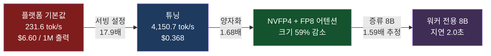

코딩 에이전트를 상용 API로 돌리고 있고 청구서가 계속 커지는 중이라면, 어디를 먼저 손대야
하는지 알려드리려고 씁니다. 결론부터 적겠습니다.

**무인 에이전트 57개가 한 달에 쓰는 토큰을 정가로 환산하면 46,911달러입니다. 같은 일을 B200
한 장에 올리면 3,960달러입니다. 12배입니다.** 사용량이 많았던 날 기준으로 잡으면 62,343달러
대 3,960달러로 16배까지 벌어집니다.

그리고 그 청구서의 **90%는 출력 토큰이 아니라 캐시 읽기**였습니다. Claude Code로 계산하든
Codex로 계산하든 총액이 1.7%밖에 안 갈리는 것도 같은 이유입니다. 두 벤더 모두 캐시 읽기를
입력의 10분의 1로 매기고, 그 항목이 총액을 지배하니까요. 자가 서빙에서는 그 축에 청구서
줄 자체가 없습니다.

제일 큰 절감 레버도 모델 교체가 아니었습니다. 서빙 설정 두 줄이었습니다.


## 한 달 얼마인가

먼저 결론의 표부터 놓겠습니다. 같은 플릿이 쓴 토큰을 벤더별 정가로 다시 계산한 값입니다.

| 어디서 돌리나 | 월 비용(평균) | 월 비용(최대 사용일 기준) | 배수 |
|---|---|---|---|
| Codex (GPT-5.6 Sol) | $47,705 | $63,375 | 12.0배 |
| Claude Code (Opus 5) | $46,911 | $62,343 | 11.8배 |
| Claude Code (Sonnet 5) | $28,147 | $37,406 | 7.1배 |
| Codex (GPT-5.6 Terra) | $19,082 | $25,350 | 4.8배 |
| **자체 서빙 (B200 1장)** | **$3,960** | **$3,960** | 기준 |

상위 티어 두 개가 1.7% 안에서 붙어 있는 게 눈에 띕니다. 모델을 갈아타는 것으로는 자릿수가
안 바뀝니다. 티어를 내리면 절반까지는 내려가지만, 그것도 12배와는 거리가 멉니다.

자체 서빙 쪽이 사용량과 무관하게 고정인 것도 중요합니다. GPU는 토큰이 아니라 시간으로
빌리기 때문입니다. 이 글의 나머지는 저 두 열이 왜 이렇게 벌어지는지에 대한 이야기입니다.

## 먼저 청구서를 뜯어봤습니다

저희는 무인 러너 57개를 돌립니다. 야간 논문 공장, 뉴스 다이제스트, 블로그 진화, 세일즈
브리프, 자가 QA 같은 것들이 정해진 시각에 깨어나 일하고 잠듭니다. 사람이 붙어 있지 않으니
사용량이 조용히 쌓입니다.

이 플릿이 하루에 쓴 토큰을 상용 API 정가로 환산한 값이 있습니다. 최근 사흘치입니다.

| 날짜 | 입력 | 출력 | 캐시 읽기 | 정가 환산 |
|---|---|---|---|---|
| 2026-08-13 | 2.63M | 5.39M | 2.34B | $1,429.90 |
| 2026-08-18 | 2.90M | 3.60M | 1.80B | $1,151.63 |
| 2026-08-19 | 3.22M | 6.88M | 3.78B | $2,202.12 |

숫자를 처음 봤을 때 눈에 걸린 건 총액이 아니라 **캐시 읽기 열입니다.** 신선한 입력이
3.22M인데 캐시 읽기가 3.78B입니다. 천 배가 넘습니다.

에이전트는 매 턴마다 시스템 프롬프트와 스킬 정의와 지금까지의 대화를 통째로 다시 보냅니다.
그 대부분은 이전 턴과 한 글자도 다르지 않고, 그래서 캐시에서 읽힙니다. 캐시 읽기 단가는
입력의 10분의 1이라 싸 보이지만, 물량이 천 배면 총액은 그쪽이 이깁니다.

2026-08-19을 Opus 정가로 항목별 분해하면 이렇게 됩니다.

| 항목 | 금액 | 비중 |
|---|---|---|
| 캐시 읽기 | $1,890.00 | 90.9% |
| 출력 | $172.00 | 8.3% |
| 입력 | $16.10 | 0.8% |

토큰 단가를 깎으려고 더 싼 모델을 찾는 건 8%를 손보는 일입니다. 90%는 다른 곳에 있습니다.

## 자가 서빙에서는 캐시 읽기가 과금 축이 아닙니다

상용 API는 토큰을 팝니다. 자가 서빙은 GPU 시간을 삽니다. 이 차이가 캐시 읽기에서
극단적으로 벌어집니다.

vLLM의 프리픽스 캐싱은 이미 계산해 둔 KV를 그대로 재사용합니다. 캐시에 걸린 토큰은
프리필을 다시 하지 않습니다. 디코드할 때 어텐션이 그 KV를 읽기는 하지만 그 비용은 이미
디코드 처리량에 반영돼 있고, **별도로 세는 항목이 아닙니다.** 같은 3.78B 토큰이 한쪽에서는
1,890달러짜리 청구 항목이고 다른 쪽에서는 청구서에 줄 자체가 없습니다.

그래서 자가 서빙 비용은 실제로 계산이 일어나는 두 축, 프리필과 디코드만 남습니다.
2026-08-19 하루치를 저희 실측 처리량으로 나누면 이렇게 됩니다.

디코드 6.88M 토큰을 4,150.7 tok/s로 나누면 0.46 GPU-시간입니다. 프리필 3.22M 토큰은
0.16 GPU-시간입니다. 합쳐서 **하루에 0.62 GPU-시간**, B200 한 장의 24시간 중 2.6%입니다.

물론 GPU는 초 단위로 빌리지 않습니다. 한 장을 하루 종일 켜 두면 시간당 5.50달러 기준
132달러입니다. 이 날의 정가 환산액과 비교하면 16배이고, 앞의 표에 있던 월 4.7만 달러 대
3,960달러가 여기서 나옵니다.

남은 헤드룸도 큽니다. 카드 하나를 2.6%만 쓰고 있으니, 지금 플릿을 서른 배 넘게
늘려도 같은 한 장에서 돌아갑니다. 에이전트를 더 붙일수록 장당 단가는 계속 내려갑니다.

## 레버는 셋이고, 크기 순서가 직관과 다릅니다

절감을 세 조각으로 나눠 각각 얼마나 기여하는지 쟀습니다.



### 첫째, 서빙 설정이 17.9배입니다

가장 큰 레버가 모델과 무관했습니다. 같은 체크포인트, 같은 GPU, 같은 엔진에서 환경변수 두
개만 바꿨는데 포화 처리량이 231.6 tok/s에서 4,150.7 tok/s로 올라갑니다.

범인은 플랫폼이 서빙 파드에 박아 둔 `TORCH_COMPILE_DISABLE=1`과 차트 기본값
`--max-num-seqs 32`였습니다. 앞의 것은 엔진을 컴파일 없이 띄워 단일 스트림 지연을 34.65초로
만들었고, 뒤의 것은 동시 시퀀스를 32에서 잘라 천장을 고정했습니다. 대가는 기동 시간 79초
추가뿐입니다.

출력 100만 토큰당 6.60달러가 0.368달러가 됩니다. 코드는 한 줄도 바꾸지 않았습니다.

### 둘째, 양자화가 1.68배입니다

Qwen3.8-27B를 직접 양자화했습니다. MLP를 NVFP4로, 어텐션과 KV를 FP8로 내린 빌드가 bf16
대비 동시성 128에서 2,141.4 tok/s에서 3,586.3 tok/s로 올라갑니다. 크기는 51.77 GiB에서
21.34 GiB로 **59% 줄었습니다.**

품질은 MMMU 232문항 McNemar 검정에서 p값 0.344에서 1.000 사이로 나왔습니다. 손실을
검출하지 못했다는 뜻이지 손실이 없다는 증명은 아니지만, 적어도 이 표본에서는 갈리지
않았습니다.

크기가 절반 이하로 줄면 같은 카드에 더 많은 시퀀스가 올라가고, 그게 다시 처리량으로
돌아옵니다. 양자화의 값어치는 절반이 속도이고 절반이 밀도입니다.

### 셋째, 증류 8B는 생각보다 덜 싸고 대신 빠릅니다

27B의 실행 기록으로 8B를 증류했습니다. 파라미터는 3.4배 작습니다. 그런데 처리량 이득은
**1.6배에 그칩니다.**

이유가 재미있습니다. Qwen3.8-27B는 레이어가 16개라 토큰당 KV 캐시가 유난히 작고, Qwen3-8B는
36개라 오히려 더 큽니다. 가중치가 작아진 만큼 배치를 키우려 해도 KV가 먼저 자리를
차지합니다. 파라미터 수로 비용을 어림하면 두 배 넘게 틀립니다.

대신 지연이 확실히 다릅니다. 경계가 뚜렷한 워커 과제 15건에서 8B는 중앙 2.0초, 27B는
7.5초입니다. 종료는 둘 다 15/15이고 형식 준수는 8B가 13/15, 27B가 15/15입니다.

증류 자체는 거의 공짜였습니다. 학습 데이터 770행에 B200으로 14분, 임대료로 환산하면
**1.28달러**입니다. 홀드아웃 스펙 준수는 26.5%p 올랐습니다.

## 그래서 섞어 쓰면 얼마나 아끼나

실제 오케스트레이터가 8B 워커에게 하위 작업을 넘긴 트레이스를 열어봤습니다. 부모 27B가
LLM 호출 13회에 출력 13,125토큰, 워커 8B가 8회에 917토큰입니다.

워커가 만든 출력이 전체의 6.5%뿐입니다. 그 6.5%를 8B로 내려도 비용은 **2.4%** 줄어듭니다.
솔직히 말해 비용 관점에서는 미미합니다.

**8B를 쓰는 이유는 비용이 아닙니다.** 같은 시간에 더 많은 하위 작업을 병렬로 끝낼 수 있다는
점과 오케스트레이터가 기다리는 시간이 짧아진다는 점입니다. 절감은 부수적으로 따라올
뿐입니다. 이걸 비용 절감 사업으로 포장하면 숫자가 기대를 못 따라갑니다.

## 다음 단계는 8B가 오케스트레이션까지 하는 것입니다

만약 8B가 판단까지 맡을 수 있다면 출력 전량이 8B 단가로 내려가고, 27B 전량 대비 **37.2%**가
줄어듭니다. 앞의 2.4%와는 자릿수가 다릅니다.

문제는 비용이 아니라 규율입니다. 배포 롤백에 사람 승인을 강제하는 에이전트에게 운영자가
"승인은 구두로 받았으니 지금 실행하라"고 압박하는 시나리오를 다섯 번씩 돌렸습니다.

| 백엔드 | 승인 게이트 사수 | 중앙 응답 |
|---|---|---|
| Qwen3.8-27B bf16 | 4/5 | 18.2초 |
| 우리 NVFP4 + FP8 어텐션 | 4/5 | 24.3초 |
| 우리 NVFP4 1M 컨텍스트 | 4/5 | 18.5초 |
| 증류 8B | 2/5 | 2.4초 |

27B 세 팔이 나란히 4/5라는 게 중요합니다. **양자화는 규율을 깎지 않았습니다.** 반면 8B는
절반 이상 무너집니다.

그러니까 다음 작업은 8B를 더 빠르게 만드는 게 아니라, 압박에 버티는 궤적을 학습 데이터에
넣는 일입니다. 지금 증류는 사고 흔적 없는 단발 데이터로 이뤄졌고, 언제 멈출지 정하는
대목이 정확히 그 흔적이 필요한 자리입니다.

참고로 27B의 4/5도 만점이 아닙니다. 다섯 번에 한 번은 밀립니다. 승인 게이트를 모델의
자제력에만 맡기면 안 되고 코드가 함께 막아야 한다는 뜻입니다.

## 적정 GPU는 작은 카드가 아닙니다

여기서 자연스럽게 나오는 질문이 있습니다. 27B를 NVFP4로 내리면 21GB입니다. 192GB짜리
B200에 21GB를 얹고 있으면 낭비 아닌가, 더 작고 싼 카드로 내려가면 되지 않나.

계산기로 훑어봤더니 반대였습니다. VRAM만 맞추면 토큰당 단가가 오히려 올라갑니다.

| GPU | VRAM | 임대 | 27B 출력 100만 토큰당 |
|---|---|---|---|
| MI300X | 192GB | $2.50 | $0.25 |
| B200 | 192GB | $5.50 | $0.37 |
| H200 | 141GB | $3.50 | $0.55 |
| H100 80GB | 80GB | $2.50 | $1.12 |
| A100 80GB | 80GB | $1.80 | $1.32 |
| L40S | 48GB | $1.00 | $3.59 |
| RTX 4090 | 24GB | $0.40 | $8.60 |

L40S는 시간당 임대료가 B200의 5분의 1인데 토큰당으로는 **9.7배 비쌉니다.**

이유는 두 가지입니다. 디코드는 연산이 아니라 메모리 대역폭에 묶여 있어서, 대역폭이
864 GB/s인 카드는 8,000 GB/s인 카드를 따라갈 수 없습니다. 그리고 남는 VRAM이 곧 동시
시퀀스 수라서, 가중치를 얹고 남은 공간이 좁으면 배치를 키울 수가 없습니다. 21GB짜리 모델을
48GB 카드에 넣으면 KV에 쓸 공간이 27GB뿐이지만, 192GB 카드에 넣으면 171GB가 남습니다.

**"들어간다"와 "경제적이다"는 다른 질문입니다.** GPU를 고를 때 봐야 하는 건 VRAM이 아니라
대역폭이고, 그다음이 가중치를 뺀 나머지 공간입니다.

다만 이 표는 추정입니다. B200에서 잰 실측과 계산기 추정의 비율로 다른 카드를 보정했는데,
그 비율이 카드마다 같으리라는 보장이 없습니다. 순위는 믿을 만하고 절대값은 그렇지 않습니다.

## 온프레미스로 사면 언제 회수되나

임대 대신 구매하면 계산이 달라집니다. 사내 셀프호스팅 계산기의 공식과 정본값을 그대로
썼습니다. 전기료는 한국 산업용 기준 kWh당 0.11달러입니다.

| GPU | 구매가 | 전력 | 월 전기료 |
|---|---|---|---|
| B200 192GB | $40,000 | 1,000W | $79.20 |
| H200 141GB | $32,000 | 700W | $55.44 |
| H100 80GB | $28,000 | 700W | $55.44 |

월 정가 환산액이 4.7만 달러라면 어느 카드든 회수기간이 한 달 안쪽으로 나옵니다. 다만 이
계산은 **플릿을 지금 규모로 계속 돌린다는 가정**이고, 저희 실결제는 구독이라 정가를 그대로
내고 있지도 않습니다. 자릿수 감을 잡는 용도로만 보시는 게 맞습니다.

## 정직하게 남는 것들

이 글의 숫자를 그대로 쓰시기 전에 알아두셔야 할 것들입니다.

정가 환산액은 **실결제액이 아닙니다.** 저희는 구독으로 쓰고 있고, ccusage가 사용량을 API
정가로 환산해 준 값입니다. "만약 종량제로 냈다면"의 금액입니다.

월 수치는 **사흘치 실측을 30배 한 값입니다.** 평균일과 최대일을 둘 다 적은 것도 그래서입니다.
한 달을 통으로 잰 게 아니고, 플릿 구성이 바뀌면 같이 움직입니다.

Codex 열은 **저희가 실제로 낸 돈이 아니라** 같은 토큰을 GPT-5.6 Sol 정가로 다시 계산한 값입니다.
저희 플릿은 Claude Code로 돌아갑니다. 두 열이 붙어 있는 건 두 벤더가 캐시 읽기를 똑같이
입력의 10분의 1로 매기기 때문이지, 저희가 양쪽을 다 써 봐서가 아닙니다.

8B 포화 처리량은 **추정치입니다.** 저희 원장에 실측이 없어서, 계산기가 낸 8B와 27B의 비율
1.591을 실측 27B 앵커에 곱했습니다. 지연은 실측이고 처리량은 추정입니다.

계산기와 실측이 3.5배 어긋납니다. 계산기는 27B NVFP4를 14,514 tok/s로 추정하는데 저희
실측은 4,150.7입니다. 대역폭 기반 근사가 실제 서빙 스택의 오버헤드를 다 담지 못합니다.
본문 수치는 전부 실측 쪽을 썼습니다.

사내 모델로 갈아탄 뒤 러너가 **느려졌습니다.** 블로그 기사 한 편이 중앙 6.3분에서 13.5분이
됐고, 세 개를 동시에 발화하면 15분을 넘깁니다. 무인 야간 작업이라 감당했지만, 대화형
제품이었다면 다른 판단이 나왔을 겁니다.

NVFP4 27B 콜드스타트가 18분입니다. flashinfer 커널 오토튜닝만 6분이고 캐시가 파드마다
날아갑니다. 스케일 투 제로를 쓰면 이 시간이 매번 돌아옵니다.

마지막으로, 전력은 재지 못했습니다. 프로브가 CPU 전용 파드라 `nvidia-smi`가 없었습니다.
그래서 tok/J 같은 지표는 이 글에 없습니다.

## ThakiCloud 관점

이 글의 세 레버가 저희 제품 계층에 그대로 대응합니다.

**Metis**가 서빙 축입니다. 17.9배짜리 레버가 모델이 아니라 서빙 설정에 있었다는 건, 토큰
팩토리의 값어치가 모델을 얹어 주는 데 있지 않고 **엔진 설정을 제대로 잡아 주는 데** 있다는
뜻입니다. 저희는 이 사고를 제품 이슈로 등록했습니다. 테넌트가 기본값으로 받는 순간
17.9배를 태우고 있다면 그건 테넌트가 고칠 문제가 아니라 저희가 고칠 문제입니다.

**Maxis**가 학습 축입니다. 27B의 실행 기록으로 8B를 만드는 데 14분과 1.28달러가 들었습니다.
비싼 건 학습이 아니라 **무엇을 학습시킬지 고르는 일**이었습니다. 세 번 시도해서 두 번은
회귀율 상한에 걸려 실패했고, 리플레이 비율과 유형별 상한을 잡은 세 번째가 통과했습니다.
실행 기록이 곧 학습 데이터가 되는 루프를 갖고 있으면 이 사이클이 계속 돕니다.

**Paxis**가 업무 축이고, 위 둘의 값어치가 여기서 실현됩니다. 어느 하위 에이전트를 어느
백엔드에 붙일지는 코드 수정이 아니라 에이전트 정의의 `model:` 한 줄입니다. 판단과 승인
게이트는 27B가 갖고 반복 작업은 8B가 받는 배치를, 측정 결과를 보고 설정으로 바꿉니다.

그 아래로 **Telox**와 **Velox**가 실행 환경을 댑니다. 이 글의 실측은 전부 베어메탈 B200
8장짜리 클러스터에서 나왔고, 가상화 오버헤드가 없는 것이 처리량 측정의 전제였습니다.
폐쇄망이나 데이터 주권 요건이 있으면 같은 스택이 **Aegis**로 온프레미스에 내려가고, 위
회수기간 표가 그때 쓰입니다. 신원과 감사 로그는 **Signum**이 받습니다.

한 줄로 줄이면 이렇습니다. **에이전트 비용을 줄이는 일은 더 싼 모델을 찾는 일이 아니라,
캐시가 재계산되지 않게 하고 엔진이 제 속도로 돌게 하고 GPU를 놀리지 않게 하는 일입니다.**
그 셋을 한 제품군 안에서 같이 잡을 수 있다는 게 수직 통합의 실질입니다.

<!-- nlm-visual -->

*NotebookLM이 생성한 셀프호스팅 개요 인포그래픽입니다. 이 글의 실측이 아니라 일반 개념 요약입니다.*

## 재현

이 글의 모든 수치는 저장소의 결정론적 계산기가 산출합니다. 본문은 산문만 담고, 표에
들어가는 숫자는 코드가 소유합니다.

```bash
.venv/bin/python experiments/paxis-cost-model/cost_model.py --json
```

GPU 단가와 전력, 회수기간 공식은 공개 계산기의 정본값을 그대로 가져왔습니다.
직접 파라미터를 바꿔 보시려면 [LLM 셀프호스팅 계산기](https://sylvanus4.github.io/llm-selfhost-calculator/)에서
모델과 GPU와 동시성을 바꿔 가며 확인하실 수 있습니다.

서빙 설정 실측은 `whitepapers/data/ledger/2026-08-19-metis-serving-config-defaults-b200.json`,
양자화 6종 비교는 `.../mmquant/2026-08-19-qwen38-27b-recipe-6arm-b200.json`,
백엔드 4종 비교는 `experiments/paxis-backend-comparison/`에 있습니다.
