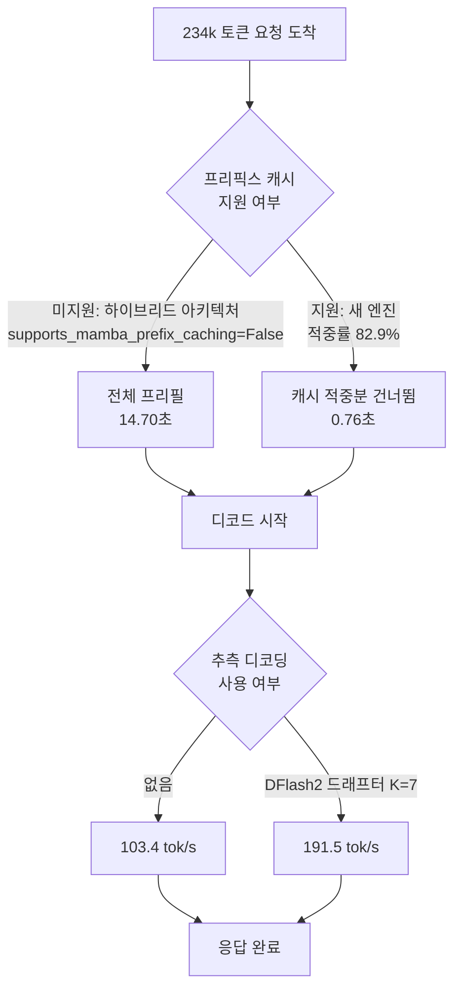

긴 문서를 통째로 넣는 LLM 서비스를 운영하고 계신다면, 지금 같은 프롬프트를 두 번 보내
보십시오. 두 번째가 첫 번째보다 빠르지 않다면 프리픽스 캐시가 돌지 않는 것이고, 그 사실
하나가 요청마다 15초를 태우고 있을 수 있습니다.

저희가 정확히 그 상태였습니다. 234,000토큰짜리 문서를 넣고 질문했을 때 첫 글자가 나오기까지
**15.3초**가 걸렸고, 엔진 버전을 올린 구성에서는 같은 질문이 **1.1초**였습니다. 이 글은 그
차이가 어디서 왔는지, 어떻게 쟀는지, 그리고 여러분의 엔드포인트에서 10분 만에 확인하는
방법을 다룹니다.


*긴 프롬프트의 대부분은 이미 계산돼 있습니다. 그 사실을 엔진이 알고 있느냐가 15초와 1.1초를 가릅니다.*

## 왜 234,000토큰인가

먼저 이 길이를 고른 이유를 적겠습니다. 벤치마크에서 흔히 쓰는 짧은 프롬프트로는 이 문제가
보이지 않기 때문입니다.

저희 무인 에이전트들이 실제로 보내는 요청을 세어 보면 프롬프트가 30만 토큰 근처까지 올라갑니다.
스킬 목록과 시스템 프롬프트만으로 이미 20만 토큰을 넘기고, 거기에 파일 내용과 대화 이력이
얹힙니다. 이 길이에서는 병목이 완전히 다른 곳으로 옮겨갑니다.

짧은 프롬프트에서 느린 응답은 대개 디코드가 느린 것입니다. 토큰을 하나씩 만들어 내는 속도가
전부입니다. 그런데 프롬프트가 20만 토큰을 넘어가면 답변을 시작하기도 전에 그 20만 토큰을 모두
읽는 비용이 붙고, 답변이 짧을수록 그 비용이 전체 시간을 지배합니다. 80토큰 프롬프트로 잰
배율은 이 체제를 전혀 대표하지 못합니다.

그래서 측정 길이를 실제 트래픽에 맞췄습니다. 여러분이 같은 확인을 하실 때도 마찬가지입니다.
서비스가 실제로 받는 프롬프트 길이에서 재지 않으면, 최적화할 곳을 잘못 짚게 됩니다.

## 증상: 세 번을 물어도 15.3초

이상하다고 느낀 지점은 절대적인 느림이 아니었습니다. 234k 토큰이면 프리필에 시간이 걸리는
것이 당연합니다. 이상한 것은 **반복해도 빨라지지 않는다**는 점이었습니다.

같은 프롬프트로 워밍업을 세 번 태우고 다섯 번을 더 쟀습니다.

```
warmup 1: 15.266s
warmup 2: 15.266s
warmup 3: 15.397s
  take 1~5: 15.32s (중앙값, 산포 1.01)
```

프리픽스 캐시가 정상이라면 두 번째 요청은 앞부분을 통째로 건너뛰어야 합니다. 그런데 완벽하게
평평했습니다. 이 평평함이 "캐시가 느리다"가 아니라 "캐시가 없다"는 신호입니다.

비교를 위해 캐시가 도는 엔드포인트에서 같은 것을 찍으면 이렇게 나옵니다.

```
warmup 1: 16.274s
warmup 2:  1.301s
warmup 3:  1.284s
```

첫 요청은 오히려 조금 더 느립니다. 캐시에 적재하는 비용이 붙기 때문입니다. 그리고 **두 번째
요청부터 바로** 12배 빨라집니다. 정상 동작은 이렇게 생겼습니다. 계단이 한 번에 떨어지고 그
뒤로 평평합니다. 앞의 평평함과 이 평평함은 전혀 다른 종류입니다.

## 원인: 플래그를 잊은 게 아니었습니다

엔진에게 직접 물었습니다. vLLM은 `/metrics`로 프리픽스 캐시 조회 수와 적중 수를 노출합니다.

| 지표 | 현행 엔드포인트 | 새 엔드포인트 |
|---|---|---|
| `prefix_cache_queries_total` | **0** | 8,286,381 |
| `prefix_cache_hits_total` | **0** | 6,866,496 |
| 적중률 | 측정 불가 | **82.9%** |

조회 수가 0입니다. 캐시가 느린 게 아니라 코드 경로 자체가 돌지 않았습니다. 기동 로그를 보면
답이 한 줄로 나옵니다. 엔진이 `enable_prefix_caching=False`로 시작했고, 저희는 그런 플래그를
준 적이 없습니다.

껐다면 엔진이 스스로 껐다는 뜻입니다. 이유는 모델 아키텍처에 있었습니다. 저희가 쓰는
Qwen3.8-27B는 순수 트랜스포머가 아니라 어텐션과 Mamba 계열 선형 어텐션이 섞인 **하이브리드**
모델입니다. 기동 로그가 그 사실을 흘리고 있었습니다.

```
Setting attention block size to 784 tokens to ensure that
attention page size is >= mamba page size.
```

어텐션 KV는 블록 단위로 잘라 재사용할 수 있지만, Mamba의 상태는 순차적으로 누적되는 값이라
중간부터 이어붙이기가 간단하지 않습니다. 그래서 vLLM은 이 능력을 **모델 클래스마다 선언**하게
해 두었습니다. 실행 중인 파드 안에서 직접 확인했습니다.

```python
>>> ModelRegistry._try_inspect_model_cls("Qwen3NextForCausalLM")
supports_mamba_prefix_caching = False
is_hybrid = True
```

같은 조회를 새 엔진에서 하면 값이 뒤집힙니다. 즉 이것은 설정 실수가 아니라 **엔진 버전의
기능 차이**입니다. 현행 버전에 `--enable-prefix-caching`을 넣어도 상황은 바뀌지 않습니다.
지원하지 않는 기능을 켜라고 요청하는 것이기 때문입니다.

왜 하이브리드가 어려운지는 두 계층이 상태를 다루는 방식이 다르기 때문입니다. 어텐션은 토큰
하나가 자기 키와 값을 남기고 끝납니다. 앞부분 1,000토큰의 KV는 뒤에 무엇이 오든 그대로이므로,
같은 접두사를 가진 다음 요청이 그 블록을 그냥 가리키면 됩니다. 캐시가 성립하는 이유가 이
독립성입니다.

Mamba 계열은 반대입니다. 토큰을 하나씩 먹으며 고정 크기 상태를 계속 갱신합니다. 1,000번째
토큰 시점의 상태는 앞의 999개를 순서대로 통과한 결과 하나로 압축돼 있습니다. 재사용하려면
KV 블록을 가리키는 것으로 끝나지 않고, 그 중간 상태를 통째로 저장했다가 정확한 지점에서
복원해야 합니다. 저장 단위도 어텐션 블록과 크기가 맞아야 합니다. 앞서 본 기동 로그의
"attention page size가 mamba page size 이상이 되도록 블록을 784토큰으로 맞춘다"는 문장이
바로 그 정렬 작업입니다.

즉 불가능한 일이 아니라 **따로 구현해야 하는 일**입니다. 그래서 vLLM은 이것을 전역 스위치가
아니라 모델별 능력으로 두었고, 구현이 들어온 시점이 아키텍처마다 다릅니다.

이 구분이 중요한 이유가 있습니다. "플래그를 빼먹었다"면 설정 파일 한 줄로 끝나지만,
"엔진이 지원하지 않는다"면 업그레이드 계획과 회귀 테스트가 필요한 일이 됩니다. 두 결론은
대응이 완전히 다릅니다.



## 어떻게 쟀는가

측정 방법을 먼저 적는 이유는, 첫 번째 시도가 완전히 틀린 답을 냈기 때문입니다.

처음에는 스트리밍 응답에서 토큰이 도착한 시각을 찍어 디코드 속도를 계산했습니다. 결과가
**초당 46만 토큰**으로 나왔습니다. 물리적으로 불가능한 값입니다. 확인해 보니 이 엔드포인트는
델타를 하나씩 흘리지 않고 뭉쳐서 보냅니다. 65개 델타가 **두 개의 타임스탬프**에 몰려
도착했습니다. 도착 시각으로 창을 재면 분모가 거의 0이 되니 속도가 폭발합니다.

그래서 방법을 바꿨습니다. 같은 프롬프트를 **64토큰**과 **320토큰**으로 두 번 물어보고, 걸린
시간의 차이를 토큰 수의 차이로 나눕니다.

```
디코드 속도 = (320 - 64) / (t_320 - t_64)
```

이 방식은 프리필 시간이 양변에 똑같이 들어가므로 자동으로 상쇄됩니다. 서버가 응답을 어떻게
쪼개 보내든 상관없습니다. 벽시계 하나만 있으면 됩니다. 남은 절편이 프리필 시간이 되므로
두 값을 한 번에 얻습니다.

실제로 쓴 코드는 이 정도입니다.

```python
def ask(base, model, doc, max_tokens):
    body = json.dumps({
        "model": model,
        "messages": [{"role": "user", "content": doc}],
        "max_tokens": max_tokens,
        "temperature": 0.0,
        "ignore_eos": True,          # 길이를 강제해야 두 점이 비교된다
    }).encode()
    t0 = time.time()
    urllib.request.urlopen(request(base, body), timeout=1200).read()
    return time.time() - t0

t_short = median(ask(base, model, doc, 64)   for _ in range(5))
t_long  = median(ask(base, model, doc, 320)  for _ in range(5))

decode_tps = (320 - 64) / (t_long - t_short)
prefill_s  = t_short - 64 / decode_tps
```

`ignore_eos`가 핵심입니다. 이것이 없으면 모델이 64토큰을 다 쓰기 전에 문장을 끝내 버려서 두
점의 출력 길이가 달라지고, 기울기가 무의미해집니다. 실제로 각 반복의 출력 토큰 수가 전부
동일한지 코드가 확인하고, 하나라도 다르면 경고를 찍게 해 두었습니다.

측정 전에 게이트를 하나 더 걸었습니다. 양쪽 엔드포인트의 `num_requests_running`이 0인지
확인하고, 하나라도 다른 요청을 처리 중이면 측정을 거부합니다. 남의 트래픽 위에서 재면 모델이
아니라 대기열을 재게 됩니다. 실제로 같은 날 다른 엔드포인트에서 초당 12토큰이 나와 고장인 줄
알았는데, 동시 요청 45건이 답이었습니다.

## 숫자

234,000토큰 프롬프트, 워밍업 3회 후 5회 측정, 중앙값, 동시성 1입니다.

| | 현행 (v0.24.0) | 새 엔진 + 드래프터 | 배수 |
|---|---|---|---|
| 프리필 (첫 답까지) | 14.70초 | 0.76초 | **19.3배** |
| 디코드 | 103.4 tok/s | 191.5 tok/s | 1.85배 |
| 64토큰 답변 전체 | 15.32초 | 1.09초 | **14.0배** |
| 320토큰 답변 전체 | 17.80초 | 2.43초 | 7.3배 |

네 측정점 모두 반복 간 산포가 1.00에서 1.10 사이였습니다.


*왼쪽은 답변 길이에 따른 응답 완료 시간, 오른쪽 두 패널은 프리필과 디코드를 나눠 본 값입니다. 굵은 원 두 개만 실측이고 나머지는 그 둘을 잇는 직선입니다.*

여기서 가장 중요한 문장을 적겠습니다. **단일 배수는 존재하지 않습니다.** 답변이 짧을수록
전체 시간에서 프리필이 차지하는 비중이 커지므로 배수가 커집니다.

| 답변 길이 | 현행 | 새 구성 | 배수 |
|---|---|---|---|
| 64토큰 | 15.32초 | 1.09초 | 14.0배 |
| 128토큰 | 15.94초 | 1.43초 | 11.2배 |
| 256토큰 | 17.18초 | 2.10초 | 8.2배 |
| 1,024토큰 | 24.60초 | 6.11초 | 4.0배 |

그래서 저희는 배수 대신 **"15.3초가 1.1초로"** 를 앞에 둡니다. 사용자가 실제로 겪는 것은
비율이 아니라 대기 시간이고, 비율은 답변 길이에 따라 세 배씩 움직이기 때문입니다.

## 드래프터의 몫은 얼마인가

위 표의 두 엔드포인트는 엔진 버전만 다른 것이 아닙니다. 컨텍스트 상한도, 추측 디코딩
드래프터의 유무도 함께 다릅니다. 그래서 저 배수를 "드래프터 효과"로 인용하면 틀립니다.

주장 대신 재기로 했습니다. 새 엔진에 드래프터만 빼고 나머지는 그대로인 세 번째 엔드포인트를
하나 더 띄웠습니다. 가운데 팔이 있으면 두 효과가 갈라집니다.

| 구성 | 프리필 | 디코드 |
|---|---|---|
| 현행 v0.24.0 (캐시 꺼짐) | 14.70초 | 103.4 tok/s |
| 새 엔진, 캐시만 (드래프터 없음) | **0.72초** | 103.9 tok/s |
| 새 엔진 + DFlash2 드래프터 | 0.76초 | **191.5 tok/s** |

두 효과가 깨끗하게 직교합니다. 캐시를 켜면 프리필이 20.4배 줄고 **디코드는 그대로**입니다
(103.4 대 103.9는 측정 노이즈 안입니다). 그 위에 드래프터를 얹으면 디코드가 1.84배가 되고
**프리필은 그대로**입니다. 각자 자기 구간만 건드립니다.

이 가운데 팔이 없었다면 저는 "19.3배는 캐시 몫이고 1.85배는 드래프터 몫"이라고 **추정**해서
썼을 것입니다. 30분과 GPU 한 장이면 추정을 측정으로 바꿀 수 있었고, 실제로 바꿔 보니 추정이
맞았습니다. 맞았다는 사실보다 중요한 것은 이제 그것을 근거로 말할 수 있다는 점입니다.

여기서 쓴 드래프터는 DFlash2이고 한 번에 7토큰을 제안하도록 설정했습니다.

드래프터만 따로 재려면 컨텍스트를 짧게 두고 다른 조건을 맞춰야 합니다. 같은 날 80토큰
프롬프트로 잰 값은 추론 과제에서 **3.80배**, 코드 생성에서 **5.10배**였습니다. 산문 생성은
2.35배에 그쳤습니다.

이 편차도 엔진이 설명해 줍니다. vLLM은 추측 디코딩의 평균 수용 길이를 지표로 냅니다. 산문에서
2.2에서 2.5, 코드에서 5.3에서 5.6이었습니다. 드래프터가 한 번의 검증으로 몇 토큰을
통과시키는지가 그대로 배수가 됩니다. 코드에는 다음 토큰이 뻔한 구간이 길게 이어지고, 자유
서술에는 그런 구간이 적습니다.

대가도 있습니다. 짧은 프롬프트에서는 첫 토큰까지 걸리는 시간이 0.55초에서 0.62초로 오히려
조금 늘었습니다. 드래프터를 태우는 비용이 첫 토큰에 붙기 때문입니다. 긴 컨텍스트에서는 프리필
절감이 압도적이라 이 손해가 묻히지만, 짧은 요청 위주의 서비스라면 계산이 달라집니다.

## 여러분의 엔드포인트에서 확인하는 법

세 줄이면 됩니다.

첫째, 같은 프롬프트를 두 번 보내고 두 번째가 빠른지 봅니다. 안 빠르면 캐시가 안 도는 것입니다.

둘째, `/metrics`에서 조회 수를 확인합니다.

```bash
curl -s "$ENDPOINT/metrics" | grep prefix_cache
```

`prefix_cache_queries_total`이 0이면 기능 자체가 꺼져 있습니다. 조회는 있는데 적중이 낮다면
그건 다른 문제입니다. 프롬프트 앞부분이 요청마다 달라지고 있을 가능성이 큽니다. 타임스탬프나
세션 ID를 시스템 프롬프트 앞쪽에 넣으면 캐시가 매번 빗나갑니다.

셋째, 꺼져 있다면 기동 로그에서 `enable_prefix_caching`을 찾습니다. 여러분이 준 적 없는데
`False`라면 엔진이 스스로 끈 것이고, 그때는 모델 아키텍처와 엔진 버전의 조합을 확인해야
합니다. 하이브리드 계열(Mamba, 선형 어텐션, GDN 등)을 쓰신다면 특히 그렇습니다.

### 적중률이 100%가 아닌 이유

새 엔드포인트의 적중률은 82.9%였습니다. 100%가 아닌 것이 정상입니다. 프리픽스 캐시는 블록
단위로 맞물리므로 프롬프트 끝자락의 부분 블록은 항상 새로 계산해야 하고, 답변마다 달라지는
질문 문장도 캐시 대상이 아닙니다. 234k 중 뒤쪽 몇 백 토큰이 매번 새로 계산되면 산술적으로
그 정도 수치가 나옵니다.

문제가 되는 것은 이 숫자가 **한 자릿수로 떨어지는 경우**입니다. 실무에서 그렇게 만드는 원인은
대개 셋 중 하나입니다.

프롬프트 맨 앞에 시각이나 세션 식별자를 넣는 경우가 첫째입니다. "현재 시각은 …입니다"를 시스템
프롬프트 첫 줄에 두면 모든 요청의 첫 블록이 달라지고, 그 뒤 전부가 캐시에서 빠집니다. 같은
정보가 필요하면 프롬프트 **끝**으로 옮기면 됩니다.

둘째는 도구 정의의 순서가 요청마다 바뀌는 경우입니다. 딕셔너리를 순회해 JSON을 만들면 순서가
보장되지 않는 언어가 있고, 그러면 바이트가 달라집니다. 정렬해서 직렬화하면 해결됩니다.

셋째는 대화 이력을 앞에서부터 잘라내는 경우입니다. 앞을 자르면 접두사가 통째로 바뀌므로 캐시가
전부 무효가 됩니다. 잘라야 한다면 중간을 요약해 접두사를 보존하는 편이 캐시 친화적입니다.

### 초 단위를 비용으로 환산하면

15.3초와 1.1초의 차이는 GPU 점유 시간입니다. B200 한 장을 시간당 3.3달러로 잡고 짧은 답변
요청 1,000건을 처리한다고 하면, 현행 구성은 약 4.25 GPU-시간을 쓰고 새 구성은 약 0.30
GPU-시간을 씁니다. 14달러와 1달러의 차이입니다.

절대 금액보다 중요한 것은 **같은 카드로 받을 수 있는 요청 수**입니다. 요청 하나가 15초를
점유하면 한 장으로 시간당 240건이 상한이고, 1.1초면 3,200건이 됩니다. 긴 문서를 반복 참조하는
워크로드에서는 이 차이가 곧 서비스 가능 여부입니다. 모델을 더 작은 것으로 바꾸거나 카드를 더
사는 선택지를 검토하기 전에 확인할 값이라는 뜻입니다.

## ThakiCloud 제품 적용 시사점

저희 Metis는 추론과 토큰 팩토리를 담당하는 제품이고, 이 실측은 그 계층에서 무엇을 기본값으로
줘야 하는지에 직접 걸립니다.

가장 먼저 고칠 것은 **테넌트가 받는 기본 구성**입니다. 관리형 플랫폼의 가치는 고객이 이런
조합을 몰라도 되게 만드는 데 있는데, 지금 기본값은 하이브리드 모델에 대해 긴 프롬프트마다
15초를 태우고 있습니다. 엔진 버전이 모델 아키텍처의 기능 지원 여부와 얽혀 있다는 사실은
카탈로그 수준에서 관리돼야 할 정보이지, 고객이 로그를 뒤져 발견할 것이 아닙니다.

두 번째는 **엔드포인트가 스스로 무엇을 하고 있는지 말하게 만드는 일**입니다. 이번 사례에서
15.3초를 설명해 준 것은 벤치마크가 아니라 엔진의 `/metrics`였습니다. 프리픽스 캐시 적중률과
추측 디코딩 수용 길이는 콘솔에서 바로 보여야 하는 숫자입니다. 느린 엔드포인트를 보고 모델을
의심하기 전에 서빙 설정을 먼저 보게 만드는 것이 관측성의 역할입니다.

세 번째는 **Paxis 쪽 실행 경제성**입니다. 에이전트가 긴 문서를 반복해 참조하는 워크플로에서
프리필 절감은 그대로 처리 가능한 작업 수로 환산됩니다. 한 요청에 15초를 쓰던 자리에서 1.1초를
쓰면, 같은 GPU 한 장으로 훨씬 많은 자동화를 태울 수 있습니다. 저희가 North Star를 토큰 수가
아니라 완료된 업무 수로 잡는 이유도 여기에 있습니다.

## 업그레이드가 공짜는 아니었습니다

엔진을 올리면 캐시가 켜진다는 결론은 깔끔하지만, 그대로 프로덕션에 밀어 넣기 전에 한 가지를
먼저 확인했습니다. 새 조합이 어디서 깨지는지입니다.

길이 사다리를 태웠습니다. 8,000토큰부터 시작해 64,000, 148,000, 244,000으로 올리며 응답이
정상인지, 그리고 요청이 끝난 뒤 서버 프로세스가 살아 있는지를 매 단계 확인했습니다.
244,689토큰까지는 전부 정상이었고 추측 디코딩의 수용 길이도 1.42에서 1.47 사이로 안정적이었습니다.

300,000토큰에서 깨졌습니다. HTTP 500이 떨어지고 엔진 코어가 CUDA 불법 주소 접근으로 죽었습니다.
파드는 재시작됐지만, 이것이 프로덕션에서 일어났다면 그 순간 그 엔드포인트에 붙어 있던 모든
요청이 함께 사라집니다.

여기서 얻은 운영 규칙은 단순합니다. **컨텍스트 상한은 광고하는 값이 아니라 실제로 살아남는 값을
넣어야 합니다.** 100만 토큰을 받겠다고 선언해 두고 드래프터를 켜면, 245,000과 100만 사이의 요청
하나가 엔드포인트 전체를 멈출 수 있습니다. 그래서 저희는 이 엔드포인트의 상한을 245,760으로
내렸습니다. 사다리가 통과를 확인한 마지막 지점 바로 위입니다.

이 작업은 30분이 걸렸고, 그 30분이 무인 파이프라인 하나를 통째로 날릴 사고를 막았습니다. 새
기능을 켤 때 "되는가"만 확인하고 "어디서 깨지는가"를 확인하지 않으면, 그 경계는 결국 고객이
찾아 줍니다.

## 남은 것

현행 엔드포인트의 캐시가 정확히 어느 조건에서 꺼졌는지는 아직 확정하지 않았습니다. 하이브리드
아키텍처의 능력 선언이 유력하지만, rope 스케일링 설정이나 컨텍스트 상한이 함께 작용했을
가능성을 배제하지 못했습니다. 원인을 단정하지 않고 관측만 적습니다.

그리고 이 글의 숫자는 전부 **동시성 1의 지연**입니다. 포화 상태의 처리량이 아닙니다. 배치가
차오르면 추측 디코딩의 셈법이 달라지고, 프리픽스 캐시도 여러 세션이 서로 다른 문서를 들고
올 때 이야기가 달라집니다. 이번 실험은 품질도 재지 않았습니다. 속도만 쟀습니다.

그래도 결론 하나는 분명합니다. 긴 문서를 다루는 서비스라면, 모델을 바꾸기 전에 캐시가 돌고
있는지부터 확인하는 것이 훨씬 싼 최적화입니다.
