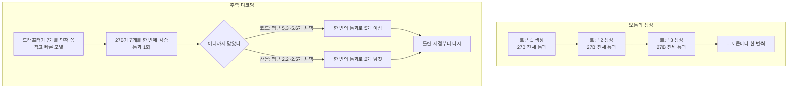

27B급 모델을 자체 GPU에 올려 서비스하고 계시다면, 모델을 바꾸지 않고 속도를 어디까지 올릴 수
있는지 궁금하실 겁니다. 저희 실측으로는 **4.72배**였습니다.

Qwen3.8-27B 원본 가중치에서 시작해 두 가지를 했습니다. 먼저 4비트로 양자화했고, 그다음 추측
디코딩 드래프터를 붙였습니다. 초당 97.1토큰이 136.7토큰이 되었고, 다시 458.5토큰이 됐습니다.
NVIDIA B200 한 장, 같은 프롬프트, 요청은 한 번에 하나씩입니다.



*두 단계를 각각 나란히 녹화했습니다. 두 창이 함께 흐르지만 동시에 돌린 것은 아닙니다.*

*글의 핵심 개념을 형상화했습니다.*

## 한 번에 하나씩만 바꿨습니다

"양자화하고 드래프터도 붙였더니 4.7배"라는 문장은 쓰기는 쉽지만 아무것도 알려주지 않습니다.
둘 중 무엇이 얼마나 기여했는지 모르면, 하나가 잘 안 될 때 어디를 손봐야 하는지도 모릅니다.

그래서 엔드포인트를 세 개 띄우고 계단으로 만들었습니다. 각 단계는 앞 단계에서 **정확히 한
가지만** 다릅니다.

| 단계 | 무엇이 바뀌었나 | 디코드 속도 | 앞 단계 대비 | 원본 대비 |
|---|---|---|---|---|
| ① 원본 | Qwen3.8-27B bf16 | 97.1 tok/s | | 1.00배 |
| ② 양자화 | 가중치를 NVFP4 4비트로 | 136.7 tok/s | **1.41배** | 1.41배 |
| ③ 드래프터 | DFlash2 추측 디코딩 추가 | 458.5 tok/s | **3.35배** | **4.72배** |

중앙값이고 각 셀을 세 번씩 돌렸습니다. 프롬프트는 대화, 추론, 장문, 코드 네 종류입니다.

## 1단계: 4비트 양자화가 1.41배

첫 번째 단계는 가중치를 4비트로 줄이는 것입니다. 엔진도 서빙 설정도 그대로 두고 모델 파일만
바꿨습니다.

왜 빨라지는지는 병목이 어디인지를 보면 명확합니다. 토큰을 하나 생성할 때마다 GPU는 모델
가중치 전체를 메모리에서 읽어야 합니다. 27B 모델을 bf16으로 두면 한 토큰마다 약 54GB를 읽는
셈이고, 4비트로 줄이면 그 절반 이하가 됩니다. 계산이 빨라진 것이 아니라 **읽을 것이 줄어든**
것입니다.

읽을 것이 절반 이하가 됐는데 왜 1.41배에 그치느냐는 질문이 자연스럽습니다. 가중치만 줄어들고
KV 캐시나 활성값은 그대로이며, 4비트 값을 실제 계산에 쓰려면 되돌리는 비용도 붙기 때문입니다.
그래도 모델을 바꾸지 않고 얻는 1.41배는 싼 편입니다.

같은 실험에서 첫 토큰까지 걸리는 시간도 0.74초에서 0.56초로 줄었습니다.

### 왜 NVFP4이고, 왜 B200인가

4비트라고 다 같지 않습니다. 저희가 쓴 형식은 NVFP4이고, 이 형식이 의미를 갖는 이유는 B200
세대의 텐서 코어가 **4비트 부동소수점을 하드웨어에서 직접 계산**하기 때문입니다.

이전 세대에서 흔히 쓰던 4비트 방식들은 저장만 4비트로 하고 계산 직전에 16비트로 되돌립니다.
메모리는 아끼지만 연산은 원래대로입니다. 네이티브 지원이 있으면 되돌리는 단계 자체가 줄어듭니다.
같은 4비트 모델이라도 어느 카드에 올리느냐에 따라 이득의 크기가 달라진다는 뜻이고, 하드웨어와
양자화 형식을 따로 고를 수 없는 이유이기도 합니다.

저희가 이 빌드를 직접 만들어 카탈로그에 올려 두는 것도 그래서입니다. 어떤 형식이 어떤 카드에서
값을 하는지는 모델을 쓰는 쪽이 매번 조사할 일이 아닙니다.

## 2단계: 드래프터가 3.35배

두 번째 단계는 성격이 다릅니다. 가중치는 손대지 않고 **생성하는 방식**을 바꿉니다.

보통 언어 모델은 토큰을 하나 만들 때마다 모델 전체를 한 번씩 통과합니다. 추측 디코딩은 여기에
작고 빠른 보조 모델을 붙입니다. 보조 모델이 다음에 올 토큰 일곱 개를 먼저 써 보고, 큰 모델이
그 일곱 개를 **한 번의 통과로 한꺼번에 검증**합니다. 맞은 데까지는 그대로 채택하고 처음
틀린 지점부터 다시 시작합니다.

핵심은 검증이 생성보다 싸다는 점입니다. 일곱 개를 검증하는 비용이 한 개를 생성하는 비용과
크게 다르지 않습니다. 그래서 보조 모델이 잘 맞히는 구간에서는 한 번의 통과로 여러 토큰이
나옵니다. 저희가 쓴 보조 모델은 DFlash2이고 한 번에 일곱 개를 제안하도록 설정했습니다.

여기서 이 방식의 성격이 드러납니다. **얼마나 빨라지는지가 작업 종류에 따라 크게 갈립니다.**

그림으로 보면 이렇습니다. 왼쪽이 보통의 생성이고 오른쪽이 추측 디코딩입니다.

검증이 생성보다 싸다는 것이 이 그림의 전부입니다. 오른쪽에서 한 번의 통과가 왼쪽 한 번의
통과와 비용이 비슷한데, 왼쪽은 토큰을 하나 얻고 오른쪽은 여러 개를 얻습니다. 평균 몇 개를
얻느냐가 곧 배수이고, 그 값이 수용 길이입니다.

드래프터로 쓴 DFlash2는 별도로 준비된 작은 모델입니다. 큰 모델과 같은 토크나이저를 쓰고, 큰
모델이 무엇을 말할지 흉내 내도록 만들어졌습니다. 아무 작은 모델이나 붙인다고 되는 것이
아니라는 뜻입니다. 흉내를 잘 낼수록 수용 길이가 올라가고, 못 내면 검증 비용만 내고 버리게
됩니다. 이 짝을 맞추는 일이 추측 디코딩 도입의 실질적인 난이도입니다.

### K를 몇으로 둘 것인가

한 번에 몇 개를 제안할지가 노브입니다. 저희는 7로 뒀습니다.

크게 잡으면 잘 맞는 구간에서 한 번에 더 많이 통과합니다. 대신 빗나가면 버리는 양도 늘고, 검증
자체의 비용도 조금씩 붙습니다. 작게 잡으면 안전하지만 얻을 수 있는 최대치가 낮아집니다.
수용 길이가 코드에서 5.3에서 5.6이 나온다는 것은 7 중 다섯 개 남짓이 통과하고 있다는 뜻이라,
이 워크로드에서는 7이 지나치게 큰 값은 아니었습니다.

주의할 점은 이 최적값이 **워크로드마다 다르다**는 것입니다. 산문 위주라면 수용 길이가 2.2
근처에 머무니 7까지 제안하는 것이 낭비일 수 있습니다. 실제로 저희가 앞선 실험에서 n-gram
기반의 다른 추측 방식을 시험했을 때는, 같은 노브를 키우고 줄이는 것만으로 배수가 뒤집히는
구간을 봤습니다. 켤지 말지를 정하기 전에 자기 트래픽에서 수용 길이부터 재는 편이 빠릅니다.

## 코드에서 7.13배, 대화에서 3.4배

원본 대비 배수를 프롬프트별로 나눠 보면 이렇습니다.

| 프롬프트 | ① 원본 | ② 양자화 | ③ 드래프터 | 원본 대비 |
|---|---|---|---|---|
| 코드 생성 | 95.2 | 133.0 | 678.4 | **7.13배** |
| 추론 (산술 풀이) | 95.6 | 133.0 | 505.2 | **5.28배** |
| 대화 | 99.9 | 144.5 | 334.7 | 3.35배 |
| 장문 산문 | 102.0 | 148.0 | 346.0 | 3.39배 |

*왼쪽은 작업 종류별 세 단계, 오른쪽은 네 프롬프트 전체 평균의 계단입니다. 파란 두 막대의 높이
차이는 어디서나 비슷하지만 주황 막대는 작업마다 크게 갈립니다.*

이 그림에서 눈에 띄는 것은 파란 막대 둘의 관계가 네 작업 모두에서 거의 같다는 점입니다.
양자화 단계는 어떤 작업이든 1.39배에서 1.45배로 거의 일정합니다. 메모리를 덜 읽는 이득은
내용과 무관하기 때문입니다.

갈라지는 것은 드래프터 단계입니다. 이유도 엔진이 직접 알려줍니다. vLLM은 추측 디코딩의 **평균
수용 길이**를 지표로 냅니다. 한 번의 검증에서 몇 개가 통과했는지입니다. 산문에서 2.2에서
2.5였고 코드에서 5.3에서 5.6이었습니다. 관측한 배수와 그대로 맞습니다.

직관적으로도 맞는 이야기입니다. 코드에는 다음 토큰이 거의 정해진 구간이 깁니다. 함수 시그니처를
쓰고 나면 이어지는 들여쓰기와 괄호와 반복되는 변수명은 작은 모델도 잘 맞힙니다. 반면 자유
서술은 다음 단어의 선택지가 넓습니다. 보조 모델이 자주 빗나가고, 빗나가면 그 뒤는 버려집니다.

그래서 이 최적화의 가치는 **여러분의 트래픽이 무엇을 생성하느냐**에 달려 있습니다. 코딩
어시스턴트나 구조화된 출력을 만드는 서비스라면 위 표의 위쪽을 보시면 되고, 상담이나 글쓰기
쪽이면 아래쪽입니다.

## 두 최적화는 서로를 방해하지 않습니다

두 기법을 함께 쓸 때 흔한 걱정이 있습니다. 양자화로 이미 메모리 읽기를 줄여 놨는데, 그 위에
추측 디코딩을 얹으면 파고들 여지가 남아 있느냐는 것입니다. 둘 다 결국 같은 병목을 공략하는
기법이니 겹치는 것 아니냐는 의심입니다.

실제로 이 의심은 근거가 있습니다. 저희도 앞선 실험에서 정확히 그 현상을 봤습니다. n-gram
기반의 단순한 추측 방식은 양자화된 모델 위에서 오히려 **느려졌습니다.** 기준선이 이미 빨라져
있으니 추측이 실패했을 때 잃는 것이 상대적으로 커진 것입니다.

이번 결과가 그와 다른 이유는 추측의 품질에 있습니다. n-gram 방식은 지금까지 나온 텍스트에서
반복 패턴을 찾아 다음을 짐작합니다. 복사와 편집이 많은 작업에서는 잘 듣지만 자유 서술에서는
자주 빗나갑니다. 학습된 드래프터는 큰 모델의 다음 선택을 흉내 내도록 훈련돼 있어서, 반복
패턴이 없는 곳에서도 맞힙니다. 같은 아이디어라도 구현에 따라 결과가 반대로 나온다는 뜻입니다.

계단의 각 단계가 앞 단계 대비 1.41배와 3.35배로 곱해져 4.72배가 나왔다는 사실 자체가 두
기법이 서로를 잡아먹지 않았다는 증거입니다.

## 어떻게 쟀는가

측정 방식을 적어두겠습니다. 이런 배수는 재는 방법에 따라 쉽게 흔들리기 때문입니다.

가장 중요한 결정은 **두 팔을 동시에 돌리지 않은 것**입니다. 영상에서 두 창이 나란히 흐르지만,
실제로는 각각 따로 녹화한 뒤 실제 속도로 겹쳐 재생한 것입니다. 두 요청이 같은 GPU와 같은
큐를 나눠 쓰면 모델이 아니라 경합을 재게 됩니다. 게다가 그 왜곡은 대칭이 아닙니다. 느린 쪽이
자원을 더 오래 붙잡기 때문에 빠른 쪽이 더 손해를 봅니다.

그래서 셀 하나씩 순차로 돌리고, 토큰이 도착한 시각을 전부 기록해 두었다가 나중에 함께
틀었습니다. 녹화를 프레임 단위로 다시 그려 영상을 만들기 때문에, 노트북이 바쁘든 한가하든 같은
파일이 나옵니다.

인용할 숫자를 고르는 규칙도 하나 두었습니다. **양쪽 팔이 정확히 같은 토큰 수를 낸 셀만**
씁니다. 답변 길이가 다르면 배수가 길이에 흔들립니다. 위 표의 코드와 추론 행은 양쪽이 정확히
1,500토큰 상한에 도달한 셀이라 like-for-like입니다.

측정 전에는 각 엔드포인트가 다른 요청을 처리하고 있지 않은지 확인합니다. 실제로 같은 날 다른
엔드포인트에서 초당 12토큰이 나와 고장인 줄 알았는데, 동시 요청 45건이 답이었습니다. 그
엔드포인트는 이 비교에서 뺐습니다.

재현성 근거도 하나 남습니다. 드래프터 팔은 두 개의 서로 다른 녹화에 등장하는데, 458.5와
457.0으로 나왔습니다. 0.3퍼센트 차이입니다.

### 직접 재보시려면

특별한 도구가 필요한 일은 아닙니다. 필요한 것은 세 가지입니다.

같은 프롬프트를 양쪽에 보내되 **순차로** 보냅니다. 동시에 보내면 경합을 재게 됩니다.

출력 길이를 강제합니다. `max_tokens`를 정하고 모델이 그 전에 문장을 끝내지 못하게 해야 두 팔의
숫자가 비교 가능해집니다. 길이가 다르면 짧게 답한 쪽이 유리해 보이는 착시가 생깁니다.

그리고 반복합니다. 저희는 워밍업을 버리고 세 번씩 쟀는데, 산포가 큰 셀이 있다면 그 값은 인용
대상이 아니라 조사 대상입니다. 위 실험에서 추론과 코드 프롬프트의 반복 간 편차는 0.0에서
0.2 tok/s였습니다. 이 정도면 노이즈로 설명되지 않는 차이라고 말할 수 있습니다.

수용 길이는 vLLM의 `/metrics`에서 바로 읽힙니다. 드래프터를 켰는데 이 값이 2 근처에 머문다면,
그 워크로드에서는 기대만큼 이득이 나지 않을 것이라는 신호를 미리 받는 셈입니다.

## 공짜는 아닙니다

정직하게 대가도 적겠습니다.

첫 토큰까지 걸리는 시간은 드래프터를 켜면 0.55초에서 0.62초로 **조금 늘어납니다**. 보조 모델을
태우는 비용이 앞단에 붙기 때문입니다. 짧은 요청이 대부분인 서비스라면 이 손해가 이득을 상당히
깎습니다.

그리고 이 글의 모든 숫자는 **동시 요청 하나** 기준의 디코딩 속도입니다. 포화 상태의 처리량이
아닙니다. 배치가 차오르면 추측 디코딩의 셈법은 달라집니다. GPU가 이미 바쁠 때는 검증에 쓰는
여유 연산이 남아 있지 않기 때문에, 같은 드래프터가 오히려 손해가 되는 구간이 있습니다.

이번 실험은 **품질을 재지 않았습니다.** 속도만 쟀습니다. 양자화는 원리상 출력이 달라질 수 있고,
추측 디코딩은 검증 방식에 따라 원 모델과 같은 분포를 보장할 수도 아닐 수도 있습니다. 도입을
검토하신다면 속도와 별개로 품질 회귀 테스트가 반드시 필요합니다.

## ThakiCloud 제품 적용 시사점

저희 Metis는 추론과 토큰 팩토리를 담당합니다. 이 실측이 그 계층에서 뜻하는 바는 분명합니다.

**같은 카드로 4.7배를 받을 수 있다면 그것은 곧 단가입니다.** B200 한 장의 시간당 비용은
고정인데 그 카드가 초당 97토큰을 내느냐 458토큰을 내느냐는 토큰당 원가를 그만큼 가릅니다.
모델을 더 작은 것으로 바꾸거나 카드를 더 사는 선택지를 검토하기 전에, 지금 쓰는 모델에서
얼마나 남았는지부터 재는 편이 훨씬 쌉니다.

**그리고 이 조합은 고객이 직접 맞출 것이 아닙니다.** 양자화 빌드를 만들고, 드래프터를 함께
서빙하고, 엔진 버전을 맞추는 일은 각각 실패 지점이 있습니다. 관리형 플랫폼의 가치는 고객이
이 조합을 몰라도 카탈로그에서 고르면 되게 만드는 데 있습니다. 저희가 양자화 빌드를 직접 만들어
카탈로그에 올리는 이유가 그것입니다.

**Paxis 쪽에서는 이것이 처리량이 아니라 완료된 업무 수로 환산됩니다.** 에이전트가 코드를
생성하는 워크플로에서 7배는 같은 시간에 일곱 배 많은 작업을 돌린다는 뜻입니다. 그리고 위에서
봤듯 코드 생성이 이 최적화가 가장 잘 듣는 영역입니다. 저희 트래픽 구성과 이 기법의 강점이
겹칩니다.

## 언제 이 조합을 쓰지 않는가

세 가지 경우에는 기대만큼 나오지 않습니다.

**동시 요청이 많아 GPU가 이미 포화 상태라면** 추측 디코딩의 이득이 줄거나 사라집니다. 검증에
쓸 여유 연산이 없기 때문입니다. 배치가 꽉 찬 상태의 처리량은 이 글이 잰 값이 아니고, 그
조건에서는 별도로 재보셔야 합니다.

**요청 하나하나가 아주 짧다면** 드래프터를 태우는 앞단 비용이 이득을 깎습니다. 첫 토큰까지가
0.55초에서 0.62초로 늘어난다는 것은, 토큰을 스무 개만 생성하는 요청에서는 손익이 아슬아슬해질
수 있다는 뜻입니다.

**출력이 자유 서술 위주라면** 수용 길이가 2를 조금 넘는 수준에 머물러 배수가 3배 근처로
내려옵니다. 3배가 작다는 뜻은 아니지만, 7배를 기대하고 도입 결정을 내리면 어긋납니다.

반대로 코드나 구조화된 출력을 많이 만들고, 요청당 생성 길이가 길고, 동시성이 높지 않은
서비스라면 이 조합이 가장 잘 듣는 자리에 있습니다.

## 정리

원본 가중치에서 두 단계를 밟았고, 각 단계에서 한 가지만 바꿨습니다. 4비트 양자화가 1.41배,
그 위에 추측 디코딩 드래프터가 3.35배, 합쳐서 4.72배입니다. 코드 생성처럼 다음 토큰이 예측
가능한 작업에서는 7.13배까지 벌어지고, 자유 서술에서는 3.4배 근처에 머뭅니다.

모델을 바꾸지 않고 서빙 계층만 손봐서 얻은 값이라는 점이 요점입니다. 자체 GPU에 모델을 올려
쓰고 계시다면, 지금 구성에서 얼마나 남아 있는지 한번 재보실 만합니다.

## 참고 자료

본문이 참조한 모델 빌드와 vLLM 기능의 정본 링크입니다.

- Qwen3.8-27B: [Qwen/Qwen3.8-27B](https://huggingface.co/Qwen/Qwen3.8-27B)
- NVFP4 빌드: [ThakiCloud/Qwen3.8-27B-NVFP4-FP8ATTN](https://huggingface.co/ThakiCloud/Qwen3.8-27B-NVFP4-FP8ATTN)
- 드래프터: [z-lab/Qwen3.8-27B-DFlash2](https://huggingface.co/z-lab/Qwen3.8-27B-DFlash2)
- vLLM 추측 디코딩: [vLLM Docs, Speculative Decoding](https://docs.vllm.ai/en/latest/features/speculative_decoding/)
- vLLM 수용 길이 지표: [vLLM Docs, Per-Request Acceptance Metrics](https://docs.vllm.ai/en/latest/features/speculative_decoding/acceptance_metrics/)
- vLLM NVFP4 양자화: [vLLM Docs, ModelOpt (NVFP4)](https://docs.vllm.ai/en/latest/features/quantization/modelopt/)
- B200: [NVIDIA DGX B200](https://www.nvidia.com/en-us/data-center/dgx-b200/)
