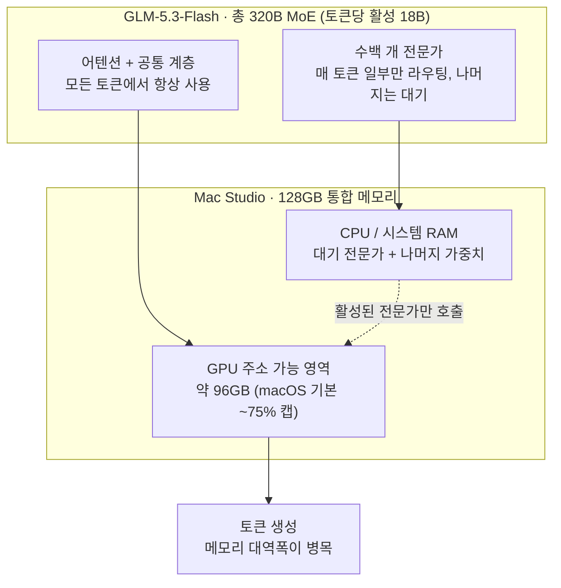

## 왜 읽어야 하나

"320B 모델을 128GB RAM짜리 Mac Studio에서 돌린다"는 말이 최근 화제입니다. 폐쇄망에 프런티어급 코딩 모델을 넣고 싶거나, 클라우드 API 비용 대신 자기 머신에서 frontier 모델을 돌릴지를 따지는 팀이라면 이 글이 그 말의 실체, 즉 "128GB라니 모델에 실제로 128GB를 줄 수 있는 것인가"를 계산해 줍니다.

결론부터 말하겠습니다. **실행은 되지만, 그 128GB는 macOS의 GPU 메모리 캡과 MoE의 활성 파라미터 구조 때문에 모델 전체가 쓰는 128GB가 아닙니다.** GPU가 실제로 건드릴 수 있는 영역은 96GB 선이고 120GB짜리 3비트 모델은 전문가 가중치의 상당 부분을 CPU 쪽에 두고 계층형으로 돌아갑니다. 대가는 생성 속도와 3비트 양자화의 품질입니다.

## 개요

Z.ai(즈이)는 2026년 8월 26일, GLM-5 시리즈에서 네이티브 멀티모달을 처음 갖춘 GLM-5.3-Flash를 발표했습니다. 텍스트뿐 아니라 이미지와 비디오를 받아 텍스트를 내는 320B 파라미터 MoE 모델이고 컨텍스트는 100만 토큰입니다. 발표와 거의 동시에 이 모델이 Unsloth의 3비트 GGUF 양자화로 128GB RAM 환경에서 로컬 실행된다는 소식이 돌아왔고, 여기까지가 많은 사람이 공유한 줄거리입니다.

그 줄거리에 빠져 있는 것이 "320B"와 "128GB"라는 두 숫자가 실제로 어떻게 만나는가 하는 계산입니다. MoE는 파라미터 수와 활성 파라미터 수가 다르며 macOS는 통합 메모리의 전부를 GPU에 주지 않습니다. 이 둘을 읽어야만 "로컬에서 frontier급 모델을 돌린다"는 말이 어떤 것을 사고 어떤 것을 내는지가 보입니다.

*수백 개 전문가 중 몇 개만 활성되는 MoE 구조를 형상화했습니다. 어두운 대다수 클러스터 가운데 얇은 대각선만 따뜻한 빛으로 켜져 있습니다.*

## GLM-5.3-Flash가 무엇인가

이 모델의 총 파라미터는 320B이지만, 한 토큰을 만들 때 실제로 켜지는 활성 파라미터는 18B입니다. MoE의 기본 구조인데 수백 개의 전문가 계층 중 토큰마다 일부만 라우팅되어 계산에 쓰이고 나머지는 대기 상태입니다. 그래서 "320B 모델"이라는 말은 저장 크기의 이야기이고 "18B 활성"이라는 말이 계산량의 이야기입니다. 두 숫자를 섞어 읽으면 로컬 실행의 비용 구조가 왜 이 모양인지 설명되지 않습니다.

또한 GLM-5.3-Flash는 이 시리즈에서 네이티브 멀티모달을 처음 갖춘 모델입니다. 이미지와 비디오를 입력으로 받고 텍스트를 출력하는 구조이며 코딩과 에이전틱 작업에서 특히 강점이 있다는 점에 발표 자료가 힘을 실었습니다. 공개 전에는 Ox Alpha라는 이름으로 소규모에 먼저 돌기 시작해 화제가 됐고 정식 발표 때 GLM-5.3-Flash임이 밝혀졌습니다.

## "128GB 로컬 실행"의 실제 산수

여기서 핵심이 됩니다. 320B MoE 모델을 3비트로 양자화하면 GGUF 파일 크기는 대략 120GB급으로, 128GB 통합 메모리에 "들어간다"는 계산이 성립합니다. Unsloth 문서의 비트별 메모리를 보면 1비트가 약 93GB, 2비트가 약 100-115GB, 3비트 UD-IQ3_XXS가 약 120GB, 4비트는 약 162-210GB로 256GB가 필요합니다.

| 양자화 | 모델 크기 (약) | 128GB Mac Studio |
|---|---|---|
| 1비트 | ~93GB | 여유 있음 |
| 2비트 | 100-115GB | 빠듯 |
| 3비트 UD-IQ3_XXS | ~120GB | 권장, 간신히 |
| 4비트 | 162-210GB | 불가 (256GB 필요) |

하지만 이 표에는 한 줄이 빠집니다. macOS는 통합 메모리의 전부를 GPU에 주소 가능 영역으로 주지 않고 기본값이 총 용량의 약 75퍼센트 선에서 멥니다. 128GB인 Mac Studio에서 GPU가 실제로 쓸 수 있는 영역은 약 96GB에 가깝습니다. 즉 120GB짜리 3비트 모델은 GPU 단독으로는 96GB 안에 들어가지 못하고 전문가 가중치의 상당 부분을 CPU/시스템 RAM 쪽에 두고 활성하는 전문가와 어텐션만 GPU에 올리는 계층형 배치로 돌아갑니다.

이 배치가 가능한 이유는 18B 활성이라는 MoE 구조 때문입니다. 매 토큰마다 켜지지 않는 대다수 전문가가 느린 메모리에 있어도 되고, 항상 쓰이는 어텐션과 공통 계층, 그리고 그 토큰이 골라낸 활성 전문가만 GPU로 올리면 됩니다. 앞서 본 Qwen3.8-Flash-Next의 4090 사례와 같은 원리이며 GLM-5.3-Flash는 그 구조가 320B/18B라는 더 큰 스케일에 적용된 것입니다. 병목은 결국 GPU VRAM 용량에서 메모리 대역폭으로 옮겨가는데 통합 메모리에서 CPU와 GPU가 같은 칩을 공유하는 Mac 환경에서는 이 대역폭이 데스크톱의 PCIe 오프로드와 다른 결입니다.

## 벤치마크를 어떻게 읽나

발표 자료의 벤치마크를 Z.ai 보고 기준으로 나열하면 다음과 같습니다.

| 벤치마크 | GLM-5.3-Flash | 비교 대상 (Z.ai 보고) |
|---|---|---|
| Terminal-Bench 2.1 | 84.3 | Claude Opus 4.8 = 85.0 |
| Z.ai Code Bench v1.0 | 29.0 | Opus 4.8 max effort = 29.5 |
| DeepSWE v1.1 | 63.4 | GLM-5.2 대비 큰 상승 |
| AutomationBench | 48.8 | GLM-5.2 대비 큰 상승 |
| AA Intelligence Index v4.1.1 | 57 | (참고) |

Terminal-Bench 2.1에서 84.3이라는 수치가 Claude Opus 4.8의 85.0과 오차범위 안에 든다는 것은, "프런티어 코딩 모델과 비등하다"고 읽을 만한 점입니다. 다만 세 가지 단서가 붙습니다.

첫째, 이 수치는 Z.ai의 자체 발표 기준이고 독립 재현된 것이 아닙니다. 둘째, 비교는 코딩·터미널 벤치마크에 집중되어 있고 멀티모달(이미지·비디오) 능력은 이 표에 없습니다. 셋째, 클라우드 API에서 이 모델의 생성 속도는 Z.ai 기준 약 48.7 토큰/초로, 같은 품질의 frontier API에 비해 느리다고 스스로 평가합니다. 로컬 3비트 실행이라면 이 속도 문제 위에 양자화 품질 저하가 추가로 겹칩니다.

## ThakiCloud 제품 적용 시사점

이 구성이 ThakiCloud의 ai-platform에 주는 핵심은 "서빙 프로파일이 하나 더 늘었다"는 것입니다.

Metis 추론 관점에서, GLM-5.3-Flash 같은 초희소 MoE는 "GPU에 올릴 것인가"라는 이분법이 아니라 "어텐션과 활성 전문가를 GPU에, 대기 전문가를 느린 메모리에"라는 계층형 배치로 서빙되는 모델입니다. 우리는 이미 같은 구조의 Qwen3.8-Flash-Next에서 이 배치가 실측으로 성립함을 확인했고 GLM-5.3-Flash는 320B/18B라는 스케일로 그 서빙 프로필을 확장해 줍니다. NVFP4 같은 저비트 양자화에서 활성 전문가만 정밀도를 살리고 대기 전문가를 더 낮은 비트로 내리는 계층형 양자화는, 이 모델 구조에서 메모리 효율을 극대화하는 자연스러운 경로가 됩니다.

Aegis 온프렘 관점에서는 진입 비용의 모양이 바뀝니다. 폐쇄망에 프런티어급 코딩·에이전틱 모델을 넣고 싶지만 GPU 예산이 안 나오는 환경에서, 128GB 통합 메모리 워크스테이션이 "단일 사용자~소수 사용자의 로컬 코딩 에이전트"로서 현실적인 대안이 됩니다. 다만 그 전제, 즉 대가(생성 속도와 3비트 품질 저하, 단일 사용자 기준)를 계약에 명시해야 한다는 점이 중요합니다. 다중 사용자 프로덕션이라면 여전히 vLLM 기반 GPU 서빙이 맞습니다.

## 한계 및 반론

이 글이 "128GB Mac에서 320B를 돌리면 frontier를 얻는다"로 읽히면 안 됩니다. 세 가지가 빠지면 그 문장은 성립하지 않습니다.

첫째, 3비트 양자화 품질은 Z.ai나 Unsloth가 공개하지 않았습니다. 우리가 이 비트에서 코딩·에이전틱 성능이 몇 퍼센트 떨어지는지 측정한 적도 없습니다. "48.7 토큰/초 API"와 "3비트 로컬"은 다른 환경이고 이 둘의 품질 격차를 하나로 묶어서 이야기한 소스는 없습니다.

둘째, macOS의 75퍼센트 GPU 캡은 기본값이고 환경에 따라 바뀔 수 있습니다. 96GB라는 수치는 그 기본값을 전제한 계산이며, 실제 배포 머신에서는 이 한계를 확인한 뒤 모델 비트를 고르는 것이 순서입니다.

셋째, 벤치마크는 Z.ai 자체 발표 기준입니다. Terminal-Bench 84.3과 Opus 4.8 85.0의 차이는 오차 범위 내지만, 이는 코딩·터미널 한 벤치의 이야기이고 멀티모달이나 일반 추론을 포괄하는 "프런티어 비등"이 아닙니다.

## 정리

GLM-5.3-Flash가 주는 메시지는 "VRAM 장벽이 죽었다"가 아니라, MoE의 활성/대기 구조와 저비트 양자화가 만나면 18B 활성의 프런티어급 모델을 128GB급 RAM으로 끌어낼 수 있다는 것입니다. 그리고 그 128GB는 OS가 GPU에 실제로 주는 96GB가 아니라 파일이 들어가는 통합 메모리 전체입니다.

산은 이렇게 됩니다. GPU는 어텐션과 활성 전문가, CPU RAM은 대기 전문가, 대가는 생성 속도와 3비트 품질.

팀이 판단할 것은 이 교환이 자신들의 워크로드에서 이득인지입니다. 폐쇄망에 소수 사용자의 로컬 코딩 에이전트가 필요하고 API 비용보다 RAM 용량을 내는 것이 나은 환경이라면 GLM-5.3-Flash의 3비트 로컬 실행은 지금도 유효한 선택지입니다. 다중 사용자나 첫 토큰 지연이 중요한 환경이라면 GPU 서빙을 고르는 것이 맞습니다. 도입을 논하기 전, 우리 평가셋에서 3비트 품질과 실제 토큰/초를 한 번 직접 재보는 것이 이 글의 다음 단계입니다.

## 참고 자료

- [Z.ai GLM-5.3-Flash 공식 발표](https://z.ai/blog/glm-5.3-flash)
- [Unsloth GLM-5.3-Flash GGUF 문서](https://unsloth.ai/docs/models/glm-5.3-flash)
- [CNET: Ox Alpha is GLM-5.3-Flash](https://www.cnet.com/tech/services-and-software/the-powerful-stealth-ai-model-ox-alpha-is-glm-5-3-flash-and-you-can-use-it-now/)
- [MarkTechPost: GLM-5.3-Flash release](https://www.marktechpost.com/2026/08/26/z-ai-releases-glm-5-3-flash-a-320b-a18b-natively-multimodal-moe-with-a-1m-token-context/)
- [Ollama library: glm-5.3-flash](https://ollama.com/library/glm-5.3-flash)
