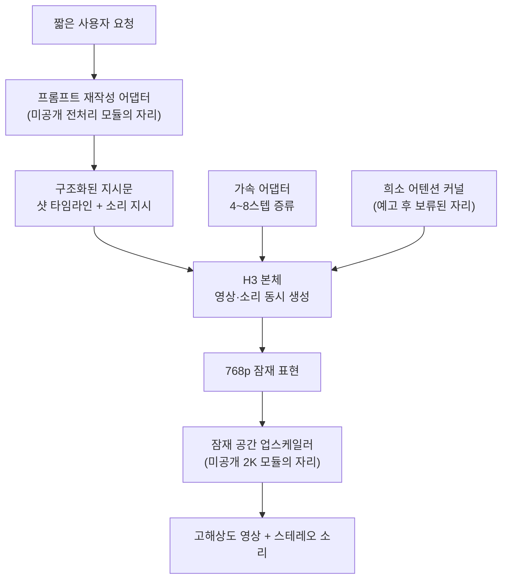

영상 생성 모델을 서빙하거나 파인튜닝하는 분이라면, 지금 한 오픈웨이트 모델 주변에서 벌어지는 일을 한 번 볼 값이 있습니다. 공개 한 달 만에 쌓인 어댑터를 하나씩 열어 보니 만든 사람들이 채운 자리가 우연이 아니었습니다. 회사가 "나중에 공개하겠다"고 적어 둔 세 자리를 커뮤니티가 먼저 메우고 있었습니다. 그리고 그 과정에서 작은 어댑터의 역할이 바뀌었습니다.

*어댑터 목록은 기능 목록이 아니라, 아직 공개되지 않은 자리의 지도에 가깝습니다.*

## 쉽게 말하면

새로 지은 아파트에 입주했다고 생각해 보시기 바랍니다. 시공사가 골조와 벽과 창문은 다 올려 줬습니다. 그런데 현관 인터폰이 없고, 마감 도배가 안 되어 있고, 단열재가 들어갈 자리가 비어 있습니다. 시공사는 "설계는 끝났고 나중에 넣어 드리겠습니다"라고만 적어 뒀습니다.

입주민들은 기다리지 않았습니다. 각자 인터폰을 달고 도배를 하고 단열재를 채워 넣었습니다. 그래서 입주민들이 만든 물건 목록을 보면 그 집에 무엇이 없었는지가 그대로 드러납니다.

이 글이 다루는 모델이 그 아파트입니다. 그리고 예전에 사람들이 이런 모델에 붙이던 작은 부품은 대체로 **벽지**였습니다. 그림체를 바꾸고 색감을 바꾸는 장식이었습니다. 지금은 다릅니다. 사람들이 손대는 곳이 벽지에서 **배관과 골조**로 넘어갔습니다. 이 비유를 글 끝까지 그대로 쓰겠습니다.

*시공사가 골조는 올렸지만 비워 둔 자리가 있었고, 입주민들이 기다리지 않고 직접 채웠습니다.*

*전체 구조를 한 장으로 보면 이렇습니다. 점선으로 그린 세 칸이 공개되지 않은 모듈이고, 그 자리를 커뮤니티 모듈이 채우고 있습니다.*

## 무엇을 세어 봤나

MiniMax H3는 2026년 7월 28일 허깅페이스에 올라온 오픈웨이트 영상 생성 모델입니다. 텍스트와 이미지와 영상과 소리를 하나의 시퀀스로 묶어 처리하고, 영상과 스테레오 소리를 함께 만들어 냅니다. 이 모델을 사내에 들일 때 무엇이 필요한지는 [이전 글](/tech-blog/ko/llmops/minimax-h3-omni-modal-onprem-serving/)에서 다뤘습니다.

이번에는 모델 자체가 아니라 **그 주변에 쌓인 것**을 봤습니다. 어댑터와 파생 모델의 카드를 직접 열어 확인한 것이 열네 개입니다. 커뮤니티에서 도는 목록은 이보다 길지만, 이 글에는 제가 카드를 실제로 열어 본 것만 담았습니다. 확인하지 못한 항목은 뒤에 따로 적었습니다.

세어 보고 나서 목록을 기능별로 다시 나눴더니, 이것들을 뭉뚱그려 "H3용 LoRA"라고 부르는 것이 부정확하다는 것이 분명해졌습니다. 안에 섞여 있는 것은 서로 다른 여섯 종류의 기술입니다.

## 커뮤니티가 채운 세 개의 빈 방

가장 먼저 눈에 띈 것은 이것입니다. 어댑터가 몰려 있는 자리가 모델 카드가 "공개하지 않았다"고 적어 둔 자리와 겹칩니다.

모델 카드는 세 가지를 명시적으로 남겨 뒀습니다. 입력을 해석해 구조화된 지시문으로 바꾸는 전처리 모듈은 여러 호스팅 서비스에 의존한다는 이유로 공개에서 빠졌습니다. 저해상도 결과를 다시 넣어 2K로 다시 만드는 모듈도 복잡도를 이유로 빠졌습니다. 그리고 학습 마지막 단계에 넣었다는 희소 어텐션은 첫 공개 배포에 포함되지 않았고 나중에 따로 내겠다고 적혀 있습니다.

커뮤니티가 만든 것을 그 옆에 놓아 보면 이렇게 됩니다.

| 회사가 남겨 둔 자리 | 커뮤니티가 채운 것 | 무엇으로 |
|---|---|---|
| 입력 전처리 모듈 (미공개) | 프롬프트 재작성 어댑터 3종 | 다른 언어모델 위에 얹은 어댑터 |
| 2K 재생성 모듈 (미공개) | 잠재 공간 업스케일러 | 별도로 학습한 3차원 합성곱 신경망 |
| 희소 어텐션 (예고 후 보류) | 희소 선형 어텐션 결합 체크포인트 | 증류 어댑터와 커널을 함께 설계 |

프롬프트 재작성 어댑터는 H3에 붙는 것이 아닙니다. `Qwen3-VL-8B-Instruct` 위에 얹은 어댑터이고, 짧은 요청을 샷 타임라인과 효과음과 배경음악 지시가 들어간 구조화된 지시문으로 바꿉니다. 카드 자신이 공식 서비스의 "학습된 근사"라고 표현합니다.

잠재 공간 업스케일러는 더 실용적입니다. 픽셀로 풀었다가 다시 인코딩하는 왕복을 피하려고 24채널 잠재 표현을 직접 키웁니다. 카드는 그 왕복이 비싼 이유로 H3의 시각 디코더가 50억 파라미터급이라는 점을 듭니다. 영상 7만 쌍과 2K 이미지 8천 쌍, 합쳐서 약 8만 쌍으로 학습했고 1.0배에서 4.0배까지 연속으로 지원합니다.

*괄호로 표시한 세 자리가 전부 공개되지 않은 모듈입니다. 커뮤니티 모듈이 정확히 그 자리에 들어가 있습니다.*

## 벽지에서 배관으로

두 번째로 본 것은 어댑터가 하는 일 자체가 달라졌다는 점입니다. 세 가지 방식으로 넘어갔습니다.

*어댑터가 손대는 지점이 그림체에서 샘플링 궤적·시간 구조·타 모델 표현으로 옮겨갔습니다.*

### 하나, 샘플링 궤적을 학습합니다

알리바바가 낸 가속 어댑터는 랭크 64에 알파 64이고, 8스텝 추론을 목표로 합니다. 방식은 **병렬 디코딩 증류**입니다. 한 번의 신경망 호출로 여러 잡음 제거 단계의 효과를 예측하도록 학습시킵니다.

여기서 어댑터가 담는 것이 달라졌습니다. 보통의 어댑터는 "무엇을 그릴지"를 담습니다. 가속 어댑터가 담는 것은 "같은 결과에 더 빨리 도달하는 길"입니다. 벽지가 아니라 배관입니다.

그래서 파일 하나만 끼우면 되는 물건이 아닙니다. lightx2v가 낸 희소 어텐션 결합본의 설정을 보면 어댑터 가중치와 함께 희소도 0.85, 영상 쪽 흐름 이동값 6.0, 소리 쪽 흐름 이동값 3.0이 같이 지정되어 있습니다. 영상과 소리가 같은 시간 격자를 쓰면서 서로 다른 궤적을 탑니다. 어댑터와 샘플러와 스케줄러가 한 묶음의 계약입니다.

이 조합은 계산량을 두 축에서 동시에 줄입니다. 스텝은 30에서 4로 줄이고, 어텐션은 85%를 비웁니다. 카드는 RTX 5090에서 약 2.5배 가속을 측정했다고 밝힙니다.

### 둘, 시간 구조를 바꿉니다

RAVEN 어댑터는 더 나갔습니다. 원래 H3는 한 덩어리의 영상을 양방향으로 한꺼번에 만듭니다. 이 어댑터를 붙이면 앞서 만든 조각을 조건으로 다음 조각을 이어 붙이는 방식으로 생성 방식 자체가 바뀝니다.

공개 설정은 랭크 128에 알파 128, 192프레임, 768 곱하기 1376, 초당 24프레임, 4스텝입니다. 24기가바이트 메모리 범위에서 돈다고 적혀 있습니다.

어댑터 하나가 그림체가 아니라 **시간을 다루는 방식**을 바꾼 것입니다. 벽지를 바꾼 것이 아니라 방 구조를 바꿨습니다. 다만 카드 자신이 "초기 미리보기"이고 "아직 덜 학습됐다"고 명시합니다. 질감 표현이 부족하다는 것도 저자가 먼저 적어 뒀습니다.

### 셋, 다른 모델의 표현을 옮겨 심습니다

가장 실험적인 것은 이쪽입니다. TenStrip이 낸 두 어댑터는 데이터로 학습한 것이 아닙니다. 다른 모델의 어텐션 가중치를 H3에 이식한 다음, 그 차이를 특잇값 분해로 압축해 어댑터 형태로 뽑아냈습니다.

숫자가 흥미롭습니다. Krea2 쪽은 랭크 512로 뽑아도 원래 차이의 52%만 담기고 랭크 128에서는 24%에 그칩니다. Wan2.2 쪽은 랭크 512에서 41.6%, 랭크 1024에서 69%입니다.

이것이 뜻하는 바가 있습니다. 보통 어댑터가 성립하는 전제는 "바뀌는 부분이 원래 차원보다 훨씬 단순하다"는 것입니다. 그런데 모델과 모델 사이를 옮기며 생긴 차이는 그 전제를 잘 만족하지 않습니다. 그래서 랭크가 512나 1024까지 올라갑니다.

즉, 사람 말로는 이렇습니다. **벽지는 얇게 발라도 되지만 배관을 옮기려면 벽을 뜯어야 합니다.**

*모델 사이를 옮기며 생긴 차이는 단순하지 않아, 랭크 512에서도 절반 남짓만 담깁니다.*

## 스타일 어댑터도 여전히 흥미롭습니다

전통적인 쪽도 배울 것이 있습니다. fal이 낸 인물 사실감 어댑터는 실사 클립 176개를 손으로 골라 만들었습니다. 느린 화면은 정상 속도로 되돌리고 전부 초당 24프레임으로 맞췄습니다.

여기서 저자는 랭크와 학습 스텝과 학습률과 학습 해상도를 바꾼 열여섯 가지 설정을 같은 조건에서 비교했습니다. 이긴 것은 랭크 32에 1500스텝이었고, 저자는 **랭크나 학습량보다 학습 해상도가 더 중요했다**고 적습니다. 피부 결이나 머리카락 같은 고주파 정보는 낮은 해상도에서 애초에 사라지기 때문입니다. 이 실험은 [지난 글](/tech-blog/ko/llmops/minimax-h3-lora-recipe-not-weights/)에서 따로 다뤘습니다.

카메라 움직임 어댑터도 같은 이야기를 합니다. 저자는 아홉 가지 카메라 동작 중 밀어 넣기와 빼기와 핸드헬드 추적은 잘 되고 좌우 팬은 약하다고 밝히면서, 그 이유로 팬 학습 표본이 적다는 점을 듭니다. 모델 설정이 아니라 데이터 구성이 성능을 갈랐습니다.

*열여섯 가지 설정을 같은 조건에서 비교한 결과, 이긴 것은 가장 큰 랭크가 아니었습니다.*

## 못 믿을 부분

정직하게 적겠습니다.

첫째, 제가 확인한 것은 어댑터 열네 개의 **모델 카드에 적힌 주장**입니다. 저희가 직접 돌려서 잰 수치가 아닙니다. 2.5배 가속도 41.6%라는 값도 만든 사람이 자기 카드에 적은 숫자입니다.

둘째, 카드에 없는 것을 이 글에 넣지 않았습니다. 커뮤니티에서 도는 정리 글에는 이식 대상 모델의 블록 수와 헤드 수, 그리고 어떤 투영 행렬이 소리 품질에 더 민감한지 같은 상세한 수치가 돕니다. 제가 카드에서 그 내용을 찾지 못했으므로 싣지 않았습니다.

셋째, 만든 사람들이 스스로 불안정하다고 적은 것이 여럿입니다. 물리 어댑터의 저자는 "아직 학습과 테스트 단계이고 자료 일부와 라벨 문제로 안정적이지 않다"고 적었습니다. 스트리밍 어댑터는 미리보기입니다. 이식 어댑터는 카드에 "전부 실험적"이라고 쓰여 있고, 그중 하나는 순수 텍스트 생성에서만 쓸 만하다고 범위를 좁혀 뒀습니다.

넷째, 물리 어댑터를 두고 "이 모델이 물리를 이해하게 됐다"고 읽으면 안 됩니다. 지금 수준에서 타당한 해석은 원래 모델이 갖고 있던 성향을 특정 움직임 쪽으로 기울인 정도입니다.

*여기 실린 수치는 만든 사람이 자기 카드에 적은 값이고, 교차 검증된 것이 아닙니다.*

## 한국 팀에게 남는 조건

기술과 별개로 확인해야 할 것이 있습니다. 이 모델의 커뮤니티 라이선스는 2026년 8월 2일자이고, 적용 지역을 "제외 지역을 뺀 전 세계"로 정의합니다. 그 제외 지역에 **유럽연합과 영국과 대한민국과 미국**이 들어가 있습니다.

가중치를 내려받을 수 있다는 사실과 국내에서 자유롭게 돌리고 고치고 배포할 수 있다는 것은 같은 말이 아닙니다. 라이선스는 제외 지역에서 배포를 원하면 별도 문의로 라이선스를 받을 수 있다는 경로도 함께 적어 두고 있습니다.

이식 어댑터는 조건이 하나 더 붙습니다. 다른 모델의 가중치 특성을 옮겨 온 결과물이라 원본 모델의 라이선스도 같이 따라옵니다. 그리고 이 라이선스는 파생 모델의 정의에 증류와 중간 표현을 이용한 전이까지 포함시켜 두었습니다. 지금 유행하는 방식 대부분이 그 정의 안에 들어갑니다.

국내 팀이 오픈 영상 모델을 고를 때 벤치마크보다 먼저 읽어야 할 조항은 [따로 정리한 글](/tech-blog/ko/llmops/open-video-model-license-territory-audit/)이 있습니다. 이 글에서는 조건만 짚고 넘어가겠습니다. 저희도 이 모델을 국내에서 서비스에 넣지 않았습니다.

## ThakiCloud 제품 적용 시사점

저희가 이 흐름을 남 일로 보지 않는 이유가 있습니다. 같은 분해가 언어모델 서빙에서 먼저 일어났고, 저희 추론 플랫폼 Metis가 그 위에서 돌고 있기 때문입니다.

첫째, **어댑터가 늘어나면 서빙이 문제가 됩니다.** 어댑터 하나마다 체크포인트를 통째로 띄우면 GPU가 아무리 있어도 모자랍니다. 본체 하나를 공유하고 어댑터만 갈아 끼우는 방식이라야 경제성이 나옵니다. 저희가 다중 어댑터 서빙과 롱테일 수요를 [따로 실험한 기록](/tech-blog/ko/research/derivative-long-tail-lora-serving/)이 있습니다.

둘째, **가속 어댑터는 가중치만 옮겨서는 재현되지 않습니다.** 위에서 본 것처럼 어댑터와 스케줄러와 흐름 이동값이 한 묶음입니다. 저희가 서빙 설정을 카탈로그에 함께 기록하는 이유가 이것입니다. 설정을 이름 댈 수 없는 수치는 재현할 수 없고, 재현할 수 없는 수치는 고객에게 약속할 수 없습니다.

셋째, **모델을 고를 때 라이선스가 카탈로그 항목이어야 합니다.** 성능 표만 보고 고르면 배포 직전에 막힙니다. 저희는 온프레미스와 소버린 배포를 다루기 때문에 이 판정이 뒤가 아니라 앞에 와야 합니다.

넷째, 어댑터를 직접 만드는 쪽은 학습 플랫폼 Maxis가 맡습니다. 위 실험들이 공통으로 말하는 것은 랭크를 올리는 것보다 **학습 데이터의 해상도와 구성이 상한을 정한다**는 점입니다. 저희 내부 규율도 같은 결론에 도달해 있습니다. 잘린 화면이나 낮은 해상도로 만든 자료는 아무리 오래 학습해도 복원되지 않습니다.

*어댑터가 늘어날수록 본체 공유와 설정 기록과 라이선스 판정이 앞으로 나옵니다.*

## 정리

어댑터 목록을 처음 보면 "벌써 이렇게 많이 나왔구나" 정도로 읽힙니다. 하나씩 열어 보면 다르게 읽힙니다.

만들어진 것들이 몰려 있는 자리는 회사가 공개하지 않은 세 모듈의 자리였습니다. 그리고 그 과정에서 작은 어댑터가 하는 일이 그림체를 바꾸는 것에서 샘플링 궤적과 시간 구조와 다른 모델의 표현을 옮기는 것으로 넘어갔습니다. 벽지에서 배관으로 넘어간 것입니다.

이 방향이 계속되면 영상 모델은 하나의 거대한 체크포인트라기보다, 본체 위에 필요한 순간에 필요한 모듈을 얹는 형태에 가까워집니다. 언어모델 쪽에서 이미 익숙한 그림입니다. 다만 국내에서 이 모델을 쓰려면 기술보다 먼저 확인할 것이 라이선스라는 점은 그대로 남습니다.

## 출처

- [MiniMaxAI/MiniMax-H3 모델 카드와 라이선스](https://huggingface.co/MiniMaxAI/MiniMax-H3)
- [lightx2v/Minimax-h3-Turbo-SLA](https://huggingface.co/lightx2v/Minimax-h3-Turbo-SLA)
- [lightx2v/Minimax-h3-Turbo](https://huggingface.co/lightx2v/Minimax-h3-Turbo)
- [alibaba-pai/MiniMax-H3-Acc-LoRAs](https://huggingface.co/alibaba-pai/MiniMax-H3-Acc-LoRAs)
- [mvp-lab/MiniMax-H3-RAVEN-Streaming-LoRA](https://huggingface.co/mvp-lab/MiniMax-H3-RAVEN-Streaming-LoRA)
- [fal/MiniMax-H3-Realism-People-LoRA](https://huggingface.co/fal/MiniMax-H3-Realism-People-LoRA)
- [lovis93/studio-1939-old-animation-lora-minimax-h3](https://huggingface.co/lovis93/studio-1939-old-animation-lora-minimax-h3)
- [Jojocodex/minimax-h3-Camera-Motion-lora](https://huggingface.co/Jojocodex/minimax-h3-Camera-Motion-lora)
- [Jojocodex/minimax-h3-spatial-physics-lora](https://huggingface.co/Jojocodex/minimax-h3-spatial-physics-lora)
- [Jojocodex/minimax-h3-wushu-action-lora](https://huggingface.co/Jojocodex/minimax-h3-wushu-action-lora)
- [TenStrip/Krea2-H3-Style-Lora](https://huggingface.co/TenStrip/Krea2-H3-Style-Lora)
- [TenStrip/Wan2.2_H3_Motion_Lora](https://huggingface.co/TenStrip/Wan2.2_H3_Motion_Lora)
- [joeygambino/MiniMax-H3-x-Z-Image-native](https://huggingface.co/joeygambino/MiniMax-H3-x-Z-Image-native)
- [lightx2v/MiniMax-H3-Prompt-Rewriter-LoRA-8B](https://huggingface.co/lightx2v/MiniMax-H3-Prompt-Rewriter-LoRA-8B)
- [LBH-123-AI/Minimax_h3_latent_Upscaler](https://huggingface.co/LBH-123-AI/Minimax_h3_latent_Upscaler)
