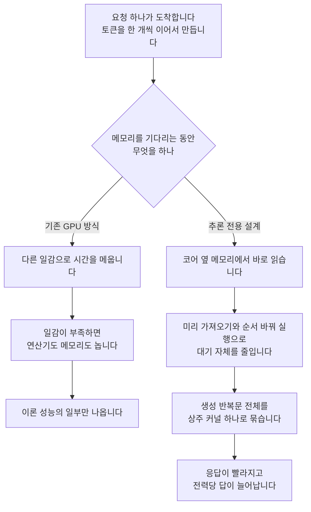

추론용 반도체 경쟁의 승부처가 연산 속도에서 설계 목표로 옮겨갑니다. 최근 공개된 한 추론 전용 칩은 최고 연산량을 목표에서 아예 빼고 답이 얼마나 빨리 돌아오는지와 같은 전력으로 몇 개의 답을 만드는지를 목적함수로 삼았습니다. 추론 서비스의 응답 속도나 원가를 책임지는 분이라면, 이 설계가 왜 기존 GPU와 정반대 방향으로 갔는지 알아 둘 값이 있습니다.

*코어 하나마다 메모리 한 덩이를 바로 옆에 붙이는 것이 이 설계의 출발점입니다.*

## 쉽게 말하면

구내식당을 떠올려 보시기 바랍니다. 500인분을 한 번에 배식할 때 구내식당은 세상에서 가장 효율적인 주방입니다. 커다란 솥, 긴 배식대, 많은 조리원이 전부 동시에 돌아갑니다. 재료 창고가 좀 멀어도 상관없습니다. 한 번 다녀올 때 수레 가득 실어 오면 되고 다녀오는 동안 다른 조리원이 다른 요리를 하고 있으니 주방이 멈추지 않습니다.

그런데 손님이 한 명만 옵니다. 그것도 한 숟갈을 먹고 다음 한 숟갈을 시키고, 또 다음 한 숟갈을 시킵니다. 이제 창고가 먼 것이 치명적입니다. 한 숟갈마다 창고를 왕복해야 하는데, 그 사이 조리원들은 할 일이 없어 서 있습니다. 솥도 배식대도 그대로인데 손님은 계속 기다립니다.

이것이 지금 GPU에서 벌어지는 일입니다. 대규모 학습은 500인분 배식이고 사용자 한 명이 대화를 주고받는 추론은 한 숟갈씩 시키는 손님입니다. 그래서 어떤 사람들은 주방을 더 키우는 대신, 손님 한 명을 위해 **창고를 조리대 옆으로 옮기는** 쪽을 택했습니다. 이 글이 설명하는 것이 정확히 그 선택입니다.

## GPU가 추론에서 무너지는 지점

GPU가 메모리 대기 시간을 감추는 방식은 시간 다중화입니다. 수많은 작업 묶음을 번갈아 실행하면서, 하나가 메모리를 기다리는 동안 다른 것을 돌립니다. 이 방식이 성립하려면 대기 중에 돌릴 일감이 항상 남아 있어야 합니다. 학습이나 대량 배치 처리에서는 일감이 넘치므로 이 전략이 훌륭하게 작동합니다.

디코드는 사정이 다릅니다. 사용자 한 명의 요청은 한 번에 토큰 한 개씩 만들어지고 층마다 행렬 하나에 벡터 하나를 곱하는 작은 연산이 됩니다. 스케줄에 올릴 일감 자체가 부족하니 연산기도 놀고 메모리 대역도 남습니다. 원문 분석에 따르면 이론적으로 초당 1,000에서 2,000 토큰이 가능한 구성에서 실제 서빙 프레임워크는 초당 100에서 200 토큰 수준에 머무릅니다. 이론치의 10분의 1 안팎입니다.

즉, 사람 말로는 대역폭이 모자라서 느린 것이 아니라 **기다리는 구조 자체가 이 작업과 안 맞아서** 느립니다. 그래서 원문은 대화형 추론을 GPU만의 문제라기보다 CPU가 오래 다뤄 온 단일 스레드 지연 문제에 가깝다고 정리합니다.

*같은 요청을 두 방식이 어떻게 다르게 처리하는지 나눠 그린 것입니다. 왼쪽은 대기를 다른 일로 덮는 방식이고 오른쪽은 대기 자체를 없애는 방식입니다.*

## 설계가 바뀐 세 곳

### 창고를 조리대 옆으로 옮겼습니다

가장 큰 변화는 메모리입니다. 기존 GPU는 모든 연산 유닛이 거대한 공용 캐시를 거쳐 메모리에 접근하는 통합 구조를 씁니다. 어디서든 어느 데이터에나 닿을 수 있어 편하지만, 멀리 있는 데이터를 집을 때 수백 사이클의 왕복 비용을 냅니다.

새 칩은 이 편의를 버렸습니다. 코어를 64개의 조각으로 나누고 각 조각에 메모리 한 덩이를 짝지어 바로 옆에 붙였습니다. 전역 공용 캐시는 아예 없애고 코어마다 512KB 규모의 지역 캐시만 둡니다. 데이터가 이동하는 거리를 줄이면 대기가 줄어듭니다. 대기가 줄면 감출 필요도 사라집니다.

대신 값을 치릅니다. 어느 가중치와 어느 캐시가 어느 조각에 놓일지를 하드웨어가 알아서 처리해 주지 않으므로, 그 배치를 컴파일러가 명시적으로 결정해야 합니다. 편의를 버리고 성능을 얻은 만큼 소프트웨어가 어려워지는 거래입니다.

### 대기를 덮는 대신 줄였습니다

실행 방식도 반대입니다. 작업 묶음을 잔뜩 띄워 대기를 덮는 대신, 하나의 실행 흐름 안에서 명령어 수준 병렬성을 최대한 뽑아냅니다. 코어가 순서를 바꿔 실행하는 구조를 갖고 하드웨어가 필요한 데이터를 미리 가져옵니다. 여기서도 발상은 같습니다. 기다림을 감추지 말고 없애자는 것입니다.

한 걸음 더 나가 생성 반복문 전체를 상주 커널 하나로 유지합니다. 층마다 커널을 새로 띄우고 끝날 때마다 동기화하는 비용을 통째로 없애려는 선택입니다. 앞서의 비유로 옮기면, 한 숟갈마다 조리원을 새로 불러 모으는 대신 처음부터 조리대 앞에 세워 두는 셈입니다.

### 컴파일러가 배치를 정하고, 그 배치를 모델이 탐색합니다

여기가 가장 흥미로운 부분입니다. 물리적 배치를 하드웨어에 맡기지 않기로 했으니 그 결정을 누군가는 해야 합니다. 원문은 이 자리에 전통적인 비용 모델 대신 언어 모델 에이전트를 앉혔다고 설명합니다. 배치, 타일 크기, 파이프라인 단계, 미리 가져오는 거리, 집합 통신 전략을 모델이 후보로 만들고 시뮬레이터와 실제 실리콘에서 재서 고치는 탐색 반복을 돕니다.

이 선택이 합리적인 이유는 단순합니다. 지역 캐시와 미리 가져오기가 얽힌 구간은 믿을 만한 수식으로 예측하기 어렵습니다. 예측이 어려우면 재 보는 편이 낫습니다. 재 보는 일은 사람보다 기계가 훨씬 많이 할 수 있습니다.

칩 설계 자체에도 같은 방식을 썼습니다. 첫 회로 설계에서 생산 직전 단계까지 걸린 기간이 9개월이며, 그 과정에서 자체 모델이 설계 작업 일부를 도왔다고 공개했습니다.

## 공개된 수치와 추정치는 다릅니다

여기서 경계를 분명히 해 둘 필요가 있습니다. 회사가 공식적으로 발표한 것과, 분석 글 저자가 공개 자료로 역산한 추정은 신뢰도가 다릅니다.

먼저 공식 발표에 해당하는 내용입니다.

| 항목 | 공개된 값 |
|---|---|
| 와트당 최고 성능 | 비교 시스템 대비 1.5배에서 1.9배 |
| 종단 지연 | 1.7배에서 3.6배 낮음 |
| 대화형 성격이 강한 작업 | 2.1배에서 4.1배 높은 성능 |
| 측정 모델 | GPT-OSS 120B, DeepSeek R1 670B, Kimi K2.5 1T |
| 사용 벤치마크 | 공개 InferenceX |
| 설계 기간 | 첫 회로 설계부터 생산 직전 단계까지 9개월 |
| 배치 계획 | 2026년 말부터 자체 인프라에 투입 |

*처리량과 지연 중 하나를 포기하는 기존 절충을 한 아키텍처에서 동시에 개선했다는 것이 발표의 핵심 주장입니다. 후속 세대도 이미 개발 중이라고 밝혔습니다.*

구조 쪽에서 공개된 항목은 코어 조각 64개, 컴퓨트 다이당 HBM4 스택 6개, 동작 주파수 1.7GHz, MXFP4 기준 최고 13.4 PFLOP/s, 전역 캐시를 없앤 메모리 구조, 그리고 연산 다이와 입출력 다이를 분리한 구성입니다.

반면 다음은 저자가 공개 수치에서 **역산한 추정**이며 원문도 추정이라고 명시합니다. 조각당 텐서 유닛 15개에서 16개, 유닛의 64 곱하기 64 형태, 덧셈 트리 기반 구현, 집합 통신망의 8 곱하기 8 2단 구성, 일반 통신망의 세부 구조가 여기에 해당합니다. 이 숫자들을 확정 사실처럼 인용하면 안 됩니다.

## 다키클라우드 관점: 칩보다 목적함수가 먼저입니다

이 사례에서 저희가 가져가는 교훈은 칩을 사자는 것이 아닙니다. **무엇을 최적화 대상으로 선언하느냐가 실제 성능을 지배한다**는 쪽입니다.

저희도 같은 성격의 일을 실측한 적이 있습니다. Metis 서버리스 엔드포인트에서 같은 체크포인트, 같은 GPU, 같은 엔진을 두고 서빙 설정 두 가지만 바꿔 봤습니다. 컴파일을 끄는 환경 변수를 되돌리고 동시 처리 시퀀스 상한을 올린 것이 전부입니다. 결과는 단일 스트림에서 18.8배, 포화 상태에서 17.9배 차이였습니다. 하드웨어는 한 장도 바뀌지 않았습니다.

즉, 사람 말로는 **추론 원가의 상당 부분이 칩이 아니라 설정과 목표 선언에 잠겨 있습니다.** 지연을 목표로 선언하지 않은 시스템은 지연이 나쁘게 나옵니다. 그 사실을 아무도 재지 않으면 원인을 모델 탓으로 돌리게 됩니다.

Paxis로 기업 업무를 자동화할 때 이 차이는 그대로 체감으로 넘어옵니다. 에이전트는 한 번의 요청 안에서 도구를 여러 번 부르고 그때마다 앞 결과를 기다립니다. 토큰 한 개의 지연이 작업 한 건의 대기 시간으로 곱해집니다. 그래서 저희가 Metis에서 보는 지표는 초당 총 토큰 수가 아니라 요청 단위 지연과 전력당 유효 토큰입니다. 새 칩이 목적함수를 바꾼 이유와 같은 이유입니다.

온프레미스나 주권 클라우드가 요건인 고객에게는 이 이야기가 더 직접적입니다. Aegis처럼 폐쇄망에 들어가는 구성에서는 카드를 무한정 늘릴 수 없으므로, 같은 전력과 같은 장비에서 얼마나 많은 유효한 답을 뽑느냐가 곧 도입 가능 여부를 결정합니다.

## 못 믿을 부분

이 글에도 한계가 있습니다.

첫째, 성능 수치는 회사가 스스로 고른 비교 대상과 벤치마크에서 나온 값입니다. 공개 벤치마크를 썼다는 점은 신뢰를 높이지만, 비교 시스템의 서빙 설정이 어떻게 잡혔는지가 결과를 크게 흔들 수 있습니다. 저희가 실측한 18.8배 사례가 정확히 그 위험을 보여 줍니다.

둘째, 마이크로아키텍처 세부는 앞에서 구분한 대로 상당 부분이 추정입니다. 구조를 설명하는 문장과 숫자를 확정하는 문장을 섞어 읽으면 안 됩니다.

셋째, 이 설계는 범용 가속기가 아닙니다. 대화형 추론이라는 좁은 목표에 맞춰 편의를 버린 구조이므로, 학습이나 다른 작업으로 그대로 옮겨 읽을 수 없습니다.

## 정리

한 문장으로 줄이면 이렇습니다. **최고 연산량이 아니라 응답 지연과 전력당 유효 토큰을 목적함수로 선언하면, 메모리 구조부터 컴파일러까지 전부 다시 짜게 됩니다.**

당장 칩을 바꿀 수 있는 조직은 거의 없습니다. 그러나 목적함수를 바꾸는 일은 오늘 할 수 있습니다. 지금 운영하는 추론 서비스에서 초당 토큰 수 대신 요청 단위 지연과 전력당 유효 토큰을 먼저 재 보시기 바랍니다. 저희 경우 그 지표를 바꾸자마자 하드웨어를 건드리지 않고도 열 배 이상의 여유가 설정 안에 잠들어 있다는 사실이 드러났습니다. 손님이 한 명뿐인 시간대에 구내식당 주방이 얼마나 노는지는 재 보기 전에는 아무도 모릅니다.

출처: [Redesigning the Inference Chip (zartbot)](https://zartbot.github.io/blog/arch/jalapeno/en.html), [OpenAI and Broadcom unveil LLM-optimized inference chip](https://openai.com/index/openai-broadcom-jalapeno-inference-chip/), [Jalapeño's first results](https://openai.com/index/jalapeno-first-results/).
