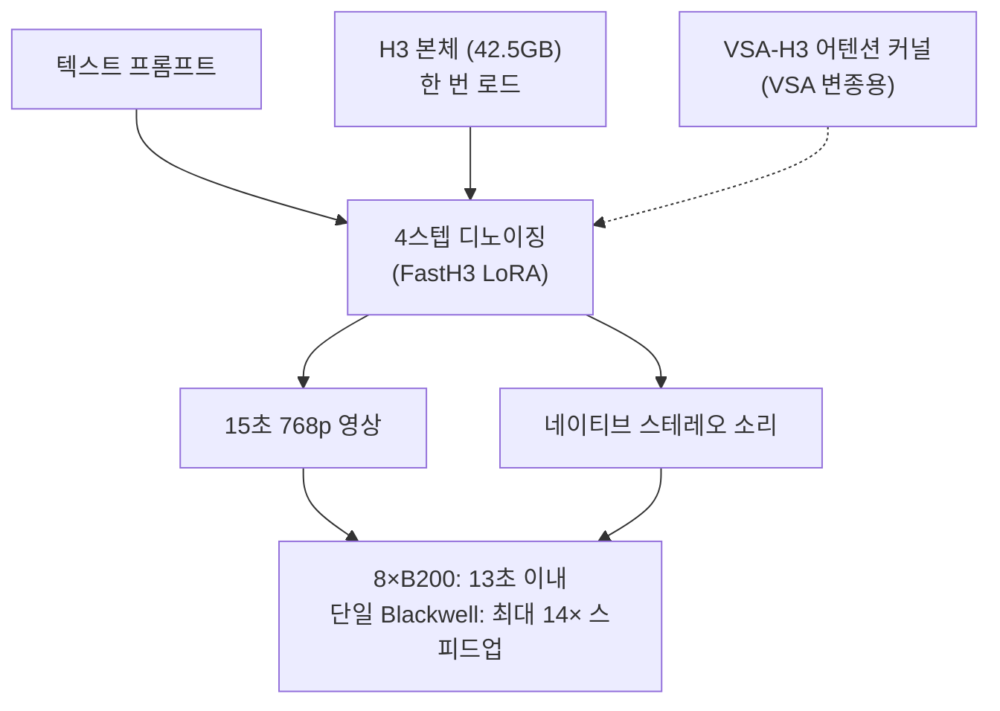

## 왜 읽어야 하나

GPU 플리트를 운영하며 영상 생성을 서빙 스택에 올릴지 따지는 팀이라면, 이 글로 MiniMax H3의 디스틸레이션 변종 FastH3를 도입할지 판단하고, 도입 전에 무엇을 먼저 읽어야 하는지 알게 됩니다.

결론부터 말하겠습니다. **4스텝 디스틸레이션은 영상 생성을 배치 렌더링에서 서빙의 영역으로 옮겼습니다. 다만 첫 변수는 속도가 아니라 라이선스입니다. 한국은 제외 지역이고, 상업적 쓰임은 별도 라이선스 경로입니다.**

## 개요

MiniMax H3는 7월 말에 오픈웨이트가 허깅페이스에 오른 영상 생성 모델입니다. 영상과 스테레오 소리를 하나의 시퀀스로 만들어 내고, 최대 2K 해상도, 24 FPS 기준 15초 길이까지의 영상을 지원합니다. 텍스트와 이미지와 영상과 소리를 동시에 입력으로 받으며, 입력 묶음의 상한은 레퍼런스 이미지 9개, 영상 클립 3개, 오디오 트랙 3개입니다. 이 모델 자체의 실측과 사내 도입에 필요한 조건, 그리고 라이선스를 읽는 법은 [이전 글](/tech-blog/ko/llmops/minimax-h3-omni-modal-onprem-serving/)과 [라이선스 실사 글](/tech-blog/ko/llmops/open-video-model-license-territory-audit/)에서 다뤘습니다.

공개 이후 H3 주변의 어댑터 생태계는 빠르게 커졌습니다. [별개 글](/tech-blog/ko/llmops/h3-adapter-ecosystem-map-of-gaps/)에서 14종의 어댑터를 세어 분류했는데, 스타일 LoRA와 카메라 무브와 물리 시뮬레이션과 프롬프트 리라이터와 업스케일러가 그것입니다. 그중에 가속 어댑터도 있었습니다. 커뮤니티의 8스텝 투로 경로, 그리고 한 번의 호출로 여러 스텝의 효과를 예측하는 병렬 디코딩 증류 어댑터가 대표적입니다. 8월 27일 공개된 FastH3 Preview v1은 이 계보보다 한 발 더 간 변종입니다. 가속을 어댑터 하나로 끝내지 않고, 추론 궤적 자체를 4스텝으로 다시 썼습니다. FastVideo(Hao AI Lab)와 Nuva Lab, 그리고 NVIDIA의 FastGen 팀이 함께 냈습니다. FastVideo는 영상 디퓨전 모델의 사후 학습과 실시간 추론을 묶는 통합 프레임워크이고, FastGen은 다단계 디퓨전 모델을 적스텝 생성기로 바꾸는 디스틸레이션 방법들을 한 프레임워크로 통합한 PyTorch 기반 오픈소스입니다.

## FastH3가 무엇인가

FastH3는 H3에서 디스틸한 텍스트-투-비디오-앤-오디오(T2VA) 생성기입니다. 텍스트 프롬프트 하나로 영상과 네이티브 스테레오 소리를 동시에 만듭니다. 대화와 사운드효과와 앰비언트 음향이 영상과 함께 생성된다는 뜻입니다. H3 본체도 이 능력을 갖지만, FastH3는 그 생성 비용을 다시 짰습니다.

핵심은 디노이징 스텝 수입니다. H3 본체는 영상 하나를 만들 때 transformer 전방향 호출을 수십 번 반복합니다. FastH3는 이 궤적을 4회 호출로 재구성했습니다. 공식 자료에서는 추가 학습 데이터 없이 이 궤적 압축을 한 것을 DataFree 레시피라 부릅니다. 한 번의 호출로 여러 스텝의 효과를 예측하도록 학습해, 샘플링 궤적이 4번 만에 도착하게 만듭니다.

왜 스텝 수가 영상 모델의 비용 레버인가. 영상 생성의 비용은 전방향 호출 횟수가 거의 혼자 결정합니다. 각 호출은 영상의 전체 시공간 토큰 시퀀스를 읽고 쓰는데, 영상이 길고 해상도가 높을수록 호출 한 번의 무게가 커집니다. 호출 횟수는 그 무게에 곱해지는 배수입니다. 횟수를 4로 줄이면 총 연산은 본체의 4분의 1 수준으로 떨어지고, 15초 클립 하나가 인터랙티브 응답 예산 안으로 들어옵니다.

DataFree라는 말에도 의미가 있습니다. 디스틸레이션에 새 영상 코퍼스를 쓰지 않았다는 뜻입니다. 배울 궤적을 새 데이터에서 모으지 않고 본체 자체에서 뽑아냅니다. 그래서 v0.2(8월 23일)에서 v1(8월 27일)까지 4일 간격이 가능합니다. 디스틸레이션 레시피에 별도 데이터 파이프라인이 붙으면 이 속도는 안 납니다.

희소 어텐션(VSA, Video Sparse Attention) 변종도 함께 나옵니다. 프레임 전체를 다 보는 대신 중요한 부분만 보는 어텐션 경로인데, FastH3 VSA-DataFree 어댑터는 디스틸레이션 델타와 VSA 게이트 텐서를 함께 담고 있습니다.

공개 형태가 주목할 만합니다. FastH3는 독립 가중치가 아니라 H3 본체 위에 4스텝 transformer를 재구성하는 LoRA 어댑터 집합입니다. 본체는 최소 42.5GB 규모로 한 번 로드하고, 어댑터를 갈아끼우는 구조입니다.

| 산출물 | 내용 | 특징 |
|---|---|---|
| [FastH3-4-step-Preview-v1-LoRA](https://huggingface.co/FastVideo/FastH3-4-step-Preview-v1-LoRA) | 공식 4스텝 LoRA | FastVideo 런처 전용 |
| [FastH3-4-step-Preview-v1-VSA-DataFree](https://huggingface.co/FastVideo/FastH3-4-step-Preview-v1-VSA-DataFree) | VSA + DataFree 디스틸레이션 | VSA-H3 커널 필요 |
| [FastH3-4-step-Preview-v1-r16](https://huggingface.co/KyleNeverGivesUp/FastH3-4-step-Preview-v1-r16) | 커뮤니티 재배포본 | 랭크 16 변형 |
| [FastH3_GGUFs](https://huggingface.co/realrebelai/FastH3_GGUFs) | GGUF 양자화본 | 저VRAM 방향 |

## 벤치마크 수치를 어떻게 읽어야 하나

FastH3의 핵심 수치는 둘입니다. **8× B200 GPU 구성에서 15초 768p 영상을 13초 이내에 생성**, 그리고 **단일 Blackwell GPU에서 최대 14× 스피드업**.

이 두 수치는 측정 조건이 다릅니다. 13초 수치는 B200 8장 구성의 것이고, 14× 수치는 Blackwell 단일 GPU에서 본체 대비 상대 속도의 최대치입니다. "실시간(15초를 13초에), 최대 14배 가속"이라고 한 트윗의 문장은 이 둘을 나란히 놓아 같은 숫자로 읽기 쉽습니다.

두 수치를 따로 읽으면 서로 다른 질문에 답합니다. 14×는 "같은 기계에서 몇 배가 빠른가"의 답이고, 단일 Blackwell GPU에서 4스텝 궤적을 본체의 수십 스텝 궤적과 비교한 상대값입니다. 13초는 "15초 클립 하나에 실제로 몇 초가 드는가"의 답이고, B200 8장이라는 조건부 절대값입니다. 스피드업 배율과 월클록이 같은 숫자처럼 나란히 있는 것은, 조건이 다르기 때문입니다. 둘을 함께 읽으면, FastH3는 하나의 서빙 요청 예산 안에 들어오게 된 버전입니다.

도표의 수치는 모델 카드와 공개 블로그에서 가져온 것입니다. 한 가지만 더 짚으면, 768p 수치는 H3 본체의 2K 수치가 아닙니다. 실시간이라는 수식어가 붙는 조건은 768p 해상도에서 성립합니다. API 쪽으로는 fal의 H3 Max가 5초 768p 클립을 3초 이내에 만든다고 알려져 있는데, 이 수는 별도로 사후 학습한 상용 변종의 것이므로 이 글의 수치와 바로 비교할 수는 없습니다.

13초 수치가 중요한 이유는 임계값을 넘기 때문입니다. 생성 시간이 영상 길이보다 짧아졌고, 이게 바로 영상 생성이 "렌더링"에서 "서빙"으로 넘어가는 지점입니다.

## 설치 및 실행 경로

FastH3는 FastVideo와 함께 설치됩니다. 공식 경로는 uv 기반 환경 구성이고, 모델을 돌리려면 FastVideo의 런처를 씁니다. LoRA는 범용 PEFT 로더를 전제로 하지 않으며, VSA 변종은 FastVideo의 VSA-H3 어텐션 백엔드와 커널을 추가로 요구합니다.

범용 PEFT 로더가 먹지 못하는 이유가 따로 있습니다. VSA 변종의 어댑터는 가중치 델타만 아니라 희소 어텐션 경로의 게이트 텐서까지 담고 있고, 실행 대상이 FastVideo의 VSA-H3 커널이라고 설계됐습니다. 커널을 모르고 가중치만 올리는 로더는 경로를 완성하지 못합니다. 그래서 공식 경로는 uv 기반 FastVideo 환경과 FastVideo 런처입니다.

즉, 기존 서빙 스택에 끼워 넣는 것이 아니라 별도의 실행 경로를 여는 것입니다. 그리고 그 경로 자체는 FastVideo에 의존합니다. 저VRAM 방향의 커뮤니티 GGUF 경로는 있지만, 그쪽은 진입 하방을 낮추는 경로일 뿐 13초 벤치마크의 조건을 이어받는 것이 아닙니다.

## 라이선스: 실행 전에 읽는 것

FastH3는 MiniMax H3 커뮤니티 라이선스(2026년 8월 2일 발효)를 그대로 물려받습니다. 조항의 전체 해설은 [라이선스 실사 글](/tech-blog/ko/llmops/open-video-model-license-territory-audit/)이 있으니, 여기서는 조건만 짚겠습니다.

제외 지역은 유럽연합, 영국, 한국, 미국입니다. 연매출 2천만 달러를 넘는 조직은 별도 사전 서면 승인이 필요하고, 가중치뿐 아니라 그 출력물의 사용과 배포까지 제한됩니다. 분쟁은 홍콩 법원의 전속 관할입니다.

멀티테넌트 플랫폼이라면 하나를 더 골라야 합니다. 이 라이선스는 모델을 내려주는 호스팅 서비스를 제공하는 쪽에, 다운스트림 사용자를 위한 기술적 안전장치를 구축하고 유지하고 주기적으로 점검할 의무를 거둡니다. 고객이 이 모델로 영상을 만드는 서빙 플랫폼의 형태라면, 그 의무는 모델 사용자가 아니라 서빙 플랫폼에 붙습니다.

한 가지만 더. 이 라이선스의 디스틸레이션 조항은 출력물을 이용해 다른 인공지능 모델을 개선하는 것을 전역에서 금지합니다. FastH3 자체가 디스틸레이션 산출물인 만큼, 이 조항과의 관계가 궁금해질 수 있습니다. DataFree 레시피는 출력물이 아니라 가중치와 궤적 레벨의 디스틸레이션이라 조항의 대상과는 별개라고 읽을 여지가 있지만, 이 공개가 MiniMax와의 라이선스 협약을 거쳤는지는 자료 어디에도 적혀 있지 않습니다. 저희는 여기서 결론을 내리지 않겠습니다. 이 산출물을 상업 서비스에 올리는 것이라면 이 지점은 법무 검토의 첫 문항입니다.

한국에 있는 팀에게 실질적 경로는 별도 상업 라이선스입니다. 오픈웨이트는 평가와 개발용에 열려 있는 것이고, 상용 배포 경로는 그와 다른 것입니다.

## ThakiCloud 제품 적용 시사점

ThakiCloud의 ai-platform은 B200 8장 베어메탈 머신을 운용합니다. FastH3의 13초 수치가 재현된 조건이 바로 그 구성입니다. 저희가 이미 배포했다는 뜻은 아닙니다. 이 수치를 재현할 수 있는 기계가 저희가 운용하는 B200 8장이라는 뜻이고, 13초는 도입 사양으로 읽을 수 있는 숫자입니다.

서빙 관점에서 시사점은 둘입니다. 첫째, 영상 생성의 비용 레버가 양자화에서 스텝 디스틸레이션으로 넓어졌습니다. 언어모델 쪽에서 레버가 양자화와 캐시와 투기적 디코딩이었다면, 영상 모델에서 대응하는 레버는 디노이징 스텝이고, FastH3는 오픈웨이트 모델에서 4스텝 궤적이 가능하다는 것을 보여줬습니다. 둘째, 실시간 숫자가 사용 사례의 모양을 바꿉니다. 라이브 프리뷰, 영상 속 영상 편집, 대화형 아바타, 이전에 "렌더하고 기다리는" 용도였던 것들이 "서빙하고 응답하는" 범주로 들어옵니다. GPU 초당 비용이 배치 비용이 아니라 서빙 비용이 되는 순간입니다.

구체적으로 말하면 비용 표의 모양이 바뀝니다. 배치 렌더링에서는 클립당 GPU 초를 내고, 사용자는 기다립니다. 서빙에서는 요청당 GPU 초를 내고, 사용자는 응답합니다. 같은 4스텝 궤적이 전에서는 렌더 시간으로, 후에서는 요청 지연으로 가격 매겨집니다. 13초 수치는 후자의 가격이 오픈웨이트에서 가능하다는 것을 보여주는 첫 공개 절대값입니다.

라이선스는 배포 게이트입니다. 영상 생성을 서비스로 내놓는 멀티테넌트 서빙 스택이라면, 상업 라이선스 경로와 호스팅 의무(다운스트림 사용자를 위한 기술적 안전장치)가 선행 조건입니다.

## 한계 및 반론

FastH3는 Preview v1입니다. v0.2가 8월 23일에, v1이 8월 27일에 나왔고, 반복 속도가 빠릅니다. 강점이면서 동시에 런처와 어댑터 계약이 아직 바뀔 수 있다는 뜻입니다. 13초 수치는 768p의 것이고, H3 본체의 2K가 아닙니다. 실행 경로는 FastVideo 런처와 커널에 고정돼 있어 기존 추론 엔진과 맞바꿀 수 없습니다. 13초와 14×는 조건이 다른 두 수치로, 한 계산식에 섞어서 쓰면 안 됩니다.

품질은 아직 검증되지 않은 축입니다. 스텝을 4로 줄인 것은 궤적이 적은 호출로도 같은 곳에 도착한다는 베팅이고, 자료에는 본체 대비 품질 비교가 빠져 있습니다. 모델 카드의 포지셔닝은 속도입니다. 4스텝 궤적의 화질은 자기 플리트에서 돌려 보고 스스로 판단할 몫입니다. 어댑터 생태계의 카드들이 각자의 주장을 세우고, 저자들이 스스로 불안정성을 적어 두던 [지난 글](/tech-blog/ko/llmops/h3-adapter-ecosystem-map-of-gaps/)의 자세와 같은 맥락입니다.

이 글의 전제도 밝힙니다. 저희는 이 환경에서 가중치를 내려받고 실행하지 않았습니다. 모든 수치는 모델 카드와 공개 블로그의 것이므로, 재현 기록이 아니라 공개 자료의 해설로 읽으면 정확합니다. 13초 수치가 B200 8장 머신에서 그대로 재현되는지는 별개 실험의 영역입니다.

## 정리

FastH3는 T2VA 범주에서 "15초를 13초에"를 처음 숫자로 만든 오픈웨이트 산출물입니다. 생성 시간이 영상 길이보다 짧아지면서, 영상 생성이 배치 렌더링에서 서빙으로 넘어왔습니다.

H3의 어댑터 생태계는 회사가 공개하지 않은 모듈을 채우는 방향으로 자랐고, FastH3는 그중에서 추론 궤적을 다시 쓰는 레벨로 처음 착지한 것입니다. "어댑터"와 "새 모델"의 경계가 다시 그려지는 시즌의 시작쯤으로 보면 됩니다.

이 글로 뭘 하려면 순서가 있습니다. 먼저 라이선스를 읽습니다. 한국은 제외 지역이므로 상업 경로는 별개의 일입니다. 그다음, B200 8장 머신이 있다면 13초 수치를 사양으로 삼아 자기 플리트에서 재현하는 실험을 세웁니다. 실행 경로는 기존 스택과 맞바꿀 수 있는 것이 아니라 FastVideo 런처와 커널이라는 별개의 체계라는 점도 함께 확인합니다.

## 관련 슬라이드

본문 내용을 NotebookLM(`doodle_collage` 스타일)으로 요약한 슬라이드입니다.

## 출처

- [FastH3 Preview 공개 블로그 (Hao AI Lab)](https://haoailab.com/blogs/fasth3-preview/)
- [FastVideo/FastH3-4-step-Preview-v1-LoRA 모델 카드](https://huggingface.co/FastVideo/FastH3-4-step-Preview-v1-LoRA)
- [FastVideo/FastH3-4-step-Preview-v1-VSA-DataFree 모델 카드](https://huggingface.co/FastVideo/FastH3-4-step-Preview-v1-VSA-DataFree)
- [MiniMax H3 오픈소스 발표](https://www.minimax.io/news/minimax-h3-open-source)
- [MiniMaxAI/MiniMax-H3 모델 카드](https://huggingface.co/MiniMaxAI/MiniMax-H3)
- [FastVideo GitHub](https://github.com/hao-ai-lab/fastvideo)
- [X 포스트 (aisearchio, RT hjguyhan)](https://x.com/hjguyhan/status/2093566601224462353)
