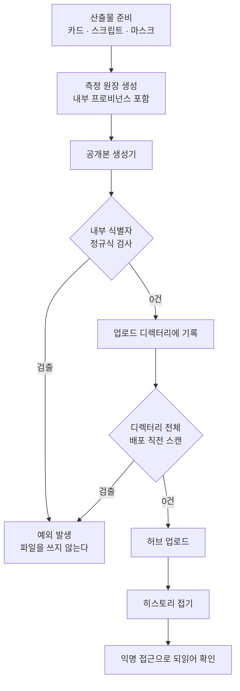

모델이나 어댑터, 마스크 같은 아티팩트를 사내에서 만들어 공개 허브에 올리신다면 이 글에서 가져가실 것은 하나입니다. **공개 위생 검사는 파일 종류가 아니라 시점으로 걸어야 합니다.** 카드와 스크립트를 아무리 꼼꼼히 훑어도, 그 검사 이후에 추가되는 파일이 있으면 검사는 통과하고 정보는 나갑니다.

## 무엇이 새어 나갔나

허깅페이스에 언어별 어휘 마스크 저장소 여섯 개를 공개했습니다. 가중치는 올리지 않고 마스크 JSON과 적용 스크립트, 카드만 올리는 구성이라 노출 면적이 작다고 생각했습니다.

공개 직전에 카드와 스크립트를 훑었고 결과는 깨끗했습니다.

```bash
grep -rEi "레지스트리호스트|클러스터명|s3://|네임스페이스|사내도메인" upload-*/*.md upload-*/*.py
# → 0건
```

그다음에 측정이 끝나서 **원장 JSON을 여섯 저장소에 동봉했습니다.** 그 파일의 환경 블록이 이렇게 생겼습니다.

```json
{
  "base_model": "Qwen/Qwen3.8-27B (prod S3 global/models/..., 32객체)",
  "engine": "inf-cr-dev.<사내도메인>/docker-io-proxy/vllm/vllm-openai:v0.28.0",
  "gpu": "B200 x1 (tkai-dev-compute-b200 / paper-exp)"
}
```

세 줄에 내부 컨테이너 레지스트리 호스트, 쿠버네티스 클러스터 컨텍스트, 네임스페이스, 오브젝트 스토리지 레이아웃이 들어 있습니다. 낯선 사람이 이 저장소를 클론하면 우리 사내 호스트명과 클러스터 구성을 알게 됩니다.

더 중요한 건 이 세 줄이 **과학에는 아무 기여도 하지 않는다**는 점입니다. 재현에 필요한 것은 엔진 버전과 GPU 종류, 서빙 노브이지 그 이미지를 어느 프록시에서 당겼는지가 아닙니다. 즉, 사람 말로는 지워도 아무것도 잃지 않는 줄이었습니다.

## 왜 검사를 통과했나

검사 자체는 정확했습니다. 문제는 **검사한 시점 이후에 파일이 늘었다**는 것입니다.

```
① 카드·스크립트 작성 → ② grep 검사(통과) → ③ 업로드
                                              ↓
                          ④ 측정 완료 → ⑤ 원장 동봉 → ⑥ 재업로드   ← 검사 없음
```

②는 ③만 방어합니다. ⑤는 그 뒤에 일어났고, 그때 다시 검사하지 않았습니다. 사람이 게을러서가 아니라 **검사가 워크플로의 한 지점에 붙어 있었기 때문**입니다. 파일이 늘어나는 지점은 여러 개인데 게이트는 하나였습니다.

여기에 두 번째 요인이 겹칩니다. 원장 JSON은 사람이 손으로 쓴 문서가 아니라 **집계 스크립트가 자동 생성한 파일**입니다. 저는 그 파일을 카드처럼 읽지 않았습니다. 자동 생성물은 검토 대상에서 조용히 빠집니다. 그런데 그 생성기는 실험 프로비넌스를 최대한 담도록 설계돼 있었고, 프로비넌스는 정의상 "어디서 돌았는가"입니다. 내부 정보를 담는 것이 그 파일의 **목적**이었던 셈입니다.

## 지워도 git에는 남습니다

원장을 고쳐 다시 올리면 끝났다고 생각하기 쉽습니다. 허깅페이스 저장소는 git이라 이전 커밋이 그대로 남습니다. 파일을 고쳐도 아래 한 줄이면 옛 내용이 나옵니다.

```bash
git log -p --all -- multiling-masks-*.json | grep -i "<사내도메인>"
```

이건 새로운 함정이 아니라 잘 알려진 것인데도 계속 밟습니다. 트리를 고치는 것과 히스토리를 고치는 것이 다른 작업이라는 사실을 배포 순간에 잊기 때문입니다. 허브가 제공하는 히스토리 접기 기능으로 여섯 저장소를 각각 한 커밋으로 만들고서야 끝났습니다.

```python
from huggingface_hub import HfApi
HfApi().super_squash_history(repo_id=rid, repo_type="model",
                             commit_message="언어별 스크립트 마스크 + 측정 원장")
```

## 무엇을 바꾸면 되나

세 가지를 고쳤습니다. 순서대로 중요합니다.

### 공개본과 내부본을 분리합니다

원장을 지우는 것이 답은 아닙니다. 프로비넌스는 내부에서 재현할 때 반드시 필요합니다. 그래서 원본은 그대로 두고 **공개용 사본을 만드는 생성기**를 따로 뒀습니다. 남길 것과 지울 것의 경계는 "이 줄이 재현에 필요한가"입니다.

| 필드 | 내부 원장 | 공개 원장 |
|---|---|---|
| 엔진 | 사내 레지스트리 경로 포함 | `vllm/vllm-openai:v0.28.0` |
| GPU | 클러스터 컨텍스트 · 네임스페이스 | `NVIDIA B200 x1` |
| 베이스 모델 | S3 프리픽스 · 객체 수 | `Qwen/Qwen3.8-27B` |
| 측정값 · 서빙 노브 | 전부 유지 | **전부 유지** |

### 생성기가 스스로 막게 합니다

공개본을 만드는 코드에 검사를 넣되, 경고가 아니라 **예외를 던지게** 했습니다. 통과하지 못하면 파일이 아예 만들어지지 않습니다.

```python
INTERNAL = re.compile(r"사내레지스트리|사내스토리지|클러스터접두|네임스페이스접두|s3://", re.I)

blob = json.dumps(public_ledger, ensure_ascii=False, indent=2)
hits = INTERNAL.findall(blob)
if hits:
    raise SystemExit(f"⛔ 내부 식별자가 남았다: {sorted(set(hits))}")

for target in upload_dirs:
    (target / "ledger.json").write_text(blob, encoding="utf-8")
```

핵심은 마지막 두 줄의 순서입니다. 검사가 **쓰기보다 먼저** 옵니다. 검사를 통과한 문자열만 파일이 됩니다. 검사가 나중에 오면 잘못된 파일이 디스크에 잠깐이라도 존재하고, 그 잠깐 사이에 다른 단계가 그것을 집어갑니다.

### 게이트를 파일이 아니라 시점에 겁니다

가장 중요한 변경입니다. 검사 대상을 "카드와 스크립트"로 적어두면 목록에 없는 파일이 생길 때마다 구멍이 납니다. 대신 **업로드 디렉터리 전체를 업로드 직전에** 훑습니다.

```bash
grep -rlEi "<내부 식별자 패턴>" upload-*/ || echo "내부 인프라 언급 0건"
```

`upload-*/` 는 무엇이 들어오든 자동으로 포함됩니다. 나중에 원장이 추가되든 로그가 추가되든 같은 게이트를 통과해야 합니다.



마지막 단계를 빼먹기 쉽습니다. 올린 파일을 **토큰 없이 다시 받아서** 확인해야 합니다. 인증된 세션으로 보는 것과 낯선 사람이 보는 것은 다를 수 있고, 우리가 확인하려는 것은 후자입니다.

## 체크리스트

공개 저장소에 아티팩트를 올릴 때 아래를 순서대로 봅니다.

첫째, **자동 생성 파일을 사람이 읽었는가**. 원장, 설정 덤프, 벤치 결과처럼 코드가 만든 파일이 가장 위험합니다. 손으로 쓴 문서는 쓰면서 읽지만 생성물은 아무도 읽지 않습니다.

둘째, **검사 이후에 파일이 추가되지 않았는가**. 추가됐다면 검사를 다시 돌립니다. 이번 사고의 직접 원인이 정확히 이것입니다.

셋째, **트리만 고치고 끝내지 않았는가**. 저장소가 git이면 히스토리도 봅니다. 파일 내용뿐 아니라 파일 경로와 커밋 메시지에도 내부 정보가 들어갑니다.

넷째, **익명으로 되읽었는가**. 배포 후 인증 없이 받아서 확인합니다.

## 운영 관점에서

ThakiCloud는 Metis로 모델을 서빙하고 그 산출물을 외부에 공개하는 일이 늘고 있습니다. 모델 카탈로그에 등록된 체크포인트가 늘수록 "사내 경로를 담은 메타데이터"와 "외부에 나가는 카드" 사이의 경계가 흐려집니다. 이번 사고는 그 경계가 사람의 기억이 아니라 코드에 있어야 한다는 것을 보여줍니다.

Signum이 다루는 감사 관점에서도 같습니다. 무엇이 언제 외부로 나갔는지는 사후에 추적 가능해야 하는데, git 히스토리를 접으면 그 추적성 일부를 스스로 지우게 됩니다. 그래서 접기는 최후 수단이고, 애초에 안 나가게 하는 게이트가 먼저입니다. 이번에는 이미 나간 뒤라 접었지만, 다음부터는 생성기의 예외가 그 앞에서 막습니다.

## 못 믿을 부분

정규식 기반 검사는 **아는 패턴만** 잡습니다. 새 클러스터가 생기거나 호스트명 규칙이 바뀌면 패턴을 갱신해야 하고, 갱신을 잊으면 조용히 통과합니다. 이 게이트는 바닥이지 천장이 아닙니다.

히스토리를 접었다고 유출이 없던 일이 되지도 않습니다. 그 사이에 누군가 클론했다면 그 사본에는 남아 있습니다. 이번 건은 공개 후 짧은 시간이었고 내용도 호스트명 수준이라 위험이 낮다고 판단했지만, 자격증명이었다면 판단이 완전히 달라집니다. 접기는 노출을 줄이는 조치이지 되돌리는 조치가 아닙니다.

그리고 이 글은 **한 번의 사고에서 나온 절차**입니다. 여섯 저장소, 세 필드, 자동 생성 파일 한 종류에서 배운 것이라 일반화에는 한계가 있습니다. 다른 형태의 아티팩트(대용량 가중치, 학습 로그, 데이터셋 샘플)는 또 다른 축에서 샐 수 있습니다.

## 정리

검사 대상을 목록으로 관리하면 목록 밖의 파일이 생길 때마다 뚫립니다. 디렉터리 전체를 배포 직전에 훑고, 공개본 생성기가 검사를 통과하지 못하면 파일을 아예 쓰지 않게 하고, 저장소가 git이면 히스토리까지 봅니다. 그리고 올린 것을 익명으로 되받아 확인합니다.

이번에 공개한 마스크 저장소는 [ThakiCloud 조직 페이지](https://huggingface.co/ThakiCloud)에서 볼 수 있고, 마스크 자체의 측정 결과는 [별도 글](https://thakicloud.com/tech-blog/ko/llmops/script-repertoire-masks/)에 정리했습니다.
