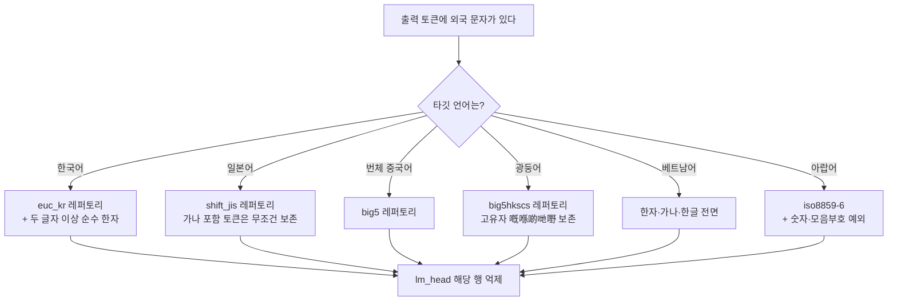

다국어 LLM을 한국어나 일본어, 아랍어 서비스에 붙여 쓰신다면 이 글에서 얻어 가실 것은 하나입니다. **문자 혼입을 막는 필터는 언어마다 새로 설계해야 하고, 그 판정 기준은 간체·번체 축이 아니라 레거시 국가 인코딩입니다.** 한 언어에서 잘 도는 필터를 옆 언어로 옮기면 그 언어의 정상적인 단어가 잘려 나갑니다.

## 쉽게 말하면

글자에는 여권이 있습니다.

한국과 일본, 중국, 대만은 같은 한자를 쓰지만 20세기에 각자 다르게 줄여 썼습니다. 일본은 `國`을 `国`으로 줄였고 중국도 똑같이 `国`으로 줄였습니다. 대만과 한국은 줄이지 않고 `國`을 그대로 씁니다. 그래서 `国`이라는 글자 하나만 놓고 "이건 중국 글자인가"를 물으면 답이 안 나옵니다. 일본 여권도 있고 중국 여권도 있는 글자거든요.

이 글의 방법은 그 여권 목록을 어디서 구하느냐입니다. 나라마다 컴퓨터가 자기 문자를 담으려고 만든 옛 인코딩 규격이 있고, 그게 사실상 **그 나라가 자기 글자라고 인정한 목록**입니다. 일본은 Shift-JIS, 대만은 Big5, 홍콩은 Big5-HKSCS, 아랍어권은 iso8859-6 입니다. 이 목록을 그대로 여권 검사대로 쓰면 됩니다.

## 무엇을 해봤나

지난주에 한국어 응답의 한자 혼입을 줄이는 마스크를 만들었습니다. 모델의 출력층에서 중국어 단어에 해당하는 토큰 54,902개의 행을 눌러 그 단어가 나오지 않게 하는 방식이고, 한국어 오염률을 2.6%에서 0.7%로 낮췄습니다. 한자 병기는 그대로 살아남았습니다.

이번에는 그 마스크를 다른 언어로 옮길 수 있는지 봤습니다. 방법은 단순합니다. 각 언어의 상용어를 토크나이저에 넣어 그 토큰이 마스크에 걸리는지 세면 됩니다. GPU가 필요 없고 몇 초면 끝납니다.

## 나온 결과

### 일본어에서는 방법이 통째로 뒤집힙니다

한국어 마스크를 일본어 상용어 12개에 대 봤더니 **11개가 잘렸습니다.**

```
日本語 잘림 · 会議 잘림 · 時間 잘림 · 電話 잘림 · 勉強 잘림 · 経済 잘림
国際 잘림 · 実際 잘림 · 学校 잘림 · 写真 잘림 · 広告 잘림     (気持 만 생존)
```

원인은 마스크의 핵심 규칙에 있습니다. 한국어 마스크는 "한자 두 글자 이상이 붙어 있으면 중국어 단어"로 판정합니다. 한국어가 한자를 `개항(開港)`처럼 낱글자 풀이로만 쓰기 때문에 성립하는 규칙입니다. 그런데 일본어에서 한자 두 글자가 붙은 단어는 중국어가 아니라 **일본어 그 자체**입니다. 규칙의 전제가 반대로 뒤집힙니다.

즉, 사람 말로는 한국어에서 "수상한 신호"였던 것이 일본어에서는 "가장 정상적인 문장"입니다.

### 간체·번체 변환기로 신자체를 가릴 수 없습니다

더 조용한 함정이 하나 더 있었습니다. "중국 간체만 자르면 되지 않나" 싶어 흔히 쓰는 변환기(OpenCC)로 판정해 보면, 일본 신자체가 간체로 오인됩니다.

| 글자 | 변환기 판정 | 실제 |
|---|---|---|
| 国 学 会 写 独 当 来 | 간체로 판정 → 잘림 | 일본 신자체이자 중국 간체 |
| 実 気 広 経 歩 | 변화 없음 → 보존 | 일본 신자체 |

일본과 중국이 각자 글자를 줄였는데 **겹치는 결과가 많습니다.** 그래서 "줄인 글자인가"를 묻는 축으로는 두 나라를 가를 수 없습니다. 반면 Shift-JIS 에 들어 있는지를 물으면 `国`·`学`·`会`는 통과하고 `这`·`们`·`说`·`华`는 걸립니다. 이 판정으로 일본어 마스크를 다시 만들자 상용어 12개가 전부 살아남았고 중국어 8개가 전부 걸렸습니다.

### 번체 마스크는 광둥어를 잘라냅니다

번체 중국어용으로 Big5 판정을 쓰면 잘 돕니다. 간체 전용자와 일본 신자체가 한 번에 걸리거든요. 그런데 그 마스크를 광둥어에 쓰면 광둥어가 자기 글자를 잃습니다.

광둥어 고유자 11개를 검사하니 **5개(`嘅` `喺` `啲` `哋` `嘢`)가 Big5 밖**이었습니다. 홍콩 확장 규격인 Big5-HKSCS 로 바꾸면 11개가 전부 안에 들어옵니다. HKSCS 가 정확히 이 글자들을 담으려고 만들어진 규격이기 때문입니다.

대가도 있습니다. HKSCS 는 레퍼토리가 넓어서 일본 신자체 `実`을 포함합니다. 그래서 광둥어 마스크는 번체 마스크보다 신자체를 덜 막습니다. 광둥어 고유자를 살리는 값이고, 둘을 동시에 만족시키는 인코딩은 없었습니다.

### 아랍어는 아예 다른 문제였습니다

아랍어 문장을 토크나이저에 넣고 한국어 마스크와 겹치는 토큰을 세어 보니 **정확히 0개**였습니다. 문자 자체가 겹치지 않으니 당연합니다. 아랍어는 옮겨 심을 대상이 아니라 새로 설계할 대상이었습니다.

아랍어 출력에서 실제로 새는 것은 같은 문자 블록을 쓰는 **페르시아어와 우르두어 정서법**입니다. 눈에 잘 안 띄는 두 쌍이 특히 문제입니다.

| 표준 아랍어 | 페르소·우르두 | 겉보기 |
|---|---|---|
| ي (YEH) | ی (FARSI YEH) | 거의 같음 |
| ك (KAF) | ک (KEHEH) | 거의 같음 |

사람 눈으로는 잘 안 보이는데 검색과 정규화, 음성 합성은 전부 깨집니다. 여기에 아랍어에 없는 자음 `پ چ ژ گ`와 우르두 전용 글자가 더해집니다. iso8859-6 판정으로 이들을 걸러내되, 아랍-인도 숫자와 모음부호는 그 규격 밖이라 따로 살려 뒀습니다.

### 프로브가 제 실수를 하나 잡았습니다

아랍어 마스크를 만들면서 경칭 리가처 `ﷺ`를 오염원으로 분류해 뒀었습니다. 아랍어 본문에서 정상적으로 쓰이는 글자인데 착각한 겁니다. 보존 검사에 넣어 돌리자 바로 걸렸고, 그 김에 더 공격적인 티어가 이 글자와 `ﷲ`를 함께 자른다는 것도 드러났습니다. 그래서 그 티어는 기본값에서 뺐습니다.

## 그래서 무엇을 바꾸면 되나

바꿀 것은 두 가지입니다.

첫째, **판정 기준을 레거시 국가 인코딩으로 옮깁니다.** 간체·번체 축은 중국어 안에서만 유효하고 국경을 넘는 순간 틀립니다. 인코딩 판정은 파이썬 표준 라이브러리만으로 되고 외부 의존성이 없습니다.

둘째, **티어 구조를 언어마다 따로 정합니다.** 마스크를 여러 단계로 나누는 이유는 "정당한 겹침"이 있어서인데, 그 겹침의 크기가 언어마다 다릅니다. 한국어는 한자 병기를 살려야 해서 세 단계가 필요하고, 베트남어는 현대 정서법에 한자가 아예 없어서 전면 마스킹이 곧 최적이라 단계가 하나입니다. 단계 수를 통일하려 하면 어느 한쪽이 반드시 틀립니다.

여섯 언어의 마스크와 적용 스크립트를 공개했습니다. 가중치는 올리지 않았습니다. 바뀌는 텐서가 출력층 하나뿐이라 55.6GB 사본을 만드느니 원본을 받아 스크립트를 돌리는 편이 낫고, 그 편이 베이스 모델 갱신도 따라갑니다.

| 언어 | 판정 기준 | 기본 마스크 크기 |
|---|---|---|
| 한국어 | 간체·가나 + 두 글자 이상 순수 한자 | 54,902 |
| 일본어 | Shift-JIS 레퍼토리 | 24,795 |
| 번체 중국어 | Big5 레퍼토리 | 32,211 |
| 광둥어 | Big5-HKSCS 레퍼토리 | 24,743 |
| 베트남어 | 한자·가나·한글 전면 | 65,695 |
| 아랍어 | iso8859-6 + 숫자·모음부호 예외 | 815 |



이 갈래를 하나로 합치려 하면 반드시 어느 한 언어가 깨집니다. 일본어 가지를 번체 가지로
대신하면 신자체가 전멸하고, 광둥어 가지를 번체 가지로 대신하면 고유자가 사라집니다.


## 못 믿을 부분

여기서부터가 중요합니다.

**측정이 끝난 것은 한국어 하나뿐입니다.** 나머지 다섯 언어는 마스크가 무엇을 자르고 무엇을 남기는지까지만 확인했고, 실제로 오염률이 얼마나 내려가는지는 재지 않았습니다. 능력 회귀도 재지 않았습니다. 각 저장소 카드 맨 위에 이 사실을 적어 뒀습니다.

이게 조심스러운 이유가 있습니다. 같은 레시피를 작은 모델(Qwen3.5-0.8B)에 적용했을 때 예측값 0.2%와 실측값 1.3%가 어긋난 적이 있습니다. 왜 어긋났는지는 아직 모릅니다. 토크나이저에서 맞는 것이 생성에서도 맞다는 보장이 없다는 뜻입니다.

일본어 마스크에도 알려진 구멍이 있습니다. `个`는 중국어에서 매우 흔한 글자인데 Shift-JIS 에 들어 있어서 보존됩니다. 인코딩 판정의 위양성입니다.

그리고 이 기법 전체의 한계가 하나 있습니다. **영어 혼입은 이 방식으로 못 고칩니다.** 영어 토큰은 코드와 고유명사, 단위 때문에 반드시 살려야 하므로 잘라낼 수 있는 오염원이 아닙니다. 태국어나 인도네시아어처럼 주된 혼입이 영어인 언어에는 이 방법이 닿지 않습니다.

## 저장소

[한국어](https://huggingface.co/ThakiCloud/Qwen3.8-27B-ko-cjk-suppressed) · [일본어](https://huggingface.co/ThakiCloud/Qwen3.8-27B-ja-cjk-suppressed) · [번체 중국어](https://huggingface.co/ThakiCloud/Qwen3.8-27B-zhTW-cjk-suppressed) · [광둥어](https://huggingface.co/ThakiCloud/Qwen3.8-27B-yue-cjk-suppressed) · [베트남어](https://huggingface.co/ThakiCloud/Qwen3.8-27B-vi-cjk-suppressed) · [아랍어](https://huggingface.co/ThakiCloud/Qwen3.8-27B-ar-script-suppressed)

같은 방향의 선행 연구로 [smoothie-qwen](https://github.com/dnotitia/smoothie-qwen)이 있습니다. 출력층 조정으로 중국어를 억제하는 사전조정본을 배포하고 있고, 이 글이 더한 것은 타깃 언어별 레퍼토리 판정과 언어마다 다른 티어 구조입니다.
