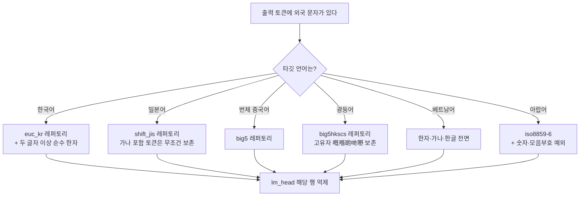

다국어 LLM을 한국어나 일본어, 중국어 서비스에 붙여 쓰신다면 이 글에서 가져가실 것은 세 가지입니다. **문자 혼입 필터는 언어마다 새로 설계해야 하고, 그 판정 기준은 간체·번체 축이 아니라 레거시 국가 인코딩이며, 효과는 생성 온도에 따라 완전히 달라 보입니다.**

## 쉽게 말하면

글자에는 여권이 있습니다.

한국과 일본, 중국, 대만은 같은 한자를 쓰지만 20세기에 각자 다르게 줄여 썼습니다. 일본은 `國`을 `国`으로 줄였고 중국도 똑같이 `国`으로 줄였습니다. 대만과 한국은 줄이지 않고 `國`을 그대로 씁니다. 그래서 `国`이라는 글자 하나만 놓고 "이건 중국 글자인가"를 물으면 답이 안 나옵니다. 일본 여권도 있고 중국 여권도 있는 글자거든요.

이 글의 방법은 그 여권 목록을 어디서 구하느냐입니다. 나라마다 컴퓨터가 자기 문자를 담으려고 만든 옛 인코딩 규격이 있고, 그게 사실상 **그 나라가 자기 글자라고 인정한 목록**입니다. 일본은 Shift-JIS, 대만은 Big5, 홍콩은 Big5-HKSCS, 아랍어권은 iso8859-6 입니다. 이 목록을 여권 검사대로 씁니다.

## 무엇을 해봤나

지난주에 한국어 응답의 한자 혼입을 줄이는 마스크를 만들었습니다. 모델 출력층에서 중국어 단어에 해당하는 토큰의 행을 눌러 그 단어가 나오지 않게 하는 방식입니다.

이번에는 그 마스크를 다른 언어로 옮길 수 있는지 보고, 옮길 수 없다는 것을 확인한 뒤 언어별로 다시 설계했습니다. 그리고 다섯 언어에서 각 300개 프롬프트로 마스크를 걸었을 때와 안 걸었을 때를 짝지어 측정했습니다. 온도는 0과 1.0 두 조건에서 각각 쟀습니다.

## 나온 결과

### 한국어 마스크는 일본어에서 통째로 뒤집힙니다

한국어 마스크를 일본어 상용어 12개에 대 봤더니 **11개가 잘렸습니다.**

```
日本語 잘림 · 会議 잘림 · 時間 잘림 · 電話 잘림 · 勉強 잘림 · 経済 잘림
国際 잘림 · 実際 잘림 · 学校 잘림 · 写真 잘림 · 広告 잘림     (気持 만 생존)
```

한국어 마스크는 "한자 두 글자 이상이 붙어 있으면 중국어 단어"로 판정합니다. 한국어가 한자를 `개항(開港)`처럼 낱글자 풀이로만 쓰기 때문에 성립하는 규칙입니다. 그런데 일본어에서 한자 두 글자가 붙은 단어는 중국어가 아니라 **일본어 그 자체**입니다.

즉, 사람 말로는 한국어에서 "수상한 신호"였던 것이 일본어에서는 "가장 정상적인 문장"입니다.

### 간체·번체 변환기로는 신자체를 가릴 수 없습니다

"중국 간체만 자르면 되지 않나" 싶어 흔히 쓰는 변환기(OpenCC)로 판정하면, 일본 신자체가 간체로 오인됩니다.

| 글자 | 변환기 판정 | 실제 |
|---|---|---|
| 国 学 会 写 独 当 来 | 간체로 판정 → 잘림 | 일본 신자체이자 중국 간체 |
| 実 気 広 経 歩 | 변화 없음 → 보존 | 일본 신자체 |

일본과 중국이 각자 글자를 줄였는데 겹치는 결과가 많습니다. 반면 Shift-JIS 에 들어 있는지를 물으면 `国`·`学`·`会`는 통과하고 `这`·`们`·`说`·`华`는 걸립니다.

### 번체 마스크는 광둥어를 잘라냅니다

번체 중국어용으로 Big5 판정을 쓰면 간체 전용자와 일본 신자체가 한 번에 걸려 잘 돕니다. 그런데 그 마스크를 광둥어에 쓰면 광둥어가 자기 글자를 잃습니다. 광둥어 고유자 11개 중 **5개(`嘅` `喺` `啲` `哋` `嘢`)가 Big5 밖**입니다. 홍콩 확장인 Big5-HKSCS 로 바꾸면 11개가 전부 들어옵니다.

### 그래서 얼마나 내려갔나

각 언어 300 프롬프트, 같은 엔드포인트에서 짝지어 측정했습니다.

| 언어 | T=0 base → 마스크 | T=1.0 base → 마스크 | 판정 |
|---|---|---|---|
| 번체 중국어 | 8.0% → 0.0% | **40.0% → 1.3%** | 유의 (p < 0.001) |
| 광둥어 | 2.3% → 0.3% | **20.3% → 0.7%** | 유의 (p < 0.001) |
| 일본어 | 0.7% → 0.3% | **5.0% → 0.3%** | 유의 (p = 0.001) |
| 베트남어 | 0.0% → 0.0% | 2.0% → 0.0% | 경계 (p = 0.04) |
| 아랍어 | 0.3% → 0.0% | 0.3% → 0.3% | **효과 없음** |

즉, 사람 말로는 네 언어에서 마스크가 실제로 들었고 한 언어에서는 고칠 것이 없었습니다.

### 온도를 안 재면 절반은 답이 안 나옵니다

가장 중요한 발견입니다. **T=0 만 쟀다면 다섯 중 넷이 "효과 없음"으로 보였을 것입니다.** 그런데 그건 마스크가 안 듣는 게 아니라 base 오염이 바닥이라 잴 것이 없었던 겁니다.

온도를 1.0으로 올리자 base 오염률 자체가 뛰었습니다. 번체는 5.0배, 광둥어는 8.7배, 일본어는 7.5배입니다. 한국어에서 관측했던 5배가 다른 언어에서도 재현됐습니다.

베트남어가 특히 선명합니다. T=0 에서는 300건 중 오염이 **0건**이라 잴 것이 없었는데, T=1.0 에서는 2.0%가 나왔고 마스크가 그것을 0으로 만들었습니다.

### 대가는 없었습니다

마스크가 능력을 깎았는지도 쟀습니다. HumanEval 164문항과 MMLU 200문항으로 base와 각 마스크를 비교했습니다.

| 축 | base | 마스크 팔 범위 | 최소검출차 |
|---|---|---|---|
| coding | 94.5% | 94.5 ~ 95.7% | 7.1%p |
| english | 80.5% | 전 팔 80.5% | 11.1%p |

회귀가 없습니다. 다만 이 두 축은 마스크된 문자를 애초에 쓰지 않아서 회귀를 잡는 힘이 구조적으로 약합니다. 그래서 별도로, 각 언어가 반드시 써야 하는 표현을 요구하고 답에 살아 있는지 확인하는 프로브를 돌렸습니다. 다섯 언어 30문항에서 **마스크 때문에 깨진 것은 0건**이었습니다.

## 그래서 무엇을 바꾸면 되나

판정 기준을 레거시 국가 인코딩으로 옮기고, 티어 구조를 언어마다 따로 정합니다. 마스크를 여러 단계로 나누는 이유는 정당한 겹침을 지키기 위해서인데 그 겹침의 크기가 언어마다 다릅니다. 한국어는 한자 병기를 살려야 해서 세 단계가 필요하고, 베트남어는 현대 정서법에 한자가 없어서 전면 마스킹이 곧 최적이라 단계가 하나입니다.

그리고 **서빙 온도를 먼저 확인하십시오.** 마스크를 붙이기 전에 온도를 내리는 것만으로 오염의 상당 부분이 사라집니다. 반대로 온도를 올려 쓰는 서비스라면 마스크의 값어치가 그만큼 큽니다.

여섯 언어의 마스크와 적용 스크립트를 공개했습니다. 가중치는 올리지 않았습니다. 바뀌는 텐서가 출력층 하나뿐이라 55.6GB 사본을 만드느니 원본을 받아 스크립트를 돌리는 편이 낫고, 그 편이 베이스 모델 갱신도 따라갑니다.



이 갈래를 하나로 합치려 하면 반드시 어느 한 언어가 깨집니다. 일본어 가지를 번체 가지로 대신하면 신자체가 전멸하고, 광둥어 가지를 번체 가지로 대신하면 고유자가 사라집니다.

## 못 믿을 부분

**아랍어는 널이었습니다.** 두 온도 모두 base 오염률이 0.3%였고 마스크가 그것을 바꾸지 못했습니다. 마스크가 나쁘다는 뜻이 아니라 이 모델이 우리 300개 프롬프트에서는 페르시아어·우르두어 정서법을 섞지 않는다는 뜻입니다. 다른 모델이나 페르시아어 인접 주제에서는 다를 수 있습니다.

**판정 기준이 마스크와 같습니다.** 오염 문자를 세는 기준이 마스크가 토큰을 고르는 기준과 같은 레퍼토리입니다. 자명하게 0이 되지는 않지만 독립적인 지표는 아닙니다.

**Big5 는 간체처럼 보이는 글자 일부를 품고 있습니다.** `种` `机` `确` `制` `价` 는 드문 번체 글자이기도 해서 Big5 안에 있고, 그래서 마스크도 지표도 이들을 못 봅니다. 번체 수치는 "Big5 가 볼 수 있는 간체 오염"의 감소분입니다. 일본어 쪽에도 같은 구멍이 있어서 중국어에서 흔한 `个` 가 Shift-JIS 에 있다는 이유로 살아남습니다.

**베트남어와 광둥어의 일부 수치는 경계값입니다.** 단일 런이라 결정에 쓰려면 반복 측정이 필요합니다. 반복 런을 돌리지 않았으므로 런간 산포도 모릅니다.

**프롬프트는 원어민 검수를 받지 않았습니다.** 모델이 템플릿과 주제를 조합해 만든 문장이라 문법 오류가 섞여 있을 수 있습니다.

그리고 이 측정은 가중치를 실제로 고친 것이 아니라 추론 시점에 같은 토큰을 누르는 방식으로 대신했습니다. 27B에서는 두 방식이 0.03%p 안에서 일치했지만, 더 작은 모델에서는 어긋난 전례가 있습니다.

## 저장소

[한국어](https://huggingface.co/ThakiCloud/Qwen3.8-27B-ko-cjk-suppressed) · [일본어](https://huggingface.co/ThakiCloud/Qwen3.8-27B-ja-cjk-suppressed) · [번체 중국어](https://huggingface.co/ThakiCloud/Qwen3.8-27B-zhTW-cjk-suppressed) · [광둥어](https://huggingface.co/ThakiCloud/Qwen3.8-27B-yue-cjk-suppressed) · [베트남어](https://huggingface.co/ThakiCloud/Qwen3.8-27B-vi-cjk-suppressed) · [아랍어](https://huggingface.co/ThakiCloud/Qwen3.8-27B-ar-script-suppressed)

각 저장소에 측정 원장(`multiling-masks-20260901.json`)을 함께 올려 두었습니다. 같은 방향의 선행 연구로 [smoothie-qwen](https://github.com/dnotitia/smoothie-qwen)이 있습니다.

측정은 B200 한 장에서 vLLM 0.28.0 으로 돌렸고 전체 소요는 약 90분이었습니다.
