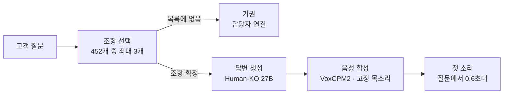

자기 모델을 회사 안에 두고 싶은데 어디서부터 시작해야 할지 모르겠다면, 이 글이 그 출발점 하나를 보여드립니다. 이틀 전 저희가 공개한 한국어 27B 가중치를 받아, 금융감독원 표준약관 452개 조항을 붙여 보험 상담원을 만들었습니다. 도메인 학습은 하지 않았고, 답을 만드는 모델도 목소리를 만드는 합성기도 전부 저희 GPU 위에서 돌았습니다. 바깥으로 나간 요청은 없습니다.

<video controls playsinline preload="none" poster="{{ site.url }}{{ site.baseurl }}/assets/images/humanko-insurance-multiturn-poster.jpg" style="max-width:100%">
  <source src="{{ site.url }}{{ site.baseurl }}/assets/videos/posts/humanko-insurance-multiturn.mp4" type="video/mp4">
</video>
*소리를 켜고 보시기를 권합니다. 네 턴을 한 번에 찍은 화면입니다. 첫 질문에 답하고, 이어서 뜬 질문 버튼을 누르고, "그건 며칠 걸려요"라는 지시어를 앞 턴으로 풀어내고, 마지막으로 약관에 없는 질문에는 기권합니다. 들리는 목소리는 다시 만든 것이 아니라 그때 브라우저가 받은 소리 그대로입니다.*

## 왜 이 답이어야 하나

*한 턴을 정지 화면으로 본 것입니다. 근거 조항 세 개가 답 위에 붙고, 아래에는 다시 듣기와 이어서 물어볼 질문 세 개, 그리고 조항 선택 0.158초·답변 0.321초라는 그 턴의 실측이 그대로 찍힙니다.*

화면에 뜨는 답과 목소리로 나가는 답은 다른 물건입니다. 화면이라면 불릿 여덟 개를 세워도 눈이 알아서 건너뜁니다. 목소리는 건너뛸 수가 없습니다. 상담원이 천 자를 읽는 동안 고객은 끊습니다.

위 영상의 세 번째 답은 "서류를 접수한 날부터 사흘 안에 보험금을 지급해 드립니다"입니다. 서른두 글자입니다. 여기서 눈여겨볼 것은 길이가 아니라 **사흘**입니다. 약관 원문은 "3영업일 이내"라고 씁니다. 저희가 그 표현을 그대로 읽히자 합성이 무너졌습니다. 음성 합성기는 아라비아 숫자에 단위가 붙은 형태를 안정적으로 읽지 못합니다. 같은 내용을 고유어로 풀어 쓰자 통과했습니다.

그래서 모델에게 숫자 규칙을 프롬프트로 지시하는 대신, 짧은 존댓말 산문을 기본값으로 갖는 모델을 쓰고 그 위에 규칙을 얹었습니다. 지시를 잊어서 생기는 사고 한 건의 비용을 생각하면, 이 자리에서는 기본값이 지시보다 쌉니다.

## 약관은 학습이 아니라 검색이 댑니다

*약관은 이 그림에서 가중치 안이 아니라 조항 선택 단계의 바깥에 있습니다. 개정되면 그 상자만 다시 만듭니다.*

이 데모에서 모델은 약관을 배운 적이 없습니다. 배우게 하지 않은 것이 설계입니다.

약관은 개정됩니다. 가중치에 넣으면 개정될 때마다 다시 학습해야 하고, 무엇보다 답이 어느 조항에서 나왔는지 추적할 수 없습니다. 규제 산업에서 추적 불가능한 답은 답이 아닙니다. 그래서 약관은 바깥에 두고 검색이 대게 했습니다. 개정되면 인덱스만 다시 만들면 됩니다.

원단은 금융감독원 표준약관입니다. 보험업감독업무시행세칙 별표15로 공시된 문서이고, 저희가 쓴 것은 2026년 6월 15일 게시본입니다. 10개 상품군에서 452개 조항을 뽑았습니다.

여기서 비싼 함정을 하나 밟았습니다. 원본은 한글 문서인데, 표준 변환 도구로 텍스트를 뽑으면 **표가 통째로 사라집니다.** 보험료 산출표나 지급 사유표가 조용히 없어지고, 남은 본문만 보면 멀쩡해 보입니다. 다른 경로로 재변환해 199개 중 193개를 되살렸습니다. 남은 네 개는 조 제목 바깥에 있어서 어느 조항에 붙일지 판정할 수 없었습니다. 지어내지 않고 그대로 뒀습니다.

## 조항을 고르게 했더니 정확도가 갈렸습니다

처음에는 평범하게 했습니다. 질문을 그대로 검색어로 써서 약관 본문을 검색했습니다. 잘 안 됐습니다.

이유는 사람이 묻는 말과 약관이 쓰는 말이 다르기 때문입니다. 고객은 "보험금을 못 받는 경우가 뭐예요"라고 묻는데 약관은 "보험금을 지급하지 아니하는 사유"라고 씁니다. 그래서 모델에게 검색어를 다시 쓰게 해봤는데, 더 나빠졌습니다. 모델이 "지급거절"처럼 약관에 없는 말을 지어냈기 때문입니다.

풀린 것은 방향을 뒤집었을 때였습니다. 검색어를 **만들게** 하지 말고, 그 상품의 조항 제목 목록을 통째로 보여준 뒤 **고르게** 했습니다.

*검색어를 만들게 하는 모든 방식이 0.3 언저리에 머무는 동안, 고르게 하는 방식만 1.000에 닿았습니다.*

상위 다섯 개까지 넓혀 봐도 순서는 같습니다. 재보고 버린 것까지 전부 적으면 이렇습니다.

| 검색 방식 | recall@1 | recall@5 |
|---|---|---|
| 약관 본문 검색 | 0.286 | 0.571 |
| 제목 가중치 3배 | 0.286 | 0.429 |
| 모델이 검색어 재작성 | 0.000 | 0.429 |
| 상품 필터 추가 | 0.286 | 0.714 |
| **닫힌 목록에서 조항 선택** | **1.000** | **1.000** |

문항 7개로는 천장에 붙어 아무것도 못 재기에 32개로 늘렸습니다. 거기서 0.812가 나왔고, 원인을 파 보니 모델이 아니라 저희 코드였습니다. 모델이 "없음"이라고 답해도 폴백 검색이 그 답을 덮어쓰고 있었습니다. 고친 뒤 0.969입니다.

## 없으면 없다고 합니다

보험에서 제일 비싼 답은 틀린 답입니다. 그래서 조항 목록에 답이 없으면 억지로 고르지 말고 "없음"이라고만 답하게 했습니다.

이 경로는 별도로 잽니다. 평가셋 32문항 중 여섯 개가 "약관에 답이 없어야 정상"인 함정 문항이고, 그중 다섯 개에서 정상적으로 기권합니다. 화면에서는 초록색 기권 표시가 뜨고 담당자 연결을 제안합니다.

앞서 말한 폴백 결함이 정확히 이 축을 망가뜨리고 있었습니다. 모델은 제대로 기권하고 있었는데 코드가 그 판단을 덮어써서, 지표만 보면 모델이 못하는 것처럼 보였습니다. 지표가 나쁠 때 모델부터 의심하면 이런 걸 놓칩니다.

## 목소리는 고정됩니다

데모를 만드는 동안 답변마다 목소리가 바뀌었습니다. 버그처럼 보이지만 아닙니다. 음성 모델에 기준이 될 목소리를 주지 않으면 호출할 때마다 화자를 새로 뽑기 때문입니다. 저희 코드가 그 기준을 넘기지 않고 있었습니다.

기준 음성 하나를 지정하자 고정됐습니다. 아래 영상은 같은 질문 세 개를 두 번 물은 것입니다. 앞 절반은 지정 전, 뒤 절반은 지정 후입니다. 화면은 똑같고 소리만 다릅니다.

<video controls playsinline preload="none" poster="{{ site.url }}{{ site.baseurl }}/assets/images/humanko-insurance-voice-ab-poster.jpg" style="max-width:100%">
  <source src="{{ site.url }}{{ site.baseurl }}/assets/videos/posts/humanko-insurance-voice-ab.mp4" type="video/mp4">
</video>
*앞 절반은 답변마다 다른 사람이 말하고, 뒤 절반은 한 사람이 말합니다.*

이걸 눈으로 확인할 방법이 없어서 재는 데도 한 번 헤맸습니다. 처음에는 음높이로 재봤는데 후보 여섯 개가 전부 100헤르츠에서 109헤르츠 사이라 아무것도 갈리지 않았습니다. 소리의 결을 재는 다른 지표도 마찬가지로 천장에 붙었습니다. 두 지표 모두 **같은 문장**으로 쟀기 때문입니다. 같은 문장은 어떻게 읽어도 비슷하게 측정됩니다.

사람이 실제로 다르다고 느낀 조건은 서로 다른 문장이었습니다. 조건을 그렇게 바꾸고 화자 임베딩으로 재자 갈렸습니다. 지정 전에는 샘플끼리 유사도가 0.655, 지정 후에는 0.928입니다. 두 분포의 범위가 겹치지 않습니다.

*지정 전 샘플끼리의 범위와 지정 후 범위 사이에 빈 구간이 있습니다. 두 번째 줄이 그 구간에 걸치는 것은 목표 목소리와의 비교라 다른 축입니다.*

지표가 "차이가 없다"고 말할 때 그것이 "차이가 없다"는 뜻인지 "이 자로는 잴 수 없다"는 뜻인지는 다른 문제입니다. 여기서는 후자였습니다.

## 얼마나 빠른가

질문을 보내고 첫 소리가 날 때까지 0.6초대입니다. 위 영상에 찍힌 세 번의 답변 턴이 각각 0.59초, 0.63초, 0.66초였습니다.

숫자를 하나만 적지 않는 이유가 있습니다. 같은 경로를 별도 스크립트로 열다섯 번 재면 중앙값이 0.84초로 나옵니다. 차이는 그 스크립트가 요청할 때마다 새 연결을 열기 때문입니다. 브라우저는 연결을 재사용합니다. 둘 다 맞는 숫자이고, 사람이 실제로 겪는 쪽은 앞의 것입니다.

내역은 둘로 나뉩니다. 조항을 고르고 답을 만드는 데 0.5초, 그 문장의 첫 음성 조각이 도착하는 데 나머지입니다. 뒤쪽 대부분은 실제 합성이 아니라 노트북과 GPU 사이 왕복입니다. 파드 안에서 재면 첫 조각까지 31밀리초입니다. 영상 화면에 뜨는 "첫 소리 117밀리초"가 그 구간이고, 질문부터 재면 0.6초대가 됩니다.

여기까지 오는 데 한 번 크게 틀렸습니다. 처음 실측했을 때는 2.61초였습니다. 원인이 둘이었고 둘 다 저희 코드였습니다.

하나는 타자 효과였습니다. 답변은 이미 완성돼 있는데 화면에 한 글자씩 흘리는 연출을 넣어 뒀고, 서버가 그 연출을 **다 끝낸 뒤에야** 합성을 시작하고 있었습니다. 쉰네 글자면 0.65초를 아무것도 하지 않고 버린 셈입니다. 다른 하나는 이중 합성이었습니다. 서버가 다시듣기용 음성 파일을 통째로 만들고, 브라우저가 재생을 위해 또 한 번 합성을 요청하는데, GPU 쪽에서 두 요청이 줄을 서면서 재생이 그만큼 밀렸습니다.

완성된 문장을 먼저 보내 브라우저가 곧바로 소리를 열게 하고, 다시듣기 파일은 사용자가 재생 버튼을 눌렀을 때만 만들도록 바꿨습니다. 그래서 같은 스크립트로 잰 값이 2.61초에서 0.84초로 내려왔습니다. 모델을 바꾸지 않았고, GPU를 늘리지도 않았습니다.

*같은 스크립트로 잰 값입니다. 모델을 키우지도 GPU를 늘리지도 않았고, 순서만 바꿨습니다.*

이 숫자가 통화 지연이 아니라는 점은 분명히 해 둡니다. 음성 인식과 고객이 말을 끝냈는지 판단하는 시간이 앞에 더 붙습니다. 여기서 잰 것은 타이핑한 질문에서 첫 소리까지입니다.

## 못 하는 것

보험 도메인 학습은 하지 않았습니다. 이 데모는 검색과 기존 모델만으로 섰습니다. 도메인 학습을 얹으면 더 나아질 여지가 있다는 뜻이기도 하고, 지금 성능이 학습 덕이 아니라는 뜻이기도 합니다.

전화망에는 아직 붙지 않았습니다. 위 수치는 타이핑한 질문에서 첫 소리까지이고, 실제 통화라면 음성 인식과 발화가 끝났는지 판단하는 시간이 앞에 더 붙습니다.

평가셋은 32문항입니다. 이 규모에서 0.969는 한 문항이 0.03을 좌우한다는 뜻이므로, 추세로 읽으면 안 됩니다.

합성이 매번 같지 않습니다. 그래서 데모에 쓸 문장을 미리 걸렀습니다. 질문 일곱 개의 답을 각각 다섯 번씩 합성하고, 그것을 다시 음성 인식으로 받아 원문과 대조했습니다.

| 질문 | 답변 첫머리 | 실패 | 중앙 유사도 |
|---|---|---|---|
| 청구 방법 | 청구서와 사고증명서… | 0/5 | 1.000 |
| 지급 기한 | 서류를 접수한 날부터… | 0/5 | 1.000 |
| 미납 시 | 납입기일 이후… | **5/5** | 0.836 |
| 수익자 변경 | 네, 수익자를… | 1/5 | 1.000 |
| 계약 취소 | 보험증권을 받은 날부터… | 0/5 | 0.911 |
| 통지 기한 | 사고를 안 즉시… | 0/5 | 1.000 |
| 기권 유도 | 말씀하신 내용은… | 0/5 | 1.000 |

"납입기일 이후"로 시작하는 답은 다섯 번 다 걸렸습니다. 다만 이건 합성 결함이라고 단정할 수 없습니다. 진짜 비결정성이라면 틀리는 모양도 매번 달라야 하는데, 열 번을 재도 똑같이 "나비길"로만 읽혔습니다. 음성 인식이 그 한자어를 구조적으로 못 알아듣는 쪽일 가능성이 큽니다. 어느 쪽인지 가릴 수 없어서 판정은 보류하고 데모에서만 뺐습니다.

"네, 수익자를"로 시작하는 답은 다섯 번 중 한 번 "네"가 "내"로 바뀌었습니다. 이건 진짜 합성 결함입니다. 계약 취소 답변은 게이트를 통과했지만 한 번 "철회"가 "처리"로 바뀌었습니다. 뜻이 완전히 달라지는 단어인데 저희 임계값을 아슬아슬하게 넘겼습니다. 임계값이 의미까지 지켜주지는 않습니다.

표 네 개는 아직 어느 조항에도 붙어 있지 않습니다.

## 그래서 소버린이 가능합니다

위 데모에서 바깥으로 나간 요청은 없습니다. 답을 만든 27B도, 목소리를 만든 합성기도 저희 GPU 위에 있었고, 약관 색인은 로컬 파일입니다. 외부 모델 회사의 API를 호출한 구간이 한 곳도 없습니다.

이게 가능한 이유는 하나뿐입니다. 가중치가 공개돼 있기 때문입니다. 남의 API를 빌려 쓰면 고객의 질문과 회사의 약관이 매번 남의 서버를 지나갑니다. 가중치를 받아 두면 그 왕복 자체가 사라집니다.

소버린 AI를 이야기하는 회사는 이미 많습니다. 다만 대부분 모델이 닫혀 있습니다. 닫힌 모델로 하는 "우리 안에 둡니다"는 약속이고, 열린 가중치로 하는 같은 말은 받아서 확인할 수 있는 사실입니다. [Human-KO 27B는 지금 내려받을 수 있습니다](https://huggingface.co/ThakiCloud/Qwen3.8-27B-Human-KO).

정직하게 덧붙이면, 저희가 폐쇄망에서 실증한 것은 아닙니다. 이 데모는 사내 인프라에서 돌았고 그 엔드포인트는 인터넷에서 닿습니다. 다만 옮기지 못할 이유가 없습니다. 모델 파일과 약관 색인과 몇백 줄짜리 서버가 전부이고, 그중 어느 것도 바깥을 필요로 하지 않습니다.

바꿔야 할 것은 약관 자리에 무엇을 넣느냐뿐입니다. 증권사라면 투자 권유 준칙이고, 공공기관이라면 민원 처리 규정이고, 제조사라면 설비 매뉴얼입니다. 모델은 그대로 두고 색인만 바꿉니다.

## 어디에 놓이나

이 데모는 세 층에 걸쳐 있습니다. 상담 흐름 자체는 Paxis가 다루는 업무 자동화의 모양입니다. 답을 만드는 27B와 목소리를 만드는 합성기는 Metis 위에서 GPU 한 장에 함께 올라가 있습니다. 그리고 보험사는 대개 내부망 안에 두기를 원하는데, 그 자리가 Aegis입니다.

같은 구조가 다른 회사에서도 그대로 돕니다. 바뀌는 것은 약관 대신 무엇을 인덱스에 넣느냐뿐입니다.

## 자기 모델을 갖고 싶다면

이 글에 쓴 방법은 특별하지 않습니다. 공개된 가중치를 받고, 회사가 이미 가진 문서를 색인하고, 답을 검증할 평가셋을 만드는 것이 전부입니다. 어려운 쪽은 모델이 아니라 뒤의 둘입니다. 어떤 문서가 정본인지 정하는 일과, 답이 맞았는지 무엇으로 판정할지 정하는 일입니다.

그 자리에서 막혀 있다면 같이 해보고 싶습니다. 자체 모델을 만들어 서비스에 올리려는 회사, 폐쇄망 안에서 도는 도메인 에이전트가 필요한 기관이라면 연락 주세요. 약관 자리에 무엇을 넣을지만 정해지면 나머지는 이 글에 적힌 그대로입니다.

문의는 [info@thakicloud.co.kr](mailto:info@thakicloud.co.kr) 또는 [thakicloud.co.kr](https://thakicloud.co.kr)로 주시면 됩니다.

## 참고

- [Human-KO 27B 가중치 공개](https://thakicloud.com/tech-blog/ko/llmops/humanko-27b-release/)
- [EXAONE 4.5와 나란히 놓아 본 비교](https://thakicloud.com/tech-blog/ko/llmops/humanko-27b-vs-exaone/)
- [자기 모델이 필요한 회사들](https://thakicloud.com/tech-blog/ko/llmops/humanko-who-needs-this/)
- [한국어 답변의 한자 혼입](https://thakicloud.com/tech-blog/ko/llmops/humanko-cjk-vocab-prune/)
- 약관 원단: 금융감독원 보험업감독업무시행세칙 별표15 (2026년 6월 15일 게시본)
