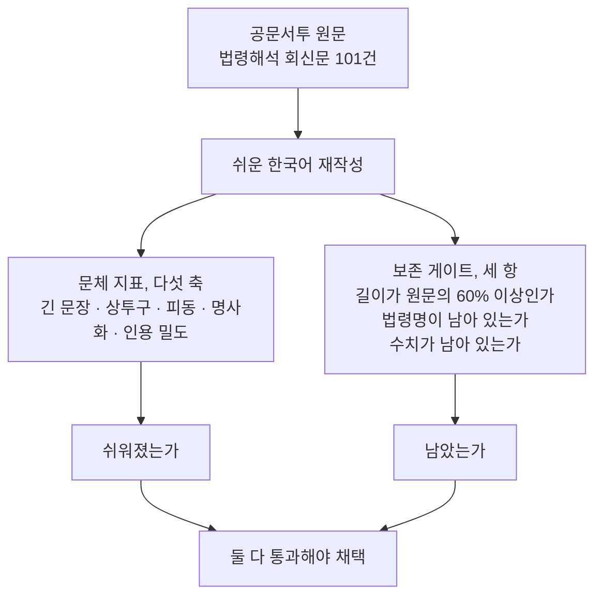

글이 쉬워졌는지 자동으로 채점하는 장치를 만들어 쓰는 분이라면, 이 글에서 그 장치가 조용히
거짓말하는 방식 하나를 가져가실 수 있습니다. 저희가 만든 문체 지표는 다섯 축이 전부 좋아졌는데,
그 시점에 원문의 90%가 사라져 있었습니다.

*글의 핵심 개념을 형상화했습니다.*

## 쉽게 말하면

이사할 때 짐을 잘 정리한 방과, 짐을 그냥 버린 방은 사진으로 보면 똑같이 깨끗합니다. 문체 지표는
그 사진입니다. 방이 깨끗한지는 재지만, 있어야 할 물건이 남아 있는지는 재지 않습니다. 이 글은
사진 옆에 짐 목록을 놓아야 한다는 이야기입니다.

<!-- nlm-visual -->

*NotebookLM이 소스를 종합해 생성한 인포그래픽입니다.*

## 무엇을 해봤나

공공기관이 민원인에게 보내는 답변은 대체로 읽기 어렵습니다. 저희는 법제처가 공개한 법령해석
회신문을 원단으로 삼았습니다. 공공누리 제1유형이라 상업적으로 쓸 수 있고, 질문과 답변이 짝으로
들어 있습니다.

이 답변을 쉬운 한국어로 다시 쓰는 일을 모델에게 맡겼습니다. 그리고 얼마나 쉬워졌는지를 재는
지표를 따로 만들었습니다. 긴 문장의 비율, 관공서 상투구, 피동 표현, 명사로 끝맺는 버릇,
조문 인용의 밀도를 각각 셉니다.

지표를 쓰기 전에 그 지표가 무언가를 실제로 가를 수 있는지부터 확인했습니다. 공문서투 원문과
평이한 글을 넣어 보고, 둘을 못 가르는 축은 버렸습니다. 한자 밀도 축이 그렇게 버려졌습니다.
법제처 문서가 한글전용이라 양쪽 다 0이었습니다. 공문서투는 한자로 쓰는 문제가 아니라 어휘와
문장 구조의 문제였습니다.

## 나온 결과

첫 결과는 완벽해 보였습니다. 다섯 축이 전부 크게 좋아졌습니다. 그런데 원문 2,532자가
242자가 돼 있었습니다. 쉬운 말로 옮긴 것이 아니라 요약해 버린 것입니다.

즉, 사람 말로는 이렇습니다. 모델이 결론만 남기고 근거를 버렸는데, 문체 점수는 오히려 더
좋아졌습니다. 버린 문장이 어려운 문장이었으니까요.

원인은 모델이 아니라 저희가 준 지시였습니다. 지시문에 "조문 인용은 본문에서 덜어내라"고
적어 두었습니다. 버리라고 시켜 놓고 버렸다고 할 수는 없습니다.

고친 방법은 임계를 낮추는 것이 아니었습니다. 통문서를 한 번에 주면 모델은 요약합니다. 그래서
문단 하나씩 따로 주고 각각 다시 쓰게 했습니다. 그러면 버릴 자리가 구조적으로 없어집니다.
통과율이 열 건에 한 건에서 열 건에 아홉 건으로 올랐습니다.

최종 결과는 이렇습니다. 110자가 넘는 문장이 절반에서 0으로 줄었고, 상투구와 피동과 명사화가
모두 10분의 1 아래로 내려갔습니다. 그러면서 글 길이는 원문의 98% 그대로였고, 법령명은 378개
중 370개가 남았습니다.

| 재는 것 | 원문 | 다시 쓴 글 |
|---|---|---|
| 110자 넘는 문장 비율 | 50.0% | 0.0% |
| 문장당 상투구 | 0.76 | 0.03 |
| 문장당 피동 표현 | 0.32 | 0.03 |
| 문장당 명사화 | 0.27 | 0.03 |
| 글 길이 (원문 대비) | 1.00 | 0.98 |

101건 기준입니다. 자세한 수치와 효과크기는 아래 출처의 원장에 있습니다.

## 그래서 무엇을 바꾸면 되나

문체를 재는 지표와 내용이 남았는지 재는 지표를 **따로** 두시면 됩니다. 하나로 합치면 안 됩니다.
문체 점수는 내용을 버릴수록 좋아지기 때문에, 합치는 순간 서로를 가려 줍니다.

*같은 재작성 결과에서 갈라지는 두 개의 측정입니다. 문체 지표는 방이 깨끗한지, 보존 게이트는 짐이 남아 있는지를 씁니다.*

내용 보존은 세 가지로 쟀습니다. 다시 쓴 글이 원문 길이의 60% 아래로 줄었는지, 원문에 있던
법령명이 남았는지, 원문의 숫자가 남았는지입니다. 셋 중 하나라도 못 넘기면 그 건은 버립니다.
사람이 판단하지 않고 코드가 판정합니다.

그리고 게이트가 많이 떨어뜨린다고 임계부터 낮추지 마시기 바랍니다. 저희 통과율이 열에 하나로
떨어졌을 때 임계를 낮췄다면 요약본이 그대로 학습 데이터가 됐을 것입니다. 원인은 임계가 아니라
입력을 주는 방식에 있었습니다.

## 못 믿을 부분

여기까지 오는 동안 저희가 만든 검사기가 네 번 틀렸습니다. 방향을 안 보고 크기만 봐서 반대로
움직인 축을 통과시켰고, 법령명을 완전일치로 비교해 표기만 바뀐 것을 사라졌다고 셌고, 판례
사건번호를 내용으로 세어 멀쩡한 15%를 버렸고, 저장소를 한 곳만 뒤지고 없다고 했습니다.
네 번 다 재어지는 쪽이 아니라 재는 쪽이 틀렸습니다. 게이트가 이상하게 굴면 대상을 의심하기
전에 게이트를 의심하시는 편이 빠릅니다.

이 글이 말하지 않는 것도 분명히 적습니다. 저희는 아직 모델을 학습하지 않았습니다. 여기까지는
데이터와 지표의 이야기이지 모델 성능의 이야기가 아닙니다. 비교 대상으로 쓴 평이한 글이 저희
기술블로그라서 장르가 다릅니다. 이 지표가 공문서투와 평이한 산문을 가른다는 것까지만 말할 수
있고, 민원 답변끼리 가른다는 근거는 아직 없습니다. 건수도 101건으로 적고, 다시 쓴 글을 사람이
전부 읽어 보지는 않았습니다.

출처: 측정 원장 `whitepapers/data/ledger/2026-09-02-hkp-govspeak-plain-rewrite.json`. 원단은 법제처 [국가법령정보 공동활용 Open API](https://open.law.go.kr/LSO/openApi/guideList.do)(공공누리 제1유형, [공공데이터포털 상세 페이지](https://www.data.go.kr/data/15000115/openapi.do)).

<!-- nlm-visual -->

*NotebookLM이 소스를 종합해 생성한 인포그래픽입니다.*
