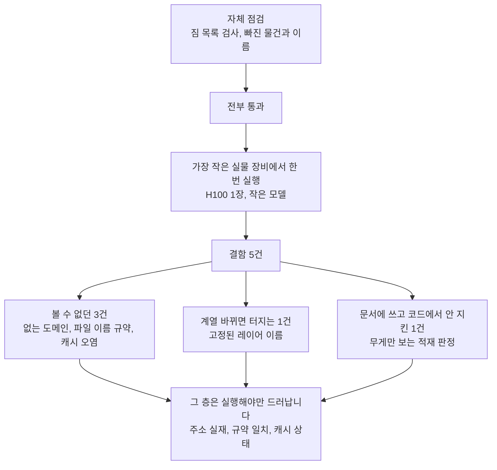

새 GPU 장비에 실험을 옮길 준비를 하는 분이라면, 코드를 다 짜고 자체 점검까지 통과했을 때
"준비 끝"이라고 생각하기 쉽습니다. 저희는 그 상태에서 진짜 장비에 한 번 올려봤고,
**결함 다섯 개**를 찾았습니다. 그중 셋은 자체 점검으로는 원리적으로 볼 수 없는 자리에
있었습니다.

*글의 핵심 비유를 형상화했습니다.*

## 쉽게 말하면

이사 가기 전에 짐을 다 싸고 목록도 두 번 확인한 상황입니다. 목록은 완벽합니다. 그런데
새 집 현관문 폭을 안 재봤습니다. 소파가 안 들어갑니다.

자체 점검은 **짐 목록**을 검사합니다. 빠진 물건이 있는지, 이름이 맞는지 봅니다.
현관문 폭, 엘리베이터 크기, 주차장 높이는 **가서 재봐야** 알 수 있습니다. 저희가 찾은
다섯 개 중 셋이 정확히 그 현관문 폭이었습니다.

## 무엇을 해봤나

학습 속도와 추론 처리량을 재는 도구 여덟 개를 만들었습니다. 각각 자체 점검을 붙여 전부
통과시켰습니다. 그다음 가장 작은 실물 장비 한 대(H100 한 장)에 올려 작은 모델로 한 번
돌렸습니다.

목적은 성능 숫자가 아니라 **코드가 이 장비에서 도는가**였습니다.

## 나온 결과

다섯 개가 나왔습니다. 성격이 둘로 갈립니다.

**자체 점검이 볼 수 없었던 것 셋**

첫째, 방화벽에 넣으려던 주소 하나가 **실제로 존재하지 않았습니다.** 모델 파일을 받는
주소로 `cdn-lfs.huggingface.co`를 적어뒀는데, 조회해보니 그런 이름이 없었습니다. 진짜
주소는 `us.aws.cdn.hf.co`였고 지역에 따라 달라집니다. 이대로 인프라팀에 넘겼다면 없는
주소를 열어주고, **메인 사이트는 접속되는데 파일만 안 받아지는** 상태가 됐을 겁니다.
원인이 잘 안 보이는 종류입니다.

둘째, 결과 파일 이름 규약이 어긋났습니다. 실행 도구는 정해진 이름의 파일을 읽는데 저희는
다른 이름으로 저장했습니다. **실행은 성공했는데 실패로 보고**됐습니다.

셋째, 서버 기동 시간 측정이 오염됐습니다. 두 설정을 비교했는데 첫 번째는 모델을 새로
내려받았고 두 번째는 이미 받아둔 것을 썼습니다. 그래서 "튜닝하면 기동이 빨라진다"는
결과가 나왔는데, 저희가 다른 장비에서 잰 값은 **정반대**였습니다.

**모델 종류가 바뀌면 터졌을 것 하나**

학습에서 손댈 부분의 이름을 한 종류로 고정해뒀습니다. 저희가 쓰던 모델 계열에는 맞았지만
다른 계열은 이름이 다릅니다. 그 모델을 쓰는 순간 학습이 멈춥니다.

**저희가 문서에 써놓고 코드에서 안 지킨 것 하나**

"모델이 메모리에 들어간다고 서비스가 되는 게 아니다"라고 문서 첫 줄에 썼습니다. 그런데
판정 코드는 무게만 보고 있었습니다. 1조 개짜리 모델이 여유 공간을 74기가바이트만 남기는데도
**적재 가능**으로 나왔습니다. 그 여유로는 동시 접속 한 명이 한계입니다.

즉, 사람 한 명 태우고 "이 버스 운행 가능"이라고 적은 셈입니다.

### 덤으로 얻은 숫자 하나

학습 기준선도 함께 얻었는데, 예상 밖의 관찰이 있었습니다.

| 한 번에 읽는 길이 | 초당 처리 토큰 | 장비 활용률 |
|---|---|---|
| 짧게 (2천) | 22,284 | 26.5% |
| 길게 (4천) | 21,331 | **28.4%** |

**길게 읽으면 초당 처리량은 줄어드는데 장비 활용률은 올라갑니다.** 문장이 길어질수록
토큰 하나를 처리하는 데 드는 계산량 자체가 커지기 때문입니다.

즉, 사람 말로는 이렇습니다. 초당 처리량만 보면 "긴 대화는 손해"라고 판단하게 되는데,
실제로는 장비를 더 알차게 쓰고 있는 중입니다. 긴 대화 기록을 다루는 서비스라면 두 숫자를
같이 봐야 합니다.

## 그래서 무엇을 바꾸면 되나

자체 점검을 더 촘촘히 쓰는 것보다 **가장 작은 실물 장비에서 한 번 태우는 것**이 값이
큽니다. 이번 다섯 개 중 셋은 자체 점검이 아무리 많아도 못 잡습니다. 주소가 실재하는지,
도구 사이 규약이 맞는지, 캐시가 남아 있는지는 실행해야만 드러나는 층입니다.

작은 모델 하나로 몇 분이면 됩니다. 저희는 그 몇 분에 다섯 개를 찾았습니다.

그리고 자체 점검을 쓸 때는 **기대값을 실측에서 가져오세요.** 위 다섯 번째 결함은 저희가
실제 숫자를 기대값으로 박아 넣은 뒤에야 잡혔습니다. 처음 쓴 점검은 그냥 통과시켰습니다.

이 흐름을 한 장으로 모으면 이렇습니다.

## 못 믿을 부분

이 글의 숫자는 GPU 한 장에서 잰 것입니다. 여러 장을 묶었을 때, 장비를 여러 대 연결했을 때는
재지 않았습니다. 전력 소모와 학습 품질도 재지 않았습니다.

추론 쪽에서 얻은 3.3배라는 차이는 **인용할 수 없는 수준**입니다. 동시 접속을 두 단계만
보고 두 번씩만 반복했습니다. 도구가 A와 B를 실제로 구분한다는 것만 확인한 값입니다.

FSDP라는 학습 방식은 검증하지 못했습니다. 프레임워크가 GPU 없이는 아예 거부합니다.

이 글의 숫자는 H100 NVL 한 장에서 직접 측정한 값이며, 원장 `2026-09-04-scatterlab-b300-e11-baseline-1gpu-h100.json` 외 두 건에 기록해 두었습니다.
