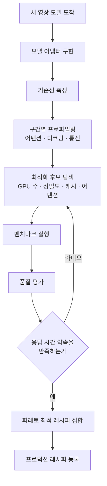

*목수를 몇 명 붙일지가 결과물의 원가를 정합니다.*

영상 생성 기능을 서비스에 붙이실 계획이라면 모델을 고르기 전에 영상 1초를 만드는 데 GPU 초가 몇 개 드는지부터 재셔야 합니다. 저희는 같은 카드에서 모델 가중치를 하나도 건드리지 않고 실행 방식만 바꿔 3.1배를 이미 확인했습니다. 정작 아무도 재지 않은 축은 GPU를 몇 장 쓸 것인가였습니다. 이 글은 그 빈 축을 메우려고 저희가 만들기 시작한 실행 계층에 대한 기록입니다.

## 쉽게 말하면

주문 제작 가구 공방을 떠올려 주세요. 손님이 의자 하나를 주문하면 공방은 목재를 자르고 다듬고 조립하고 마감합니다. 여기에 목수를 여덟 명 붙이면 의자는 확실히 빨리 나옵니다. 손님은 만족합니다. 그런데 공방 주인의 장부에는 다른 숫자가 찍힙니다. 여덟 명이 두 시간을 썼으면 인건비는 열여섯 시간입니다. 두 명이 다섯 시간에 만들었다면 인건비는 열 시간입니다. 손님 눈에는 앞이 더 좋은 공방입니다. 장부에는 뒤가 더 좋은 공방입니다.

영상 생성이 정확히 이 구조입니다. GPU는 목수이고, 영상 한 편은 의자입니다. 저희가 만드는 것은 더 좋은 의자가 아닙니다. 주문마다 목수를 몇 명 붙이고 어떤 연장을 쥐여 줄지 정하는 공방 운영 체계입니다. 이 비유를 글 끝까지 쓰겠습니다.

## 빠른 것과 싼 것은 서로 다른 숫자입니다

언어 모델 서빙에서는 초당 토큰과 GPU당 토큰이라는 지표가 이미 자리를 잡았습니다. 같은 모델이라도 어떤 런타임을 쓰고 어떤 정밀도를 고르느냐에 따라 GPU 한 장이 뽑아내는 토큰 수가 몇 배씩 달라지기 때문입니다. 저희는 이 개념을 사내에서 토큰 팩토리라고 부르고 있습니다.

영상에도 같은 질문을 옮겨 놓으면 지표가 하나 나옵니다. GPU 한 시간으로 몇 초짜리 영상을 만들 수 있는가입니다. 뒤집으면 영상 1초를 만드는 데 GPU 초가 몇 개 들었는가입니다. 앞의 공방 예시를 이 지표로 다시 쓰면 이렇게 됩니다.

| 구성 | 사용자가 기다린 시간 | 소모한 GPU 초 |
|---|---:|---:|
| GPU 8장 | 2초 | 16 |
| GPU 2장 | 5초 | 10 |


*빠른 것과 싼 것은 같은 표에서 서로 다른 칸을 가리킵니다.*

사용자 체감으로는 위가 이겼고 원가로는 아래가 이겼습니다. 어느 쪽이 정답인지는 서비스마다 다릅니다. 대화형 편집기라면 위를 골라야 합니다. 밤새 수천 편을 돌리는 배치 생성이라면 아래입니다. 그래서 저희 런타임이 찾는 것은 가장 낮은 지연 시간이 아닙니다. 요구된 응답 시간 약속을 지키면서 GPU를 가장 적게 쓰는 실행 방식입니다.

여기서 자연스럽게 따라오는 결정이 하나 있습니다. GPU를 몇 장 쓸지는 사용자가 정하지 않습니다. 그것도 런타임이 요청마다 고르는 값입니다. 미리보기용 5초 영상과 최종 납품용 10초 영상은 같은 모델을 쓰더라도 붙일 목수 수가 다릅니다.

## 저희가 이미 잰 것은 단일 GPU 사다리입니다

이 계획은 백지에서 시작하지 않았습니다. 저희는 지난달에 Wan2.2 계열 영상 모델을 사내 GPU에 올려 놓고 실행 방식만 한 단계씩 쌓아 올리는 사다리를 측정해 뒀습니다. 조건은 1280 곱하기 720 해상도, 81프레임, 40스텝으로 고정했습니다.

먼저 밝혀 둘 것이 있습니다. 아래 두 표는 서로 다른 카드에서 잰 값이라 절대 시간을 가로질러 비교하면 안 됩니다. 비교는 같은 카드 안에서 단계 사이의 비율로만 합니다.

H200 한 장에서 잰 사다리입니다. 프롬프트 3종의 중앙값이고 워밍업은 1회입니다.

| 실행 단계 | 총 시간 | baseline 대비 |
|---|---:|---:|
| baseline | 1142.4초 | 1.000배 |
| 커널 스택만 | 1064.5초 | 1.073배 |
| 커널 + 캐시 | 701.4초 | 1.629배 |
| 희소 어텐션만 | 562.6초 | 2.031배 |
| 희소 어텐션 + 캐시 | 368.4초 | 3.101배 |


*가중치는 그대로 두고 실행 방식만 쌓아 올린 결과입니다.*

B200 한 장에서 잰 사다리입니다. 프롬프트 5종의 중앙값입니다.

| 실행 단계 | 총 시간 | 디코딩 | baseline 대비 |
|---|---:|---:|---:|
| baseline | 527.8초 | 17.6초 | 1.000배 |
| 커널 융합만 | 458.6초 | 4.6초 | 1.151배 |
| 커널 + 캐시 | 303.6초 | 4.6초 | 1.738배 |

즉, 사람 말로는 이렇습니다. 모델 파일은 그대로 두고 실행하는 방법만 바꿨는데 같은 영상을 만드는 시간이 3분의 1 아래로 떨어졌습니다. 목수를 더 부른 것이 아니라 연장을 바꾼 결과입니다.

## 캐시 정책은 하드웨어를 건너 그대로 옮겨졌습니다

가장 반가운 결과는 배수 자체가 아니라 이식성이었습니다. 확산 모델은 같은 그림을 40번에 걸쳐 조금씩 다듬는데, 인접한 단계 사이에는 다시 계산할 필요가 없는 부분이 많습니다. 그 재사용 판정 기준을 0.30으로 두었더니 40스텝 가운데 14스텝이 재사용으로 걸렸습니다. 이 수치는 NVIDIA가 자사 장비에서 보고한 값과 정확히 같았습니다. 재사용이 일어난 스텝 위치까지 프롬프트를 바꿔도 거의 그대로였습니다.

같은 운용점을 이미지에서 영상을 만드는 작업으로 옮겼을 때도 재조정이 필요 없었습니다. 재사용은 40스텝 가운데 15스텝으로 사실상 같았습니다. 배수는 3.879배가 나왔습니다. 조건으로 준 이미지가 결과 영상의 첫 프레임에 묶여 있는 정도는 소수 넷째 자리까지 유지됐습니다. 텍스트에서 영상을 만들 때와 이미지에서 영상을 만들 때의 기준 시간 차이도 1146.2초 대 1145.7초로 사실상 없었습니다.


*작업 종류가 바뀌어도 재사용 프로필과 기준 시간이 거의 같았습니다.*

즉, 사람 말로는 이렇습니다. 한 벌의 연장 세팅이 카드를 바꿔도 작업 종류를 바꿔도 그대로 통했습니다. 이것이 모델마다 서버를 따로 두는 대신 공용 런타임을 만들어도 되겠다고 판단한 첫 근거입니다.

## 런타임 배수와 모델 배수는 절대 섞지 않습니다

이 분야에서 가장 흔한 과장이 여기서 나옵니다. 40스텝짜리 모델을 4스텝짜리로 증류하면 당연히 크게 빨라집니다. 그런데 그 배수를 실행 최적화 배수와 한 숫자로 합쳐서 열 배라고 말하면, 정작 무엇이 효과가 있었는지 아무도 알 수 없게 됩니다. 다음 모델이 왔을 때 무엇을 다시 해야 하는지도 모릅니다.

그래서 저희는 보고할 때 항상 세 칸을 따로 냅니다. 런타임 배수는 같은 모델, 같은 가중치, 같은 스텝 수, 같은 해상도와 길이에서만 셉니다. 모델 배수는 증류나 스텝 축소가 만든 몫입니다. 총 배수는 그 둘의 곱입니다. 위에 적은 3.101배는 전부 런타임 배수이고 증류는 한 방울도 섞이지 않았습니다.

## VAE는 저희 측정에서는 병목이 아니었습니다

영상 런타임을 설계할 때 흔히 나오는 이야기가 디코딩 단계가 의외로 무겁다는 것입니다. 저희도 그 전제로 계획을 짰습니다. 그런데 실제로 재 보니 반대였습니다. B200 기준선에서 디코딩은 527.8초 가운데 17.6초로 전체의 3.3퍼센트였습니다. 커널 융합을 켠 뒤에는 4.6초로 1퍼센트 아래까지 내려갔습니다.


*병목일 것이라 짐작했던 자리가 실제로는 3.3퍼센트였습니다.*

이 결과는 계획을 한 줄 바꿨습니다. 저희는 디코딩 병렬화를 먼저 구현하지 않기로 했습니다. 대신 디코딩 비중이 10퍼센트를 넘는 해상도와 길이 지점이 실제로 존재하는지 찾는 실험을 백로그에 올려 두었습니다. 그 지점이 나오지 않으면 첫 구조도에서 디코딩 병렬화를 아예 빼겠습니다. 만들어 놓고 필요 없다고 판정하는 것보다 재고 나서 만드는 편이 쌉니다.

## 그래서 만드는 것은 모델 서버가 아니라 실행 계층입니다

모델 하나가 늘 때마다 서버를 하나씩 새로 만드는 구조는 오래 못 갑니다. 영상 파운데이션 모델은 지금도 몇 주 간격으로 나옵니다. 텍스트에서 영상, 이미지에서 영상, 참조 영상 편집, 음성과 영상 동시 생성이 한 모델 안으로 합쳐지는 중입니다. 새 모델이 올 때마다 서빙 스택을 통째로 다시 짜면 최적화 지식이 매번 버려집니다.


*모델은 어댑터 뒤에 있고, 최적화 지식은 런타임과 레시피에 남습니다.*

핵심은 모델과 런타임을 떼어 놓는 것입니다. 새 영상 모델이 나오면 저희가 구현하는 것은 얇은 모델 어댑터 하나입니다. 정밀도와 어텐션 방식과 캐시 설정과 GPU 배치는 공용 런타임이 담당합니다. 사용자는 어떤 연장을 쥐여 줄지 고르지 않습니다. 프롬프트와 길이와 해상도와 품질 등급만 주면 됩니다.

실행 방식은 실행 레시피라는 이름의 설정 묶음으로 다룹니다. 같은 모델이라도 요청에 따라 이런 레시피가 나올 수 있습니다.

```yaml
model: video-model-a
gpu:
  count: 4
precision:
  weights: bf16
  communication: fp8
attention:
  backend: flash
  sparse: true
parallel:
  sequence_parallel: 4
cache:
  enabled: true
```

다른 요청에는 GPU 2장에 희소 어텐션을 끈 레시피가 더 낫습니다. 최적 설정은 여러 벌이고, 그것이 이 설계의 전제입니다. 사용자에게는 이 항목을 노출하지 않고 품질, 균형, 속도, 실시간이라는 네 가지 등급만 보여 줄 계획입니다. 실시간 등급의 목표는 단순합니다. 만드는 영상 길이보다 만드는 시간이 짧으면 됩니다.

레시피를 사람이 손으로 고르는 한 이 구조는 확장되지 않습니다. 그래서 장기적으로 가장 중요한 부품은 특정 커널이 아닙니다. 자동 탐색기입니다.



탐색이 끝나면 나오는 것은 가장 빠른 설정 하나가 아니라 목적이 다른 여러 개의 레시피입니다. 실시간 서비스는 지연 시간이 가장 낮은 것을, 일반 서비스는 균형점을, 대량 배치는 GPU 초가 가장 적은 것을 고르면 됩니다. 같은 모델인데도 쓰임에 따라 정답이 갈립니다.

## 아직 못 잰 것이 가장 큰 구멍입니다

여기까지가 저희가 아는 것입니다. 지금부터는 모르는 것입니다. 위 사다리는 전부 GPU 한 장짜리 측정입니다. 이 글 전체의 논지가 GPU 장수의 경제성인데, 정작 1장과 2장과 4장과 8장의 곡선을 저희는 아직 재지 않았습니다. 그래서 첫 실험은 화려한 최적화가 아닙니다. 그 곡선입니다. 장수를 늘릴 때 지연 시간이 얼마나 줄고 영상 1초당 GPU 초가 얼마나 늘어나는지, 그 교차점이 어디인지를 먼저 확정합니다.


*이 교차점이 어디인지가 저희가 아직 모르는 가장 큰 값입니다.*

희소 어텐션부터 구현하지 않는 이유도 같습니다. 긴 영상에서는 어텐션 비중이 커져서 효과가 큽니다. 짧은 시퀀스에서는 경로를 고르는 비용이 절약분을 넘길 위험이 있습니다. 프로파일러가 병목을 지목하기 전까지는 어떤 최적화도 우선순위를 주장할 자격이 없습니다.

지난 측정에서 배운 것이 하나 더 있습니다. 문서가 코드보다 앞서 있는 경우가 흔합니다. 저희는 공개 저장소 기준으로 재현하려던 최적화 하나가 구현 자체가 공개돼 있지 않아 실행할 수 없다는 것을 잡을 돌리고 나서야 알았습니다. 발표된 배수를 목표치로 옮겨 적기 전에 그 배수를 만든 코드가 실제로 손에 있는지부터 확인해야 합니다.

## 못 믿을 부분

정직하게 경계를 적겠습니다. 위 사다리는 프롬프트 3종에서 5종, 구성당 1샘플로 잰 값입니다. 인용 가능한 기준선의 요건인 워밍업 2회에 5프롬프트 3반복을 아직 채우지 않았습니다. B200 측정 당시 노드는 8장 가운데 6장을 다른 작업이 쓰던 공유 상태였습니다. 그래서 절대 시간은 재앵커링 전까지 외부 비교에 쓸 수 없습니다. 같은 실행 안에서 단계 사이의 비율만 믿어 주십시오.

품질 쪽 경계도 있습니다. 조건 이미지가 얼마나 지켜지는지는 첫 프레임 상관으로 쟀습니다. 첫 프레임은 조건이 가장 강하게 묶이는 자리라 가장 늦게 무너지는 지표입니다. 중간과 마지막 프레임 충실도는 이번 스윕에서 재지 않았습니다. 캐시를 더 공격적으로 밀었을 때 절벽이 어디인지도 작업 종류마다 다시 확인해야 합니다.

마지막으로 라이선스입니다. 후보 모델 가운데 하나는 사내 자체 호스팅이 라이선스 검토 대상입니다. 가중치도 사내 저장소에 아직 없습니다. 저희는 이런 모델을 정식 라이선스 확보 전에 프로덕션 경로에 올리지 않습니다. 그 판정은 사람의 기억이 아니라 배포 게이트 코드가 막습니다.

## 이 작업이 Metis에서 갖는 의미

ThakiCloud가 만들려는 것은 또 하나의 영상 생성 서비스가 아닙니다. 저희 추론 제품인 Metis는 GPU 한 장에서 얼마나 많은 토큰을 안정적으로 뽑아내는가를 다루는 계층입니다. 이번 작업은 그 질문을 영상으로 옮긴 것입니다. 언어 모델 시대에 모델만큼이나 실행 엔진이 중요해졌듯이 영상 파운데이션 모델이 보편화되면 같은 계층이 필요해집니다. 그리고 이 계층은 에이전트가 영상 생성을 하나의 작업으로 호출하기 시작할 때 원가를 결정하는 자리이기도 합니다.


*원가를 정하는 것은 모델이 아니라 실행 엔진입니다.*

그래서 저희가 이번 분기에 증명하려는 문장은 하나입니다. 서로 다른 구조를 가진 영상 모델 두 개 이상에서 공용 런타임이 실제로 성립하고 그 위에서 영상 1초당 GPU 초가 의미 있게 내려간다는 것입니다. 성립하지 않으면 저희가 만든 것은 런타임이 아니라 특정 모델용 최적화 묶음일 뿐입니다. 첫 실험은 B200에서 GPU 장수별 경제성 곡선을 재는 것부터 시작합니다. 결과는 숫자가 나오는 대로 이 블로그에 그대로 적겠습니다.

영상 생성 기능을 붙이려는 분께 남기고 싶은 한 문장은 이것입니다. 모델을 고르기 전에 영상 1초당 GPU 초를 재 보십시오. 그 숫자를 낮추는 일은 모델 교체가 아니라 실행 방식의 문제인 경우가 많습니다.

## 함께 읽을 것

- Wan2.2 공식 저장소: [github.com/Wan-Video/Wan2.2](https://github.com/Wan-Video/Wan2.2)
- 추론 튜닝은 측정입니다: [같은 GPU에서 최적 설정이 정반대였던 기록](/tech-blog/ko/llmops/inference-tuning-is-measurement/)
