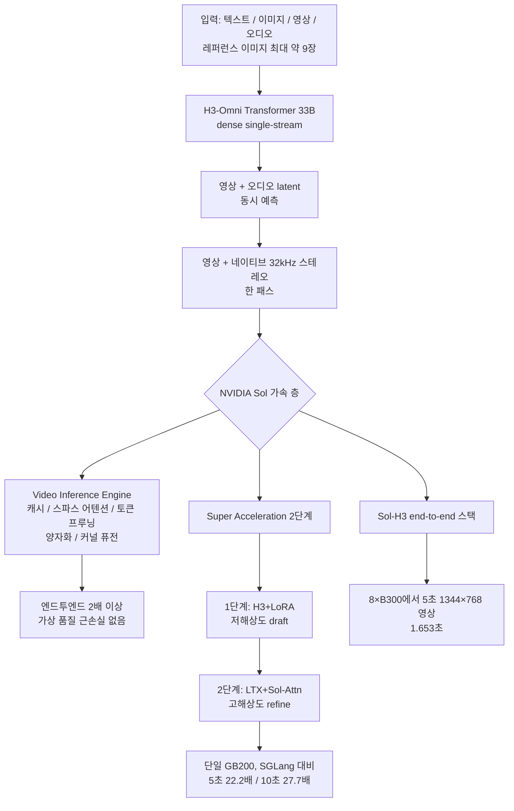

*문자열 생성이 아니라 프레임과 오디오를 함께 만드는 모델입니다. 서빙 비용의 단위 자체가 다른 축입니다.*

## 왜 읽어야 하나

영상·이미지 생성 모델을 서빙하거나, 오픈웨이트 영상 모델을 자기 인프라에 올리는 것을 검토 중인 분을 위한 글입니다. 핵심 결론을 먼저 말합니다. NVIDIA Sol 팀이 MiniMax-H3를 위한 가속 스택 두 개를 오픈소스했습니다. 영상 생성 서빙이 "한 컷에 몇 분"의 체제에서 "재생보다 빠른" 체제로 넘어선 것입니다. 다만 5초 영상 1.653초라는 숫자는 8×B300의 결과이고 "오픈웨이트"라는 말은 커뮤니티 라이선스상 한국 로컬 배포가 제외된다는 뜻이기도 합니다. 서빙 설계와 도입 판단은 이 두 사실 위에서 해야 합니다.

## 개요

2026년 9월 7일, MiniMax 공식 계정이 NVIDIA Sol 팀의 [MiniMax-H3 영상 생성 가속](https://nvlabs.github.io/Sana/Sol-Engine/H3-Super-Acceleration/) 오픈소스를 알렸습니다. "재생보다 빠르다(faster than playback), 전부 오픈소스다"가 헤드라인입니다. 함께 주목할 것은 대상 모델 자체입니다. MiniMax-H3는 [Hugging Face에 공개된](https://huggingface.co/MiniMaxAI/MiniMax-H3) 33B 멀티모달 영상 모델로, 비디오와 오디오를 한 번에 만듭니다.

## MiniMax-H3: 무엇을 얼마나 빠르게 만들 수 있는 모델인가

MiniMax-H3의 아키텍처는 H3-Omni Transformer라는 dense single-stream 구조로, 영상 latent와 오디오 latent를 함께 예측합니다. 텍스트, 이미지, 영상, 오디오를 하나의 컨텍스트로 받아(주제·스타일용 레퍼런스 이미지 최대 약 9장, 움직임용 영상 클립, 오디오 클립 포함) text-to-video, image-to-video, first-and-last-frame, 레퍼런스 기반 생성, 영상 편집까지 커버합니다.

| 항목 | 스펙 |
|---|---|
| 파라미터 | 33B (dense, 단일 스트림) |
| 출력 | 영상 + 네이티브 스테레오 오디오(약 32kHz) |
| 해상도/프레임 | 최대 2K, 24fps |
| 길이 | 약 4~15초 클립 |
| 종횡비 | 16:9, 9:16, 1:1, 21:9, 4:3 |
| 2K 경로 | 모델이 자기 저해상도 결과를 인컨텍스트로 재생성 |
| 로컬 배포 해상도 | 약 768p 중심 |

서빙 관점에서 가장 의미 있는 것은 "오디오가 별개 파이프라인이 아니라 같은 패스"라는 점입니다. 영상 생성 모델에서 사운드트랙을 별도 합성 단계로 만들면 생성 시간과 GPU 점유가 두 번으로 늘어납니다. H3는 한 패스에 영상과 32kHz 스테레오를 함께 내므로, "1초 영상당 GPU-초"라는 단위 비용에 오디오 비용이 이미 들어 있습니다.

이 구조가 서빙을 복잡하게 만드는 이유도 있습니다. 한 패스에 두 모달을 내는 모델은 두 모달의 동기화를 출력 품질의 일부로 취급합니다. 프레임과 오디오가 어긋나면 영상은 완성돼도 산출물은 불량입니다. 추론 엔진이 디퓨션 스텝을 끊거나 병렬화할 때 이 동기화 단위가 어디에 걸리는지, 즉 어떤 텐서를 함께 묶어 처리해야 하는지가 가속 최적화의 설계 변수가 됩니다. Sol 팀의 스파스 어텐션이나 토큰 프루닝이 "근손실 없이"라는 수식어를 달고 나오는 것은, 이런 교차 의존을 깨뜨리지 않고 시간을 줄였다는 뜻입니다.

라이선스도 함께 봐야 합니다. H3의 공개 형태는 "MiniMax H3 Community License Agreement"이며, 이는 OSI 오픈소스가 아닙니다. 커뮤니티 라이선스상 **미국·EU·영국·한국은 로컬 배포가 제외**되고 이 지역에서는 MiniMax의 별도 서면 인가를 받아야 로컬에서 돌릴 수 있습니다. 호스팅 API는 전 지역(한국 포함)에서 이용 가능합니다. 위치와 무관하게 연 매출 약 2,000만 달러를 넘는 상업 서비스는 별도 인가가 필요하고 UI에 "MiniMax H3" 표기가 요구됩니다. 정확한 조항은 [HF 저장소의 LICENSE 파일](https://huggingface.co/MiniMaxAI/MiniMax-H3/blob/main/LICENSE)이 정본입니다. "오픈웨이트"라는 마케팅 표현이 어디까지 배포를 허용하는지는 이 파일로 검증해야 합니다.

## NVIDIA Sol이 어떻게 가속했나

Sol 팀의 작업은 크게 세 층으로 나뉩니다.

첫째 층은 [Video Inference Engine](https://nvlabs.github.io/Sana/Sol-Engine/)입니다. 학습 불필요(training-free)의 에이전트 네이티브 가속 프레임워크로, 캐시 최적화, 스파스 어텐션, 토큰 프루닝, 양자화, 커널 퓨전으로 구성되며 엔드투엔드 2배 이상 가속을 근손실 없는 품질로 냅니다. 특정 모델에 맞춘 튜닝이 아니라 영상 디퓨전 계열에 통용되는 최적화 모음입니다.

둘째 층이 [H3 Super Acceleration](https://nvlabs.github.io/Sana/Sol-Engine/H3-Super-Acceleration/)입니다. 여기서 패턴이 보입니다. 영상 생성을 한 번에 고해상도로 만드는 대신 1단계에서 H3+LoRA로 저해상도 draft를 빠르게 만들고 2단계에서 LTX(다른 영상 모델)에 Sol-Attn을 붙여 고해상도로 refine합니다. 단일 GB200 기준 SGLang 베이스라인 대비 5초 영상 22.2배, 10초 영상 27.7배의 가속을 주장합니다. "재생보다 빠르다"는 헤드라인의 실체는 이 2단계 파이프라인입니다.

셋째 층은 [Sol-H3](https://nvlabs.github.io/Sana/Sol-Engine/H3/)라는 모델 특화 end-to-end 스택입니다. 8×B300 블랙웰 시스템에서 5초 1344×768 영상을 1.653초에 만듭니다. 재생(5초)보다 3배 이상 빠른, 즉 실시간을 넘는 체제입니다.

| 작업 | 하드웨어 | 결과 |
|---|---|---|
| Sol-H3 | 8×B300 | 5초 1344×768 영상, 1.653초 |
| Super Acceleration | 단일 GB200 | SGLang 대비 22.2×(5초) / 27.7×(10초) |
| Video Inference Engine | (모델별) | 엔드투엔드 2×+ , 근손실 수준 품질 |

## 이 패턴이 서빙 설계에 의미하는 것

draft-then-refine은 LLM 추론에서 이미 검증된 패턴의 영상 버전입니다. 투기 디코딩의 "싼 드래프터가 먼저 가고 비싼 모델이 검증한다"를, "저해상도 모델이 먼저 가고 고해상도 모델이 다듬는다"로 바꾼 것입니다. 차이가 있다면 검증 단위가 토큰이 아니라 프레임 전체라는 점입니다. 토큰 단위에서는 reject가 한 토큰 값이지만, 프레임 단위에서는 draft가 "대체로 맞는 방향"을 잡아줘야 refine이 의미가 있습니다. 그래서 1단계에 LoRA가 붙어 있습니다. draft가 무작정 낮은 해상도가 아니라, 목적지에 가까운 낮은 해상도여야 하니까요.

두 번째로, "모델 2개를 서빙한다"는 점이 인프라 측면에서 중요합니다. Super Acceleration은 H3와 LTX를 같은 파이프라인에 올립니다. 즉 서빙 스택에 두 개 모델의 가중치, 두 세트의 커널, 두 종의 메모리 프로파일 들어갑니다. 단일 모델 서빙이 익숙한 팀에는 이것이 새로운 운영 단위입니다.

세 번째로, 실시간 체제가 만들 시장입니다. 5초 영상이 1.6초면, "영상 생성"이 배치 작업에서 인터랙티브 작업으로 넘어갈 수 있습니다. 편집 도구가 즉시 미리보를 주는 체제, 또는 사용자 입력에 따라 몇 초 안에 컷을 바꿀 수 있는 체제. LLM에서 1.6초/5초는 아직 느리지만, 영상에서 1.6초/5초는 체제 전환입니다.

## ThakiCloud 제품 적용 시사점

ai-platform 관점에서, 이것은 "영상 모델도 서빙 인프라의 영역이 됐다"는 신호입니다. Metis가 텍스트 추론에서 vLLM/SGLang 엔진을 다루듯, 영상 생성 모델은 Sol-Attn, LTX refine, draft-LoRA 같은 엔진 단위의 구성 요소를 갖습니다. Telox/Velox 관점에서는 GPU-초당 프레임이라는 새로운 비용 단위가 생깁니다. "1M 토큰당 달러"가 LLM의 경제 단위라면, "1초 영상당 GPU-초"가 생성형 멀티모달의 경제 단위입니다.

라이선스 사안이 더 중요합니다. Aegis가 다루는 온프레미스·폐쇄망·데이터주권을 요구하는 고객에게 "오픈웨이트 모델"을 추천하는 순간, 그 고객의 관할 지역이 커뮤니티 라이선스의 제외 대상인지 확인해야 합니다. H3는 한국 로컬 배포가 제외된 상태입니다. 같은 "오픈웨이트"라도 지역별 배포 권리가 다르면, 온프레미스 도입은 별도 인가 협상(또는 호스팅 API)이 전제입니다. 모델 카탈로그에 "오픈웨이트" 태그를 달 때 라이선스 조항까지 함께 보는 것이, 이 모델부터는 서빙 엔지니어의 기본 작업이 됩니다.

## 한계 및 반론

첫째, 숫자의 전제 하드웨어입니다. 1.653초는 8×B300, 22.2×/27.7×는 단일 GB200 기준입니다. B200 또는 다른 세대 카드에서 같은 결과를 재단장하는 것은 우리의 몫이고 이번 실험은 conceptual이라 로컬 재현을 하지 않았습니다. 인용 수치는 NVIDIA 프로젝트 페이지의 주장 그대로입니다.

둘째, 베이스라인의 정체입니다. Super Acceleration의 배율은 SGLang 대비입니다. SGLang이 H3를 최적화된 상태로 서빙하는지, 기본 설정으로 두는지 페이지가 명시하지 않는 한, 배율은 "SGLang 기본값 대비"로 읽어야 합니다.

셋째, draft-refine의 품질 천장입니다. 2단계 refine 모델(LTX)이 1단계 draft를 넘어서는 품질을 주지 못하면, 파이프라인 전체의 품질은 refine 모델에 묶입니다. "가상 근손실"이라는 표현은 Video Inference Engine 층의 것이고 Super Acceleration 층의 품질 비교는 페이지에서 별도로 확인해야 합니다.

넷째, 로컬 배포 해상도입니다. 오픈웨이트 로컬 배포는 약 768p 중심이고 2K는 인컨텍스트 재생성 경로입니다. "2K 모델"이라는 표현에 768p 로컬 배포라는 꼬리표를 함께 달아야 합니다.

다섯째, 그리고 가장 실무적인 한계: 라이선스입니다. 기술적으로 돌릴 수 있어도, 우리와 같은 한국 조직은 커뮤니티 라이선스로 로컬 배포가 안 됩니다. 별도 인가 또는 호스팅 API가 전제입니다. "가속 스택을 오픈소스했다"는 뉴스와 "내 인프라에서 돌릴 수 있다"는 사실은 별개입니다.

## 정리

NVIDIA Sol 팀의 이번 작업은 세 가지를 남깁니다. 영상 생성 서빙의 체제가 실시간을 넘었다는 실증(8×B300에서 5초 영상 1.653초), draft-then-refine이라는 2단계 패턴이 영상에서도 성립한다는 설계(단일 GB200에서 SGLang 대비 22.2~27.7배), 그리고 Video Inference Engine이라는 학습 불필요 최적화 모음입니다.

다음 행동은 두 가지입니다. 영상 모델 서빙을 계획하고 있다면 "1초 영상당 GPU-초" 단위로 비용 모델을 다시 세세요. "오픈웨이트" 도입을 검토한다면 HF 저장소의 LICENSE 파일부터 읽고 자사의 관할 지역이 제외 대상인지 확인하세요. H3의 경우 한국은 로컬 배포가 제외되어 있고 그 전제는 호스팅 API 또는 MiniMax의 별도 인가입니다. 기술 뉴스와 도입 판단 사이에는 라이선스 파일 한 장이 있습니다.

---

**출처**

- MiniMax AI X 트윗 (2026-09-07): <https://x.com/hjguyhan/status/2097083392265462177>
- NVIDIA Sol-H3: <https://nvlabs.github.io/Sana/Sol-Engine/H3/>
- NVIDIA H3 Super Acceleration: <https://nvlabs.github.io/Sana/Sol-Engine/H3-Super-Acceleration/>
- NVIDIA Sol Engine (Video Inference Engine): <https://nvlabs.github.io/Sana/Sol-Engine/>
- Hugging Face MiniMax-H3 (LICENSE 포함): <https://huggingface.co/MiniMaxAI/MiniMax-H3>
