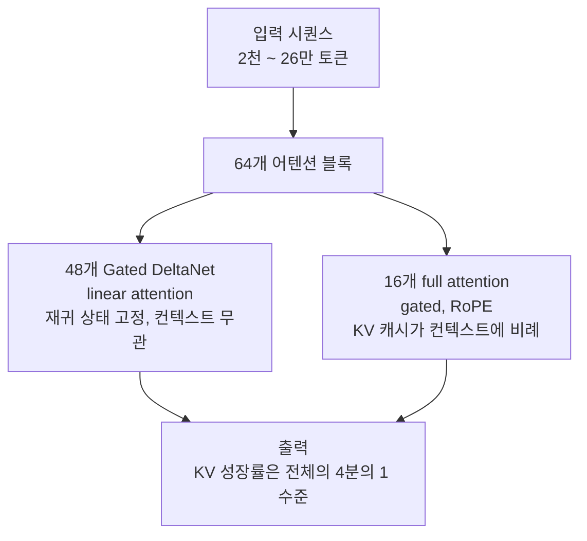
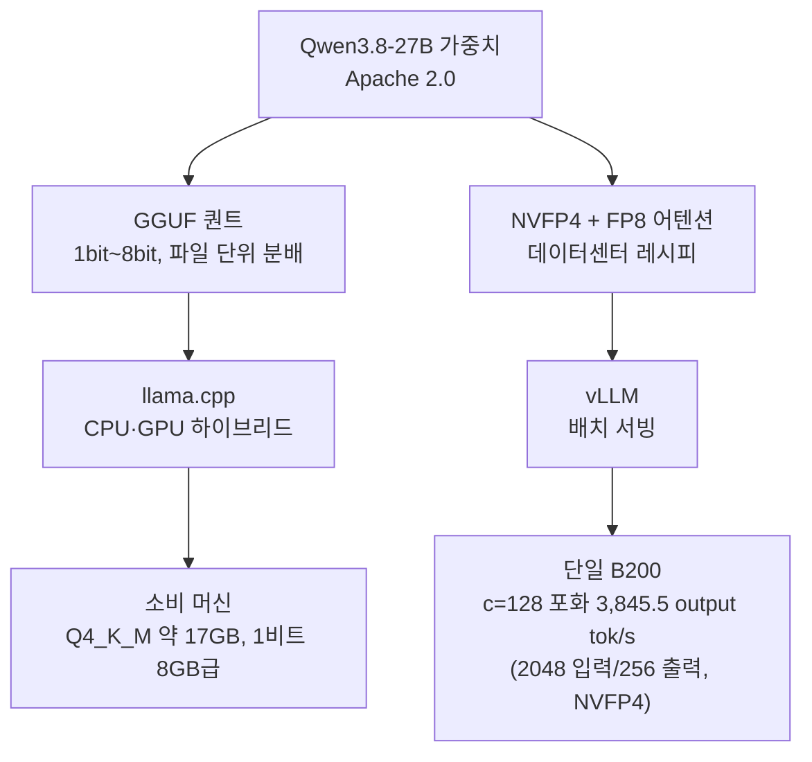

*같은 가중치가 두 서빙 경로로 갈린다는 개념을 형상화했습니다. 소비 머신(앰버)과 데이터센터(블루)로 흐르는 퀀트 블록의 두 갈래.*

## 왜 읽어야 하나

27B급 오픈 모델을 서빙할 경로를 고르는 엔지니어를 위한 글입니다. 결론부터 말하면 Qwen3.8-27B의 Unsloth GGUF가 24일 만에 1천만 다운로드와 3천700 좋아요를 기록하며 "역대 가장 사랑받은 GGUF"가 됐다는 수치는 이례 현상이 아니라 구조의 결과입니다. 이 모델의 64개 어텐션 층 중 48개가 컨텍스트에 비례하지 않는 linear attention이라 27B급 멀티모달 모델이 소비 머신에서 긴 컨텍스트를 소화하는 장벽이 구조적으로 낮아진 것입니다. 같은 가중치 위에 GGUF(llama.cpp)와 NVFP4(vLLM)라는 두 서빙 경로가 모두 1급 시민이 된 상황에서, 경로 선택은 워크로드의 성격을 묻는 논쟁이 됐습니다.

## 무슨 일이 있었나

2026년 8월 14일, 알리바바 통이 랩이 Qwen3.8-27B를 Apache 2.0 라이선스로 공개했습니다. 공개 이틀 뒤 8월 15일, Unsloth의 GGUF 퀀트가 Hugging Face 트렌딩 3위에 올랐고 8월 18일에는 2위까지 올랐습니다. 그리고 9월 9일, Unsloth의 발표 기준 Qwen3.8-27B GGUF는 24일 만에 1천만 다운로드, 3천700 좋아요를 기록하며 GGUF 카테고리 역대 1위 좋아요 모델이 됐습니다. Hugging Face의 페이지 스냅샷에서도 3천500에서 3천700 사이 좋아요 대가 확인되어 발표 수치와 독립적으로 부합합니다.

다운로드 수 자체보다 주목할 지점은 대상입니다. 1천만 다운로드를 찍은 것은 dense 27.78B 멀티모달 모델입니다. 비전 인코더(이미지+동영상)를 태운 27B급을 소비 머신으로 끌어내린 GGUF가 GGUF 카테고리 자체의 최다 좋아요를 가져갔습니다.

## 왜 Qwen3.8-27B가 소비 머신으로 밀리는가

핵심은 어텐션 구조입니다. Qwen3.8-27B는 64개 변환기 블록을 갖춘 dense 멀티모달 모델인데, 그중 16개만 full gated attention이고 48개는 Gated DeltaNet linear attention입니다. full attention은 컨텍스트가 길어질수록 KV 캐시가 선형으로 자랍니다. 반면 linear attention은 고정 크기의 재귀 상태(recurrent state)를 유지합니다. 토큰이 2천 개든 20만 개든 그 48개 층의 상태 메모리는 같은 크기입니다.

KV 캐시 성장은 full attention 16개 층이 소유합니다. 같은 깊이의 순수 트랜스포머라면 64개 층 전부에서 KV가 자라지만, 이 구조에서는 64개 중 48개가 컨텍스트 길이와 무관한 상태로 남습니다. 컨텍스트 26만 토큰(native)에서 100만 토큰(YaRN)으로 늘려도 메모리의 주요 가변 요소는 그 16개 층의 KV뿐입니다. 27B급 모델을 소비 머신의 메모리로 들여오려면, 가중치 크기를 줄이는 것(퀀트)과 컨텍스트 성장을 제한하는 것(KV 구조)이 함께 작동해야 합니다. Qwen3.8-27B는 후자를 아키텍처가 대신해 줍니다.

나머지 명세도 로컬 친화적입니다. 비전 인코더가 내장되어 이미지와 동영상을 직접 소화하고 Multi-Token Prediction(MTP) 드래프트 헤드도 붙어 있습니다. `reasoning_effort` 파라미터(xhigh, medium, low)로 추론 깊이를 조절할 수 있고, native 컨텍스트는 262,144 토큰입니다.

## GGUF는 무엇이 다른가

GGUF의 분배 단위는 파일입니다. 퀀트 수준마다 하나의 .gguf 파일이 내려오고, llama.cpp이 그것을 CPU와 GPU의 혼성 메모리 위에서 실행합니다. 서빙 인프라를 세울 필요 없고 파일을 받아 실행하는 것 자체가 서빙입니다.

Qwen3.8-27B의 퀀트 메뉴는 Unsloth Dynamic V3.0 기술로 1비트에서 8비트까지 나옵니다. 크기 체감은 이렇습니다. bf16 원본 가중치는 55.59 GB(저희가 8월에 측정한 값)이고, Q4_K_M은 17 GB 안팎(퀀트 출처에 따라 16.8에서 17.9 GB)입니다. 1비트 퀀트는 약 8 GB 램에서 실행이 됩니다. 같은 모델이 55 GB에서 8 GB로 7배가량 압축되는 구간에 "로컬 실행"이 열립니다.

Unsloth의 주장 중에는 벤더 수치로 둔 것이 있습니다. 4비트 퀀트가 에이전틱 코딩 벤치마크에서 풀 모델과 동급이라는 것입니다. 여기에는 독립 재현 수치가 없습니다. 공급자 발표로 구분해 읽어야 합니다. 참고로 같은 GGUF는 bartowski도 따로 배포합니다. 27B급 주요 모델에는 이미 퀀트 공급자 경쟁이 붙어 있습니다.

## 언제 GGUF, 언제 데이터센터 서빙인가

두 경로는 같은 가중치를 다른 메모리 체계 위에 실행합니다.

GGUF 경로의 강점은 진입 비용입니다. 모델이 개인 데이터에 머물렀으면(프라이버시) 서빙이 머신 위에 있으면 되고 배치 처리량이 요구되지 않는 대화형 워크로드라면 CPU+GPU 혼성이 충분합니다. 27B급 멀티모달 모델이 Q4_K_M 17 GB로 들어오는 것은, 그 조건을 갖춘 머신에서 "사내 모델 실험"이 파일 다운로드 수준으로 끝난다는 뜻입니다.

데이터센터 서빙은 반대로 배치가 왕입니다. 저희가 이 모델을 NVFP4로 단일 B200에서 튜닝 서빙 설정으로 측정한 값은, 출력 256 토큰·입력 2,048 토큰 기준으로 단일 스트림(c=1) 138.8 tok/s에서 동시성 128(c=128) 3,845.5 tok/s, 256(c=256) 4,150.7 tok/s입니다. 같은 레시피에서 어텐션을 FP8으로 두는 변형이 bf16 대비 포화 1.675배를 낸 실험은 이미 이 블로그에 정리되어 있습니다. llama.cpp 단일 스트림의 토큰 속도와 vLLM 포화 처리량은 같은 "속도"가 아닙니다. 전자는 개인이 대화하는 속도이고 후자는 수백 명이 동시에 받는 용량입니다.

경로 선택을 워크로드 기준으로 정리하면 이렇습니다. 개인·소규모 대화, 프라이버시 민감 데이터, 실험과 프로토타이핑, 에지 배포는 GGUF. 다중 테넌트 서빙, API 트래픽, 포화 처리량이 상품인 경우에는 vLLM 계열 데이터센터 경로. 두 경로 사이에는 "더 나은 쪽"이 없고, "그 트래픽을 누가 받나"가 다릅니다.

## ThakiCloud 제품 적용 시사점

ThakiCloud의 ai-platform(Metis) 관점에서 이 모델은 서빙 레시피의 경제성을 다시 보는 계기입니다. 8월에 저희는 같은 Qwen3.8-27B에서 레이어별 정밀도 배분(어텐션을 bf16으로 두지 않고 FP8으로)만 바꿔 포화 처리량을 bf16 대비 1.488배에서 1.675배로 올리고 체크포인트를 30.14 GB에서 22.90 GB로 줄였습니다. GGUF 1천만 다운로드는 그 같은 레시피 경제성이 데이터센터 밖에서도 파일 단위 분배로 유통되기 시작했다는 신호입니다.

하이브리드 어텐션 모델의 등장은 KV 캐시 계획 자체를 바꿉니다. 기존에 "컨텍스트 길이 × 동시성 × 헤드당 KV 크기"로 잡던 캐시 예산에서 이 구조는 성장하는 층이 4분의 1뿐이라는 사실을 반영해야 합니다. 서빙 엔드포인트의 컨텍스트 상한을 올리는 비용 계산이 순수 트랜스포머에 비해 구조적으로 가벼워지는 것입니다. Metis 서버리스 서빙에서 긴 컨텍스트 워크로드를 받아들일 때 모델 선택 기준에 "어떤 층이 KV를 자르느냐"가 하나 더 들어옵니다.

두 경로를 1급으로 다룬다는 점은 운영의 폭이기도 합니다. 같은 모델이 GGUF로 파일에 실리고 NVFP4로 엔드포인트에 서는 구조에서 "모델을 어떻게 실행할 것인가"는 모델 선택과 독립된 두 번째 결정이 됩니다. ThakiCloud는 그 두 번째 결정을 플랫폼이 대신 내어줄 수 있는 자리에 있습니다.

## 한계 및 반론

첫째, 다운로드·좋아요 마일스톤은 생산 권장이 아닙니다. "역대 1위 GGUF"는 커뮤니티 유통 속도의 측정입니다. 특정 워크로드에서의 최적 서빙 경로에 대한 증거는 아닙니다. 1천만 다운로드가 의미하는 것은 모델의 매력과 유통의 매끄러움입니다.

둘째, 소비 머신 경로의 처리량 천장은 그대로입니다. llama.cpp의 단일 스트림 속도는 vLLM 포화 처리량과 같은 차원의 숫자가 아닙니다. GGUF 경로가 "로컬에서 되니까"로 끝나는 순간 데이터센터 서빙이 제공하는 동시성·캐싱·스케일링은 사라집니다. 마일스톤이 커진다고 그 천장이 높아지지는 않습니다.

셋째, 비전 경로가 llama.cpp에서 얼마나 성숙한지는 이 마일스톤이 답하지 않습니다. 멀티모달 모델이 GGUF로 유통되면 가중치는 내려오지만 비전 인코더 실행의 성능과 호환성은 텍스트 퀀트와는 별개의 문제입니다. 1천만 다운로드의 대다수가 텍스트 워크로드인지 비전까지 함께 실행된 다운로드인지는 공개 수치로 구분할 수 없습니다.

넷째, 4비트=풀모델 동급 같은 주장은 벤더 발표입니다. 독립 벤치마크가 따라붙기 전까지는 참고로 두는 것이 정확합니다.

## 정리

Qwen3.8-27B의 GGUF 마일스톤이 남긴 질문은 "두 경로를 누가 어떻게 나누는가"입니다. 하이브리드 어텐션이 27B급 모델을 소비 머신으로 내렸고 파일 단위 분배가 그 장벽을 없앴습니다. 같은 가중치가 GGUF로 개인 머신에 NVFP4로 데이터센터에 실리는 지금 서빙 경로 선택은 워크로드의 성격을 묻는 질문이 됩니다. 개인 대화와 프라이버시 데이터에는 파일이 답이고 동시성 수백의 API 트래픽에는 엔드포인트가 답입니다.

다음에 이 모델로 서빙을 설계할 때 한 줄을 더 적을 수 있습니다. "가중치는 하나, 경로는 두 개, 그리고 그 경로를 가르는 것은 트래픽의 성격이다." 모델 선택 회의에서 서빙 경로 회의가 분리되는 순간 이 마일스톤은 설계 관행으로 자리를 잡습니다.

## 출처

- [Unsloth 트윗 (Qwen3.8-27B GGUF 마일스톤, 2026-09-09)](https://x.com/hjguyhan/status/2097477949356429756)
- [Hugging Face: unsloth/Qwen3.8-27B-GGUF](https://huggingface.co/unsloth/Qwen3.8-27B-GGUF)
- [Hugging Face: Qwen/Qwen3.8-27B](https://huggingface.co/Qwen/Qwen3.8-27B)
- [Unsloth Dynamic 3.0 GGUF 문서](https://unsloth.ai/docs/basics/dynamic-3.0-ggufs)
- [이 블로그: 4비트를 더 쓴 쪽이 아니라 8비트를 제자리에 쓴 쪽이 이겼습니다 (Qwen3.8-27B NVFP4+FP8, 2026-08-19)](https://thakicloud.com/tech-blog/ko/research/qwen38-nvfp4-fp8attn/)
- [bartowski/Qwen3.8-27B-GGUF](https://huggingface.co/bartowski/Qwen3.8-27B-GGUF)
