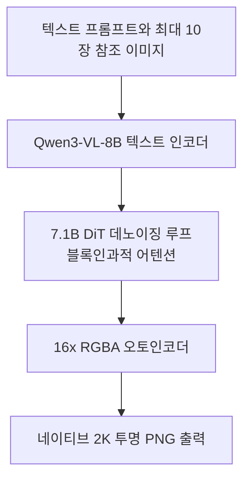
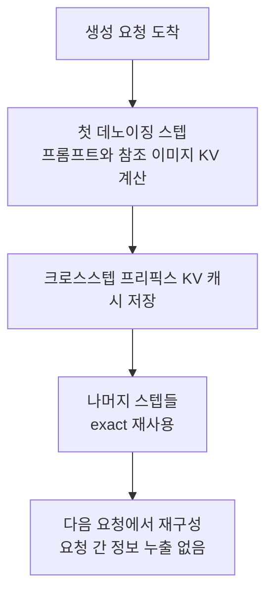

K8s 플랫폼에서 이미지 생성 모델을 서빙하거나 서빙을 준비하는 엔지니어가 이 글을 읽어야 합니다. 결론부터 한 문장으로 잡으면 9월 20일 Qwen-Image-2.1의 다섯 엔진 동시 day-0 지원에서 diffusion 서빙은 LLM 서빙과 같은 원리(exact 프리픽스 KV 재사용, CUDA Graphs)로 수렴했음이 확인됐고 텍스트와 이미지를 모두 서빙하는 플랫폼에 엔진 통합이 가설이 아니라 현실적 선택지가 됐습니다.

*생성된 이미지 타일이 같은 프리픽스 계산을 스텝마다 재사용하는 개념을 형상화했습니다.*

## 왜 읽어야 하나

이미지 모델을 서빙하는 사람은 크게 두 집단입니다. 하나는 diffusion 전용 엔진(Diffusers, ComfyUI)으로 컨테이너를 꾸려서 엔드포인트를 띄우는 팀이 있고 다른 하나는 LLM을 vLLM 계열 엔진으로 서빙하면서 이미지까지 같은 운영 체제로 가져오려는 플랫폼 팀입니다. 이 글은 후자의 질문, 즉 "엔진을 하나로 줄이는 게 이득인가"를 다루며 전자에게는 최신 모델의 서빙 가능 경로 자체를 제공합니다.

핵심 주장은 두 줄입니다. 첫째, Qwen-Image-2.1의 DiT가 블록인과적 어텐션을 쓰는 것은 모델 아키텍처 선택이지만 그 결과로 첫 데노이징 스텝에서 계산한 프롬프트와 참조 이미지의 KV를 이후 스텝에서 정확히 재사용할 수 있게 됐습니다. 둘째, vLLM-Omni가 이 재사용과 CUDA Graphs를 day-0부터 제공하는 것은 LLM 서빙에서 continuous batching과 prefix caching이 표준이 된 것처럼 diffusion 서빙에도 "엔진 최적화 표준"이 형성되고 있다는 신호입니다.

## 개요

알리바바 Qwen 팀이 2026년 9월 20일에 Qwen-Image-2.1을 오픈 웨이트로 공개했습니다. 전 세대 Qwen-Image-2512가 20.4B 단일 DiT + Apache 2.0 라이선스였다면 2.1은 구조와 라이선스 모두 바뀝니다. DiT 백본은 7.1B 단일 스트림으로 축소됐고 공식 저장소 표기는 7B입니다. 텍스트 인코더는 Qwen3-VL-8B로 통일되고 오토인코더는 16x RGBA를 처리합니다. 기능적으로는 텍스트-이미지 생성과 이미지 조건부 생성(편집)이 통합되고 네이티브 2K 해상도(약 2048x2048)와 네이티브 RGBA 투명 PNG, 최대 10장의 참조 이미지를 지원합니다.

서빙 생태계 반응이 이 글의 실제 주인공입니다. 릴리스 시점 Diffusers, ComfyUI, vLLM-Omni, SGLang, LightX2V 다섯 런타임이 day-0 지원을 제공했습니다. vLLM 프로젝트는 별도 발표로 "Qwen-Image-2.1이 vLLM-Omni에서 day-0 지원된다"고 알렸으며 레시피 페이지에 서빙 구성과 캐시 동작이 문서화되어 있습니다.

## Qwen-Image-2.1이 무엇인가

구성 요소를 표로 정리하면 아래입니다.

| 구성 | 사양 |
|---|---|
| DiT 백본 | 7.1B 단일 스트림 (블록인과적 어텐션) |
| 텍스트 인코더 | Qwen3-VL-8B |
| 오토인코더 | 16x RGBA (투명도 네이티브) |
| 출력 | 네이티브 2K (약 2048x2048), 가로세로비 보존 |
| 편집 | 최대 10장 참조 이미지, 생성과 조건부 생성 통합 |
| 벤치마크 | Qwen-Image-Bench 60.28 (벤더 자체) |
| 라이선스 | Qwen Research License (비상업) |

전 세대 대비 세 가지가 바뀝니다. 규모는 DiT 기준 약 3분의 1로 줄었습니다(20.4B -> 7.1B). 인코더는 Qwen3-VL로 통일되어 텍스트 명령과 조건 이미지가 같은 경로로 처리됩니다. 그리고 투명도가 "출력 포맷"이 아니라 "모델의 네이티브 능력"이 됐습니다. RGBA 알파 채널을 직접 생성하므로 후처리 크로마 키나 별도 segmentation이 필요 없고 인포그래픽과 스토리보드, 가상 착용 같은 레이어 기반 워크플로에 바로 들어갑니다.

벤더 자체 벤치마크(Qwen-Image-Bench)에서 60.28점으로 Nano Banana 2.0(59.82)보다 0.46점 앞선다는 수치가 공개 자료에 인용되지만 이 격차는 소수점 한 자릿수이고 벤더가 직접 측정한 것입니다. 독립 재현 수치는 아직 없는 쪽으로 읽는 것이 정확합니다.

라이선스는 방향이 바뀌었습니다. v1의 Apache 2.0이 상업적으로 안전했다면 2.1은 "연구나 평가 목적만" 허용하는 Qwen Research License입니다. 오픈 웨이트이지만 그대로 서비스에는 올릴 수 없고 상업 배포는 별도 계약이 필요합니다.

## vLLM-Omni의 day-0 지원

vLLM-Omni는 vLLM 프로젝트가 diffusion과 멀티모달 생성 모델에 LLM 서빙 기술을 적용하기 위해 만든 확장입니다. 텍스트 vLLM이 토큰 스트리밍과 continuous batching으로 "요청을 붙여 돌리는" 방식이었다면 이미지 서빙은 디코더를 여러 스텝 반복하면서 하나의 latents를 정제하는 구조라 서빙 단위가 달라집니다. 요청 하나는 N스텝 루프이며 배치 동시성은 동시 진행 중인 생성 작업 수를 의미합니다.

실제로 이미지를 서빙 경로에 올리면 운영 단위가 LLM과 세 가지에서 다릅니다. 첫째, 토큰 스트리밍이 없고 완결 신호가 이미지 한 장입니다. 둘째, 메모리 피크가 KV가 아니라 latents와 VAE 쪽이라 요청당 메모리 자국이 텍스트 대비 큰 편입니다. 셋째, 이미지 워크로드는 벌키입니다. 생성 요청이 연속 스트림이 아니라 묶음으로 들어옵니다. 이 세 가지는 엔드포인트의 모양을 정합니다. 벌키에는 스케일투제로 대기가 자연스럽고 메모리 모델이 다르니 이미지와 텍스트를 같은 엔드포인트에 섞지 않는 쪽이 자연스럽습니다. vLLM-Omni가 같은 엔진 계보에서 이 차이를 흡수하려 한다는 점이 플랫폼 운영자에게 흥미로운 이유입니다.

vLLM-Omni가 Qwen-Image-2.1에서 쓰는 가속은 두 가지로 문서화되어 있습니다. 하나는 크로스스텝 프리픽스 KV 캐시 재사용이고 다른 하나는 전용 CUDA Graphs입니다. 공식 설명은 "중복 연산과 커널 런칭 오버헤드 감소"이며 레시피 페이지가 캐시 동작의 상세를 담고 있습니다.

"day-0"이 플랫폼 관점에서 갖는 의미도 짚어둡니다. 공개 당일 다섯 런타임이 동시에 지원하는 구조는 모델 팀이 서빙 호환을 릴리스 조건으로 다뤘다는 뜻입니다. 보통의 릴리스에서는 공개 후 몇 주에서 몇 달 뒤에 런타임 포팅이 따라오고 서빙 팀이 그 공백을 자체 엔지니어링으로 메웠습니다. 서빙 생태계의 지원 속도가 운영 리스크를 정하기 때문에 day-0 동시 지원은 모델의 품질 스펙과 동일한 등급의 정보입니다.

## 서빙 아키텍처: 크로스스텝 프리픽스 KV 캐시

모델 데이터 흐름은 아래와 같습니다.

진짜 이야기는 두 번째 다이어그램, 요청 하나당 KV 캐시의 생명주기입니다.

블록인과적 어텐션이 이 구조의 전제입니다. DiT가 데노이징 스텝을 거듭해도 프롬프트와 참조 이미지에 해당하는 "프리픽스" 부분의 KV가 스텝을 건너 정확히 동일하다면 첫 스텝에서 계산한 값을 그대로 재사용할 수 있습니다. vLLM-Omni의 레시피에 따르면 이 캐시는 자동 활성화되며 첫 데노이징 스텝 이후에 프롬프트와 참조 이미지를 캐시해 후속 스텝에서 근사가 아닌 정확(exact) 재사용을 합니다.

세 가지 성질이 중요합니다. 첫째, exact입니다. LLM 서빙의 approximate prefix 재사용 계열과 달리 주의력 패턴 자체가 스텝 간 불변을 보장합니다. 둘째, 요청당 재구성됩니다. 새로운 생성 요청이 오면 프리픽스 KV를 다시 만들어 앞선 요청의 프롬프트나 참조 이미지 정보가 다음 요청에 새어 들어가지 않습니다. 멀티테넌트 서빙에서 이게 중요한 이유는 명백합니다. 셋째, 이득은 프리픽스 길이에 비례합니다. 참조 10장과 긴 프롬프트의 편집 작업에서는 스텝당 절약되는 연산이 크지만 짧은 프롬프트 단일 이미지 생성에서는 작습니다. "캐시가 있다"가 아니라 "어떤 워크로에서 얼마나"가 설계 변수로 읽어야 합니다.

CUDA Graphs는 같은 맥락에서 스텝 루프의 커널 런칭 오버헤드를 없애는 표준 수순입니다. diffusion 루프는 스텝 수가 적고 스텝당 연산이 커서 LLM 디코딩처럼 호출 수가 폭발하는 구간은 아니지만 배치 동시성에서 커널 런칭의 누적 비용은 여전히 존재하게 됩니다.

## ThakiCloud 제품 적용 시사점

ThakiCloud는 이미 이미지 모델 서빙을 운영 경로에 올렸습니다. Metis의 DOCKER_CUSTOM 서버리스 엔드포인트로 전 세대 Qwen-Image-2512(20.4B, Apache 2.0)를 서빙하고 가중치는 모델 카탈로그 인제스트 잡으로 SeaweedFS의 global/models에 적재하는 경로가 정립되어 있습니다. 즉 "이미지 모델 -> 엔진 컨테이너 -> 스케일투제로 엔드포인트 -> 카탈로그"라는 파이프라인 자체는 검증된 상태이고 Qwen-Image-2.1이 들어올 때 걸리는 문제는 파이프라인이 아니라 엔진입니다.

실측 기준으로 이 판단을 붙입니다. 우리 B200에서 Z-Image-Turbo는 18.2초/장이고 외부 API는 116초/장이었습니다(2026-08-15 실측). 3228장 생성을 4잡 병렬로 4.1시간에 끝낸 것과 대비해 같은 규모를 외부 API에 맡기면 104시간이었습니다. 이미지 생성의 서빙 경제학은 우리 GPU 위에서 이미 외부 API와 다른 게임이 돌아가고 있습니다. vLLM-Omni의 크로스스텝 KV 캐시와 CUDA Graphs가 이 위에 얼마나 더 얹히는지 특히 참조 10장의 편집 워크로에서 캐시 이득이 "프리픽스 길이에 비례"한다는 성질 덕분에 어디까지 커지는지는 실측해야 알 수 있습니다.

우리 현재 이미지 워크로드의 벌키 성격도 이 비교에 들어갑니다. 배치 생성은 병렬 잡으로 제출해 끝나면 GPU를 반납하고 서버리스 엔드포인트는 대부분 시간 동안 스케일투제로 있습니다. 그래서 엔진 비교의 질문은 "어느 쪽이 빠른가"가 아니라 같은 배치를 두 엔진으로 서빙할 때 비용이 어디에 가고 튜닝 여량의 차이가 어디에서 나는가입니다. Z-Image에서 B200의 18.2초/장이 특정 서빙 구성의 숫자였던 것처럼 엔진을 바꿀 때 변할 구간이 정확히 여기입니다.

엔진 통합 관점에서는 LLM 서빙의 교훈을 그대로 가져올 수 있습니다. Metis 서버리스의 텍스트 엔드포인트에서 플랫폼 기본값과 튜닝 설정의 차이가 단일 스트림 18.8배, 포화 17.9배였던 것처럼(2026-08-19 실측) 이미지 쪽 역시 "day-0에 로드된다"는 것과 "튜닝된 서빙 설정으로 포화 처리량을 낸다"는 것은 다른 사건입니다. day-0은 시작점이지 도착지가 아닙니다.

라이선스는 이 글의 가장 현실적인 제약입니다. 2.1은 비상업용 연구 라이선스라 그대로 고객 서빙에 올리면 안 됩니다. 상업 서빙을 하려면 Qwen과의 별도 계약이 전제이고 그 전에까지는 Apache 2.0인 v1(2512)이 안전 지점입니다. 플랫폼 입장에서는 카탈로그에 2.1을 적재하되 서빙 가능 플래그를 라이선스 상태로 제어하는 설계가 자연스럽습니다.

기능적으로는 네이티브 투명 PNG와 10장 참조 편집이 제품 표면으로 이어집니다. 디자인과 커머스 워크플로(커트아웃, 가상 착용, 스토리보드)에서 후처리 없이 레이어 출력되는 모델은 전 세대 대비 새로운 종류의 요청을 만듭니다. Paxis 관점에서는 "편집 지시 + 참조 이미지 + 출력"이 에이전트 스킬 하나의 원자 단위 작업으로 잡히는 지점입니다.

## 한계 및 반론

벤치마크 숫자의 해석은 보수적으로 해야 합니다. 60.28 대 59.82는 벤더가 직접 측정한 Qwen-Image-Bench의 수치이고 격차가 0.46점입니다. 독립 벤치마크로 재확인된 우위는 아니며 "경쟁 제품과 동급"이라는 정도까지의 서술이 안전합니다.

day-0 지원의 성격을 과대 해석하면 안 됩니다. 공개 당일 런타임이 모델을 로드하고 생성하는 것을 검증한 것이지 프로덕션 튜닝을 마친 것은 아닙니다. 텍스트 서빙에서 기본값과 튜닝의 차이가 두 자릿수 배였던 우리 경험도 같은 교훈입니다. 이미지 쪽의 "튜닝된 기본값"은 아직 존재하지 않는 영역에 가깝습니다.

하드웨어 요구치는 공식 자료가 부족합니다. 커뮤니티 보고로 RTX 3090 구동이 가능하다고 알려졌지만 참조 이미지 수와 해상도 조건을 붙인 공식 VRAM 사양은 확인되지 않았습니다. 7.1B DiT + 8B 인코더의 합산 파라미터와 데노이징 중의 메모리 피크를 감안하면 실제 배치 동시성은 실측 전에 가정하지 않는 편이 좋습니다.

캐시 이득에도 조건이 붙습니다. 프리픽스 길이에 비례한다는 성질 때문에 참조가 없는 짧은 프롬프트 생성에서는 이득이 작습니다. "크로스스텝 KV 캐시"를 듣자마자 모든 워크로에서 빨라진다고 읽으면 안 되는 이유입니다.

마지막으로 라이선스입니다. 오픈 웨이트의 가독성과 "그대로 서비스 가능"은 다릅니다. 연구 용도로 실험은 자유지만 고객에게 판매하는 서빙은 계약 문제입니다. 이 한계를 빼면 이 글의 모든 시사점이 반으로 줄어듭니다.

## 정리

이미지 생성 모델 서빙은 이제 별개의 영역이 아니라 LLM 서빙의 원리가 diffusion 구조에 도착한 영역입니다. Qwen-Image-2.1의 블록인과적 어텐션이 exact 크로스스텝 프리픽스 재사용을 가능하게 하고 vLLM-Omni가 그 재사용과 CUDA Graphs를 day-0부터 제공한다는 조합은 텍스트와 이미지를 함께 서빙하는 플랫폼에 "엔진을 하나만 돌리자"는 방향에 실질적인 무게를 더합니다.

ThakiCloud의 다음 행보는 세 가지입니다. 첫째, 2.1의 상업 라이선스 협상 여부를 확인하고 카탈로그의 서빙 가능 플래그를 그 상태로 제어합니다. 둘째, B200에서 Qwen-Image-2.1 + vLLM-Omni 비교 실험을 계획하고 day-0 기본값과 튜닝 설정을 팔로 나눠 재서 "17.9배"류의 설정 차이를 이미지 쪽에서도 확인합니다. 셋째, 참조 1장과 10장으로 캐시 이득을 분리 측정해서 어떤 워크로에서 크로스스텝 KV 캐시가 실제로 수익이 되는지 원장에 남깁니다.

## 출처

- Qwen-Image-2.1 공식 저장소: <https://github.com/QwenLM/Qwen-Image-2.1>
- Hugging Face 모델 카드: <https://huggingface.co/Qwen/Qwen-Image-2.1>
- vLLM 레시피 (Qwen-Image-2.1 서빙): <https://recipes.vllm.ai/Qwen/Qwen-Image-2.1>
- vLLM-Omni 저장소: <https://github.com/vllm-project/vllm-omni>
- vLLM 프로젝트 day-0 발표: <https://x.com/vllm_project/status/2101665920565629318>
- Qwen-Image-2.1 릴리즈 보도: <https://mixed-news.com/en/qwen-image-2-1-transparent-rgba-7b-open-weights-research-licence/>
- 릴리즈 분석: <https://qwenimages.com/blog/qwen-image-2-1-release>
