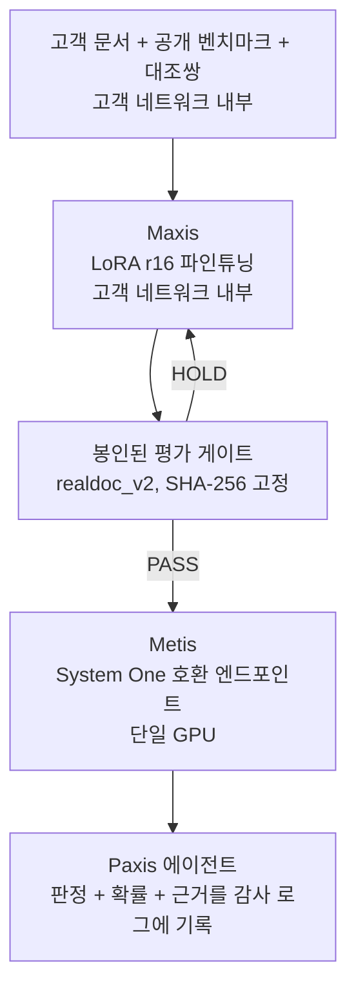
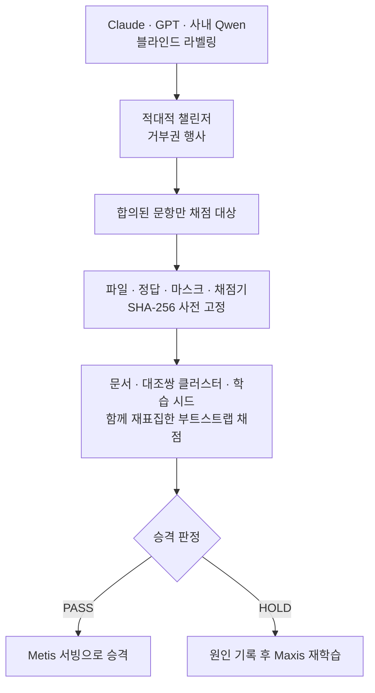

규정을 근거로 감사 가능한 판정을 내려야 하는 기업 아키텍트와 프로덕트 오너를 위한 글입니다. 결론부터 말하면, 고객 자신의 문서로 학습시킨 한국형 결정 모델을 Maxis로 고객 네트워크 안에서 학습시키고, 한 대의 GPU 위에서 Metis로 서빙할 수 있습니다. 이 루프를 지탱하는 것은 데이터, 학습, 봉인된 평가 게이트, 서빙, 에이전트로 이어지는 다섯 단계이고, 그중 어느 하나라도 빠지면 나머지 넷도 신뢰할 수 없습니다.

이 모델이 애초에 어떻게 학습되었고 대조쌍이 무엇을 바꿨는지는 [4B 모델에게 법령 속 숫자 판단을 가르친 방법](/tech-blog/ko/research/k-decision-4b-numeric-contrast-pairs/)에서 다뤘고, 그 모델이 실제로 어떤 정확도를 내는지, TypeSafe Jev와 견주었을 때 어디서 이기고 어디서 지는지는 지난 글 [Jev 한국판을 만든 이유](/tech-blog/ko/research/k-decision-jev-korean-comparison/)에서 다뤘습니다. 이 글은 그 모델을 만들어 내는 파이프라인 자체를 다룹니다.

*글의 핵심 개념을 형상화했습니다.*

## 문서를 사외로 보낼 수 없는 기업이 마주하는 문제

금융·보험·공공·국방 분야 기업은 대부분 원문이든 발췌본이든 문서를 사외 클라우드 API로 보낼 수 없습니다. 그런데 이런 기업일수록 규정을 근거로 한 판정, 예를 들어 특정 조항이 이 계약에 적용되는지, 이 청구가 상한을 초과하는지 같은 판단을 대량으로 처리해야 하는 경우가 많습니다. 대형 범용 모델을 사외 API로 호출하는 방식은 이 조건에서 애초에 후보가 되지 못합니다.

여기에 두 번째 요구가 겹칩니다. 자동화된 판정은 감사가 가능해야 합니다. 담당자가 나중에 "왜 이 문서가 상한 초과로 분류되었는가"를 물었을 때, 자유 텍스트로 생성된 설명만으로는 그 판정이 얼마나 확실했는지 되짚기 어렵습니다. 이 두 요구, 즉 데이터가 네트워크를 벗어나지 않아야 한다는 것과 판정이 감사 가능해야 한다는 것을 동시에 만족시키려면, 학습부터 서빙까지 전체 루프가 고객 네트워크 안에서 완결되고 매 판정이 확률과 근거를 함께 남기는 구조가 필요합니다.

이 요구를 만족시키려는 시도는 대개 두 축 중 하나에서 무너집니다. 사외 API를 그대로 쓰면 데이터 반출 요구를 넘지 못하고, 자유 텍스트 생성 모델을 그대로 온프렘에 올리면 판정이 감사 가능하지 않은 채로 남습니다. 이 파이프라인이 겨냥하는 자리는 그 둘 사이, 즉 온프렘이면서 동시에 판정 형식 자체가 감사를 전제로 설계된 자리입니다.

## 파이프라인 전체 구조

전체 루프는 데이터에서 시작해 에이전트에서 끝납니다. Maxis가 고객 네트워크 안에서 학습을 수행하고, 봉인된 평가 게이트가 승격 여부를 판정하고, Metis가 통과한 모델만 서빙하고, Paxis 에이전트가 그 서빙 결과를 판정 근거와 함께 감사 로그에 남깁니다.

*Maxis에서 Paxis까지, 데이터가 감사 가능한 판정으로 바뀌는 전체 경로입니다. 게이트를 통과하지 못한 모델은 다시 학습 단계로 돌아갑니다.*

각 단계가 무엇을 의미하는지는 아래에서 하나씩 짚습니다.

## Maxis: 고객 네트워크 안에서 학습시키는 LoRA 파인튜닝

학습 레시피는 단순합니다. Qwen3.5-4B-Base 위에 LoRA rank 16을 얹고, 2 에폭, 학습률 2e-5, 배치 크기 4에 그래디언트 누적 2, GPU 한 대로 돌립니다. 우리 실측에서는 H100 한 대에서 시드 하나당 약 67분(4,014초)이 걸렸고, 모든 결과는 시드 3개를 돌려 평균과 신뢰구간을 함께 보고합니다. 이 정도 규모라면 대형 모델을 처음부터 학습시키는 것과 비교할 수 없을 만큼 저렴하고, 고객사 내부 GPU 한 대로도 돌아갑니다. 지금까지의 학습은 사내 H100 클러스터에서 직접 돌렸고, 같은 레시피를 고객 망 안의 Maxis 학습 잡으로 옮기는 것이 제품 경로입니다.

학습 데이터는 여러 층으로 쌓입니다. 바탕에는 KoBEST와 KLUE를 타입드 디시전 형식으로 변환한 공개 벤치마크와, ThakiCloud가 만든 소규모 합성 정책 문항 세트가 있습니다. 그 위에 AI 허브(한국지능정보사회진흥원)의 법령·행정 문서 데이터셋이 학습 전용으로 더해지는데, 이 데이터셋 자체는 재배포하지 않습니다. 마지막 층은 6,000개의 프로그램 생성 대조쌍입니다. 단위 변환(원과 만원 사이), 일수 계산, 분수, 상한 초과 판정, 감면 분모 계산, 이자율 계산이라는 여섯 계열로 구성되고, 각 쌍의 정답은 사람이나 다른 모델이 아니라 그 쌍을 만드는 코드가 직접 계산합니다.

실제 고객이 이 파이프라인을 쓴다면 이 구조에서 바뀌는 부분은 마지막 층 근처입니다. 공개 벤치마크와 대조쌍 생성 로직은 그대로 두고, 고객 자신의 문서를 학습 데이터에 더하거나 교체합니다. 라벨은 가능한 한 코드가 계산하도록 설계하고, 코드로 계산할 수 없는 판정은 여러 모델의 합의로 라벨을 매깁니다. 다만 이 지점에서 규정 준수 요구가 하나 더 걸립니다. 규제 대상 고객의 데이터라면 라벨링에 쓰는 모델도 사내 모델로 한정해야 합니다. 클라우드 API로 라벨을 매기는 순간, 학습은 온프렘이어도 데이터의 일부가 그 API로 새어 나간 것이기 때문입니다.

이 제약은 번거로워 보이지만, 실제로는 파이프라인 설계를 더 단순하게 만듭니다. 라벨링 자체가 코드 계산이나 사내 모델 합의로 한정되면, 어느 단계에서도 "이 데이터가 외부로 나갔는지" 하나하나 추적할 필요가 없어집니다. 파이프라인 전 구간이 애초에 고객 네트워크 밖으로 나가는 경로 자체를 갖지 않기 때문입니다. 감사 가능성을 나중에 검증하는 것이 아니라 설계 단계에서 구조적으로 보장하는 편이, 규제 산업에서는 더 안전한 접근입니다.

| 축 | 값 |
|---|---|
| 베이스 모델 | Qwen3.5-4B-Base + LoRA rank 16 |
| 학습 설정 | 2 에폭, 학습률 2e-5, 배치 4 x 그래디언트 누적 2, GPU 1대 |
| 학습 시간(실측) | H100 1대, 시드당 약 67분(4,014초) |
| 반복 단위 | 시드 3개, 매 결과에 신뢰구간 포함 |
| 어댑터 크기 | 약 130MB (LoRA + 포인터 헤드) |

## 봉인된 평가 게이트: 이 제품의 신뢰 메커니즘

학습이 끝났다고 바로 서빙에 올라가지 않습니다. 그 전에 봉인된 평가셋 realdoc_v2를 통과해야 합니다. 이 세트는 법령 원문에서 그대로 발췌한 문서 115개로 구성되며 76개 법령과 25개 도메인에 걸쳐 있고, 322개 질문이 실제로 채점에 쓰입니다. 채점을 시작하기 전에 평가 파일, 정답, 마스크, 채점기 네 가지를 SHA-256 해시로 미리 고정합니다. 이 봉인은 한 번의 승격 판정에만 쓰이고, 설계를 바꾸는 실험은 별도의 개발용 세트에서 진행합니다.

이 게이트가 제품의 신뢰 메커니즘인 이유는 단순합니다. 고객이 "이 모델을 우리 판정 레이어에 배치해도 되는가"를 물을 때, 그 답은 학습 로그가 아니라 이 게이트의 통과 여부가 줘야 합니다. 게이트를 한 번만 여는 이유도 같습니다. 봉인된 세트를 여러 번 들여다보고 그때마다 설계를 조금씩 고치면, 그 세트는 더 이상 독립적인 증거가 아니라 학습 데이터의 연장이 되어 버립니다.

실제 승격 판정에서 num2 팔은 base 대비 정확도를 79.0퍼센트에서 92.7퍼센트로 올렸습니다. 세 시드로 잰 차이는 +13.8퍼센트포인트이고 신뢰구간은 [10.2, 17.6]입니다. 같은 크기의 데이터를 추가로 학습시킨 대조군과 비교해도 +4.8퍼센트포인트, 신뢰구간 [2.1, 7.7]로 유의하게 앞섭니다. 신뢰구간을 계산하는 방식 자체도 중요합니다. 대조쌍의 두 문서를 독립 표본으로 세거나 학습 시드 사이의 변동을 무시하면 신뢰구간이 실제보다 좁게 나와 과대 확신으로 이어집니다. 그래서 이 게이트는 문서와 대조쌍 클러스터, 학습 시드를 모두 함께 재표집하는 방식으로 신뢰구간을 계산합니다.

게이트 내부는 라벨링부터 승격 판정까지 여러 단계를 거칩니다.

*게이트 내부에서 라벨링과 채점이 어떻게 갈리는지를 보여줍니다. HOLD 판정은 조용히 버려지지 않고 원인과 함께 기록되어 다음 학습 라운드의 입력이 됩니다.*

이 게이트가 잡아낸 약점도 그대로 남깁니다. 이자율 계산은 학습 데이터에 1,000건 넘게 포함되어 있었는데도 여전히 약 51퍼센트 정확도에 머뭅니다. 금액에 이자율을 곱하고 일수로 나누는 복합 연산을 이 모델이 아직 배우지 못했다는 뜻입니다. 합성 분포 밖 평가셋에서는 `noul` 유형이 1.4퍼센트포인트 올랐지만, 1퍼센트포인트 이내 비열등성은 아직 확립되지 않았습니다. 게이트는 이런 약점을 감추지 않고 그대로 승격 판정 기록에 남깁니다.

## Metis: 서빙은 가볍고, 어댑터는 여러 개를 한 GPU에

게이트를 통과한 모델은 `kev.serve` 서버로 서빙하고, 이 서버가 Metis 엔드포인트에 올라가는 단위가 됩니다. 이 서버는 System One 호환 API를 노출하므로, Jev를 호출하도록 짠 코드가 엔드포인트만 바꾸면 그대로 동작합니다. 서빙은 GPU 한 대로 충분합니다. LoRA 어댑터와 포인터 헤드를 합친 크기가 약 130MB라서, 태스크마다 어댑터를 따로 두어도 저장·배포 부담이 작습니다. 다만 지금 서버는 프로세스 하나에 어댑터 하나를 올리므로, 베이스 모델 하나에 여러 어댑터를 동시에 얹는 멀티 어댑터 서빙은 아직 구현하지 않았습니다.

서빙 지연시간은 실측했습니다. Metis 위가 아니라 H100 한 장에 `kev.serve`를 직접 띄우고 bf16으로 봉인 법령셋 115건을 한 번에 하나씩 보냈을 때, 워밍업이 끝난 뒤 P50 115ms, P95 189ms였습니다(fp32는 P50 358ms). 요청마다 법령 발췌 한 건에 질문 약 세 개가 붙은 조건입니다. 목표로 잡은 P50 100ms에는 조금 못 미칩니다. 이 숫자는 동시 요청이 없는 단일 스트림 지연이므로, 대량 처리량이 필요한 배포에서는 동시성을 올려 가며 포화 처리량을 따로 재야 큐잉 전략을 확정할 수 있습니다. 그 측정이 이 파이프라인의 다음 순서입니다.

## Paxis: 판정을 감사 가능하게 만드는 마지막 단계

서빙된 확률은 그 자체로는 아직 제품이 아닙니다. Paxis 에이전트가 그 확률을 특정 워크플로 안에서 소비하고, 판정과 확률, 그리고 그 판정에 쓰인 문서 발췌를 함께 감사 로그에 남길 때 비로소 감사 가능한 자동화가 완성됩니다. 에이전트가 사람의 승인을 거쳐야 하는 단계라면, 승인자에게도 자유 텍스트 설명 대신 확률과 근거를 함께 보여 주도록 설계할 수 있습니다. 이 설계는 Aegis가 요구하는 완전 폐쇄망 배포와도 맞물립니다. 공공·국방처럼 물리적으로 분리된 네트워크에 배포해야 하는 고객에게는, 학습부터 서빙과 감사 로그까지 전 구간이 그 네트워크를 벗어나지 않는다는 사실 자체가 제품의 전제 조건입니다.

이 마지막 단계에서 결정 모델과 에이전트의 역할 분담도 분명해집니다. 결정 모델은 판정과 확률을 내놓는 역할만 맡고, 그 판정을 언제 자동으로 실행하고 언제 사람에게 넘길지는 에이전트 쪽 정책이 결정합니다. 예를 들어 확률이 높은 판정은 자동으로 다음 단계로 넘기고, 확률이 애매한 구간에 걸린 판정만 사람에게 승인을 요청하는 식입니다. 이렇게 역할을 나누면 결정 모델을 재학습하지 않고도 승인 정책만 바꿔 자동화 범위를 조정할 수 있습니다.

## 한계

이 파이프라인에도 분명한 한계가 있습니다. 첫째, 봉인된 평가셋의 정답은 사람이 직접 검증한 것이 아니라 Claude, GPT, 사내 Qwen 세 모델군의 블라인드 합의와 적대적 챌린저의 거부권으로 정해졌습니다. 셋이 공유하는 편향이 있다면 그 편향은 게이트에도 그대로 스며들어 있을 수 있습니다. 둘째, 이자율 계산처럼 데이터를 충분히 넣어도 여전히 배우지 못하는 연산이 존재합니다. 이런 연산이 걸린 워크플로에는 이 모델을 그대로 배치하기보다 사람의 검토를 남겨 두는 편이 안전합니다. 셋째, 합성 분포 밖 세트에서 `noul` 유형의 비열등성이 아직 확립되지 않았다는 사실은, 학습에 없던 새로운 질문 스타일을 만났을 때 이 모델의 동작을 아직 완전히 보장할 수 없다는 뜻입니다. 넷째, 서빙 지연시간은 단일 스트림으로만 쟀고 P50이 목표 100ms보다 15ms 깁니다. 대량 처리량이 필요한 워크로드에 이 구성이 맞는지는 동시성 측정이 나온 뒤에 판단해야 합니다.

## 고객이 이 루프를 시작하는 법

고객이 이 파이프라인을 시작하는 절차는 크게 세 단계입니다. 먼저 판정이 필요한 문서를 가져오고, 그 문서에 대해 `choice`, `noul`, `score` 중 어떤 유형의 질문이 필요한지 정의합니다. 이 단계에서 가장 중요한 작업은 모델을 고르는 것이 아니라 질문을 명확하게 타입으로 쪼개는 것입니다. "이 조항이 적용되는가"처럼 모호하게 남겨 둔 질문은 학습 데이터를 아무리 늘려도 애매한 채로 남습니다.

그다음 Maxis가 공개 벤치마크와 대조쌍 생성 로직 위에 고객 문서를 더해 학습시키고, 봉인된 평가 게이트를 한 번 통과시킵니다. 여기서 HOLD 판정이 나온다면, 그 원인이 특정 질문 유형인지 특정 숫자 계열인지를 먼저 좁히고 나서 다음 학습 라운드에 반영합니다. 원인을 좁히지 않고 데이터만 더 넣는 것은, 이 글 앞부분에서 대조군과 비교해 확인한 것처럼 대조쌍이라는 데이터 성질 자체가 주는 이득보다 효율이 낮습니다.

마지막으로 게이트를 통과한 모델만 Metis 엔드포인트에 올리고, Paxis 에이전트가 그 판정을 워크플로 안에 배선합니다. 이 세 단계 중 어느 것도 문서가 고객 네트워크를 벗어나야 진행되지 않습니다. 그리고 게이트를 통과하지 못한 모델은 서빙으로 올라가지 않는다는 규칙이, 이 루프가 신뢰를 유지하는 유일한 이유입니다.
