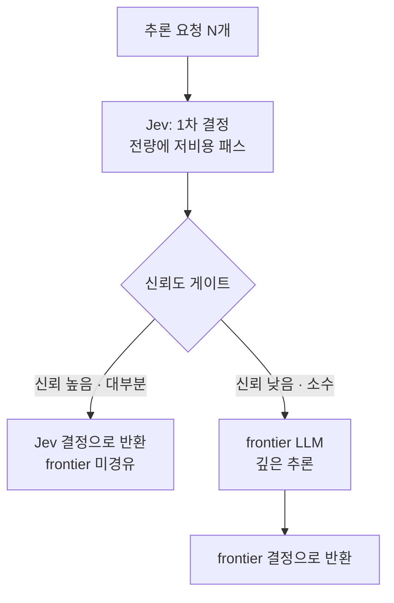

*전방의 얇은 벽이 대부분의 트래픽을 흡수하고 후방의 두꺼운 벽은 소수만 통과시킵니다.*

## 왜 읽어야 하나

LLM 추론을 서빙하거나 그 비용을 관리하는 엔지니어, 그리고 Metis 토크 팩토리의 모델 라우팅을 설계하는 분이라면 이 글이 필요합니다. 핵심 결론부터 말합니다. 대부분의 구조화 결정은 가장 싼 모델이 혼자 처리할 수 있고 frontier LLM은 자신감이 낮은 소수 케이스에만 넘기면 같은 품질을 유지하면서 비용을 크게 줄일 수 있습니다. 이 글은 그 주장이 어디까지 성립하고 어디에서 무너지는지를 독립 벤치마크의 숫자로 짚습니다.

## 개요

최근 viral이 된 스레드 하나를 소개합니다. Stanford 팀이 결정 모델 Jev를 Claude Code와 짝지어 750억 개의 데이터 포인트를 11분마다 정렬한다는 내용입니다. Jev가 전량에 대해 싼 1차 패스를 돌리고 Claude는 그중 어려운 케이스에만 개입합니다. 빠르고 싸고 compute가 훨씬 적게 든다는 것이 thrust입니다.

단, 이 "750억 / 11분" 수치는 해당 팀의 보고입니다. 우리가 직접 재본 것이 아니라, 널리 퍼진 주장으로 인용합니다. 중요한 것은 이 숫자가 아니라 숫자 뒤에 있는 **구조**입니다. 싼 모델로 전량을 1차 걸러내고 비싼 모델에 소수만 넘기는 cascade. 이 구조는 Jev가 아니어도 성립하고 Jev를 쓰지 않아도 만들 수 있습니다. Jev는 이 구조를 가장 극단적으로 보여주는 예일 뿐입니다.


*전방의 얇은 벽이 트래픽의 대부분을 흡수하고, 확인하지 못하는 소수의 난제만 후방의 두꺼운 벽으로 통과시킵니다.*

## Jev가 무엇인가

Jev는 TypeSafe가 내는 "System One" 결정 모델입니다. 이름에서 짐작할 수 있듯, 자유 텍스트를 쓰는 통용 LLM과 다릅니다. Jev가 반환하는 것은 **타입이 붙은 결정**입니다. 분류, 라우팅, 검증, 의도 판별 같은 작업에서 "이건 스팸이다", "등급 3이다", "승인한다" 같은 구조화 출력이 나옵니다.

이 설계가 추론 비용에 직접 연결됩니다. 독립 벤치마크를 정리한 ayautomate의 테스트를 보면, Jev는 4개의 LLM과 함께 791개의 라벨이 붙은 결정 작업에서 비교됐습니다. 몇 가지 실측 수치를 나열합니다.

- 지연: Jev 중앙값은 약 432ms, 통용 LLM은 약 1.4초. 벤더가 주장하는 "193.6배 빠름"은 자체 테스트이고 독립 측정은 그보다 완만한 배율입니다.
- 비용: 문서 1,000개당 Jev는 약 0.22달러, LLM은 1.31~3.08달러. 약 83~93% 절감입니다.
- 정확도: 같은 구조화 작업에서 Jev는 최상위 통용 LLM보다 **측정 가능한 범위에서 낮습니다**. 벤더조차 정확도 우위를 주장하지 않습니다.


*ayautomate의 791개 라벨 독립 벤치마크. 문서 1,000개당 약 0.22달러, 중앙값 지연 약 432ms.*

마지막 항목이 이 글의 핵심입니다. Jev는 빠르고 싸지만, 똑똑하지는 않습니다. 그래서 "Jev로 전부 돌린다"는 접근은 품질을 깎습니다. 정답은 Jev를 전부에게 쓰되, 자신감이 떨어질 때만 비싼 모델로 넘기는 것입니다.

## 신뢰도 게이트 cascade: 이 패턴은 어떻게 작동하는가

구조를 다이어그램으로 보면 단순합니다.



작동은 세 단계를 따릅니다.

1. 전량에 싼 모델을 돌립니다. Jev가 각 요청에 대해 타입이 붙은 결정과, 그 결정에 대한 신뢰도 점수를 함께 냅니다.
2. 신뢰도 점수를 임계치로 구분합니다. 임계 이상이면 Jev의 결정을 그대로 반환합니다. 임계 미만이면 그 요청만 frontier LLM으로 넘깁니다.
3. frontier LLM이 어려운 소수에 대해 깊은 추론을 하고 그 결과를 반환합니다.

여기서 결정적 노브는 **임계치**입니다. 임계치를 낮추면 대부분의 요청이 frontier로 흘러가서 비용이 오르고 높이면 Jev가 틀린 결정을 더 많이 보내서 품질이 깎입니다. 임계치는 Jev의 신뢰도가 실제 확률과 얼마나 잘 맞는지, 즉 **calibration**에 따라 잡습니다. calibration이 안 된 모델의 신뢰도는 "자신 있다"는 말일 뿐 확률이 아니라, 임계치를 잡을 근거가 없습니다. Jev가 벤더 측에서 calibration을 측정 지표로 삼는 이유가 여기에 있습니다.

pseudocode로 그 흐름을 추상화하면 다음과 같습니다.

```python
def route(req):
    d, conf = jev.decide(req)          # 타입 붙은 결정 + 신뢰도
    if conf >= THRESHOLD:
        return d                        # 대부분: 싼 모델로 끝
    return frontier_llm.decide(req)     # 소수: 비싼 모델로
```

이 세 줄이 cascade 전체입니다. 모델이 둘이고 분기는 신뢰도 하나입니다.


*결정과 신뢰도를 함께 추출하고, 임계치 이상의 대다수는 여기서 종료되며, 임계치 미만의 소수만 frontier로 승격됩니다.*

## Claude Code에 쓰는 구체적 예

cascade는 추론 서빙에만 머무르지 않습니다. 실제 개발 도구의 컨텍스트 관리에도 들어갑니다. explainx가 소개한 fast-jev-compaction 플러그인은 Claude Code의 `/compact`를 대체하는 실험입니다.

통용의 `/compact`는 긴 대화의 핵심을 frontier LLM이 요약으로 압축합니다. 비쌉니다. 이 플러그인은 Jev가 도구 호출 하나하나에 대해 "이 호출은 이제 불필요하다", "이것은 아직 컨텍스트에 남길 가치가 있다"를 점수 매기고 불필요하다고 판단된 것만 제거합니다. 요약이라는 생성 작업이 아니라, 삭제라는 구조화 결정으로 바꾼 것입니다. Jev가 잘하는 것, 즉 타입이 붙은 판단을 그대로 쓰는 예입니다.

## ThakiCloud 제품 적용 시사점

이 구조는 다키클라우드의 두 제품에 이미 녹아 있습니다.

**Metis(ai-platform) 렌즈.** Metis는 토크 팩토리이고 그 핵심 기능 중 하나가 모델 라우팅입니다. 요청이 들어오면 복잡도·토큰량·비용 목표에 따라 어느 모델로 보낼지를 결정합니다. cascade는 이 라우팅의 한 형태입니다. 싼 모델이 전량을 1차 받고 자신감이 낮은 것만 비싼 모델로 승격. Metis는 이 승격의 임계치를 워크로드별로 조정할 수 있고 승격률을 관측 지표로 봅니다. Jev라는 특정 모델이 없어도, "구조화 결정을 잘 하는 싼 모델" 하나만 있으면 동일한 cascade를 세웁니다. 독립 벤치마크가 말하는 83~93% 절감은 Metis가 추론 단가를 낮추는 데 직접 쓰는 수치가 됩니다.

**Paxis 렌즈.** Paxis는 Metis 위에 도는 Agent-Native Cloud입니다. 에이전트가 도구를 호출하고 그 결과를 판단하고 다음 행동을 정하는 루프는 본질적으로 cascade의 반복입니다. Paxis의 비용 인식 라우팅은 각 스텝에서 "이 판단은 싼 모델로 충분한가, 아니면 비싼 모델이 필요한가"를 물습니다. cascade를 에이전트 루프의 매 턴에 적용하면, 에이전트의 총 추론 비용이 큰 폭으로 떨어집니다. 저비용 서빙이 에이전트 경제성을 만든다는 것, 그것이 Paxis와 Metis를 잇는 문장입니다.


*Paxis의 Agent-Native 루프는 매 턴마다 이 판단을 싼 모델로 충분한지 검증하는 cascade의 반복입니다.*

## 한계 및 반론

이 구조의 약점은 정확도입니다. Jev가 최상위 LLM보다 낮다면, cascade는 "Jev가 틀리고 frontier를 부르지 않는 케이스"에서 품질을 잃습니다. 임계치를 낮게 잡으면 frontier 승격률이 올라가서 절감 효과가 줄고 높게 잡으면 Jev의 오류가 그대로 사용자에게 나갑니다.

두 번째 약점은 calibration입니다. 신뢰도가 실제 확률과 안 맞으면 임계치를 잡을 근거가 사라지고 cascade는 "Jev가 말하면 다 들은" 구조로 퇴화합니다. 세 번째는 적용 범위의 문제입니다. Jev가 강한 것은 분류·라우팅·검증 같은 **정의가 잘 되는 구조화 결정**입니다. 열린 생성, 새로운 추론, 맥락에 크게 의존하는 판단에서는 cascade의 이득이 줄고 frontier가 직접 맡는 편이 낫습니다. "Jev로 전부를"이라는 벤더 헤드라인은 이 적용 범위를 넘어선 과장으로 읽습니다.

마지막으로, 이 글이 인용한 절감 수치는 ayautomate의 독립 벤치마크와 벤더 측 실측의 조합입니다. 벤더 헤드라인("193.6배, 444.6배")은 자체 테스트로, 독립 측정보다 훨씬 큽니다. 실제 워크로드에서는 벤더 헤드라인이 아니라 독립 측정에 가깝게 수렴할 가능성이 높습니다.

## 정리

cascade는 특정 모델의 기능이 아니라, 추론 비용을 구조로 다루는 패턴입니다. 싼 결정 모델이 전량에 1차 패스를 돌리고 frontier LLM은 자신감이 낮은 소수만 승격합니다. 독립 벤치마크가 말하는 절감(83~93%)은 이 구조가 정의 잘 된 구조화 결정에서 얼마나 큰지를 보여줍니다.

다키클라우드 관점에서는 두 가지가 나옵니다. Metis의 모델 라우팅에 cascade를 적용하면 추론 단가를 낮출 수 있고 Paxis의 에이전트 루프에 매 턴 cascade를 걸면 에이전트 총 비용이 줄어듭니다. 임계치는 calibration으로 잡아야 하고 열린 생성이나 맥락 의존 추론에는 이 구조가 적합하지 않습니다. 다음 실험으로 추천하는 것은, 우리가 서빙하는 워크로드의 구조화 결정 비율을 먼저 재는 것입니다. 그 비율이 높을수록 cascade의 이득이 커지고 낮을수록 frontier를 그대로 쓰는 것이 낫습니다.

## 출처

- ayautomate, "Jev vs GPT and Claude: Independent Benchmark (2026)": https://www.ayautomate.com/blog/jev-vs-llm-benchmark
- explainx, "fast-jev-compaction: a Jev-powered Claude Code compaction plugin": https://www.explainx.ai/blog/fast-jev-compaction-claude-code-plugin-2026
- explainx, "Jev speed/cost claims fact-check (2026)": https://www.explainx.ai/blog/jev-speed-cost-claims-fact-check-2026
- kiosa (@thegreatest_sv), Stanford 팀 Jev+Claude Code 스레드: https://x.com/thegreatest_sv/status/2103503039579500633
