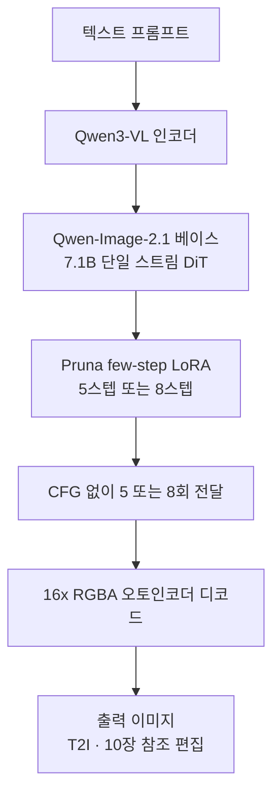

## 왜 읽어야 하나

이미지 생성 모델을 서빙하거나 배치 생성을 돌리는 엔지니어가 이 글을 읽어야 합니다. 결론을 먼저 잡습니다. PrunaAI가 Qwen-Image-2.1용 few-step LoRA 어댑터를 오픈소스하면서 이미지 서빙 비용의 두 번째 레버인 '스텝 수'가 엔진과 가중치를 건드리지 않는 오프더셸 부품이 됐고, 이는 지난주에 다룬 vLLM-Omni의 크로스스텝 KV 캐시와 CUDA Graphs 같은 엔진 레버와 독립적으로 합성됩니다.


*베이스라인 50스텝이 5~8스텝으로 압축되는 경로를 형상화했습니다.*

## 개요

9월 20일 Qwen 팀이 Qwen-Image-2.1을 공개하고 vLLM-Omni가 day-0으로 서빙하면서 diffusion 서빙은 LLM 서빙과 같은 원리(블록인과적 어텐션의 exact 크로스스텝 KV 재사용, CUDA Graphs)로 수렴했습니다. [지난 글](/tech-blog/ko/llmops/qwen-image-2-1-vllm-omni-day0/)에서 그 엔진 측면을 B200 실측 기준으로 분석했습니다.


이 글은 같은 모델의 다른 축을 다룹니다. 스텝 수입니다. 9월 23일경 PrunaAI가 Pruna-Qwen-Image-2.1을 오픈소스했는데, 이는 5스텝 또는 8스텝으로 동작하도록 베이스 모델을 조율하는 LoRA 어댑터 세트입니다. CFG(유도 계수) 없이, 최대 6.3배 빠른 생성을 주장합니다.

PrunaAI는 모델 효율성 전문 기업으로, diffusion 모델의 스텝 수 축소를 주력 기술로 삼아 왔습니다. [지난해 Pruna의 효율성 큐레이션을 분석한 글](/tech-blog/ko/research/prunaai-awesome-ai-efficiency-comprehensive-analysis-ko/)에서 그들의 기술 방향을 확인한 바 있습니다. 이번 오픈소스는 그 방향이 Qwen-Image-2.1이라는 현재 최상위 오픈 이미지 모델에 적용된 것입니다.

## Pruna-Qwen-Image-2.1이 무엇인가

어댑터는 두 개입니다. 5스텝 버전과 8스텝 버전. 둘 다 LoRA 형태로, Qwen-Image-2.1의 베이스 파이프라인 위에 얹습니다. Civitai에 올라온 설명이 정확합니다. 베이스 파이프라인, 텍스트 인코더, VAE는 그대로이며 DiT의 전달만 5회 또는 8회로 줄어듭니다.

이 형태가 가진 의미가 세 가지 있습니다.

첫째, 베이스 가중치를 바꾸지 않습니다. 양자화(4bit, 8bit)가 정밀도를 줄여서 모델의 '크기'를 바꾸는 것이라면, few-step LoRA는 전달 횟수를 줄여서 계산 '경로'를 바꾸는 것입니다. 같은 베이스 모델을 두고, 양자화본과 few-step본을 자유롭게 조합할 수 있는 이론적 여지가 있습니다. (실제 조합 시 품질 상호작용은 별도 검증 대상입니다.)

둘째, CFG를 제거합니다. 표준 파이프라인은 스텝마다 조건부와 무조건부 포워드를 두 번 돌려 유도 벡터를 계산합니다. 50스텝이면 100회의 전달(NFE, network function evaluations)입니다. CFG를 없애면 스텝당 1회. 8스텝이면 8회, 5스텝이면 5회. NFE로 환산하면 이론적 최대 약 12.5배(8스텝) 또는 20배(5스텝)입니다. Pruna의 헤드라인 '최대 6.3배'는 NFE 산술보다 보수적인 값입니다. 월클록에 VAE 디코드, 텍스트 인코더, 스텝별 비용 비균등이 포함되기 때문입니다. 6.3배는 50/8 = 6.25와 일치해, NFE가 아니라 '스텝 수 기준'으로 측정한 헤드라인임을 암시합니다.


셋째, T2I와 이미지 편집 모두에 적용됩니다. Qwen-Image-2.1의 10장 참조 편집까지 few-step으로 돌아간다는 것입니다. 편집 워크플로가 T2I와 같은 가속을 공유하는 것은, 배치 생성과 반복 편집이 섞인 파이프라인에서 실질적으로 중요합니다.



## 사용법

diffusers 경로입니다. 베이스 파이프라인을 로딩한 뒤 Pruna 어댑터를 올리고 스텝을 5 또는 8로, 유도를 끕니다.

```python
from diffusers import QwenImagePipeline

pipe = QwenImagePipeline.from_pretrained("Qwen/Qwen-Image-2.1", torch_dtype=torch.bfloat16)
pipe.load_lora_weights("PrunaAI/Pruna-Qwen-Image-2.1")
pipe.to("cuda")

# 8스텝, CFG 비활성화(true_cfg_scale=1.0)
image = pipe(
    prompt="a photo of a red panda in a snowy forest",
    num_inference_steps=8,
    true_cfg_scale=1.0,
    lora_scale=1.0,
).images[0]
```


모델 카드의 사용법에 따르면 inference provider(ComfyUI 등)에서도 동일하게 동작합니다. ComfyUI 위키에 9월 23일 Pruna 5스텝·8스텝 LoRA의 ComfyUI 통합이 문서화됐고 멀티리퍼런스 편집까지 커버합니다. Pruna의 호스트드 API(docs.api.pruna.ai)도 같은 어댑터를 제공하며, 커스텀 LoRA 적재와 프롬프트 강화, negative prompt를 지원합니다.

5스텝과 8스텝 중 어디에서 시작해야 할지는 워크로드 성격이 결정합니다. 참조 편집(10장)이 품질의 뼈대를 잡아 주는 워크플로라면 5스텝도 품질 안전판이 상대적으로 두껍습니다. 베이스 프롬프트만으로 품질을 좌우하는 순수 T2I에서는 8스텝이 보수적 출발점입니다. Pruna가 두 버전을 모두 공개한 이유는, 이 트레이드오프를 사용자가 워크로드 단위로 선택할 수 있게 하기 위해서입니다.

이 글에서는 자체 재측정을 수행하지 않았습니다. Pruna의 6.3배 수치는 그들의 주장이며, B200 기준 재측정은 별도 실험으로 진행할 예정입니다.

## ThakiCloud 제품 적용 시사점

**ai-platform 렌즈.** 다키클라우드의 이미지 생성 파이프라인은 B200에서 돌고 있습니다. Z-Image-Turbo 기준 18.2초/장 실측, Qwen-Image 계열은 레지스트리에 적재되어 있고, 캐릭터 생성과 배치 이미지 작업이 상시 수행됩니다. few-step LoRA가 이 파이프라인에 의미하는 것은 다음입니다.

비용은 NFE에 비례합니다. 배치 생성(1회 호출에 4~8장)에서 스텝을 50에서 8로 줄이면, DiT 전달 비용이 이론적으로 1/6.25가 됩니다. VAE 디코드와 텍스트 인코더 비용은 고정이라 전체 월클록 절감률은 그보다 낮지만, DiT가 지배 비용인 대형 배치에서는 근접합니다.

도입 비용이 낮은 것이 결정적입니다. 엔진 변경이 없습니다. vLLM-Omni로 서빙 중이든 diffusers로 돌리든, 베이스 가중치를 다시 내리거나 서빙 스펙을 바꾸지 않아도 됩니다. LoRA 파일 하나를 적재하는 수준입니다. 이는 지난 글의 크로스스텝 KV 캐시 레버와 정직하게 구분됩니다. KV 캐시는 동일 생성 내에서 스텝 사이의 계산을 재사용하는 것이고, few-step LoRA는 생성 자체의 스텝 수를 줄입니다. 엔진 레버와 스텝 레버가 각각 회당 비용과 전달 횟수에 작용하는 것이므로, 둘을 함께 쓰면 효과가 곱해집니다.

배치 규모가 클수록 이 레버의 가중치가 커집니다. 1회 호출에 4~8장을 생성하는 배치에서 스텝을 50에서 8로 줄이면, DiT 전달 비용은 이미지당 이론적으로 1/6.25가 됩니다. VAE 디코드와 텍스트 인코더 비용은 고정이라 전체 절감률은 그보다 낮지만, 배치 크기가 커질수록 DiT 비용의 비중이 높아지고 절감률도 이론값에 접근합니다. 18.2초/장이라는 Z-Image-Turbo 실측값이 있는 환경에서, Qwen-Image 계열에 few-step 어댑터를 얹는 것은 엔진을 바꾸지 않고도 시간대를 한 단계 내리는 경로입니다.

품질 게이트가 선행돼야 합니다. 다키클라우드의 학습 데이터 품질 규율에 따르면, 생성된 이미지를 다시 학습 입력으로 쓰는 파이프라인에서 few-step 산출물의 품질은 '일관성'이 아니라 '쓸 만함'으로 검증해야 합니다. 5스텝과 8스텝의 품질 차이를 실측하지 않으면, 8스텝을 기본값으로 놓고 5스텝은 고해상도·장시간 배치에 한해 적용하는 것이 보수적 배치입니다.

라이선스는 확인 대상입니다. Pruna 어댑터의 라이선스가 베이스 모델(Apache-2.0 계열)과 동일한지, 상용 서비스에 적용 가능한지는 모델 카드를 확인해봐야 합니다.

**Paxis 렌즈.** few-step LoRA가 에이전트 워크플로에 닿는 지점은 '비용 예측'입니다. Paxis 위에서 이미지 생성 도구를 호출하는 에이전트가, 호출당 비용과 시간을 알 수 있다면 토큰 배정과 실행 계획이 달라집니다. 8스텝이면 Z-Image급의 시간대가 아니라 그 이하로, 즉 에이전트가 한 번에 더 많이 생성하고 디스크리트하게 선택하는 워크플로가 가능해집니다.


## 한계 및 반론


'최대'의 함정입니다. 6.3배는 50/8의 스텝 수 비율과 일치합니다. 5스텝 버전의 실측 월클록 가속은 모델 카드에서 확인되지 않으며, NFE 산술(20배)와 헤드라인(6.3배)의 간극은 어디까지나 Pruna 측의 측정 기준에 귀속됩니다. 그래서 자체 재측정 시에는 스텝 수 비율이 아니라 월클록을 재고, DiT 전달 시간과 VAE·인코더 고정 시간을 분리해서 기록해야 합니다. 그래야 '6.3배'가 내 하드웨어에서도 성립하는지, 아니면 VAE 비중이 큰 내 환경에서는 3배 수준인지 구분할 수 있습니다.

CFG 제거의 대가입니다. negative prompt가 사라지는 것은 스타일 제어의 경직성을 의미합니다. '이런 느낌 말고 저런 느낌'을 프롬프트만으로 유도해야 합니다. 참조 편집(10장)이 품질을 지탱하는 워크플로에서는 이 제약이 작지만, 순수 T2I에서는 실측 검증이 필요합니다.

베이스 의존성입니다. Qwen-Image-2.1이 2.2로 갱신되면, 이 어댑터는 재증류 대상이 됩니다. few-step LoRA는 '현재 베이스에 최적화된' 부품이고, 베이스의 이동과 동시에 무효화됩니다.

Pruna의 상업 모델입니다. 오픈소스 어댑터가 동시에 호스트드 API로 제공되는 구조는, 어댑터 자체가 상용 API의 퍼널임을 시사합니다. 자체 서빙과 Pruna API의 비용 비교에서 오픈소스가 이길 때만, 오픈소스라는 선택이 성립합니다.

LoRA 적층 문제입니다. 스타일 LoRA, 서브젝트 LoRA와 few-step LoRA를 동시에 올렸을 때의 상호작용은 미검증입니다. 두 LoRA가 같은 DiT 가중치에 영향을 주므로, 적층 순서와 scale이 품질에 영향을 줄 가능성이 있습니다.

## 정리

Qwen-Image-2.1을 서빙하거나 배치 생성을 돌린다면, 지금 당장 해볼 것이 있습니다. 8스텝 어댑터를 적재하고 기존 50스텝 베이스와 같은 프롬프트 세트로 A/B를 돌려보는 것입니다. 월클록을 재고, 품질을 눈으로 보고, 그 다음에 5스텝으로 넓히는 것이 순서입니다.

에이전트 플랫폼을 설계한다면, 스텝 수가 이제 비용 모델의 1차 변수가 됐다는 점을 반영해야 합니다. NFE에 비례하는 DiT 비용, 고정인 VAE·인코더 비용, 그리고 CFG 유무가 스텝당 비용에 미치는 영향을 구분해서 잡아야 합니다.

다키클라우드의 다음 실험은 두 가지입니다. B200에서 8스텝·5스텝의 자체 재측정, 그리고 vLLM-Omni 크로스스텝 KV 캐시와의 합성 효과. 둘은 독립 레버이므로, 합성 시너지가 양의인지 측정으로 확인해야 합니다.


한 줄로 닫습니다. 스텝 수 레버가 이제 오프더셸 부품이 됐고 남은 일은 '어디까지 줄이는가'의 실측입니다.

## 출처

- [PrunaAI/Pruna-Qwen-Image-2.1 (Hugging Face 모델 카드)](https://huggingface.co/PrunaAI/Pruna-Qwen-Image-2.1)
- [QwenLM/Qwen-Image-2.1 (GitHub)](https://github.com/QwenLM/Qwen-Image-2.1)
- [Civitai: Pruna Qwen Image 2.1](https://civitai.com/models/2962344/turbo-few-step-lora-adapters-pruna-qwen-image-21)
- [ComfyUI Wiki: Pruna 5-Step and 8-Step Qwen-Image 2.1 LoRAs](https://comfyui-wiki.com/en/news/2026-09-23-pruna-qwen-image-2-1)
- [Pruna AI 공식 발표 (LinkedIn)](https://www.linkedin.com/posts/pruna-ai_today-we-open-source-pruna-qwen-image-21-activity-7508918316690972672-A3tz)
- [Pruna API 문서: Qwen-Image](https://docs.api.pruna.ai/guides/models/qwen-image)
- [지난 글: vLLM-Omni의 Qwen-Image-2.1 day-0 지원](/tech-blog/ko/llmops/qwen-image-2-1-vllm-omni-day0/)
- [지난 글: PrunaAI 효율성 큐레이션 분석](/tech-blog/ko/research/prunaai-awesome-ai-efficiency-comprehensive-analysis-ko/)
