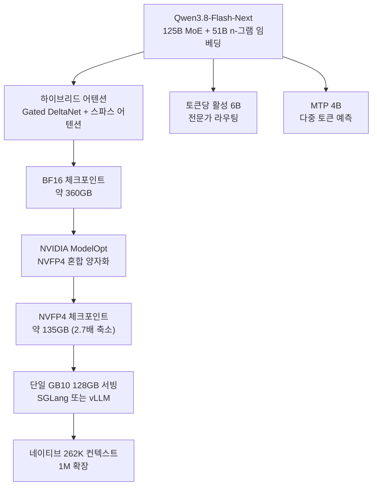

## 왜 읽어야 하나

서빙 인프라를 운영하는 엔지니어라면 이번 주에 한 체크포인트의 존재만으로 계산법이 바뀔 일이 생겼습니다. 125B 매개변수 MoE 모델을 단 하나의 128GB 개발용 장치에서 돌릴 수 있게 됐기 때문입니다. 핵심 결론을 먼저 말합니다. 대형 MoE 서빙의 하한선은 개발용 단일 기기로 내려왔지만, 그 장치 위에서 실제로 나오는 처리량은 체크포인트가 아니라 엔진의 서빙 설정이 결정합니다. 이 글은 NVIDIA가 NVFP4로 공개한 Qwen3.8-Flash-Next의 아키텍처와 검증된 서빙 경로를 정리하고, 같은 NVFP4 경로에 대한 우리 B200 실측에서 그 결론을 확인합니다.

## 개요

알리바바가 Qwen3.8-Flash-Next를 공개했습니다. 125B 매개변수의 Mixture-of-Experts 모델이며 토큰당 실제로 계산에 참여하는 매개변수는 6B 수준입니다. 여기에 51B 규모의 n-그램 임베딩 테이블과 4B의 MTP(Multi-Token Prediction) 모듈이 붙습니다. 어텐션은 Gated DeltaNet과 스파스 어텐션을 섞은 하이브리드 구조입니다. 네이티브 컨텍스트는 262,144토큰이며 확장 시 1M까지 열립니다. 알리바바는 이 모델을 "다가오는 Qwen4 아키텍처의 예고편"이라고 설명했습니다.

그런데 이 모델을 둘러싼 첫 번째 큰 뉴스는 공개 자체가 아니라, 그보다 며칠 뒤에 따라온 NVIDIA의 양자화였습니다. `nvidia/Qwen3.8-Flash-Next-NVFP4`가 Hugging Face에 올라왔습니다. NVFP4(4비트 부동소수)로 양자화한 체크포인트로, BF16 대비 약 2.7배, 약 63% 작습니다. BF16에서 약 360GB였던 체크포인트가 NVFP4에서 약 135GB가 됩니다. 그리고 135GB는 단 하나의 NVIDIA GB10(DGX Spark, 128GB 통합 메모리)에 올라가는 크기입니다.

세 개의 사실이 한 줄에 나란히 섭니다. 대형 MoE, 4비트 양자화, 그리고 개발용 단일 기기에의 착륙입니다. 이 조합이 중요한 이유는 "125B급 모델을 서빙하는 것"의 비용 곡선이 이전 세대와 다른 형태를 갖게 됐기 때문입니다.


*양자화가 체크포인트를 어떻게 압축하는지를 형상화했습니다.*

## 이 기술은 무엇인가

Qwen3.8-Flash-Next의 구조는 세 축으로 이해할 수 있습니다.

첫째, MoE의 활성 매개변수 설계입니다. 총 125B 가운데 토큰마다 6B만 활성입니다. 추론 비용은 총 크기가 아니라 활성 크기에 비례하므로, 이 모델의 실제 속도는 6B급 모델과 같은 차원에서 생각해야 합니다. 다만 가중치 전체를 메모리에 올려두는 비용은 125B급입니다. MoE 서빙의 전형적 트레이드오프, 즉 "빠르되 큰" 구조입니다.

둘째, 하이브리드 어텐션입니다. Gated DeltaNet(선형 복잡도의 상태 기반 어텐션)과 Qwen 스파스 어텐션을 층별로 섞었습니다. 전체적으로 MHA에 가까운 구조를 유지하되, KV 캐시의 물리 크기를 줄여 장문 컨텍스트의 메모리 압력을 낮춥니다. 262K 네이티브 컨텍스트가 가능한 이유 중 하나가 여기에 있습니다.

셋째, Engram n-그램 임베딩입니다. 51B 매개변수의 n-그램 임베딩 테이블을 모델에 별도로 두고 자주 나타나는 서브워드 패턴은 신경망 계산이 아니라 테이블 조회로 처리합니다. 계산이 아닌 "찾기"로 대체되는 토큰이 존재한다는 뜻입니다. MTP 모듈이 토큰 여러 개를 한 번에 예측하면서 이 모델은 "토큰당 1회 계산"이라는 통상 가정을 깨고 옵니다.



NVFP4 양자화 자체는 새로운 기술이 아닙니다. NVIDIA ModelOpt가 FP4 주 가중치에 민감한 층만 FP8/BF16으로 남기는 혼합 양자화를 하고 Blackwell GPU의 네이티브 FP4 텐서 코어가 이를 직접 계산하는 구조입니다. 새것은 이 구조가 125B MoE와 하이브리드 어텐션, Engram 테이블이라는 최신 아키텍처에 그대로 적용됐는지에 있습니다. 양자화 손실이 일반 dense 모델이 아니라 이 복합 구조에서 얼마나 작은지, 발표된 벤치에서 확인해야 하는 지점입니다.

여기서 짚어야 할 것은 "4비트"라는 숫자 뒤에 숨은 차이입니다. 4비트 양자화는 하나만 존재하지 않습니다. GPTQ, AWQ, NF4, 그리고 이번 NVFP4가 모두 4비트 영역에 속하지만, 이를 계산하는 경로는 다릅니다.

| 양자화 방식 | 데이터형 | 계산 경로 | 목표 하드웨어 |
|---|---|---|---|
| GPTQ | 4비트 정수 | 해방(dequant) 커널, W4A16 | Ampere/Ada 등 기존 GPU |
| AWQ | 4비트 정수 | 해방 커널, 활성화 인식 보정 | 기존 GPU |
| NF4 | 4비트 (양자 분포 기반) | 해방 커널, Q-LoRA 중심으로 사용 | 기존 GPU |
| **NVFP4** | 4비트 부동소수 | **네이티브 FP4 텐서 코어** | **Blackwell (SM100/SM121)** |

정수 기반 4비트(GPTQ, AWQ, NF4)는 가중치를 4비트로 압축하지만, 실제로는 해방한 뒤 16비트로 계산하는 W4A16 경로를 듭니다. 압축은 되지만 계산 자체는 여전히 16비트 텐서 코어가 합니다. NVFP4는 다릅니다. Blackwell에는 FP4를 직접 계산하는 네이티브 텐서 코어가 있어서, 해방 커널로 우회하지 않고 FP4에서 바로 연산합니다. 이 글의 B200 실측이 사용한 FlashInfer CuteDSL NVFP4 커널이 바로 이 네이티브 경로이며, Marlin 같은 정수 해방 폴백이 아닙니다.

이 차이가 중요한 이유는 하드웨어 의존성에 있습니다. 정수 4비트는 어떤 GPU에서도 동작하지만, NVFP4의 이득은 Blackwell에서만 완성됩니다. "63% 축소"가 처리량 이득으로 이어지려면 장치가 Blackwell이어야 합니다. 아래 한계 섹션에서 이 점을 다시 다룹니다.

## 설치 및 통합

검증된 서빙 경로는 세 개입니다.

Ollama. 가장 낮은 문턱입니다. `qwen3.8-flash-next:125b-a6b-nvfp4` 태그로 공개되어 있고 GB10 클래스 장비에서 바로 실행 가능합니다.

SGLang. 커뮤니티 레시피(r0b0tlab)가 NVIDIA 공식 NVFP4 체크포인트를 단일 GB10(SM121, ARM64)에서 SGLang으로 서빙하는 절차를 검증해 두었습니다.

vLLM. 2개 GB10으로 TP2+EP 구성, MTP 스펙추티브 디코딩, CUDA 그래프를 켠 상태에서 262K 컨텍스트를 데모한 레시피(getrefined)가 있습니다. NVIDIA 개발자 포럼에서는 1, 2, 4개 DGX Spark로 업스트림 vLLM nightly를 돌리며 단일 스트림 피크 64토큰/초를 보고했습니다. 이 수치는 커뮤니티 측정이며 우리 검증이 아닙니다.

```bash
# Ollama (GB10 클래스)
ollama run qwen3.8-flash-next:125b-a6b-nvfp4

# Hugging Face 체크포인트 (SGLang/vLLM용)
# nvidia/Qwen3.8-Flash-Next-NVFP4
# RadixArk/Qwen3.8-Flash-Next-NVFP4 (사양 동일한 미러)
```

여기까지가 "돌리는 법"입니다. 그런데 이 체크포인트가 실제로 서빙 처리량을 결정하는 것은 아닙니다. 그건 아래에서 우리 실측으로 보여줍니다.

## 실제 실험 결과

새 모델 125B를 이번 주에 B200에서 재는 것은 이 글의 범위를 벗어납니다. 대신, 동일한 NVFP4 양자화 경로가 우리 프로덕션 B200에서 어떻게 서빙되는지 이미 재둔 수치를 꺼냅니다. 대상 모델은 RadixArk의 `Qwen3.8-27B-NVFP4`(ModelOpt NVFP4, 동일 양자화 계열)이고 2026-08-19에 단일 B200에서 Metis 서버리스 경로를 통해 재둔 실측입니다.

조건은 같습니다. vLLM 0.24.0, 네이티브 FP4 커널(FlashInfer CuteDSL, SM100), KV 캐시 FP8, 최대 모델 길이 131,072. 변수는 서빙 설정 하나입니다.

| 서빙 설정 | c=1 (토큰/초) | c=32 | c=128 | c=256 |
|---|---|---|---|---|
| 플랫폼 기본값 (compile off, max-seqs 32) | 7.4 | 227.7 | 231.6 | 미측정 |
| 컴파일 켜기 | 138.9 | 2,326.6 | 2,320.5 | 미측정 |
| 튜닝 (compile on + max-seqs 256) | 138.8 | 2,324.5 | 3,845.5 | **4,150.7** |


*같은 NVFP4 모델, 같은 B200에서 서빙 설정만 바꾼 결과. 기본값은 c=32에서 포화되고 튜닝은 c=256까지 상승합니다.*

읽을 점은 두 개입니다. 첫째, 체크포인트는 그대로인데 단일 스트림 처리량이 7.4에서 138.8토큰/초로 18.8배 변합니다. 변한 것은 양자화가 아니라 `torch.compile`과 CUDA 그래프 여부입니다. 둘째, 기본값의 천장은 동시성 32에서 닿습니다. `--max-num-seqs 32`가 in-flight 시퀀스를 자릅니다. 클라이언트를 4배로 올려도 처리량은 227.7에서 231.6으로만 움직입니다. KV 캐시 용량은 379만 토큰인데, 그걸 쓸 수 있는 시퀀스 수는 32로 고정됩니다.

이게 NVFP4 체크포인트를 "받은" 것과 "서빙한" 것의 차이입니다. 135GB가 단일 GB10에 올라간다는 발표는 전자를 말합니다. 후자의 수치를 결정하는 것은 여전히 그 장치를 돌리는 엔진 설정입니다.

두 설정이 실제로 바꾸는 것을 하나씩 보면, 차이가 왜 이 정도인지 설명됩니다. `torch.compile`(과 CUDA 그래프)은 토큰 하나를 내는 데 걸리는 고정 오버헤드를 깎습니다. 컴파일을 끄면 매 스텝마다 커널을 런치하고 제어 흐름을 CPU가 조율하는데, 이 오버헤드가 단발 스트림에서는 계산 자체보다 크게 붙습니다. 그래서 c=1에서 7.4토큰/초가 138.8토큰/초로 뛴 것입니다. 같은 양자화, 같은 GPU인데도 18.8배의 격차가 고정 오버헤드 하나에서 나옵니다.

`--max-num-seqs`는 다른 축을 다룹니다. 동시에 처리 중인 시퀀스, 즉 in-flight 배치의 상한입니다. 이 값이 32로 고정되면, 클라이언트가 128개든 256개든 실제로 병렬로 도는 시퀀스는 32개로 잘립니다. 나머지 요청은 대기열에서 순서를 기다립니다. 그래서 기본값 팔은 c=32(227.7)에서 c=128(231.6)으로 거의 움직이지 않는 것입니다. KV 캐시가 379만 토큰 준비되어 있어도, 그 캐시를 한 번에 쓸 수 있는 시퀀스가 32개로 묶여 있으면 처리량은 거기서 멈춥니다.

두 축을 함께 읽으면, 양자화 체크포인트는 "얼마나 작은가"를, 서빙 설정은 "그 작은 체크포인트에서 얼마나 많이 내는가"를 결정한다는 구분이 선명해집니다. 대형 MoE의 NVFP4 공개가 서빙 경제학에 주는 메시지도 이 두 축 위에서 읽어야 합니다.

## ThakiCloud 제품 적용 시사점

NVFP4는 ThakiCloud의 ai-platform이 이미 운영 중인 양자화 경로입니다. B200 클러스터에서 ModelOpt NVFP4 체크포인트를 네이티브 FP4 커널로 서빙하고 양자화 자체도 내부 파이프라인(runpod-nvfp4-quantize 계열)으로 돌립니다. Qwen3.8-Flash-Next 같은 신규 대형 MoE가 NVFP4로 공개된다는 것은, 이 경로에 올라오는 모델 카탈로그가 넓어진다는 뜻입니다.

더 중요한 시사점은 온프레미스 쪽에 있습니다. 125B급 MoE가 128GB 통합 메모리 단일 기기에 서빙 가능해지면, "데이터를 외부로 내보내지 않고도 대형 모델을 돌린다"는 Aegis(온프레미스 프라이빗 클라우드)의 제안문이 한 단계 강해집니다. 금융·공공·국방처럼 데이터 주권이 전제인 환경에서, 대형 모델 서빙의 비용 곡선이 개발용 단일 기기로 내려온 것은 구조적 변화입니다.

Paxis 관점에서도 한 줄 덧붙입니다. 에이전트 워크플로의 실행 경제성은 결국 토큰당 단가에 붙습니다. 활성 6B와 Engram 조회, MTP라는 구조가 장문 에이전트 작업에서 실제로 어떤 토큰/지연 프로필을 만드는지는, 이 모델이 서빙 인프라에 올라와야 측정 가능한 질문입니다. 저비용 서빙이 에이전트 자동화의 실행 범위를 정합니다.

## 한계 및 반론

NVFP4는 Blackwell 전용입니다. SM100(B200)과 SM121(GB10)의 네이티브 FP4 텐서 코어가 없으면, 이 체크포인트의 이득은 사라지거나 Marlin 같은 폴백 경로로 강등됩니다. H100·H200 중심의 기존 클러스터에서 "63% 축소"는 체크포인트 용량에만 해당하고 처리량 이득은 보장되지 않습니다.

양자화 손실도 아직 우리가 검증한 숫자가 아닙니다. "BF16 대비 최소한의 손실"이라는 발표는 NVIDIA의 벤치 기준입니다. 우리의 워크로드(에이전트, RAG, 장문 추론)에서 동일하게 성립하는지는 따로 재야 합니다. Engram n-그램 테이블과 하이브리드 어텐션은 새로운 아키텍처 성분이므로, 캐시 행동과 배치 특성이 기존 dense 모델과 다를 수 있습니다.

마지막으로, GB10은 개발용 기기입니다. 128GB 통합 메모리에 135GB 체크포인트가 "오른다"는 사실과, 그 위에서 프로덕션 트래픽을 처리한다는 사실은 별개의 문제입니다. 단일 스트림 피크 64토큰/초는 커뮤니티 보고된 수치이며 포화 처리량과 동시성 특성에는 아직 공개된 실측이 부족합니다.

## 정리

Qwen3.8-Flash-Next의 NVFP4 공개는 두 가지를 동시에 바꿔놓습니다. 하나는 대형 MoE 서빙의 하한선입니다. 125B급 모델을 단일 128GB 장치에서 돌릴 수 있게 됐고 이는 온프레미스·데이터 주권 환경의 비용 계산에 직접 들어옵니다. 다른 하나는 서빙의 중심축입니다. 체크포인트가 63% 작아졌지만, 그 체크포인트의 처리량을 결정하는 것은 여전히 엔진의 compile 여부와 max-seqs 설정입니다.

다음 주에 이 모델을 B200에서 실측한다면, 볼 것은 하나입니다. "NVFP4가 125B를 135GB로 만들었다"가 아니라, "그 135GB가 어떤 설정에서 몇 토큰/초를 내는가"입니다. 전자는 발표고 후자가 서빙입니다.
