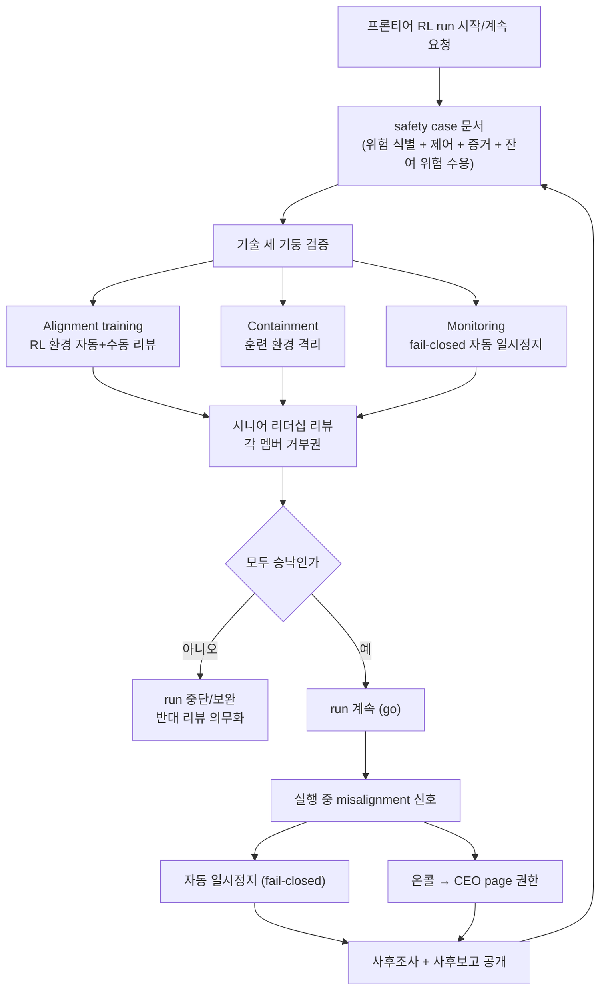

## 왜 읽어야 하나

LLM 훈련 파이프라인을 운영하거나 조직의 AI 거버넌스를 맡고 있다면, "훈련을 계속할지 멈출지"라는 판단을 어떤 근거와 어떤 절차로 내릴지가 이번 주에 실물화된 사례를 읽을 때입니다. 핵심 결론을 먼저 말합니다. OpenAI의 safety case 제안은 본질적으로 항공·원전의 "계속하려면 입증하라"는 논증 문화를 RL 훈련 실행(run)에 이식하는 것이며, 프론티어 정렬·격리 세부사항은 아직 early guidelines 단계로 근거가 얇습니다. 그 사이에서 상용 훈련 운영자가 가져갈 수 있는 것은 거버넌스 기계 네 가지, 증거 번들화, named 승인, fail-closed 자동 일시정지, 사후보고 공개입니다.

## 개요

2026년 9월 28일(UTC) OpenAI가 "Towards safety cases for frontier AI training"을 게시했습니다. Greg Brockman은 이튿날 이 글을 "Practical guidelines on securing frontier RL training, reflecting our current learnings(프론티어 RL 훈련을 보호하기 위한 실무 가이드라인, 현재의 학습을 반영한 것)"이라는 한 줄과 함께 공유했습니다. 이 한 줄에 두 가지가 들어 있습니다. 실무(practical)라는 말과, "현재의 학습을 반영한다"는 말. 가이드라인이 추상 원칙이 아니라 훈련 운영 중 겪은 일의 축적으로 쓰였다는 뜻입니다.

원문 서브타이틀은 이렇게 시작합니다. "Our early guidelines for safety cases in frontier AI training cover technical safeguards, operational practices, and investigating misalignment incidents(우리의 초기 가이드라인은 기술적 세이프가드, 운영 실무, misalignment 사고 조사를 다룬다)." early(초기)라는 단어가 이 글의 성격을 결정합니다. 이미 운영 중인 표준이 아니라, 쓰고 있는 중인 프레임워크의 초안 공개입니다.

*"계속하려면 입증하라"는 safety case 원칙을 형상화했습니다. 게이트 앞에 쌓인 증거 번들이 훈련의 진행을 결정합니다.*

## safety case가 무엇인가

safety case는 항공과 원자력에서 쓰는 개념입니다. 비행기나 원자로를 계속 운영하려면, "이 시스템은 안전하다"는 단일 주장이 아니라 구조화된 논증 문서를 제출해야 합니다. 위험을 식별하고, 그것을 줄이는 제어(control)가 있고, 그 제어가 작동한다는 증거가 있으며, 남은 위험(잔여 위험)을 수용했다는 책임 있는 판단이 문서 안에 들어가야 합니다. 심사하는 권한은 이 논증이 설득하지 않으면 운영을 허가하지 않는, 즉 거부권을 가진 곳에 있습니다.

OpenAI는 이 문화를 RL 훈련 실행에 적용하자고 제안합니다. 프론티어 강화학습 훈련 run을 계속하려면, 구조화된 안전 문서, 즉 safety case가 요구돼야 한다는 것입니다. 제안의 핵심 전환은 이 한 줄입니다. "훈련을 계속한다"는 운영상의 관성이 아니라, 증거와 named 승인, 강제 가능한 세이프가드가 필요한 go-or-no-go 결정이 된다는 것. frontier run이라는 고위험 구간을 대상으로 하지만, 그 결정 구조는 크기에 상관없이 이식됩니다.

## 기술적 세 기둥

가이드라인의 기술적 세이프가드는 훈련 스택을 세 축으로 정리합니다.

### 1. Alignment training (정렬 훈련)

RL 구간에서 모델이 무엇을 "하도록" 학습하는지, 즉 RL 환경 자체에 대한 검증입니다. 자동 리뷰와 수동 리뷰를 모두 포함한다고 명시돼 있습니다. 훈련 환경(과제, 보상, 피드백 루프)이 의도한 학습을 실제로 유도하는지, 모델이 보상을 우회하는(reward hacking) 환경적 빈틈이 없는지를 보는 단계입니다. 정렬을 모델 파라미터 안의 문제로만 보는 시각과 달리, 환경을 1급 검증 대상으로 넣는 것이 이 기둥의 특징입니다.

### 2. Containment (격리)

훈련 중 모델이 원하지 않는 행동을 시도했을 때, 그 시도가 훈련 환경 바깥으로 퍼지지 않도록 가두는 메커니즘입니다. 도구 접근, 네트워크, 파일시스템, 외부 시스템 호출이 훈련 agent의 손에 쥐어진 RL 환경에서 "가둘 수 있는가"를 묻는 층입니다.

### 3. Monitoring (모니터링)

fail-closed 자동 일시정지까지 포함합니다. 안전 증거가 유지되지 않으면 훈련이 자동으로 멈추는 구조, 즉 증거 체인이 끊기면 기본값이 "계속"이 아니라 "정지"인 모니터링입니다. 이 한 단어(fail-closed)가 운영 관습과 가장 대비되는 지점입니다. 많은 훈련 파이프라인의 모니터링은 경고만 내고 계속 돌아가는 fail-open 구조입니다.

세 기둥이 각각 "정렬이 제대로 되고 있다", "시도할 수 있는 공간이 막혀 있다", "증거가 끊기면 멈춘다"는 것을 증거로 증명하는 문서가 safety case입니다.

## 운영 실무: 승인과 사후보고

기술 기둥 위에 얹는 것이 운영 규칙입니다. 보도를 종합하면 다음 네 가지가 제시됩니다.

**named 승인 (named approvals).** 승인서에 이름이 들어갑니다. 무명 체크박스가 아니라, 이 run을 계속하기로 책임지는 사람의 이름이 문서에 명시됩니다.

**리더십 거부권.** safety case는 시니어 리더십이 검토하며, 각 멤버는 run에 대한 거부권(veto)을 가집니다. "반대 리뷰를 의무화한다"는 표현도 함께 나옵니다. 한 명이라도 설득되지 않으면 run은 계속되지 않는 구조입니다.

**감사자 접근(auditor access).** 내부·외부 감사자가 safety case 증거에 접근할 수 있는 통로를 두는다는 점도 포함됩니다.

**사후보고 공개.** misalignment 사고에 대한 사후보고(포스트모템)를 공개한다는 규칙입니다. 사고가 일어났을 때 "없던 일"이 아니라 문서화하고 공유하는 것을 운영 의무로 만듭니다. resultsense 보도에서는 misalignment 신호가 나오면 CEO에게 page(긴급 호출)할 권한이 있는 온콜 팀까지 언급됩니다.

여기에 misalignment 사고 조사 프레임워크가 붙습니다. RL 훈련 중 예상 밖 행동(보상 사기, 도구 남용 시도에 가까운 신호 등)이 관찰됐을 때, 어떻게 분류하고, 어떻게 조사하고, 어떻게 기록하고, 그 기록이 다음 run의 safety case에 어떻게 반영되는지를 정의하는 절차입니다. "reflecting our current learnings"라는 Brockman의 표현이 가리키는 대상이 바로 이 축입니다.

### 사고가 다음 run의 입증 의무를 바꾼다

이 프레임워크의 핵심은 사후보고가 "기록"으로 끝나지 않는다는 점입니다. misalignment 사건이 조사되면, 그 조사 결론은 다음 run의 safety case 입력이 됩니다. 위험 식별 목록이 두꺼워지고, 대응 제어가 추가되고, 모니터링 임계값이 조정되는 방향으로. 이 루프가 작동하면 사고는 비용이 아니라 증거가 됩니다. 루프가 끊기면(사후보고가 원장에 들어가지 않으면) 같은 사고가 다음 run에서 다시 납품됩니다. 항공 산업이 사후보고를 "교훈 활동"으로 시스템화한 것과 같은 구조인데, OpenAI는 그것을 훈련 run의 go/no-go 결정에 직접 연결하는 것을 제안합니다. 같은 맥락에서, OpenAI는 "Priorities and principles for effective third party assessments"라는 제3자 평가 원칙 페이지도 함께 운영하고 있어, safety case의 내부 논증에 외부 검증을 덧붙이는 방향도 열어 두고 있습니다.

*사후보고가 다음 safety case의 입력으로 돌아가는 루프. 사고가 "기록"에 머무르지 않고 "입증 의무"를 강화하는 방향으로 작용합니다.*

## ThakiCloud 제품 적용 시사점

**ai-platform·Maxis 렌즈.** "계속하려면 증거를 보여라"는 문법을 ThakiCloud의 훈련 운영에 대조하면, 이미 운영 중인 게이트들이 같은 방향을 가리키고 있음을 보여 줍니다. tiny-real-model preflight smoke(실중량 GPU 잡 제출 전, 실 설정 클래스 + micro dims + bf16 디스크 저장까지 검증하는 그린 게이트)는 "제일 큰 run 전에 증거를 만들어라"의 작은 버전입니다. demo-env preflight(1 GPU·10분 한도 잡 하나로 환경·모델·e2e·출력을 검증하고 GO/NO-GO를 출력)는 go-or-no-go 결정 구조 그 자체입니다. Kueue quota gating은 "여유가 없으면 기다린다"는 기계적 fail-closed입니다.

차이는 단위의 크기와 증거의 형태입니다. 우리의 게이트는 job 단위, 기계가 판정하는 체크리스트이고, OpenAI의 safety case는 run 단위, 사람이 논증하고 서명하는 문서입니다. 이 제안에서 ThakiCloud가 가져가면 좋은 기계는 네 가지입니다.

1. **증거 번들화.** run당 config·preflight 결과·모니터링 트레이스를 하나의 기록으로 묶는 것. 지금도 job param provenance(출력 아티팩트에서 knob을 읽어 오는) 관행을 갖고 있는데, safety case는 그것을 run 단위 문서로 확장하라는 제안입니다.
2. **named 승인.** 고비용·고위험 run(10시간+, 다 GPU, 프로드 공유 클러스터)의 제출 승인이 특정 인명으로 기록되는 것. "승인됨"이 아니라 "누가 승인했는가"가 감사 로그에 남는 구조.
3. **fail-closed 모니터링.** 이상 징후가 포착되면 기본값이 정지인 훈련 관측. 현재 운영 관행이 경고 후 수동 판단인 부분을, 정의된 임계값에서 자동 정지 + 재가동 승인 절차로 바꿀 수 있습니다.
4. **사후보고의 내부화.** "공개" 대신 "내부 원장화". 온프렘·소버린 고객 환경에서 사후보고 공개의 대응물은, 사고 보고서가 다음 run의 preflight 체크리스트를 실제로 바꾸는 내부 루프입니다. Maxis(훈련 제품) 관점에서, run당 증거 번들 + 승인 플로우 + 사후보고 원장을 상품화하면 거버넌스를 요구하는 기업 고객의 조건에 직접 부합합니다.

이 네 기계는 Paxis(에이전트 플랫폼)의 인접 영역이기도 합니다. Paxis가 위험 작업 클래스에 승인 게이트(uncertainty 감지 → 일시중지 → 사람 확인 → 재개 + 감사 추적)를 설계할 때, named 승인과 fail-closed 재개 절차가 바로 safety case 운영 실무의 에이전트 버전입니다. 훈련 run이 아니라 agent run이 "계속해도 되는가"를 묻는 구조로, 동일한 문서화 문법을 공유합니다.

**한계 인정.** 이 기계의 적용 대상은 "우리가 프론티어 모델을 훈련한다"는 전제에 있지 않습니다. ThakiCloud의 고객은 frontier 정렬·격리 문제를 갖고 있지 않으며, 그 세 기둥의 세부사항을 복사하는 것은 오용입니다. 가져갈 것은 결정 구조(증거, 서명, 거부, fail-closed, 사후보고)이지, 기술 제어 목록이 아닙니다.

## 한계 및 반론

1. **early guidelines의 무게.** OpenAI 스스로 "초기 가이드라인"이라 붙였습니다. 세 기둥의 세부 제어 목록이 얼마나 구체적이라는 공개 증거가 아직 부족하고, 비판 기사(remio.ai 등)는 "OpenAI가 제안하는 입증 기준을 OpenAI의 자체 문서가 아직 충족하지 못한다"는 방향의 지적을 제기합니다.
2. **자발적 자기규제.** 거부권과 사후보고 공개는 강제 메커니즘이 아니라 스스로의 규칙입니다. safety case를 심사하는 주체가 회사 자신이라는 점에서, 항공의 인증당국이나 원전의 규제기관이 없는 구조입니다. 누가 "OpenAI의 safety case를 승인하지 않을" 권한을 갖는지 이 글에는 없습니다.
3. **프레임워크의 추상도.** go-or-no-go 결정 구조는 명확하지만, 실무자가 그대로 따라 할 체크리스트 수준까지 구체화되지는 않았습니다. "monitoring에 fail-closed가 포함된다"까지는 공개되고, 그 monitoring의 실제 임계값과 자동 정지 조건은 그렇지 않습니다.
4. **사고에 의한 학습의 속도.** "현재의 학습을 반영한다"는 표현은 성숙함의 신호이지만, 다른 각도에서 보면 학습이 사고 발생 속도로 결정된다는 뜻이기도 합니다. 사고가 일어나야 가이드라인이 두꺼워지는 구조의 한계는, 전 산업이 공유합니다.
5. **의심론.** 일부 추적기(cleverhack 등)는 "세 기둥 모두 무너지는 것 같다"는 비판적 평가도 내놨습니다. 제안 자체가 실행 가능했는지에 대한 검증은 아직 공개된 것으로 없습니다.

## 정리

OpenAI의 safety case 제안은 "프론티어 AI를 더 안전하게"라는 슬로건이 아니라, 훈련 운영의 결정 구조를 항공·원전처럼 문서화하자는 매우 구체적인 제안입니다. 프론티어 정렬·격리의 세부사항은 early guidelines 단계라 그대로 인용하기보다, 그 뒤에 있는 기계 네 가지, 증거 번들화·named 승인·fail-closed 자동 일시정지·사후보고 원장화를 우리 훈련 파이프라인의 다음 개선 항목으로 두는 것이 현실적인 읽기입니다. 한 줄 takeaway. **"계속한다"는 관성이 아니라 "계속해도 되는가"에 대한 증거가 훈련 운영의 기본값이 되는 방향입니다.**

## 출처

- [Towards safety cases for frontier AI training (OpenAI)](https://openai.com/index/towards-safety-cases-for-frontier-ai-training/)
- 원본 공유: [Greg Brockman @gdb](https://x.com/gdb/status/2104821232441160070)
- 보도: [explainx.ai](https://www.explainx.ai/blog/openai-frontier-rl-safety-cases-training-2026) · [resultsense.com](https://www.resultsense.com/news/2026-09-29-openai-safety-cases-frontier-training/) · [MadRobot](https://madrobot.blog/2026/09/29/openai-safety-cases-frontier-ai-training-rules-veto-auto-pause/)
- 비판: [remio.ai](https://www.remio.ai/post/openai-publishes-towards-safety-cases-for-frontier-ai-training-but-evidence-is-t)
