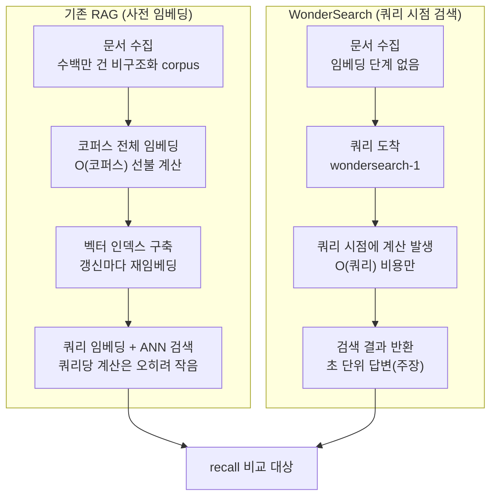

## 왜 읽어야 하나

RAG 파이프라인을 설계하거나 검색 인프라의 비용을 책임지는 엔지니어라면, "코퍼스를 전체적으로 임베딩할 것인가, 아니면 쿼리 때 계산할 것인가"라는 선택지를 이번 주에 한 번 더 마주하게 됩니다. 핵심 결론을 먼저 말합니다. WonderSearch는 RAG의 잉jest션 비용을 O(코퍼스)의 선행 지출에서 필요 시에 지출하는 O(쿼리) 비용으로 뒤집는 제품이며, "동등하거나 더 나은 recall"이라는 발표 주장은 현재로서는 검증된 수치가 아니라 확인 대기 상태입니다. 이 글은 발표된 사실과, 그 사실에서 도출할 수 있는 비용 구조의 분석, 그리고 우리 플랫폼이 이 구조를 어떻게 읽어야 하는지를 구분해 정리합니다.

## 개요

Polygres는 PostgreSQL 위에 그래프 탐색, 벡터 유사도, 전문(full-text) 검색, 그리고 이들을 합성한 하이브리드 검색을 올리는 managed Postgres 서비스입니다. 모회사 Evokoa가 pgGraph(그래프), pgContext(AI 검색)를 오픈소스로 공개했고, Y Combinator F26 배치와 Founders Inc의 투자로 성장하고 있습니다. 공동창업자는 Dalton Prescott Ng(CEO), Damien Lim(CTO), Dale Everett Ng(COO) 세 명입니다.

2026년 9월 말, 이 회사가 WonderSearch를 런칭했습니다. Dale Everett의 런칭 게시물에 쓰인 한 줄이 제품의 전부입니다. "코퍼스 전체를 미리 임베딩하지 않고, 수백만 개의 비구조화 문서를 검색한다. 임베딩 기반 검색과 동등하거나 더 나은 retrieval recall을 가진다고 주장한다." 런칭 불릿은 네 개입니다. 코퍼스 전체 임베딩 단계가 없다, 유지할 벡터 인덱스가 없다, 필요한 때에만 추가 계산이 발생한다, 쓸 일이 없을 임베딩 대신 검색 당 과금이 된다는 것. FAQ 답글에 따르면 이 검색을 수행하는 모델의 이름은 wondersearch-1이며, "생데이터에서 유용한 답변으로 초 단위에 간다"는 설명이 붙습니다.

*산더미 같은 비구조화 문서에서 빛(쿼리)이 필요한 부분만 찾아내 정렬한다는 개념을 형상화했습니다.*

## WonderSearch가 무엇인가

Polygres 전체의 포지셔닝은 "이미 쓰는 Postgres를 AI의 컨텍스트 윈도우로 만들자"입니다. 별도 벡터 데이터베이스나 검색 전용 클러스터를 도입하지 않고, 기존 관계형 DB 위에 그래프와 전문, 하이브리드 검색을 올리는 것이 이 회사 제품의 공통 축입니다. WonderSearch는 이 축에 비구조화 문서 검색을 얹은 것이라 읽을 수 있습니다.

WonderSearch는 별도 검색 서비스로 제공되며, 공식 도메인 wondersearch.ai는 앱 콘솔(app.wondersearch.ai)으로 바로 연결됩니다. Polygres의 기존 pgContext AI Search가 Postgres 테이블(구조화 데이터) 중심이었다면, WonderSearch의 대상은 비구조화 문서 그 자체입니다. PDF, 문서 파일, 웹 페이지 같은 원문 corpus를 데이터베이스 안에 넣고, 사전 임베딩 없이 검색하는 것이 포지셔닝입니다.

현재 공개된 범위에는 선이 그어져 있습니다. 언어는 영어만, 대상은 텍스트입니다. 텍스트 PDF는 처리하지만 스캔이나 이미지 PDF는 아직 불가합니다. 멀티모달 검색과 다국어, 데이터베이스 커넥터는 "coming"으로 표시되어 있고, WonderSearch 전용 요금제는 아직 공개되지 않았습니다. FAQ에 "Preview pricing may change"라는 문구가 있다는 것은, 이 제품이 가격 구조를 포함해 아직 완성된 상태가 아니라는 뜻으로 읽힙니다.

Polygres 본체의 요금제는 공개되어 있습니다. Free 등급(Nano)은 500MiB 스토리지, 10만 개 AI Context 벡터, 10만 개 그래프 유닛까지 무상이며, Basic은 월 16달러에서 시작해 스토리지 GiB당 2달러, 10만 벡터당 3달러, 10만 그래프 유닛당 1달러를 더하는 방식입니다. Enterprise는 문의제입니다.

## 비용 모델이 어떻게 뒤집히나

기존 RAG 파이프라인의 검색은 세 단계로 나뉩니다. 문서 수집, 코퍼스 전체 임베딩, 벡터 인덱스 구축. 이 중 두 단계가 쿼리 한 번 오기도 전에 끝납니다. 100만 건의 문서를 임베딩하려면 문서를 전부 한 바퀴 돌리는 계산과, 그 벡터를 담은 인덱스의 저장 비용이 바로 발생합니다. 이후 문서가 갱신되면 해당 구간을 다시 임베딩해야 하고, 임베딩 모델을 바꾸면 코퍼스 전체를 다시 돌리는 재임베딩이 필요합니다.

이 구조에서 비용은 쿼리량과 무관하게 코퍼스 규모에 비례해 먼저 지출됩니다. 그런데 실제 운영에서 대부분의 코퍼스는 "전체가 고르게 읽히는" 자료가 아닙니다. 기업 문서 세트는 소수 문서가 반복 조회되고, 대다수는 한 번도 쿼리에 걸리지 않는 경우가 많습니다. 사전 임베딩 모델은 "아무도 읽지 않을 문서"의 임베딩 비용까지 선불로 지불하는 셈입니다.

WonderSearch가 뒤집는 지점이 여기에 있습니다. 런칭 불릿의 "Pay per search instead of embeddings you may never use"는 이 비용을 O(코퍼스)에서 O(쿼리)로 옮기는 설계 선언입니다. 코퍼스를 원문 상태로 두고, 쿼리가 도착해야만 계산이 발생하게 하면 선불 임베딩 비용이 사라지고, 갱신과 모델 교체에 따른 재임베딩 운영부도 함께 사라집니다.

*왼쪽 구조는 쿼리 전에 코퍼스 전체를 임베딩하고, 오른쪽 구조는 쿼리 때만 계산합니다.*

크기를 붙여 보면 차이가 체감됩니다. 아래는 런칭 자료의 수치가 아니라, 일반적인 임베딩 API 가격을 가정해 단순 계산한 예시입니다. 문서 100만 건, 문서당 평균 500토큰이면 임베딩 입력은 5억 토큰입니다. 입력 토큰당 0.02달러짜리 임베딩 모델로 코퍼스 전체를 한 번 돌리면 1만 달러, 우리 돈 약 1,400만 원 선[추정]입니다. 코퍼스가 월 단위로 갱신되는 환경이라면 이 비용이 매월 반복되고, 임베딩 모델을 업그레이드하면 5억 토큰을 처음부터 다시 사야 합니다. 쿼리 시점 모델에서는 이 선불 지출이 사라지지만, 그 대신 쿼리마다 원문 corpus 위에서 계산이 일어납니다. 어느 쪽이 싼지는 코퍼스의 갱신 빈도와 쿼리 분포에 따라 달라집니다.

두 구조의 비용이 붙는 위치를 한 표로 정리하면 다음과 같습니다.

| 항목 | 사전 임베딩 RAG | WonderSearch (런칭 주장) |
|---|---|---|
| 인제스트 비용 | O(코퍼스), 선불 | 없음 |
| 갱신 비용 | 변경 구간 재임베딩 | 원문 교체 (메커니즘 미공개) |
| 쿼리 비용 | 임베딩 + ANN | 쿼리 시점 계산 |
| 과금 구조 | 인프라 고정비 중심 | 검색당 과금 (preview) |
| recall | 순수 벡터 검색 기준 | "동등하거나 더 나은" (수치 미공개) |

이 표에서 "숫자가 없는 행"이 몇 개나 되는지 확인하는 것이 이 제품의 현재 상태입니다.

## "벡터 인덱스 없이"가 의미하는 것

여기서 짚어야 할 것이 "no vector index to maintain"가 기술적으로 무엇을 뜻하는지입니다. 공개된 자료에는 메커니즘 설명이 없습니다. 두 가지 가능성이 열려 있습니다.

첫째, 쿼리 쪽에만 임베딩을 쓰는 형태입니다. 코퍼스 문서는 원문으로 두고, 쿼리가 들어오면 그 쿼리를 임베딩하거나 변형해서 원문 corpus 위에 스코어링을 계산합니다. 이때 "벡터 인덱스"가 없다는 말은 유지보수할 인덱스 데이터셋이 없다는 뜻이 되고, 쿼리당 계산량은 커집니다.

둘째, 임베딩 자체를 쓰지 않는 형태입니다. pgContext가 공개해 온 하이브리드 구조(semantic similarity, text signals, graph relationships의 결합)에 그래프 컨텍스트와 BM25 계열 텍스트 신호를 얹어, 순수 벡터 검색이 약한 영역(엔티티, 식별자, 정확 일치)에서 오히려 recall을 높인다는 설명으로 읽을 수 있습니다. 하이브리드 검색이 순수 벡터 검색보다 recall이 좋은 것은 RAG 분야에서 널리 알려진 사실입니다.

둘 중 어느 쪽이든 "recall이 동등하거나 더 낫다"는 주장은 테스트 가능한 명제이고, 현재는 "early internal benchmarks"라는 표현으로만 언급되어 있습니다. 공개된 벤치마크 수치가 있는 곳은 WonderSearch가 아니라 pgContext입니다. Polygres 홈에 걸린 GloVe 118만 단어 코퍼스 벤치에서 Recall@10 중앙값을 91%(2.44ms)로 pgvector의 75%(2.56ms)보다 높게 보인 것은, 같은 팀의 하이브리드 검색 엔진이 벡터 전용 확장보다 정확도에서도 속도에서도 앞설 수 있다는 근거로 쓰이지만, 그것이 wondersearch-1의 실측이라는 뜻은 아닙니다.

Show HN에 소개된 "Instant GraphRAG over any Postgres database"도 같은 맥락입니다. Postgres 위에 GraphRAG 계층을 가상화하고, 인메모리 그래프를 대략 30~34배 압축해서 기존 DB에 얹는다는데, 이 역시 Polygres의 GraphRAG 레이어에 대한 기술로 WonderSearch 런칭과 직접 연결되는 자료는 아닙니다.

## ThakiCloud 제품 적용 시사점

ThakiCloud의 ai-platform은 K8s 위에서 고객의 RAG와 검색 워크로드를 돌리는 인프라입니다. WonderSearch가 제시한 비용 모델은 플랫폼 운영 관점에서 두 가지 질문을 만듭니다.

첫 번째는 인제스트 배치의 GPU 비용 배분입니다. 코퍼스 전체 임베딩은 전형적인 배치 워크로드로, Kueue 큐에 한 번 크게 걸리고 끝나지만, 재임베딩(모델 교체, 코퍼스 갱신)이 반복되면 배치가 누적됩니다. 쿼리 시점 검색 모델로 전환하면 이 배치 비용은 사라지고, 대신 온라인 서빙의 쿼리당 계산량이 커집니다. Metis 서빙 관점에서 batch와 online의 비용 곡선이 어디서 교점하는지가, 고객 워크로드별로 판단해야 할 설계 문제가 됩니다.

두 번째는 Postgres 네이티브 검색의 온프렘 적합성입니다. RAG 스택에서 검색 계층을 별도 벡터 데이터베이스(또는 검색 전용 클러스터)로 분리하면, 온프렘과 sovereign 환경에서 운영할 시스템 하나가 더 늘어납니다. Polygres가 "이미 쓰는 Postgres" 위에 검색을 올리는 포지셔닝을 하는 이유가 바로 이것입니다. ai-platform의 온프렘 배포에서 검색 계층의 시스템 수를 줄이는 것은 운영 복잡도와 고객 비용에 직접적으로 반영되는 요인입니다.

Paxis 관점에서는 에이전트의 검색 호출 빈도가 변수로 들어옵니다. 에이전트 워크플로에서는 사람이 하루 몇 번 검색하는 대신, 에이전트가 한 작업마다 여러 번 코퍼스를 조회합니다. 쿼리 시점 과금 구조에서 이 호출 빈도가 비용 모델을 좌우하게 됩니다. 검색 비용이 에이전트 루프 안에 들어가면, 서빙 비용 최적화(케이스 caching, 라우팅)가 에이전트 경제성 문제로 확장됩니다. 저비용 서빙이 에이전트 경제성을 만들 수 있다는, ai-platform과 Paxis가 만나는 지점입니다.

## 한계 및 반론

발표 3일째인 시점에서 이 제품의 한계는 명확합니다.

첫째, 메커니즘이 공개되어 있지 않다는 점입니다. "임베딩 없이"가 정확히 무엇을 의미하는지, 쿼리 시점 계산의 레이턴시 특성이 어떤지, 어떤 인덱스나 스코어링을 쓰는지에 대한 기술 자료가 없습니다. 벤치마크도 "internal"이라는 수식어가 붙어 있습니다. 런칭 주장을 그대로 인용할 때, 그것이 실측이 아니라 발표라는 구분은 반드시 유지해야 합니다.

둘째, 범위 제한입니다. 영어 텍스트 전용이고, 스캔 PDF는 불가하며, 멀티모달과 다국어는 "coming"입니다. 한국어 문서 중심의 기업 환경에서 이 제품은 지금 당장 쓸 수 있는 검색 레이어가 아닙니다. 다국어 지원이 언제, 어떤 품질로 도입되는지는 별도 검증 대상입니다.

셋째, 쿼리 시점 계산의 스케일링 문제입니다. O(쿼리) 비용 모델이 성립하려면 쿼리당 계산량이 통제 가능한 범위여야 합니다. 수백만 문서 corpus 위에서 초 단위 답변을 유지하는 것이 "early internal benchmark"에서 확인됐는지, 높은 QPS에서 tail latency가 어떻게 되는지는 공개된 자료가 없습니다. 검색량이 적은 아카이브형 코퍼스에는 유리하고, 핫한 워크로드에는 쿼리당 비용이 오히려 높아질 수 있다는 반대 시나리오도 열려 있습니다.

넷째, 가격 미공개입니다. preview 단계의 검색당 과금이, 기존 "임베딩 선택 + 벡터 DB 운영" 총비용 대비 싸다는 주장을 하려면 비교 대상의 총비용(임베딩 API, 스토리지, 인덱스 운영, 재임베딩 배치)을 같이 공개해야 성립합니다.

## 정리

WonderSearch가 제안하는 것은 새로운 알고리즘이 아니라 비용 곡선의 이동입니다. RAG 검색에서 선불 지출되던 코퍼스 전체 임베딩 비용이 쿼리에 조건부로 붙도록 재배치되고, 그 대가로 쿼리 시점 계산량과 범위 제한(영어 텍스트)을 받아들입니다. 검색 인프라를 설계하는 입장에서 지금 당장 취할 태도는 두 가지입니다. 자신의 코퍼스가 "아무도 읽지 않는 문서"로 채워져 있다면(대부분의 기업 아카이브가 그렇습니다), 이 방향은 비용 설계의 정답에 가깝고, 검색이 핫한 경로라면 쿼리당 계산량의 실측 수치가 공개되는 것을 기다린 뒤 판단해야 합니다. "동등하거나 더 나은 recall"은 아직 주장입니다. 그 주장이 공개 벤치마크로 바뀌는 순간, 이 글의 한계 섹션 전체가 다시 쓰여야 합니다.

## 출처

- Dale Everett, WonderSearch 런칭 게시물(FAQ 포함): [LinkedIn](https://www.linkedin.com/posts/dale-everett_today-were-launching-wondersearch-by-polygres-activity-7510378617156100097-BBs0)
- Polygres 공식 사이트: [polygres.com](https://polygres.com/)
- Polygres 요금제: [polygres.com/pricing](https://polygres.com/pricing)
- Polygres 팀: [polygres.com/team](https://polygres.com/team)
- pgContext AI Search: [polygres.com/pgcontext](https://polygres.com/pgcontext)
- WonderSearch 콘솔: [wondersearch.ai](https://www.wondersearch.ai/)
- Show HN: Instant GraphRAG over any Postgres database: [news.ycombinator.com](https://news.ycombinator.com/item?id=48824102)
- 런칭 요약: [agihunt.info](https://agihunt.info/en/p/1a0e8ac7755ad71bd1e396d8657)
