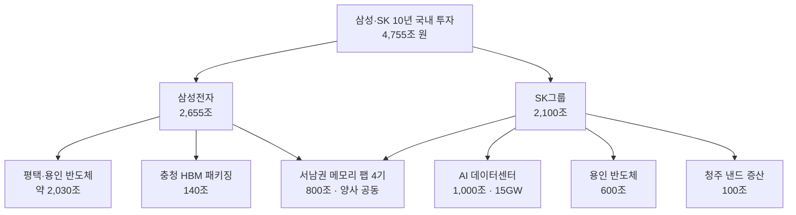

2026년 6월 29일, 청와대 영빈관에서 한 장의 그림이 공개됐습니다. 삼성전자와 SK하이닉스가 앞으로 10년간 국내에 합쳐서 4,755조 원을 투자하겠다는 계획입니다. 이재명 대통령이 주재하고 이재용 회장과 최태원 회장이 나란히 선 자리였습니다. 그런데 해외 언론과 소셜미디어에는 같은 발표가 "8,800억 달러"라는 숫자로 돌아다녔습니다. 어떤 곳은 "1.3조 달러"라고 했고, 또 어떤 곳은 "5,200억 달러"라고 했습니다.

같은 발표인데 왜 숫자가 이렇게 다를까요. 이 글은 그 숫자들의 출처를 하나씩 1차 자료로 확인하고, 발표의 진짜 골격이 무엇인지, 그리고 이것이 우리처럼 AI 인프라를 운용하는 사업자에게 무엇을 의미하는지 정리합니다.

## "8,800억 달러"는 누가 발표한 숫자가 아닙니다

먼저 결론부터 말씀드리겠습니다. 삼성도, SK도, 정부도 "8,800억 달러"를 공식 발표한 적이 없습니다. 확인된 모든 한국 언론의 1차 보도는 조원 단위만 사용하며 달러 환산을 제시하지 않습니다.

8,800억 달러라는 수치는 Bloomberg가 전체 투자 중 일부(데이터센터와 반도체 일부, "최소 1,350조 원")를 약 1달러=1,534원의 환율로 환산하면서 등장한 2차 추정치입니다. 1.3조 달러는 또 다른 합산 범위를, 5,200억 달러는 서남권 팹만 떼어 환산한 값을 가리킵니다. 즉 외신 헤드라인의 달러 숫자들은 서로 다른 항목을, 서로 다른 환율로 환산한 결과입니다.

정확한 그림은 원화로 봐야 명확합니다. 발표된 총계는 삼성 2,655조 원과 SK 2,100조 원을 더한 4,755조 원입니다. 이 숫자는 파이낸셜뉴스, 아주경제, 뉴시스, MBC 등 복수의 1차 보도에서 일치합니다. 굳이 달러로 환산한다면, 현시점 환율인 1달러=1,380원을 적용했을 때 약 3조 4,000억 달러 규모입니다. 8,800억 달러는 전체가 아니라 그 일부를 비싼 환율로 계산한 값일 뿐입니다.

> 보고·인용 시 원칙: 이 발표의 금액을 인용할 때는 반드시 원화 원본과 적용 환율을 함께 제시해야 합니다. 달러 숫자만 떼어내면 같은 발표가 4배까지 차이 나 보일 수 있습니다.

4,755조 원이라는 규모를 가늠하기 위해 정부 연간 예산(약 728조 원)과 비교하면, 두 그룹의 10년 투자 계획은 국가 예산의 약 6.5배에 해당합니다. 다만 이것은 10년 이상에 걸친 누적 계획이며, 두 회사의 현재 연간 설비투자 합계는 약 70조 원대(삼성 DS 약 41조, SK하이닉스 약 29조)라는 점을 함께 기억해야 합니다.

## 발표의 진짜 골격: 서남권 800조 메모리 팹

총계 4,755조 원 안에서 가장 구속력 있는 약정은 서남권(호남) 메모리 팹입니다. 삼성과 SK가 각각 400조 원씩, 합쳐서 800조 원을 투입해 메모리 팹 4기(각사 2기)를 신설합니다. 이재용 회장은 광주를 신규 단지 후보지로 직접 언급했습니다. 나머지 항목들은 다음과 같이 구성됩니다.

여기서 흔히 혼선이 생기는 두 숫자를 정리하겠습니다. SK의 "1,000조 원"은 SKT가 주도해 2035년까지 전국 15GW 규모 AI 데이터센터를 구축하겠다는 총액입니다. 반면 "100조 원"은 전혀 다른 항목으로, SK하이닉스의 청주 낸드플래시 증산 투자입니다. 두 숫자가 충돌하는 것이 아니라 서로 다른 사업을 가리킵니다. 데이터센터 1GW 건설 캐펙스가 통상 10억~30억 달러 수준임을 고려하면, 15GW에 1,000조 원이라는 규모는 대략 정합합니다.

## 왜 지금, 이렇게 큰 규모인가: HBM 슈퍼사이클

이 거대한 숫자의 동력은 한 가지로 수렴합니다. HBM, 고대역폭메모리 수요입니다. HBM은 AI 가속기에 적층 탑재되는 고부가 메모리로, 일반 DRAM보다 단가가 5~7배 높습니다. 글로벌 HBM 시장은 2025년 약 350억 달러에서 2026년 약 546억~580억 달러로, 58% 이상 성장이 전망됩니다.

수요의 뿌리는 하이퍼스케일러의 지출입니다. 아마존·마이크로소프트·구글·메타·오라클의 2026년 AI 인프라 캐펙스는 6,000억 달러를 넘어섰고, 그중 메모리가 차지하는 비중이 약 30%까지 올라왔습니다. 2023~2024년의 8%에서 약 4배로 뛴 수치입니다. NVIDIA의 Blackwell·Rubin 수요만으로 수천억 달러 규모의 수주 잔고가 쌓였고, 세 HBM 공급사인 SK하이닉스·마이크론·삼성의 2026년 생산분은 사실상 완판된 상태입니다.

핵심은 이 병목이 자본 부족이 아니라 생산 용량 부족에서 온다는 점입니다. 돈이 없어서 못 만드는 것이 아니라 팹이 부족해서 못 만드는 상황입니다. 그래서 두 회사가 동시에 대규모 증설로 향하는 것입니다. SK하이닉스는 2025년 3분기 영업이익률 47%를 기록했고, 이 수익이 용인·청주 설비로 재투입되는 선순환 구조를 만들었습니다.

## 정책이 받쳐주는 구조: 반도체 특별법

한국은 미국이나 유럽처럼 현금 보조금을 직접 주는 대신 세액공제 중심으로 반도체를 지원해왔습니다. 2025년 2월 통과된 K-칩스법은 대기업 시설투자 세액공제율을 15%에서 20%로 올렸고, R&D 공제를 2031년까지 연장했습니다. 두 회사 합산 약 6조 원의 감세 효과로 추산됩니다.

여기에 2026년 1월 통과된 반도체 특별법이 더해졌습니다. 이 법은 전력·용수·도로 같은 산업기반시설 조성에 국가와 지자체가 직접 지원할 근거를 마련했습니다. 시행은 2026년 3분기 예정입니다. 이번 800조 원 호남 팹이 실제로 가동되려면 이 특별법에 따른 전력·용수 인프라의 적기 공급이 결정적 변수입니다. 곽노정 SK하이닉스 CEO가 발표 자리에서 용인 클러스터의 특별법 적용과 지방 정주 여건 개선을 직접 요청한 것도 이 때문입니다.

## 글로벌 경쟁: 세 HBM 공급사의 동시 증설

| 기업 | 위치 | 최근 투자 | HBM 상황 |
|---|---|---|---|
| SK하이닉스 | 메모리 1위 | 용인 600조 등 | HBM 점유 약 57%, HBM4 우선공급 |
| 삼성전자 | 메모리 추격 | 평택·용인 약 2,030조 | HBM 점유 약 35%, 2026년 50% 증설 |
| 마이크론 | 메모리 3위 | FY26 약 200억 달러 | 2026년 HBM 완판, HBM4 2분기 양산 |
| TSMC | 파운드리 | 애리조나 1,650억 달러 | CoWoS 패키징 2026년 매진 |

세 HBM 공급사 모두 2026년 생산분이 매진된 상황입니다. 문제는 2027~2028년입니다. 이때 가동될 한국 팹이 충분하지 않으면 HBM4·HBM5 수요 증가분을 마이크론에 내줄 수 있습니다. 파운드리 쪽에서는 TSMC가 애리조나에만 1,650억 달러를 투입하며 CoWoS 패키징 용량을 2026년까지 매진시켰고, 인텔은 파운드리 구조조정으로 HBM 경쟁에서 사실상 이탈했습니다.

## 전력이 진짜 병목: 데이터센터의 입지 경쟁

2026년 1분기부터 AI 인프라의 핵심 병목은 칩이 아니라 전력으로 이동했습니다. 미국에서는 약 7GW 규모의 데이터센터 프로젝트가 전력 부족으로 지연되거나 취소됐습니다. 역설적으로 이는 전력과 토지를 확보할 수 있는 한국 서남권과 중동의 입지 매력을 높입니다.

SK가 2035년까지 1,000조 원을 들여 전국 15GW급 AI 데이터센터를 짓겠다는 것은 단순한 부동산 투자가 아닙니다. 메모리 제조사가 자신이 HBM을 납품하는 데이터센터를 직접 구축하면, 수요를 스스로 창출하고 NVIDIA와 하이퍼스케일러가 사양을 결정하는 공급망 구조에서 협상력을 회복할 수 있습니다. 삼성도 해남 AI 데이터센터, 세종 AI 서버 기판 공장 등으로 같은 수직통합 방향을 향하고 있습니다.

## ThakiCloud 관점: 하드웨어가 늘수록 소프트웨어 계층이 중요해집니다

이 발표의 본질은 한국이 AI 인프라를 국가 차원에서 수직통합한다는 것이며, 이는 ThakiCloud의 ai-platform 사업과 직접 맞닿습니다.

첫째, 국내 AI 데이터센터가 15GW 규모로 확장되면 그 위에서 모델을 학습하고 서빙할 멀티테넌트 인프라 수요가 함께 커집니다. ThakiCloud는 Kubernetes와 Kueue 기반 GPU 스케줄링, vLLM 서빙으로 바로 이 계층을 겨냥합니다. 팹과 데이터센터가 하드웨어를 공급하면, 그 위에서 여러 고객의 워크로드를 안전하게 격리하며 굴리는 제어 평면이 필요해집니다.

둘째, 소버린 AI와 온프렘 요구가 강해집니다. 국가 기간산업과 공공 영역은 외부 클라우드가 아니라 자체 데이터센터 안에서 모델을 운용해야 하는 경우가 많습니다. 보안 요구가 까다로운 환경일수록 그렇습니다. ThakiCloud의 self-hosting, 멀티테넌트 격리, 비용효율 서빙은 이 수요에 정확히 부합합니다.

셋째, 그리고 어쩌면 가장 중요한 점입니다. HBM과 고성능 GPU가 늘어날수록 경쟁의 축은 "얼마나 많이 샀는가"에서 "얼마나 효율적으로 굴리는가"로 옮겨갑니다. 값비싼 가속기를 놀리지 않게 하는 GPU 라이프사이클 관리와 큐잉이 결국 비용을 좌우합니다. 4,755조 원이 만들어낼 하드웨어를 효율적으로 활용하는 소프트웨어 계층, 바로 그곳에 ThakiCloud가 제공하는 가치가 있습니다. 대규모 캐펙스는 하드웨어를 만들지만, 그 하드웨어의 활용률을 끌어올리는 것은 스케줄러와 서빙 엔진의 몫입니다.

## 한계와 반론: 낙관만 하기엔 이릅니다

이 발표를 무조건 호재로만 읽는 것은 위험합니다. 반대 방향의 근거를 정직하게 짚겠습니다.

먼저 4,755조 원은 10년 누적 "계획"이며 연간 집행이 검증된 숫자가 아닙니다. 정부 행사라는 특성상 상향 편향이 있을 수 있고, 과거 2024년에 발표된 용인 622조 클러스터도 일정 지연을 겪었습니다. 발표와 집행 사이에는 늘 간극이 있습니다.

다음으로 HBM 슈퍼사이클이 꺾이면 오늘의 증설은 내일의 공급과잉이 됩니다. 메모리는 역사적으로 사이클이 가파른 산업입니다. AI 캐펙스가 일부 분석대로 과투자라면, 2027~2028년 가동될 팹이 하필 수요 둔화기와 겹칠 수 있습니다.

전력·용수 인프라가 제때 공급되지 않으면 800조 원을 들인 팹도 가동이 미뤄집니다. 글로벌 데이터센터 지연의 주원인이 전력인 만큼 이는 추상적 우려가 아니라 실질적 리스크입니다.

마지막으로 발표 다음 날인 6월 30일 SK하이닉스가 삼성전자를 제치고 코스피 시총 1위를 탈환한 것을 두고, 일부는 2000년 닷컴 버블의 시스코-마이크로소프트 역전과 비교하며 고점 신호를 거론했습니다. 다수 애널리스트는 "실적과 매크로를 더 지켜봐야 한다"며 판단을 유보했지만, 밸류에이션이 실적을 앞서간다는 경고를 무시할 수는 없습니다.

## 정리

2026년 6월 29일 발표의 진짜 숫자는 4,755조 원이며, 8,800억 달러는 그 일부를 비싼 환율로 환산한 외신의 2차 추정치입니다. 발표의 골격은 서남권 800조 메모리 팹과 SK의 15GW AI 데이터센터이고, 이 모든 것을 끌어가는 동력은 HBM 슈퍼사이클입니다. 성패는 전력·용수 인프라의 속도에 달려 있습니다.

한국이 AI 하드웨어를 국가 규모로 짓는 동안, 그 하드웨어를 효율적으로 굴리는 소프트웨어 계층의 가치는 함께 커집니다. ThakiCloud는 바로 그 지점에서 K8s·Kueue 기반 서빙과 소버린 인프라로 자리를 잡아가고 있습니다.

## 출처

- 파이낸셜뉴스, 서남권 팹 4기 삼성·SK 4,755조 (2026-06-29): [https://www.fnnews.com/news/202606291837098645](https://www.fnnews.com/news/202606291837098645)
- 뉴시스, 삼성·SK 800조 호남 반도체 허브 (2026-06-29): [https://www.newsis.com/view/NISX20260629_0003687807](https://www.newsis.com/view/NISX20260629_0003687807)
- 아주경제, SKT 15GW AI 데이터센터 (2026-06-29): [https://www.ajunews.com/view/20260629171803513](https://www.ajunews.com/view/20260629171803513)
- 한국경제, 용인 600조·청주 100조 (2026-06-29): [https://www.hankyung.com/article/2026062943107](https://www.hankyung.com/article/2026062943107)
- CNBC, South Korea Samsung SK Hynix mega-projects (2026-06-29): [https://www.cnbc.com/2026/06/29/samsung-sk-hynix-reported-1point3-reported-trillion-spending-plans.html](https://www.cnbc.com/2026/06/29/samsung-sk-hynix-reported-1point3-reported-trillion-spending-plans.html)
- SK hynix, 2026 Market Outlook (HBM Supercycle): [https://news.skhynix.com/2026-market-outlook-focus-on-the-hbm-led-memory-supercycle/](https://news.skhynix.com/2026-market-outlook-focus-on-the-hbm-led-memory-supercycle/)
- TrendForce, Micron CapEx $20B·2026 HBM booked (2025-12-18): [https://www.trendforce.com/news/2025/12/18/news-micron-hikes-capex-to-20b-with-2026-hbm-supply-fully-booked-hbm4-ramps-2q26/](https://www.trendforce.com/news/2025/12/18/news-micron-hikes-capex-to-20b-with-2026-hbm-supply-fully-booked-hbm4-ramps-2q26/)
- 정책브리핑, 반도체 특별법 국회 통과 (2026-01-30): [https://www.korea.kr/briefing/pressReleaseView.do?newsId=156742072](https://www.korea.kr/briefing/pressReleaseView.do?newsId=156742072)
