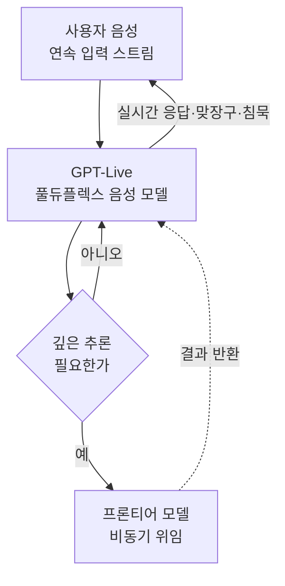

음성 어시스턴트를 써 본 사람이라면 익숙한 어색함이 있습니다. 내가 말을 끝낼 때까지 기다렸다가, 잠깐의 정적 뒤에 한꺼번에 대답이 돌아오는 그 리듬입니다. 2026년 7월 8일 OpenAI가 공개한 GPT-Live는 바로 이 리듬을 바꾸려는 시도입니다. 이 글은 음성 인터페이스와 실시간 추론 인프라에 관심 있는 개발자와 AI 팀을 위한 것입니다. GPT-Live가 기술적으로 무엇을 바꿨는지, 그리고 이런 풀듀플렉스 음성이 서빙 인프라와 에이전트 설계에 어떤 요구를 던지는지 살펴봅니다.

## 개요: 기본 음성 경험의 세대 교체

GPT-Live는 ChatGPT의 기본 음성 경험을 대체하는 새로운 세대의 음성 모델입니다. 핵심은 풀듀플렉스(full-duplex) 구조입니다. 기존 음성 모드가 "듣고 나서 말하는" 반이중 방식이었다면, GPT-Live는 듣는 동시에 말할 수 있습니다. 사용자가 말하는 도중에 "음", "네" 같은 맞장구로 듣고 있음을 표현하고, 빠른 주고받기에 참여하며, 상대가 생각할 시간이 필요할 때는 조용히 기다립니다. OpenAI는 이 경험이 다른 사람과 실제로 대화하는 것에 훨씬 가깝다고 설명합니다.

배포 구조는 두 가지 변형으로 나뉩니다. GPT-Live-1은 Go와 Plus, Pro 사용자의 기본값이고, GPT-Live-1 mini는 무료 사용자의 기본값입니다. 두 모델 모두 iOS와 안드로이드, 웹의 ChatGPT에서 전 세계 사용자에게 순차 배포되기 시작했습니다.

## 무엇이 기술적으로 달라졌나

가장 큰 변화는 대화의 시간 축을 다루는 방식입니다. 반이중 음성 시스템은 발화 종료 감지(end-of-turn detection)에 의존합니다. 사용자가 말을 멈췄다고 판단되면 그때부터 응답 생성을 시작합니다. 이 방식은 구현이 단순하지만, 자연스러운 대화의 겹침과 끼어들기, 맞장구를 표현하지 못합니다.

풀듀플렉스는 이 제약을 정면으로 다룹니다. 입력 오디오 스트림을 계속 받으면서 동시에 출력 오디오를 생성하려면, 모델과 서빙 계층이 양방향 스트림을 낮은 지연으로 동시에 처리해야 합니다. 사용자가 말을 이어가는 중에도 모델은 언제 맞장구를 칠지, 언제 끼어들지, 언제 침묵할지를 실시간으로 판단합니다. 이는 단순한 음성 합성 품질의 문제가 아니라, 대화의 타이밍을 모델링하는 문제입니다.

또 하나 주목할 설계는 위임(delegation)입니다. GPT-Live는 지금까지 나온 음성 모델 중 가장 똑똑하다고 소개되지만, 웹 검색이나 더 깊은 추론, 복잡한 작업이 필요한 질문은 뒤에서 최신 프론티어 모델에 위임합니다. 그리고 결과가 준비되면 대화의 흐름 속으로 다시 가져옵니다. 즉 빠르고 가벼운 음성 모델이 대화의 실시간성을 담당하고, 무거운 추론은 별도 모델이 비동기로 처리하는 계층 분리 구조입니다.

이 계층 분리는 실시간 시스템 설계에서 흔히 쓰는 패턴입니다. 낮은 지연이 필요한 경로와 높은 정확도가 필요한 경로를 분리하고, 후자를 비동기로 돌려 앞단의 반응성을 지키는 방식입니다. GPT-Live는 이 패턴을 음성 대화에 적용한 사례로 읽을 수 있습니다.

## ThakiCloud 제품 적용 시사점

GPT-Live 자체는 OpenAI의 폐쇄형 제품이지만, 그 아키텍처가 던지는 요구사항은 저희가 운영하는 인프라와 직접 맞닿아 있습니다.

ai-platform 관점에서 풀듀플렉스 음성은 실시간 스트리밍 추론의 까다로운 사례입니다. ThakiCloud의 ai-platform은 K8s와 Kueue 기반 GPU 스케줄링 위에서 다양한 모델을 서빙하는데, 배치 추론과 달리 음성 대화는 낮고 일정한 지연을 요구합니다. 양방향 오디오 스트림을 동시에 다루려면 서빙 계층이 스트리밍 입출력과 세션 상태를 안정적으로 유지해야 하고, GPU 자원은 처리량뿐 아니라 꼬리 지연(tail latency)까지 관리해야 합니다. 이런 저지연 서빙 요구는 온프레미스와 소버린 환경에서 특히 중요합니다. 데이터를 외부로 보낼 수 없는 고객이 음성 인터페이스를 self-hosting으로 운영하려면, 실시간 스트리밍을 감당하는 서빙 스택이 전제 조건이기 때문입니다.

에이전트 관점에서는 Paxis와 연결됩니다. Paxis는 ai-platform 위에서 도는 Agent-Native Cloud 제어 평면으로, 스킬을 격리 샌드박스에서 실행하고 모든 행동을 정책 게이트와 감사 로그로 통과시킵니다. GPT-Live의 위임 구조, 즉 가벼운 앞단이 무거운 추론을 뒤로 넘기는 방식은 에이전트 설계의 계층화와 같은 원리입니다. 음성이 에이전트의 새로운 입력 표면이 되면, "사용자가 말한 의도를 해석하고, 필요한 스킬을 선택하고, 격리 실행하고, 결과를 대화로 되돌리는" 흐름이 필요합니다. Paxis의 스킬 하니스와 MCP 커넥터, 정책 게이트는 바로 이런 음성 에이전트 파이프라인의 뒷단을 담당할 수 있습니다. 실시간 음성이 앞단을 맡고, 정책과 감사가 보장된 에이전트 실행이 뒷단을 맡는 구성입니다.

## 한계 및 반론

풀듀플렉스가 반드시 더 나은 경험을 보장하는 것은 아닙니다. 듣는 동시에 말하는 구조는 자연스러움을 높이지만, 동시에 오작동의 여지도 늘립니다. 사용자가 잠깐 멈춘 것을 발화 종료로 오판해 끼어들거나, 맞장구가 과해 오히려 대화를 방해할 수 있습니다. 자연스러운 타이밍을 모델링하는 일은 음성 합성 품질보다 훨씬 미묘한 문제이며, 실제 사용자 반응으로 검증되기 전까지는 판단을 유보하는 것이 맞습니다.

위임 구조에도 그림자가 있습니다. 앞단 음성 모델이 언제 프론티어 모델로 넘길지 판단을 잘못하면, 간단한 질문에 과한 지연이 붙거나 어려운 질문에 얕은 답이 나갈 수 있습니다. 이 라우팅 판단의 정확도가 전체 경험을 좌우하는데, 이는 벤더 발표만으로는 확인할 수 없고 실사용에서 드러납니다.

마지막으로, 이 글에 담긴 아키텍처 해석은 OpenAI가 공개한 설명과 초기 보도를 근거로 한 것이며, 내부 구현의 세부는 공개되지 않았습니다. 풀듀플렉스와 위임이라는 방향성은 분명하지만, 구체적인 지연 수치나 모델 구조는 저희가 독립적으로 검증하지 못했으므로 추정으로 받아들여야 합니다.

정리하면 GPT-Live는 음성 인터페이스가 "명령을 받는 도구"에서 "대화하는 상대"로 넘어가는 흐름을 보여주는 릴리스입니다. 그리고 그 흐름을 실제로 감당하는 것은 화려한 음성 품질이 아니라, 양방향 스트림을 낮은 지연으로 서빙하고 무거운 추론을 안전하게 위임하는 인프라입니다. 저희가 실시간 서빙과 에이전트 실행 양쪽에서 준비하는 것이 바로 이 뒷단입니다.

## 출처

- [Introducing GPT-Live · OpenAI](https://openai.com/index/introducing-gpt-live/)
- [OpenAI releases new voice models for more natural live conversations · TechCrunch](https://techcrunch.com/2026/07/08/openai-releases-new-voice-models-for-more-natural-live-conversations/)
- [OpenAI Introduces GPT-Live to Make ChatGPT Voice Feel Like a Real Conversation · MacRumors](https://www.macrumors.com/2026/07/08/openai-gpt-live-voice/)
