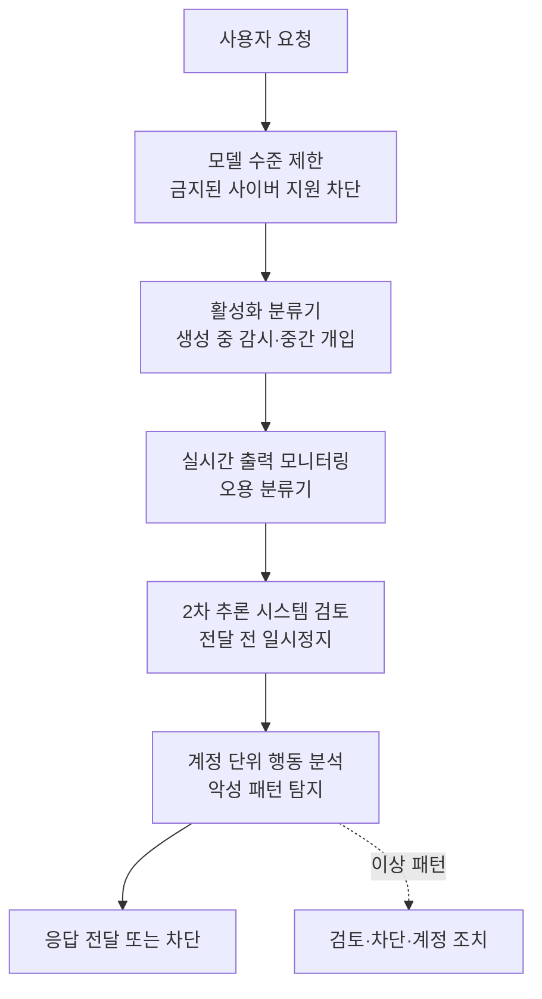

오늘 아침 타임라인에서 한 문장이 오래 눈에 남았습니다. OpenAI가 자사 신규 플래그십 모델 GPT-5.6 Sol을 소개하면서, 사이버 보안 평가용 레인지인 "The Last Ones"에서 새로운 최고 기록을 세웠다고 밝힌 대목입니다. 여기서 중요한 건 점수 자체가 아니라 문장의 함의입니다. AI가 사람을 도와 취약점을 찾는 수준을 넘어, 사람 없이 여러 단계로 이어진 공격 시나리오를 스스로 끝까지 밟아 나가는 지점에 도달하고 있다는 이야기이기 때문입니다.

이 소식이 ThakiCloud 같은 인프라 회사에 남 이야기일 수 없는 이유는 분명합니다. 프런티어 모델의 공격 능력이 올라갈수록, 방어의 무게 중심은 "어떤 모델이 더 똑똑한가"에서 "그 모델을 어디에서, 누구의 통제 아래, 어떤 감사 기록을 남기며 돌리는가"로 이동합니다. 모델은 어차피 계속 강해집니다. 그렇다면 승부처는 실행 환경의 격리와 정책 게이트, 그리고 사후 추적 가능성입니다. 오늘 글은 GPT-5.6 Sol이 실제로 무엇을 해냈는지 확인된 사실만으로 짚은 뒤, 그 능력이 왜 온프렘 주권 AI와 에이전트 통제 평면의 수요를 오히려 키우는지로 이어가려 합니다.

## GPT-5.6 Sol은 무엇이고 왜 사이버 보안이 초점인가

GPT-5.6은 OpenAI가 2026년 7월 9일 공개한 모델 패밀리입니다. 능력 순으로 루나(Luna), 테라(Terra), 솔(Sol) 세 등급이 있고, Sol이 가장 강력한 플래그십입니다. OpenAI는 Sol을 Cerebras 인프라 위에서 초당 최대 750토큰까지 서빙한다고 밝혀, 능력만이 아니라 처리 속도까지 함께 끌어올렸다는 점을 강조했습니다.

이번 발표에서 가장 두드러진 축은 사이버 보안입니다. OpenAI는 Sol을 자사 역대 가장 강력한 사이버 보안 모델로 규정하면서, 취약점 연구와 익스플로잇을 포함한 장기 호흡의 보안 작업에서 성능과 효율의 경계를 옮겼다고 설명합니다. 핵심은 "적은 토큰으로 더 멀리 간다"입니다. 같은 결과를 내기 위해 소모하는 추론 토큰이 줄었다는 것은, 같은 예산으로 더 많은 공격 시도를 자동화할 수 있다는 뜻이기도 합니다. 능력의 향상이 곧 비용의 하락으로 번역되는 구간에서, 방어자와 공격자 모두에게 문턱이 낮아집니다.

한 가지 정직하게 짚을 부분이 있습니다. 트윗의 원문은 OpenAI의 자체 발표이고, 뒤에서 다룰 "The Last Ones" 레인지의 독립 평가(영국 AI 안전연구소 AISI)는 공개 시점 기준으로 GPT-5.5까지를 대상으로 삼았습니다. 따라서 Sol의 "새 기록" 주장은 OpenAI가 제시한 수치이며, 제3자 재현 결과가 완전히 공개되기 전까지는 발표자의 주장으로 읽는 것이 안전합니다. 이 글은 검증 가능한 수치와 발표 주체를 구분해 인용합니다.

## "The Last Ones": 32단계 사이버 레인지가 측정하는 것

"The Last Ones"는 AISI가 운영하는 모의 기업 네트워크 침투 시나리오입니다. 총 32단계로 구성되어 있고, 숙련된 인간 전문가가 처음부터 끝까지 완수하는 데 약 20시간이 걸리는 것으로 추정됩니다. 단순한 문제 풀이가 아니라, 실제 침해에 필요한 여러 능력을 한 줄기로 엮어야 통과하는 구조입니다. 에이전트는 시스템을 장악하고, 프로토콜과 암호 인증을 역공학으로 뜯어보고, 제어기를 조작하는 일련의 과정을 스스로 판단하며 이어가야 합니다.

지금까지 이 레인지를 끝까지 완주한 모델은 손에 꼽습니다. Claude Mythos 프리뷰가 열 번 시도 중 세 번(3/10) 완주로 처음 성공했고, GPT-5.5가 열 번 중 두 번(2/10)으로 두 번째로 끝까지 밟았습니다. 시도 대비 성공률이 낮아 보이지만, 20시간짜리 다단계 공격을 사람 개입 없이 한 번이라도 완주했다는 사실 자체가 임계선을 넘은 신호입니다. 관련 연구(arXiv 2603.11214)는 이 능력이 추론 시점 연산량에 로그-선형으로 비례하며 아직 정체 구간이 관측되지 않는다고 보고합니다. 토큰 예산을 1천만에서 1억으로 늘리면 성능이 최대 59% 오른다는 결과는, 돈과 시간을 더 태울수록 공격 완주 확률이 계속 올라간다는 불편한 함의를 담고 있습니다.

## 벤치마크가 보여주는 능력 도약

능력의 도약은 개별 벤치마크에서도 드러납니다. OpenAI에 따르면 GPT-5.6은 익스플로잇 능력 평가인 ExploitBench2에서 73.5%를 기록해, 비슷한 출력 토큰 예산에서 GPT-5.5의 47.9%를 크게 앞섰습니다. 한 세대 만에 25%포인트 넘게 오른 수치입니다. 다만 여기에도 결이 있습니다. OpenAI 자신의 테스트는 GPT-5.6이 실제 공격을 끝까지 신뢰성 있게 수행하는 것보다, 취약점을 찾아내고 고치는 쪽에 더 능하다는 점을 시사합니다. 즉 능력의 무게추가 아직은 방어 쪽에 유리하게 기울어 있다는 해석이 가능합니다.

이 구분은 정책적으로 중요합니다. 같은 모델이 방어자의 손에 들리면 취약점을 대량으로 발굴해 패치하는 도구가 되고, 공격자의 손에 들리면 침투 자동화 엔진이 됩니다. OpenAI가 별도로 공개한 에이전트형 보안 연구원 Aardvark가 바로 이 방어 쪽 활용을 겨냥합니다. Aardvark는 개발자와 보안팀이 취약점을 자동으로 발견하고 고치도록 돕는 자율 에이전트로 소개되었고, OpenAI는 이 능력이 무엇보다 방어자에게 먼저 도달해야 한다는 우선순위를 명시했습니다.

## 공격보다 방어: OpenAI의 다층 안전 스택

OpenAI가 Sol을 처음부터 전면 개방하지 않고 신뢰할 수 있는 일부 파트너에게만 제한적으로 푼 것도 이 맥락입니다. 접근은 초기에 선별된 고객으로 한정되며, 사이버 보안 프레임워크를 두고 미국 정부와 긴밀히 협의하는 과정에서 나온 결정이라고 설명합니다. 능력이 임계선을 넘었다고 판단될수록 배포는 보수적으로 조인다는 신호입니다.

기술적으로도 여러 겹의 방어가 얹혔습니다. 발표에 따르면 Sol과 Terra에는 민감 영역에 초점을 둔 활성화 분류기가 새로 붙어, 생성 도중 모델을 감시하다가 위험한 답변을 만들기 시작하면 중간에 개입해 멈춥니다. 여기에 금지된 사이버 지원을 원천 차단하는 모델 수준 제한, 오용 분류기를 이용한 실시간 출력 모니터링, 악성 패턴을 잡아내는 계정 단위 행동 분석이 더해집니다. 출력은 곧바로 전달되지 않고 2차 추론 시스템의 검토를 거친 뒤에야 사용자에게 도달합니다. 아래는 이 다층 방어의 흐름을 정리한 것입니다.

주목할 지점은 이 구조가 단일 필터가 아니라는 데 있습니다. 모델 안쪽(활성화 분류기), 출력 경계(오용 분류기), 계정 층위(행동 분석)가 서로 다른 관점에서 겹겹이 감시합니다. 하나가 놓쳐도 다음 층이 잡도록 설계된 심층 방어입니다. 그리고 바로 이 발상이 인프라 사업자에게 그대로 이식됩니다.

## ThakiCloud 제품 적용 시사점

프런티어 모델의 공격 능력이 올라간다는 뉴스는 역설적으로 온프렘과 주권 AI의 손을 들어줍니다. 자율 공격이 현실이 될수록, 기업과 공공은 "누가 이 모델을 호출했고 무엇을 시켰으며 어떤 출력을 받았는가"를 자기 통제 아래 두려 합니다. ThakiCloud의 **ai-platform**은 이 요구에 정확히 맞물립니다. K8s와 Kueue 기반 GPU 스케줄링 위에서 모델을 고객 클러스터 안에 두고, 멀티테넌트로 격리해 서빙하며, 데이터가 외부 경계를 넘지 않도록 온프렘과 소버린 배포를 지원합니다. 민감한 보안 워크로드일수록 모델 가중치와 추론 트래픽을 자기 인프라 안에 붙잡아 두는 self-hosting의 가치가 커집니다. 낮은 서빙 비용은 방어자가 취약점 스캔 같은 대량 반복 작업을 감당 가능한 예산으로 돌리게 해 주는 실질적 전제이기도 합니다.

에이전트 차원에서는 **Paxis**의 설계가 위에서 본 다층 안전 스택과 놀랍도록 닮아 있습니다. Paxis는 ai-platform 위에서 도는 Agent-Native Cloud 제어 평면으로, Skills와 Tools, Policies, Audit Logs를 일급 리소스로 다룹니다. 에이전트가 실행하는 스킬은 격리된 샌드박스에서 돌아 호스트 환경을 오염시키지 않고, 모든 행동은 정책 게이트를 통과한 뒤에야 수행되며, 그 전 과정이 감사 로그로 남습니다. OpenAI가 모델 안팎과 계정 층위에 걸쳐 감시망을 겹쳐 둔 것처럼, Paxis는 스킬 선택(BM25 하니스), 실행(샌드박스 격리), 통제(정책 게이트), 추적(감사 로그)을 서로 다른 층으로 분리해 둡니다. 자율 에이전트가 잘못된 도구를 잘못된 대상에 쓰지 못하도록 막고, 사고가 나더라도 무엇이 어디에서 어긋났는지 소급할 수 있게 하는 구조입니다.

두 렌즈는 서로를 보완합니다. ai-platform이 모델을 내 경계 안에 붙잡아 두는 물리적 통제라면, Paxis는 그 모델을 쓰는 에이전트의 행동을 정책과 로그로 묶는 논리적 통제입니다. AI가 32단계 침투를 자율로 밟는 시대에, 방어의 기본기는 강한 모델을 고르는 일이 아니라 어떤 모델이든 통제된 환경에서 돌리고 그 행적을 남기는 일이 됩니다. 이것이 온프렘과 에이전트 통제 평면이 지금 더 중요해지는 이유입니다.

## 한계 및 반론

균형을 위해 반대편도 짚겠습니다. 첫째, Sol의 사이버 보안 우위는 상당 부분 OpenAI의 자체 발표에 근거하며, 접근이 제한되어 있어 독립적 재현 검증이 아직 충분치 않습니다. 벤치마크 숫자는 발표자의 측정 조건에 좌우되므로, 제3자 평가가 쌓이기 전까지는 방향성 신호로만 받아들이는 편이 안전합니다.

둘째, 능력이 방어에 더 유리하게 기울어 있다는 관측이 곧 안심의 근거는 아닙니다. 로그-선형 스케일링이 정체 없이 이어진다면, 오늘 방어 우위인 균형이 연산량 증가만으로 언제든 뒤집힐 수 있습니다. "지금은 공격보다 방어에 능하다"는 서술은 현재 상태의 스냅숏이지 항구적 안전 보장이 아닙니다.

셋째, 온프렘과 격리, 정책 게이트는 공짜가 아닙니다. 자체 인프라 운영은 초기 투자와 전문 인력, 지속적 패치 부담을 요구합니다. 규모가 작은 조직에는 관리형 클라우드의 편의가 여전히 합리적 선택일 수 있습니다. 요점은 온프렘이 항상 정답이라는 게 아니라, 워크로드의 민감도가 높아질수록 통제와 감사 가능성의 가치가 편의 비용을 넘어서는 지점이 앞당겨진다는 것입니다.

마지막으로, 정책 게이트와 감사 로그 자체도 완벽하지 않습니다. 방어 스택은 우회 시도의 대상이 되며, 실제로 Sol에 대한 탈옥 연구도 이미 진행되고 있습니다. 다층 방어의 의미는 뚫리지 않는다는 약속이 아니라, 뚫리더라도 다음 층이 잡고 사후에 추적할 수 있게 한다는 데 있습니다. 그 겸손한 목표가 오히려 지금 시대의 현실적인 방어 설계입니다.

## 출처

- [원 트윗 (RT @OpenAI)](https://x.com/hjguyhan/status/2078708617822564773)
- [GPT-5.6: Frontier intelligence that scales with your ambition | OpenAI](https://openai.com/index/gpt-5-6/)
- [Previewing GPT-5.6 Sol: a next-generation model | OpenAI](https://openai.com/index/previewing-gpt-5-6-sol/)
- [GPT-5.6 Preview System Card | OpenAI Deployment Safety Hub](https://deploymentsafety.openai.com/gpt-5-6-preview)
- [Introducing Aardvark: OpenAI's agentic security researcher](https://openai.com/index/introducing-aardvark/)
- [Our evaluation of OpenAI's GPT-5.5 cyber capabilities | AISI](https://www.aisi.gov.uk/blog/our-evaluation-of-openais-gpt-5-5-cyber-capabilities)
- [OpenAI Previews GPT-5.6 Sol With Restricted Access and Stronger Cyber Safeguards | The Hacker News](https://thehackernews.com/2026/06/openai-limits-gpt-56-rollout-as-sol.html)
- [Measuring AI Agents' Progress on Multi-Step Cyber Attack Scenarios | arXiv 2603.11214](https://arxiv.org/html/2603.11214v2)
