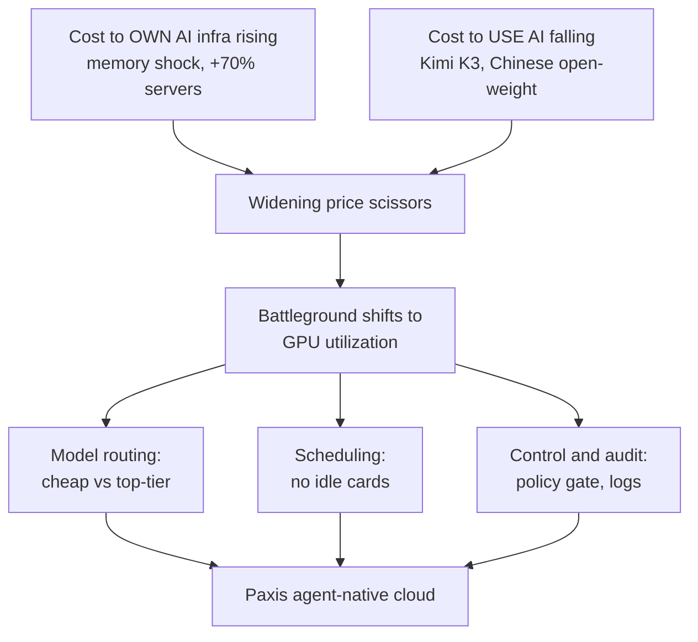

오늘 아침 뉴스를 훑다가 한 가지가 눈에 걸렸습니다. 같은 날짜에 정반대 방향으로 움직이는 두 개의 가격표가 나란히 놓여 있었기 때문입니다. 한쪽에서는 AI를 돌릴 장비를 사들이는 값이 사상 최고로 치솟고 있었고, 다른 한쪽에서는 AI를 한 번 굴리는 값이 사상 최저로 무너지고 있었습니다. 보통 원가가 오르면 판매가도 오릅니다. 그런데 지금은 밑재료 값과 완성품 값이 서로 등을 돌린 채 벌어지는 중입니다. 이 벌어짐이 오늘 이야기의 전부입니다.

## 소유의 값은 사상 최고로 오른다

먼저 오르는 쪽부터 보겠습니다. 디지털데일리의 'AI스택플레이션' 연재는 메모리 쇼크가 대형 클라우드 사업자를 넘어 AI 스타트업의 서버실까지 도달했다고 전합니다. 질의응답 AI 기업 포티투마루의 신규 서버 도입 비용은 기존 대비 약 70% 뛰었습니다. 2주 전에 130만 원이던 4TB SSD 견적이 이번 주에는 280만 원으로 두 배를 넘겼습니다. 삼성전자와 SK하이닉스는 구글, 마이크로소프트 같은 큰 고객에게 서버 D램 계약가를 60~70% 올리겠다고 통보하면서 주문량의 70%만 공급하고 있습니다. 견적서의 유효기간이 몇 달에서 1~2주로 줄었으니, 기업은 값이 더 오르기 전에 물량을 앞당겨 잡거나 급하지 않은 도입을 미루는 식으로 움직입니다.

값이 오르자 짐이 가벼운 기업부터 움직였습니다. 검색 요약 서비스 라이너는 메모리 단가가 흔든 클라우드 비용 변동을 이유로 아예 다른 클라우드 프로바이더로 갈아탔습니다. 자체 서버실을 무겁게 짊어질수록 이 충격을 정면으로 맞고, 워크로드를 얹어 둔 기업일수록 발이 빠릅니다. 소유의 대가가 곧 경직성으로 돌아오는 순간입니다.

장비값만 오르는 게 아닙니다. 판을 대는 큰손들의 지갑도 닫히고 있습니다. UBS는 마이크로소프트와 아마존을 포함한 4대 하이퍼스케일러의 자본지출 증가율이 2026년 76%에서 2027년 25%, 2028년 6%로 급격히 꺾일 것으로 봤습니다. 뱅크오브아메리카의 7월 펀드매니저 설문에서는 응답자의 82%가 반도체를 지금 시장에서 가장 붐비는 트레이드로 꼽았는데, 이는 조사 사상 최고치입니다. 뉴욕주가 신규 데이터센터 건설에 1년 유예를 걸 만큼 전력난과 규제 리스크도 현실이 됐습니다. 무차별 증설의 시대가 끝나고, '지을 것인가'에서 '얼마를 벌 것인가'로 질문이 바뀌는 국면입니다. 인프라를 소유한다는 결정이 이렇게까지 비싸고 무거워진 적은 없었습니다.

## 쓰는 값은 사상 최저로 무너진다

이제 반대쪽 가격표를 보겠습니다. 한국경제는 이 상황을 '반도체 폭락의 역설'이라고 불렀습니다. 필라델피아반도체지수는 2분기에 89% 급등한 뒤 7월 들어 15% 내렸고, 4월 상장한 메모리 ETF는 석 달 만에 166% 폭등했다가 20% 넘게 빠졌습니다. 밑재료 시장이 이렇게 요동치는 동안, 정작 AI를 쓰는 단가는 조용히 바닥을 뚫고 있었습니다.

방아쇠는 중국 문샷AI가 이번 주 공개한 오픈웨이트 모델 '키미 K3'입니다. 2조8천억 개 파라미터를 얹은 전문가 혼합 구조로, 896개 전문가망 가운데 일부만 켜서 연산을 아낍니다. 100만 토큰 컨텍스트를 지원하고, 오픈AI SDK와 호환돼 기존 개발자가 갈아타는 문턱을 낮췄습니다. 눈길을 끄는 건 값입니다. 작업 하나를 처리하는 데 드는 비용이 0.94달러로, 앤스로픽 오퍼스 4.8의 1.80달러를 절반으로 깎았습니다. 딥시크 V4 플래시는 0.02달러, GLM 5.2는 0.37달러까지 내려갑니다.

한 모델의 파격이 아니라 흐름 전체가 기울었습니다. 뉴시스에 따르면 AI 모델 중개 플랫폼 오픈라우터의 주간 토큰 사용량 1위부터 5위를 텐센트, 샤오미, 딥시크, 미니맥스, 지푸AI 같은 중국 오픈웨이트 모델이 싹 쓸었습니다. 6월 마지막 주 기준 중국 모델의 점유율은 48%로 미국의 20%를 크게 앞섰는데, 1년 전 미국 74% 대 중국 20%였던 구도가 완전히 뒤집힌 셈입니다. 모질라 CTO 라피 크리코리안은 업무 성격에 따라 비용을 최상위 모델의 50분의 1까지 낮출 수 있다고 설명했습니다. 딥시크와 큐원 같은 모델의 API는 미국 최상위 모델보다 10배에서 150배까지 저렴합니다. 기업들은 일상 업무는 값싼 오픈웨이트에 맡기고 어려운 작업만 최상위 모델로 보내는 이원화로 갈아타고 있습니다.

다만 값이 싸다고 아무 데나 던질 수는 없습니다. 중국발 모델의 매력적인 단가 뒤에는 데이터 주권과 보안 검토라는 그늘이 따라붙어, 공공과 금융은 선뜻 손을 대지 못합니다. 키미 K3의 전체 가중치가 7월 27일 공개되면 기업은 이 모델을 내려받아 자기 인프라에서 직접 서빙할 수 있게 됩니다. 값의 매력과 통제의 안전을 동시에 쥐려면, 결국 오픈웨이트를 내 클러스터 위에서 돌리는 길로 이어집니다. 싸진 모델이 온프렘 수요를 죽이는 게 아니라 오히려 지피는 이유입니다.

## 가위가 벌어지면 승부처가 바뀐다

두 가격표를 겹쳐 놓으면 그림이 선명해집니다. 장비를 소유하는 값은 위로, AI를 쓰는 값은 아래로 벌어지는 가위입니다. 여기서 흔한 오해 하나를 짚고 싶습니다. 모델이 흔하고 싸졌으니 이제 인프라는 중요하지 않다는 결론입니다. 정반대입니다. 완성품이 헐값이 될수록, 그 완성품을 찍어내는 설비의 원가율이 수익의 전부를 결정합니다.

한국경제가 인용한 투자자 개빈 베이커의 말이 이 지점을 정확히 찌릅니다. 그는 저가 모델의 확산이 오히려 'AI 인프라에 대한 가장 강력한 초강세 시나리오'라고 봤습니다. 토큰이 싸지면 사람들은 토큰을 더 씁니다. 싸진 만큼 덜 쓰는 게 아니라, 싸졌기 때문에 훨씬 많이 씁니다. 제번스가 석탄에서 봤던 역설이 지금 GPU 위에서 반복되는 중입니다. 그렇다면 승부처는 '누가 더 좋은 모델을 가졌나'가 아니라 '가진 GPU에서 토큰을 얼마나 많이 짜내느냐', 즉 활용률로 옮겨갑니다.

벌어지는 두 가격표가 어떻게 승부처를 옮기는지를 한 장으로 정리하면 다음과 같습니다.

디지털데일리의 '모두의AI' 기사가 이 문제를 국가 규모로 보여줍니다. 정부는 전 국민 대상 AI 챗봇에 엔비디아 B200 512장을 투입하면서, 사업자를 두세 곳으로 나눌지 한 곳에 몰아줄지를 두고 딜레마에 빠졌습니다. 나누면 각 서비스가 최대 트래픽을 못 견디고, 몰면 생태계 다양성을 잃습니다. 흥미로운 대목은 정부가 월간활성이용자수와 토큰 사용량을 근거로 임차 물량을 매달 사후 조정하겠다고 한 부분입니다. 카드가 한정된 곳에서는 결국 사용량에 맞춰 자원을 동적으로 재배분하는 통제 능력이 승패를 가릅니다. 512장이든 5만 장이든 본질은 같습니다.

## 그래서 무엇을 갖춰야 하는가

가위가 벌어질수록 남는 차별화는 세 가지로 좁혀집니다. 작업마다 알맞은 값의 모델로 자동으로 보내는 라우팅, 유휴 카드 없이 워크로드를 채우는 스케줄링, 그리고 그 모든 실행을 나중에 되짚어볼 수 있게 만드는 통제와 기록입니다. 다키클라우드의 에이전트 네이티브 클라우드 Paxis를 굳이 이 자리에서 꺼내는 이유가 여기 있습니다. Paxis는 Skills, Tools, Policies, Audit Logs를 일급 리소스로 다루고, 작업별 모델 선택을 담당하는 CostRouter로 저가 오픈웨이트와 최상위 모델을 나눠 태우는 이원화를 제품 안에 넣어 두었습니다. 위에서 본 기업들의 이원화 전략이 곧 이 기능의 사용 사례입니다.

스케줄링은 소버린 온프렘 K8s 위에서 Kueue로 처리하니, '모두의AI'가 겪는 사용량 기반 재배분 문제와 정확히 같은 결의 과제를 다룹니다. 통제 쪽은 정책 게이트와 감사 로그, 그리고 격리 샌드박스 실행이 맡습니다. 이 대목이 오늘 정책 뉴스와 맞물립니다. 7월 21일부터 시행되는 개정 AI기본법은 생성형 AI 표시 의무와 고영향 AI 관리기준을 실제로 요구하고, 공공조달에서는 확인받은 제품에 계약 요건 완화 같은 혜택을 줍니다. 국회입법조사처가 소버린 AI의 본질을 모델의 원산지가 아니라 '주권적 통제력'으로 다시 정의하라고 조언한 것도 같은 맥락입니다. 미국 상무부가 지난 6월 앤스로픽 모델의 해외 접근을 사흘 만에 끊었다가 3주 뒤 풀었던 사건은, 남의 API에 얹은 서비스가 얼마나 취약한지를 이미 보여줬습니다. 실행을 내 클러스터 안에서 하고, 정책으로 걸러내고, 로그로 증명하는 능력은 규제 준수인 동시에 통제권 그 자체입니다.

정리하면 이렇습니다. 소유는 비싸지고 모델은 흔해집니다. 그 사이에서 값을 만들어내는 건 좋은 모델을 손에 넣는 일이 아니라, 흔해진 모델을 싸게 라우팅하고 빈틈없이 스케줄링하며 감사 가능하게 통제하는 운영의 밀도입니다. 오늘 아침 반대로 움직이던 두 가격표는, 결국 같은 질문을 던지고 있었습니다. 당신은 가진 것을 얼마나 잘 굴리고 있습니까.

## 참고 자료

이 글은 아래 뉴스를 종합해 작성했습니다.

- 뉴스1, ["K-NPU 써본 후 도입"…퓨리오사AI, 유럽서 '풀스택 실증 전략' 속도](https://www.news1.kr/industry/sb-founded/6226804)
- 디지털데일리, [[AI스택플레이션⑤] 메모리 쇼크, AI기업까지… "서버 구매비 70%↑"](https://www.ddaily.co.kr/page/view/2026071617390023984)
- 한국경제, ["싸지면 더 쓴다"…'가성비 AI'가 뒤흔든 반도체 폭락의 역설](https://www.hankyung.com/article/202607192100i)
- 위키트리, [에치드, 칩 출하 전인데 몸값 200억달러…제인스트리트·세쿼이아 동시 베팅](https://www.wikitree.co.kr/articles/1147129)
- 글로벌이코노믹, [AI 투자 '확장'에서 '선별'로… 하이퍼스케일러 CAPEX 둔화에 반도체 여파](https://www.g-enews.com/view.php?ud=2026071906435432182bd56fbc3c_1)
- 디지털데일리, [[모두의AI④完] GPU 분배 딜레마…"多사업 확산vs선택과 집중"](https://www.ddaily.co.kr/page/view/2026071613325666245)
- 지디넷코리아, [스페이스X, 美 펜타곤과 수십억달러 AI 컴퓨팅 공급 협상](https://zdnet.co.kr/view/?no=20260719071015)
- 지디넷코리아, [中 문샷, 신형 AI '키미 K3' 공개…오픈AI·앤트로픽 턱밑 추격](https://zdnet.co.kr/view/?no=20260718173700)
- 지디넷코리아, [ZTE, AI 에이전트 스마트폰 '나비X 울트라' 공개](https://zdnet.co.kr/view/?no=20260719003653)
- 아이뉴스24, ["이 아파트 실거주 후기는"…네이버 대화형 검색 AI탭, 맞춤 정보 고도화](http://www.inews24.com/view/1986464)
- 더비즈, [[위클리 뱅크이슈] "인공지능이 미래"…은행권 'AX' 전방위 확산](http://www.the-biz.co.kr/news/articleView.html?idxno=724547)
- 뉴스1, ["제미나이 할인해드려요"…통신3사, AI 필수재 시대 유치전](https://www.news1.kr/it-science/cc-newmedia/6230746)
- 연합뉴스, [[AI기본법] ① 개정안 21일 시행…한국 AI 법제, 준비 마쳤다](https://www.yna.co.kr/view/AKR20260717029400017?input=1195m)
- 뉴시스, [반도체 이어 AI도 전략자산…"소버린AI 전략 다시 짜야" 입법처의 조언](https://www.newsis.com/view/NISX20260714_0003709278)
- 뉴시스, [AI 플랫폼 주간 사용량 1~5위 中 싹쓸이…美 고가 AI 흔든다](https://www.newsis.com/view/NISX20260719_0003713825)
- 지디넷코리아, [美 데이터브릭스, 신규 투자 유치…몸값 1880억 달러](https://zdnet.co.kr/view/?no=20260718234826)
- 지디넷코리아, ["생성형 AI 보안 정교화"…모니터랩, AI 보안 솔루션 고도화](https://zdnet.co.kr/view/?no=20260718202637)

