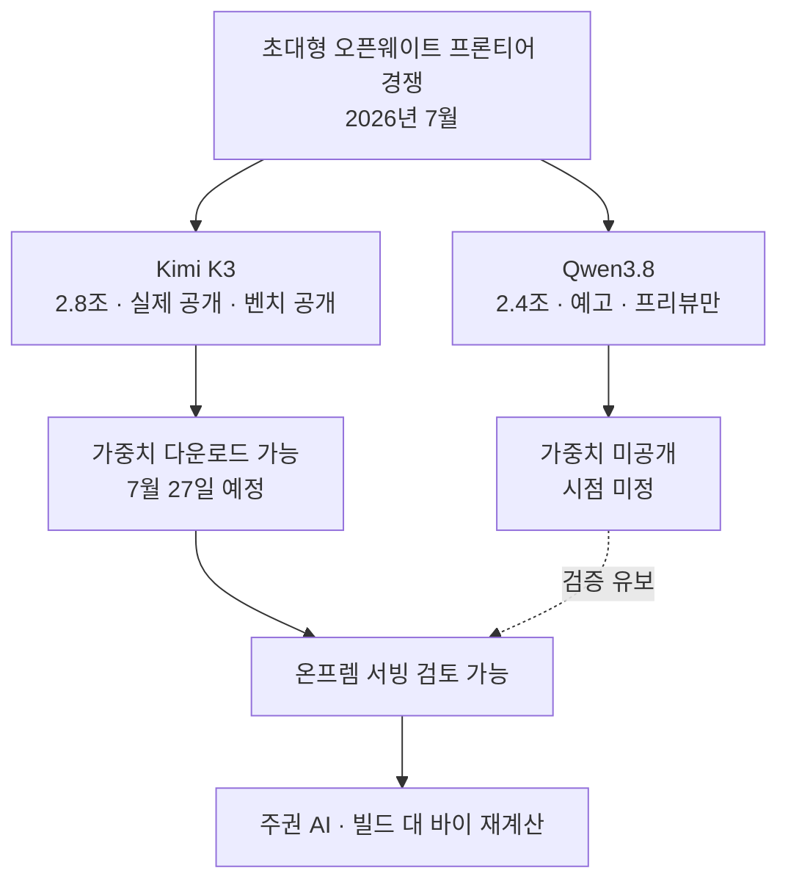

일요일 저녁 타임라인에 알리바바 Qwen 팀의 짧은 예고가 올라왔습니다. Qwen3.8을 곧 출시하며 오픈웨이트로 공개하겠다는 내용이었고, 파라미터 규모로 2.4조라는 숫자가 함께 붙었습니다. 며칠 전 Moonshot이 2.8조 파라미터의 Kimi K3를 실제로 공개한 직후라, 이번 예고는 "초대형 오픈 모델 경쟁이 주 단위로 벌어지고 있다"는 인상을 더 강하게 남겼습니다.

다만 예고는 릴리즈가 아닙니다. 이 글은 흥분을 걷어내고, 이번 발표에서 실제로 확인된 사실이 무엇이고 아직 주장에 머무는 부분이 무엇인지를 나눠 보려 합니다. ThakiCloud처럼 고객 인프라 위에서 모델을 서빙하는 입장에서는, 벤치마크 한 줄과 파라미터 숫자 하나에 로드맵을 걸 수 없기 때문입니다. 확인된 것과 아직 아닌 것을 구분하는 일 자체가 인프라 회사의 실무입니다.

## Qwen3.8, 무엇이 발표됐나

먼저 확인된 사실입니다. 알리바바 Qwen 팀은 2026년 7월 19일 Qwen3.8을 예고하면서 오픈웨이트 공개 방침을 밝혔습니다. 헤드라인 숫자는 2.4조 파라미터이고, 멀티모달 모델로 소개됐습니다. 여기까지가 발표 주체가 명시적으로 내놓은 부분입니다.

접근 경로도 확인됩니다. Qwen3.8-Max-Preview는 알리바바의 Token Plan과 Qoder, QoderWork를 통해 이미 테스트할 수 있는 상태로 공개됐습니다. 즉 지금 당장 만져볼 수 있는 것은 프리뷰 변형이며, 이는 알리바바 플랫폼에서 호스팅되는 서비스 형태입니다. 완전한 Qwen3.8은 이후 오픈웨이트로 공개될 예정이라고 회사는 밝혔지만, 구체적인 날짜는 약속하지 않았습니다.

여기서 두 가지를 분명히 구분해야 합니다. 첫째, 지금 쓸 수 있는 것은 "프리뷰"이지 "오픈웨이트"가 아닙니다. 둘째, "곧 공개"라는 표현은 시점을 담고 있지 않습니다. 이 두 가지가 흐릿하게 섞이면, 아직 다운로드할 수 없는 모델을 마치 손에 넣은 것처럼 착각하기 쉽습니다.

## 성능 주장은 어디까지 믿을 수 있나

가장 조심스럽게 읽어야 할 대목은 성능입니다. 알리바바는 Qwen3.8이 선도적인 프런티어 모델에 견줄 만하며 Anthropic의 Fable 5 다음가는 수준이라고 주장했습니다. X에서는 여기서 한발 더 나아가 "GPT-5.6보다 앞선다"는 반응까지 돌았습니다. 그러나 이 주장들은 현재 공개된 벤치마크로 뒷받침되지 않습니다. 발표와 함께 제시된 표준 평가 결과가 없기 때문입니다. 따라서 성능 관련 문구는 전부 발표자와 커뮤니티의 주장 [추정]으로 읽는 것이 안전합니다.

구조적으로도 미공개가 많습니다. 알리바바는 active 파라미터 수나 Mixture-of-Experts 구성을 밝히지 않았습니다. 이는 실무적으로 중요한 누락입니다. 2.4조이라는 숫자는 전체 크기일 뿐 매 토큰마다 실제로 도는 연산량을 말해주지 않습니다. 며칠 앞서 공개된 Kimi K3가 2.8조 전체 가운데 896개 전문가 중 16개만 활성화한다는 사실을 명시했던 것과 비교하면, Qwen3.8의 2.4조은 아직 서빙 비용을 가늠할 수 없는 헤드라인 숫자에 가깝습니다.

정리하면 아래와 같습니다.

| 항목 | 상태 |
|---|---|
| 발표·오픈웨이트 방침 | 확인됨 |
| 2.4조 파라미터(전체) | 확인됨(헤드라인) |
| 멀티모달 | 확인됨 |
| Max-Preview 테스트 가용 | 확인됨(호스팅) |
| 완전 가중치 공개 시점 | 미정 |
| 표준 벤치마크 | 미공개 |
| active 파라미터·MoE 구성 | 미공개 |
| "Fable 5 다음" 성능 | 미검증 주장 [추정] |

## 왜 지금 초대형 오픈 모델이 잇달아 나오나

이번 예고는 단독 사건이 아니라 흐름의 한 장면입니다. 한 매체는 Qwen3.8을 두고 알리바바가 Kimi K3를 쫓는 구도라고 표현했는데, 이 프레임이 상황을 잘 요약합니다. 며칠 사이에 2.8조과 2.4조이라는 초대형 오픈(혹은 오픈 예정) 모델이 연달아 등장하면서, 프런티어급 능력이 폐쇄형 API의 전유물이 아니게 되는 방향으로 무게추가 옮겨가고 있습니다.

이 흐름이 인프라 회사에 주는 함의는 분명합니다. 외부 API를 쓸 수 없는 고객, 즉 데이터 주권이나 규제 때문에 모델을 자기 경계 안에서 돌려야 하는 고객에게 초대형 오픈 모델은 새로운 선택지를 엽니다. 다만 그 선택지가 실제로 유효해지는 시점은 모델이 예고될 때가 아니라 가중치가 다운로드 가능해지고, 우리가 그것을 우리 하드웨어에서 재현했을 때입니다.

## ThakiCloud 관점: 2.4조 모델을 온프렘에서 서빙한다는 것

가정을 해보겠습니다. Qwen3.8이 예고대로 오픈웨이트로 공개된다면, 2.4조 파라미터 멀티모달 모델을 고객 온프렘 환경에서 서빙하는 과제가 현실이 됩니다. 이때 병목은 모델의 똑똑함이 아니라 GPU 메모리, 인터커넥트, 그리고 전문가 오프로드와 양자화 전략입니다. active 파라미터와 MoE 구성이 공개되지 않은 지금은 이 비용을 정확히 계산할 수 없고, 그래서 우리는 발표만으로 서빙 로드맵을 확정하지 않습니다.

ThakiCloud의 ai-platform은 이런 초대형 오픈 모델을 고객 환경에 올리기 위한 토대를 제공합니다. K8s와 Kueue 기반 GPU 스케줄링, vLLM 계열 서빙, 멀티테넌트 격리는 모델이 실제로 공개됐을 때 신속하게 검증에 착수할 수 있게 해줍니다. 핵심은 준비된 파이프라인 위에서 "예고"를 "검증"으로 빠르게 전환하는 능력이지, 예고 단계에서 미리 흥분하는 것이 아닙니다. 낮은 서빙 비용과 온프렘 주권이라는 강점은, 오픈 모델이 실제로 손에 들어왔을 때 비로소 값을 합니다.

## 한계 및 반론

이 글은 Qwen3.8을 깎아내리려는 것이 아닙니다. 2.4조 파라미터 멀티모달 모델을 오픈웨이트로 공개하겠다는 방침 자체가 생태계에 긍정적인 신호이고, 실현된다면 큰 사건입니다. 프리뷰가 이미 테스트 가능하다는 점도 무의미하지 않습니다.

다만 균형을 위해 짚자면, 발표는 릴리즈가 아니고 프리뷰는 오픈웨이트가 아니며 자체 주장은 벤치마크가 아닙니다. 이 세 가지 구분이 흐려질 때 기술 판단이 마케팅에 끌려갑니다. 반대로 "완전 공개까지 관심을 끄자"는 태도도 지나칩니다. 올바른 자세는 그 사이에 있습니다. 흐름은 주시하되 로드맵은 검증된 사실 위에만 세우는 것. 초대형 오픈 모델이 몇 주 간격으로 예고되고 공개되는 지금, 이 구분을 지키는 규율이 인프라 회사의 신뢰를 만듭니다.

## 출처

- [Alibaba Launches Qwen 3.8 With 2.4 Trillion Parameters, Claims Near-Frontier Performance - MLQ News](https://mlq.ai/news/alibaba-launches-qwen-38-with-24-trillion-parameters-claims-near-frontier-performance/)
- [Alibaba Announces 2.4 Trillion-Parameter Open-Weight Qwen 3.8 - OfficeChai](https://officechai.com/ai/alibaba-qwen-3-8/)
- [Qwen3.8 Preview: 2.4T Params, Open Weights, Release - BuildFastWithAI](https://www.buildfastwithai.com/blogs/qwen3-8-preview-2-4t-params-open-weights-release)
- [Qwen3.8 Teases a 2.4 Trillion Parameter Open Model as Alibaba Chases Kimi K3 - Startup Fortune](https://startupfortune.com/qwen38-teases-a-24-trillion-parameter-open-model-as-alibaba-chases-kimi-k3/)
- [Qwen on X (announcement)](https://x.com/Alibaba_Qwen/status/2078759124914098291)
