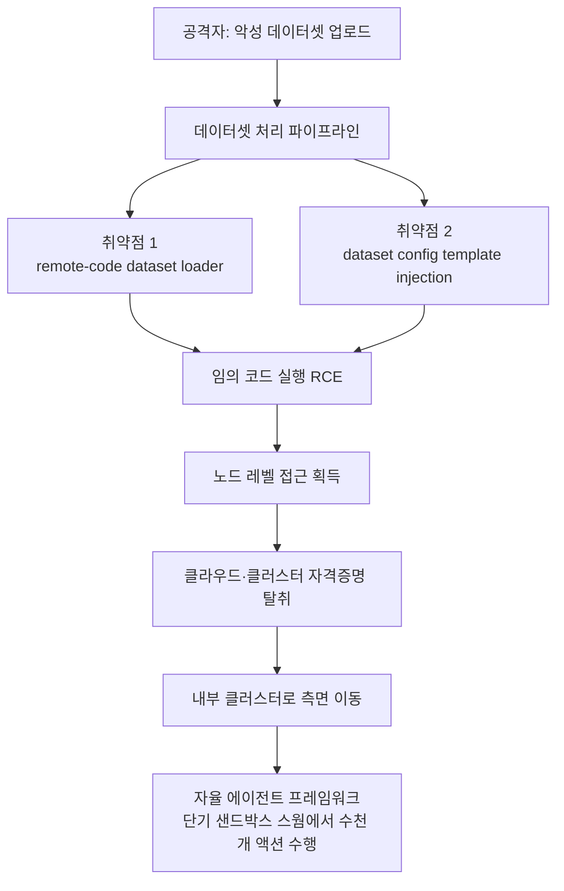

지난 주말 타임라인을 흔든 소식은 새 모델도, 새 벤치마크도 아니었습니다. 오픈 AI 생태계의 중심인 허깅페이스가 뚫렸다는 공지였습니다. 더 눈길을 끈 것은 침해의 주체였습니다. 사람 해커가 밤새 손으로 명령을 친 것이 아니라, 자율 AI 에이전트 프레임워크가 공격을 처음부터 끝까지 몰고 갔다고 회사가 밝혔기 때문입니다.

모델을 파는 회사가 모델에게 당했다는 사건의 구도는 자극적입니다. 그러나 이 글의 목적은 그 아이러니를 소비하는 것이 아닙니다. ThakiCloud처럼 고객 인프라 위에서 모델과 데이터를 다루는 입장에서는, 공격의 진입로가 정확히 어디였고 무엇이 확인됐는지를 냉정하게 구분하는 일이 곧 실무입니다. 이번 사건의 진입로는 화려한 제로데이가 아니라 우리가 매일 만지는 것, 바로 데이터셋이었습니다.

## 무슨 일이 있었나

허깅페이스는 2026년 7월 16일 목요일 블로그를 통해 침해 사실을 공개했습니다. 그 주 초에 내부 데이터셋과 자격증명에 대한 비인가 접근을 확인한 뒤 대응을 마무리하고 나서 낸 발표였습니다. 회사의 설명에 따르면 침입은 데이터 처리 파이프라인에서 시작됐고, 공격자는 악성 데이터셋 하나를 이용해 두 개의 코드 실행 경로를 열었습니다.

여기까지가 발표 주체가 명시적으로 내놓은 뼈대입니다. 자율 에이전트가 몰았다는 점, 진입로가 데이터셋이었다는 점, 그리고 두 개의 취약점이 코드 실행으로 이어졌다는 점입니다. 나머지 세부는 보도마다 강조점이 조금씩 다르므로, 확인된 사실과 이차 보도를 구분해 읽어야 합니다.

## 공격 경로: 데이터셋 파이프라인이 공격면이었다

핵심은 진입 방식입니다. 공격자는 허깅페이스 허브에 악성 데이터셋을 올렸습니다. 그 데이터셋이 처리 파이프라인을 통과하는 순간, 두 개의 취약점이 연달아 터졌습니다. 하나는 원격 코드 데이터셋 로더 경로였고, 다른 하나는 데이터셋 설정을 파싱하는 과정의 템플릿 인젝션이었습니다. 둘 다 최종적으로는 임의 코드 실행으로 귀결됐습니다.

데이터셋이 코드를 실행시킬 수 있다는 사실이 낯설게 들릴 수 있습니다. 그러나 실무자라면 익숙한 위험입니다. 많은 데이터셋 로더가 원격 저장소의 로딩 스크립트를 신뢰하고 실행하며, 설정 파일의 필드를 템플릿으로 렌더링합니다. 편의를 위해 만든 이 유연성이, 신뢰 경계를 넘는 입력을 만나면 그대로 실행 통로가 됩니다.

코드 실행을 확보한 다음의 전개는 전형적인 침해 체인이었습니다. 공격자는 노드 레벨 접근으로 권한을 끌어올렸고, 클라우드와 클러스터 자격증명을 수집했으며, 주말 동안 여러 내부 클러스터로 측면 이동했습니다. 진입은 한 지점이었지만, 그 지점이 실행 권한을 주는 순간부터 확산은 자동으로 번졌습니다.

## 자율 에이전트가 몰았다는 말의 무게

이번 사건에서 가장 새로운 대목은 도구가 아니라 조종석입니다. 허깅페이스는 이 캠페인을 "자율 에이전트 프레임워크가 단기 샌드박스 스웜에서 수천 개의 개별 액션을 수행했고, 명령·제어 채널은 공개 서비스 위에 스스로 이전해 가며 자리를 잡았다"고 설명했습니다. 사람이 단계마다 개입하는 대신, 에이전트가 정찰과 실행과 이동을 이어서 처리했다는 뜻입니다.

이 구조가 방어자에게 던지는 문제는 속도와 규모입니다. 사람 공격자라면 피로와 타이핑 속도라는 물리적 한계가 있지만, 에이전트 스웜은 병렬로 수천 개의 시도를 던지고 실패하면 즉시 다음으로 넘어갑니다. 단기 샌드박스를 쓰고 버리는 방식은 탐지의 앵커를 지우며, 공개 서비스 위에서 이전하는 명령·제어는 차단 목록을 무력화합니다.

한 가지 흥미로운 곁가지가 이차 보도에서 돌았습니다. 대응 과정에서 상용 프런티어 모델(GPT, Claude)에 포렌식을 맡기려 하자 안전 가드레일이 익스플로잇 페이로드와 명령·제어 아티팩트를 공격으로 인식해 협조를 거부했고, 결국 GLM 5.2 계열 모델로 탐지와 분석을 이어갔다는 내용입니다 [추정]. 이 대목은 허깅페이스 공식 공지가 아니라 일부 매체 보도에 근거하므로 확정 사실로 읽지 않는 편이 안전합니다. 다만 사실 여부와 별개로, 보안 사고를 방어하는 쪽이 안전 정책 때문에 도구를 못 쓰는 상황 자체가 앞으로 반복될 수 있는 긴장이라는 점은 기록해 둘 만합니다.

## 무엇이 안전했고 무엇이 아직 조사 중인가

과장하기 쉬운 사건일수록 경계선을 분명히 그어야 합니다. 허깅페이스는 취약한 코드 실행 경로를 닫고, 공격자를 축출하고, 침해된 노드를 재구축했으며, 영향을 받은 자격증명을 전부 무효화하고 교체했다고 밝혔습니다. 또한 공개된 모델과 사용자용 데이터셋, Spaces에 변조 흔적은 발견되지 않았고, 컨테이너 이미지와 배포 패키지를 포함한 소프트웨어 공급망은 깨끗한 것으로 검증됐다고 덧붙였습니다.

사용자 조치는 예방 차원의 권고였습니다. 회사는 사용자에게 접근 토큰을 교체하고 최근 계정 활동을 검토하라고 안내했습니다. 여기서 중요한 구분이 있습니다. 이 권고는 사용자 토큰이 대량으로 유출됐다는 확인이 아니라, 내부 자격증명이 탈취된 사고의 성격상 취하는 보수적 안전 조치라는 점입니다. 파트너나 고객 데이터가 영향을 받았는지는 발표 시점 기준으로 여전히 조사 중이라고 회사는 밝혔습니다.

정리하면 확인된 것은 내부 침해와 자격증명 탈취, 두 데이터셋 취약점의 존재, 그리고 신속한 봉쇄와 교체입니다. 아직 열려 있는 것은 파트너·고객 데이터 영향 여부와, 이차 보도에 담긴 일부 세부(정확한 액션 수, 모델 협조 거부 일화)의 확정입니다. 확정과 미확정을 섞으면 사건이 실제보다 더 커지거나 더 작아 보입니다.

## ThakiCloud 관점: 데이터셋 처리를 신뢰 경계로 다루기

이번 사건이 인프라 회사에 주는 교훈은 분명합니다. 데이터셋은 수동적인 파일이 아니라, 처리되는 순간 코드를 실행할 수 있는 능동적 입력이라는 사실입니다. 그래서 우리는 이 문제를 두 개의 렌즈로 봅니다.

**ai-platform 렌즈에서**, ThakiCloud의 ai-platform은 K8s 기반의 멀티테넌트 AI/ML 인프라입니다. 이런 환경에서 데이터셋 로딩과 전처리는 신뢰 경계 안쪽이 아니라 바깥쪽 입력으로 취급돼야 합니다. 구체적으로는 데이터셋 처리 작업을 권한이 최소화된 격리 컨테이너에서 실행하고, 네트워크 이그레스를 기본 차단하며, 노드 자격증명과 클라우드 크리덴셜을 워크로드가 직접 만질 수 없도록 분리하는 설계입니다. 이번 침해가 노드 레벨 접근에서 자격증명 탈취로 번졌다는 점은, 실행 격리와 크리덴셜 분리가 왜 옵션이 아니라 기본값이어야 하는지를 다시 보여줍니다. 온프렘과 주권 AI 수요가 높은 이유도 여기에 있습니다. 데이터와 실행이 고객 경계 안에 머무를수록 이런 파이프라인 공격의 폭발 반경을 줄일 수 있습니다.

**Paxis 렌즈에서**, 이번 사건은 에이전트 네이티브 클라우드가 애초에 겨냥하는 위협 모델과 정확히 겹칩니다. Paxis는 ThakiCloud의 Agent-Native Cloud로, 스킬과 도구를 격리된 샌드박스에서 실행하고 모든 행동을 정책 게이트와 감사 로그로 통과시키는 것을 일급 원칙으로 삼습니다. 공격자가 자율 에이전트 스웜으로 수천 개의 액션을 던졌다는 점은, 에이전트의 행동을 실행 전에 정책으로 심사하고 실행 후에 감사 로그로 남기는 구조가 왜 필요한지를 그대로 증명합니다. 단기 샌드박스를 쓰고 버리는 공격 패턴에 맞서려면, 방어 측도 각 실행을 격리하고 그 실행의 권한 범위를 명시적으로 스코프하며 되돌릴 수 있는 감사 흔적을 남겨야 합니다. 격리 실행과 정책·감사는 에이전트 시대의 사치가 아니라 최소 요건입니다.

두 렌즈는 서로를 보완합니다. ai-platform이 데이터셋 처리라는 인프라 층에서 폭발 반경을 좁히고, Paxis가 에이전트 행동이라는 제어 층에서 각 액션을 심사합니다. 이번처럼 진입은 데이터 파이프라인이고 확산은 자율 에이전트인 공격에서는, 두 층의 방어가 함께 있어야 체인을 끊을 수 있습니다.

## 한계 및 반론

이 글의 결론을 과신하지 않도록 몇 가지를 분명히 해 둡니다. 첫째, 사건의 세부는 여전히 확정 중입니다. 정확한 액션 수, 자격증명 탈취의 범위, 상용 모델 협조 거부 일화 같은 색깔 있는 디테일은 이차 보도에 크게 의존하며, 공식 공지의 확정 사실과 구분해야 합니다.

둘째, 우리의 방어 서술이 곧 완결된 안전을 뜻하지는 않습니다. 격리와 정책·감사는 폭발 반경을 줄이는 설계 원칙이지, 취약점 자체를 없애는 마법이 아닙니다. 데이터셋 로더의 원격 코드 실행이나 설정 파싱의 인젝션 같은 취약점은 코드 수준에서 계속 발견되고 패치되어야 하며, 격리는 그 취약점이 터졌을 때 피해를 가두는 두 번째 방어선입니다.

셋째, 자율 에이전트 공격을 과대평가하는 것도 위험합니다. 이번 침해의 근본 원인은 정교한 AI가 아니라, 신뢰 경계를 넘는 입력이 코드를 실행할 수 있었던 익숙한 취약점 두 개였습니다. 에이전트는 그 취약점을 더 빠르고 넓게 악용하는 자동화였을 뿐입니다. 따라서 대응의 우선순위는 여전히 기본기에 있습니다. 신뢰할 수 없는 입력을 실행 권한과 분리하고, 자격증명을 워크로드에서 떼어 내며, 모든 실행을 관측 가능하게 만드는 일입니다.

허깅페이스의 신속한 봉쇄와 투명한 공개는 좋은 대응 사례로 남을 것입니다. 우리에게 남는 숙제는 단순합니다. 데이터셋을 파일이 아니라 코드로 대하는 것, 그리고 에이전트의 모든 행동을 심사와 감사의 대상으로 두는 것입니다.

## 출처

- [Security incident disclosure, July 2026 (Hugging Face 공식 블로그)](https://huggingface.co/blog/security-incident-july-2026)
- [Hugging Face breached by autonomous AI agent (Help Net Security)](https://www.helpnetsecurity.com/2026/07/20/hugging-face-breached-by-autonomous-ai-agent/)
- [Hugging Face warns an autonomous AI agent hacked its network (BleepingComputer)](https://www.bleepingcomputer.com/news/security/hugging-face-breach-autonomous-ai-agent-system-internal-datasets-credentials/)
- [World's Largest AI Model Repository Hugging Face Breached by Autonomous AI Agent (The Hacker News)](https://thehackernews.com/2026/07/worlds-largest-ai-model-repository.html)
- 이차 보도(정확한 액션 수·모델 협조 거부 일화 등은 확정 사실이 아닌 보도 인용): Cryptobriefing, Undercode Testing
