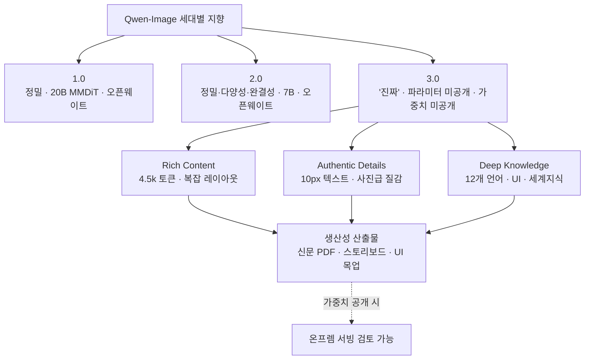

화요일 아침 Qwen 팀 블로그에 이미지 생성 모델의 3세대 발표가 올라왔습니다. 이름은 Qwen-Image-3.0이고, 팀은 세대마다 붙여 온 키워드를 이번에도 하나로 압축했습니다. 1.0이 "정밀", 2.0이 "정밀, 다양성, 완결성, 미감, 진정성"이었다면 3.0의 핵심은 한 글자 "진짜(实, Real)"라는 것입니다.

다만 발표는 릴리즈가 아닙니다. 이 글은 데모의 화려함을 걷어내고, 이번 발표에서 실제로 확인된 것이 무엇이고 아직 손에 잡히지 않는 것이 무엇인지를 나눠 보려 합니다. 이미지 생성 모델을 고객 인프라 위에 올려 서빙하는 입장에서는, 데모 몇 장과 능력 소개 문구만으로 로드맵을 확정할 수 없기 때문입니다. 확인된 것과 아직 아닌 것을 구분하는 일 자체가 인프라 회사의 실무입니다.

## Qwen-Image-3.0, 무엇이 발표됐나

먼저 확인된 사실입니다. Qwen 팀은 2026년 7월 21일 Qwen-Image-3.0을 발표하면서, 이 모델의 지향을 세 가지 축으로 설명했습니다.

첫째는 "풍부한 내용(Rich Content)"입니다. 입력 지시문 길이를 4.5k 토큰까지 받아들여, 신문이나 스토리보드, 시험지처럼 정보 밀도가 높은 레이아웃을 한 번에 그려낸다는 것입니다. 발표에서 가장 인상적인 예시는 3×3 격자 이미지였습니다. 각 칸이 터널 안전 만화, 공간기하 강의, 물리 포물선 운동, 세포 DNA 구조 비교 같은 서로 다른 인포그래픽이고, 이 격자 전체를 3.7k 토큰짜리 단일 지시문으로 한 번에 생성했다고 합니다. 여러 이미지를 이어 붙인 것이 아니라 한 번의 생성이라는 점을 팀은 강조했습니다. 여기에 더해 VSCode 화면 안에 Qwen Chat이 있고 그 안에 위챗 화면이, 다시 그 안에 포스터가 들어가는 "화면 속 화면 속 화면"의 중첩 렌더링도 예시로 제시됐습니다.

둘째는 "사실적 디테일(Authentic Details)"입니다. 10px 수준의 작은 글자도 읽을 수 있게 렌더링하고, 모공과 머리카락, 피부 질감을 사진에 가깝게 묘사한다는 것입니다. LaTeX 수식이 빽빽한 학술 논문 페이지, 실제 신문 지면, 편집 작업에서 손글씨 주석을 덧입히거나 훼손된 전통 회화를 복원하는 사례도 함께 소개됐습니다.

셋째는 "깊은 지식(Deep Knowledge)"입니다. 12개 언어를 네이티브로 렌더링하고, 100개가 넘는 화풍과 다양한 UI 인터페이스를 세계 지식에 기반해 그려낸다는 것입니다. 발표에는 일본어, 한국어, 스페인어를 정확히 렌더링한 예시와, 인터넷에 연결해 최신 정보를 반영한다는 설명이 함께 있었습니다. 특정 IP 인물을 찾아 생성하는 예시로 치바이스와 반 고흐가 라이브 방송에서 Qwen-Image-3.0을 소개하는 장면도 제시됐습니다.

접근 경로도 확인됩니다. 발표 글의 실행 버튼은 모두 Qwen Chat의 텍스트-투-이미지 기능으로 연결됩니다. 즉 지금 만져볼 수 있는 것은 알리바바 플랫폼에서 호스팅되는 서비스 형태이며, 이는 프리뷰 성격의 가용성입니다.

## 무엇이 아직 공개되지 않았나

여기서 조심스럽게 읽어야 할 대목이 시작됩니다. 이번 발표 글에는 이미지 생성 모델을 실제로 도입할 때 가장 먼저 확인해야 할 정보가 통째로 빠져 있습니다.

가중치가 없습니다. 발표는 능력을 보여주는 쇼케이스이고, Hugging Face나 ModelScope에 올라온 다운로드 가능한 체크포인트로 연결되지 않습니다. 세 번째 파티가 만든 커뮤니티 생성기 사이트조차 3.0에 대해서는 "접근 대기(access pending)" 상태로 표기하고 있습니다. 파라미터 수, 모델 아키텍처, 라이선스도 발표 글에 명시되지 않았습니다. 1.0이 20B 규모의 MMDiT였고 2.0이 파라미터를 7B로 줄였다는 사실이 각각 공개됐던 것과 비교하면, 3.0은 아직 구조를 가늠할 단서가 없습니다.

표준 벤치마크도 없습니다. 4.5k 토큰 입력이나 10px 텍스트 렌더링 같은 능력은 발표자가 고른 데모로 제시됐을 뿐, DPG나 GenEval처럼 재현 가능한 평가 표가 함께 나오지 않았습니다. 따라서 "이전 세대보다 낫다"거나 "생산성 도구로 쓸 수 있다"는 문구는, 검증된 수치가 아니라 발표자의 주장 [추정]으로 읽는 것이 안전합니다. 데모는 대체로 가장 잘 나온 결과를 고른 것이므로, 실패율이나 일관성은 별도로 확인해야 합니다.

정리하면 아래와 같습니다.

| 항목 | 상태 |
|---|---|
| 발표·3세대 모델 | 확인됨 |
| 4.5k 토큰 입력·복잡 레이아웃 | 확인됨(데모) |
| 10px 텍스트·12개 언어 렌더링 | 확인됨(데모) |
| Qwen Chat 사용 가용 | 확인됨(호스팅) |
| 오픈 가중치(HF/ModelScope) | 미공개 |
| 파라미터·아키텍처·라이선스 | 미공개 |
| 표준 벤치마크 | 미공개 |
| "생산성 도구" 수준 성능 | 미검증 주장 [추정] |

## 이미지 생성이 '예쁜 그림'에서 '생산성 도구'로

발표에서 반복되는 표현은 "보기 좋은(good-looking)"에서 "쓸모 있는(useful)"으로의 이동입니다. 이 프레임은 이번 세대가 겨냥하는 지점을 잘 요약합니다. 예술적인 한 장을 뽑는 것이 아니라, 신문 지면 PDF, 짧은 드라마 스토리보드, 복잡한 UI 목업처럼 그대로 업무에 투입할 수 있는 산출물을 겨냥한다는 것입니다.

이 방향이 인프라 회사에 주는 함의는 두 갈래입니다. 하나는 서빙입니다. 이미지 생성 모델이 문서와 인포그래픽, UI 목업을 안정적으로 뽑는 도구가 되면, 이런 모델을 고객 경계 안에서 돌려야 하는 수요가 생깁니다. 디자인 자산이나 내부 문서를 외부 API로 보낼 수 없는 고객이 대표적입니다. 다른 하나는 활용입니다. 고밀도 텍스트와 UI를 정확히 렌더링하는 능력은 사람이 손으로 만들던 인포그래픽과 목업 제작을 자동화할 여지를 엽니다.

다만 그 선택지가 실제로 유효해지는 시점은 모델이 발표될 때가 아니라, 가중치가 다운로드 가능해지고 우리가 그것을 우리 하드웨어에서 재현했을 때입니다. 그리고 지금 3.0은 그 앞 단계에 있습니다.

## ThakiCloud 관점: 이미지 모델을 온프렘에서 서빙한다는 것

가정을 해보겠습니다. Qwen-Image-3.0이 앞선 세대들처럼 오픈 가중치로 공개된다면, 확산 계열 이미지 생성 모델을 고객 온프렘 환경에서 서빙하는 과제가 현실이 됩니다. 이때 병목은 모델의 표현력이 아니라 GPU 메모리, 배치 처리 효율, 그리고 지연과 처리량을 맞추는 서빙 구성입니다. 파라미터 수와 아키텍처가 공개되지 않은 지금은 이 비용을 정확히 계산할 수 없고, 그래서 우리는 발표만으로 서빙 로드맵을 확정하지 않습니다.

ThakiCloud의 ai-platform은 이런 모델을 고객 환경에 올리기 위한 토대를 제공합니다. K8s와 Kueue 기반 GPU 스케줄링, 멀티테넌트 격리는 모델이 실제로 공개됐을 때 신속하게 검증에 착수할 수 있게 해줍니다. 이미지 생성 워크로드는 언어 모델과 부하 특성이 다르므로, 배치 크기와 GPU 배분을 이 특성에 맞춰 조정하는 일이 서빙 비용을 좌우합니다. 낮은 서빙 비용과 온프렘 주권이라는 강점은, 오픈 모델이 실제로 손에 들어왔을 때 비로소 값을 합니다.

활용 각도도 있습니다. 문서와 인포그래픽, UI 목업을 정확히 렌더링하는 능력은 에이전트가 다룰 수 있는 하나의 도구가 됩니다. ThakiCloud의 Agent-Native Cloud인 Paxis 관점에서 보면, 이런 생성 능력은 스킬로 감싸 정책 게이트와 감사 로그를 통과시키는 격리 실행의 대상이 됩니다. 다만 이 각도 역시 모델이 실제로 손에 들어온 다음의 이야기입니다.

## 한계 및 반론

이 글은 Qwen-Image-3.0을 깎아내리려는 것이 아닙니다. 4.5k 토큰짜리 복잡한 레이아웃을 한 번에 렌더링하고 10px 텍스트를 읽을 수 있게 그린다는 방향은, 실현된다면 이미지 생성의 실용성을 한 단계 끌어올립니다. Qwen Chat에서 이미 만져볼 수 있다는 점도 무의미하지 않습니다.

다만 균형을 위해 짚자면, 발표는 릴리즈가 아니고 데모는 벤치마크가 아니며 호스팅 가용성은 오픈 가중치가 아닙니다. 이 세 가지 구분이 흐려질 때 기술 판단이 마케팅에 끌려갑니다. 특정 실존 인물을 찾아 생성하는 기능이나 실제 UI를 그대로 시뮬레이션하는 능력은, 저작권과 초상, 브랜드 사칭 측면에서 별도의 검토가 필요한 대목이기도 합니다. 반대로 "완전 공개까지 관심을 끄자"는 태도도 지나칩니다. 올바른 자세는 그 사이에 있습니다. 흐름은 주시하되 로드맵은 검증된 사실 위에만 세우는 것. 발표와 공개가 빠르게 이어지는 지금, 이 구분을 지키는 규율이 인프라 회사의 신뢰를 만듭니다.

## 출처

- [Qwen-Image-3.0: Rich Content, Authentic Details, Deep Knowledge - Qwen Team Blog](https://qwen.ai/blog?id=qwen-image-3.0)
- [Qwen Image 3 Generator (third-party, access pending 표기)](https://qwenimage3.com/)
- [Qwen-Image GitHub (이전 세대 오픈웨이트 참고)](https://github.com/QwenLM/Qwen-Image)
