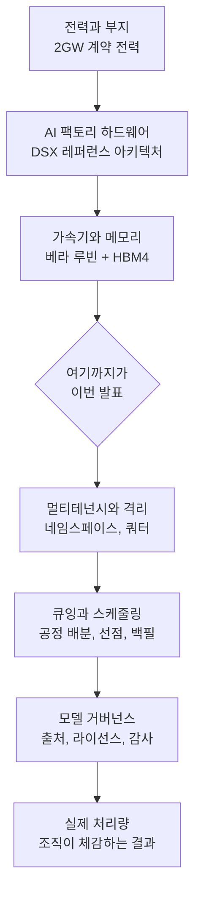

*기가와트 단위의 전력이 하나의 연산 설비로 모이는 구조를 형상화했습니다.*

## 왜 읽어야 하나

이 글은 국내에서 GPU 클러스터를 조달하거나 AI 서비스를 온프레미스와 소버린 환경에 올려야 하는 플랫폼 엔지니어와 기술 의사결정자를 위해 썼습니다. 2027년 이후의 인프라 계획을 지금 세워야 하는 분들이 대상입니다.

먼저 결론을 말씀드리겠습니다. 2기가와트 AI 팩토리가 2027년에 가동을 시작해도 여러분 조직의 GPU 대기열은 그것만으로 짧아지지 않습니다. 공급이 늘어나면 병목은 사라지는 것이 아니라 위층으로 이동합니다. 하드웨어를 구하는 문제에서 확보한 하드웨어를 조직 전체가 공정하고 촘촘하게 나눠 쓰는 문제로 넘어갑니다. 그 계층을 미리 만들어 둔 조직만 늘어난 공급을 실제 처리량으로 바꿉니다.

## 발표된 사실만 먼저

2026년 7월 24일과 25일에 걸쳐 SK그룹과 NVIDIA가 전략적 파트너십 확대를 발표했습니다. 공개된 내용을 사실 그대로만 옮기면 다음과 같습니다.

첫째, 두 건의 협정을 합친 총 가치가 5000억 달러를 넘습니다. 이 숫자는 한 회사가 한 번에 집행하는 현금 투자액이 아니라 AI 팩토리 구축과 메모리 공급을 아우르는 다년간의 총 규모입니다. 발표문 자체가 두 협정에 걸친 합산 가치로 표현하고 있으므로, 단일 캐펙스로 읽으면 규모를 과장하게 됩니다.

둘째, SK텔레콤이 국내에 최대 2기가와트 규모의 AI 팩토리를 구축합니다. NVIDIA의 DSX 플랫폼을 사용하며, 첫 단계는 2027년 중 가동을 목표로 합니다. 여기서 2기가와트는 완공 시점의 상한이고 2027년에 켜지는 것은 첫 단계라는 점을 구분해야 합니다.

셋째, DSX AI 팩토리 플랫폼은 NVIDIA가 준비 중인 베라 루빈 가속 컴퓨팅 아키텍처를 기반으로 합니다. 가속 컴퓨팅 하드웨어와 네트워킹, 소프트웨어, 파트너 기술을 하나의 스택으로 묶어 에너지 효율을 최대화하고 산출물 단위 비용을 낮추는 것이 설계 목표로 제시됐습니다.

넷째, SK하이닉스와 NVIDIA가 별도의 장기 협정을 맺고 차세대 AI 메모리를 공동 개발합니다. HBM4를 포함한 고대역폭 메모리가 대상이며, 대규모 언어모델 학습부터 에이전틱 AI와 피지컬 AI까지 확장되는 수요를 겨냥한다고 밝혔습니다.

다섯째, 두 회사는 이 협력으로 아시아태평양 지역의 대규모 AI 인프라 접근성을 높이고 한국을 AI 혁신 거점으로 자리잡게 하겠다는 목표를 함께 제시했습니다.

여기까지가 검증된 사실입니다. 아래부터는 이 사실을 인프라 운영자의 관점에서 해석한 내용이며, 발표문에 없는 수치는 추정임을 명시하겠습니다.

## 2기가와트가 실제로 뜻하는 것

전력 단위로 발표하는 방식 자체가 이 시대의 변화를 보여줍니다. 예전에는 데이터센터를 서버 대수나 랙 수로 셌지만, 지금은 계약 전력으로 셉니다. 연산 밀도가 높아지면서 얼마나 많은 칩을 넣을 수 있는지가 아니라 얼마나 많은 전력을 끌어와 식힐 수 있는지가 상한을 결정하기 때문입니다.

감을 잡기 위해 비교해 보겠습니다. 국내 표준 대형 원자로인 APR1400 한 기의 설비용량이 약 1.4기가와트입니다. 2기가와트는 대략 원자로 한 기 반 분량의 발전 설비가 만들어내는 전력을 한 부지에서 상시로 소비한다는 뜻이 됩니다. 이 비교는 규모감을 위한 단순 환산이며, 실제 계약 전력과 평균 부하는 다르게 움직입니다.

랙 단위로 환산하면 규모가 더 실감납니다. 최신 세대 고밀도 AI 랙 한 대의 소비 전력을 130킬로와트 안팎으로 잡으면, 냉각과 부대 설비를 제외한 순수 IT 부하 기준으로 만 대 단위의 랙이 들어갈 수 있는 규모입니다. 다만 이 계산은 공개된 랙 전력값에 기댄 추정이고, 실제로는 전력사용효율과 배전 설계, 단계별 증설 계획에 따라 크게 달라집니다.

인프라를 운영해 본 입장에서 더 중요한 대목은 따로 있습니다. 기가와트급 신규 부하는 장비를 사는 문제가 아니라 계통에 접속하는 문제입니다. 부지 확보와 송전 용량, 변전 설비, 인허가가 순서대로 풀려야 첫 랙에 전기가 들어옵니다. 2027년이라는 시점이 보수적으로 잡혀 있는 이유이기도 합니다.

## DSX와 HBM4가 바꾸는 조달의 성격

기술적으로 눈여겨볼 지점은 두 가지입니다.

하나는 DSX라는 이름이 붙은 풀스택 레퍼런스 아키텍처입니다. 데이터센터가 서버를 채워 넣는 건물에서 검증된 설계도로 찍어내는 공장으로 성격이 바뀌고 있다는 신호입니다. 컴퓨트와 네트워킹, 스토리지, 전력, 냉각, 그 위의 소프트웨어까지 한 벤더가 묶어 제공하면 설계와 검증에 드는 시간이 크게 줄어듭니다. 대신 스택 전체가 한 벤더의 로드맵에 묶이는 반대급부가 따라옵니다. 이 교환을 인지하고 들어가는 것과 모르고 들어가는 것은 몇 년 뒤에 전혀 다른 결과를 만듭니다.

다른 하나는 메모리 공동 개발입니다. 대형 혼합 전문가 모델을 서빙해 본 팀이라면 실제 처리량의 상한을 결정하는 것이 연산 성능이 아니라 메모리 대역폭이라는 사실을 알고 있습니다. 토큰을 하나 생성할 때마다 활성 파라미터를 메모리에서 읽어와야 하므로, 배치가 작은 구간에서는 대역폭이 그대로 지연 시간이 됩니다. 메모리 회사와 GPU 회사가 로드맵을 미리 맞춘다는 것은 다음 세대 가속기의 실효 처리량이 지금보다 예측 가능해진다는 뜻입니다.

아래는 이번 발표가 채우는 계층과 여전히 비어 있는 계층을 정리한 그림입니다.

*이번 발표는 아래 세 계층을 채웁니다. 위 네 계층은 여전히 각 조직의 몫으로 남습니다.*

## 한국 AI 인프라 지형에 생기는 변화

지금까지 국내 기업이 AI 워크로드를 돌릴 때 가장 흔한 병목은 물량 그 자체였습니다. GPU를 언제 몇 장 받을 수 있는지가 프로젝트 일정을 결정했고, 그래서 조달이 곧 전략이었습니다.

2027년 이후에 이 전제가 흔들립니다. 국내 리전에 대규모 가속 컴퓨팅이 들어오면 데이터를 국경 밖으로 내보내지 않고도 학습과 서빙을 할 수 있는 선택지가 넓어집니다. 공공과 의료, 국방처럼 데이터 반출 자체가 불가능한 영역에서 이 차이는 결정적입니다. 소버린 AI가 정치 구호가 아니라 조달 가능한 상품이 되는 국면입니다.

이 발표를 최근 몇 주의 다른 움직임과 겹쳐 보면 방향이 더 뚜렷해집니다. 일본은 정부와 재계가 함께 로봇 AI에 조 단위 예산을 묶어 피지컬 AI 쪽으로 방향을 틀었고, 국내에서는 독자 파운데이션 모델 사업과 보안 특화 AI 공모에 국가급 GPU 자원이 배정되며 평가의 무게중심이 순수 성능에서 공공과 의료, 제조, 국방 같은 현장 적용성으로 옮겨갔습니다. 각국이 모델과 컴퓨트를 자국 경계 안에 두려는 흐름 위에 이번 2기가와트 발표가 얹힙니다. 컴퓨트 공급이 국가 단위 산업 정책의 항목이 된 국면입니다.

여기서 자주 생기는 오해가 있습니다. AI 팩토리는 원자재를 공급하는 설비이지 여러분의 조직이 쓰는 플랫폼이 아닙니다. 전력과 랙과 가속기가 준비돼도, 여러 팀이 한 클러스터를 나눠 쓰는 순간 완전히 다른 문제가 시작됩니다. 어떤 팀에 얼마를 배분할지, 급한 추론 워크로드가 장시간 학습 잡을 밀어낼 수 있는지, 밀려난 잡을 어디서부터 다시 시작할지, 유휴 자원을 누가 어떤 규칙으로 채울지가 전부 정해져 있어야 합니다. 이 규칙이 없으면 유휴 GPU와 긴 대기열이 같은 클러스터에서 동시에 발생합니다. 공급을 열 배로 늘려도 이 현상은 사라지지 않습니다.

## ThakiCloud 제품 적용 시사점

이 발표를 읽으면서 저희가 확인한 것은 저희가 만들고 있는 두 제품이 겨냥하는 지점이 정확히 위 그림의 상단 네 계층이라는 사실입니다.

ai-platform은 쿠버네티스 위에서 AI와 머신러닝 워크로드를 운영하는 인프라 계층입니다. Kueue로 큐잉과 쿼터를 다뤄 조직 단위 공정 배분과 선점, 백필을 규칙으로 강제하고, vLLM 기반 서빙으로 추론 처리량을 관리하며, 멀티테넌트 격리로 여러 팀과 여러 고객이 한 클러스터를 안전하게 나눠 쓰게 합니다. 온프레미스와 소버린 환경을 전제로 설계했기 때문에 국내 리전에 들어온 대규모 가속 컴퓨팅을 그대로 얹을 수 있습니다. AI 팩토리가 늘리는 것은 분자이고, 이 계층이 손대는 것은 그 분자를 실제 처리량으로 바꾸는 효율입니다.

Paxis는 그 위에서 도는 에이전트 네이티브 클라우드 제어 평면입니다. 스킬과 도구, 정책, 감사 로그를 일급 리소스로 다룹니다. 대규모 공급은 곧 대규모 사용을 뜻하고, 대규모 사용은 예외 없이 거버넌스 문제로 이어집니다. 어떤 모델이 어디서 왔고 어떤 라이선스를 달고 있는지 심사하는 모델 카탈로그, 에이전트의 실행을 자율도 등급에 따라 통과시키는 정책 게이트, 무엇이 언제 실행됐는지 남기는 감사 로그가 그래서 필요합니다. 컴퓨트가 흔해질수록 통제 능력이 차별점이 됩니다.

두 렌즈는 서로를 보완합니다. 값싸고 풍부한 서빙 기반이 있어야 에이전트를 상시로 돌릴 경제성이 생기고, 에이전트의 실행을 통제할 수 있어야 그 풍부한 컴퓨트를 규제 산업에 팔 수 있습니다.

## 한계 및 반론

이 발표를 낙관적으로만 읽지 않기 위해 반대편도 적어 두겠습니다.

발표는 착공이 아닙니다. 공개된 내용에는 의향서 단계의 항목이 포함돼 있고, 2027년에 켜지는 것은 최대 2기가와트 중 첫 단계입니다. 전체 규모가 실현되는 시점은 아직 확정된 정보가 아닙니다.

5000억 달러라는 숫자도 조심해서 다뤄야 합니다. 두 협정에 걸친 다년간의 총 가치이며, 메모리 공급 계약처럼 성격이 다른 거래가 합산돼 있습니다. 이를 데이터센터 건설 캐펙스로 환산해 국내 투자 규모를 말하면 과장이 됩니다.

일정 리스크의 대부분은 반도체가 아니라 전력과 부지에 있습니다. 계통 접속과 송전 용량, 인허가는 기술로 단축하기 어려운 항목입니다.

가장 강한 반론은 이런 것입니다. 공급이 늘면 단가가 내려가고 그러면 운영 고민의 상당 부분이 돈으로 해결되지 않느냐는 지적입니다. 일리가 있습니다. 다만 지난 십여 년의 클라우드 역사가 보여준 것은 단가 하락이 수요를 더 크게 키웠고, 그 결과 비용 관리와 자원 배분이 오히려 더 어려운 문제가 됐다는 사실입니다. 값이 싸질수록 더 많은 팀이 더 많은 워크로드를 올리고, 그 순간 다시 누가 얼마를 쓰는지의 문제로 돌아옵니다.

## 정리

이번 발표에서 확정된 것은 세 가지입니다. 국내에 최대 2기가와트급 AI 팩토리가 들어오고, 첫 단계가 2027년에 켜지며, 그 위에 얹히는 가속기와 메모리가 한 로드맵으로 묶인다는 사실입니다. 규모는 크지만 성격은 원자재 공급입니다.

그래서 서두에 말씀드린 결론으로 돌아옵니다. 공급이 늘어나도 병목은 사라지지 않고 위층으로 이동합니다. 지금부터 2027년까지 남은 시간에 준비할 것은 GPU 구매 계약이 아니라 그 GPU를 조직 전체가 나눠 쓰는 방식입니다.

구체적으로는 세 가지를 점검해 보시길 권합니다. 첫째, 팀별 쿼터와 우선순위, 선점 정책이 문서가 아니라 클러스터에 코드로 들어가 있는지 확인하십시오. 둘째, 학습 잡이 밀려났을 때 처음부터가 아니라 체크포인트부터 재개되는지 실제로 시험해 보십시오. 셋째, 지금 서빙 중인 모델의 출처와 라이선스를 목록으로 뽑을 수 있는지 물어보십시오. 이 세 가지에 바로 답할 수 없다면, 2기가와트가 켜지는 날에도 대기열은 그대로 남아 있을 가능성이 높습니다.

## 참고 자료

- NVIDIA Newsroom, [SK Group and NVIDIA Expand Strategic Partnership Across AI Factories and Next-Generation Memory](https://nvidianews.nvidia.com/news/sk-group-and-nvidia-expand-strategic-partnership-across-ai-factories-and-next-generation-memory)
- GlobeNewswire, [SK Group and NVIDIA Expand Strategic Partnership Across AI Factories and Next-Generation Memory](https://www.globenewswire.com/news-release/2026/07/25/3333161/0/en/SK-Group-and-NVIDIA-Expand-Strategic-Partnership-Across-AI-Factories-and-Next-Generation-Memory.html)
- SK hynix Newsroom, [SK Group and NVIDIA Expand Strategic Partnership Across AI Factories and Next-Generation Memory](https://news.skhynix.com/en/skhynix-nvidia-partnership-2026/)
- Tom's Hardware, [Nvidia and SK Group enter $500 billion AI partnership](https://www.tomshardware.com/tech-industry/artificial-intelligence/nvidia-and-sk-group-enter-usd500-billion-ai-partnership-plan-to-supercharge-ai-infrastructure-with-next-gen-memory-and-massive-ai-factories)
- StockTitan, [SK Telecom Plans 2-Gigawatt AI Factory to Come Online in 2027](https://www.stocktitan.net/news/NVDA/sk-group-and-nvidia-expand-strategic-partnership-across-ai-factories-flao3olat3l2.html)
