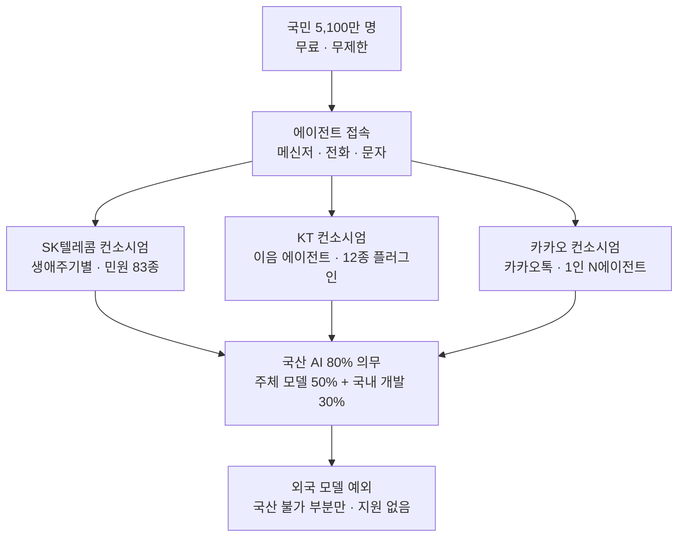

*글의 핵심 개념을 형상화했습니다. 수많은 요청이 하나의 공과망으로 모이는 모습.*

## 왜 읽어야 하나

이 글은 한국에서 AI 인프라 투자를 계획하는 기업과 공공 기관의 CTO, 기술 의사결정자, 그리고 에이전트 실행 레이어를 운영하는 팀을 위한 글입니다. 한 가지만 알면 됩니다. 이번 주 한국 뉴스의 헤드라인은 "전 국민 무료 AI"였지만, 실제 뉴스는 **80% 국산 의무**였습니다. 수요 쪽 시장이 규제에 의해 재구성됐고 전장은 모델 능력에서 에이전트의 행위를 증명할 수 있는 실행 레이어로 이동하고 있습니다.

## 무료, 무제한, 5,100만 명

한국 정부가 5,100만 명 국민에게 무료이고 무제한인 생성형 AI 서비스를 제공하기로 했습니다. 프로젝트의 국내 명칭은 "모두의 AI", 해외 매체 이름은 "AI for All"이고 주관은 과학기술정보통신부입니다. 9월 말 베타 서비스를 시작해 연내 정식 서비스로 나간다는 일정이 함께 제시됐습니다. 시민은 별도 설치할 것이 없습니다. 이미 쓰는 메신저로, 전화로, 문자로 에이전트가 옵니다.

에이전트가 처리하는 것은 질의응답이 아닙니다. 의료 예약, 아파트 검색, 세금 안내, 자녀 학습 콘텐츠 같은 실제 업무가 정부 시스템과 연결됩니다. 소상공인은 세금 계산과 지원 프로그램 대상 여부를 확인합니다. 산업 미디어는 이걸 "실행형 AI"라고 부릅니다. 답하는 AI와 일을 하는 AI는 정도의 차이가 아니라 종의 차이입니다. 국민 전체를 대상으로 내년부터 운영되는 이 서비스의 비용은 정부 예산으로 나갑니다.

## 세 컨소시엄의 서로 다른 해석

SK텔레콤, KT, 카카오가 각각 컨소시엄을 이끌어 서비스 계획을 발표했습니다. 같은 정책인데, 세 쪽이 그린 모양은 다릅니다.

SK텔레콤의 계획은 생애주기 기반입니다. 청년 780만 명, 소상공인 650만 명, 직장인 2,200만 명, 디지털 취약계층 1,100만 명. 각 계층에 다른 에이전트를 두고 "정부24"와 "PASS"에 연계해 83종 민원 서류를 발급합니다. 전화와 문자로 들어오는 에이전트까지 포함입니다. 시민의 비서라는 해석입니다.

KT는 방향이 다릅니다. "양방향 이음 에이전트"가 국내 모든 서비스를 플러그인 형태로 통합하는 구조이고 처음 12종의 서비스를 개발합니다. "토큰 팩토리" 기반으로 운영한다는 표현을 씁니다. 토큰 팩토리라는 말이 지난 달 국내 담론에 들어온 지 한 달도 안 됐는데, 이번엔 서비스 운영의 골격 이름으로 나옵니다. 추론을 생산한다는 표현입니다.

카카오의 해석은 가장 보수적이고 동시에 가장 공격적입니다. 별도 앱 설치 없이 카카오톡과 전화 같은 익숙한 채널에서, 컨소시엄의 국산 모델인 카카오의 카나나와 LG AI연구원의 K-엑사원을 씁니다. 한 사람에게 에이전트를 여러 개 조합하는 "1인 N에이전트"를 지원하고 일자리와 금융, 건강·의료, 라이프케어를 4개 특화 분야로 먼저 개발합니다. LG유플러스가 전화 기반 서비스의 공동 기획·운영을 맡습니다. 한국에서 침투율 100%에 가까운 메신저의 분배력은, 모델 품질로 메울 수 없는 변수입니다.

세 계획 뒤에는 두 개의 숫자가 있습니다. 정부가 컨소시엄에 엔비디아 B200 GPU 512장을 지원한다는 것, 그리고 올해 정부 AI 지출 예산이 약 10조 원으로 전년 대비 3배가 됐다는 것입니다.

## 진짜 뉴스: 80% 의무

"무료"라는 말이 미디어의 시선을 잡았습니다. 시장 구조를 바꾼 것은 다른 조항입니다. 이 프로젝트에서 제공하는 AI의 최소 80%는 국산이어야 합니다. 그중 최소 50%는 운영 주체 자체의 국산 기초 모델에서, 나머지 30%는 다른 국내 개발자에서 납품받아야 합니다. 외국 모델은 "국산 기술로 충족할 수 없는 부분"에서만 허용되고 그 부분에는 정부 지원이 붙지 않습니다.

이건 지원이 아니라 지시입니다. 이전 정책이 돈을 줬다면, 이번 정책은 수요를 줬습니다. 5,100만 명의 사용자를 가진 수요 기본판 위에, 국산 기초 모델의 보호 시장이 법으로 선다. 모델 개발사에게는 수요 보장이고, 통신사에게는 자기 기초 모델을 가져야 한다는 의무입니다. "운영 주체 자체 50%"라는 조항이 그 의무를 산술적으로 구체화합니다.

물론 의무에는 안전밸브가 달려 있습니다. "국산으로 충족할 수 없는 부분"이라는 예외 조항입니다. 국산 모델이 따라오면 이 조항은 닫혀 있고, 따라오지 못하면 해가 거듭날수록 열립니다. 보호 시장은 그만큼 줄어듭니다. 이 정책은 결국 "국산 AI는 따라올 수 있어야 한다"는 계약입니다. 보호막이 아니라 기한입니다.

*AI for All 구조. 세 컨소시엄이 서로 다른 해석으로 같은 정책에 접근하고, 국산 80% 의무가 아래에서 수요를 지탱합니다.*

## 생산은 끝났고, 이제 실행이다

이 뉴스를 한 달 전 이야기로 잇습니다. 7월 26일 SK그룹과 엔비디아는 5,000억 달러 파트너십을 발표했고 SK텔레콤은 2기가와트 AI 팩토리를 2027년부터 돌린다고 했습니다. 9월 초 블로그의 화제는 "토큰 공장은 지었으니, 스위치 보드는 누가 파나"였습니다. 한국 AI 인프라의 생산 쪽은 이미 결정된 문제였습니다. 이번 주 뉴스는 그 다음 단계입니다.

질문이 "GPU가 어디에 가나"에서 "5,100만 명의 행동이 어디에서 처리되나"로 바뀌었습니다. 의료 예약과 민원 서류 발급, 소상공인 세금 계산의 에이전트 조합은 모델 계층에서 끝나는 추론이 아닙니다. 도구와 시스템과 감사를 지나가는 요청입니다. 80% 의무는 모델을 보호합니다. 그런데 국민이 실제로 만지는 것은 실행 레이어입니다. 어떤 에이전트가, 어떤 도구를, 어떤 권한으로, 어떻게 실행했고 그것을 증명할 수 있는가.

이것은 ThakiCloud가 다루는 형태의 문제입니다. 다키클라우드의 ai-platform은 Kubernetes와 GPU 클러스터 같은 고객 환경에서 모델을 서빙하고 Paxis는 에이전트의 스킬과 도구, 정책, 감사 로그를 일급 리소스로 다룹니다. 이 프로젝트가 말하는 83종 민원 서류와 플러그인 통합을 분해하면, 전부 "스킬 + 도구 + 정책 + 감사" 네 개 세트의 문제입니다. 실행 레이어의 국내 시장은 세 컨소시엄에서 시작하지 않습니다. 이 서비스에 연결되는 기업과 공공 기관이 "에이전트가 이것을 잘했는지 증명할 수 있느냐"를 묻기 시작하는 지점에서 시작합니다.

ThakiCloud는 이 프로젝트의 참여 주체가 아닙니다. 이 문단은 수주 소개가 아니라 시장 구조의 분석입니다. 정책은 국산 모델에 대한 수요 보증이면서, 동시에 국산 모델을 "쓰는" 실행 레이어의 시장 개편이기도 합니다.

## 한계와 반론

이 정책에 대한 반론은 네 개입니다.

첫째, 의무가 능력을 대체하지는 않습니다. 국산 모델의 품질이 시민에게 제공될 수준에 미치지 못하면, 예외 조항이라는 안전밸브가 열립니다. 계획 문서의 "80%"와 실제 서비스의 "80%"는 다른 숫자가 될 수 있습니다. 그 갭을 잴 기준은 시민의 경험이지 정책의 의지가 아닙니다.

둘째, 추론 청구서를 누가 내는지입니다. "무료"는 시민의 관점입니다. 시스템의 관점에선 매 요청이 계산돼야 할 비용입니다. 5,100만 명에 무제한은 경제학에 없는 표현이고 예산에만 있는 표현입니다. 이 규모의 제공이 10조 원 예산으로 지속 가능한지는 토큰 경제학의 질문이며, 앞으로 3~5년에 걸쳐 답이 나오는 질문입니다.

셋째, 개인정보는 의무가 해결하지 않습니다. 정부 시스템에 연결된 에이전트가 의료·세금·주거 정보를 다루는 순간, "국산 80%"는 모델 출처의 조건이지 데이터 보호의 조건이 아닙니다. 데이터가 어디로 흐르고 어디에 저장되고, 감사 로그를 누가 볼 수 있는가는 이 조항이 닿지 않는 문제입니다.

넷째, 512장의 B200은 씨앗이지 전부가 아닙니다 [추정]. 5,100만 명의 추론 부하는 대부분 통신사 기존 인프라와 상업 클라우드가 감당할 것으로 보입니다. 정부가 지원하는 GPU는 "국가가 참여한다"는 신호이자 국산 모델 학습·파인튜닝의 일부 몫이지, 서비스 전체를 나르는 풀이 아닙니다.

## 정리

이번 주, 한국은 AI에 공과금이라는 이름을 줬습니다. 물과 전기처럼, 전 국민에게, 국가 인프라로, 무료입니다. 헤드라인은 "무료"였지만 실제 뉴스는 "국산 80%"였습니다. 수요가 규제에 의해 재구성됐고 국산 기초 모델의 보호 시장이 선 것입니다.

한국 기업과 공공 기관에 이 변화가 주는 것은 구체적입니다. "외국 AI를 그대로 쓰자"가 기본값이었던 창이 닫히기 시작합니다. 그리고 다음 전장은 모델 카드가 아니라 실행 레이어입니다. 공공 인프라에서 "싸게 할 수 있느냐"는 이미 예산이 답한 질문이고, 남은 질문은 "잘했음을 증명할 수 있느냐"입니다. 그 질문에 답하는 쪽이 2027년 이후의 국내 AI 시장 첫 수요를 받습니다.

## 출처

- [Korea Times: Korea to Provide Free AI Agents for All Citizens Through Messenger, Texts](https://www.koreatimes.co.kr/business/tech-science/20260904/korea-to-provide-free-ai-agents-for-all-citizens-through-messenger-texts) (2026-09-04)
- [Korea Times: Korean Firms Unveil Plans for Govt-Led AI Project](https://www.koreatimes.co.kr/business/tech-science/20260904/korean-firms-unveil-plans-for-govt-led-ai-project) (2026-09-04)
- [Sify: South Korea Made Generative AI a Citizens' Right](https://www.sify.com/ai-analytics/south-korea-made-generative-ai-a-citizens-right-should-the-rest-of-the-world-follow/)
- [Future Party: South Korea Institutes an "AI for All" Policy](https://www.futureparty.com/p/south-korea-institutes-an-ai-for-all-policy)
- [Forklog: South Korea to Provide Citizens with Free AI Access](https://forklog.com/en/south-korea-to-provide-citizens-with-free-ai-access/)
- [Geekspin: South Korea Makes AI Credits Free for Every Citizen](https://geekspin.co/south-korea-makes-ai-credits-free-for-every-citizen/)
- 국내 산업지(etnews, 더데일리경제, CIO뉴스), 컨소시엄별 계획, GPU·예산 수치
