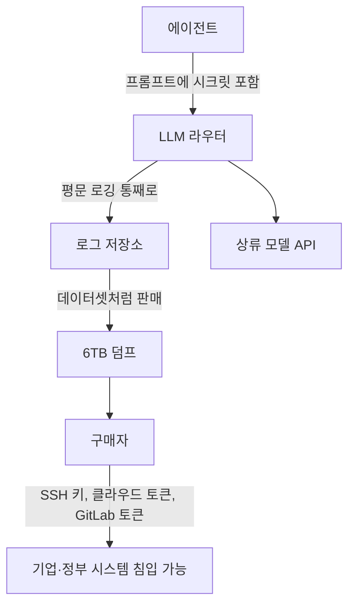

LLM API를 라우터나 게이트웨이처럼 중간단을 거처 쓰거나, 에이전트에 자격증명을 프롬프트 컨텍스트에 넣는 팀이라면 이 사건은 설계 기준을 바꿀 뉴스입니다. 한 보안연구자가 중국 LLM 라우터에서 사들인 6TB 데이터에 SSH 키와 클라우드 자격증명이 그대로 들어 있었다고 주장하면서, "프롬프트는 평문이므로 지나간 모든 것이 남는다"는 전제가 현실의 유출 경로가 됐습니다.

*LLM 라우터가 프롬프트를 통째로 로깅해 데이터 덤프가 되는 구조를 형상화했습니다.*

## 왜 읽어야 하나

이 글은 LLM 기반 에이전트나 서빙 파이프라인을 설계하는 개발자, 그리고 외부 모델 API를 경유하는 중간단(라우터, 게이트웨이, 리소스)을 쓰는 운영팀이 읽어야 합니다. 읽는 이유는 단 하나입니다. 시크릿이 유출된 지점이 코드나 저장소가 아니라, 모델 호출이 지나는 경로였기 때문입니다.

사건의 핵심을 먼저 정리하면 이렇습니다. Fuzzland 공동설립자 Chaofan Shou에 따르면, 중국 주요 LLM 라우터 중 하나로 사들인 6TB 규모 데이터에 SSH 키, VPN 설정, Aliyun(알리바바 클라우드) 키, GitLab 토큰이 포함돼 있었고, 이를 근거로 Huawei, Xiaomi, NIO, MiniMax 등 19개 기업과 중국·CIS 지역 정부기관 7곳의 시스템에 침입할 수 있는 자재가 됐다고 주장합니다.

## 어떤 사건이 일어났는가

Shou가 2026년 9월 10일 X에 공개한 주장의 순서는 다음과 같습니다.

1. 중국 상위 LLM 라우터 중 하나로부터 6TB 규모의 'Fable' 데이터를 구매했습니다. 이 라우터는 모델 호출 데이터를 데이터셋처럼 판매하는 것으로 보도됐습니다.
2. 데이터를 살펴보니 사용자의 프롬프트와 회신이 평문으로 통째로 기록돼 있었습니다.
3. 그 기록 안에는 SSH 키, VPN 설정 파일, Aliyun 클라우드 자격증명, GitLab 토큰이 그대로 남아 있었습니다.
4. 노출된 자격증명의 규모로는 Huawei, Xiaomi, NIO, MiniMax 등 19개 기업과 중국·CIS 지역 정부기관 7곳에 침입하는 데 충분한 자재가 됐다고 판단했습니다.

WCCFtech와 Pandaily 등 다수 매체가 이 주장을 보도했고, Shou는 이전에 LLM 라우터의 안전성을 시험해 온 전적이 있습니다. 2026년 4월에는 428개 LLM 릴레이 스테이션을 시험해 코드 주입과 키 유출, 권한 없는 암호화폐 전송 등을 보고했습니다. 이번 사건의 맥락은 그 연장선에 있습니다.

## 왜 일어났는가: 프롬프트는 평문이다

구조적 원인은 기술이 아니라 경로입니다. LLM 라우터는 사용자의 프롬프트를 그대로 받아서 상류 모델에 전달하고, 응답을 되돌려주는 중계기입니다. 이 과정에서 프롬프트는 반드시 평문으로 해석·로깅됩니다. 라우터는 로깅 없이는 동작하지 않으며(장애 대응, 과금, 품질 분석), 그 로그는 본질적으로 사용자의 전체 대화 내용입니다.

문제는 사용자가 그 로그에 무엇을 넣는가에 있습니다. 인간 사용자의 대화에는 시크릿이 잘 안 들어갑니다. 그러나 **에이전트는 다릅니다**. 에이전트는 자격증명, 토큰, 키를 작업 지시(프롬프트)에 붙여 모델을 호출하는 것이 정상 동작입니다. "이 토큰으로 이 저장소를 확인해라", "이 SSH 키로 이 서버에 접속해 상태를 봐라" 같은 지시는, 모델이 이해할 수 있는 유일한 방법이기 때문에 시크릿을 컨텍스트에 넣어야 합니다.

에이전트가 시크릿을 컨텍스트에 넣는 순간, 그 시크릿은 모델 호출이 지나는 모든 라우터·게이트웨이·로그 저장소의 데이터가 됩니다. 유출은 공격자의 정교한 침입이 아니라, 로그를 사는 것만으로 일어납니다.

이 다이어그램의 핵심은 공격 단계가 없다는 점입니다. C에서 E로 가는 화살표가 곧 유출이고, E에서 F로 가는 화살표가 구매입니다.

## 아직 확인되지 않은 것

보도된 내용과 연구자 주장 사이에는 명확한 경계가 있습니다. 작성 시점 기준으로 다음 지점은 독립적으로 검증되지 않았습니다.

- 해당 라우터 운영자의 정체, 그리고 어떤 로그를 얼마나 오래 저장했는지
- 노출된 자격증명이 현재 유효한지, 이미 회수된 테스트 키인지
- 19개 기업과 7개 정부기관 중 어느 쪽이 자신들의 키가 노출됐다고 확인했는지
- 실제 침입이 시도됐거나 이루어졌는지

Shou의 주장이 "사건이 일어났다"가 아니라 "일어날 수 있는 자재가 판매되고 있었다"는 단계에 있다는 점은, 인용할 때 반드시 함께 보셔야 합니다. 단, 이 지점의 불확실성은 사건의 구조적 교훈을 바꾸지 않습니다. 라우터가 프롬프트를 평문으로 로깅한다는 사실과, 에이전트가 시크릿을 컨텍스트에 넣는다는 사실은 검증된 전제이며, 그 둘이 만나는 지점에서 이 사건이 나온 것입니다.

## ThakiCloud 제품 적용 시사점

이 사건은 다키클라우드의 세 제품에서 이미 설계에 반영되어 있어야 하는 원칙을 확인시켜 줍니다.

**Paxis (에이전트 플랫폼)**. 에이전트가 시크릿을 컨텍스트에 넣지 않도록 하는 것이 핵심 방어입니다. 자격증명은 프롬프트 텍스트가 아니라, 샌드박스 실행 환경의 외부 주입(시크릿 마운트, 워크로드 네임스페이스 분리)으로 가야 합니다. 모델이 "이 키로 접속해라"고 말하는 대신, 실행 환경이 키를 가지고 있는 구조. Paxis의 샌드박스와 정책 게이트가 지킬 라인이 바로 이것입니다.

**Metis (서빙 경로)**. 모델 호출 전과 후의 로깅에서 자격증명이 프롬프트에 섞이지 않는지 검사하는 게이트가 필요합니다. 서빙 엔드포인트의 요청 로그는 장애 대응과 과금에 필요하지만, 그 로그가 다시 데이터셋이 되는 순간을 전제하고 설계해야 합니다. "로그는 남는 것"이라는 전제 아래, 남으면 안 되는 패턴(토큰 형식, 키 형식)을 정규식으로 탐지하는 입력 검증이 서빙 경로에 들어가야 합니다.

**Aegis (온프레미스)**. 소버린 온프레미스 AI는 이 사건의 반대편에 있습니다. 외부 LLM 라우터를 경유하지 않으면, 프롬프트가 지나는 중간단이 자사 경계 안에만 존재합니다. 자격증명이 유출될 수 있는 경로가 "라우터를 사들이는 것"에서 "자사 시스템이 침해되는 것"으로 좁아지며, 이는 감사·방어할 수 있는 범위가 됩니다. 공공·국방·금융 고객의 온프레미스 결정에 이 사례가 정량 근거로 쓰입니다.

**Signum (시크릿·감사)**. 어떤 경로든 자격증명의 수명(발급, 사용, 회수, 감사)을 하나의 정본으로 관리하는 것이 마지막 방어선입니다. 6TB 덤프에 "어떤 키가, 언제, 어떤 에이전트 컨텍스트에서" 나온 것인지 추적할 수 있는 감사 로그가 없으면, 유출 이후 대응은 시작도 못 합니다.

## 한계 및 반론

이 주장을 그대로 받아들이기 전에 볼 반론도 있습니다.

첫째, 노출된 키가 유효한 프로덕션 자격증명이 아니라, 테스트용·이미 폐기된 키일 수 있습니다. LLM 개발 환경에서는 샘플 키를 프롬프트 예시에 넣는 것이 흔하며, Shou의 이전 보고서에서도 심겨진(planted) 클라우드 테스트 키가 언급됐습니다. 이번 6TB에도 같은 유형의 키가 섞여 있다면, 침입 가능 규모가 보도보다 작을 수 있습니다.

둘째, "19개 기업, 7개 정부기관"이라는 숫자는 Shou의 분류 기준에 의존합니다. 노출된 키가 실제로 그 기관의 것인지, 기관명이 어디에서 유추된 것인지에 대한 독립 검증이 없습니다.

셋째, 이 사건이 "모든 LLM 라우터가 위험하다"로 일반화되어도 안 됩니다. 문제의 구조는 "라우터가 로깅한다"가 아니라 "사용자가 시크릿을 프롬프트에 넣는다"입니다. 시크릿이 컨텍스트에 들어가지 않는 에이전트 설계라면, 라우터가 통째로 로깅해도 남는 것이 없습니다. 반대로 시크릿을 컨텍스트에 넣는 설계라면, 라우터가 아니어도 서빙 로그, 트레이스, 세션 저장소 같은 다른 경로가 같은 일을 합니다.

## 정리

이 사건의 교훈은 기술 선택이 아니라, **시크릿이 지나는 경로의 수**를 줄이는 것입니다.

에이전트 설계에서 자격증명을 프롬프트 텍스트가 아니라 실행 환경의 외부 주입으로 옮기면, 모델 호출이 지나는 모든 라우터·로그·트레이스가 시크릿을 보지 못합니다. 서빙 경로에서 로그에 남으면 안 되는 토큰·키 패턴을 입력 검증으로 막으면, 로그 자체가 데이터셋이 되어도 남는 것이 없습니다. 그리고 소버린 환경을 설계한다면, 외부 라우터를 경유하지 않는다는 것 자체가 이 사건의 리스크를 제거하는 가장 단순한 방법입니다.

확인되지 않은 숫자(19개사, 7개 기관)를 기억하기보다, 확인된 구조(프롬프트는 평문, 라우터는 로깅, 에이전트는 시크릿을 컨텍스트에 넣는다)를 기억하십시오. 그 구조가 그대로면, 다음 6TB는 다른 라우터에서, 다른 키로, 다른 기관의 이름으로 다시 나올 수 있습니다.

## 출처

- [WCCFtech: A researcher buys 6TB of Anthropic Claude data dump from a China-based LLM router](https://wccftech.com/a-researcher-buys-6tb-of-anthropic-claude-data-dump-from-a-china-based-llm-router-finds-enough-ammo-to-hack-xiaomi-huawei-and-chinese-government-agencies/)
- [Pandaily: China LLM router logs, 6TB credential leak, researcher claim](https://pandaily.com/china-llm-router-logs-6tb-credential-leak-researcher-claim)
- [Chaincatcher: 관련 보도](https://www.chaincatcher.com/en/article/2289095)
- [Risky.biz: malicious LLM proxy routers bulletin](https://news.risky.biz/risky-bulletin-malicious-llm-proxy-routers-found-in-the-wild/)
- 최초 공유: [Chaofan Shou (@shoucccc)의 X 트윗](https://x.com/hjguyhan/status/2098693425663279441)
