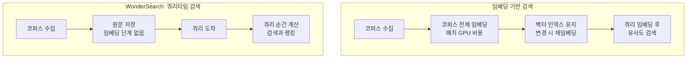

*코퍼스 임베딩을 건너뛰고 쿼리 순간에 계산하는 검색. WonderSearch의 핵심 제안을 형상화했습니다.*

## 왜 읽어야 하나

RAG 파이프라인을 세우거나, 문서 검색 인프라의 유지비용이 왜 지우개처럼 줄지 않는지 답답해하는 엔지니어라면 이 글이 해당합니다. YC F26 스타트업 Polygres가 9월 28일 출시한 WonderSearch는 "문서를 먼저 임베딩하지 않고 수백만 건의 비정형 문서를 검색한다"고 말합니다. 결론을 먼저 드립니다. 이 출시의 핵심은 회수율(recall) 수치가 아니라, RAG의 비용 모델을 **코퍼스당 1회 과금**에서 **쿼리당 과금**으로 뒤집겠다는 선언입니다. 임베딩 파이프라인이 "한 번 싸게" 보이는 이유와, 실제로는 상시 유지비용으로 돌아오는 이유를 알고 있는 쪽이 이 선택을 더 싸게 계산할 수 있습니다.

## 개요

Polygres의 공동 설립자 dale(@daleverett)이 2026년 9월 28일 X에 올린 [출시 트윗](https://x.com/daleverett/status/2104589410436354101)은 이렇게 시작합니다. "오늘 우리는 WonderSearch(YC F26)를 출시합니다. 코퍼스를 사전 임베딩하지 않고 수백만 건의 비정형 문서를 검색합니다. 임베딩 기반 검색과 동등하거나 더 나은 회수율로요." 트윗이 나열하는 제안은 네 가지입니다. 코퍼스 전체를 돌리는 임베딩 단계가 없고, 유지해야 할 벡터 인덱스가 없으며, 계산은 필요한 순간에만 추가되고, 과금은 검색 건당이라는 것입니다.

Polygres는 [자사 사이트](https://polygres.com/)에서 "Postgres 위에 지은 AI 검색 플랫폼"으로 자신을 소개합니다. 그래프 트래버스, 벡터 유사도, 풀 텍스트, 하이브리드 검색을 한 플랫폼에 모은 것이 기본 정체성이고, WonderSearch는 그 정체성 위에 "임베딩이 없는 검색"이라는 새 제품을 올린 것입니다. 검색 인프라 업계에서 주목할 만한 반응도 나왔습니다. Aleph Alpha의 Hubert Thieblot은 이 트윗에 "이것이 바로 AI 검색이 돌아가야 할 방식이다(this is actually how ai search should work)"라고 답했습니다.

## 임베딩 기반 검색의 숨은 비용표

WonderSearch의 제안을 이해하려면, 지금 대부분이 쓰는 방식의 비용 구조를 먼저 짚어야 합니다. 임베딩 기반 RAG의 비용은 세 단계로 구성됩니다.

- **1차: 코퍼스 전체 임베딩.** 문서를 모두 임베딩 모델에 통과시켜야 합니다. 수백만 문서 규모의 코퍼스라면 이 배치 작업 자체에 GPU 시간이 들고, 그 결과가 저장소에 쌓입니다.
- **2차: 인덱스 유지.** 벡터 인덱스는 살아 있는 구조입니다. 문서가 바뀌면 재임베딩이 필요하고, 임베딩 모델을 바꾸면 코퍼스 전체를 다시 돌리는 계산이 납니다. 임베딩 모델은 빠르게 바뀌는 변수입니다. 코퍼스가 클수록 이 "staleness 비용"은 회피할 수 없는 상시 항목이 됩니다.
- **3차: 검색.** 쿼리가 오면 임베딩해서 벡터 인덱스를 질의합니다. 이 단계는 상대적으로 싸고, 그래서 "검색은 임베딩으로"가 업계의 기본값이 됐습니다.

이 구조에서 비용은 **코퍼스 크기에 비례**합니다. 쿼리는 많을 수도 적을 수도 있지만, 코퍼스는 한 번 쌓이면 줄지 않습니다. 그래서 "임베딩을 안 하는 검색"이라는 제안은, 비용 곡선의 기울기가 코퍼스 크기가 아니라 쿼리 빈도로 넘어가는 것을 뜻합니다.

*두 비용 모델의 비교. S2의 내부 메커니즘(쿼리 순간에 어떤 계산을 하는지)은 현재 공개 자료에서 확인된 것이 없습니다.*

## 무엇이 확인되고 무엇이 확인되지 않는가

보수적으로 선을 그어 둡니다. **확인된 것**: Polygres가 YC F26 프로그램 소속이며, Postgres 기반 검색 플랫폼(그래프·벡터·풀 텍스트·하이브리드)을 운영하고 있고, WonderSearch를 출시했다고 발표한 것입니다. 또한 Polygres의 기술 기반에는 Evokoa의 오픈소스 확장 [pgContext](https://github.com/Evokoa/pgContext)(Apache-2.0, PostgreSQL 17/18 대상)가 들어 있습니다.

**아직 확인되지 않은 것**: "동등하거나 더 나은 회수율"의 측정 방법과 벤치마크 수치, 쿼리타임 검색의 내부 메커니즘(임베딩 없이 어떤 방식으로 원문과 쿼리를 대조하는지), 그리고 검색 건당 과금의 실제 가격표입니다. 출시 트윗은 FAQ와 함께 아래 답글로 이어지지만, 이 글의 기준 시점(9월 30일)까지 그 내용 중 코드로 재현하거나 서드로 검증할 수 있는 정량 데이터는 공개되지 않았습니다. 회수율 비교가 어떤 데이터셋, 어떤 기준 임베딩 모델과 어떤 스캐일을 두고 잰 것인지는, 이 주제를 인프라 결정에 쓰려면 반드시 따져야 할 질문입니다.

## ThakiCloud ai-platform 시사점

ThakiCloud의 ai-platform은 K8s 위에서 RAG와 검색 워크로드를 실제로 돌리는 쪽에 서 있습니다. WonderSearch의 제안은 그 관점에서 세 가지 질문을 만듭니다.

첫째, **우리 고객의 RAG 비용 중 어느 부분이 "코퍼스당 1회"이고 어느 부분이 "쿼리당"인가.** ai-platform의 관점에서 임베딩 배치 파이프라인은 GPU를 오래 점유하는 작업이고, 벡터 인덱스 재구축은 데이터 변경 주기에 묶인 상시 비용입니다. 쿼리타임 계산 모델이 유효해지는 조건은 명확합니다. 코퍼스 크기가 크고, 쿼리 빈도가 낮거나 불규칙한 워크로드입니다. 반대로 고주파 쿼리는 여전히 임베딩 기반이 유리할 수 있습니다. 검색 워크로드를 설계할 때 "코퍼스 대비 쿼리" 비율을 먼저 계산하는 습관이, 이 선택을 비용 숫자로 바꿉니다.

둘째, **Postgres 네이티브 검색이 하이브리드 파이프라인의 진입장벽을 낮추는가.** pgContext처럼 데이터베이스 안에 그래프·풀 텍스트·벡터를 모아 두는 방향은, 별도 검색 클러스터를 세우지 않고 기존 Postgres 스키마 위에 RAG를 얹는 운영 모델입니다. 온프레미스·소버린 환경에서 추가 컴포넌트를 줄이는 것은 비용과 보안 둘 다에서 의미가 있습니다. ai-platform은 멀티테넌트 서빙 위에서 이종 워크로드를 돌리는 만큼, "데이터베이스 안에 검색을 넣을 것인가, 검색 서비스를 따로 세울 것인가"는 실제로 반복해서 마주하는 설계 분기점입니다.

셋째, **회수율 비교의 조건을 먼저 묻는 습관.** "임베딩 기반과 동등하거나 더 나은 회수율"이라는 주장은, 어떤 데이터셋·어떤 기준 임베딩 모델·어떤 문서 길이 분포·어떤 쿼리 집합 위에서 잰 것인가에 따라 성립이 달라집니다. 검색 인프라를 고르는 실무에서는 벤치마크의 "측정 조건"이 벤치마크의 "결과"보다 먼저 읽을 항목입니다. WonderSearch 측이 측정 조건을 공개하는 순간, 이 글의 "확인되지 않은 것" 목록에서 첫 항목이 지워집니다.

## 한계 및 반론

이 글이 지나치게 유리하게 본 부분이 없는지 반대로 점검합니다. 첫째, 회수율 주장은 아직 검증 전입니다. "임베딩 기반과 동등하거나 더 낫다"는 말이 성립하려면, 같은 데이터셋에서 기존 벡터 검색과 동시 측정되어야 하는데 그 수치가 공개되지 않았습니다. 둘째, 쿼리타임 계산이 "더 싸다"는 보장은 없습니다. 임베딩을 빼면 검색 당 계산량이 커질 수 있고, 결국 총비용은 쿼리 양에 의존합니다. "검색 건당 과금"은 비용 모델의 변경이지, 비용의 축소가 아닙니다. 셋째, Postgres 기반 검색의 규모 한계는 별개의 문제입니다. "수백만 문서"에서 어떤 QPS와 레이턴시를 유지하는지는, 데이터베이스가 검색 엔진을 대체하는 이야기가 아니라 검색 워크로드를 데이터베이스가 견디는 이야기가 됩니다.

## 정리

WonderSearch는 새로운 검색 알고리즘의 발표가 아니라, RAG 비용 모델의 가격표를 다시 쓰겠다는 발표입니다. 코퍼스 전체를 임베딩하는 "1차 비용"을 없애고, 계산과 과금을 쿼리 순간으로 옮기는 구조입니다. 이 구조가 이득이 되는지는 워크로드가 결정합니다. 코퍼스 크기가 크고 쿼리가 드문 문서 검색이라면 쿼리타임 모델이, 쿼리가 높은 검색 서비스라면 기존 임베딩 파이프라인이 여전히 합리적일 수 있습니다. ThakiCloud의 관점에서 실무가 가져가야 할 것은 하나의 체크포인트입니다. 다음 RAG 설계에서 "코퍼스 대비 쿼리" 비율을 먼저 계산하고, 그 비율에 맞는 비용 모델을 고르라는 것. 회수율 수치가 공개되는 순간, 이 글의 "확인되지 않은 것" 목록을 업데이트해야 합니다.

## 출처

- [dale(@daleverett)의 WonderSearch 출시 트윗, 2026-09-28](https://x.com/daleverett/status/2104589410436354101)
- [Polygres 공식 사이트](https://polygres.com/)
- [Polygres 플랫폼 소개](https://polygres.com/platform)
- [Evokoa pgContext(GitHub, Apache-2.0)](https://github.com/Evokoa/pgContext)
- [Hubert Thieblot의 반응 트윗](https://x.com/hthieblot/status/2104676225113530681)
