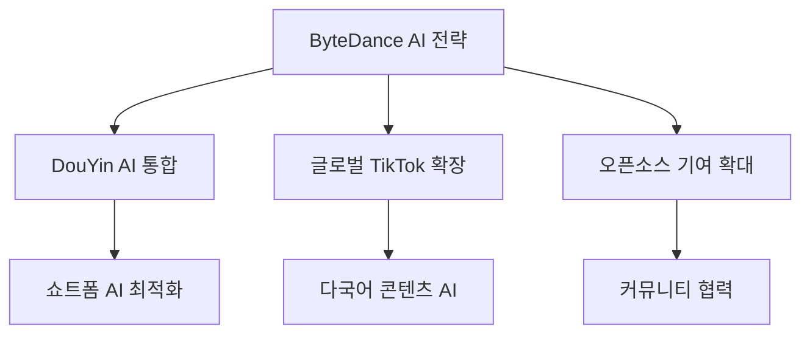
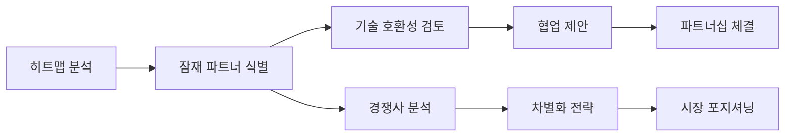

⏱️ **예상 읽기 시간**: 7분

## 서론

**DeepSeek 모멘트** 이후 전 세계가 중국의 오픈소스 AI 역량에 주목하고 있습니다. 이러한 시점에 중국 AI 커뮤니티에서 공개한 **[Chinese Open Source Heatmap](https://huggingface.co/spaces/zh-ai-community/model-release-heatmap-zh)**은 중국의 오픈소스 AI 움직임을 실시간으로 추적할 수 있는 혁신적인 도구입니다.

이 글에서는 중국 오픈소스 AI 히트맵의 핵심 기능과 주요 플레이어 분석, 그리고 글로벌 AI 전략 수립에 활용하는 방법을 상세히 알아보겠습니다.

## 🔥 Chinese Open Source Heatmap 개요

### 📊 도구 소개

**중국 오픈소스 AI 히트맵**은 중국의 기업, 연구소, 커뮤니티가 주도하는 오픈소스 AI 프로젝트를 시각화하는 대시보드입니다.

| 기능 | 설명 |
|------|------|
| **실시간 추적** | 모델 릴리즈 현황 실시간 모니터링 |
| **플레이어 분류** | 대기업/스타트업/연구소별 구분 |
| **시각화** | 히트맵 형태의 직관적인 데이터 표현 |
| **트렌드 분석** | 시간대별 활동 패턴 분석 |
| **접근성** | Hugging Face Spaces를 통한 웹 접근 |

### 🎯 도구의 전략적 가치

**글로벌 AI 경쟁력 분석:**
- 중국 AI 생태계의 오픈소스 기여도 측정
- 기술 트렌드 선행 지표 파악
- 투자 및 협업 기회 발굴
- 경쟁사 동향 모니터링

## 🏢 주요 플레이어 분석

### 🌟 Giant Tech: 오픈소스 투자 확대

#### 1. 알리바바 (Alibaba)
**전체 스택 오픈 생태계** 구축에 집중

```yaml
Alibaba 오픈소스 전략:
  - Qwen 시리즈: 대화형 AI 모델
  - PAI (Platform for AI): ML 플랫폼
  - 클라우드 인프라: 오픈소스 지원
  - 커뮤니티: 개발자 생태계 확장
```

**핵심 프로젝트:**
- **Qwen2.5**: 다국어 지원 LLM
- **ModelScope**: AI 모델 허브
- **EasyNLP**: 자연어 처리 프레임워크

#### 2. 텐센트 (Tencent)
**Hunyuan 멀티모달** 생태계 주도

```python
# 텐센트 Hunyuan 생태계
hunyuan_ecosystem = {
    "image": "Hunyuan-DiT (이미지 생성)",
    "video": "Hunyuan-Video (비디오 생성)", 
    "3d": "Hunyuan-3D (3D 모델링)",
    "text": "Hunyuan-Large (텍스트 생성)"
}
```

**혁신 포인트:**
- 게임/엔터테인먼트 특화 AI
- 위챗 생태계 통합
- 멀티모달 콘텐츠 생성

#### 3. 바이트댄스 (ByteDance)
**2025년 빠른 추격** 전략



#### 4. 바이두 (Baidu)
**오픈 LLM의 새로운 플레이어**

**ERNIE 생태계:**
- ERNIE Bot: 대화형 AI
- PaddlePaddle: 딥러닝 프레임워크
- 자율주행 AI 오픈소스화

### 🚀 Post-DeepSeek 신규 진입자

#### DeepSeek 모멘트의 영향

**DeepSeek R1**의 성공 이후 새롭게 부상한 플레이어들:

| 기업 | 특화 분야 | 주요 프로젝트 |
|------|-----------|---------------|
| **샤오미 (Xiaomi)** | 모바일 AI | MiLM 시리즈 |
| **Red Note** | 소셜 AI | 컨텐츠 생성 AI |
| **Bilibili** | 크리에이터 AI | 동영상 편집 AI |
| **MiniMax** | 멀티모달 | ABAB 시리즈 |
| **Moonshot AI** | 장문 처리 | Kimi Chat |

### 💼 스타트업 생태계 변화

#### 생존하는 스타트업의 특징

**방향성과 강점의 일치**가 핵심:

```python
# 성공하는 스타트업 패턴
successful_startups = {
    "DeepSeek": {
        "strength": "수학적 추론",
        "direction": "과학/연구용 AI",
        "strategy": "오픈소스 우선"
    },
    "MiniMax": {
        "strength": "멀티모달 생성",
        "direction": "크리에이티브 AI",
        "strategy": "API 중심"
    },
    "StepFun": {
        "strength": "단계별 추론",
        "direction": "교육용 AI",
        "strategy": "수직 특화"
    },
    "Moonshot AI": {
        "strength": "장문 이해",
        "direction": "문서 처리 AI",
        "strategy": "기업 솔루션"
    },
    "Zhipu AI": {
        "strength": "코드 생성",
        "direction": "개발자 도구",
        "strategy": "툴체인 통합"
    }
}
```

### 🔬 연구소 & 커뮤니티 기여

#### 핵심 연구 기관

**1. BAAI (Beijing Academy of Artificial Intelligence)**
```yaml
BAAI 주요 프로젝트:
  - GLM 시리즈: 대화형 언어 모델
  - CogVideo: 비디오 생성 모델
  - FastChat: 대화 AI 플랫폼
```

**2. Shanghai AI Lab**
```yaml
상하이AI연구소 기여:
  - InternLM 시리즈: 다국어 LLM
  - MMPretrain: 멀티모달 사전훈련
  - OpenCompass: AI 벤치마크
```

**3. OpenMOSS**
```yaml
OpenMOSS 오픈소스:
  - MOSS: 대화형 AI 모델
  - CodeMOSS: 코드 생성 AI
  - 교육용 AI 도구
```

**4. MAP (Machine Intelligence & Pattern)**
```yaml
MAP 연구 영역:
  - 패턴 인식 AI
  - 컴퓨터 비전 모델
  - 산업 응용 AI
```

## 📈 히트맵 활용 전략

### 🎯 비즈니스 인텔리전스 활용

**1. 투자 기회 발굴**

```python
# 투자 기회 스코어링 시스템
def calculate_investment_score(company_data):
    score = 0
    score += company_data['release_frequency'] * 0.3
    score += company_data['community_engagement'] * 0.2
    score += company_data['technical_innovation'] * 0.3
    score += company_data['market_potential'] * 0.2
    return score

# 예시: 높은 스코어 기업들
high_potential = [
    "DeepSeek",    # 기술 혁신 + 커뮤니티
    "MiniMax",     # 시장 잠재력 + 릴리즈 빈도
    "Moonshot AI"  # 특화 영역 + 성장성
]
```

**2. 경쟁사 모니터링**

```yaml
모니터링 지표:
  릴리즈 빈도:
    - 월별 모델 출시 횟수
    - 업데이트 주기 패턴
  기술 트렌드:
    - 새로운 아키텍처 도입
    - 성능 벤치마크 변화
  협업 네트워크:
    - 공동 프로젝트 현황
    - 오픈소스 기여도
```

**3. 파트너십 전략**



### 🔍 기술 트렌드 분석

**실시간 트렌드 추적:**

```python
# 기술 트렌드 분석 코드
import pandas as pd
import matplotlib.pyplot as plt

def analyze_tech_trends(heatmap_data):
    """히트맵 데이터에서 기술 트렌드 추출"""
    
    trends = {
        "multimodal": count_keyword(heatmap_data, "multimodal"),
        "reasoning": count_keyword(heatmap_data, "reasoning"),
        "code_generation": count_keyword(heatmap_data, "code"),
        "video_generation": count_keyword(heatmap_data, "video")
    }
    
    return trends

# 월별 트렌드 변화 시각화
def plot_monthly_trends(trends_data):
    plt.figure(figsize=(12, 6))
    for trend, values in trends_data.items():
        plt.plot(values, label=trend)
    plt.legend()
    plt.title("중국 AI 기술 트렌드 변화")
    plt.show()
```

## 🌍 글로벌 AI 생태계에서의 의미

### 📊 중국 vs 글로벌 오픈소스 비교

| 특징 | 중국 생태계 | 서구 생태계 |
|------|-------------|-------------|
| **릴리즈 속도** | 매우 빠름 | 안정적 |
| **혁신 방향** | 응용 중심 | 기초 연구 |
| **협업 방식** | 기업 주도 | 커뮤니티 중심 |
| **상용화** | 빠른 적용 | 단계적 접근 |
| **특화 영역** | 멀티모달, 추론 | LLM, 인프라 |

### 🔮 미래 전망

**예상되는 변화:**

1. **기술 수렴**: 동서양 AI 기술의 점진적 통합
2. **표준화**: 글로벌 AI 표준 프로토콜 등장
3. **전문화**: 영역별 특화 모델 증가
4. **오픈소스 확산**: 더 많은 기업의 오픈소스 전환

## 실제 활용 방법

### 🛠️ 히트맵 도구 사용법

**1단계: 기본 모니터링 설정**

```python
# 히트맵 데이터 수집 스크립트
import requests
import json

def fetch_heatmap_data():
    """중국 AI 히트맵 데이터 수집"""
    url = "https://huggingface.co/spaces/zh-ai-community/model-release-heatmap-zh"
    
    # API 호출 (실제 API 엔드포인트는 다를 수 있음)
    response = requests.get(f"{url}/api/data")
    return response.json()

# 일일 모니터링 자동화
def daily_monitoring():
    data = fetch_heatmap_data()
    
    # 새로운 릴리즈 감지
    new_releases = detect_new_releases(data)
    
    if new_releases:
        send_alert(new_releases)
```

**2단계: 맞춤형 대시보드 구축**

```python
import streamlit as st
import plotly.express as px

def create_custom_dashboard():
    st.title("중국 AI 생태계 모니터링 대시보드")
    
    # 데이터 로드
    data = load_heatmap_data()
    
    # 주요 메트릭 표시
    col1, col2, col3 = st.columns(3)
    
    with col1:
        st.metric("이번 주 새 릴리즈", len(data['weekly_releases']))
    
    with col2:
        st.metric("활성 기업 수", data['active_companies'])
    
    with col3:
        st.metric("평균 릴리즈 간격", f"{data['avg_interval']}일")
    
    # 히트맵 시각화
    fig = px.imshow(data['heatmap_matrix'])
    st.plotly_chart(fig)
```

### 📧 알림 시스템 구축

```python
# 중요 이벤트 알림 시스템
class AIHeatmapMonitor:
    def __init__(self):
        self.watched_companies = [
            "DeepSeek", "Alibaba", "Tencent", "ByteDance"
        ]
        self.alert_thresholds = {
            "new_model": True,
            "major_update": True,
            "new_partnership": True
        }
    
    def check_alerts(self, data):
        alerts = []
        
        for company in self.watched_companies:
            if self.has_new_activity(company, data):
                alerts.append(f"{company}에서 새로운 활동 감지")
        
        return alerts
    
    def send_notifications(self, alerts):
        for alert in alerts:
            # Slack, 이메일 등으로 알림 전송
            self.send_to_slack(alert)
```

## 결론

**중국 오픈소스 AI 히트맵**은 단순한 모니터링 도구를 넘어 글로벌 AI 전략 수립의 핵심 인텔리전스 플랫폼입니다. DeepSeek 모멘트 이후 급변하는 중국 AI 생태계를 실시간으로 추적하며, 다음과 같은 전략적 가치를 제공합니다:

**핵심 활용 가치:**
- 🎯 **투자 기회 발굴**: 신흥 플레이어 조기 식별
- 📊 **경쟁 인텔리전스**: 실시간 경쟁사 동향 파악
- 🤝 **파트너십 기회**: 기술 호환 파트너 발굴
- 📈 **트렌드 예측**: 기술 발전 방향 선행 지표

**향후 전망:**
중국의 오픈소스 AI 생태계는 **알리바바, 텐센트** 등 거대 기술 기업의 전폭적 투자와 **DeepSeek, MiniMax** 등 혁신적 스타트업의 기술 돌파구가 만나면서 글로벌 AI 판도를 재편하고 있습니다.

이 히트맵 도구를 통해 변화하는 AI 생태계를 선제적으로 파악하고, 데이터 기반의 전략적 의사결정을 내리시기 바랍니다.

**참고 자료:**
- [Chinese Open Source Heatmap](https://huggingface.co/spaces/zh-ai-community/model-release-heatmap-zh)
- [DeepSeek 공식 홈페이지](https://www.deepseek.com/)
- [Alibaba Qwen 시리즈](https://qwenlm.github.io/)
- [Hugging Face Model Hub](https://huggingface.co/models) 