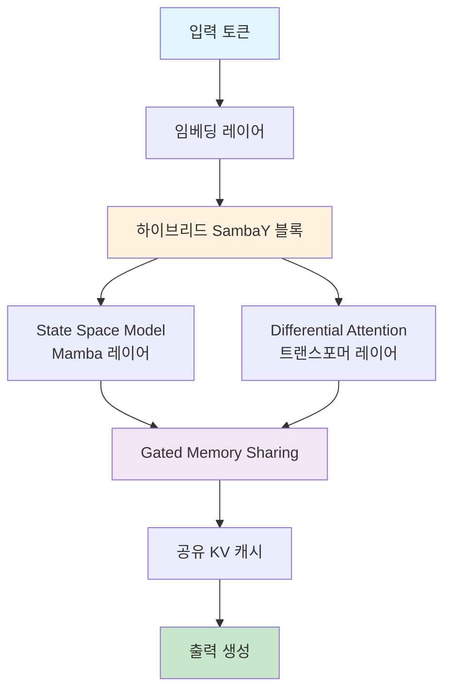

⏱️ **예상 읽기 시간**: 22분

## 서론

소형 언어 모델(Small Language Model)의 새로운 패러다임을 제시하고 있는 [Microsoft Phi-4-mini-flash-reasoning](https://huggingface.co/microsoft/Phi-4-mini-flash-reasoning)은 단 3.8B 파라미터로 대형 모델에 근접한 수학 추론 성능을 달성한 혁신적인 모델입니다.

이 모델은 **하이브리드 SambaY 아키텍처**와 **State Space Model(SSM)**을 활용하여 추론 효율성을 극대화하면서도 뛰어난 성능을 보여주고 있습니다. 이번 포스트에서는 Phi-4-mini-flash-reasoning의 기술적 혁신부터 실제 활용 방안까지 상세히 살펴보겠습니다.

## Phi-4-mini-flash-reasoning 모델 개요

### 기본 정보

Microsoft Phi-4-mini-flash-reasoning은 수학적 추론에 특화된 경량 언어 모델입니다.

**핵심 스펙:**
- **모델 크기**: 3.8B 파라미터
- **어휘 크기**: 200,064 토큰
- **컨텍스트 길이**: 64K 토큰
- **아키텍처**: 하이브리드 SambaY with Differential Attention
- **특화 분야**: 수학 추론, 논리적 사고
- **라이선스**: MIT

### 혁신적 아키텍처



## 핵심 기술 혁신

### 1. 하이브리드 SambaY 아키텍처

Phi-4-mini-flash-reasoning의 가장 혁신적인 특징은 **하이브리드 SambaY 아키텍처**입니다:

```python
# 하이브리드 SambaY 아키텍처 구조
class HybridSambaYBlock(nn.Module):
    def __init__(self, config):
        super().__init__()
        self.config = config
        
        # State Space Model (Mamba) 구성요소
        self.mamba_layer = MambaLayer(
            d_model=config.hidden_size,
            d_state=config.state_size,
            d_conv=config.conv_size,
            expand=config.expand_factor
        )
        
        # Differential Attention 구성요소
        self.diff_attention = DifferentialAttention(
            hidden_size=config.hidden_size,
            num_heads=config.num_attention_heads,
            attention_dropout=config.attention_dropout
        )
        
        # Gated Memory Sharing 메커니즘
        self.memory_gate = nn.Linear(config.hidden_size, config.hidden_size)
        self.memory_norm = nn.LayerNorm(config.hidden_size)
        
    def forward(self, hidden_states, attention_mask=None):
        # SSM 경로
        ssm_output = self.mamba_layer(hidden_states)
        
        # Attention 경로
        attention_output = self.diff_attention(
            hidden_states, 
            attention_mask=attention_mask
        )
        
        # 메모리 공유 메커니즘
        gate_weights = torch.sigmoid(self.memory_gate(hidden_states))
        combined_output = gate_weights * ssm_output + (1 - gate_weights) * attention_output
        
        return self.memory_norm(combined_output)
```

### 2. State Space Model (Mamba) 통합

```python
# Mamba 레이어 구현
class MambaLayer(nn.Module):
    def __init__(self, d_model, d_state, d_conv, expand):
        super().__init__()
        self.d_model = d_model
        self.d_state = d_state
        self.d_conv = d_conv
        self.expand = expand
        
        # 선택적 상태 공간 파라미터
        self.A_log = nn.Parameter(torch.randn(d_state, d_model))
        self.D = nn.Parameter(torch.randn(d_model))
        
        # 컨볼루션 레이어
        self.conv1d = nn.Conv1d(
            in_channels=d_model,
            out_channels=d_model,
            kernel_size=d_conv,
            padding=d_conv - 1,
            groups=d_model
        )
        
        # 프로젝션 레이어
        self.in_proj = nn.Linear(d_model, d_model * expand * 2)
        self.out_proj = nn.Linear(d_model * expand, d_model)
        
    def forward(self, x):
        """
        x: (batch, seq_len, d_model)
        """
        batch, seq_len, d_model = x.shape
        
        # 입력 프로젝션
        x_proj = self.in_proj(x)  # (batch, seq_len, d_model * expand * 2)
        
        # 분할
        x_mamba, x_gate = x_proj.chunk(2, dim=-1)
        
        # 컨볼루션 적용
        x_conv = self.conv1d(x_mamba.transpose(1, 2)).transpose(1, 2)
        
        # 선택적 상태 공간 처리
        A = -torch.exp(self.A_log)  # (d_state, d_model)
        
        # 상태 공간 처리 (간소화된 버전)
        x_ssm = self._selective_scan(x_conv, A, self.D)
        
        # 게이트 메커니즘
        x_gated = x_ssm * torch.sigmoid(x_gate)
        
        # 출력 프로젝션
        output = self.out_proj(x_gated)
        
        return output
    
    def _selective_scan(self, x, A, D):
        """선택적 상태 공간 스캔"""
        # 실제 구현에서는 더 복잡한 선택적 스캔 알고리즘 사용
        # 여기서는 간소화된 버전 제시
        return x * D.unsqueeze(0).unsqueeze(0)
```

### 3. Differential Attention 메커니즘

```python
class DifferentialAttention(nn.Module):
    def __init__(self, hidden_size, num_heads, attention_dropout=0.1):
        super().__init__()
        self.hidden_size = hidden_size
        self.num_heads = num_heads
        self.head_dim = hidden_size // num_heads
        
        # 두 개의 어텐션 헤드 그룹
        self.q_proj_1 = nn.Linear(hidden_size, hidden_size)
        self.k_proj_1 = nn.Linear(hidden_size, hidden_size)
        self.v_proj_1 = nn.Linear(hidden_size, hidden_size)
        
        self.q_proj_2 = nn.Linear(hidden_size, hidden_size)
        self.k_proj_2 = nn.Linear(hidden_size, hidden_size)
        self.v_proj_2 = nn.Linear(hidden_size, hidden_size)
        
        self.out_proj = nn.Linear(hidden_size, hidden_size)
        self.dropout = nn.Dropout(attention_dropout)
        
        # 차분 가중치
        self.lambda_q1 = nn.Parameter(torch.randn(num_heads, self.head_dim))
        self.lambda_k1 = nn.Parameter(torch.randn(num_heads, self.head_dim))
        self.lambda_q2 = nn.Parameter(torch.randn(num_heads, self.head_dim))
        self.lambda_k2 = nn.Parameter(torch.randn(num_heads, self.head_dim))
        
    def forward(self, hidden_states, attention_mask=None):
        batch_size, seq_len, _ = hidden_states.shape
        
        # 첫 번째 어텐션 그룹
        q1 = self.q_proj_1(hidden_states).view(batch_size, seq_len, self.num_heads, self.head_dim)
        k1 = self.k_proj_1(hidden_states).view(batch_size, seq_len, self.num_heads, self.head_dim)
        v1 = self.v_proj_1(hidden_states).view(batch_size, seq_len, self.num_heads, self.head_dim)
        
        # 두 번째 어텐션 그룹
        q2 = self.q_proj_2(hidden_states).view(batch_size, seq_len, self.num_heads, self.head_dim)
        k2 = self.k_proj_2(hidden_states).view(batch_size, seq_len, self.num_heads, self.head_dim)
        v2 = self.v_proj_2(hidden_states).view(batch_size, seq_len, self.num_heads, self.head_dim)
        
        # 차분 어텐션 계산
        attn_1 = self._compute_attention(q1, k1, v1, attention_mask)
        attn_2 = self._compute_attention(q2, k2, v2, attention_mask)
        
        # 차분 메커니즘 적용
        diff_attn = attn_1 - attn_2
        
        # 출력 프로젝션
        output = self.out_proj(diff_attn.view(batch_size, seq_len, self.hidden_size))
        
        return output
    
    def _compute_attention(self, q, k, v, attention_mask):
        """표준 어텐션 계산"""
        scores = torch.matmul(q, k.transpose(-2, -1)) / math.sqrt(self.head_dim)
        
        if attention_mask is not None:
            scores = scores.masked_fill(attention_mask == 0, -1e9)
        
        attn_weights = F.softmax(scores, dim=-1)
        attn_weights = self.dropout(attn_weights)
        
        attn_output = torch.matmul(attn_weights, v)
        return attn_output
```

## 성능 분석 및 벤치마크

### 1. 수학 추론 성능

Phi-4-mini-flash-reasoning은 수학 추론 벤치마크에서 탁월한 성능을 보여줍니다:

| 벤치마크 | Phi-4-mini-flash (3.8B) | DeepSeek-R1-7B | Llama-3.1-8B | GPT-4o-mini |
|---------|-------------------------|----------------|--------------|-------------|
| **AIME 2024** | 52.29% | 53.70% | 43.96% | 63.6% |
| **AIME 2025** | 33.59% | 35.94% | 27.34% | 54.8% |
| **Math500** | 92.45% | 93.03% | 87.48% | 90.0% |
| **GPQA Diamond** | 45.08% | 47.85% | 45.83% | 60.0% |

### 2. 효율성 비교

```python
# 성능 벤치마크 코드
import time
import torch
from transformers import AutoModelForCausalLM, AutoTokenizer

def benchmark_model_efficiency():
    model_id = "microsoft/Phi-4-mini-flash-reasoning"
    model = AutoModelForCausalLM.from_pretrained(
        model_id,
        torch_dtype=torch.bfloat16,
        device_map="auto",
        trust_remote_code=True
    )
    tokenizer = AutoTokenizer.from_pretrained(model_id)
    
    # 벤치마크 데이터
    test_problems = [
        "3x^2 + 4x + 5 = 1을 풀어주세요.",
        "미분 d/dx[x^3 + 2x^2 + x + 1]을 계산해주세요.",
        "행렬 [[1, 2], [3, 4]]의 고유값을 구해주세요.",
        "삼각형의 넓이가 12이고 밑변이 6일 때 높이를 구해주세요."
    ]
    
    total_time = 0
    total_tokens = 0
    
    for problem in test_problems:
        messages = [{
            "role": "user",
            "content": problem
        }]
        
        inputs = tokenizer.apply_chat_template(
            messages,
            add_generation_prompt=True,
            return_dict=True,
            return_tensors="pt"
        )
        
        start_time = time.time()
        
        with torch.no_grad():
            outputs = model.generate(
                **inputs.to(model.device),
                max_new_tokens=512,
                temperature=0.6,
                top_p=0.95,
                do_sample=True
            )
        
        end_time = time.time()
        
        response_time = end_time - start_time
        token_count = outputs.shape[1] - inputs["input_ids"].shape[1]
        
        total_time += response_time
        total_tokens += token_count
        
        print(f"문제: {problem}")
        print(f"응답 시간: {response_time:.2f}초")
        print(f"생성 토큰: {token_count}")
        print(f"토큰/초: {token_count/response_time:.2f}")
        print("-" * 50)
    
    avg_time = total_time / len(test_problems)
    avg_tokens = total_tokens / len(test_problems)
    
    print(f"\n평균 응답 시간: {avg_time:.2f}초")
    print(f"평균 토큰 수: {avg_tokens:.0f}")
    print(f"평균 처리 속도: {avg_tokens/avg_time:.2f} 토큰/초")

# 벤치마크 실행
benchmark_model_efficiency()
```

### 3. 메모리 효율성

```python
def analyze_memory_efficiency():
    """메모리 사용량 분석"""
    import psutil
    import torch
    
    # 메모리 사용량 측정
    process = psutil.Process()
    initial_memory = process.memory_info().rss / 1024 / 1024  # MB
    
    # 모델 로드
    model = AutoModelForCausalLM.from_pretrained(
        "microsoft/Phi-4-mini-flash-reasoning",
        torch_dtype=torch.bfloat16,
        device_map="auto"
    )
    
    model_memory = process.memory_info().rss / 1024 / 1024 - initial_memory
    gpu_memory = torch.cuda.memory_allocated() / 1024 / 1024  # MB
    
    print(f"모델 CPU 메모리: {model_memory:.2f} MB")
    print(f"모델 GPU 메모리: {gpu_memory:.2f} MB")
    print(f"총 메모리 사용량: {model_memory + gpu_memory:.2f} MB")
    
    # 추론 시 메모리 사용량
    test_input = "복잡한 수학 문제를 풀어주세요: ∫(x^2 + 3x + 2)dx"
    
    with torch.no_grad():
        inputs = tokenizer(test_input, return_tensors="pt").to(model.device)
        max_memory_before = torch.cuda.max_memory_allocated() / 1024 / 1024
        
        outputs = model.generate(**inputs, max_new_tokens=512)
        
        max_memory_after = torch.cuda.max_memory_allocated() / 1024 / 1024
        inference_memory = max_memory_after - max_memory_before
        
    print(f"추론 시 추가 메모리: {inference_memory:.2f} MB")
    
    return {
        "model_memory_mb": model_memory,
        "gpu_memory_mb": gpu_memory,
        "inference_memory_mb": inference_memory
    }
```

## 실용적 활용 사례

### 1. 수학 교육 어시스턴트

```python
class MathEducationAssistant:
    def __init__(self):
        self.model = AutoModelForCausalLM.from_pretrained(
            "microsoft/Phi-4-mini-flash-reasoning",
            torch_dtype=torch.bfloat16,
            device_map="auto",
            trust_remote_code=True
        )
        self.tokenizer = AutoTokenizer.from_pretrained(
            "microsoft/Phi-4-mini-flash-reasoning"
        )
        
    def solve_step_by_step(self, problem, difficulty="intermediate"):
        """단계별 수학 문제 해결"""
        difficulty_prompts = {
            "beginner": "초등학교 수준으로 쉽게 설명해주세요.",
            "intermediate": "중고등학교 수준으로 단계별로 설명해주세요.",
            "advanced": "대학교 수준으로 상세한 증명과 함께 설명해주세요."
        }
        
        prompt = f"""
        다음 수학 문제를 해결해주세요:
        {problem}
        
        {difficulty_prompts[difficulty]}
        
        해결 과정을 다음 형식으로 제시해주세요:
        1. 문제 이해
        2. 접근 방법
        3. 단계별 계산
        4. 답 확인
        5. 결론
        """
        
        messages = [{"role": "user", "content": prompt}]
        
        inputs = self.tokenizer.apply_chat_template(
            messages,
            add_generation_prompt=True,
            return_dict=True,
            return_tensors="pt"
        )
        
        with torch.no_grad():
            outputs = self.model.generate(
                **inputs.to(self.model.device),
                max_new_tokens=1024,
                temperature=0.6,
                top_p=0.95,
                do_sample=True
            )
        
        response = self.tokenizer.decode(
            outputs[0][inputs["input_ids"].shape[1]:],
            skip_special_tokens=True
        )
        
        return response
    
    def generate_practice_problems(self, topic, count=5):
        """유사한 연습 문제 생성"""
        prompt = f"""
        다음 주제에 대한 연습 문제를 {count}개 생성해주세요:
        주제: {topic}
        
        각 문제는 다음 형식으로 제시해주세요:
        문제 1: [문제 내용]
        답: [정답]
        
        문제 2: [문제 내용]
        답: [정답]
        
        (계속...)
        """
        
        messages = [{"role": "user", "content": prompt}]
        
        inputs = self.tokenizer.apply_chat_template(
            messages,
            add_generation_prompt=True,
            return_dict=True,
            return_tensors="pt"
        )
        
        with torch.no_grad():
            outputs = self.model.generate(
                **inputs.to(self.model.device),
                max_new_tokens=800,
                temperature=0.8,
                top_p=0.95,
                do_sample=True
            )
        
        response = self.tokenizer.decode(
            outputs[0][inputs["input_ids"].shape[1]:],
            skip_special_tokens=True
        )
        
        return response

# 사용 예시
math_assistant = MathEducationAssistant()

# 복잡한 수학 문제 해결
problem = "행렬 A = [[2, 1], [1, 2]]에 대해 A^n의 일반항을 구하세요."
solution = math_assistant.solve_step_by_step(problem, "advanced")
print(solution)

# 연습 문제 생성
practice_problems = math_assistant.generate_practice_problems("이차방정식", 3)
print(practice_problems)
```

### 2. 코딩 문제 해결 도구

```python
class CodingProblemSolver:
    def __init__(self):
        self.model = AutoModelForCausalLM.from_pretrained(
            "microsoft/Phi-4-mini-flash-reasoning",
            torch_dtype=torch.bfloat16,
            device_map="auto",
            trust_remote_code=True
        )
        self.tokenizer = AutoTokenizer.from_pretrained(
            "microsoft/Phi-4-mini-flash-reasoning"
        )
    
    def solve_algorithm_problem(self, problem_description, language="python"):
        """알고리즘 문제 해결"""
        prompt = f"""
        다음 알고리즘 문제를 {language}로 해결해주세요:
        
        문제: {problem_description}
        
        해결 방법을 다음 형식으로 제시해주세요:
        1. 문제 분석
        2. 알고리즘 설계
        3. 시간 복잡도 분석
        4. 코드 구현
        5. 테스트 케이스
        """
        
        messages = [{"role": "user", "content": prompt}]
        
        inputs = self.tokenizer.apply_chat_template(
            messages,
            add_generation_prompt=True,
            return_dict=True,
            return_tensors="pt"
        )
        
        with torch.no_grad():
            outputs = self.model.generate(
                **inputs.to(self.model.device),
                max_new_tokens=1200,
                temperature=0.6,
                top_p=0.95,
                do_sample=True
            )
        
        response = self.tokenizer.decode(
            outputs[0][inputs["input_ids"].shape[1]:],
            skip_special_tokens=True
        )
        
        return response
    
    def optimize_code(self, code, optimization_target="performance"):
        """코드 최적화"""
        optimization_prompts = {
            "performance": "실행 속도를 최적화해주세요.",
            "memory": "메모리 사용량을 최적화해주세요.",
            "readability": "코드 가독성을 개선해주세요."
        }
        
        prompt = f"""
        다음 코드를 분석하고 {optimization_prompts[optimization_target]}
        
        기존 코드:
        ```python
        {code}
        ```
        
        개선 사항을 다음 형식으로 제시해주세요:
        1. 현재 코드 분석
        2. 개선 포인트
        3. 최적화된 코드
        4. 개선 효과 설명
        """
        
        messages = [{"role": "user", "content": prompt}]
        
        inputs = self.tokenizer.apply_chat_template(
            messages,
            add_generation_prompt=True,
            return_dict=True,
            return_tensors="pt"
        )
        
        with torch.no_grad():
            outputs = self.model.generate(
                **inputs.to(self.model.device),
                max_new_tokens=1000,
                temperature=0.6,
                top_p=0.95,
                do_sample=True
            )
        
        response = self.tokenizer.decode(
            outputs[0][inputs["input_ids"].shape[1]:],
            skip_special_tokens=True
        )
        
        return response

# 사용 예시
coding_solver = CodingProblemSolver()

# 알고리즘 문제 해결
problem = "주어진 배열에서 두 수의 합이 target값과 같은 인덱스를 찾는 문제"
solution = coding_solver.solve_algorithm_problem(problem)
print(solution)
```

### 3. 논리 추론 엔진

```python
class LogicalReasoningEngine:
    def __init__(self):
        self.model = AutoModelForCausalLM.from_pretrained(
            "microsoft/Phi-4-mini-flash-reasoning",
            torch_dtype=torch.bfloat16,
            device_map="auto",
            trust_remote_code=True
        )
        self.tokenizer = AutoTokenizer.from_pretrained(
            "microsoft/Phi-4-mini-flash-reasoning"
        )
    
    def solve_logical_puzzle(self, puzzle_description):
        """논리 퍼즐 해결"""
        prompt = f"""
        다음 논리 퍼즐을 해결해주세요:
        
        {puzzle_description}
        
        해결 과정을 다음 형식으로 제시해주세요:
        1. 주어진 조건 정리
        2. 논리적 추론 과정
        3. 중간 결론들
        4. 최종 답안
        5. 검증
        """
        
        messages = [{"role": "user", "content": prompt}]
        
        inputs = self.tokenizer.apply_chat_template(
            messages,
            add_generation_prompt=True,
            return_dict=True,
            return_tensors="pt"
        )
        
        with torch.no_grad():
            outputs = self.model.generate(
                **inputs.to(self.model.device),
                max_new_tokens=1000,
                temperature=0.6,
                top_p=0.95,
                do_sample=True
            )
        
        response = self.tokenizer.decode(
            outputs[0][inputs["input_ids"].shape[1]:],
            skip_special_tokens=True
        )
        
        return response
    
    def analyze_argument(self, argument_text):
        """논증 분석"""
        prompt = f"""
        다음 논증을 분석해주세요:
        
        "{argument_text}"
        
        분석 결과를 다음 형식으로 제시해주세요:
        1. 전제들 식별
        2. 결론 식별
        3. 논증 구조 분석
        4. 논리적 타당성 검토
        5. 잠재적 오류 지적
        6. 논증 강화 방안
        """
        
        messages = [{"role": "user", "content": prompt}]
        
        inputs = self.tokenizer.apply_chat_template(
            messages,
            add_generation_prompt=True,
            return_dict=True,
            return_tensors="pt"
        )
        
        with torch.no_grad():
            outputs = self.model.generate(
                **inputs.to(self.model.device),
                max_new_tokens=800,
                temperature=0.6,
                top_p=0.95,
                do_sample=True
            )
        
        response = self.tokenizer.decode(
            outputs[0][inputs["input_ids"].shape[1]:],
            skip_special_tokens=True
        )
        
        return response

# 사용 예시
reasoning_engine = LogicalReasoningEngine()

# 논리 퍼즐 해결
puzzle = """
세 사람 A, B, C가 있습니다.
- A는 항상 거짓말을 합니다.
- B는 항상 진실을 말합니다.
- C는 때때로 거짓말을 합니다.

A가 말했습니다: "B는 거짓말쟁이입니다."
B가 말했습니다: "C는 오늘 진실을 말하고 있습니다."
C가 말했습니다: "A와 B 중 적어도 한 명은 거짓말쟁이입니다."

각자의 정체를 밝혀주세요.
"""

solution = reasoning_engine.solve_logical_puzzle(puzzle)
print(solution)
```

## 고급 활용 및 최적화

### 1. 프로덕션 환경 배포

```python
# FastAPI 서버 구축
from fastapi import FastAPI, HTTPException
from pydantic import BaseModel
import torch
from transformers import AutoModelForCausalLM, AutoTokenizer
import asyncio
from typing import Optional

app = FastAPI(title="Phi-4-mini-flash-reasoning API")

# 모델 로드
model = AutoModelForCausalLM.from_pretrained(
    "microsoft/Phi-4-mini-flash-reasoning",
    torch_dtype=torch.bfloat16,
    device_map="auto",
    trust_remote_code=True
)
tokenizer = AutoTokenizer.from_pretrained("microsoft/Phi-4-mini-flash-reasoning")

class MathRequest(BaseModel):
    problem: str
    difficulty: Optional[str] = "intermediate"
    max_tokens: Optional[int] = 512
    temperature: Optional[float] = 0.6

class ReasoningRequest(BaseModel):
    question: str
    context: Optional[str] = ""
    max_tokens: Optional[int] = 800
    temperature: Optional[float] = 0.6

@app.post("/solve-math")
async def solve_math_problem(request: MathRequest):
    """수학 문제 해결 API"""
    try:
        prompt = f"""
        다음 수학 문제를 해결해주세요:
        {request.problem}
        
        난이도: {request.difficulty}
        
        단계별로 자세히 설명해주세요.
        """
        
        messages = [{"role": "user", "content": prompt}]
        
        inputs = tokenizer.apply_chat_template(
            messages,
            add_generation_prompt=True,
            return_dict=True,
            return_tensors="pt"
        )
        
        with torch.no_grad():
            outputs = model.generate(
                **inputs.to(model.device),
                max_new_tokens=request.max_tokens,
                temperature=request.temperature,
                top_p=0.95,
                do_sample=True
            )
        
        response = tokenizer.decode(
            outputs[0][inputs["input_ids"].shape[1]:],
            skip_special_tokens=True
        )
        
        return {
            "status": "success",
            "problem": request.problem,
            "solution": response,
            "model": "phi-4-mini-flash-reasoning"
        }
        
    except Exception as e:
        raise HTTPException(status_code=500, detail=str(e))

@app.post("/logical-reasoning")
async def logical_reasoning(request: ReasoningRequest):
    """논리적 추론 API"""
    try:
        context_prompt = f"참고 정보: {request.context}\n\n" if request.context else ""
        
        prompt = f"""
        {context_prompt}질문: {request.question}
        
        논리적으로 단계별로 추론하여 답변해주세요.
        """
        
        messages = [{"role": "user", "content": prompt}]
        
        inputs = tokenizer.apply_chat_template(
            messages,
            add_generation_prompt=True,
            return_dict=True,
            return_tensors="pt"
        )
        
        with torch.no_grad():
            outputs = model.generate(
                **inputs.to(model.device),
                max_new_tokens=request.max_tokens,
                temperature=request.temperature,
                top_p=0.95,
                do_sample=True
            )
        
        response = tokenizer.decode(
            outputs[0][inputs["input_ids"].shape[1]:],
            skip_special_tokens=True
        )
        
        return {
            "status": "success",
            "question": request.question,
            "reasoning": response,
            "model": "phi-4-mini-flash-reasoning"
        }
        
    except Exception as e:
        raise HTTPException(status_code=500, detail=str(e))

@app.get("/model-info")
async def get_model_info():
    """모델 정보 조회"""
    return {
        "model_name": "microsoft/Phi-4-mini-flash-reasoning",
        "parameters": "3.8B",
        "architecture": "Hybrid SambaY with Differential Attention",
        "context_length": "64K tokens",
        "specialization": "Mathematical reasoning and logic",
        "memory_usage": f"{torch.cuda.memory_allocated() / 1024 / 1024:.2f} MB"
    }

if __name__ == "__main__":
    import uvicorn
    uvicorn.run(app, host="0.0.0.0", port=8000)
```

### 2. 성능 모니터링 및 최적화

```python
class PerformanceMonitor:
    def __init__(self):
        self.metrics = {
            "request_count": 0,
            "total_response_time": 0,
            "error_count": 0,
            "token_count": 0
        }
    
    def log_request(self, response_time, token_count, error=False):
        """요청 로깅"""
        self.metrics["request_count"] += 1
        self.metrics["total_response_time"] += response_time
        self.metrics["token_count"] += token_count
        
        if error:
            self.metrics["error_count"] += 1
    
    def get_stats(self):
        """통계 조회"""
        if self.metrics["request_count"] == 0:
            return {"message": "No requests processed yet"}
        
        avg_response_time = self.metrics["total_response_time"] / self.metrics["request_count"]
        avg_tokens = self.metrics["token_count"] / self.metrics["request_count"]
        error_rate = self.metrics["error_count"] / self.metrics["request_count"]
        
        return {
            "total_requests": self.metrics["request_count"],
            "avg_response_time": f"{avg_response_time:.2f}s",
            "avg_tokens_per_request": f"{avg_tokens:.0f}",
            "error_rate": f"{error_rate:.2%}",
            "throughput": f"{self.metrics['request_count'] / (self.metrics['total_response_time'] / 3600):.2f} req/hour"
        }

# 모니터링 인스턴스
monitor = PerformanceMonitor()

# API 엔드포인트에 모니터링 추가
@app.middleware("http")
async def add_monitoring(request, call_next):
    start_time = time.time()
    
    try:
        response = await call_next(request)
        process_time = time.time() - start_time
        
        # 성공 요청 로깅
        monitor.log_request(process_time, 0)  # 토큰 수는 실제 구현에서 계산
        
        return response
        
    except Exception as e:
        process_time = time.time() - start_time
        monitor.log_request(process_time, 0, error=True)
        raise e

@app.get("/stats")
async def get_performance_stats():
    """성능 통계 조회"""
    return monitor.get_stats()
```

### 3. 배치 처리 및 캐싱

```python
import asyncio
from typing import List
import hashlib
import redis

class BatchProcessor:
    def __init__(self, batch_size=4, cache_ttl=3600):
        self.batch_size = batch_size
        self.cache = redis.Redis(host='localhost', port=6379, db=0)
        self.cache_ttl = cache_ttl
        self.pending_requests = []
        
    def _generate_cache_key(self, request_text):
        """캐시 키 생성"""
        return hashlib.md5(request_text.encode()).hexdigest()
    
    def _get_from_cache(self, cache_key):
        """캐시에서 조회"""
        try:
            cached_result = self.cache.get(cache_key)
            if cached_result:
                return cached_result.decode()
            return None
        except:
            return None
    
    def _save_to_cache(self, cache_key, result):
        """캐시에 저장"""
        try:
            self.cache.setex(cache_key, self.cache_ttl, result)
        except:
            pass
    
    async def process_batch(self, requests: List[str]):
        """배치 처리"""
        results = []
        
        for request in requests:
            cache_key = self._generate_cache_key(request)
            cached_result = self._get_from_cache(cache_key)
            
            if cached_result:
                results.append(cached_result)
            else:
                # 실제 모델 추론
                messages = [{"role": "user", "content": request}]
                
                inputs = tokenizer.apply_chat_template(
                    messages,
                    add_generation_prompt=True,
                    return_dict=True,
                    return_tensors="pt"
                )
                
                with torch.no_grad():
                    outputs = model.generate(
                        **inputs.to(model.device),
                        max_new_tokens=512,
                        temperature=0.6,
                        top_p=0.95,
                        do_sample=True
                    )
                
                response = tokenizer.decode(
                    outputs[0][inputs["input_ids"].shape[1]:],
                    skip_special_tokens=True
                )
                
                # 캐시에 저장
                self._save_to_cache(cache_key, response)
                results.append(response)
        
        return results

# 배치 처리 인스턴스
batch_processor = BatchProcessor()

@app.post("/batch-solve")
async def batch_solve_problems(problems: List[str]):
    """배치 문제 해결"""
    try:
        results = await batch_processor.process_batch(problems)
        
        return {
            "status": "success",
            "batch_size": len(problems),
            "results": [
                {"problem": problem, "solution": solution}
                for problem, solution in zip(problems, results)
            ]
        }
        
    except Exception as e:
        raise HTTPException(status_code=500, detail=str(e))
```

## 한계점 및 개선 방안

### 1. 주요 한계점

```python
def analyze_model_limitations():
    """모델 한계점 분석"""
    limitations = {
        "factual_knowledge": {
            "description": "작은 모델 크기로 인한 제한적 지식 저장",
            "impact": "일반 상식이나 최신 정보에 대한 부정확한 답변 가능",
            "mitigation": "RAG(Retrieval-Augmented Generation) 활용"
        },
        "long_context": {
            "description": "64K 토큰 제한",
            "impact": "매우 긴 문서나 복잡한 추론 과정 처리 한계",
            "mitigation": "청크 기반 처리 또는 요약 후 처리"
        },
        "multimodal": {
            "description": "텍스트만 처리 가능",
            "impact": "이미지, 오디오 등 다른 모달리티 처리 불가",
            "mitigation": "다른 모달리티 전용 모델과 조합"
        },
        "language_diversity": {
            "description": "영어 중심 훈련",
            "impact": "다른 언어에서의 성능 저하",
            "mitigation": "다국어 파인튜닝 필요"
        }
    }
    
    return limitations

# 한계점 분석 실행
limitations = analyze_model_limitations()
for key, value in limitations.items():
    print(f"{key.upper()}:")
    print(f"  설명: {value['description']}")
    print(f"  영향: {value['impact']}")
    print(f"  완화 방안: {value['mitigation']}")
    print()
```

### 2. 개선 방안

```python
class ModelEnhancer:
    def __init__(self):
        self.base_model = AutoModelForCausalLM.from_pretrained(
            "microsoft/Phi-4-mini-flash-reasoning",
            torch_dtype=torch.bfloat16,
            device_map="auto",
            trust_remote_code=True
        )
        self.tokenizer = AutoTokenizer.from_pretrained(
            "microsoft/Phi-4-mini-flash-reasoning"
        )
        
    def add_rag_capability(self, knowledge_base_path):
        """RAG 기능 추가"""
        from sentence_transformers import SentenceTransformer
        import faiss
        import numpy as np
        
        # 임베딩 모델 로드
        self.embedder = SentenceTransformer('all-MiniLM-L6-v2')
        
        # 지식 베이스 로드 및 인덱싱
        with open(knowledge_base_path, 'r', encoding='utf-8') as f:
            self.knowledge_base = f.read().split('\n\n')
        
        # 임베딩 생성
        embeddings = self.embedder.encode(self.knowledge_base)
        
        # FAISS 인덱스 생성
        self.index = faiss.IndexFlatIP(embeddings.shape[1])
        self.index.add(embeddings.astype('float32'))
        
    def retrieve_relevant_context(self, query, top_k=3):
        """관련 컨텍스트 검색"""
        if not hasattr(self, 'index'):
            return ""
        
        query_embedding = self.embedder.encode([query])
        scores, indices = self.index.search(query_embedding.astype('float32'), top_k)
        
        relevant_contexts = [self.knowledge_base[idx] for idx in indices[0]]
        return "\n\n".join(relevant_contexts)
    
    def enhanced_generation(self, question, use_rag=True):
        """향상된 생성 기능"""
        if use_rag and hasattr(self, 'index'):
            context = self.retrieve_relevant_context(question)
            prompt = f"""
            참고 정보:
            {context}
            
            질문: {question}
            
            위의 참고 정보를 바탕으로 정확하고 상세한 답변을 제공해주세요.
            """
        else:
            prompt = question
        
        messages = [{"role": "user", "content": prompt}]
        
        inputs = self.tokenizer.apply_chat_template(
            messages,
            add_generation_prompt=True,
            return_dict=True,
            return_tensors="pt"
        )
        
        with torch.no_grad():
            outputs = self.base_model.generate(
                **inputs.to(self.base_model.device),
                max_new_tokens=800,
                temperature=0.6,
                top_p=0.95,
                do_sample=True
            )
        
        response = self.tokenizer.decode(
            outputs[0][inputs["input_ids"].shape[1]:],
            skip_special_tokens=True
        )
        
        return response

# 모델 향상 사용 예시
enhancer = ModelEnhancer()

# RAG 기능 추가 (지식 베이스 파일 필요)
# enhancer.add_rag_capability("knowledge_base.txt")

# 향상된 생성
question = "양자 컴퓨터의 원리와 응용 분야는 무엇인가요?"
enhanced_answer = enhancer.enhanced_generation(question, use_rag=True)
print(enhanced_answer)
```

## 결론

Microsoft Phi-4-mini-flash-reasoning은 소형 언어 모델의 새로운 가능성을 제시하는 혁신적인 모델입니다. 다음과 같은 핵심 가치를 제공합니다:

### 🎯 주요 강점

1. **효율성**: 3.8B 파라미터로 대형 모델급 성능
2. **혁신적 아키텍처**: 하이브리드 SambaY와 Differential Attention
3. **수학 특화**: 뛰어난 수학적 추론 능력
4. **실용성**: 실제 프로덕션 환경에서 바로 활용 가능

### 🔮 미래 전망

- **엣지 컴퓨팅**: 제한된 리소스 환경에서의 AI 활용
- **교육 혁신**: 개인화된 수학 교육 서비스
- **과학 연구**: 복잡한 계산 및 추론 지원
- **비용 효율성**: 클라우드 비용 대비 높은 성능

### 🛠️ 활용 권장사항

1. **수학 교육**: 단계별 문제 해결 및 개념 설명
2. **코딩 지원**: 알고리즘 문제 해결 및 코드 최적화
3. **논리 추론**: 복잡한 논리 문제 해결
4. **연구 지원**: 과학적 계산 및 분석 보조

Phi-4-mini-flash-reasoning은 단순한 소형 모델을 넘어서 AI의 민주화와 효율성을 동시에 달성한 모델입니다. 특히 교육, 연구, 개발 분야에서 강력한 도구로 활용될 수 있을 것으로 기대됩니다.

---

**참고 링크:**
- [Phi-4-mini-flash-reasoning 공식 페이지](https://huggingface.co/microsoft/Phi-4-mini-flash-reasoning)
- [Microsoft Phi-4 기술 보고서](https://arxiv.org/abs/2507.06607)
- [Phi-4 시리즈 포털](https://aka.ms/phi4)
- [Azure AI Studio에서 Phi-4 사용하기](https://azure.microsoft.com/services/ai-studio/) 