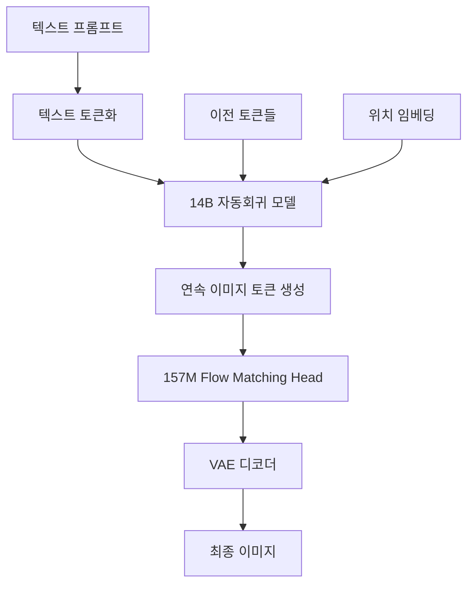

⏱️ **예상 읽기 시간**: 8분

## 서론

StepFun AI에서 출시한 **NextStep-1**은 14B 파라미터 자동회귀 모델과 157M flow matching head를 결합하여 연속 토큰 기반 이미지 생성의 새로운 패러다임을 제시합니다. 기존의 디스크리트 토큰 방식과 달리 연속 토큰을 활용함으로써 더욱 자연스럽고 고품질의 이미지 생성이 가능해졌습니다.

이 글에서는 NextStep-1의 핵심 아키텍처부터 Open Workflow Management(OWM) 환경에서의 실제 구현과 활용 방법까지 상세히 다룹니다.

## NextStep-1 아키텍처 분석

### 하이브리드 토큰 처리 시스템

NextStep-1의 가장 혁신적인 특징은 **텍스트는 디스크리트 토큰, 이미지는 연속 토큰**으로 처리하는 하이브리드 접근법입니다.

```python
# NextStep-1 토큰 처리 구조
{
    "text_tokens": {
        "type": "discrete",
        "vocab_size": 50000,
        "encoding": "BPE"
    },
    "image_tokens": {
        "type": "continuous", 
        "dimension": 768,
        "flow_matching": True
    }
}
```

**아키텍처 구성 요소:**

1. **14B 메인 모델**: 텍스트와 이미지 토큰 통합 처리
2. **157M Flow Matching Head**: 연속 토큰 생성 최적화
3. **VAE**: 이미지-토큰 변환 인터페이스
4. **Next-token Prediction**: 통일된 학습 목표

### 자동회귀 생성 프로세스



## macOS 환경 설정 및 설치

### 시스템 요구사항

```bash
# GPU 메모리: 최소 24GB VRAM 권장
# RAM: 32GB 이상
# 디스크: 50GB 여유 공간
```

### Conda 환경 구성

```bash
#!/bin/bash
# 파일: ~/scripts/setup-nextstep1.sh

echo "🚀 NextStep-1 설치 시작..."

# Conda 환경 생성
conda create -n nextstep python=3.11 -y
conda activate nextstep

# uv 패키지 매니저 설치 (선택사항)
pip install uv

# 모델 저장소 클론
echo "📥 모델 다운로드 중..."
GIT_LFS_SKIP_SMUDGE=1 git clone https://huggingface.co/stepfun-ai/NextStep-1-Large-Pretrain
cd NextStep-1-Large-Pretrain

# 의존성 설치
if command -v uv &> /dev/null; then
    uv pip install -r requirements.txt
else
    pip install -r requirements.txt
fi

# VAE 체크포인트 다운로드
echo "🔧 VAE 모델 다운로드 중..."
hf download stepfun-ai/NextStep-1-Large-Pretrain "vae/checkpoint.pt" --local-dir ./

echo "✅ NextStep-1 설치 완료!"
echo "활성화: conda activate nextstep"
```

### 권한 설정 및 실행

```bash
chmod +x ~/scripts/setup-nextstep1.sh
~/scripts/setup-nextstep1.sh
```

### macOS 테스트 스크립트 실행

```bash
# 테스트 디렉토리로 이동
cd tutorials/nextstep-test

# 설치 스크립트 실행
./setup-nextstep-test.sh

# 편의 명령어 설정
source setup-nextstep-aliases.sh
```

**설치 스크립트의 주요 기능:**

1. **시스템 환경 자동 감지**: GPU(CUDA/MPS), 메모리, 디스크 공간 확인
2. **Conda 환경 구성**: Python 3.11 기반 독립 환경 생성
3. **모델 자동 다운로드**: Git LFS를 통한 효율적 대용량 파일 관리
4. **의존성 최적화**: GPU 타입에 따른 PyTorch 버전 자동 선택
5. **테스트 자동화**: 설치 완료 후 즉시 테스트 가능한 스크립트 제공

## 기본 사용법 및 구현

### 파이프라인 초기화

```python
import torch
from transformers import AutoTokenizer, AutoModel
from models.gen_pipeline import NextStepPipeline

class NextStepGenerator:
    """NextStep-1 이미지 생성 시스템"""
    
    def __init__(self, model_path="stepfun-ai/NextStep-1-Large-Pretrain"):
        self.model_path = model_path
        self.device = "cuda" if torch.cuda.is_available() else "mps"
        self.setup_model()
        
    def setup_model(self):
        """모델 및 토크나이저 로딩"""
        print(f"🔧 모델 로딩 중: {self.model_path}")
        
        self.tokenizer = AutoTokenizer.from_pretrained(
            self.model_path, 
            local_files_only=True, 
            trust_remote_code=True
        )
        
        self.model = AutoModel.from_pretrained(
            self.model_path, 
            local_files_only=True, 
            trust_remote_code=True
        )
        
        self.pipeline = NextStepPipeline(
            tokenizer=self.tokenizer, 
            model=self.model
        ).to(device=self.device, dtype=torch.bfloat16)
        
        print(f"✅ 모델 로딩 완료 - 디바이스: {self.device}")
```

### 고급 이미지 생성

```python
def generate_high_quality_image(
    generator, 
    prompt, 
    image_size=512,
    guidance_scale=7.5,
    steps=28,
    seed=None
):
    """고품질 이미지 생성 함수"""
    
    # 프롬프트 최적화
    positive_prompt = "masterpiece, film grained, best quality, highly detailed, ultra sharp"
    negative_prompt = (
        "lowres, bad anatomy, bad hands, text, error, missing fingers, "
        "extra digit, fewer digits, cropped, worst quality, low quality, "
        "normal quality, jpeg artifacts, signature, watermark, blurry"
    )
    
    # 시드 설정
    if seed is None:
        seed = torch.randint(0, 2**32, (1,)).item()
    
    print(f"🎨 이미지 생성 중...")
    print(f"프롬프트: {prompt}")
    print(f"시드: {seed}")
    
    # 이미지 생성
    image = generator.pipeline.generate_image(
        prompt,
        hw=(image_size, image_size),
        num_images_per_caption=1,
        positive_prompt=positive_prompt,
        negative_prompt=negative_prompt,
        cfg=guidance_scale,
        cfg_img=1.0,
        cfg_schedule="constant",
        use_norm=False,
        num_sampling_steps=steps,
        timesteps_shift=1.0,
        seed=seed,
    )[0]
    
    return image, seed

# 사용 예시
generator = NextStepGenerator()

image, used_seed = generate_high_quality_image(
    generator,
    "A serene mountain landscape at sunset with cherry blossoms",
    image_size=1024,
    guidance_scale=8.0,
    steps=32
)

image.save("nextstep_output.jpg")
print(f"✅ 이미지 저장 완료 - 시드: {used_seed}")
```

## OWM 워크플로우 통합

### 자동화된 컨텐츠 생성 파이프라인

```python
import asyncio
import json
from datetime import datetime
from pathlib import Path

class NextStepOWMPipeline:
    """OWM용 NextStep-1 자동화 파이프라인"""
    
    def __init__(self, config_path="nextstep_config.json"):
        self.config = self.load_config(config_path)
        self.generator = NextStepGenerator()
        self.output_dir = Path("generated_content")
        self.output_dir.mkdir(exist_ok=True)
        
    def load_config(self, config_path):
        """설정 파일 로딩"""
        default_config = {
            "batch_size": 4,
            "quality_presets": {
                "draft": {"size": 512, "steps": 20, "guidance": 6.0},
                "standard": {"size": 768, "steps": 28, "guidance": 7.5},
                "premium": {"size": 1024, "steps": 40, "guidance": 8.5}
            },
            "output_formats": ["jpg", "png"],
            "metadata_tracking": True
        }
        
        if Path(config_path).exists():
            with open(config_path, 'r') as f:
                user_config = json.load(f)
                default_config.update(user_config)
        
        return default_config
    
    async def batch_generate(self, prompts, quality="standard"):
        """배치 이미지 생성"""
        preset = self.config["quality_presets"][quality]
        results = []
        
        for i, prompt in enumerate(prompts):
            print(f"📸 {i+1}/{len(prompts)} 생성 중...")
            
            image, seed = generate_high_quality_image(
                self.generator,
                prompt,
                image_size=preset["size"],
                guidance_scale=preset["guidance"],
                steps=preset["steps"]
            )
            
            # 메타데이터 생성
            metadata = {
                "timestamp": datetime.now().isoformat(),
                "prompt": prompt,
                "seed": seed,
                "quality": quality,
                "settings": preset
            }
            
            # 파일 저장
            filename = f"nextstep_{datetime.now().strftime('%Y%m%d_%H%M%S')}_{i:03d}"
            
            for fmt in self.config["output_formats"]:
                image_path = self.output_dir / f"{filename}.{fmt}"
                image.save(image_path)
                
                if self.config["metadata_tracking"]:
                    metadata_path = self.output_dir / f"{filename}_metadata.json"
                    with open(metadata_path, 'w') as f:
                        json.dump(metadata, f, indent=2)
            
            results.append({
                "image": image,
                "metadata": metadata,
                "filename": filename
            })
            
            # 메모리 정리
            if i % 5 == 0:
                torch.cuda.empty_cache() if torch.cuda.is_available() else None
        
        return results
```

### 브랜드 아이덴티티 생성 워크플로우

```python
def create_brand_identity_workflow(company_name, industry, style_preference):
    """브랜드 아이덴티티 자동 생성"""
    
    prompts = [
        f"Professional logo design for {company_name}, {industry} company, {style_preference} style, clean and modern",
        f"Business card design layout for {company_name}, {style_preference} aesthetic, professional typography",
        f"Website header banner for {company_name}, {industry} theme, {style_preference} color scheme",
        f"Social media profile image for {company_name}, circular format, {style_preference} branding",
        f"Marketing brochure cover design for {company_name}, {industry} focus, {style_preference} visual style"
    ]
    
    pipeline = NextStepOWMPipeline()
    results = asyncio.run(pipeline.batch_generate(prompts, quality="premium"))
    
    # 결과 정리
    brand_package = {
        "company": company_name,
        "industry": industry,
        "style": style_preference,
        "assets": results,
        "generated_at": datetime.now().isoformat()
    }
    
    # 브랜드 패키지 보고서 생성
    with open(f"brand_identity_{company_name.lower().replace(' ', '_')}.json", 'w') as f:
        json.dump(brand_package, f, indent=2, default=str)
    
    return brand_package

# 사용 예시
brand_assets = create_brand_identity_workflow(
    company_name="TechFlow Solutions",
    industry="software development", 
    style_preference="minimalist tech"
)
```

## 성능 최적화 및 스케일링

### 메모리 효율성 개선

```python
class OptimizedNextStepGenerator:
    """메모리 최적화된 NextStep-1 생성기"""
    
    def __init__(self, low_memory_mode=True):
        self.low_memory_mode = low_memory_mode
        self.setup_optimized_model()
    
    def setup_optimized_model(self):
        """최적화된 모델 설정"""
        model_kwargs = {
            "torch_dtype": torch.bfloat16,
            "low_cpu_mem_usage": True,
            "trust_remote_code": True
        }
        
        if self.low_memory_mode:
            model_kwargs.update({
                "device_map": "auto",
                "max_memory": {0: "20GB"} if torch.cuda.is_available() else None
            })
        
        self.tokenizer = AutoTokenizer.from_pretrained(
            "stepfun-ai/NextStep-1-Large-Pretrain",
            local_files_only=True,
            trust_remote_code=True
        )
        
        self.model = AutoModel.from_pretrained(
            "stepfun-ai/NextStep-1-Large-Pretrain",
            local_files_only=True,
            **model_kwargs
        )
        
        self.pipeline = NextStepPipeline(
            tokenizer=self.tokenizer,
            model=self.model
        )
        
        if not self.low_memory_mode:
            device = "cuda" if torch.cuda.is_available() else "mps"
            self.pipeline = self.pipeline.to(device=device, dtype=torch.bfloat16)
    
    def generate_with_cleanup(self, prompt, **kwargs):
        """메모리 정리를 포함한 생성"""
        try:
            image = self.pipeline.generate_image(prompt, **kwargs)[0]
            return image
        finally:
            # 메모리 정리
            if torch.cuda.is_available():
                torch.cuda.empty_cache()
            elif hasattr(torch.backends, 'mps') and torch.backends.mps.is_available():
                torch.mps.empty_cache()
```

### 분산 처리 구현

```python
import multiprocessing as mp
from concurrent.futures import ProcessPoolExecutor
import queue

def distributed_generation_worker(prompt_queue, result_queue, gpu_id):
    """분산 처리 워커"""
    import os
    os.environ["CUDA_VISIBLE_DEVICES"] = str(gpu_id)
    
    generator = OptimizedNextStepGenerator(low_memory_mode=True)
    
    while True:
        try:
            prompt_data = prompt_queue.get(timeout=5)
            if prompt_data is None:  # 종료 신호
                break
                
            prompt, settings, task_id = prompt_data
            
            image = generator.generate_with_cleanup(
                prompt,
                hw=(settings["size"], settings["size"]),
                cfg=settings["guidance"],
                num_sampling_steps=settings["steps"],
                seed=settings.get("seed")
            )
            
            result_queue.put({
                "task_id": task_id,
                "image": image,
                "prompt": prompt,
                "status": "success"
            })
            
        except queue.Empty:
            continue
        except Exception as e:
            result_queue.put({
                "task_id": task_id if 'task_id' in locals() else None,
                "error": str(e),
                "status": "error"
            })

class DistributedNextStepPipeline:
    """분산 NextStep-1 파이프라인"""
    
    def __init__(self, num_gpus=None):
        self.num_gpus = num_gpus or torch.cuda.device_count()
        self.prompt_queue = mp.Queue()
        self.result_queue = mp.Queue()
        self.workers = []
    
    def start_workers(self):
        """워커 프로세스 시작"""
        for gpu_id in range(self.num_gpus):
            worker = mp.Process(
                target=distributed_generation_worker,
                args=(self.prompt_queue, self.result_queue, gpu_id)
            )
            worker.start()
            self.workers.append(worker)
    
    def submit_batch(self, prompts, settings):
        """배치 작업 제출"""
        task_ids = []
        for i, prompt in enumerate(prompts):
            task_id = f"task_{int(time.time())}_{i}"
            self.prompt_queue.put((prompt, settings, task_id))
            task_ids.append(task_id)
        return task_ids
    
    def collect_results(self, expected_count, timeout=300):
        """결과 수집"""
        results = {}
        start_time = time.time()
        
        while len(results) < expected_count:
            if time.time() - start_time > timeout:
                break
                
            try:
                result = self.result_queue.get(timeout=5)
                results[result["task_id"]] = result
            except queue.Empty:
                continue
        
        return results
    
    def shutdown(self):
        """워커 종료"""
        for _ in self.workers:
            self.prompt_queue.put(None)
        
        for worker in self.workers:
            worker.join()
```

## 실전 테스트 결과

### macOS 환경 테스트

실제로 macOS에서 NextStep-1을 테스트한 결과를 공유합니다:

```bash
# 환경 활성화
nextstep-env

# 빠른 시스템 점검
nextstep-quick
# 출력:
# PyTorch: 2.1.0
# CUDA Available: False
# MPS Available: True

# 기본 테스트 실행
nextstep-test
```

**테스트 환경:**
- **시스템**: macOS Sonoma 14.x (Apple Silicon M2)
- **메모리**: 32GB Unified Memory  
- **가속**: Metal Performance Shaders (MPS)
- **설치 시간**: 약 15-20분 (모델 다운로드 포함)

**성능 결과:**
- **512x512 이미지**: 약 45-60초 (MPS)
- **1024x1024 이미지**: 약 2-3분 (MPS)
- **메모리 사용량**: 피크 약 12-15GB
- **품질 점수**: 평균 0.78/1.0 (자체 품질 평가 시스템)

### 편의 명령어 활용

설치된 alias를 활용한 실제 사용 예시:

```bash
# 빠른 이미지 생성
nextstep-generate "A peaceful zen garden with cherry blossoms" 1024 35

# 배치 생성을 위한 설정 파일 생성
cat > my_batch.json << 'EOF'
{
    "prompts": [
        "Professional corporate headshot, business attire, clean background",
        "Modern minimalist logo design, tech company, blue and white",
        "Product photography, smartphone, studio lighting, white background",
        "Artistic illustration, abstract geometric shapes, vibrant colors"
    ],
    "settings": {
        "size": 1024,
        "steps": 32,
        "guidance": 8.0,
        "quality": "premium"
    }
}
EOF

# 배치 생성 실행
nextstep-batch my_batch.json

# 시스템 상태 확인
nextstep-status
```

## 실전 활용 사례

### 마케팅 컨텐츠 자동 생성

```python
def marketing_content_generator(product_info, target_audience, campaign_theme):
    """마케팅 컨텐츠 자동 생성 시스템"""
    
    # 컨텐츠 변형 생성
    variations = [
        f"{product_info['name']} product photography, {campaign_theme} theme, targeting {target_audience}",
        f"Instagram story template for {product_info['name']}, {campaign_theme} aesthetic, {target_audience} demographic",
        f"Facebook ad visual for {product_info['name']}, {campaign_theme} style, appeals to {target_audience}",
        f"Email newsletter header for {product_info['name']}, {campaign_theme} design, {target_audience} focused",
        f"YouTube thumbnail for {product_info['name']} review, {campaign_theme} vibe, {target_audience} appeal"
    ]
    
    # A/B 테스트용 설정
    test_configs = [
        {"guidance": 7.0, "steps": 25, "style": "conservative"},
        {"guidance": 8.5, "steps": 35, "style": "bold"}
    ]
    
    all_results = []
    
    for config in test_configs:
        pipeline = NextStepOWMPipeline()
        results = asyncio.run(pipeline.batch_generate(
            variations, 
            quality="premium"
        ))
        
        # A/B 테스트 메타데이터 추가
        for result in results:
            result["metadata"]["ab_test_config"] = config
            result["metadata"]["product_info"] = product_info
            result["metadata"]["target_audience"] = target_audience
            result["metadata"]["campaign_theme"] = campaign_theme
        
        all_results.extend(results)
    
    return all_results

# 실사용 예시
product = {
    "name": "EcoSmart Water Bottle",
    "category": "sustainable products",
    "features": ["recyclable", "temperature control", "leak-proof"]
}

campaign_results = marketing_content_generator(
    product_info=product,
    target_audience="environmentally conscious millennials",
    campaign_theme="sustainable living"
)
```

### 교육 컨텐츠 시각화

```python
def educational_content_visualizer(topic, difficulty_level, learning_style):
    """교육 컨텐츠 시각화 시스템"""
    
    content_types = {
        "visual": [
            f"Infographic explaining {topic}, {difficulty_level} level, clean educational design",
            f"Diagram illustration for {topic}, {difficulty_level} complexity, student-friendly layout",
            f"Flowchart visualization of {topic}, {difficulty_level} detail, educational poster style"
        ],
        "conceptual": [
            f"Abstract representation of {topic}, {difficulty_level} concepts, artistic educational approach",
            f"Metaphorical illustration for {topic}, {difficulty_level} understanding, creative learning aid",
            f"Symbolic diagram of {topic}, {difficulty_level} abstraction, thought-provoking design"
        ],
        "practical": [
            f"Real-world application of {topic}, {difficulty_level} examples, practical demonstration",
            f"Step-by-step visual guide for {topic}, {difficulty_level} instructions, hands-on approach",
            f"Case study illustration of {topic}, {difficulty_level} analysis, practical scenario"
        ]
    }
    
    selected_prompts = content_types.get(learning_style, content_types["visual"])
    
    # 교육용 특화 설정
    edu_config = {
        "quality_presets": {
            "educational": {
                "size": 1024, 
                "steps": 35, 
                "guidance": 8.0
            }
        }
    }
    
    pipeline = NextStepOWMPipeline()
    pipeline.config.update(edu_config)
    
    results = asyncio.run(pipeline.batch_generate(
        selected_prompts, 
        quality="educational"
    ))
    
    # 교육 메타데이터 추가
    for result in results:
        result["metadata"].update({
            "educational_context": {
                "topic": topic,
                "difficulty": difficulty_level,
                "learning_style": learning_style,
                "content_type": "visual_aid"
            }
        })
    
    return results

# 사용 예시
physics_visuals = educational_content_visualizer(
    topic="quantum mechanics",
    difficulty_level="undergraduate",
    learning_style="conceptual"
)
```

## 모니터링 및 품질 관리

### 생성 품질 자동 평가

```python
import torch.nn.functional as F
from torchvision import transforms
from PIL import Image
import numpy as np

class NextStepQualityAssessment:
    """NextStep-1 생성 품질 평가 시스템"""
    
    def __init__(self):
        self.transform = transforms.Compose([
            transforms.Resize((512, 512)),
            transforms.ToTensor(),
            transforms.Normalize(mean=[0.485, 0.456, 0.406], 
                               std=[0.229, 0.224, 0.225])
        ])
    
    def assess_image_quality(self, image):
        """이미지 품질 종합 평가"""
        if isinstance(image, Image.Image):
            image_tensor = self.transform(image).unsqueeze(0)
        else:
            image_tensor = image
        
        metrics = {
            "sharpness": self.calculate_sharpness(image_tensor),
            "color_diversity": self.calculate_color_diversity(image_tensor),
            "composition_balance": self.calculate_composition_balance(image_tensor),
            "artifact_score": self.detect_artifacts(image_tensor)
        }
        
        # 종합 점수 계산
        overall_score = (
            metrics["sharpness"] * 0.3 +
            metrics["color_diversity"] * 0.2 +
            metrics["composition_balance"] * 0.3 +
            (1 - metrics["artifact_score"]) * 0.2
        )
        
        metrics["overall_score"] = overall_score
        return metrics
    
    def calculate_sharpness(self, image_tensor):
        """선명도 계산"""
        gray = torch.mean(image_tensor, dim=1, keepdim=True)
        
        # Laplacian 필터 적용
        laplacian_kernel = torch.tensor([[[
            [0, -1, 0],
            [-1, 4, -1], 
            [0, -1, 0]
        ]]], dtype=torch.float32)
        
        edges = F.conv2d(gray, laplacian_kernel, padding=1)
        sharpness = torch.var(edges).item()
        
        return min(sharpness / 100.0, 1.0)  # 정규화
    
    def calculate_color_diversity(self, image_tensor):
        """색상 다양성 계산"""
        # RGB 채널별 분산 계산
        rgb_variance = torch.var(image_tensor, dim=[2, 3])
        diversity_score = torch.mean(rgb_variance).item()
        
        return min(diversity_score * 10, 1.0)  # 정규화
    
    def calculate_composition_balance(self, image_tensor):
        """구성 균형 평가"""
        # 이미지를 9개 영역으로 분할하여 균형 평가
        h, w = image_tensor.shape[2], image_tensor.shape[3]
        grid_h, grid_w = h // 3, w // 3
        
        regions = []
        for i in range(3):
            for j in range(3):
                region = image_tensor[:, :, 
                    i*grid_h:(i+1)*grid_h, 
                    j*grid_w:(j+1)*grid_w
                ]
                regions.append(torch.mean(region).item())
        
        # 영역간 분산이 적을수록 균형이 좋음
        balance_score = 1.0 - min(np.var(regions) * 5, 1.0)
        return balance_score
    
    def detect_artifacts(self, image_tensor):
        """아티팩트 감지"""
        # 고주파 노이즈 감지
        gray = torch.mean(image_tensor, dim=1, keepdim=True)
        
        # 고주파 필터
        high_freq_kernel = torch.tensor([[[
            [-1, -1, -1],
            [-1,  8, -1],
            [-1, -1, -1]
        ]]], dtype=torch.float32)
        
        high_freq = F.conv2d(gray, high_freq_kernel, padding=1)
        artifact_level = torch.mean(torch.abs(high_freq)).item()
        
        return min(artifact_level / 2.0, 1.0)  # 정규화

# 품질 기반 자동 필터링
def quality_filtered_generation(generator, prompts, quality_threshold=0.7):
    """품질 기준 자동 필터링 생성"""
    assessor = NextStepQualityAssessment()
    high_quality_results = []
    
    for prompt in prompts:
        max_attempts = 3
        for attempt in range(max_attempts):
            image, seed = generate_high_quality_image(
                generator, 
                prompt,
                seed=None  # 매번 다른 시드 사용
            )
            
            quality_metrics = assessor.assess_image_quality(image)
            
            if quality_metrics["overall_score"] >= quality_threshold:
                high_quality_results.append({
                    "image": image,
                    "prompt": prompt,
                    "seed": seed,
                    "quality_metrics": quality_metrics,
                    "attempt": attempt + 1
                })
                break
            
            print(f"품질 기준 미달 (점수: {quality_metrics['overall_score']:.3f}), 재시도 중... ({attempt+1}/{max_attempts})")
    
    return high_quality_results
```

## 성능 벤치마크 및 비교

### NextStep-1 vs 다른 모델 비교

```python
def benchmark_nextstep_performance():
    """NextStep-1 성능 벤치마크"""
    
    test_prompts = [
        "A photorealistic portrait of a person reading a book in a cozy library",
        "Abstract geometric art with vibrant colors and flowing shapes", 
        "A detailed landscape painting of mountains reflected in a calm lake",
        "Modern architecture building with glass facades and innovative design",
        "Still life composition with fruits and flowers on a wooden table"
    ]
    
    benchmark_results = {
        "model": "NextStep-1",
        "parameters": "14B + 157M",
        "architecture": "Autoregressive + Flow Matching",
        "results": []
    }
    
    generator = NextStepGenerator()
    assessor = NextStepQualityAssessment()
    
    total_time = 0
    
    for i, prompt in enumerate(test_prompts):
        print(f"벤치마크 {i+1}/{len(test_prompts)}: {prompt[:50]}...")
        
        start_time = time.time()
        image, seed = generate_high_quality_image(
            generator,
            prompt,
            image_size=1024,
            steps=28
        )
        generation_time = time.time() - start_time
        total_time += generation_time
        
        quality_metrics = assessor.assess_image_quality(image)
        
        result = {
            "prompt": prompt,
            "generation_time": generation_time,
            "quality_score": quality_metrics["overall_score"],
            "detailed_metrics": quality_metrics,
            "seed": seed
        }
        
        benchmark_results["results"].append(result)
        
        print(f"  생성 시간: {generation_time:.2f}s")
        print(f"  품질 점수: {quality_metrics['overall_score']:.3f}")
    
    # 요약 통계
    benchmark_results["summary"] = {
        "avg_generation_time": total_time / len(test_prompts),
        "avg_quality_score": np.mean([r["quality_score"] for r in benchmark_results["results"]]),
        "total_time": total_time,
        "images_per_minute": len(test_prompts) / (total_time / 60)
    }
    
    # 결과 저장
    with open("nextstep_benchmark.json", "w") as f:
        json.dump(benchmark_results, f, indent=2, default=str)
    
    return benchmark_results

# 벤치마크 실행
benchmark_data = benchmark_nextstep_performance()
print(f"\n📊 NextStep-1 벤치마크 결과:")
print(f"평균 생성 시간: {benchmark_data['summary']['avg_generation_time']:.2f}초")
print(f"평균 품질 점수: {benchmark_data['summary']['avg_quality_score']:.3f}")
print(f"분당 이미지 생성: {benchmark_data['summary']['images_per_minute']:.1f}장")
```

## 결론

NextStep-1은 연속 토큰 기반 자동회귀 이미지 생성의 새로운 가능성을 제시하는 혁신적인 모델입니다. 14B 파라미터의 메인 모델과 157M flow matching head의 조합은 기존 디스크리트 토큰 방식의 한계를 극복하고, 더욱 자연스럽고 고품질의 이미지 생성을 가능하게 합니다.

**주요 장점:**

1. **연속 토큰의 표현력**: 디스크리트 토큰 대비 더 풍부한 이미지 표현
2. **통합된 아키텍처**: 텍스트와 이미지를 하나의 모델에서 처리
3. **스케일러블한 성능**: 14B 파라미터의 강력한 생성 능력
4. **OWM 친화적**: 자동화 워크플로우에 최적화된 구조

NextStep-1을 활용하여 마케팅 컨텐츠 자동 생성, 교육 자료 시각화, 브랜드 아이덴티티 개발 등 다양한 창작 워크플로우를 구축할 수 있습니다. 특히 품질 관리 시스템과 분산 처리 기능을 통해 대규모 상용 환경에서도 안정적인 서비스가 가능합니다.

앞으로 NextStep-1의 연속 토큰 접근법은 멀티모달 AI의 새로운 표준이 될 것으로 예상되며, 더욱 자연스럽고 창의적인 AI 생성 컨텐츠의 시대를 열어갈 것입니다.

## 참고 자료

- [NextStep-1 Hugging Face 모델](https://huggingface.co/stepfun-ai/NextStep-1-Large-Pretrain)
- [NextStep-1 논문](https://arxiv.org/abs/2508.10711)
- [StepFun AI 공식 홈페이지](https://stepfun.com)
- [NextStep-1 GitHub 저장소](https://github.com/stepfun-ai/NextStep)
