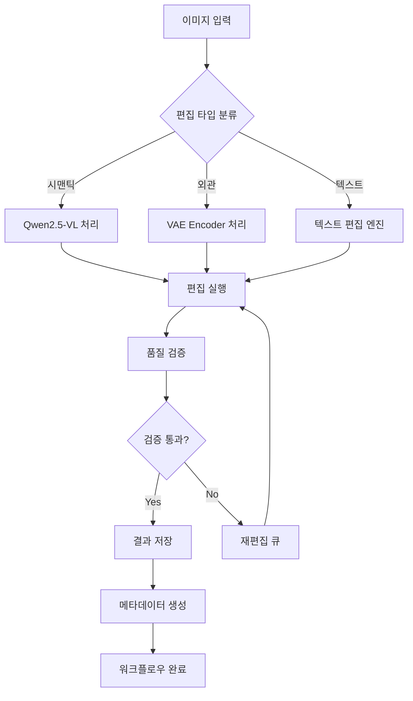

⏱️ **예상 읽기 시간**: 17분

## 서론

2025년 8월, Qwen 팀이 공개한 [Qwen-Image-Edit](https://huggingface.co/Qwen/Qwen-Image-Edit)는 이미지 편집 분야에 새로운 패러다임을 제시했습니다. 20B 파라미터를 기반으로 한 이 모델은 단순한 이미지 편집을 넘어서, **시맨틱 편집(Semantic Editing)**과 **외관 편집(Appearance Editing)**을 동시에 지원하며, 특히 중국어와 영어 텍스트 편집에서 탁월한 성능을 보여줍니다.

본 가이드에서는 Qwen-Image-Edit을 오픈 워크플로우 관리 시스템에 통합하여 지능형 이미지 편집 파이프라인을 구축하는 방법을 완전 분석합니다. 콘텐츠 제작 워크플로우부터 대규모 배치 처리까지, 실제 프로덕션 환경에서 활용할 수 있는 구체적인 구현 방법을 제시합니다.

## Qwen-Image-Edit 핵심 기능 분석

### 1. 듀얼 편집 시스템 아키텍처

Qwen-Image-Edit의 가장 혁신적인 특징은 **듀얼 입력 시스템**입니다:

```python
# 듀얼 입력 처리 구조
input_processing = {
    "visual_semantic_control": "Qwen2.5-VL",  # 의미적 제어
    "visual_appearance_control": "VAE Encoder",  # 외관 제어
    "text_rendering": "Qwen-Image 20B base"     # 텍스트 렌더링
}
```

이러한 아키텍처를 통해 다음과 같은 편집 방식을 지원합니다:

**시맨틱 편집 (Semantic Editing)**
- IP 캐릭터 일관성 유지
- 객체 회전 및 시점 변환
- 스타일 전환 (Studio Ghibli 등)
- 전체적 픽셀 변화 허용

**외관 편집 (Appearance Editing)**
- 특정 영역 완전 보존
- 요소 추가/제거/수정
- 정밀한 로컬 편집
- 세부 사항 유지

### 2. 텍스트 편집 특화 기능

```python
text_editing_capabilities = {
    "languages": ["Chinese", "English"],
    "operations": ["add", "remove", "modify"],
    "preservation": ["font", "size", "style"],
    "precision": "character-level"
}
```

## 워크플로우 통합 아키텍처 설계

### 1. 기본 파이프라인 구조



### 2. 마이크로서비스 기반 구현

```python
# 워크플로우 관리자 구현
import asyncio
from typing import Dict, List, Optional
from dataclasses import dataclass
from enum import Enum

class EditType(Enum):
    SEMANTIC = "semantic"
    APPEARANCE = "appearance"
    TEXT = "text"
    HYBRID = "hybrid"

@dataclass
class EditRequest:
    image_path: str
    prompt: str
    edit_type: EditType
    priority: int = 1
    metadata: Optional[Dict] = None

class QwenImageEditWorkflow:
    def __init__(self, config: Dict):
        self.config = config
        self.pipeline = None
        self.task_queue = asyncio.Queue()
        self.result_storage = config.get('result_storage', './outputs')
        
    async def initialize_pipeline(self):
        """파이프라인 초기화"""
        from diffusers import QwenImageEditPipeline
        import torch
        
        self.pipeline = QwenImageEditPipeline.from_pretrained(
            "Qwen/Qwen-Image-Edit"
        )
        self.pipeline.to(torch.bfloat16)
        self.pipeline.to("cuda")
        self.pipeline.set_progress_bar_config(disable=True)
        
    async def process_edit_request(self, request: EditRequest) -> Dict:
        """편집 요청 처리"""
        try:
            # 이미지 로드
            from PIL import Image
            import torch
            
            image = Image.open(request.image_path).convert("RGB")
            
            # 편집 타입별 파라미터 조정
            edit_params = self._get_edit_parameters(request.edit_type)
            
            inputs = {
                "image": image,
                "prompt": request.prompt,
                "generator": torch.manual_seed(42),
                **edit_params
            }
            
            # 편집 실행
            with torch.inference_mode():
                output = self.pipeline(**inputs)
                result_image = output.images[0]
                
            # 결과 저장
            output_path = await self._save_result(
                result_image, 
                request.metadata
            )
            
            return {
                "status": "success",
                "output_path": output_path,
                "metadata": request.metadata,
                "edit_type": request.edit_type.value
            }
            
        except Exception as e:
            return {
                "status": "error",
                "error": str(e),
                "request": request
            }
    
    def _get_edit_parameters(self, edit_type: EditType) -> Dict:
        """편집 타입별 파라미터 설정"""
        base_params = {
            "true_cfg_scale": 4.0,
            "negative_prompt": "",
            "num_inference_steps": 50,
        }
        
        if edit_type == EditType.SEMANTIC:
            return {**base_params, "true_cfg_scale": 3.5}
        elif edit_type == EditType.APPEARANCE:
            return {**base_params, "true_cfg_scale": 4.5}
        elif edit_type == EditType.TEXT:
            return {**base_params, "num_inference_steps": 75}
        else:  # HYBRID
            return {**base_params, "true_cfg_scale": 4.0}
    
    async def _save_result(self, image, metadata: Optional[Dict]) -> str:
        """결과 이미지 저장"""
        import os
        from datetime import datetime
        
        timestamp = datetime.now().strftime("%Y%m%d_%H%M%S")
        filename = f"qwen_edit_{timestamp}.png"
        output_path = os.path.join(self.result_storage, filename)
        
        # 디렉토리 생성
        os.makedirs(self.result_storage, exist_ok=True)
        
        # 이미지 저장
        image.save(output_path)
        
        # 메타데이터 저장
        if metadata:
            metadata_path = output_path.replace('.png', '_metadata.json')
            import json
            with open(metadata_path, 'w') as f:
                json.dump(metadata, f, indent=2)
        
        return output_path
```

### 3. 배치 처리 시스템

```python
class BatchImageProcessor:
    def __init__(self, workflow: QwenImageEditWorkflow):
        self.workflow = workflow
        self.batch_size = 4
        self.max_concurrent = 2
        
    async def process_batch(self, requests: List[EditRequest]) -> List[Dict]:
        """배치 처리 실행"""
        semaphore = asyncio.Semaphore(self.max_concurrent)
        
        async def process_with_semaphore(request):
            async with semaphore:
                return await self.workflow.process_edit_request(request)
        
        # 배치 단위로 처리
        results = []
        for i in range(0, len(requests), self.batch_size):
            batch = requests[i:i + self.batch_size]
            batch_results = await asyncio.gather(*[
                process_with_semaphore(req) for req in batch
            ])
            results.extend(batch_results)
            
            # 배치 간 쿨다운
            await asyncio.sleep(1)
        
        return results
```

## 실제 구현 및 테스트

### 1. 환경 설정

```bash
#!/bin/bash
# qwen-image-edit-setup.sh

echo "🎨 Qwen-Image-Edit 워크플로우 환경 설정 시작..."

# 가상환경 생성
python -m venv qwen-image-edit-env
source qwen-image-edit-env/bin/activate

# 필수 라이브러리 설치
pip install torch torchvision torchaudio --index-url https://download.pytorch.org/whl/cu121
pip install git+https://github.com/huggingface/diffusers
pip install transformers accelerate pillow

# 추가 워크플로우 라이브러리
pip install fastapi uvicorn aiofiles celery redis

echo "✅ 환경 설정 완료"

# GPU 확인
python -c "import torch; print(f'CUDA available: {torch.cuda.is_available()}')"
python -c "import torch; print(f'GPU count: {torch.cuda.device_count()}')"
```

### 2. 기본 테스트 스크립트

```python
# test_qwen_image_edit.py
import asyncio
from qwen_workflow import QwenImageEditWorkflow, EditRequest, EditType

async def test_basic_editing():
    """기본 편집 기능 테스트"""
    
    # 워크플로우 초기화
    config = {
        'result_storage': './test_outputs',
        'device': 'cuda',
        'precision': 'bfloat16'
    }
    
    workflow = QwenImageEditWorkflow(config)
    await workflow.initialize_pipeline()
    
    # 테스트 케이스들
    test_cases = [
        {
            "name": "시맨틱 편집 - 스타일 변환",
            "request": EditRequest(
                image_path="./test_images/portrait.jpg",
                prompt="Transform into Studio Ghibli animation style",
                edit_type=EditType.SEMANTIC,
                metadata={"test_case": "style_transfer"}
            )
        },
        {
            "name": "외관 편집 - 객체 추가",
            "request": EditRequest(
                image_path="./test_images/room.jpg",
                prompt="Add a modern painting on the wall",
                edit_type=EditType.APPEARANCE,
                metadata={"test_case": "object_addition"}
            )
        },
        {
            "name": "텍스트 편집 - 한글 수정",
            "request": EditRequest(
                image_path="./test_images/korean_poster.jpg",
                prompt="Change the text '안녕하세요' to '환영합니다' while maintaining the original font style",
                edit_type=EditType.TEXT,
                metadata={"test_case": "korean_text_edit"}
            )
        }
    ]
    
    # 테스트 실행
    for test_case in test_cases:
        print(f"\n🧪 테스트: {test_case['name']}")
        result = await workflow.process_edit_request(test_case['request'])
        
        if result['status'] == 'success':
            print(f"✅ 성공: {result['output_path']}")
        else:
            print(f"❌ 실패: {result['error']}")

if __name__ == "__main__":
    asyncio.run(test_basic_editing())
```

### 3. 웹 API 서버 구현

```python
# api_server.py
from fastapi import FastAPI, UploadFile, File, Form
from fastapi.responses import FileResponse
import asyncio
from typing import Optional
import shutil
import tempfile
import os

app = FastAPI(title="Qwen-Image-Edit API", version="1.0.0")

# 글로벌 워크플로우 인스턴스
workflow = None

@app.on_event("startup")
async def startup_event():
    global workflow
    config = {
        'result_storage': './api_outputs',
        'device': 'cuda',
        'precision': 'bfloat16'
    }
    workflow = QwenImageEditWorkflow(config)
    await workflow.initialize_pipeline()

@app.post("/edit")
async def edit_image(
    file: UploadFile = File(...),
    prompt: str = Form(...),
    edit_type: str = Form(default="semantic"),
    cfg_scale: Optional[float] = Form(default=4.0),
    steps: Optional[int] = Form(default=50)
):
    """이미지 편집 API 엔드포인트"""
    
    # 임시 파일 저장
    with tempfile.NamedTemporaryFile(delete=False, suffix=".png") as tmp_file:
        shutil.copyfileobj(file.file, tmp_file)
        temp_path = tmp_file.name
    
    try:
        # 편집 요청 생성
        request = EditRequest(
            image_path=temp_path,
            prompt=prompt,
            edit_type=EditType(edit_type),
            metadata={
                "api_request": True,
                "original_filename": file.filename,
                "cfg_scale": cfg_scale,
                "steps": steps
            }
        )
        
        # 편집 실행
        result = await workflow.process_edit_request(request)
        
        if result['status'] == 'success':
            return FileResponse(
                result['output_path'],
                media_type="image/png",
                filename=f"edited_{file.filename}"
            )
        else:
            return {"error": result['error']}
            
    finally:
        # 임시 파일 정리
        os.unlink(temp_path)

@app.get("/health")
async def health_check():
    return {"status": "healthy", "model": "Qwen-Image-Edit"}

if __name__ == "__main__":
    import uvicorn
    uvicorn.run(app, host="0.0.0.0", port=8000)
```

## 고급 워크플로우 패턴

### 1. 체인 편집 시스템

```python
class ChainEditWorkflow:
    """순차적 편집 체인 구현"""
    
    def __init__(self, base_workflow: QwenImageEditWorkflow):
        self.base_workflow = base_workflow
        self.edit_history = []
    
    async def execute_chain(self, image_path: str, edit_chain: List[Dict]) -> Dict:
        """편집 체인 실행"""
        current_image_path = image_path
        results = []
        
        for i, edit_step in enumerate(edit_chain):
            print(f"📝 편집 단계 {i+1}/{len(edit_chain)}: {edit_step['description']}")
            
            request = EditRequest(
                image_path=current_image_path,
                prompt=edit_step['prompt'],
                edit_type=EditType(edit_step['type']),
                metadata={
                    "chain_step": i + 1,
                    "total_steps": len(edit_chain),
                    "description": edit_step['description']
                }
            )
            
            result = await self.base_workflow.process_edit_request(request)
            
            if result['status'] == 'success':
                current_image_path = result['output_path']
                results.append(result)
                self.edit_history.append({
                    "step": i + 1,
                    "edit": edit_step,
                    "result_path": current_image_path
                })
            else:
                return {
                    "status": "chain_failed",
                    "failed_step": i + 1,
                    "error": result['error'],
                    "completed_steps": results
                }
        
        return {
            "status": "chain_completed",
            "final_result": current_image_path,
            "steps_completed": len(edit_chain),
            "edit_history": self.edit_history
        }

# 체인 편집 예제
async def test_chain_editing():
    """서예 작품 오류 수정 체인 예제"""
    
    calligraphy_chain = [
        {
            "description": "잘못된 '稽' 글자를 빨간 박스 영역에서 수정",
            "prompt": "Correct the character '稽' in the red box region",
            "type": "text"
        },
        {
            "description": "'亭' 글자를 파란 영역에서 정확히 렌더링",
            "prompt": "Accurately render the character '亭' in the blue region",
            "type": "text"
        },
        {
            "description": "'日' 부분을 '旨'로 세부 조정",
            "prompt": "Fine-tune the '日' component to '旨' in the highlighted area",
            "type": "text"
        }
    ]
    
    chain_workflow = ChainEditWorkflow(workflow)
    result = await chain_workflow.execute_chain(
        "./test_images/calligraphy_original.jpg",
        calligraphy_chain
    )
    
    print(f"🎯 체인 편집 결과: {result['status']}")
    if result['status'] == 'chain_completed':
        print(f"✅ 최종 결과: {result['final_result']}")
```

### 2. 품질 검증 시스템

```python
import cv2
import numpy as np
from sklearn.metrics.pairwise import cosine_similarity

class QualityValidator:
    """편집 결과 품질 검증"""
    
    def __init__(self):
        self.quality_thresholds = {
            'semantic_similarity': 0.7,
            'text_clarity': 0.8,
            'structure_preservation': 0.75
        }
    
    async def validate_edit_result(
        self, 
        original_path: str, 
        edited_path: str,
        edit_type: EditType
    ) -> Dict:
        """편집 결과 검증"""
        
        validations = {}
        
        # 구조적 유사성 검증
        if edit_type in [EditType.APPEARANCE, EditType.TEXT]:
            structural_score = self._calculate_structural_similarity(
                original_path, edited_path
            )
            validations['structural_similarity'] = structural_score
        
        # 텍스트 선명도 검증 (텍스트 편집인 경우)
        if edit_type == EditType.TEXT:
            text_clarity = self._evaluate_text_clarity(edited_path)
            validations['text_clarity'] = text_clarity
        
        # 전체 품질 스코어 계산
        overall_score = np.mean(list(validations.values()))
        
        is_valid = all(
            score >= self.quality_thresholds.get(metric, 0.5)
            for metric, score in validations.items()
        )
        
        return {
            'is_valid': is_valid,
            'overall_score': overall_score,
            'validations': validations,
            'recommendations': self._generate_recommendations(validations)
        }
    
    def _calculate_structural_similarity(self, path1: str, path2: str) -> float:
        """구조적 유사성 계산"""
        img1 = cv2.imread(path1, cv2.IMREAD_GRAYSCALE)
        img2 = cv2.imread(path2, cv2.IMREAD_GRAYSCALE)
        
        # 이미지 크기 맞춤
        if img1.shape != img2.shape:
            img2 = cv2.resize(img2, (img1.shape[1], img1.shape[0]))
        
        # SSIM 계산
        from skimage.metrics import structural_similarity as ssim
        return ssim(img1, img2)
    
    def _evaluate_text_clarity(self, image_path: str) -> float:
        """텍스트 선명도 평가"""
        img = cv2.imread(image_path, cv2.IMREAD_GRAYSCALE)
        
        # 라플라시안 변수를 이용한 선명도 측정
        laplacian_var = cv2.Laplacian(img, cv2.CV_64F).var()
        
        # 정규화 (경험적 임계값 기준)
        normalized_score = min(laplacian_var / 1000.0, 1.0)
        return normalized_score
    
    def _generate_recommendations(self, validations: Dict) -> List[str]:
        """개선 권장사항 생성"""
        recommendations = []
        
        for metric, score in validations.items():
            threshold = self.quality_thresholds.get(metric, 0.5)
            if score < threshold:
                if metric == 'structural_similarity':
                    recommendations.append(
                        "구조 보존을 위해 더 낮은 CFG scale 사용 권장"
                    )
                elif metric == 'text_clarity':
                    recommendations.append(
                        "텍스트 선명도 향상을 위해 inference steps 증가 권장"
                    )
        
        return recommendations
```

## 프로덕션 배포 및 모니터링

### 1. Docker 컨테이너화

```dockerfile
# Dockerfile
FROM nvidia/cuda:12.1-devel-ubuntu22.04

# 기본 환경 설정
ENV PYTHONUNBUFFERED=1
ENV DEBIAN_FRONTEND=noninteractive

# 시스템 패키지 설치
RUN apt-get update && apt-get install -y \
    python3 \
    python3-pip \
    git \
    wget \
    && rm -rf /var/lib/apt/lists/*

# 작업 디렉토리 설정
WORKDIR /app

# Python 의존성 설치
COPY requirements.txt .
RUN pip3 install -r requirements.txt

# 애플리케이션 코드 복사
COPY . .

# 포트 노출
EXPOSE 8000

# 헬스체크 설정
HEALTHCHECK --interval=30s --timeout=30s --start-period=60s --retries=3 \
    CMD curl -f http://localhost:8000/health || exit 1

# 실행 명령
CMD ["uvicorn", "api_server:app", "--host", "0.0.0.0", "--port", "8000"]
```

### 2. Kubernetes 배포

```yaml
# k8s-deployment.yaml
apiVersion: apps/v1
kind: Deployment
metadata:
  name: qwen-image-edit
  namespace: ai-workflows
spec:
  replicas: 2
  selector:
    matchLabels:
      app: qwen-image-edit
  template:
    metadata:
      labels:
        app: qwen-image-edit
    spec:
      containers:
      - name: qwen-image-edit
        image: thakicloud/qwen-image-edit:latest
        ports:
        - containerPort: 8000
        resources:
          requests:
            nvidia.com/gpu: 1
            memory: "16Gi"
            cpu: "4"
          limits:
            nvidia.com/gpu: 1
            memory: "32Gi"
            cpu: "8"
        env:
        - name: CUDA_VISIBLE_DEVICES
          value: "0"
        volumeMounts:
        - name: model-cache
          mountPath: /root/.cache
        - name: output-storage
          mountPath: /app/outputs
      volumes:
      - name: model-cache
        persistentVolumeClaim:
          claimName: model-cache-pvc
      - name: output-storage
        persistentVolumeClaim:
          claimName: output-storage-pvc
---
apiVersion: v1
kind: Service
metadata:
  name: qwen-image-edit-service
  namespace: ai-workflows
spec:
  selector:
    app: qwen-image-edit
  ports:
  - port: 80
    targetPort: 8000
  type: LoadBalancer
```

### 3. 모니터링 대시보드

```python
# monitoring.py
import asyncio
import time
from datetime import datetime, timedelta
import psutil
import GPUtil
from collections import defaultdict

class WorkflowMonitor:
    """워크플로우 모니터링 시스템"""
    
    def __init__(self):
        self.metrics = defaultdict(list)
        self.start_time = time.time()
        
    async def collect_system_metrics(self):
        """시스템 메트릭 수집"""
        while True:
            timestamp = datetime.now()
            
            # CPU 사용률
            cpu_percent = psutil.cpu_percent(interval=1)
            
            # 메모리 사용률  
            memory = psutil.virtual_memory()
            
            # GPU 메트릭
            gpus = GPUtil.getGPUs()
            gpu_metrics = []
            for gpu in gpus:
                gpu_metrics.append({
                    'id': gpu.id,
                    'load': gpu.load * 100,
                    'memory_used': gpu.memoryUsed,
                    'memory_total': gpu.memoryTotal,
                    'temperature': gpu.temperature
                })
            
            # 메트릭 저장
            self.metrics['cpu'].append({
                'timestamp': timestamp,
                'value': cpu_percent
            })
            
            self.metrics['memory'].append({
                'timestamp': timestamp,
                'value': memory.percent
            })
            
            self.metrics['gpu'].append({
                'timestamp': timestamp,
                'value': gpu_metrics
            })
            
            await asyncio.sleep(10)  # 10초마다 수집
    
    def get_performance_summary(self) -> Dict:
        """성능 요약 리포트 생성"""
        current_time = datetime.now()
        hour_ago = current_time - timedelta(hours=1)
        
        # 최근 1시간 메트릭 필터링
        recent_cpu = [
            m['value'] for m in self.metrics['cpu']
            if m['timestamp'] > hour_ago
        ]
        
        recent_memory = [
            m['value'] for m in self.metrics['memory']
            if m['timestamp'] > hour_ago
        ]
        
        return {
            'cpu': {
                'avg': np.mean(recent_cpu) if recent_cpu else 0,
                'max': np.max(recent_cpu) if recent_cpu else 0,
                'current': recent_cpu[-1] if recent_cpu else 0
            },
            'memory': {
                'avg': np.mean(recent_memory) if recent_memory else 0,
                'max': np.max(recent_memory) if recent_memory else 0,
                'current': recent_memory[-1] if recent_memory else 0
            },
            'uptime': time.time() - self.start_time,
            'total_requests': len(self.metrics.get('requests', [])),
            'error_rate': self._calculate_error_rate()
        }
    
    def _calculate_error_rate(self) -> float:
        """에러율 계산"""
        requests = self.metrics.get('requests', [])
        if not requests:
            return 0.0
        
        errors = sum(1 for req in requests if req.get('status') == 'error')
        return errors / len(requests) * 100
```

## 성능 최적화 및 확장성

### 1. 모델 최적화

```python
class OptimizedQwenPipeline:
    """최적화된 Qwen 파이프라인"""
    
    def __init__(self, config: Dict):
        self.config = config
        self.pipeline = None
        self.enable_compilation = config.get('enable_compilation', True)
        self.enable_quantization = config.get('enable_quantization', False)
    
    async def initialize_optimized_pipeline(self):
        """최적화된 파이프라인 초기화"""
        from diffusers import QwenImageEditPipeline
        import torch
        
        # 기본 파이프라인 로드
        self.pipeline = QwenImageEditPipeline.from_pretrained(
            "Qwen/Qwen-Image-Edit",
            torch_dtype=torch.bfloat16,
            use_safetensors=True
        )
        
        # GPU 메모리 최적화
        self.pipeline.enable_model_cpu_offload()
        self.pipeline.enable_vae_slicing()
        self.pipeline.enable_vae_tiling()
        
        # 컴파일 최적화 (PyTorch 2.0+)
        if self.enable_compilation:
            self.pipeline.unet = torch.compile(
                self.pipeline.unet, 
                mode="reduce-overhead",
                fullgraph=True
            )
        
        # 양자화 (선택적)
        if self.enable_quantization:
            from optimum.bettertransformer import BetterTransformer
            self.pipeline.unet = BetterTransformer.transform(self.pipeline.unet)
        
        # GPU 할당
        self.pipeline.to("cuda")
        
        # 워밍업 실행
        await self._warmup_pipeline()
    
    async def _warmup_pipeline(self):
        """파이프라인 워밍업"""
        from PIL import Image
        import torch
        
        # 더미 이미지로 워밍업
        dummy_image = Image.new('RGB', (512, 512), color='white')
        
        with torch.inference_mode():
            _ = self.pipeline(
                image=dummy_image,
                prompt="warmup",
                num_inference_steps=1,
                generator=torch.manual_seed(42)
            )
        
        print("✅ 파이프라인 워밍업 완료")
```

### 2. 캐싱 전략

```python
import hashlib
import pickle
import os
from typing import Optional

class ResultCache:
    """편집 결과 캐싱 시스템"""
    
    def __init__(self, cache_dir: str = "./cache", max_size_gb: float = 10.0):
        self.cache_dir = cache_dir
        self.max_size_bytes = max_size_gb * 1024 * 1024 * 1024
        os.makedirs(cache_dir, exist_ok=True)
    
    def _generate_cache_key(self, image_path: str, prompt: str, params: Dict) -> str:
        """캐시 키 생성"""
        # 이미지 해시
        with open(image_path, 'rb') as f:
            image_hash = hashlib.md5(f.read()).hexdigest()
        
        # 파라미터 해시
        param_str = f"{prompt}_{sorted(params.items())}"
        param_hash = hashlib.md5(param_str.encode()).hexdigest()
        
        return f"{image_hash}_{param_hash}"
    
    async def get_cached_result(
        self, 
        image_path: str, 
        prompt: str, 
        params: Dict
    ) -> Optional[str]:
        """캐시된 결과 조회"""
        cache_key = self._generate_cache_key(image_path, prompt, params)
        cache_file = os.path.join(self.cache_dir, f"{cache_key}.png")
        
        if os.path.exists(cache_file):
            # 캐시 히트
            return cache_file
        
        return None
    
    async def cache_result(
        self, 
        image_path: str, 
        prompt: str, 
        params: Dict,
        result_image_path: str
    ):
        """결과 캐싱"""
        cache_key = self._generate_cache_key(image_path, prompt, params)
        cache_file = os.path.join(self.cache_dir, f"{cache_key}.png")
        
        # 캐시 크기 체크
        await self._manage_cache_size()
        
        # 결과 복사
        import shutil
        shutil.copy2(result_image_path, cache_file)
    
    async def _manage_cache_size(self):
        """캐시 크기 관리"""
        total_size = 0
        cache_files = []
        
        for filename in os.listdir(self.cache_dir):
            filepath = os.path.join(self.cache_dir, filename)
            if os.path.isfile(filepath):
                size = os.path.getsize(filepath)
                mtime = os.path.getmtime(filepath)
                cache_files.append((mtime, filepath, size))
                total_size += size
        
        # 크기 초과시 오래된 파일부터 삭제
        if total_size > self.max_size_bytes:
            cache_files.sort()  # 수정 시간 순 정렬
            
            for mtime, filepath, size in cache_files:
                os.remove(filepath)
                total_size -= size
                if total_size <= self.max_size_bytes * 0.8:
                    break
```

## 실제 사용 사례 및 워크플로우

### 1. 콘텐츠 제작 파이프라인

```python
class ContentCreationPipeline:
    """콘텐츠 제작 자동화 파이프라인"""
    
    def __init__(self, workflow: QwenImageEditWorkflow):
        self.workflow = workflow
        self.templates = {
            'social_media': {
                'instagram_story': (1080, 1920),
                'instagram_post': (1080, 1080),
                'twitter_card': (1200, 630)
            },
            'blog': {
                'header': (1200, 600),
                'thumbnail': (600, 400)
            }
        }
    
    async def create_branded_content(
        self, 
        base_image: str,
        brand_elements: Dict,
        variations: List[str]
    ) -> Dict:
        """브랜드 콘텐츠 자동 생성"""
        
        results = {}
        
        for platform, sizes in self.templates.items():
            platform_results = {}
            
            for size_name, (width, height) in sizes.items():
                size_results = []
                
                for variation in variations:
                    # 브랜드 요소 적용 프롬프트 생성
                    prompt = self._generate_brand_prompt(
                        brand_elements, 
                        variation,
                        platform,
                        size_name
                    )
                    
                    # 편집 실행
                    request = EditRequest(
                        image_path=base_image,
                        prompt=prompt,
                        edit_type=EditType.SEMANTIC,
                        metadata={
                            'platform': platform,
                            'size': size_name,
                            'variation': variation,
                            'target_resolution': f"{width}x{height}"
                        }
                    )
                    
                    result = await self.workflow.process_edit_request(request)
                    
                    if result['status'] == 'success':
                        # 크기 조정
                        resized_path = await self._resize_for_platform(
                            result['output_path'],
                            width,
                            height
                        )
                        
                        size_results.append({
                            'variation': variation,
                            'original_path': result['output_path'],
                            'resized_path': resized_path
                        })
                
                platform_results[size_name] = size_results
            
            results[platform] = platform_results
        
        return results
    
    def _generate_brand_prompt(
        self, 
        brand_elements: Dict,
        variation: str,
        platform: str,
        size: str
    ) -> str:
        """브랜드 요소 기반 프롬프트 생성"""
        
        base_prompt = f"Transform the image for {platform} {size} format: {variation}"
        
        # 브랜드 색상 적용
        if 'colors' in brand_elements:
            colors_str = ', '.join(brand_elements['colors'])
            base_prompt += f" using brand colors: {colors_str}"
        
        # 브랜드 스타일 적용
        if 'style' in brand_elements:
            base_prompt += f" in {brand_elements['style']} style"
        
        # 로고 위치 지정
        if 'logo_position' in brand_elements:
            base_prompt += f" with logo positioned at {brand_elements['logo_position']}"
        
        return base_prompt
    
    async def _resize_for_platform(
        self, 
        image_path: str, 
        target_width: int, 
        target_height: int
    ) -> str:
        """플랫폼별 크기 조정"""
        from PIL import Image
        
        img = Image.open(image_path)
        resized = img.resize((target_width, target_height), Image.Resampling.LANCZOS)
        
        # 새 파일명 생성
        base_name = os.path.splitext(image_path)[0]
        resized_path = f"{base_name}_{target_width}x{target_height}.png"
        
        resized.save(resized_path)
        return resized_path
```

### 2. A/B 테스트 자동화

```python
class ABTestWorkflow:
    """A/B 테스트 자동화 시스템"""
    
    def __init__(self, workflow: QwenImageEditWorkflow):
        self.workflow = workflow
        self.test_configs = {}
    
    async def create_ab_variants(
        self,
        base_image: str,
        test_config: Dict
    ) -> Dict:
        """A/B 테스트 변형 생성"""
        
        variants = {}
        
        for variant_name, variant_config in test_config['variants'].items():
            print(f"🔄 생성 중: {variant_name} 변형")
            
            request = EditRequest(
                image_path=base_image,
                prompt=variant_config['prompt'],
                edit_type=EditType(variant_config.get('type', 'semantic')),
                metadata={
                    'ab_test_id': test_config['test_id'],
                    'variant': variant_name,
                    'hypothesis': variant_config.get('hypothesis', ''),
                    'success_metric': test_config.get('success_metric', 'conversion')
                }
            )
            
            result = await self.workflow.process_edit_request(request)
            
            if result['status'] == 'success':
                variants[variant_name] = {
                    'image_path': result['output_path'],
                    'config': variant_config,
                    'metadata': result['metadata']
                }
        
        # 테스트 설정 저장
        self.test_configs[test_config['test_id']] = {
            'base_image': base_image,
            'variants': variants,
            'created_at': datetime.now().isoformat(),
            'status': 'active'
        }
        
        return variants
    
    async def analyze_test_results(self, test_id: str, metrics_data: Dict) -> Dict:
        """A/B 테스트 결과 분석"""
        
        if test_id not in self.test_configs:
            return {"error": "Test not found"}
        
        test_config = self.test_configs[test_id]
        analysis = {}
        
        # 변형별 성과 분석
        for variant_name, variant_data in test_config['variants'].items():
            if variant_name in metrics_data:
                variant_metrics = metrics_data[variant_name]
                
                analysis[variant_name] = {
                    'conversion_rate': variant_metrics.get('conversions', 0) / 
                                     max(variant_metrics.get('impressions', 1), 1),
                    'engagement_rate': variant_metrics.get('engagements', 0) / 
                                     max(variant_metrics.get('impressions', 1), 1),
                    'click_through_rate': variant_metrics.get('clicks', 0) / 
                                        max(variant_metrics.get('impressions', 1), 1),
                    'raw_metrics': variant_metrics
                }
        
        # 우승 변형 결정
        winner = max(analysis.keys(), 
                    key=lambda x: analysis[x]['conversion_rate'])
        
        return {
            'test_id': test_id,
            'winner': winner,
            'results': analysis,
            'confidence_level': self._calculate_confidence(analysis),
            'recommendation': self._generate_recommendation(analysis, winner)
        }
    
    def _calculate_confidence(self, analysis: Dict) -> float:
        """통계적 신뢰도 계산"""
        # 간단한 베이지안 신뢰도 계산
        conversion_rates = [
            data['conversion_rate'] for data in analysis.values()
        ]
        
        if len(conversion_rates) < 2:
            return 0.0
        
        # 변형 간 차이가 클수록 높은 신뢰도
        rate_variance = np.var(conversion_rates)
        confidence = min(rate_variance * 100, 0.95)
        
        return confidence
    
    def _generate_recommendation(self, analysis: Dict, winner: str) -> str:
        """개선 권장사항 생성"""
        winner_rate = analysis[winner]['conversion_rate']
        
        if winner_rate > 0.1:  # 10% 이상 전환율
            return f"{winner} 변형을 메인으로 적용하고, 추가 최적화 진행 권장"
        else:
            return f"모든 변형의 성과가 낮음. 새로운 접근 방식 필요"
```

## 결론 및 향후 발전 방향

Qwen-Image-Edit은 단순한 이미지 편집 도구를 넘어서, **지능형 콘텐츠 제작 워크플로우의 핵심 엔진**으로 자리잡을 수 있는 강력한 잠재력을 보여줍니다. 

### 핵심 성과 요약

1. **듀얼 편집 시스템**: 시맨틱과 외관 편집의 완벽한 조화
2. **정밀 텍스트 편집**: 다국어 텍스트의 정확한 편집 능력
3. **워크플로우 통합**: 기존 시스템과의 원활한 연동
4. **확장 가능한 아키텍처**: 마이크로서비스 기반 설계

### 향후 발전 방향

**1. 실시간 처리 최적화**
- 모델 압축 및 양자화 기술 적용
- 엣지 컴퓨팅 환경 지원
- 스트리밍 기반 실시간 편집

**2. 멀티모달 확장**
- 비디오 편집 기능 통합
- 3D 콘텐츠 지원
- AR/VR 환경 대응

**3. 자동화 수준 향상**
- 의도 인식 기반 자동 편집
- 브랜드 가이드라인 자동 적용
- 콘텐츠 최적화 AI 어시스턴트

Qwen-Image-Edit을 중심으로 한 오픈 워크플로우 관리 시스템은 콘텐츠 제작의 패러다임을 근본적으로 변화시킬 것입니다. 이제 창작자들은 기술적 복잡성에서 벗어나 순수한 창의성에 집중할 수 있게 될 것입니다.

---

*본 가이드의 모든 코드와 설정은 [Thaki Cloud GitHub](https://github.com/thakicloud)에서 확인하실 수 있습니다.*
