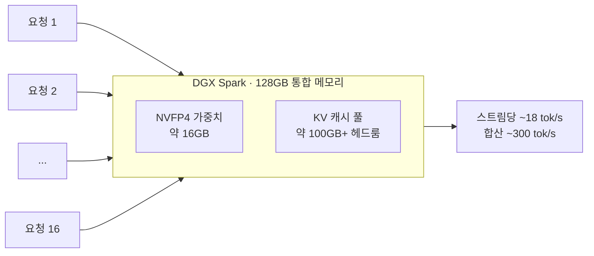

⏱️ **예상 읽기 시간**: 12분

## 개요

데스크 위에 올라가는 작은 박스 한 대로 대형 MoE 모델을 16개 세션 동시에 돌리는 데모가 화제가 됐습니다. NVIDIA가 공개한 `Gemma-4-26B-A4B-NVFP4`를 DGX Spark 한 대(128GB 통합 메모리)에서 16배 병렬로 추론해 스트림당 약 18토큰/초, 합산 약 300토큰/초를 뽑아낸 사례입니다. 공개자는 동시성이 너무 높아 화면으로는 보여주기 어려워 프로그래밍적으로 데모했고, 최대 32배까지 늘릴 수 있으며 아직 flashinfer조차 적용하지 않은 상태라고 밝혔습니다.

이 글에서 짚고 싶은 핵심은 두 가지입니다. 첫째, 이건 노트북에서도 도는 초경량 E2B/E4B가 아니라 총 25.2B 파라미터의 **대형 Gemma MoE**라는 점입니다. 둘째, 이게 가능한 이유가 **NVFP4 4비트 양자화 + MoE의 작은 활성 파라미터 + DGX Spark의 큰 통합 메모리**라는 세 박자의 조합이라는 점입니다.

ThakiCloud는 Kubernetes 위에서 멀티테넌트로 LLM을 서빙하는 플랫폼을 운영합니다. 그래서 "작은 온프렘 박스 한 대로 동시 요청을 얼마나 받을 수 있는가"는 그냥 신기한 데모가 아니라 비용 모델과 직결되는 질문입니다. 이 글은 모델 팩트를 정리하고, 실제 성능을 단일 스트림과 동시성으로 나눠 보고, DGX Spark가 다른 Blackwell GPU 대비 정말 가성비가 좋은지, 그리고 우리 스킬 생태계에서 이 모델을 어디까지 쓸 수 있는지 솔직하게 리뷰합니다.

## 무엇을 본 데모인가

원본 데모([Google Gemma 팀 트윗](https://x.com/googlegemma/status/2069452783523401804))의 주장을 정리하면 다음과 같습니다.

- 하드웨어: **DGX Spark 1대, 128GB 통합 메모리(GB10 Grace-Blackwell)**
- 모델: [`nvidia/Gemma-4-26B-A4B-NVFP4`](https://huggingface.co/nvidia/Gemma-4-26B-A4B-NVFP4)
- 동시성: **16배 병렬**, 스트림당 **약 18토큰/초**, 합산 **약 300토큰/초**
- 확장 여지: **최대 32배**까지 가능하나 화면 가독성 때문에 16배로 시연
- 최적화 여지: 아직 **flashinfer 미적용** → 지원이 붙으면 더 빨라질 수 있음

여기서 오해하기 쉬운 부분을 미리 정리합니다. "스트림당 18토큰/초"는 16개를 동시에 돌릴 때의 값이고, 단일 스트림 한 개만 돌리면 더 빠릅니다. 동시성과 단일 지연의 트레이드오프는 뒤에서 실측 수치로 따로 다룹니다.

## Gemma-4-26B-A4B-NVFP4 모델 팩트

NVIDIA가 올린 모델은 Google DeepMind의 `gemma-4-26B-A4B-it`를 NVIDIA Model Optimizer로 NVFP4 양자화한 버전입니다. 모델카드 기준 핵심 스펙은 다음과 같습니다.

| 항목 | 값 |
|---|---|
| 베이스 모델 | google/gemma-4-26B-A4B-it |
| 아키텍처 | Mixture-of-Experts (Transformer) |
| 총 파라미터 | 25.2B |
| 활성 파라미터 | 3.8B (토큰당) |
| 전문가 구성 | 128개 중 8개 활성 + 1개 공유 |
| 레이어 | 30 |
| 컨텍스트 | 256K 토큰 |
| 슬라이딩 윈도우 | 1024 토큰 |
| 입력 모달리티 | 텍스트 + 이미지 |
| 양자화 | NVFP4 (Model Optimizer v0.43.0) |
| 타깃 하드웨어 | NVIDIA Blackwell |
| 라이선스 | Apache 2.0 |

### NVFP4가 무엇이고 왜 Blackwell이어야 하는가

NVFP4는 NVIDIA가 Blackwell 세대에서 하드웨어로 가속하는 4비트 부동소수점 포맷입니다. 단순히 가중치를 4비트 정수로 자르는 INT4 양자화와 달리, 작은 블록 단위로 FP8 스케일을 두는 마이크로스케일링 방식이라 4비트 수준의 메모리 절감을 누리면서도 정확도 손실을 작게 유지합니다.

효과는 메모리에서 가장 직접적으로 나타납니다. 25.2B 파라미터를 BF16으로 올리면 약 50GB가 필요하지만, NVFP4로 누르면 가중치가 약 **14~16GB**까지 줄어듭니다. DGX Spark의 128GB 통합 메모리에서 가중치가 16GB대면, 나머지 100GB 이상을 전부 KV 캐시에 쓸 수 있습니다. 바로 이 헤드룸이 16~32배 동시성과 256K 장문 컨텍스트를 받아내는 토대입니다.

다만 NVFP4의 하드웨어 가속은 Blackwell 전용입니다. Hopper(H100)나 Ada(RTX 4090) 같은 이전 세대에서는 NVFP4 텐서코어 경로가 없어 이 포맷의 이점을 그대로 얻을 수 없습니다. 즉 이 모델은 사실상 "Blackwell에서 돌리라고 만든" 빌드입니다.

### 벤치마크: NVFP4 양자화 손실은 작은가

모델카드는 NVFP4 양자화본과 baseline(비양자화)을 나란히 제시합니다.

| 벤치마크 | NVFP4 | Baseline | 측정 영역 |
|---|---|---|---|
| AIME 2025 | 90.00% | 88.95% | 수학 경시 |
| MMLU Pro | 84.80% | 85.00% | 일반 지식·추론 |
| IFBench | 78.1% | 77.77% | 지시 이행 |
| GPQA Diamond | 79.90% | 80.30% | 대학원 과학 추론 |

네 항목 모두 baseline과 1%p 안쪽 차이입니다. AIME·IFBench는 오히려 양자화본이 근소하게 높은데, 이는 측정 분산 범위로 보는 편이 안전합니다. 핵심은 "4비트로 눌러도 품질이 사실상 유지된다"는 방향성이고, NVFP4가 INT4 대비 갖는 강점이 여기서 드러납니다. 단, 한국어 도메인 태스크는 공개 벤치에 드러나지 않으므로 내부 평가셋으로 별도 검증을 권장합니다.

## 실제 성능: 단일 스트림 대 동시성

데모의 "스트림당 18토큰/초"만 보면 느리다고 오해하기 쉽습니다. 단일 스트림과 동시성을 분리해서 봐야 합니다. DGX Spark에서 이 모델을 측정한 커뮤니티 리포트를 종합하면 다음과 같습니다.

- **단일 스트림 기본**: 약 32토큰/초 (MTP 미적용, 64k 설정 기준)
- **단일 스트림 + MTP(Multi-Token Prediction)**: 약 **55~61토큰/초** (32k 설정, 짧은~중간 응답·구조화 JSON에서 최대)
- **16배 동시성**: 스트림당 약 18토큰/초, **합산 약 300토큰/초**
- **장문 프리필**: 25k 입력 약 11.9초, 50k 입력 약 28.6초 (64k 설정 기준)

여기서 두 가지 사실이 보입니다.

첫째, **MoE 디코딩은 메모리 대역폭 병목**입니다. 토큰당 활성 파라미터가 3.8B로 작아 연산량(FLOPs)은 적지만, 매 토큰마다 활성 전문가 가중치를 메모리에서 읽어와야 합니다. DGX Spark의 LPDDR5X 통합 메모리 대역폭은 데이터센터 HBM 대비 낮아, 단일 스트림 속도가 "Blackwell치고는" 보수적으로 나오는 이유가 여기에 있습니다. FP4 연산 능력이 남아돌아도 대역폭이 천장을 만듭니다.

둘째, 그래서 **이 박스의 진짜 강점은 단일 지연이 아니라 동시 처리량**입니다. 16배를 돌려도 합산 300토큰/초가 나온다는 건, 대역폭을 여러 요청이 나눠 쓰며 효율을 끌어올린다는 뜻입니다. 큰 통합 메모리로 KV 캐시를 넉넉히 확보할 수 있기에 가능한 그림입니다. 즉 "한 사람에게 빠른 응답"보다 "여러 에이전트·여러 사용자에게 동시에 충분한 응답"이 이 하드웨어의 결입니다.

## 솔직 리뷰 ①: DGX Spark는 정말 가성비가 좋은가

결론부터 말하면 **"메모리 용량당 가성비는 탁월, 토큰당 지연 가성비는 보통"**입니다. 같은 Blackwell 세대라도 칩마다 성격이 다릅니다.

| 칩 | 가격(USD) | 메모리 | 대역폭 | NVFP4 MoE 현황(2026-06) | 성격 |
|---|---|---|---|---|---|
| **DGX Spark** (GB10, SM121) | 약 $4,699 | 128GB 통합 LPDDR5X | 273 GB/s | ✅ 동작 (vLLM Marlin 백엔드) | 큰 메모리·동시성, 낮은 대역폭 |
| **RTX 5090** (SM120) | 약 $2,000 [추정] | 32GB GDDR7 | 1,792 GB/s | ⚠️ 현재 불안정 (flashinfer #2577) | 최고 $/토큰 잠재력, 작은 VRAM |
| **RTX PRO 6000** Blackwell (SM120) | 약 $8,500 | 96GB GDDR7 | 1,792 GB/s | ⚠️ 동일 SM120 이슈 | 큰 VRAM, 이 모델엔 과잉 |
| **B200** (SM100, 데이터센터) | 클라우드 약 $3~10/시간 [추정] | 192GB HBM3e | 8,000 GB/s | ✅ 완전 지원 (TRT-LLM/flashinfer) | 최강 성능, 단가 자릿수 차이 |

이 표에서 가장 중요한 칸은 가격이 아니라 **"NVFP4 MoE 현황"** 입니다. 종이 위 계산과 현실이 갈리는 지점이기 때문입니다.

- **종이 위 계산으로는 RTX 5090이 $/토큰 최강입니다.** 대역폭이 DGX Spark의 6.6배(1,792 vs 273 GB/s)인데, MoE 디코딩은 대역폭 병목이라 이론 천장이 거의 그대로 따라옵니다. 16GB 가중치를 273 GB/s로 읽으면 이론상 약 170토큰/초, 1,792 GB/s면 약 1,100토큰/초가 천장입니다. 가격은 절반이니 단순 계산상 5090이 5~6배 유리합니다.
- **그러나 현실에서는 소비자·프로 Blackwell(SM120)에서 NVFP4 MoE 커널이 아직 깨져 있습니다.** flashinfer의 NVFP4 GEMM이 SM120에서 정상 동작하지 않는 이슈([#2577](https://github.com/flashinfer-ai/flashinfer/issues/2577))가 열려 있어, RTX 5090·RTX PRO 6000에서는 이 4비트 MoE를 제대로 돌리기 어렵습니다. 즉 종이 위 가성비 1등이 실전에서는 "현재로선 못 돌림"에 가깝습니다.
- **그래서 지금 NVFP4 MoE가 실제로 도는 유일한 소비자급 박스가 DGX Spark(SM121)** 입니다. 대역폭이 낮아 속도는 보수적이지만, "오늘 당장 동작하는 4비트 MoE 박스"라는 점이 데모가 DGX Spark에서 나온 진짜 이유입니다.
- **데이터센터 Blackwell(B200, SM100)** 은 TRT-LLM·flashinfer NVFP4 지원이 출하돼 완전히 동작하지만 단가가 자릿수 단위로 다릅니다. 24/7 자가 서빙이면 소유 하드웨어가, 버스트·멀티테넌트면 클라우드 B200이 유리합니다.

정리하면 DGX Spark는 "프론티어 속도를 사는 기계"가 아니라 **"큰 메모리와 동시성을, 그것도 오늘 동작하는 형태로 싸게 사는 개발·프로토타이핑·소규모 동시 서빙 기계"** 입니다. SM120 커널이 고쳐지면 RTX 5090의 종이 위 가성비가 실전으로 내려오겠지만, 그 전까지 DGX Spark의 위치는 분명합니다. 16배 병렬 데모가 인상적인 이유도 정확히 이 강점 위에 서 있습니다.

## 솔직 리뷰 ②: 그래서 어떤 작업에 쓸 수 있나

가성비 성격이 정해지면 적합 작업도 정해집니다.

**잘 맞는 작업**

- 다수 에이전트 동시 실행: 16~32개 워커가 각자 적당한 속도로 동시에 도는 패턴. 합산 처리량이 강점입니다.
- 구조화 출력 워크로드: 모델카드 기준 function calling과 JSON 구조화 출력을 지원하고, MTP가 짧은~중간 응답·control JSON에서 가장 빠릅니다. 분류·태깅·추출 같은 정형 작업에 적합합니다.
- 장문 컨텍스트 처리: 256K 컨텍스트와 큰 KV 헤드룸 덕분에 긴 문서 요약·RAG 컨텍스트 주입에 여유가 있습니다.
- 온프렘 프로토타이핑: 데이터센터 GPU 없이 책상 위에서 대형 MoE 서빙을 실험할 수 있습니다.

**잘 안 맞는 작업**

- 단일 사용자 초저지연 채팅: 스트림당 속도가 GDDR7 카드보다 느립니다. "한 명에게 가장 빠른 응답"이 목표면 부적합합니다.
- 최고 난도 단발 추론: 품질 상한이 필요한 작업은 31B Dense나 더 큰 모델, 혹은 클로즈드 플래그십이 낫습니다. 26B는 처리량형 등급입니다.

## 서빙 가이드

모델카드 기준 권장 경로는 vLLM입니다. 단, 현재 명시된 제약이 있습니다.

- **vLLM TP=1 전용**: 현재 빌드는 텐서 병렬 1만 지원합니다(단일 GPU/단일 박스 전제).
- **Gemma 4 전용 파서 필요**: 실행 시 `--tool-call-parser gemma4`와 `--reasoning-parser gemma4` 플래그를 지정해야 function calling·추론 출력이 올바로 파싱됩니다.
- **flashinfer 미적용 상태**: 데모 공개자도 아직 flashinfer를 쓰지 않았다고 밝혔습니다. 어텐션 커널 최적화가 붙으면 추가 가속 여지가 있습니다.

운영 시에는 OS는 Linux, 하드웨어는 Blackwell(NVFP4 텐서코어)이 전제입니다. 이전 세대 GPU로는 이 빌드의 4비트 가속 이점을 얻지 못합니다.

## ThakiCloud K8s AI/ML SaaS 플랫폼 적용 시사점

ThakiCloud는 Kueue로 GPU 쿼터를 관리하고 vLLM으로 모델을 서빙하는 멀티테넌트 플랫폼을 운영합니다. 이 데모가 우리 운용 모델에 주는 시사점은 세 가지입니다.

**워커 등급 모델의 self-hosting 후보.** 우리 에이전트 오케스트레이션은 비용 규율상 "워커는 싸게, 게이트는 비싸게"를 따릅니다. 탐색·분류·요약·구조화 추출 같은 워커 작업은 굳이 최상위 모델을 쓸 필요가 없습니다. NVFP4 26B는 합산 300토큰/초의 동시 처리량과 function calling·JSON 출력을 갖춰, 다수 워커를 온프렘에서 동시에 돌리는 후보로 적합합니다. 검증(verify)·합성·아키텍처 판단 같은 고위험 단계만 상위 모델에 남기면, 토큰 비용을 구조적으로 낮출 수 있습니다.

**큰 통합 메모리가 멀티테넌트 KV 예산을 단순화.** 128GB 통합 메모리에서 가중치가 16GB대라면 KV 캐시 헤드룸이 100GB를 넘습니다. 동시 세션이 많은 멀티테넌트 환경에서 KV 캐시는 가장 먼저 마르는 자원인데, 이 헤드룸은 테넌트별 동시성 한도를 넉넉히 잡게 해 줍니다.

**온프렘·컴플라이언스 제안의 레퍼런스.** Apache 2.0 라이선스 + 단일 박스 서빙은 self-hosting을 전제로 하는 공공·금융 고객에게 그대로 제안할 수 있는 구성입니다. 데이터센터 GPU 없이 작은 박스로 대형 MoE를 돌릴 수 있다는 점은, 국정원 요구 대응·데이터 외부 반출 금지 같은 제약 환경에서 실질적인 도입 경로가 됩니다.

## 솔직 리뷰 ③: 우리 스킬 생태계에서 이 모델은 어디까지 쓰나

ThakiCloud의 스킬·에이전트 생태계는 대부분 Opus/Sonnet 같은 상위 모델을 메인으로 씁니다. 그렇다면 NVFP4 26B는 어디에 끼워 넣을 수 있을까요. 솔직하게 등급을 나누면 다음과 같습니다.

- **바로 대체 가능(워커 티어)**: 파일 읽기·grep 요약, 분류·enum 정규화(포맷 결정론 워커), 1차 초안 생성, 뉴스·문서 추출. 현재 haiku/sonnet 서브에이전트가 맡는 read-only·정형 작업을 온프렘 26B로 상당 부분 옮길 수 있습니다.
- **조건부 가능(검증 보강 시)**: 에이전트 툴콜 워커. function calling·JSON 출력을 지원하므로 도구 호출 루프의 말단 워커로 쓸 수 있습니다. 단 fan-out 결과는 반드시 상위 모델의 adversarial verify로 닫아야 합니다(워커 환각 누적 방지).
- **권장하지 않음(게이트 티어)**: 멀티스텝 아키텍처 추론, 합성·검증 판정, 고위험 콘텐츠 생성. 품질 상한이 필요한 단계는 Opus에 남깁니다.

핵심은 모델 등급과 작업 등급을 맞추는 것입니다. NVFP4 26B를 "Opus 대체"로 보면 실망하지만, "haiku/sonnet 워커 티어의 온프렘 self-hosting 후보"로 보면 비용 구조를 바꿀 수 있는 카드입니다. 우리 라우팅 규율(탐색=싸게, 게이트=비싸게)과 정확히 같은 방향입니다.

## 한계 및 반론

균형을 위해 짚을 부분입니다.

- **단일 스트림 속도는 보수적입니다.** 대역폭 병목 탓에 GDDR7 카드보다 느립니다. 지연 민감 워크로드에는 하드웨어 선택을 다시 해야 합니다.
- **데모 수치는 설정 의존적입니다.** 18토큰/초·300토큰/초는 16배 동시성·특정 설정의 값이며, 프롬프트 길이·출력 길이·MTP 적용 여부에 따라 달라집니다. 자체 워크로드로 재측정해야 합니다.
- **vLLM TP=1·flashinfer 미적용은 현재 시점의 제약입니다.** 최적화가 붙으면 수치가 바뀔 수 있으니 "현재 스냅샷"으로 읽어야 합니다.
- **MoE 서빙의 운영 난이도.** active 3.8B라 해도 전체 가중치를 메모리에 상주시켜야 하고, 전문가 라우팅이 배치 효율에 영향을 줍니다. "작다"는 단순 해석은 위험합니다.
- **한국어 실사용 검증 필요.** 공개 벤치는 영어권 중심입니다. 한국어 RAG·툴콜 정확도는 내부 평가셋으로 따로 봐야 합니다.

그럼에도 Apache 2.0, 단일 박스 대형 MoE 서빙, 큰 메모리 기반 동시성이라는 조합은 온프렘·self-hosting을 고민하는 조직에게 충분히 매력적인 선택지입니다. "프론티어 속도"가 아니라 "싼 메모리와 동시성"을 산다는 관점으로 접근하면, DGX Spark + NVFP4 26B는 분명한 쓸모가 있습니다.

## 참고 링크

- [Gemma-4-26B-A4B-NVFP4 모델카드 (Hugging Face)](https://huggingface.co/nvidia/Gemma-4-26B-A4B-NVFP4)
- [원본 데모 트윗 (Google Gemma)](https://x.com/googlegemma/status/2069452783523401804)
- [Gemma 4 전체 라인업 정리 (ThakiCloud 블로그)](https://thakicloud.github.io/owm/gemma-4-open-weight-lineup/)
- [NVIDIA TensorRT Model Optimizer](https://github.com/NVIDIA/TensorRT-Model-Optimizer)
- [NVFP4 소개 (NVIDIA Developer)](https://developer.nvidia.com/blog/introducing-nvfp4-for-efficient-and-accurate-low-precision-inference/)
- [flashinfer NVFP4 GEMM SM120 이슈 #2577](https://github.com/flashinfer-ai/flashinfer/issues/2577)
- [DGX Spark Gemma 4 26B NVFP4 벤치마크 (ai-muninn)](https://ai-muninn.com/en/blog/dgx-spark-gemma4-26b-nvfp4-52-toks)
