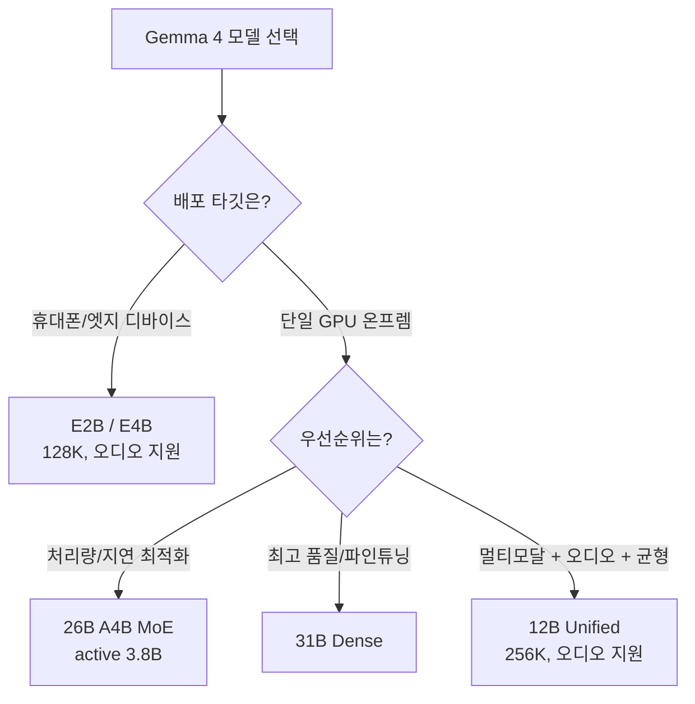

⏱️ **예상 읽기 시간**: 10분

## Gemma 4 개요

Google DeepMind가 2026년 4월 2일 공개한 Gemma 4는 지금까지 나온 Gemma 패밀리 중 가장 지능이 높은 오픈웨이트 모델군입니다. Google은 이 모델을 Gemini 3와 동일한 연구·기술 기반으로 만들었다고 밝혔습니다. 즉, 클로즈드 플래그십에 들어간 학습 레시피를 오픈웨이트로 증류해 내려보낸 라인업으로 보면 됩니다.

이번 세대에서 ThakiCloud 관점으로 가장 큰 변화는 두 가지입니다. 첫째, 라이선스가 **Apache 2.0**으로 바뀌었습니다. 이전 Gemma 세대가 별도의 Gemma 사용 약관을 달고 있었던 것과 달리, Gemma 4는 상업적으로 관대한 표준 오픈소스 라이선스를 채택했습니다. 둘째, 단일 사이즈가 아니라 **엣지(휴대폰)부터 단일 서버 GPU까지** 커버하는 5종 라인업으로 출시됐습니다. 같은 모델 패밀리 안에서 디바이스 등급별로 배포 타깃을 고를 수 있다는 뜻입니다.

이 글은 특정 한 모델을 깊게 파는 대신, **5종 전체 라인업을 한눈에 비교하고 어떤 상황에 어떤 모델을 골라야 하는지** 정리하는 것을 목표로 합니다.

## Gemma 4 라인업: 5종 모델 전체

Gemma 4는 다음 5종으로 구성됩니다. 파라미터·컨텍스트·모달리티·아키텍처를 모델카드 기준으로 정리하면 다음과 같습니다.

| 모델 | 파라미터 | 컨텍스트 | 입력 모달리티 | 아키텍처 |
|---|---|---|---|---|
| **E2B** | 2.3B effective (임베딩 포함 5.1B) | 128K | 텍스트 + 이미지 + 오디오 | Dense |
| **E4B** | 4.5B effective (임베딩 포함 8B) | 128K | 텍스트 + 이미지 + 오디오 | Dense |
| **12B Unified** | 11.95B | 256K | 텍스트 + 이미지 + 오디오 | Dense |
| **26B A4B** | 총 25.2B / active 3.8B | 256K | 텍스트 + 이미지 | MoE (128 전문가 중 8 활성) |
| **31B Dense** | 30.7B | 256K | 텍스트 + 이미지 | Dense |

출력은 5종 모두 텍스트입니다. 오디오 입력은 E2B, E4B, 12B 세 모델만 지원하고, 26B와 31B는 텍스트와 이미지까지 처리합니다.

`E2B`와 `E4B`의 "E"는 effective(유효 파라미터)를 뜻합니다. 임베딩 테이블을 제외한 실제 연산 파라미터 기준 사이즈로, 메모리·연산 예산을 가늠할 때 effective 값을 보는 편이 현실적입니다. 두 모델은 휴대폰·노트북 같은 엣지 디바이스를 정조준한 등급입니다.

라인업의 핵심은 상위 두 모델, 즉 **26B A4B(MoE)와 31B(Dense)의 분업**입니다.

- **26B A4B**는 Mixture-of-Experts입니다. 총 25.2B 파라미터를 갖되 토큰당 약 3.8B만 활성화합니다. 전체 가중치는 VRAM에 올려야 하지만, 토큰당 연산량(FLOPs)은 active 파라미터 기준이라 **지연(latency)과 처리량(throughput)에 유리**합니다. 대량 요청을 빠르게 흘려보내야 하는 서빙에 적합합니다.
- **31B Dense**는 모든 파라미터가 매 토큰에 관여하는 표준 Dense 모델입니다. 품질과 파인튜닝 적합성을 최대화하는 방향으로, Google은 31B를 라인업의 품질 상한으로 배치했습니다.

Google에 따르면 31B는 Arena AI 텍스트 리더보드에서 오픈 모델 세계 3위, 26B는 6위를 기록했으며, "자기 크기의 20배 모델과 경쟁한다"고 표현했습니다. 이런 리더보드 순위는 시점에 따라 바뀌므로 절대적인 수치로 받아들이기보다 "동급 대비 지능 밀도가 높다"는 방향성으로 읽는 편이 맞습니다.

### 모델 선택 흐름

## 아키텍처: 하이브리드 어텐션과 멀티모달

Gemma 4 5종은 공통적으로 **하이브리드 어텐션** 메커니즘을 사용합니다. 로컬 슬라이딩 윈도우 어텐션과 풀 글로벌 어텐션을 교대로 끼워 넣는(interleave) 구조입니다. 짧은 범위는 슬라이딩 윈도우로 저렴하게 처리하고, 주기적으로 글로벌 어텐션을 끼워 전체 컨텍스트 의존성을 잡는 방식으로, 긴 컨텍스트에서 메모리·연산 비용을 억제하는 데 목적이 있습니다. 상위 모델(12B/26B/31B)이 256K 컨텍스트를 감당하는 배경에는 이 설계가 있습니다.

멀티모달리티는 세대의 기본값입니다. 5종 모두 텍스트와 이미지를 입력으로 받고, 엣지·중형 등급(E2B/E4B/12B)은 오디오 입력까지 처리합니다. 에이전트 워크플로를 겨냥한 기능도 기본 탑재됐습니다. function calling, 구조화된 JSON 출력, 네이티브 시스템 인스트럭션을 공식 지원하며, 다단계 계획(multi-step planning)과 논리 추론에서 이전 세대 대비 개선을 강조합니다. 학습 데이터 컷오프는 2025년 1월입니다.

언어 지원도 넓습니다. 기본 제공(out-of-the-box) 35개 이상 언어, 사전학습 기준 140개 이상 언어를 다룹니다. 한국어 운용 시 실제 품질은 직접 평가가 필요하지만, 다국어 커버리지 자체는 넓은 편입니다.

## 벤치마크

Google이 공개한 31B instruction-tuned 모델 대표 벤치마크는 다음과 같습니다. 모델카드 기재값 기준입니다.

| 벤치마크 | 31B (IT) | 측정 영역 |
|---|---|---|
| MMLU-Pro | 85.2% | 일반 지식·추론 |
| GPQA Diamond | 84.3% | 대학원 수준 과학 추론 |
| LiveCodeBench v6 | 80.0% | 코드 생성 |
| MATH-Vision | 85.6% | 시각 기반 수학 |
| Codeforces (ELO) | 2150 | 경쟁 프로그래밍 |

31B 단일 노드 규모에서 GPQA Diamond 84.3%, MMLU-Pro 85.2%는 동급 오픈웨이트 중 상위권입니다. 다만 벤치마크는 instruction-tuned 변형 기준이며, 실제 도메인 태스크 성능은 별개로 검증해야 합니다. 특히 한국어 추론·코딩 태스크는 공개 벤치에 직접 드러나지 않으므로 내부 평가셋으로 측정하는 것을 권장합니다.

## 서빙 및 배포

Gemma 4는 출시 시점부터 광범위한 서빙 생태계 지원을 확보했습니다. 공식 지원 경로는 다음과 같습니다.

- **추론 서버**: vLLM, SGLang, llama.cpp, Ollama, LM Studio, NVIDIA NIM
- **프레임워크**: Hugging Face Transformers / TRL / Transformers.js / Candle, Keras, MaxText, NeMo
- **엣지·온디바이스**: LiteRT-LM, Cactus
- **파인튜닝·양자화**: Unsloth, Tunix
- **배포 인프라**: Docker, Baseten, Google Cloud(Vertex AI)

가중치는 [Hugging Face의 google/gemma-4 컬렉션](https://huggingface.co/collections/google/gemma-4), Kaggle, Ollama에서 받을 수 있습니다.

### 온프렘 GPU 요구사항 (추정)

각 모델의 BF16 가중치 메모리를 기준으로 한 대략적인 온프렘 배포 가이드입니다. KV 캐시·런타임 오버헤드를 제외한 가중치 추정치이므로, 실제 배포 시에는 컨텍스트 길이와 동시 요청 수에 맞춰 여유를 둬야 합니다.

| 모델 | BF16 가중치(추정) | 현실적 온프렘 시작점 |
|---|---|---|
| E2B / E4B | 약 5~16GB [추정] | 소비자급 GPU·노트북·휴대폰(LiteRT) |
| 12B Unified | 약 24GB [추정] | 단일 24GB GPU(RTX 4090/L4 급), 양자화 시 여유 |
| 26B A4B (MoE) | 약 50GB [추정] | 단일 H100/A100 80GB 1장 |
| 31B Dense | 약 62GB [추정] | 단일 H100/A100 80GB 1장 |

상위 두 모델(26B, 31B) 모두 **단일 80GB GPU 1장**에 BF16으로 올라간다는 점이 라인업의 실용적 강점입니다. 멀티노드 텐서 병렬 없이 단일 서버로 프론티어급 추론을 돌릴 수 있다는 의미이고, 온프렘 도입 장벽을 크게 낮춥니다. 더 작은 GPU 예산이라면 12B 또는 양자화(GGUF Q4/Q8) 경로로 내려가면 됩니다. 26B는 MoE 특성상 active 3.8B만 연산하므로 같은 VRAM이라도 31B Dense보다 토큰당 throughput이 유리합니다.

## ThakiCloud K8s AI/ML SaaS 플랫폼 적용 시사점

Gemma 4 라인업은 ThakiCloud의 멀티테넌트 서빙 전략과 잘 맞물립니다. 세 가지 관점에서 의미가 있습니다.

**Apache 2.0이 푸는 도입 장벽.** 프론티어급 오픈웨이트가 표준 Apache 2.0으로 풀린 것은 엔터프라이즈·온프렘 도입에서 매우 중요합니다. 별도 사용 약관 검토 부담 없이 상용 서비스에 임베드하고 파인튜닝 산출물을 자유롭게 배포할 수 있습니다. 국내 공공·금융처럼 라이선스 컴플라이언스가 까다로운 환경, 그리고 self-hosting을 전제로 하는 온프렘 고객에게 그대로 제안할 수 있는 모델군입니다.

**라인업 자체가 멀티테넌트 GPU 라우팅과 정합.** ThakiCloud는 Kueue로 GPU 쿼터를 관리하고 vLLM으로 모델을 서빙합니다. Gemma 4의 5종 라인업은 테넌트 요구사항(지연 민감·품질 우선·엣지 추론)에 맞춰 동일 패밀리 안에서 모델 등급을 라우팅할 수 있는 구조입니다. 가벼운 채팅·요약은 12B로, 처리량이 중요한 배치는 26B MoE로, 고난도 추론·코딩은 31B로 분배하면, 동일 토크나이저·동일 프롬프트 포맷을 유지하면서 GPU 예산을 태스크 등급별로 최적화할 수 있습니다.

**단일 80GB GPU 서빙이 비용 모델을 단순화.** 26B와 31B가 단일 H100/A100 1장에 올라간다는 점은 Kueue GPU 잡 비용 산정을 단순하게 만듭니다. 멀티노드 텐서 병렬 구성의 통신 오버헤드와 스케줄링 복잡도가 사라지므로, 테넌트별 전용 GPU 1장 할당 모델로 가격을 깔끔하게 책정할 수 있습니다. 26B MoE의 active 3.8B 특성은 같은 GPU에서 더 많은 동시 요청을 받을 수 있다는 뜻이라, per-request 단가 측면에서도 유리합니다.

정리하면, Gemma 4는 ThakiCloud가 "단일 GPU 온프렘 + 멀티테넌트 모델 라우팅"이라는 운용 패턴을 고객에게 제안할 때 레퍼런스 모델군으로 쓰기에 적합합니다.

## 한계 및 반론

균형을 위해 짚어야 할 부분도 있습니다.

- **벤치마크와 실사용의 간극.** 공개 수치는 instruction-tuned·영어권 벤치 중심입니다. 한국어 도메인 태스크, 특히 RAG·에이전트 툴콜 정확도는 자체 평가셋으로 재측정해야 합니다.
- **MoE 서빙의 운영 난이도.** 26B A4B는 토큰당 연산은 적지만 전체 가중치를 VRAM에 상주시켜야 하고, 전문가 라우팅이 배치 효율과 메모리 패턴에 영향을 줍니다. "active 3.8B니까 작다"는 식의 단순 해석은 위험합니다.
- **오디오 지원의 비대칭.** 오디오 입력은 E2B/E4B/12B에만 있습니다. 상위 품질(26B/31B)과 오디오를 동시에 원한다면 라인업 안에서 트레이드오프가 발생합니다.
- **학습 컷오프 2025년 1월.** 최신 정보가 필요한 태스크는 RAG·툴 연동으로 보완해야 합니다.

그럼에도 Apache 2.0 라이선스, 단일 GPU 서빙 가능성, 엣지부터 서버까지 잇는 라인업 구성은 온프렘·self-hosting을 고려하는 조직에게 Gemma 4를 우선 검토 대상으로 올릴 만한 충분한 이유가 됩니다.

## 참고 링크

- [Gemma 4 공식 발표 블로그 (Google)](https://blog.google/innovation-and-ai/technology/developers-tools/gemma-4/)
- [Gemma 4 모델카드 (Google AI for Developers)](https://ai.google.dev/gemma/docs/core/model_card_4)
- [Gemma 4 모델 개요 문서](https://ai.google.dev/gemma/docs/core)
- [Hugging Face google/gemma-4 컬렉션](https://huggingface.co/collections/google/gemma-4)
- [Google DeepMind Gemma GitHub 라이브러리](https://github.com/google-deepmind/gemma)
- [Google Cloud의 Gemma 4 지원 안내](https://cloud.google.com/blog/products/ai-machine-learning/gemma-4-available-on-google-cloud)
