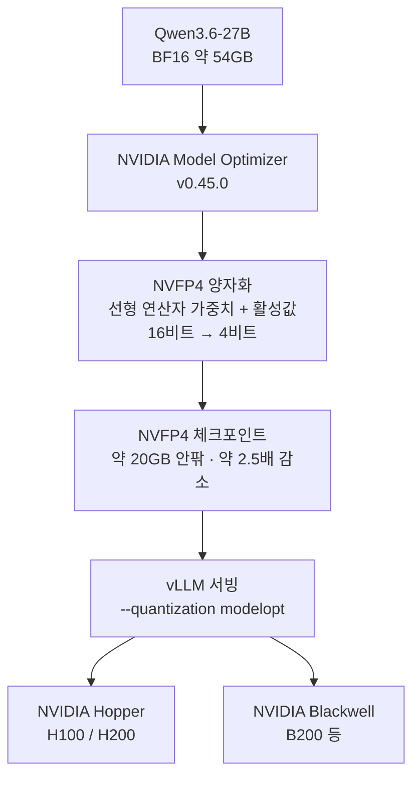

⏱️ **예상 읽기 시간**: 11분


## 개요

NVIDIA가 Alibaba의 Qwen3.6-27B을 NVFP4 4비트로 양자화한 `nvidia/Qwen3.6-27B-NVFP4`를 공개했습니다. 27B급 하이브리드 어텐션 추론 모델을 4비트로 눌러 가중치 메모리를 약 2.5배 줄이면서, FP8 기준선 대비 아홉 개 벤치마크 전부에서 차이를 1%p 이내로 유지합니다. 라이선스는 Apache 2.0입니다.

이 글에서 짚고 싶은 지점은 세 가지입니다. 첫째, 지난번 `Gemma-4-26B-A4B-NVFP4`가 사실상 Blackwell에서만 4비트 가속을 받았던 것과 달리, 이번 빌드는 모델카드에서 **Hopper와 Blackwell을 함께 지원 대상**으로 명시합니다. 이미 H100이나 H200을 굴리는 조직이 새 하드웨어를 사지 않고도 오늘 당장 시험해 볼 수 있다는 뜻입니다. 둘째, 이 모델은 텍스트만 다루는 순수 LLM이 아니라 **텍스트와 이미지, 비디오를 입력받는 멀티모달 추론 모델**입니다. 셋째, 컨텍스트가 **262K 토큰**까지 열려 있어 긴 문서와 장기 대화를 한 번에 받아냅니다.

ThakiCloud는 Kubernetes 위에서 Kueue로 GPU 쿼터를 관리하고 vLLM으로 모델을 멀티테넌트 서빙하는 플랫폼을 운영합니다. 그래서 "기존에 가진 GPU 위에서 더 큰 모델을, 더 많은 테넌트에게 얼마나 얹을 수 있는가"는 신기한 소식이 아니라 비용 모델과 직결되는 질문입니다. 이 글은 모델 팩트를 정리하고, NVFP4가 왜 Hopper까지 내려왔는지 따져 본 뒤, 서빙 경로와 우리 플랫폼에서의 쓸모를 솔직하게 리뷰합니다.

## 이 모델은 무엇인가

`nvidia/Qwen3.6-27B-NVFP4`는 Alibaba의 `Qwen3.6-27B`을 NVIDIA Model Optimizer(nvidia-modelopt v0.45.0)로 NVFP4 양자화한 버전입니다. 모델카드 기준 핵심 스펙은 다음과 같습니다.

| 항목 | 값 |
|---|---|
| 베이스 모델 | Alibaba Qwen3.6-27B |
| 아키텍처 | 하이브리드 어텐션 (Gated DeltaNet + Gated Attention) |
| 총 파라미터 | 27B |
| 컨텍스트 | 262K 토큰 |
| 입력 모달리티 | 텍스트 + 이미지 + 비디오 |
| 출력 | 텍스트 |
| 양자화 | NVFP4 (Model Optimizer v0.45.0) |
| 타깃 하드웨어 | NVIDIA Hopper, Blackwell |
| 라이선스 | Apache 2.0 |

주목할 부분은 아키텍처의 **하이브리드 어텐션**입니다. Gated DeltaNet은 선형 어텐션 계열로, 시퀀스 길이에 비례해 비용이 늘어나는 일반 어텐션과 달리 장문을 효율적으로 처리하도록 설계된 경로입니다. 여기에 표현력을 담당하는 Gated Attention을 섞어, 262K 같은 긴 컨텍스트를 감당하면서도 품질을 유지하는 절충을 취합니다. 서빙 시 `--reasoning-parser qwen3`를 요구한다는 점에서, 이 모델은 최종 답 이전에 추론 과정을 생성하는 **리즈닝 모델**이라는 것도 확인됩니다.

한 가지 정직하게 밝혀 둘 부분이 있습니다. 모델카드는 하이브리드 어텐션이라는 사실은 명시하지만, 정확한 레이어 수나 전문가(expert) 구성, 토큰당 활성 파라미터 같은 세부는 공개하지 않습니다. 따라서 이 글에서는 카드에 적힌 사실만 다루고, 미공개 수치는 추정하지 않습니다.

## NVFP4 양자화: 무엇을 어떻게 누르는가

NVFP4는 NVIDIA가 밀어붙이는 4비트 부동소수점 포맷입니다. 가중치를 4비트 정수로 단순 절단하는 INT4와 달리, 작은 블록 단위로 FP8 스케일을 두는 마이크로스케일링 방식이라 4비트 수준의 메모리 절감을 누리면서도 정확도 손실을 작게 억제합니다.

이번 빌드에서 양자화 대상은 **트랜스포머 블록 안 선형 연산자의 가중치와 활성값(activation)**입니다. 비선형 층은 건드리지 않습니다. 모델카드는 파라미터당 비트 수를 16에서 4로 줄여 디스크와 GPU 메모리 요구량을 **약 2.5배 감소**시킨다고 밝힙니다. 27B 파라미터를 BF16으로 올리면 약 54GB가 필요한데, 약 2.5배 감소를 적용하면 체크포인트가 20GB 안팎으로 내려옵니다. 같은 GPU에 모델을 2배 이상 얹거나, 남은 메모리를 KV 캐시로 돌려 동시 세션을 늘릴 여지가 생깁니다.

여기서 지난 Gemma NVFP4 리뷰와 갈리는 대목이 나옵니다. Gemma 빌드는 소비자·프로 Blackwell(SM120)에서 NVFP4 MoE 커널이 아직 깨져 있어, 실제로 도는 소비자급 경로가 DGX Spark에 한정됐습니다. 반면 이번 Qwen3.6 빌드는 모델카드가 **Hopper와 Blackwell을 함께 지원 대상으로 명시**하고, 서빙도 vLLM의 `--quantization modelopt` 경로를 씁니다. 가중치뿐 아니라 활성값까지 양자화한 구성과 modelopt 서빙 경로가 맞물리면서, 데이터센터에 이미 깔린 H100·H200 위에서도 이 4비트 모델을 돌릴 수 있게 된 것입니다. "새 Blackwell을 사야만 4비트 이득을 본다"는 제약이 이번에는 상당히 풀렸습니다.



## 벤치마크: 4비트 손실은 얼마인가

모델카드는 NVFP4 양자화본과 FP8 기준선을 아홉 개 벤치마크에서 나란히 제시합니다.

| 벤치마크 | FP8 | NVFP4 | 측정 영역 |
|---|---|---|---|
| MMLU Pro | 86.1 | 86.3 | 일반 지식·추론 |
| GPQA Diamond | 86.0 | 85.5 | 대학원 과학 추론 |
| HLE | 21.7 | 21.8 | 고난도 종합 |
| τ²-Bench Telecom | 95.2 | 95.4 | 에이전트 툴 사용 |
| MMMU Pro | 74.6 | 74.3 | 멀티모달 추론 |
| SciCode | 44.8 | 44.5 | 과학 코딩 |
| AIME 2025 | 93.1 | 92.7 | 수학 경시 |
| AA-LCR | 68.8 | 68.3 | 장문 추론 |
| IFBench | 65.1 | 65.5 | 지시 이행 |

아홉 항목 모두 FP8 대비 1%p 안쪽 차이입니다. MMLU Pro, HLE, τ²-Bench Telecom, IFBench는 오히려 NVFP4가 근소하게 높은데, 이는 측정 분산 범위로 읽는 편이 안전합니다. 방향성은 분명합니다. **4비트로 눌러도 품질이 사실상 유지된다**는 것이고, NVFP4가 INT4 대비 갖는 강점이 여기서 드러납니다.

벤치 구성 자체도 이 모델의 성격을 보여 줍니다. τ²-Bench Telecom은 에이전트가 도구를 호출하며 과제를 수행하는 능력을, AA-LCR은 장문 컨텍스트 추론을, MMMU Pro는 멀티모달 이해를 측정합니다. 순수 지식 QA만이 아니라 **에이전트 툴 사용과 장문, 멀티모달**을 함께 겨냥한 모델이라는 뜻입니다. 다만 한국어 도메인 태스크는 공개 벤치에 드러나지 않으므로, 실제 도입 전에는 내부 평가셋으로 별도 검증을 권장합니다.

## 서빙 가이드

모델카드가 제시하는 권장 경로는 vLLM입니다. 실행 명령은 다음과 같습니다.

```bash
vllm serve nvidia/Qwen3.6-27B-NVFP4 \
  --port 8000 \
  --quantization modelopt \
  --max-model-len 262144 \
  --reasoning-parser qwen3
```

운영에서 챙길 포인트는 세 가지입니다. 먼저 `--quantization modelopt`가 NVFP4 체크포인트를 로드하는 핵심 플래그입니다. 다음으로 `--reasoning-parser qwen3`가 있어야 추론 과정과 최종 답이 올바로 분리돼 파싱됩니다. 마지막으로 `--max-model-len 262144`는 262K 컨텍스트를 전부 여는 설정이며, KV 캐시 예산이 그만큼 커지므로 실제로 필요한 길이에 맞춰 낮춰 잡는 것이 메모리 효율에 유리합니다.

하드웨어는 Hopper 또는 Blackwell, OS는 Linux가 전제입니다. Hopper까지 지원한다는 점 덕분에, 데이터센터에 이미 있는 H100·H200 노드에서 별도 장비 없이 서빙 경로를 검증할 수 있습니다.

## ThakiCloud 서빙 관점

ThakiCloud는 Kueue로 GPU 쿼터를 관리하고 vLLM으로 모델을 멀티테넌트 서빙하는 K8s 기반 AI/ML 플랫폼을 운영합니다. 이 모델이 우리 운용 모델에 주는 시사점은 인프라와 에이전트 두 방향에서 나옵니다.

**기존 Hopper 자산 위에서 밀도를 2배 이상으로.** 이 부분이 이번 빌드의 가장 실질적인 가치입니다. NVFP4가 Hopper까지 지원한다는 것은, 새 Blackwell 투자 없이 이미 보유한 H100·H200 위에서 4비트 이득을 볼 수 있다는 뜻입니다. 27B 모델의 가중치가 20GB 안팎으로 내려오면 같은 GPU에 더 많은 모델 인스턴스를 올리거나, 남는 메모리를 KV 캐시로 돌려 테넌트별 동시성 한도를 넉넉히 잡을 수 있습니다. Kueue 쿼터 관점에서는 같은 카드로 더 많은 워크로드를 받는 셈이라 단가가 그대로 내려갑니다.

**멀티모달 추론 워커의 온프렘 후보.** ThakiCloud의 에이전트 제어 평면인 Paxis는 Agent-Native Cloud로, 스킬을 격리 샌드박스에서 실행하고 모든 행동을 정책 게이트와 감사 로그로 통과시킵니다. 이 구조에서 다수의 워커가 문서를 읽고 도구를 호출하며 과제를 처리합니다. Qwen3.6-27B-NVFP4는 τ²-Bench Telecom 같은 에이전트 툴 사용 벤치에서 강하고, 텍스트뿐 아니라 이미지와 비디오를 입력받으며, 262K 컨텍스트를 감당합니다. 문서·화면·영상을 함께 다루는 멀티모달 워커, 툴 호출 루프의 말단 워커로 온프렘에서 돌리기에 적합한 후보입니다. 다만 우리 비용 규율대로 워커는 싸게 돌리되, fan-out 결과는 상위 모델의 검증 단계로 닫아 워커 환각이 누적되지 않게 해야 합니다.

**온프렘·컴플라이언스 제안의 레퍼런스.** Apache 2.0 라이선스에 단일 노드 서빙이 가능한 구성은, 데이터 외부 반출이 금지된 공공·금융 고객에게 그대로 제안할 수 있습니다. 국정원 요구 대응이나 소버린 AI 같은 제약 환경에서, 상용 API 없이 자체 GPU로 대형 멀티모달 추론 모델을 돌린다는 그림은 실질적인 도입 경로가 됩니다.

## 한계 및 반론

균형을 위해 짚을 부분입니다.

- **아키텍처 세부가 공개되지 않았습니다.** 하이브리드 어텐션이라는 사실은 있지만 레이어 수, 전문가 구성, 활성 파라미터가 카드에 없습니다. 배치 효율과 메모리 상주량을 정밀하게 계산하려면 추가 정보가 필요합니다.
- **실측 처리량 수치가 없습니다.** 이 글은 메모리 절감과 벤치마크 같은 카드 팩트에 근거합니다. 스트림당 토큰 속도나 동시성 한도는 하드웨어와 설정에 따라 크게 달라지므로, 도입 전 자체 워크로드로 재측정해야 합니다.
- **활성값 양자화의 변동성.** 가중치뿐 아니라 활성값까지 4비트로 누르는 구성은 일부 분포가 치우친 워크로드에서 정확도 변동을 낳을 수 있습니다. 공개 벤치가 1%p 이내라 해도, 도메인 특화 태스크는 별도로 확인하는 편이 안전합니다.
- **멀티모달 서빙 경로의 성숙도.** 이미지·비디오 입력을 실제 프로덕션에서 안정적으로 받으려면 전처리 파이프라인과 vLLM 멀티모달 경로의 성숙도를 함께 검증해야 합니다.
- **한국어 실사용 검증.** 공개 벤치는 영어권 중심입니다. 한국어 RAG·툴콜 정확도는 내부 평가셋으로 따로 봐야 합니다.

그럼에도 Apache 2.0, Hopper까지 내려온 4비트 가속, 멀티모달 추론, 262K 컨텍스트라는 조합은 온프렘 서빙을 고민하는 조직에게 충분히 매력적인 선택지입니다. "새 하드웨어를 사야 4비트 이득을 본다"는 벽이 낮아졌다는 점만으로도, 이미 Hopper 플릿을 가진 팀에게는 오늘 검증해 볼 값어치가 있습니다.

## 참고 링크

- [Qwen3.6-27B-NVFP4 모델카드 (Hugging Face)](https://huggingface.co/nvidia/Qwen3.6-27B-NVFP4)
- [NVIDIA TensorRT Model Optimizer](https://github.com/NVIDIA/TensorRT-Model-Optimizer)
- [NVFP4 소개 (NVIDIA Developer)](https://developer.nvidia.com/blog/introducing-nvfp4-for-efficient-and-accurate-low-precision-inference/)
- [vLLM 공식 문서](https://docs.vllm.ai/)
- [Gemma-4-26B-NVFP4 DGX Spark 리뷰 (ThakiCloud 블로그)](https://thakicloud.github.io/ko/owm/gemma-4-26b-nvfp4-dgx-spark/)
